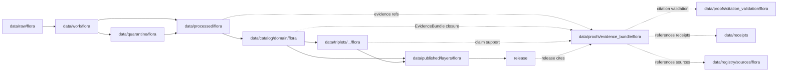

<!-- [KFM_META_BLOCK_V2]
doc_id: kfm://doc/data-proofs-evidence-bundle-flora-readme
title: data/proofs/evidence_bundle/flora/README.md — Flora EvidenceBundle Proofs README
version: v0.1
type: readme; proof-lane-guide; evidence-bundle-lane; flora-domain-proof-index; evidence-ref-resolution-lane; governed-answer-support-lane; sensitive-location-evidence-lane
status: draft; PROPOSED; data-root; proofs-root; evidence-bundle; flora; evidence-bundle-index; evidence-ref; claim-support; digest-closure; cite-or-abstain; source-role-aware; sensitivity-aware; rare-plant-aware; release-gated; evidence-first
authors: ChatGPT-5.5 Thinking; reviewed_by: OWNER_TBD
owners: OWNER_TBD — Flora steward · Evidence steward · EvidenceBundle steward · Proof steward · Sensitivity reviewer · Policy steward · Release steward · UI/Evidence Drawer steward · Docs steward
created: NEEDS VERIFICATION — blank placeholder existed before v0.1 expansion
updated: 2026-06-25
policy_label: restricted-doc; data; proofs; evidence-bundle; flora; evidence; sensitivity; lifecycle; governed; release-gated
tags: [kfm, data, proofs, evidence-bundle, flora, plants, rare-plants, sensitive-location, EvidenceBundle, EvidenceRef, EvidenceDrawerPayload, DecisionEnvelope, cite-or-abstain, claim-resolution, citation-closure, proof, claim-support, digest-closure, SourceDescriptor, CatalogMatrix, ReleaseManifest, ReviewRecord, CorrectionNotice, RollbackCard, PolicyDecision, ValidationReport, RedactionReceipt, PlantTaxon, FloraTaxonCrosswalk, FloraOccurrence, SpecimenRecord, RarePlantRecord, VegetationCommunity, InvasivePlantRecord, PhenologyObservation, RangePolygon, DistributionSurface, HabitatAssociation, BotanicalSurvey, RestorationPlanting, source-role, redaction, generalization, RAW, WORK, QUARANTINE, PROCESSED, CATALOG, TRIPLET, PUBLISHED]
related:
  - ../../README.md
  - ../../../README.md
  - ../README.md
  - ../../flora/README.md
  - ../../citation_validation/README.md
  - ../../citation_validation/flora/README.md
  - ../../../catalog/domain/flora/
  - ../../../processed/flora/
  - ../../../receipts/
  - ../../../registry/sources/flora/
  - ../../../published/layers/flora/
  - ../../../triplets/
  - ../../../../docs/architecture/ui/EVIDENCE_DRAWER.md
  - ../../../../docs/architecture/evidence-drawer.md
  - ../../../../docs/domains/flora/README.md
  - ../../../../docs/domains/flora/OBJECT_FAMILIES.md
  - ../../../../docs/domains/flora/SOURCE_REGISTRY.md
  - ../../../../docs/domains/flora/ARCHITECTURE.md
  - ../../../../docs/domains/flora/RELEASE_INDEX.md
  - ../../../../docs/domains/flora/MAP_UI_CONTRACTS.md
  - ../../../../docs/domains/flora/CANONICAL_PATHS.md
  - ../../../../docs/domains/flora/VERIFICATION_BACKLOG.md
  - ../../../../docs/domains/habitat/README.md
  - ../../../../docs/domains/fauna/README.md
  - ../../../../docs/domains/soil/README.md
  - ../../../../docs/domains/hydrology/README.md
  - ../../../../docs/domains/agriculture/README.md
  - ../../../../docs/domains/hazards/README.md
  - ../../../../contracts/domains/flora/
  - ../../../../schemas/contracts/v1/domains/flora/
  - ../../../../schemas/contracts/v1/evidence/evidence_bundle.schema.json
  - ../../../../schemas/contracts/v1/ui/evidence_drawer_payload.schema.json
  - ../../../../policy/domains/flora/
  - ../../../../policy/sensitivity/flora/
  - ../../../../release/candidates/flora/
  - ../../../../release/
  - ../../../../tools/validators/
notes:
  - "This file replaces a blank placeholder at `data/proofs/evidence_bundle/flora/README.md`."
  - "This is a Flora EvidenceBundle proof lane guide under `data/proofs/`. It supports Flora EvidenceBundle / EvidenceRef closure, claim support, digest closure, citation readiness, sensitivity-safe claim validation, and governed answer readiness. It is not RAW source storage, WORK scratch, QUARANTINE holding, PROCESSED data, CATALOG, TRIPLET, PUBLISHED output, receipt storage, source registry, policy authority, release authority, schema home, validator home, public API/UI output, public map/tile output, rare-plant discovery surface, exact-location disclosure surface, landowner/private-access surface, or stewardship decision authority."
  - "EvidenceBundle artifacts in this lane may reference SourceDescriptor, processed artifacts, catalog rows, triplets, receipts, policy decisions, review records, release manifests, redaction receipts, correction notices, and rollback cards; this lane does not own those records."
  - "Flora EvidenceBundle support must preserve sensitive-location posture: rare, protected, culturally sensitive, and steward-reviewed flora default to generalized, withheld, staged, or denied public geometry."
  - "The parent `data/proofs/evidence_bundle/README.md` is currently a greenfield stub, so global EvidenceBundle family behavior remains NEEDS VERIFICATION."
  - "This README is a proof-lane guide only. Contracts define semantic object meaning; schemas define machine shape; policy decides admissibility; release records decide publication."
  - "Rollback target for this expansion is previous blank placeholder blob SHA `8b137891791fe96927ad78e64b0aad7bded08bdc`."
[/KFM_META_BLOCK_V2] -->

<a id="top"></a>

# data/proofs/evidence_bundle/flora

> Flora EvidenceBundle proof lane for resolvable botanical claim-support bundles, EvidenceRef closure, digest closure, sensitive-location posture, redaction/generalization support, release linkage, correction lineage, rollback linkage, and governed answer support.

<p>
  
  
  
  
  
  
</p>

**Status:** draft / PROPOSED  
**Owners:** OWNER_TBD — Flora steward · Evidence steward · EvidenceBundle steward · Proof steward · Sensitivity reviewer · Policy steward · Release steward · UI/Evidence Drawer steward · Docs steward  
**Path:** `data/proofs/evidence_bundle/flora/README.md`  
**Owning root:** `data/proofs/`  
**Proof family segment:** `evidence_bundle`  
**Domain segment:** `flora`  
**Lifecycle role:** EvidenceBundle proof support referenced by processed Flora artifacts, catalog records, triplets, release candidates, citation-validation lanes, corrections, rollbacks, and governed answer surfaces; not a lifecycle phase substitute  
**Exposure posture:** not public by default; public use requires governed projection, sensitivity-safe representation, policy/review state, release state, correction path, and rollback target.  
**Truth posture:** CONFIRMED target was a blank placeholder · CONFIRMED parent `data/proofs/evidence_bundle/README.md` is still a greenfield stub · CONFIRMED Flora doctrine is evidence-first, proof-bearing, and fail-closed for exact rare-plant geometry · CONFIRMED Flora cross-lane joins must preserve ownership, source role, sensitivity, and EvidenceBundle support · CONFIRMED Flora citation-validation lane exists and is expanded · PROPOSED EvidenceBundle lane details · NEEDS VERIFICATION for actual EvidenceBundle schema, concrete bundle inventory, validators, fixtures, access controls, release linkage, and governed route behavior.

**Quick jumps:** [Purpose](#purpose) · [Lifecycle relationship](#lifecycle-relationship) · [Repo fit](#repo-fit) · [Accepted contents](#accepted-contents) · [Exclusions](#exclusions) · [EvidenceBundle requirements](#evidencebundle-requirements) · [Flora EvidenceBundle guardrails](#flora-evidencebundle-guardrails) · [Directory map](#directory-map) · [Evidence ledger](#evidence-ledger) · [Validation checklist](#validation-checklist) · [Rollback](#rollback)

---

## Purpose

`data/proofs/evidence_bundle/flora/` is a specialized proof lane for Flora-domain EvidenceBundle support. It should hold or index bundle-like proof artifacts that make botanical claims resolvable, inspectable, sensitivity-safe, and cite-or-abstain ready.

This lane may contain or reference proof support for:

- EvidenceBundle closure for Flora catalog/triplet candidates;
- EvidenceRef resolution targets used by release-linked or governed Flora payloads;
- claim-support bundles for PlantTaxon, FloraTaxonCrosswalk, FloraOccurrence, SpecimenRecord, RarePlantRecord, VegetationCommunity, InvasivePlantRecord, PhenologyObservation, RangePolygon, DistributionSurface, HabitatAssociation, BotanicalSurvey, and RestorationPlanting claims;
- digest closure tying source captures, processed Flora artifacts, catalog rows, triplets, receipts, release candidates, correction records, rollback targets, and governed answer examples to evidence;
- bundle indexes that preserve taxon concept, source role, observation/specimen/survey/model distinction, location/generalization posture, sensitivity tier, redaction posture, review state, release state, and limitation posture;
- negative-state evidence support explaining why a governed Flora answer must `ABSTAIN`, `DENY`, `HOLD`, or `ERROR` instead of answering.

This lane does not create, store, or decide the underlying Flora data, catalog records, triplets, receipts, policy decisions, release decisions, public maps, rare-plant disclosure decisions, access decisions, or stewardship decisions. It supports evidence resolution; it does not publish claims.

## Lifecycle relationship

```text
RAW -> WORK / QUARANTINE -> PROCESSED -> CATALOG / TRIPLET -> PUBLISHED
                           \-> data/proofs/evidence_bundle/flora supports EvidenceBundle closure
```



EvidenceBundle proof artifacts support catalog, triplet, release, correction, rollback, citation validation, Evidence Drawer, and governed answers. They do not publish anything by themselves.

## Repo fit

| Responsibility | Correct home | Rule |
|---|---|---|
| Raw Flora source payloads, specimen/source exports, original coordinates, source media, or source-native records | `data/raw/flora/` | Not this lane. |
| Work/scratch transforms, taxonomy reconciliation, occurrence matching, redaction trials, QA experiments, or notebooks | `data/work/flora/` | Not this lane. |
| Quarantined rights/source-role/sensitivity/release-unclear or exact-location-sensitive Flora material | `data/quarantine/flora/` | Not this lane. |
| Normalized Flora processed artifacts | `data/processed/flora/` | Not this lane. |
| Flora catalog records | `data/catalog/domain/flora/` | Catalog records, not EvidenceBundle storage. |
| Flora triplets/graph records | `data/triplets/.../flora/` | Graph projection, not EvidenceBundle storage. |
| General Flora proof support | `data/proofs/flora/` | Domain proof lane, if present or ADR-resolved. |
| Flora EvidenceBundle proof support | `data/proofs/evidence_bundle/flora/` | This lane. |
| Flora citation-validation proof support | `data/proofs/citation_validation/flora/` | Validates citations; not the bundle lane. |
| Receipts and review records | `data/receipts/` | Referenced by bundles; not stored here. |
| Source registry records | `data/registry/sources/flora/` | SourceDescriptor/source-admission authority. |
| Published public-safe Flora outputs | `data/published/layers/flora/` | Downstream after release only. |
| Release candidates and release manifests | `release/candidates/flora/`, `release/` | Publication authority, not EvidenceBundle storage. |
| Flora contracts | `contracts/domains/flora/` | Semantic meaning; not proof artifacts. |
| Flora schemas | `schemas/contracts/v1/domains/flora/` and `schemas/contracts/v1/evidence/` | Machine shape; not proof artifacts. |
| Flora policy | `policy/domains/flora/`, `policy/sensitivity/flora/` | Admissibility authority; not proof artifacts. |
| Validators, tests, fixtures, pipelines, apps, packages | `tools/validators/`, `tests/`, `fixtures/`, `pipelines/`, `apps/`, `packages/` | Separate roots. |

## Accepted contents

Flora EvidenceBundle proof artifacts may include:

- EvidenceBundle records, indexes, or bundle pointers for Flora claims when this lane is accepted as a projection/index home;
- EvidenceRef resolution maps that point to bundle members without duplicating raw source, source registry, or receipt authority;
- claim-to-bundle maps for catalog records, triplets, Evidence Drawer payloads, release candidates, and governed answer examples;
- digest-closure manifests tying source captures, processed artifacts, catalog rows, triplets, receipts, release records, redaction records, and proof manifests to evidence;
- bundle member indexes for PlantTaxon, FloraTaxonCrosswalk, FloraOccurrence, SpecimenRecord, RarePlantRecord, VegetationCommunity, InvasivePlantRecord, PhenologyObservation, RangePolygon, DistributionSurface, HabitatAssociation, BotanicalSurvey, and RestorationPlanting claims;
- sensitivity/redaction/generalization evidence summaries that preserve exact-coordinate restrictions, public-safe geometry posture, review state, and release posture;
- negative-state support records explaining `ABSTAIN`, `DENY`, `HOLD`, or `ERROR` outcomes for missing, stale, conflicting, restricted, unreleased, sensitivity-unsafe, role-collapsed, or source-rights-unclear evidence;
- lane-local README or index notes that explain EvidenceBundle boundaries without becoming public outputs or authority records.

## Exclusions

Do not store these under `data/proofs/evidence_bundle/flora/`:

- RAW, WORK, QUARANTINE, PROCESSED, CATALOG, TRIPLET, or PUBLISHED data artifacts.
- Canonical EvidenceBundle authority if another ADR-resolved evidence store owns canonical bundles.
- RunReceipt, TransformReceipt, ValidationReport, PolicyDecision, ReviewRecord, RedactionReceipt, ReleaseManifest, RollbackCard, CorrectionNotice, WithdrawalNotice, AIReceipt, or release signatures as primary receipt/release records.
- SourceDescriptor/source registry records.
- Contracts, schemas, policy bundles, validators, tests, fixtures, pipelines, app/UI/API code, packages, notebooks, or executable tooling.
- Public map/tile/API/UI payloads, Focus Mode answer payloads, direct downloads, model-answer text, release manifests, signatures, changelogs, or published products.
- Exact rare-plant locations, protected/culturally sensitive occurrence coordinates, private-landowner details, collection-risk details, stewardship-sensitive notes, access directions, suppressed precision, redaction parameters, transform offsets, or aggregation/generalization thresholds that should not be exposed.
- Claims that treat habitat suitability as occurrence truth, modeled distribution as observed occurrence, specimen labels as unrestricted public coordinates, or generated summaries as evidence.

## EvidenceBundle requirements

PROPOSED until concrete EvidenceBundle schemas, validators, fixtures, and route behavior are verified:

| Requirement | Meaning |
|---|---|
| EvidenceRef resolution | Each bundle or bundle index should identify every EvidenceRef it resolves and every claim it supports. |
| Bundle closure | SourceDescriptor, processed artifact, catalog row, triplet, receipt, policy, review, release, correction, redaction, and rollback references should resolve or produce a finite negative state. |
| Digest closure | Bundles should include or point to content digests for evidence inputs, processed artifacts, catalog rows, triplets, receipts, redaction products, and proof manifests. |
| Claim scope | Bundles should record the exact claim being supported, including taxon/object family, time, location/generalization, source role, sensitivity posture, rights posture, review posture, redaction posture, and release posture. |
| Source-role preservation | Occurrence, specimen, survey, modeled distribution, range, habitat association, restoration planting, invasive-plant record, and synthetic summary roles must not be interchangeable. |
| Sensitivity preservation | Rare/protected/culturally sensitive, exact-location, private-land, steward-reviewed, access-risk, and redaction/generalization caveats should remain attached to bundle entries. |
| Release posture | Public-facing bundle use should verify release state, policy-safe representation, correction path, rollback target, and current/non-withdrawn posture. |
| Negative outcomes | Missing, stale, conflicting, restricted, unreleased, role-collapsed, sensitivity-unsafe, redaction-missing, or source-rights-unclear bundle support should produce `ABSTAIN`, `DENY`, `HOLD`, or `ERROR`, not an uncited answer. |
| UI projection boundary | Evidence Drawer and Focus Mode should consume governed projection payloads, not canonical stores or raw proof files directly. |
| No public surface by default | EvidenceBundle proof files are not direct public APIs, tiles, downloads, Focus Mode answers, or model-answer sources. |

## Flora EvidenceBundle guardrails

- EvidenceBundle records support evidence closure; they are not source data, processed data, receipts, catalog records, release manifests, or public products.
- EvidenceBundle outranks generated summaries.
- If a Flora claim lacks resolvable EvidenceBundle support, the safe outcome is `ABSTAIN`, `DENY`, `HOLD`, or `ERROR`, not an uncited answer.
- Exact rare-plant geometry, protected/culturally sensitive occurrence coordinates, private-land details, collection-risk details, and stewardship-sensitive notes must not leak through bundle files.
- Public bundles should point to generalized, redacted, staged, withheld, or denied representations when policy requires it; they must not expose restricted originals.
- Habitat suitability, range polygons, vegetation communities, and modeled distributions are not observed occurrences unless evidence explicitly supports that claim.
- Flora may cite habitat, fauna, soil, hydrology, agriculture, hazards, archaeology, settlements, and people/land evidence only through governed cross-lane relations that preserve ownership, source role, sensitivity, and EvidenceBundle support.
- AI summaries may reference only governed, released, evidence-supported surfaces and must preserve sensitivity posture; AI text is not evidence.
- Public clients and Focus Mode must use governed APIs, released artifacts, catalog/triplet records, EvidenceBundle-backed payloads, and policy-safe envelopes, not this directory directly.

> [!CAUTION]
> Do not expose `data/proofs/evidence_bundle/flora/` directly as a public map, API, UI, download, Focus Mode answer, AI answer source, rare-plant discovery surface, exact-location disclosure surface, collection/access guide, private-land access surface, stewardship decision surface, or legal/compliance advice surface. EvidenceBundle proof artifacts support governed evidence closure; they do not publish Flora claims by themselves.

## Directory map

Actual child inventory remains **NEEDS VERIFICATION**. Use this as a proposed local organization pattern only after confirming current repo convention and validators.

```text
data/proofs/evidence_bundle/flora/
├── README.md
├── bundles/                  # PROPOSED — Flora EvidenceBundle records or indexes
├── evidence_refs/            # PROPOSED — EvidenceRef resolution maps
├── claim_support/            # PROPOSED — claim-to-bundle manifests
├── digest_closure/           # PROPOSED — source/processed/catalog/triplet/receipt digest closure
├── source_roles/             # PROPOSED — occurrence/specimen/survey/model/source-role support
├── sensitivity/              # PROPOSED — rare/protected/cultural sensitivity bundle support
├── redaction/                # PROPOSED — generalized/withheld/staged/denied geometry support
├── catalog_links/            # PROPOSED — bundle pointers used by catalog records
├── citation_validation/      # PROPOSED — pointers to citation-validation results, not validator authority
├── releases/                 # PROPOSED — bundle pointers used by release candidates, not ReleaseManifest authority
├── corrections/              # PROPOSED — bundle invalidation/correction pointers, not CorrectionNotice authority
├── validation/               # PROPOSED — lane-local validation notes, not ValidationReport authority
└── _README_TODO.md           # PROPOSED — remove after actual child inventory is documented
```

## Evidence ledger

| Source | Status | Supports | Limits |
|---|---|---|---|
| Previous file | CONFIRMED | Target existed as a blank placeholder. | Did not define Flora EvidenceBundle boundaries. |
| `data/proofs/evidence_bundle/README.md` | CONFIRMED | Parent EvidenceBundle proof family currently exists as a greenfield stub. | Does not define global EvidenceBundle family behavior yet. |
| Repository search | CONFIRMED | Search found Flora citation-validation lane, Flora package/docs, source registry, object-family register, file-system plan, map UI contracts, and USDA PLANTS source profile. | Search is not a full tree audit. |
| `data/proofs/citation_validation/flora/README.md` | CONFIRMED current repo doc / PROPOSED implementation | Flora citation-validation supports EvidenceRef/EvidenceBundle checks, sensitivity-safe claim validation, and governed answer readiness while excluding rare-plant discovery/exact-location disclosure surfaces. | Does not prove concrete EvidenceBundle inventory or validator behavior. |
| `docs/domains/flora/README.md` | CONFIRMED doctrine / PROPOSED implementation | Flora is evidence-first, proof-bearing, fail-closed for exact rare-plant geometry, and must preserve ownership/source-role/sensitivity/EvidenceBundle support in cross-lane joins. | Implementation paths, schemas, registries, validators, routes, and workflows remain PROPOSED/NEEDS VERIFICATION. |
| `docs/domains/flora/OBJECT_FAMILIES.md` | CONFIRMED planning register / PROPOSED implementation | Lists Flora expected object families and T4 deny-by-default rare-plant location sensitivity posture. | Register says file presence and implementation remain NEEDS VERIFICATION. |
| `schemas/contracts/v1/evidence/evidence_bundle.schema.json` | NEEDS VERIFICATION | Expected EvidenceBundle machine-shape home. | Current schema contents and validator behavior were not verified in this task. |
| `policy/domains/flora/`, `policy/sensitivity/flora/`, and `release/` | NEEDS VERIFICATION | Expected admissibility and release homes. | Current policy/release enforcement was not verified in this task. |

## Validation checklist

- [ ] Confirm actual child files and EvidenceBundle proof inventory under `data/proofs/evidence_bundle/flora/`.
- [ ] Expand or reconcile parent `data/proofs/evidence_bundle/README.md` beyond stub.
- [ ] Confirm whether Flora EvidenceBundle files are concrete records here, indexes pointing to global proof stores, or generated artifacts linked from catalog/release/governed API tests.
- [ ] Confirm EvidenceBundle, EvidenceRef, EvidenceDrawerPayload, DecisionEnvelope, proof index, claim-support, digest-closure, sensitivity-proof, redaction-proof, source-role proof, and proof-invalidation schemas and contract homes.
- [ ] Confirm validators, fixtures, CI checks, EvidenceRef resolution checks, source-role checks, sensitivity checks, redaction/generalization checks, release-link checks, negative-state checks, and access-control enforcement.
- [ ] Confirm bundle references to RunReceipt, TransformReceipt, ValidationReport, PolicyDecision, ReviewRecord, RedactionReceipt, ReleaseManifest, RollbackCard, CorrectionNotice, WithdrawalNotice, and AIReceipt are pointers, not misplaced records.
- [ ] Confirm exact rare-plant geometry, protected/culturally sensitive coordinates, private-land details, collection-risk details, stewardship-sensitive notes, access directions, redaction parameters, transform offsets, withheld precision, and release-unclear artifacts cannot pass from bundle support into public routes.
- [ ] Confirm public-candidate transitions are governed, evidence-backed, citation-safe, source-role-safe, rights-safe, sensitivity-safe, redaction-safe, review-backed, release-linked, and reversible.
- [ ] Confirm no RAW, WORK, QUARANTINE, PROCESSED, CATALOG, TRIPLET, PUBLISHED, receipt, registry, release, schema, policy, validator, package, pipeline, app, API, public map, public tile, direct download, Focus Mode answer, rare-plant discovery surface, exact-location disclosure, collection/access guide, private-land access surface, or stewardship decision artifact is misplaced here.
- [ ] Confirm public clients and Focus Mode cannot read this lane directly as public truth, public Flora service, public occurrence service, public map, public tile, public API, public UI, or AI-answer source.

## Rollback

Rollback is required if this lane becomes a RAW source-data root, WORK scratch root, QUARANTINE bypass, PROCESSED substitute, catalog root, triplet root, public output root, `data/published/` substitute, receipt store, source-registry root, release-decision root, schema root, policy root, validator root, implementation root, direct public API shortcut, direct public UI shortcut, direct public tile shortcut, direct public exposure shortcut, unrestricted canonical EvidenceBundle authority root without ADR, citation-bypass path, rare-plant exposure path, exact-location exposure path, redaction-bypass path, habitat-suitability-as-occurrence path, model-as-observation path, proof-without-evidence path, uncited-AI-answer source, collection/access guide, private-land access surface, stewardship decision surface, or legal/compliance advice surface.

Rollback target for this expansion: previous blank placeholder blob SHA `8b137891791fe96927ad78e64b0aad7bded08bdc`.

<p align="right"><a href="#top">Back to top</a></p>
