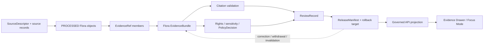

<!-- [KFM_META_BLOCK_V2]
doc_id: kfm://doc/data-proofs-evidence-bundle-flora-readme
title: data/proofs/evidence_bundle/flora/ — Flora EvidenceBundle Proof Support
version: v0.2.0
type: directory-readme
subtype: flora-evidence-bundle-proof-lane
status: repository-grounded draft; concrete bundle inventory, resolver integrity, validator execution, fixture depth, CI enforcement, access controls, release linkage, and runtime behavior remain bounded
owners:
  - "NEEDS VERIFICATION — Flora domain steward"
  - "NEEDS VERIFICATION — Evidence, EvidenceBundle, and proof steward"
  - "NEEDS VERIFICATION — taxonomy, source-role, rights, sensitivity, geoprivacy, stewardship, and sovereignty reviewers"
  - "NEEDS VERIFICATION — policy, release, correction, rollback, Evidence Drawer, governed-AI, and docs stewards"
created: NEEDS VERIFICATION — blank placeholder existed before v0.1 expansion
updated: 2026-07-26
policy_label: restricted-review; proof-support; evidence-bundle; flora; cite-or-abstain; deny-by-default-location; no-direct-public-path; release-gated
path: data/proofs/evidence_bundle/flora/README.md
truth_posture: >
  CONFIRMED exact target path, prior blob, Directory Rules proof placement, canonical proofs-root
  contract, expanded parent EvidenceBundle lane, Flora domain proof and citation-validation lanes,
  fielded EvidenceBundle semantic contract, schema, validator wrapper, and minimal fixtures, current
  Flora workflow holds, scaffold-level Flora policy homes, and no established Flora release candidate
  or public release / PROPOSED Flora-specific claim packet, source-role closure profile, sensitivity-safe
  bundle routing, invalidation propagation, and downstream handoff requirements / UNKNOWN recursive
  bundle inventory, active writers and consumers, generated indexes, resolver runtime, access controls,
  public routes, caches, hosting, release instances, and public effects / NEEDS VERIFICATION accountable
  owners, accepted instance-versus-index profile, cross-record resolver integrity, validator execution,
  fixture depth, CI enforcement, policy and geoprivacy enforcement, stewardship and sovereignty review,
  correction propagation, withdrawal behavior, and rollback drills
evidence_snapshot:
  repository: bartytime4life/Kansas-Frontier-Matrix
  base_ref: main
  base_commit: 0b51a0afc569b5fdaee1698b4c088b9247b98f0f
  prior_blob: d73adf50d91b617f6c056b7a14842c57db1131a4
  blank_placeholder_lineage_blob: 8b137891791fe96927ad78e64b0aad7bded08bdc
  directory_rules_blob: 2affb080e6f0043867c64c7f06c1ca52030fbd55
  proofs_root_blob: 0d8b6e92d3b4b9ff3961d29c53ead497922a31cf
  evidence_bundle_parent_blob: bf304383b725db95e0f8902f0c7c59d0a3cd0ee3
  flora_proof_lane_blob: a2518d4cc029b9b16afa8bb5c3fb6907a0c1475a
  flora_citation_validation_blob: 2a2fee3953ae85f0505e4835bdded4fb5e24c129
  evidence_bundle_contract_blob: 731c348832add23cddd14e796aa56ce2b9268259
  evidence_bundle_schema_blob: cf5256831b63dca46a5f68b168441adcf68b8751
  evidence_bundle_validator_blob: c1760c5e92eae6390f5adcde4593e8e9bab26535
  evidence_bundle_fixtures_readme_blob: 89ace659414a757c14a4d3e516fd31d44c6a9969
  flora_policy_blob: b040bff13e654cff9d2f7336d6d6783c8467eaa9
  flora_sensitivity_policy_blob: 4c65abec24135f7e4467fd108e163cdce594d5f9
  flora_release_candidate_blob: 15a08f9fb2cdd33041d3a3f3e3c844f26a7a0998
  flora_workflow_blob: c792d126e5726d8895f56fd97800bee7fcba4a15
  codeowners_blob: dd2a84aa514d8ecd9208bc347f90f9a2ed37dd61
related:
  - ../README.md
  - ../../README.md
  - ../../citation_validation/flora/README.md
  - ../../../processed/flora/README.md
  - ../../../catalog/domain/flora/README.md
  - ../../../receipts/README.md
  - ../../../registry/sources/flora/README.md
  - ../../../published/flora/README.md
  - ../../../published/layers/flora/README.md
  - ../../../../contracts/evidence/evidence_bundle.md
  - ../../../../contracts/evidence/evidence_ref.md
  - ../../../../contracts/domains/flora/README.md
  - ../../../../schemas/contracts/v1/evidence/evidence_bundle.schema.json
  - ../../../../schemas/contracts/v1/evidence/evidence_ref.schema.json
  - ../../../../schemas/contracts/v1/domains/flora/README.md
  - ../../../../fixtures/contracts/v1/evidence/evidence_bundle/README.md
  - ../../../../tools/validators/validate_evidence_bundle.py
  - ../../../../policy/evidence/README.md
  - ../../../../policy/domains/flora/README.md
  - ../../../../policy/sensitivity/flora/README.md
  - ../../../../release/candidates/flora/README.md
  - ../../../../release/README.md
  - ../../../../docs/doctrine/directory-rules.md
  - ../../../../.github/workflows/domain-flora.yml
  - ../../../../.github/CODEOWNERS
notes:
  - "Same-path Markdown modernization only; no Flora source bytes, proof payloads, EvidenceBundle instances, contracts, schemas, policies, validators, fixtures, workflows, releases, routes, hosting, or publication state changed."
  - "EvidenceBundle is a claim-scope closure artifact. It is not an EvidenceRef, PolicyDecision, ReviewRecord, ReleaseManifest, receipt, source registry, public response body, map layer, or AI-answer authority."
  - "The parent EvidenceBundle lane is an expanded repository document; this README no longer describes it as a greenfield stub."
  - "The EvidenceBundle schema, validator wrapper, and minimal valid/invalid fixture family are fielded. Validator execution, cross-record resolver integrity, domain-profile coverage, policy enforcement, CI, and runtime behavior remain NEEDS VERIFICATION."
  - "The blank-placeholder lineage blob is retained for history; the documentation rollback target for v0.2.0 is prior blob d73adf50d91b617f6c056b7a14842c57db1131a4."
[/KFM_META_BLOCK_V2] -->

<a id="top"></a>

# `data/proofs/evidence_bundle/flora/` — Flora EvidenceBundle Proof Support

> **One-line purpose.** Hold or index claim-scoped Flora EvidenceBundle proof artifacts that preserve evidence references, botanical source roles, citations, rights, sensitivity, safe-representation posture, transforms, checksums, correction lineage, and release dependencies without becoming public truth or release authority.

[](#status)
[](#authority-level)
[](#status)
[](#flora-claim-and-source-role-closure)
[](#sensitivity-geoprivacy-and-safe-representation)
[](#outputs)
[](#validation)

> [!IMPORTANT]
> **Evidence closure is necessary but not sufficient for publication.** A structurally valid Flora EvidenceBundle can support policy, review, and release evaluation, but it does not make a botanical claim true, taxonomically current, rights-cleared, sensitivity-safe, steward-approved, released, public, or safe for collection or access use.

> [!CAUTION]
> Missing, stale, conflicting, role-collapsed, rights-unclear, sensitivity-unsafe, unreleased, withdrawn, invalidated, or unresolvable support must yield a finite fail-closed result such as `ABSTAIN`, `HOLD`, `RESTRICT`, `DENY`, or `ERROR`.

> [!WARNING]
> Do not place exact or reverse-engineerable rare, protected, culturally sensitive, steward-controlled, or private-land Flora locations—or collection clues, access directions, withheld precision, redaction offsets, generalization thresholds, transform parameters, or other control-defeating details—in this ordinary repository lane.

**Path:** `data/proofs/evidence_bundle/flora/README.md`  
**Owning responsibility:** `data/proofs/`  
**Proof family:** `evidence_bundle/`  
**Domain segment:** `flora/`  
**Direct public access:** denied  
**Documentation rollback target:** prior blob `d73adf50d91b617f6c056b7a14842c57db1131a4`

**Quick navigation:** [Purpose](#purpose) · [Authority](#authority-level) · [Status](#status) · [Belongs](#what-belongs-here) · [Exclusions](#what-does-not-belong-here) · [Inputs](#inputs) · [Outputs](#outputs) · [Validation](#validation) · [Review](#review-burden) · [Related](#related-folders) · [ADRs](#adrs) · [Last reviewed](#last-reviewed) · [Evidence](#repository-evidence-ledger) · [Bundle packet](#flora-evidencebundle-packet) · [Source roles](#flora-claim-and-source-role-closure) · [Sensitivity](#sensitivity-geoprivacy-and-safe-representation) · [Lifecycle](#lifecycle-and-governed-handoff) · [Correction](#correction-withdrawal-invalidation-and-rollback) · [Verification](#open-verification-register) · [No-loss](#no-loss-ledger)

---

## Purpose

`data/proofs/evidence_bundle/flora/` is the Flora-specialized child of the EvidenceBundle proof family. It supports claim-scope closure for botanical evidence while preserving taxonomy, source role, space, time, rights, sensitivity, safe representation, review, release dependency, correction lineage, and cite-or-abstain behavior.

The lane exists to make these questions inspectable before a claim advances:

1. What exact Flora claim scope is being supported?
2. Which governed `EvidenceRef` values and reconstructable source records are members of the bundle?
3. Which botanical object family, taxon concept, source role, geography, time, method, uncertainty, and limitations qualify the support?
4. Which citations, rights, sensitivity labels, transforms, checksums, and governing spec identity close the bundle?
5. Which exact/internal geometry posture and public generalized, withheld, staged, or denied representation apply?
6. Which policy, stewardship, sovereignty, review, release, correction, withdrawal, invalidation, and rollback dependencies remain outside the bundle?
7. Which finite downstream outcome is justified?

This lane supports evidence resolution. It does not admit sources, determine botanical truth, define taxonomic authority, execute geoprivacy, approve stewardship or sovereignty decisions, decide policy, approve release, publish maps, or authorize collection or access.

## Authority level

**Implementation-bearing specialized proof-support lane under the canonical `data/proofs/` responsibility.**

This path owns only Flora EvidenceBundle-family support under an accepted profile:

- [`data/proofs/flora/`](../../flora/README.md) is the Flora domain proof-support lane.
- [`data/proofs/evidence_bundle/flora/`](./README.md) is the Flora EvidenceBundle-family support lane.
- [`data/proofs/citation_validation/flora/`](../../citation_validation/flora/README.md) checks citation and `EvidenceRef` closure for Flora claims.
- [`contracts/evidence/evidence_bundle.md`](../../../../contracts/evidence/evidence_bundle.md) defines EvidenceBundle meaning.
- [`schemas/contracts/v1/evidence/evidence_bundle.schema.json`](../../../../schemas/contracts/v1/evidence/evidence_bundle.schema.json) defines machine shape.
- `policy/`, review records, and `release/` retain admissibility, stewardship, release, correction, withdrawal, and rollback authority.

When one artifact could fit more than one proof axis, an accepted contract and profile must select one authoritative home. Other lanes may hold immutable references, indexes, or validation summaries; they must not duplicate mutable authority, restricted source material, canonical proof records, or public-state decisions.

This README does not create a new proof family, parallel evidence store, public route, or release state.

## Status

| Surface | Bounded result |
|---|---|
| Exact path and document | **CONFIRMED** at `main@0b51a0afc569b5fdaee1698b4c088b9247b98f0f`; prior blob `d73adf50d91b617f6c056b7a14842c57db1131a4` |
| Documentation version | `v0.2.0` |
| Canonical proofs responsibility | **CONFIRMED repository-grounded draft** at [`data/proofs/README.md`](../../README.md) |
| Parent EvidenceBundle lane | **CONFIRMED expanded repository document** at [`../README.md`](../README.md); no longer a greenfield stub |
| Flora domain proof lane | **CONFIRMED draft / proposed boundary document** at [`../../flora/README.md`](../../flora/README.md) |
| Flora citation-validation lane | **CONFIRMED repository-grounded draft** at [`../../citation_validation/flora/README.md`](../../citation_validation/flora/README.md) |
| EvidenceBundle semantic contract | **CONFIRMED fielded draft**; defines claim-scope closure and separates evidence, policy, release, receipts, public APIs, maps, and AI authority |
| EvidenceBundle schema | **CONFIRMED fielded / status `PROPOSED`**; ten required fields and root `additionalProperties: false` |
| Validator wrapper | **CONFIRMED fielded / NOT RUN in this task** at `tools/validators/validate_evidence_bundle.py` |
| Shared fixtures | **CONFIRMED minimal valid/invalid family / NOT RUN in this task**; coverage is not Flora-specific |
| Flora policy homes | **CONFIRMED scaffold-level documents**; executable domain and sensitivity enforcement is not established |
| Flora proof workflow | **CONFIRMED read-only readiness workflow with explicit holds**; no proof producer, geoprivacy execution, release approval, or publication authority |
| Flora release candidate and public release | **None established by inspected evidence**; no verified child candidate dossier, approved manifest, or published Flora release |
| Recursive bundle inventory | **UNKNOWN** |
| Writers, consumers, resolver runtime, access controls, routes, caches, and hosting | **UNKNOWN** |
| Public readiness | **DENY BY DEFAULT** |

The repository establishes meaningful contracts, shape, fixtures, and responsibility boundaries. It does not establish a populated Flora EvidenceBundle store, accepted Flora-specific bundle profile, operational resolver, executed geoprivacy policy, released public route, or safe public rare-plant location surface.

<a id="accepted-contents"></a>

## What belongs here

Only governed Flora EvidenceBundle proof material under an accepted profile, such as:

- schema-conformant Flora EvidenceBundle instances when this lane is approved as their materialized proof home;
- immutable bundle indexes or pointers when canonical instances are owned elsewhere;
- `EvidenceRef`-to-bundle resolution maps that preserve unresolved, denied, stale, withdrawn, and invalidated states;
- claim-to-bundle maps for catalog records, triplets, release candidates, Evidence Drawer projections, Focus Mode review, and governed-answer fixtures;
- digest-closure manifests linking admitted source records, processed Flora objects, catalog/triplet projections, receipts, proof packets, and release dependencies;
- bundle member indexes for `PlantTaxon`, `FloraTaxonCrosswalk`, `FloraOccurrence`, `SpecimenRecord`, `RarePlantRecord`, `VegetationCommunity`, `InvasivePlantRecord`, `PhenologyObservation`, `RangePolygon`, `DistributionSurface`, `HabitatAssociation`, `BotanicalSurvey`, and `RestorationPlanting` claims;
- source-role, rights, sensitivity, freshness, uncertainty, safe-representation, correction, supersession, withdrawal, and limitation summaries derived from governed member records;
- finite negative-state support explaining why claim-grade evidence closure is absent or unsafe;
- local README, inventory, digest, migration, compatibility, retention, or disposition sidecars that do not create parallel authority.

A record relied upon by review or release should be immutable or versioned, with successor, correction, supersession, withdrawal, or invalidation links rather than silent mutation.

<a id="exclusions"></a>

## What does NOT belong here

| Do not place here | Correct home or action |
|---|---|
| RAW source exports, specimen images, labels, source media, original coordinates, or source-native records | `data/raw/flora/` or the governed source system |
| In-process taxonomy reconciliation, occurrence matching, QA experiments, joins, notebooks, redaction trials, or scratch outputs | `data/work/flora/` |
| Rights-, source-role-, sensitivity-, validation-, review-, or release-unclear material | `data/quarantine/flora/` |
| Canonical normalized Flora objects | `data/processed/flora/` |
| Catalog, STAC, DCAT, PROV, or triplet records | Their catalog or triplet lanes |
| General Flora proof packets or citation-validation reports | Their accepted `data/proofs/` family lanes |
| Run, transform, validation, redaction, generalization, aggregation, review, or publication receipts as primary records | `data/receipts/` |
| `SourceDescriptor` or source-admission authority | `data/registry/sources/flora/` |
| Contracts, schemas, policy rules, validators, fixtures, tests, pipelines, packages, apps, API, UI, or map code | Their responsibility roots |
| Policy, rights, sensitivity, stewardship, or sovereignty decisions | Their accepted policy or review authority |
| Release approval, promotion decision, correction notice, withdrawal notice, signature, or rollback card | `release/` |
| Public maps, tiles, downloads, popups, reports, Focus Mode answers, model prose, or AI output | Released governed delivery surfaces only |
| Exact or reverse-engineerable sensitive locations, private-land details, collection/access clues, culturally sensitive knowledge, withheld precision, or transform secrets | Approved restricted systems; never this ordinary repository lane |
| Claims that collapse taxonomy, occurrence, specimen, survey, range, model, habitat, restoration, or generated-summary roles | Split the claim scope or return a finite negative outcome |

## Inputs

A Flora EvidenceBundle packet may reference only governed records and must preserve unresolved states rather than fabricate closure.

The fielded shared schema requires:

- `bundle_id`;
- `claim_scope`;
- one or more `evidence_refs`;
- one or more `source_records`;
- one or more `citations`;
- `rights`;
- `sensitivity`;
- ordered `transforms`;
- one or more `checksums`;
- `spec_hash`.

Flora-specific support should remain reconstructable through accepted member records and contracts, including:

- stable claim and object identity;
- taxon concept, accepted name, relevant synonym or crosswalk, and taxonomy version or date;
- source identity, version, role, authority, rights, citation, and use limits;
- occurrence, specimen, survey, range, distribution/model, vegetation, habitat-association, invasive, phenology, restoration, or synthetic-summary role;
- geography, coordinate uncertainty, spatial support, time scope, observation/collection/survey/model dates, retrieval time, review time, correction time, and expiry where applicable;
- method, effort, protocol, quality, uncertainty, confidence, missingness, and limitations;
- exact/internal geometry posture and public generalized, withheld, staged, or denied representation;
- sensitivity classification, geoprivacy dependency, stewardship or sovereignty dependency, and disclosure posture;
- pointers to receipts, catalog/triplet records, policy decisions, reviews, releases, corrections, withdrawals, invalidations, and rollback targets.

Pointers do not transfer authority into this lane.

## Outputs

Outputs are claim-scoped proof artifacts or indexes used for:

- EvidenceBundle resolver and release preflight;
- citation-validation support;
- domain, policy, sensitivity, stewardship, and release review;
- Evidence Drawer and governed API projection eligibility;
- Focus Mode or governed-AI eligibility checks;
- correction, withdrawal, invalidation, supersession, and rollback analysis;
- proof inventory, reconciliation, migration, and audit.

Outputs are not public response bodies, collection guides, access directions, maps, tiles, source feeds, policy decisions, or release approvals.

A downstream public carrier requires a policy-safe projection, accepted review and release state, correction support, rollback support, and access controls. When closure is insufficient, the output must preserve a finite negative posture instead of presenting an unsupported claim.

## Validation

The repository contains a shared EvidenceBundle schema, validator wrapper, and minimal valid/invalid fixtures. They were inspected but not executed in this Markdown-only task.

| Check | Minimum expectation | Safe failure |
|---|---|---|
| Placement and identity | Correct proof-family/domain path, stable ID, version, digest, duplicate posture, and no parallel authority | `ERROR` / `HOLD` |
| Schema shape | All ten required fields, nested constraints, checksum syntax, and no undeclared top-level fields | `DENY` |
| `EvidenceRef` resolution | Every reference resolves through the governed resolver or carries an explicit unresolved/denied state | `ABSTAIN` / `DENY` |
| Claim scope and taxonomy | Supported object, taxon concept, geography, time, method, source role, uncertainty, and limitations remain bounded | `ABSTAIN` |
| Source records and citations | Reconstructable source handles and publication-ready citations exist | `ABSTAIN` |
| Rights, sensitivity, and review dependencies | Effective rights, sensitivity, stewardship, sovereignty, and disclosure posture support the requested use | `RESTRICT` / `DENY` |
| Transforms and integrity | Ordered transforms, checksums, and `spec_hash` are reviewable and consistent without exposing control-defeating parameters | `DENY` / `ERROR` |
| Source-role preservation | Taxonomy, occurrence, specimen, survey, range, model, habitat, restoration, and generated-summary roles remain distinct | `DENY` |
| Spatial and temporal fidelity | Coordinate uncertainty, generalization state, valid/observed/source/retrieval/review/correction time, freshness, and expiry remain visible | `HOLD` / `ABSTAIN` |
| External dependencies | Receipts, policy, review, catalog/triplet, release, correction, withdrawal, invalidation, and rollback pointers resolve as required | `HOLD` / `DENY` |
| Public boundary | Public clients receive governed, release-aware, sensitivity-safe projections and never direct proof-file or canonical-store access | `DENY` |

A passing schema check proves machine shape only. It does not prove botanical identity, taxonomic currency, source correctness, evidence sufficiency, citation fitness, rights clearance, sensitivity safety, stewardship or sovereignty approval, geoprivacy effectiveness, policy permission, review approval, release state, public safety, or runtime behavior.

## Review burden

Accountable ownership remains **NEEDS VERIFICATION**.

Changes should receive review proportionate to claim significance and exposure from:

- Flora and taxonomy stewards;
- evidence, EvidenceBundle, proof, and citation-validation stewards;
- source-role, rights, sensitivity, geoprivacy, stewardship, and sovereignty reviewers;
- policy, release, correction, withdrawal, rollback, and security reviewers;
- Evidence Drawer, governed-AI, map, and docs reviewers where affected.

Independent review is warranted for rare or protected taxa, culturally sensitive knowledge, private-land detail, exact or reverse-engineerable geometry, source-role changes, taxonomy migrations, public-safe transforms, public serving, proof-profile changes, corrections, withdrawals, and rollback.

[`CODEOWNERS`](../../../../.github/CODEOWNERS) routes `/data/proofs/` review to `@bartytime4life`, but routing is not stewardship assignment, rights-holder or sovereign-community approval, independent review, policy approval, release approval, or publication evidence.

<a id="repo-fit"></a>
<a id="directory-map"></a>

## Related folders

| Responsibility | Verified or bounded home | Relationship |
|---|---|---|
| Parent EvidenceBundle family | [`../README.md`](../README.md) | Cross-domain EvidenceBundle proof-family guide |
| Flora domain proof lane | [`../../flora/README.md`](../../flora/README.md) | Domain proof boundary and botanical support index |
| Flora citation validation | [`../../citation_validation/flora/README.md`](../../citation_validation/flora/README.md) | Citation and `EvidenceRef` checks; not bundle authority |
| Processed Flora | [`../../../processed/flora/README.md`](../../../processed/flora/README.md) | Canonical processed candidates, not proof storage |
| Flora catalog | [`../../../catalog/domain/flora/README.md`](../../../catalog/domain/flora/README.md) | Discovery/provenance records that may cite bundle support |
| Receipts | [`../../../receipts/README.md`](../../../receipts/README.md) | Process and review memory referenced by bundles |
| Flora source registry | [`../../../registry/sources/flora/README.md`](../../../registry/sources/flora/README.md) | Source identity, role, rights, and activation authority |
| Published Flora family | [`../../../published/flora/README.md`](../../../published/flora/README.md) | Released-artifact lane; current public release is not established |
| Published Flora layers | [`../../../published/layers/flora/README.md`](../../../published/layers/flora/README.md) | Public-safe map-layer family after governed release |
| EvidenceBundle contract | [`../../../../contracts/evidence/evidence_bundle.md`](../../../../contracts/evidence/evidence_bundle.md) | Claim-scope closure meaning |
| EvidenceBundle schema | [`../../../../schemas/contracts/v1/evidence/evidence_bundle.schema.json`](../../../../schemas/contracts/v1/evidence/evidence_bundle.schema.json) | Fielded machine shape |
| EvidenceBundle fixtures | [`../../../../fixtures/contracts/v1/evidence/evidence_bundle/README.md`](../../../../fixtures/contracts/v1/evidence/evidence_bundle/README.md) | Minimal shared valid/invalid examples |
| EvidenceBundle validator | [`../../../../tools/validators/validate_evidence_bundle.py`](../../../../tools/validators/validate_evidence_bundle.py) | Shared shape validator wrapper; execution not proven here |
| Evidence policy | [`../../../../policy/evidence/README.md`](../../../../policy/evidence/README.md) | Evidence-admissibility boundary; executable policy not established |
| Flora policy | [`../../../../policy/domains/flora/README.md`](../../../../policy/domains/flora/README.md) | Domain policy scaffold |
| Flora sensitivity policy | [`../../../../policy/sensitivity/flora/README.md`](../../../../policy/sensitivity/flora/README.md) | Sensitivity scaffold; not executable enforcement |
| Flora release candidates | [`../../../../release/candidates/flora/README.md`](../../../../release/candidates/flora/README.md) | Pre-publication review lane; no child candidate established |
| Release authority | [`../../../../release/README.md`](../../../../release/README.md) | Promotion, release, correction, withdrawal, and rollback decisions |
| Directory Rules | [`../../../../docs/doctrine/directory-rules.md`](../../../../docs/doctrine/directory-rules.md) | Placement, proof/receipt/release separation, README contract |
| Flora workflow | [`../../../../.github/workflows/domain-flora.yml`](../../../../.github/workflows/domain-flora.yml) | Read-only readiness and explicit-hold workflow; not proof or release authority |

## ADRs

- Directory Rules place proof artifacts under `data/proofs/` and domains as segments inside responsibility roots.
- Changing the canonical materialized EvidenceBundle home, creating a parallel evidence/proof home, merging receipts or release decisions into this lane, or allowing direct public reads requires an accepted ADR, migration and compatibility plan, validation plan, access-control review, correction plan, and rollback target.
- No accepted Flora-specific EvidenceBundle ADR was verified in this task.
- **NEEDS VERIFICATION:** whether this lane stores canonical bundle instances, generated Flora indexes, or both under an accepted profile.
- This README does not accept proposed source-registry, sensitivity-tier, review-state, release-state, or correction-state vocabularies by implication.

## Last reviewed

- **Date:** 2026-07-26
- **Evidence basis:** exact target README, Directory Rules, canonical proofs-root README, parent EvidenceBundle README, Flora proof and citation-validation READMEs, EvidenceBundle semantic contract and schema, validator wrapper, minimal fixtures, Flora policy scaffolds, Flora release-candidate README, Flora workflow, and CODEOWNERS
- **Recursive payload and runtime inspection:** not performed
- **Validator and test execution:** not performed
- **Owners, accepted Flora profile, resolver integrity, policy/geoprivacy enforcement, access controls, release instances, public consumers, correction propagation, and operational rollback:** need verification

Re-review on contract/schema changes, Flora object or source-role changes, taxonomy changes, rights or sensitivity changes, new writers or consumers, resolver changes, geoprivacy implementation, release integration, public serving, correction, withdrawal, invalidation, or rollback changes—or within six months.

---

<a id="evidence-ledger"></a>

## Repository evidence ledger

| Evidence | Status | Supports | Limit |
|---|---|---|---|
| Prior target blob `d73adf50…` | **CONFIRMED** | Same-path baseline, stable `doc_id`, blank-placeholder lineage, Flora guardrails | June 2026 evidence claims were stale in places |
| Directory Rules blob `2affb080…` | **CONFIRMED doctrine** | Proof placement, responsibility split, §15 README order, no parallel authority, public trust membrane | Does not prove payloads or runtime behavior |
| `data/proofs/README.md` blob `0d8b6e92…` | **CONFIRMED repository-grounded draft** | Canonical proofs responsibility and deny-by-default public posture | Recursive payload inventory and enforcement remain unknown |
| Parent EvidenceBundle README blob `bf304383…` | **CONFIRMED expanded parent** | Cross-domain bundle-family role and Flora child presence | Does not establish populated Flora bundles |
| Flora proof README blob `a2518d4c…` | **CONFIRMED draft / proposed** | Domain proof boundary and fail-closed botanical posture | Contains planning-level implementation claims |
| Flora citation-validation README blob `2a2fee39…` | **CONFIRMED repository-grounded draft** | Current Flora source-role, geoprivacy, finite-outcome, and no-direct-public-path boundaries | Recursive records, resolver, and runtime remain unknown |
| EvidenceBundle contract blob `731c3488…` | **CONFIRMED fielded draft** | EvidenceBundle meaning, authority split, closure rules, required field interpretation | Policy/release/runtime closure remains separate |
| EvidenceBundle schema blob `cf525683…` | **CONFIRMED fielded / `PROPOSED` status** | Ten required fields, nested constraints, root `additionalProperties: false` | Shape does not prove semantic or operational closure |
| Validator blob `c1760c5e…` and fixture README blob `89ace659…` | **CONFIRMED fielded / NOT RUN** | Shared schema runner and minimal positive/negative fixture family | Not Flora-specific; execution and depth unverified |
| Flora policy blobs `b040bff1…` and `4c65abec…` | **CONFIRMED scaffolds** | Correct policy responsibility and fail-closed planning posture | Executable domain/sensitivity enforcement not established |
| Flora release-candidate blob `15a08f9f…` | **CONFIRMED repository-grounded draft** | No child candidate, approved manifest, or published Flora release established | Bounded README-level inventory is not permanent proof of absence |
| Flora workflow blob `c792d126…` | **CONFIRMED read-only hold workflow** | Required boundary checks and explicit non-publisher posture | Does not produce proof, apply policy, execute geoprivacy, or release |
| CODEOWNERS blob `dd2a84aa…` | **CONFIRMED review routing** | `/data/proofs/` route to verified repository owner | Routing is not substantive approval |

<a id="evidencebundle-requirements"></a>

## Flora EvidenceBundle packet

A structurally valid packet follows the current shared EvidenceBundle schema. Flora-specific semantics remain in governed member records and accepted contracts rather than undeclared top-level fields.

| Required schema field | Flora interpretation |
|---|---|
| `bundle_id` | Stable identity for one bounded Flora claim-scope closure |
| `claim_scope` | Exact supported botanical claim, including object/taxon, geography, time, role, method, intended use, and limitations |
| `evidence_refs` | Non-empty governed pointers to the evidence members used for closure |
| `source_records` | Non-empty reconstructable source handles, preserving source role and version |
| `citations` | Non-empty publication-ready citations that do not expose restricted details |
| `rights` | Effective license/rights summary; schema requires `license` |
| `sensitivity` | Exposure constraint through the shared sensitivity-label schema |
| `transforms` | Ordered source-to-derived transformations, including public-safe transforms where applicable without leaking protected parameters |
| `checksums` | At least one SHA-256 digest protecting critical inputs or outputs |
| `spec_hash` | Deterministic identity for the governing contract/schema baseline |

Because the schema rejects undeclared top-level fields, Flora-specific taxonomy, source role, method, uncertainty, geoprivacy, stewardship, and correction details must remain reconstructable through referenced records and accepted shared contracts. Do not improvise incompatible bundle extensions inside ordinary proof files.

A structurally valid packet still requires cross-record resolution, rights and sensitivity review, policy, review, release, correction, withdrawal, and rollback closure before public use.

<a id="flora-evidencebundle-guardrails"></a>

## Flora claim and source-role closure

| Claim or source role | Closure requirement | Forbidden collapse |
|---|---|---|
| `PlantTaxon` / `FloraTaxonCrosswalk` | Taxon concept, accepted name, source authority, version/date, synonym or crosswalk rationale, uncertainty, and evidence | Taxonomic identity is not occurrence, abundance, range, or public-location proof |
| `FloraOccurrence` | Taxon concept, event/source identity, observation date, method, coordinate uncertainty, geometry posture, evidence, and review state | Occurrence is not range, habitat suitability, model output, or unrestricted public precision |
| `SpecimenRecord` | Repository/collection identity, catalog identifier, label/transcription provenance, collection event, determinations, source role, and rights | A specimen label is not automatically a current occurrence or a public coordinate |
| `BotanicalSurvey` | Survey area, dates, effort, protocol, observers/source, detections/non-detections, limitations, and evidence | A survey does not prove exhaustive absence without an explicit supported design |
| `RarePlantRecord` | Taxon, source, sensitivity, stewardship/sovereignty dependency, internal geometry posture, public representation, and disclosure decision | No exact or reverse-engineerable public location, collection clue, or access guidance |
| `RangePolygon` | Source, interpretation method, date/version, scale, uncertainty, and range role | A range is not an observed occurrence |
| `DistributionSurface` | Model/product identity, version, inputs, method, validation, uncertainty, time, scale, and model role | A model surface is not observation, specimen, or confirmed presence |
| `VegetationCommunity` | Classification, source, method, date, scale, geometry support, uncertainty, and community role | Community mapping is not taxon occurrence by itself |
| `HabitatAssociation` | Owning habitat evidence, relation method, scale/time, uncertainty, and relation role | Habitat suitability or association is not occurrence truth |
| `InvasivePlantRecord` | Taxon, source, status vocabulary, jurisdiction/scope, date, method, and evidence | KFM does not create a legal, quarantine, treatment, or regulatory conclusion without authoritative support |
| `PhenologyObservation` | Taxon, stage, protocol, observation date, location posture, uncertainty, and evidence | A phenology observation is not a population trend or range change by itself |
| `RestorationPlanting` | Project/source identity, planned/installed/monitored state, date, species/taxon, geometry posture, and evidence | A restoration planting is not a wild/native occurrence |
| Synthetic or AI summary | Exact released claim scope, eligible bundle IDs, policy/release state, citations, and output receipt where required | Generated language is never evidence or stewardship authority |

Cross-lane Flora claims may cite habitat, fauna, soil, hydrology, agriculture, hazards, archaeology, settlements, infrastructure, roads, or people/land support only through governed relations that preserve each lane’s ownership, source role, rights, sensitivity, time, evidence, and release posture.

One bundle may support multiple related claims only when `claim_scope` and member evidence make the allowed scope unambiguous. Otherwise split the closure into separate bundles.

## Sensitivity, geoprivacy, and safe representation

Flora proof support must preserve the difference between canonical/internal evidence and public representation.

- Exact/internal geometry, coordinate uncertainty, original source precision, and restricted notes remain governed by their owning records and access controls.
- Public geometry may be generalized, aggregated, withheld, staged, delayed, or denied only under reviewed policy and with traceable transform evidence.
- A generalized public representation never replaces or silently rewrites the canonical source record.
- Public bundle support must not permit reverse engineering through stable offsets, tiny cells, unique attribute combinations, unredacted metadata, filenames, map bounds, timestamps, source URLs, collection notes, or cross-layer joins.
- Redaction offsets, jitter seeds, aggregation thresholds, withheld precision, private endpoints, and transform secrets do not belong in ordinary public-repository proof files.
- Rare, protected, culturally sensitive, steward-controlled, private-land, or collection-risk records default to `RESTRICT`, `DENY`, `HOLD`, or `ABSTAIN` until rights, sensitivity, stewardship, sovereignty, review, and public-safe representation close.
- Public citations must not disclose restricted originals merely because a source is otherwise public.
- Cross-lane relations must not reintroduce a location or identity that the Flora lane withheld.
- No proof artifact in this lane is collection, access, treatment, land-entry, legal, regulatory, or stewardship advice.

The current Flora policy and sensitivity READMEs are scaffolds, and the workflow explicitly holds geoprivacy implementation. Therefore this README documents required posture; it does not claim enforcement.

<a id="lifecycle-relationship"></a>

## Lifecycle and governed handoff

```text
SourceDescriptor + source records
  -> RAW / WORK / QUARANTINE
  -> PROCESSED Flora objects
  -> EvidenceRef members
  -> Flora EvidenceBundle claim-scope closure
  -> citation validation + rights/sensitivity/policy + review
  -> catalog/triplet and release preflight
  -> ReleaseManifest + correction and rollback support
  -> governed API / Evidence Drawer / Focus Mode projection
```


```mermaid
flowchart LR
    SRC["SourceDescriptor + source records"] --> PROC["PROCESSED Flora objects"]
    PROC --> REF["EvidenceRef members"]
    REF --> EB["Flora EvidenceBundle"]
    EB --> CITE["Citation validation"]
    EB --> POL["Rights / sensitivity / PolicyDecision"]
    CITE --> REVIEW["ReviewRecord"]
    POL --> REVIEW
    REVIEW --> REL["ReleaseManifest + rollback target"]
    REL --> API["Governed API projection"]
    API --> DRAWER["Evidence Drawer / Focus Mode"]
    REL -. correction / withdrawal / invalidation .-> EB
```

The arrows show dependencies, not automatic promotion. A commit, merge, schema pass, complete-looking bundle, catalog link, generalized geometry, workflow result, or UI projection does not create publication state.

<a id="rollback"></a>

## Correction, withdrawal, invalidation, and rollback

A bundle may require correction, supersession, invalidation, restriction, or withdrawal after:

- taxonomy revision or misidentification;
- source correction or removal;
- citation failure;
- member withdrawal;
- source-role misclassification;
- geometry, time, method, effort, or uncertainty error;
- rights or sensitivity change;
- stewardship or sovereignty decision;
- geoprivacy transform defect;
- checksum or `spec_hash` mismatch;
- policy change;
- release correction; or
- public-carrier leakage or stale state.

Governed handling should:

1. preserve the prior bundle, member records, validation results, and release references by immutable identity;
2. create a successor, correction, supersession, withdrawal, or invalidation record rather than silently rewriting history;
3. identify affected claim scopes, representations, and reason codes;
4. re-run `EvidenceRef` resolution, citations, taxonomy, source-role, rights, sensitivity, transforms, checksums, policy, review, and release dependency checks;
5. propagate holds, restrictions, withdrawals, or supersession to catalog records, triplets, releases, APIs, maps, exports, Evidence Drawer payloads, Focus Mode responses, caches, and indexes where implemented;
6. verify that rollback does not reactivate withdrawn, corrected, stale, or unsafe support;
7. retain correction lineage and a rollback target appropriate to every released carrier.

**Documentation rollback:** before merge, close the draft pull request and abandon the branch. After merge, revert the implementation commit. The prior README blob is `d73adf50d91b617f6c056b7a14842c57db1131a4`.

**Operational rollback:** reverting this README does not restore prior bundles, policies, releases, API payloads, maps, caches, or access decisions. Operational rollback requires actual bundle/release identities, policy and review state, correction lineage, invalidation targets, access controls, and cache/index refresh evidence.

<a id="validation-checklist"></a>

## Open verification register

| Item | Status | Required evidence |
|---|---|---|
| Recursive Flora bundle inventory | **UNKNOWN** | Pinned tree, hashes, profiles, payload classifications, external stores, and generated-artifact inventory |
| Canonical instance versus index role | **NEEDS VERIFICATION** | Accepted ADR or profile clarifying whether this lane stores bundle instances, indexes, or both |
| `EvidenceRef` resolver integrity | **NEEDS VERIFICATION** | Deterministic resolver tests covering missing, denied, stale, conflicting, superseded, and withdrawn references |
| Shared schema validator execution | **NEEDS VERIFICATION** | Trusted run of `tools/validators/validate_evidence_bundle.py` against the current schema and fixtures |
| Fixture depth | **NEEDS VERIFICATION** | Flora-specific valid, invalid, role-collapse, rights, sensitivity, taxonomy, checksum, stale, correction, and withdrawal cases |
| Flora proof profile | **NEEDS VERIFICATION** | Accepted claim families, required member contracts, source-role rules, and allowed public projections |
| Domain and sensitivity policy enforcement | **NOT ESTABLISHED** | Reviewed executable policy, fixtures, tests, stable reason codes, and emitted decisions |
| Geoprivacy transform | **NOT ESTABLISHED** | Accepted implementation, public-safe fixtures, receipts, reversibility controls, and non-leakage tests |
| Stewardship and sovereignty review | **NEEDS VERIFICATION** | Approved review assignments, decision records, and disclosure obligations where applicable |
| Release integration | **NOT ESTABLISHED** | Candidate dossier, policy/review closure, manifest, correction path, rollback target, and release decision |
| Access controls and public projections | **UNKNOWN / held** | Governed API implementation, authorization tests, projection schema, no-direct-read proof, and released carrier |
| Correction propagation | **NEEDS VERIFICATION** | Tested invalidation, withdrawal, reindexing, cache refresh, and public-carrier rollback drill |
| Writers, consumers, and runtime behavior | **UNKNOWN** | Producer/consumer inventory, route tests, logs, metrics, and operational ownership |

Unknowns narrow claims and block higher-risk transitions; they do not invite plausible defaults.

## No-loss ledger

| Baseline element | Disposition | Result |
|---|---|---|
| Stable `doc_id`, path, and blank-placeholder lineage | **KEEP** | Preserved in the meta block and same-path update |
| Flora EvidenceBundle / `EvidenceRef` closure purpose | **ENRICH** | Retained and aligned to the fielded contract, schema, validator wrapper, and fixtures |
| Rare-plant, cultural, private-land, and exact-location guardrails | **KEEP / STRENGTHEN** | Preserved across alerts, exclusions, validation, source-role, sensitivity, and rollback sections |
| Flora object families and cross-lane ownership | **ENRICH** | Preserved in an explicit claim/source-role closure matrix |
| Parent EvidenceBundle lane described as a greenfield stub | **CORRECT** | Replaced with current repository evidence that the parent is expanded |
| EvidenceBundle schema described as unverified | **CORRECT** | Replaced with verified fielded-schema facts while runtime enforcement remains bounded |
| Validator and fixtures treated as absent or wholly unknown | **CORRECT / NARROW** | Fielded shared wrapper and minimal fixtures are recorded; execution and Flora depth remain unverified |
| Speculative child-directory tree | **REMOVE WITH EVIDENCE** | Removed because recursive inventory and accepted local structure remain unverified |
| Direct-looking lifecycle arrows | **CLARIFY** | Replaced with governed dependencies and explicit non-automatic promotion language |
| Validation checklist | **REORGANIZE** | Converted into a validation matrix and open verification register |
| Rollback posture | **CLARIFY** | Documentation rollback is separated from operational evidence/release rollback |
| Legacy section anchors | **KEEP** | Explicit compatibility anchors preserve inbound fragment targets |
| Payload, contract, schema, policy, validator, fixture, workflow, release, route, or public-state change | **NONE** | Markdown only |

### Change history

#### v0.2.0 — 2026-07-26

- aligned the first twelve H2 sections with Directory Rules §15;
- preserved the path, stable `doc_id`, blank-placeholder lineage, proof responsibility, and Flora fail-closed boundaries;
- corrected stale parent-lane and schema claims using current repository evidence;
- documented the fielded validator wrapper and minimal shared fixtures without claiming execution;
- separated EvidenceBundle shape from cross-record resolution, rights, sensitivity, geoprivacy, review, release, correction, and rollback closure;
- removed the speculative child-directory tree;
- strengthened botanical source-role anti-collapse, exact-location protection, and correction/withdrawal behavior;
- changed Markdown only.

[Back to top](#top)
