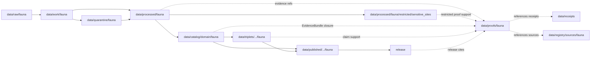

<!-- [KFM_META_BLOCK_V2]
doc_id: kfm://doc/data-proofs-fauna-readme
title: data/proofs/fauna/README.md — Fauna Proofs README
version: v0.1
type: readme; proof-lane-guide; evidence-bundle-lane; fauna-domain-proof-index; sensitive-species-claim-support-lane
status: draft; PROPOSED; data-root; proofs-root; fauna; evidence-bundle; evidence-ref; claim-support; digest-closure; cite-or-abstain; deny-by-default; sensitivity-aware; geoprivacy-aware; release-gated; evidence-first
authors: ChatGPT-5.5 Thinking; reviewed_by: OWNER_TBD
owners: OWNER_TBD — Fauna steward · Evidence steward · Proof steward · Sensitive-species reviewer · Geoprivacy reviewer · Policy steward · Release steward · Docs steward
created: NEEDS VERIFICATION — greenfield stub existed before v0.1 expansion
updated: 2026-06-25
policy_label: restricted-doc; data; proofs; fauna; evidence; sensitive-species; lifecycle; governed; release-gated
tags: [kfm, data, proofs, fauna, wildlife, rare-species, sensitive-sites, EvidenceBundle, EvidenceRef, proof, claim-support, digest-closure, SourceDescriptor, CatalogMatrix, ReleaseManifest, ReviewRecord, CorrectionNotice, RollbackCard, PolicyDecision, ValidationReport, RedactionReceipt, AggregationReceipt, Taxon, TaxonCrosswalk, ConservationStatus, OccurrenceEvidence, OccurrenceRestricted, OccurrencePublic, RangePolygon, SeasonalRange, MigrationRoute, SensitiveSite, MortalityObservation, DiseaseObservation, InvasiveSpeciesRecord, nest, den, roost, hibernacula, spawning-site, geoprivacy, RAW, WORK, QUARANTINE, PROCESSED, CATALOG, TRIPLET, PUBLISHED]
related:
  - ../README.md
  - ../../README.md
  - ../../processed/fauna/restricted/sensitive_sites/README.md
  - ../../processed/fauna/
  - ../../catalog/domain/fauna/
  - ../../catalog/stac/fauna/
  - ../../catalog/dcat/fauna/
  - ../../catalog/prov/fauna/
  - ../../triplets/
  - ../../published/
  - ../../receipts/
  - ../../registry/sources/fauna/
  - ../../../docs/domains/fauna/DATA_LIFECYCLE.md
  - ../../../docs/domains/fauna/CANONICAL_PATHS.md
  - ../../../docs/domains/fauna/SENSITIVITY.md
  - ../../../docs/runbooks/fauna/PROMOTION_RUNBOOK.md
  - ../../../docs/runbooks/fauna/SOURCE_REFRESH_RUNBOOK.md
  - ../../../docs/adr/ADR-0010-deny-by-default-for-dna-rare-species-archaeology-infrastructure.md
  - ../../../contracts/domains/fauna/
  - ../../../contracts/domains/fauna/occurrence_public.md
  - ../../../contracts/domains/fauna/migration_route.md
  - ../../../contracts/domains/fauna/mortality_observation.md
  - ../../../contracts/domains/fauna/domain_layer_descriptor.md
  - ../../../schemas/contracts/v1/domains/fauna/
  - ../../../policy/domains/fauna/
  - ../../../policy/sensitivity/fauna/
  - ../../../release/candidates/fauna/
  - ../../../release/
  - ../../../pipelines/domains/fauna/
  - ../../../pipeline_specs/fauna/
  - ../../../tools/validators/
notes:
  - "This file replaces a greenfield stub at `data/proofs/fauna/README.md`."
  - "This is a Fauna proof lane guide under `data/proofs/`. It is not RAW source storage, WORK scratch, QUARANTINE holding, PROCESSED data, CATALOG, TRIPLET, PUBLISHED output, receipt storage, source registry, policy authority, release authority, schema home, validator home, public API/UI output, public map/tile output, exact-species-location surface, hunting/fishing/legal advice, operational wildlife guidance, emergency alert, or life-safety guidance."
  - "Proof records support Fauna EvidenceBundle / EvidenceRef closure and claim support. Receipts such as RedactionReceipt, AggregationReceipt, ValidationReport, ReviewRecord, PolicyDecision, ReleaseManifest, CorrectionNotice, and RollbackCard remain in their own receipt/release lanes and may be referenced by proofs; they are not owned here."
  - "Fauna proof material is deny-by-default when it involves exact occurrences, nests, dens, roosts, hibernacula, spawning sites, breeding/aggregation sites, steward-controlled records, or re-identifying joins."
  - "Source-role anti-collapse is mandatory: occurrence evidence, restricted occurrence, public occurrence derivative, sensitive site, range polygon, seasonal range, migration route, mortality observation, disease observation, and invasive-species record are not interchangeable."
  - "This README is a proof-lane guide only. Contracts define semantic object meaning; schemas define machine shape; policy decides admissibility; release records decide publication."
  - "Rollback target for this expansion is previous greenfield stub blob SHA `f0a67466a8d6fd6e0420a18236ee85bc7be23def`."
[/KFM_META_BLOCK_V2] -->

<a id="top"></a>

# data/proofs/fauna

> Fauna proof lane for EvidenceBundle, EvidenceRef, digest-closure, claim-support, geoprivacy, source-role, sensitivity, release-linkage, correction, and rollback proof artifacts that support Fauna claims without becoming source data, processed data, receipts, catalog records, release decisions, or public surfaces.

<p>
  
  
  
  
  
  
</p>

**Status:** draft / PROPOSED  
**Owners:** OWNER_TBD — Fauna steward · Evidence steward · Proof steward · Sensitive-species reviewer · Geoprivacy reviewer · Policy steward · Release steward · Docs steward  
**Path:** `data/proofs/fauna/README.md`  
**Owning root:** `data/proofs/`  
**Domain segment:** `fauna`  
**Lifecycle role:** evidence/proof support referenced by processed Fauna artifacts, catalog records, triplets, release candidates, corrections, rollbacks, and governed answer surfaces; not a lifecycle phase substitute  
**Exposure posture:** restricted by default; public use requires governed projection, public-safe transformation, policy/review state, release state, correction path, and rollback target.  
**Truth posture:** CONFIRMED target was a greenfield stub · CONFIRMED parent `data/proofs/` is also still a greenfield stub · CONFIRMED Fauna lifecycle requires EvidenceRefs, EvidenceBundle closure, validation, receipts, review, release, correction, and rollback before public surfaces · CONFIRMED Fauna sensitive sites and rare-species exact locations are deny-by-default · PROPOSED proof-lane details · NEEDS VERIFICATION for actual proof schemas, EvidenceBundle wire shape, proof inventory, validators, fixtures, access controls, release linkage, and governed route behavior.

**Quick jumps:** [Purpose](#purpose) · [Lifecycle relationship](#lifecycle-relationship) · [Repo fit](#repo-fit) · [Accepted contents](#accepted-contents) · [Exclusions](#exclusions) · [Proof requirements](#proof-requirements) · [Fauna proof guardrails](#fauna-proof-guardrails) · [Directory map](#directory-map) · [Evidence ledger](#evidence-ledger) · [Validation checklist](#validation-checklist) · [Rollback](#rollback)

---

## Purpose

`data/proofs/fauna/` is the Fauna domain proof lane. It should hold or index proof artifacts that make Fauna claims inspectable, evidence-bound, source-role-safe, sensitivity-aware, geoprivacy-safe, and citation-ready.

This lane may contain or reference proof support for:

- EvidenceBundle closure for Fauna catalog/triplet candidates;
- EvidenceRef resolution targets used by released, restricted-review, or governed Fauna payloads;
- claim-support records for `Taxon`, `TaxonCrosswalk`, `ConservationStatus`, `OccurrenceEvidence`, `OccurrenceRestricted`, `OccurrencePublic`, `RangePolygon`, `SeasonalRange`, `MigrationRoute`, `SensitiveSite`, `MortalityObservation`, `DiseaseObservation`, and `InvasiveSpeciesRecord` claims;
- digest closure, hash manifests, and proof indexes that support reproducibility;
- geoprivacy-proof manifests showing that public-safe derivatives were generalized, suppressed, buffered, gridded, aggregated, or redacted without exposing restricted originals;
- sensitivity/review proof references for nests, dens, roosts, hibernacula, spawning sites, breeding/aggregation sites, steward-controlled records, and other vulnerable site records;
- proof metadata needed to show why a governed answer can `ANSWER`, `ABSTAIN`, `DENY`, `HOLD`, or `ERROR`.

This lane does not create, store, or decide the underlying Fauna data, schemas, receipts, policy decisions, release decisions, public maps, access decisions, stewardship decisions, or public payloads. It supports claims; it does not replace the governed lifecycle.

## Lifecycle relationship

```text
RAW -> WORK / QUARANTINE -> PROCESSED -> CATALOG / TRIPLET -> PUBLISHED
                           \-> data/proofs/fauna supports EvidenceBundle / EvidenceRef closure
```



Proofs support catalog, triplet, release, correction, rollback, Evidence Drawer, and governed answers. They do not publish anything by themselves.

## Repo fit

| Responsibility | Correct home | Rule |
|---|---|---|
| Raw Fauna source payloads, source-native occurrence records, field notes, steward exports, source logs, media, source identifiers, or original exact geometry | `data/raw/fauna/` | Not this lane. |
| In-process normalization, taxon reconciliation, occurrence matching, QA, redaction trials, generalization experiments, joins, notebooks, or scratch outputs | `data/work/fauna/` | Not this lane. |
| Unsafe, unresolved, rights-unclear, sensitivity-unclear, source-role-unclear, validation-failed, review-unclear, or release-unclear material | `data/quarantine/fauna/` | Not this lane until review/admission allows. |
| Normalized Fauna processed artifacts | `data/processed/fauna/` | Not this lane. |
| Restricted sensitive-site processed artifacts | `data/processed/fauna/restricted/sensitive_sites/` | Restricted processed data, not proof storage. |
| Fauna catalog records | `data/catalog/domain/fauna/` and related STAC/DCAT/PROV lanes | Catalog, not proof storage. |
| Fauna triplet/graph records | `data/triplets/.../fauna/` | Graph projection, not proof storage. |
| Fauna proof support | `data/proofs/fauna/` | This lane. |
| Receipts and review records | `data/receipts/` or accepted receipt roots | Receipts are referenced by proofs but not stored here. |
| Source registry records | `data/registry/sources/fauna/` | SourceDescriptor/source-admission authority. |
| Published public-safe outputs | `data/published/.../fauna/` | Downstream after release only. |
| Release candidates and release manifests | `release/candidates/fauna/`, `release/` | Publication authority, not proof storage. |
| Fauna contracts | `contracts/domains/fauna/` | Object meaning; not proof artifacts. |
| Fauna schemas | `schemas/contracts/v1/domains/fauna/` or ADR-resolved home | Machine shape; not proof artifacts. |
| Fauna policy and sensitivity rules | `policy/domains/fauna/`, `policy/sensitivity/fauna/` | Admissibility authority; not proof artifacts. |
| Validators, tests, fixtures, pipelines, apps, packages | `tools/validators/`, `tests/`, `fixtures/`, `pipelines/`, `apps/`, `packages/` | Separate roots. |

## Accepted contents

Fauna proof artifacts may include:

- EvidenceBundle files, indexes, or pointers for Fauna claims;
- EvidenceRef resolution maps and claim-support manifests;
- digest-closure manifests tying source captures, processed artifacts, catalog records, triplets, receipts, release candidates, correction records, rollback targets, and proof manifests to evidence;
- proof indexes for taxon, crosswalk, conservation status, occurrence, range, seasonal range, migration route, sensitive site, mortality, disease, invasive species, and public-safe derivative claims;
- geoprivacy-proof manifests that reference redaction/generalization/suppression/aggregation decisions without exposing restricted originals;
- sensitivity/review proof summaries that preserve exact-location restrictions, public-safe geometry posture, review state, rights posture, release state, and rollback posture;
- cross-lane proof support that preserves ownership, source role, sensitivity, and EvidenceBundle support for habitat, flora, hydrology, hazards, agriculture, roads, settlements, archaeology, and people/land references;
- lane-local README or index notes that explain proof boundaries without becoming public outputs or authority records.

## Exclusions

Do not store these under `data/proofs/fauna/`:

- RAW, WORK, QUARANTINE, PROCESSED, CATALOG, TRIPLET, or PUBLISHED data artifacts.
- RunReceipt, TransformReceipt, ValidationReport, PolicyDecision, ReviewRecord, RedactionReceipt, AggregationReceipt, ReleaseManifest, RollbackCard, CorrectionNotice, WithdrawalNotice, AIReceipt, access records, or release signatures as primary receipt/release records.
- SourceDescriptor/source registry records.
- Contracts, schemas, policy bundles, validators, tests, fixtures, pipelines, app/UI/API code, packages, notebooks, or executable tooling.
- Public map/tile/API/UI payloads, Focus Mode answer payloads, direct downloads, model-answer text, release manifests, signatures, changelogs, or published products.
- Exact sensitive occurrence coordinates, nest/den/roost/hibernacula/spawning-site coordinates, site identifiers, access routes, re-identifying joins, private-land details, steward-controlled records, redaction parameters, aggregation thresholds, fuzzing radii, seeds, transform offsets, credentials, secrets, or private agreement terms.
- Hunting/fishing/legal advice, operational wildlife guidance, enforcement aids, landowner/parcel targeting aids, emergency alerts, medical/veterinary advice, disease-alert authority, or life-safety instructions.
- Claims that treat habitat suitability as occurrence truth, modeled range as observed occurrence, public derivative as restricted original, or generated summaries as evidence.

## Proof requirements

PROPOSED until concrete proof schemas, validators, fixtures, and route behavior are verified:

| Requirement | Meaning |
|---|---|
| EvidenceRef resolution | Every proof entry should identify which EvidenceRef, claim, catalog row, triplet, release candidate, correction, rollback, or governed answer it supports. |
| EvidenceBundle closure | Proof artifacts should support closure over source descriptors, processed artifacts, catalog/triplet records, receipts, validation state, policy posture, review state, redaction state, aggregation state, and release linkage where applicable. |
| Digest closure | Proofs should include or point to content digests for evidence inputs, processed artifacts, catalog rows, triplets, receipts, redaction products, release candidates, and proof manifests. |
| Source-role preservation | Occurrence evidence, restricted occurrence, public occurrence derivative, sensitive site, range polygon, seasonal range, migration route, mortality observation, disease observation, invasive-species record, and synthetic summary roles must remain explicit and not interchangeable. |
| Sensitivity linkage | Proofs involving exact occurrences or sensitive sites should reference RedactionReceipt, PolicyDecision, ReviewRecord, and release posture without exposing restricted details. |
| Public-safe derivative proof | Public products should show the transform path from restricted evidence to generalized, suppressed, buffered, gridded, aggregated, or redacted representation. |
| Cross-lane ownership | Habitat, Flora, Hydrology, Hazards, Agriculture, Archaeology, Roads/Rail, Settlements, and People/Land evidence must keep owning-lane authority and sensitivity posture. |
| Policy posture | Proof artifacts must not bypass PolicyDecision or steward review when claims touch sensitive Fauna material. |
| Release linkage | Proofs used by public outputs should link to release state, correction path, and rollback target without substituting for ReleaseManifest. |
| Correction and invalidation | Proofs should support correction, supersession, withdrawal, and rollback references when upstream evidence, rights, sensitivity, review, or release state changes. |
| No public surface by default | Proof files are not direct public APIs, tiles, downloads, Focus Mode answers, or model-answer sources. |

## Fauna proof guardrails

- Proof records support evidence closure; they are not source data, processed data, receipts, catalog records, release manifests, or public products.
- EvidenceBundle outranks generated summaries.
- If a Fauna claim lacks resolvable evidence support, the safe outcome is `ABSTAIN`, `DENY`, `HOLD`, or `ERROR`, not an uncited answer.
- Exact occurrences, nests, dens, roosts, hibernacula, spawning sites, breeding/aggregation sites, steward-controlled records, and re-identifying joins must not leak through proof files.
- Public proof references should point to generalized, redacted, staged, aggregated, gridded, suppressed, or denied representations when policy requires it; they must not expose the restricted original.
- Habitat suitability, modeled range, seasonal support, and migration context are not observed occurrence evidence unless the EvidenceBundle explicitly supports that claim.
- Fauna may cite habitat, flora, hydrology, hazards, agriculture, archaeology, settlements, roads/rail, and people/land evidence only through governed cross-lane relations that preserve ownership, source role, sensitivity, and EvidenceBundle support.
- AI summaries may reference only governed, released, evidence-supported surfaces and must preserve sensitivity posture; AI text is not proof.
- KFM must not become an emergency-alert, disease-warning, hunting/fishing, land-access, enforcement, or life-safety authority through Fauna proof artifacts.
- Public clients and Focus Mode must use governed APIs, released artifacts, catalog/triplet records, EvidenceBundle-backed payloads, and policy-safe envelopes, not this directory directly.

> [!CAUTION]
> Do not expose `data/proofs/fauna/` directly as a public map, API, UI, download, Focus Mode answer, AI answer source, exact-species-location surface, nest/den/roost/spawning discovery surface, collection/access guide, landowner/parcel targeting aid, hunting/fishing/legal advice, operational wildlife guidance, emergency alert, disease-alert authority, or life-safety product. Proofs support governed evidence closure; they do not publish Fauna claims by themselves.

## Directory map

Actual child inventory remains **NEEDS VERIFICATION**. Use this as a proposed local organization pattern only after confirming current repo convention and validators.

```text
data/proofs/fauna/
├── README.md
├── evidence_bundles/         # PROPOSED — Fauna EvidenceBundle records or indexes
├── evidence_refs/            # PROPOSED — EvidenceRef resolution maps
├── claim_support/            # PROPOSED — claim-to-evidence manifests
├── digest_closure/           # PROPOSED — source/processed/catalog/triplet/receipt digest closure
├── sensitivity/              # PROPOSED — sensitive-species/sensitive-site proof pointers, not restricted details
├── geoprivacy/               # PROPOSED — redaction/generalization/suppression proof pointers
├── source_roles/             # PROPOSED — occurrence/range/site/mortality/disease role support
├── cross_lane/               # PROPOSED — governed proof support for cross-lane joins
├── releases/                 # PROPOSED — proof pointers used by release candidates, not ReleaseManifest authority
├── corrections/              # PROPOSED — proof invalidation/correction pointers, not CorrectionNotice authority
├── validation/               # PROPOSED — proof-validation notes, not ValidationReport authority
└── _README_TODO.md           # PROPOSED — remove after actual child inventory is documented
```

## Evidence ledger

| Source | Status | Supports | Limits |
|---|---|---|---|
| Previous file | CONFIRMED | Target existed as a greenfield stub. | Did not define Fauna proof boundaries. |
| `data/proofs/README.md` | CONFIRMED | Parent proof root currently exists as a greenfield stub. | Does not define proof-root contract yet. |
| Repository search | CONFIRMED | Found Fauna sensitive-site processed README, lifecycle, canonical paths, promotion runbook, deny-by-default ADR, contracts, and public/restricted object references. | Search is not a full tree audit. |
| `docs/domains/fauna/DATA_LIFECYCLE.md` | CONFIRMED doctrine / PROPOSED implementation | Fauna follows RAW→WORK/QUARANTINE→PROCESSED→CATALOG/TRIPLET→PUBLISHED, requires EvidenceRefs at PROCESSED, EvidenceBundle closure at CATALOG/TRIPLET, and release/review/rollback before public surfaces. | Concrete proof schemas, validators, access controls, and routes remain NEEDS VERIFICATION. |
| `data/processed/fauna/restricted/sensitive_sites/README.md` | CONFIRMED current repo doc / PROPOSED implementation | Sensitive-site processed data is not a proof store or public surface; exact sensitive site geometry and comparable records are deny-by-default and require review/redaction/release controls before public derivative use. | Does not prove proof inventory or validator behavior. |
| `docs/adr/ADR-0010-deny-by-default-for-dna-rare-species-archaeology-infrastructure.md` | CONFIRMED doctrine / PROPOSED/CONFLICTED ADR status | Rare species exact locations default to deny; unresolved EvidenceRef, rights, review, transform, release, rollback, or restricted geometry must fail closed. | ADR numbering/status remains conflicted/proposed per the document itself. |
| `contracts/domains/fauna/` and `schemas/contracts/v1/domains/fauna/` | NEEDS VERIFICATION | Expected semantic/machine-shape homes. | Specific proof/EvidenceBundle schemas were not verified in this task. |
| `policy/domains/fauna/`, `policy/sensitivity/fauna/`, and `release/` | NEEDS VERIFICATION | Expected admissibility and release homes. | Current policy/release enforcement was not verified in this task. |

## Validation checklist

- [ ] Confirm actual child directories under `data/proofs/fauna/`.
- [ ] Expand or reconcile parent `data/proofs/README.md` beyond stub.
- [ ] Confirm EvidenceBundle, EvidenceRef, proof index, claim-support, digest-closure, sensitivity-proof, geoprivacy-proof, source-role proof, and proof-invalidation schemas and contract homes.
- [ ] Confirm whether Fauna proof files are concrete records here, indexes pointing to global proof stores, or generated artifacts linked from catalog/release.
- [ ] Confirm validators, fixtures, CI checks, source-role checks, digest checks, EvidenceRef resolution checks, sensitive-site checks, geoprivacy checks, release-link checks, correction-invalidation checks, and access-control enforcement.
- [ ] Confirm SourceDescriptor/source registry linkage for every proof-supported source family.
- [ ] Confirm proof references to RunReceipt, TransformReceipt, ValidationReport, PolicyDecision, ReviewRecord, RedactionReceipt, AggregationReceipt, ReleaseManifest, RollbackCard, CorrectionNotice, WithdrawalNotice, and AIReceipt are pointers, not misplaced records.
- [ ] Confirm exact occurrences, nest/den/roost/hibernacula/spawning coordinates, sensitive site IDs, private-land details, access routes, steward-controlled records, re-identifying joins, redaction parameters, transform offsets, aggregation thresholds, secrets, and release-unclear artifacts cannot enter public routes through proof files.
- [ ] Confirm public-candidate transitions are governed, evidence-backed, source-role-safe, rights-safe, sensitivity-safe, geoprivacy-safe, review-backed, release-linked, and reversible.
- [ ] Confirm no RAW, WORK, QUARANTINE, PROCESSED, CATALOG, TRIPLET, PUBLISHED, receipt, registry, release, schema, policy, validator, package, pipeline, app, API, public map, public tile, direct download, Focus Mode answer, sensitive-location discovery surface, hunting/fishing/legal advice, emergency alert, disease-alert authority, or life-safety artifact is misplaced here.
- [ ] Confirm public clients and Focus Mode cannot read this lane directly as public truth, public Fauna service, public occurrence service, public map, public tile, public API, public UI, or AI-answer source.

## Rollback

Rollback is required if this lane becomes a RAW source-data root, WORK scratch root, QUARANTINE bypass, PROCESSED substitute, catalog root, triplet root, public output root, `data/published/` substitute, receipt store, source-registry root, release-decision root, schema root, policy root, validator root, implementation root, direct public API shortcut, direct public UI shortcut, direct public tile shortcut, direct public exposure shortcut, unrestricted canonical EvidenceBundle authority root without ADR, sensitive-location exposure path, exact-occurrence exposure path, nest/den/roost/spawning exposure path, redaction-bypass path, geoprivacy-bypass path, habitat-suitability-as-occurrence path, model-as-observation path, proof-without-evidence path, uncited-AI-answer source, hunting/fishing/legal advice surface, operational wildlife guidance surface, emergency alert, disease-alert authority, or life-safety guidance source.

Rollback target for this expansion: previous greenfield stub blob SHA `f0a67466a8d6fd6e0420a18236ee85bc7be23def`.

<p align="right"><a href="#top">Back to top</a></p>
