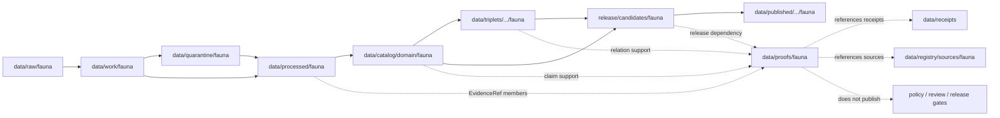

<!-- [KFM_META_BLOCK_V2]
doc_id: kfm://doc/data-proofs-fauna-readme
title: data/proofs/fauna/README.md — Fauna Proof Support
version: v0.2.0
type: directory-readme; domain-proof-support-lane; fauna-claim-support-index
status: repository-grounded draft; Fauna-specific proof producer, payload profile, policy enforcement, release, and public serving remain held
owners:
  - "NEEDS VERIFICATION — Fauna domain steward"
  - "NEEDS VERIFICATION — evidence, EvidenceBundle, and proof steward"
  - "NEEDS VERIFICATION — rights, sensitivity, geoprivacy, and stewardship reviewers"
  - "NEEDS VERIFICATION — policy, validation, release, correction, rollback, governed-UI, governed-AI, and docs stewards"
created: NEEDS VERIFICATION — greenfield stub existed before v0.1 expansion
updated: 2026-07-26
policy_label: restricted-review; proof-support; fauna; cite-or-abstain; deny-by-default-location; no-direct-public-path; release-gated
path: data/proofs/fauna/README.md
truth_posture: >
  CONFIRMED exact target path and prior blob, canonical data/proofs parent contract, current Directory Rules,
  fielded global EvidenceBundle semantic contract and JSON Schema, validator wrapper and minimal shared fixtures,
  bounded synthetic Fauna fixture-validation slice, explicit Fauna proof and release workflow holds, scaffold-level
  Fauna policy homes, absent expected Fauna EvidenceBundle and citation-validation child READMEs, and no established
  Fauna release candidate or public release / PROPOSED Fauna proof packet, source-role closure, sensitivity-safe
  representation, invalidation propagation, and future child-lane routing / UNKNOWN recursive proof payload inventory,
  active writers and consumers, generated indexes, resolver runtime, access controls, hosted routes, caches, and public
  effects / NEEDS VERIFICATION accountable owners, accepted Fauna proof profile, validator execution, domain fixtures,
  CI results, executable policy and geoprivacy enforcement, review records, release instances, correction propagation,
  withdrawal behavior, and rollback drills
evidence_snapshot:
  repository: bartytime4life/Kansas-Frontier-Matrix
  base_ref: main
  base_commit: 01d927659c183d252fc655eeffb1f44f0e0830ad
  base_drift_compare: 0b51a0afc569b5fdaee1698b4c088b9247b98f0f...01d927659c183d252fc655eeffb1f44f0e0830ad changed only data/proofs/evidence_bundle/flora/README.md; target blob remained unchanged
  prior_blob: d88b9a748ff69216278ce2ab9d27dcb0c63fae82
  blank_stub_lineage_blob: f0a67466a8d6fd6e0420a18236ee85bc7be23def
  directory_rules_blob: 2affb080e6f0043867c64c7f06c1ca52030fbd55
  proofs_root_blob: 0d8b6e92d3b4b9ff3961d29c53ead497922a31cf
  evidence_bundle_parent_blob: bf304383b725db95e0f8902f0c7c59d0a3cd0ee3
  citation_validation_parent_blob: 0a2868346aa1da194eeecb92563cefba03a28024
  evidence_bundle_contract_blob: 731c348832add23cddd14e796aa56ce2b9268259
  evidence_bundle_schema_blob: cf5256831b63dca46a5f68b168441adcf68b8751
  evidence_bundle_validator_blob: c1760c5e92eae6390f5adcde4593e8e9bab26535
  evidence_bundle_fixtures_readme_blob: 89ace659414a757c14a4d3e516fd31d44c6a9969
  fauna_contract_lane_blob: 192f680bc2ebdc69a9f76fcb986aac168601a1e3
  fauna_schema_lane_blob: 4bd3dd8696a5c29a8c746aced9cf14604e272d16
  fauna_policy_blob: 39b7c7dd859614ab9ae9a72208f693056c97f2c6
  fauna_sensitivity_policy_blob: aac9f7b6316b89238d209c7ef4045fbf4df15ea9
  fauna_source_registry_blob: c3a36f721b445ae41d2d9407f7b3524872ed1128
  fauna_release_candidate_blob: 653277efe3a44a96c29af481a73d7d90c41443ce
  fauna_tests_readme_blob: 72e93e4abcf48567942fb1a3a588944df1c83e3c
  fauna_workflow_blob: 85b0a8b42f9af40366de2b0c7d733892d4220ee0
  codeowners_blob: dd2a84aa514d8ecd9208bc347f90f9a2ed37dd61
related:
  - ../README.md
  - ../evidence_bundle/README.md
  - ../citation_validation/README.md
  - ../../README.md
  - ../../processed/fauna/README.md
  - ../../catalog/domain/fauna/README.md
  - ../../registry/sources/fauna/README.md
  - ../../receipts/README.md
  - ../../triplets/README.md
  - ../../published/fauna/README.md
  - ../../../contracts/evidence/evidence_bundle.md
  - ../../../contracts/evidence/evidence_ref.md
  - ../../../contracts/domains/fauna/README.md
  - ../../../schemas/contracts/v1/evidence/evidence_bundle.schema.json
  - ../../../schemas/contracts/v1/domains/fauna/README.md
  - ../../../fixtures/contracts/v1/evidence/evidence_bundle/README.md
  - ../../../tests/domains/fauna/README.md
  - ../../../tools/validators/validate_evidence_bundle.py
  - ../../../policy/evidence/README.md
  - ../../../policy/domains/fauna/README.md
  - ../../../policy/sensitivity/fauna/README.md
  - ../../../release/candidates/fauna/README.md
  - ../../../docs/domains/fauna/SENSITIVITY.md
  - ../../../docs/domains/fauna/DATA_LIFECYCLE.md
  - ../../../docs/runbooks/fauna/PROMOTION_RUNBOOK.md
  - ../../../docs/runbooks/fauna/ROLLBACK_RUNBOOK.md
  - ../../../docs/doctrine/directory-rules.md
  - ../../../docs/adr/ADR-0001-schema-home--schemas-contracts-v1-is-canonical.md
  - ../../../docs/adr/ADR-0010-deny-by-default-for-dna-rare-species-archaeology-infrastructure.md
  - ../../../docs/adr/ADR-0011-receipts-vs-proofs-vs-manifests-vs-catalog-separation.md
  - ../../../.github/workflows/domain-fauna.yml
  - ../../../.github/CODEOWNERS
notes:
  - "Same-path Markdown modernization only; no Fauna source bytes, proof payloads, EvidenceBundle instances, contracts, schemas, policies, validators, fixtures, workflows, candidates, releases, routes, hosting, or publication state changed."
  - "Base advanced from 0b51a0afc569b5fdaee1698b4c088b9247b98f0f to 01d927659c183d252fc655eeffb1f44f0e0830ad during preflight; the intervening diff modified only data/proofs/evidence_bundle/flora/README.md and did not change this target."
  - "The canonical parent proof README is an expanded repository-grounded draft; this file no longer describes it as a greenfield stub."
  - "The global EvidenceBundle contract, schema, validator wrapper, and minimal shared fixtures are fielded. Execution, resolver integrity, Fauna-specific profiles, policy enforcement, CI results, and runtime behavior remain bounded."
  - "The exact expected paths data/proofs/evidence_bundle/fauna/README.md and data/proofs/citation_validation/fauna/README.md were not found at the inspected base commit; this README does not create them or treat them as implemented."
  - "The domain-fauna workflow requires the literal line '**Status:** draft / PROPOSED' and deliberately holds Fauna proof production and release dry-run. This modernization preserves that compatibility token."
  - "The documentation rollback target for v0.2.0 is prior blob d88b9a748ff69216278ce2ab9d27dcb0c63fae82; the original blank-stub lineage blob remains recorded for history."
[/KFM_META_BLOCK_V2] -->

<a id="top"></a>

# data/proofs/fauna

> **One-line purpose.** Hold or index governed Fauna proof support that makes animal-related claims inspectable across evidence, source role, space, time, rights, sensitivity, geoprivacy, validation, review, release dependency, correction, and rollback—without becoming source data, public truth, or release authority.

[](#status)
[](#authority-level)
[](#fauna-claim-and-source-role-closure)
[](#sensitivity-geoprivacy-and-safe-representation)
[](#outputs)
[](#validation)

> [!IMPORTANT]
> **Evidence closure is necessary but not sufficient for publication.** A structurally valid proof packet or EvidenceBundle can support policy, review, and release evaluation, but it does not make a Fauna claim taxonomically correct, rights-cleared, sensitivity-safe, steward-approved, released, public, or safe for wildlife-location discovery.

> [!CAUTION]
> Missing, stale, conflicting, role-collapsed, rights-unclear, sensitivity-unsafe, unreviewed, unreleased, withdrawn, invalidated, or unresolvable support must produce a finite fail-closed result such as `ABSTAIN`, `HOLD`, `RESTRICT`, `DENY`, or `ERROR`.

> [!WARNING]
> Do not place exact or reverse-engineerable sensitive animal locations, nest/den/roost/hibernaculum/spawning-site details, private-land joins, steward-controlled records, access clues, withheld precision, geoprivacy thresholds, transform parameters, offsets, seeds, credentials, or other control-defeating material in this ordinary repository lane.

**Status:** draft / PROPOSED  
**Path:** `data/proofs/fauna/README.md`  
**Owning responsibility:** canonical `data/proofs/` proof support, specialized by the `fauna` domain segment  
**Lifecycle role:** supporting evidence closure alongside the governed lifecycle; not a lifecycle phase and not a promotion mechanism  
**Direct public access:** denied  
**Documentation rollback target:** prior blob `d88b9a748ff69216278ce2ab9d27dcb0c63fae82`

**Quick navigation:** [Purpose](#purpose) · [Authority](#authority-level) · [Status](#status) · [Belongs](#what-belongs-here) · [Exclusions](#what-does-not-belong-here) · [Inputs](#inputs) · [Outputs](#outputs) · [Validation](#validation) · [Review](#review-burden) · [Related](#related-folders) · [ADRs](#adrs) · [Last reviewed](#last-reviewed) · [Lifecycle](#lifecycle-relationship) · [Repo fit](#repo-fit) · [Packet](#fauna-proof-packet) · [Source roles](#fauna-claim-and-source-role-closure) · [Sensitivity](#sensitivity-geoprivacy-and-safe-representation) · [Requirements](#proof-requirements) · [Guardrails](#fauna-proof-guardrails) · [Directory map](#directory-map) · [Evidence](#evidence-ledger) · [Automation](#automation-and-implementation-posture) · [Checklist](#validation-checklist) · [Verification](#open-verification-register) · [No-loss](#no-loss-ledger) · [Rollback](#rollback)

---

## Purpose

`data/proofs/fauna/` is the Fauna domain proof-support lane. It may hold or index claim-scoped proof artifacts under an accepted profile so animal-related claims can be reconstructed to evidence, source role, geography, time, rights, sensitivity, safe representation, validation, review, release dependency, correction lineage, and rollback support.

The lane exists to make these questions inspectable before a Fauna claim advances:

1. What exact claim scope is supported?
2. Which governed `EvidenceRef` values and reconstructable source records support it?
3. Which taxon concept, object family, source role, geography, time, method, uncertainty, and limitations qualify the support?
4. Which citations, rights, sensitivity labels, transforms, checksums, and governing specification identity close the evidence packet?
5. Which exact/internal representation and public generalized, withheld, staged, aggregated, or denied representation apply?
6. Which policy, stewardship, review, release, correction, withdrawal, invalidation, and rollback dependencies remain outside the proof artifact?
7. Which finite downstream outcome is justified?

This lane supports evidence resolution. It does not admit sources, determine animal truth, define taxonomy, execute geoprivacy, decide policy, approve stewardship, authorize release, publish maps, provide operational wildlife guidance, or create public claims.

## Authority level

**Implementation-bearing domain proof-support lane under the canonical `data/proofs/` responsibility.**

Authority remains split by responsibility:

- [`data/proofs/fauna/`](./README.md) owns the Fauna-domain proof-support index and any accepted domain proof packet.
- [`data/proofs/evidence_bundle/`](../evidence_bundle/README.md) owns the EvidenceBundle proof-family index.
- [`data/proofs/citation_validation/`](../citation_validation/README.md) owns citation-resolution proof support.
- [`contracts/evidence/evidence_bundle.md`](../../../contracts/evidence/evidence_bundle.md) defines EvidenceBundle meaning.
- [`schemas/contracts/v1/evidence/evidence_bundle.schema.json`](../../../schemas/contracts/v1/evidence/evidence_bundle.schema.json) defines its current machine shape.
- `policy/`, review records, and `release/` retain admissibility, stewardship, release, correction, withdrawal, and rollback authority.
- Governed APIs and already released public-safe artifacts remain the normal public path.

The expected Fauna child READMEs under `data/proofs/evidence_bundle/fauna/` and `data/proofs/citation_validation/fauna/` are **not established at the inspected base commit**. This README does not create those paths, claim that they exist, or use their absence as permission to duplicate their future responsibilities here.

When one artifact could fit more than one proof axis, an accepted contract and profile must select one authoritative home. Other lanes may hold immutable references, indexes, or validation summaries; they must not duplicate mutable proof authority, restricted source material, receipts, policy decisions, release records, or public state.

## Status

| Surface | Bounded result |
|---|---|
| Exact path and baseline | **CONFIRMED** at `main@01d927659c183d252fc655eeffb1f44f0e0830ad`; prior blob `d88b9a748ff69216278ce2ab9d27dcb0c63fae82` |
| Documentation version | `v0.2.0` |
| Canonical proofs responsibility | **CONFIRMED repository-grounded draft** at [`data/proofs/README.md`](../README.md); no longer a greenfield stub |
| Global EvidenceBundle semantic contract | **CONFIRMED fielded draft**; separates claim-scope evidence closure from policy, release, receipts, public APIs, maps, and AI authority |
| Global EvidenceBundle schema | **CONFIRMED fielded / `x-kfm.status: PROPOSED`**; ten required fields and root `additionalProperties: false` |
| Validator wrapper | **CONFIRMED fielded / NOT RUN in this task** at `tools/validators/validate_evidence_bundle.py` |
| Shared EvidenceBundle fixtures | **CONFIRMED minimal valid/invalid family / NOT RUN in this task**; not Fauna-specific |
| Fauna domain contract lane | **CONFIRMED draft / mixed maturity**; source-role and sensitivity boundaries are documented, but several objects remain scaffold-level or require verification |
| Fauna schema lane | **CONFIRMED draft index**; broad production schema coverage is not established |
| Fauna policy homes | **CONFIRMED scaffold-level documents**; executable domain and geoprivacy enforcement are not established |
| Fauna-specific EvidenceBundle child README | **NOT FOUND** at `data/proofs/evidence_bundle/fauna/README.md` on the inspected base |
| Fauna citation-validation child README | **NOT FOUND** at `data/proofs/citation_validation/fauna/README.md` on the inspected base |
| Bounded synthetic Fauna test slice | **CONFIRMED documented and fielded / NOT RUN in this task**; seven deterministic tests over six synthetic fixtures are described by the current test-lane README |
| Fauna proof producer | **HELD** by the current workflow; no accepted producer or deterministic proof command is established |
| Fauna release dry-run | **HELD** by the current workflow; no accepted candidate manifest contract or domain release command is established |
| Active Fauna candidate or public release | **NOT ESTABLISHED** by the inspected release-candidate evidence |
| Recursive proof payload inventory, writers, consumers, routes, caches, and public effects | **UNKNOWN / NEEDS VERIFICATION** |
| Release authority of this README | None |

## What belongs here

After a Fauna proof profile, producer, validator path, policy posture, access controls, and review burden are accepted, this lane may hold or index:

- claim-scoped EvidenceBundle records, immutable references, or indexes for Fauna claims;
- `EvidenceRef` resolution maps and claim-to-evidence manifests;
- digest-closure manifests tying admitted sources, processed artifacts, catalog rows, triplets, receipts, candidate records, correction records, rollback targets, and proof artifacts to evidence;
- proof indexes for taxon identity, taxon crosswalk, conservation status, occurrence, range, seasonal range, migration, monitoring, sensitive site, mortality, disease, invasive species, and public-safe derivative claims;
- source-role closure summaries that preserve observed, regulatory, modeled, aggregate, administrative, candidate, and synthetic distinctions;
- geoprivacy and sensitivity proof summaries that reference governed transforms and review records without exposing restricted originals or control parameters;
- public-safe representation support showing that a released derivative is generalized, aggregated, suppressed, staged, withheld, or denied as policy requires;
- correction, supersession, withdrawal, and invalidation pointers that identify affected proof identities and downstream release dependencies;
- lane-local README, index, inventory, digest, migration, or disposition sidecars that explain the boundary without becoming a second authority surface.

No non-README proof payload should be added while the current `build-proof-fauna` workflow hold remains in place.

## What does NOT belong here

| Do not place here | Correct home or action |
|---|---|
| RAW source downloads, source-native occurrences, telemetry, field notes, media, or original geometry | `data/raw/fauna/`, restricted storage, or the correct upstream lifecycle lane |
| WORK normalization, taxonomy reconciliation, joins, notebooks, QA experiments, or geoprivacy trials | `data/work/fauna/` |
| Rights-, sensitivity-, source-role-, validation-, or release-unclear material | `data/quarantine/fauna/` or an approved restricted system |
| Normalized Fauna records or restricted/public processed derivatives | `data/processed/fauna/` |
| STAC, DCAT, PROV, domain catalog, or graph/triplet records | `data/catalog/` and `data/triplets/` |
| `RunReceipt`, `TransformReceipt`, `ValidationReport`, `PolicyDecision`, `ReviewRecord`, `RedactionReceipt`, `AggregationReceipt`, or `AIReceipt` as primary records | `data/receipts/` or the accepted record home |
| SourceDescriptor or source-admission records | `data/registry/sources/fauna/` or the accepted registry path |
| Contracts, schemas, executable policy, validators, fixtures, tests, pipelines, packages, apps, or workflows | Their owning responsibility roots |
| ReleaseManifest, PromotionDecision, CorrectionNotice, WithdrawalNotice, or RollbackCard | `release/` |
| Published map, tile, API, UI, download, report, story, export, Focus Mode answer, or model-answer text | Governed public interfaces and released artifact lanes only |
| Exact or reverse-engineerable occurrences, sensitive-site identifiers, private-land detail, access routes, withheld precision, or steward-only notes | Deny, quarantine, restrict, or handle in an approved system |
| Geoprivacy radii, thresholds, offsets, seeds, retained precision, transform internals, credentials, tokens, or private agreements | Approved restricted operational systems; never this public-repository README lane |
| Hunting, fishing, collection, access, enforcement, legal, medical, emergency, disease-alert, or life-safety guidance | Official competent authorities; KFM proof support is not an operational authority |

## Inputs

Inputs are references to governed records, not permission to copy their protected contents into this lane.

A candidate proof packet should receive, as applicable:

- stable claim and artifact identity;
- admitted `SourceDescriptor` and source-role references;
- processed record and catalog/triplet identities;
- `EvidenceRef` members and reconstructable source-record handles;
- citations and stated limitations;
- spatial, temporal, taxonomic, method, units, uncertainty, and confidence context;
- rights and sensitivity posture;
- public-safe transform references and checksums;
- validation, receipt, policy, review, candidate, release, correction, withdrawal, supersession, and rollback references.

Missing or incompatible inputs narrow the claim or yield a finite negative outcome. They do not invite plausible completion.

## Outputs

This lane may support:

- evidence and citation review;
- release-candidate preflight;
- Evidence Drawer and governed API resolution;
- public-safe map, export, and Focus Mode readiness checks;
- correction, withdrawal, supersession, and rollback impact analysis;
- auditable `ANSWER`, `ABSTAIN`, `HOLD`, `RESTRICT`, `DENY`, or `ERROR` decisions.

A proof artifact is not a public response body, public route, map layer, tile source, release manifest, policy decision, or publication record. Public clients must not read this directory directly.

## Validation

Validation must be profile-specific and fail closed. At minimum, a future accepted Fauna proof validator should check:

1. stable proof identity and declared claim scope;
2. global EvidenceBundle schema conformance where that shape is used;
3. cross-record `EvidenceRef` resolution and source-record reconstructability;
4. taxon concept, object family, source role, geography, time, method, units, uncertainty, and limitation compatibility;
5. rights, attribution, redistribution, sensitivity, stewardship, and geoprivacy dependencies;
6. transform references and digest/spec-hash closure without exposing control parameters;
7. receipt, policy, review, candidate, release, correction, withdrawal, invalidation, and rollback linkage;
8. absence of exact or reverse-engineerable restricted details;
9. source-role anti-collapse and public-derivative lineage;
10. finite negative outcomes for missing, stale, conflicting, restricted, superseded, withdrawn, invalidated, or unreleased support.

The current global wrapper at [`tools/validators/validate_evidence_bundle.py`](../../../tools/validators/validate_evidence_bundle.py) validates the shared JSON Schema fixture family. It was **not run in this Markdown task**, and schema validation alone does not prove Fauna taxonomic correctness, source admission, rights clearance, sensitivity safety, geoprivacy execution, review, release, or public use.

The current Fauna workflow performs two additional boundary checks:

- it requires the literal compatibility line `**Status:** draft / PROPOSED`; and
- it holds proof production if any non-README proof artifact, accepted proof target, or potential producer appears before governed wiring is established.

Changing that compatibility token or adding proof payloads requires a coordinated workflow, contract, validator, fixture, policy, access-control, review, and rollback change—not a README-only edit.

## Review burden

CODEOWNERS currently routes `/data/proofs/` review to `@bartytime4life`. That routing is not a `ReviewRecord`, stewardship assignment, rights-holder approval, geoprivacy approval, policy decision, release approval, independent separation of duties, or publication authority.

Review should include the narrow specialists implicated by the change:

| Change type | Required review posture |
|---|---|
| README-only boundary clarification | Fauna, proof/evidence, and docs review |
| Proof profile, schema, or validator linkage | Evidence, contract/schema, validation, and Fauna review |
| Source-role or taxonomic claim support | Fauna, taxonomy, source, and evidence review |
| Rights, sensitivity, exact-location, or public-safe transform support | Rights-holder, sensitivity/geoprivacy, Fauna, policy, and independent review |
| Candidate, release, correction, withdrawal, or rollback linkage | Release, correction/rollback, policy, proof/evidence, and independent review |
| Public API, map, export, or governed-AI use | Governed API/UI/AI, accessibility, policy, release, and domain review |

Accountable role assignments and quorum remain **NEEDS VERIFICATION**.

## Related folders

| Responsibility | Repository surface |
|---|---|
| Canonical proof parent | [`data/proofs/`](../README.md) |
| EvidenceBundle proof family | [`data/proofs/evidence_bundle/`](../evidence_bundle/README.md) |
| Citation-validation proof family | [`data/proofs/citation_validation/`](../citation_validation/README.md) |
| Processed Fauna records | [`data/processed/fauna/`](../../processed/fauna/README.md) |
| Fauna domain catalog | [`data/catalog/domain/fauna/`](../../catalog/domain/fauna/README.md) |
| Source admission and source role | [`data/registry/sources/fauna/`](../../registry/sources/fauna/README.md) |
| Process receipts | [`data/receipts/`](../../receipts/README.md) |
| Relationship projections | [`data/triplets/`](../../triplets/README.md) |
| Published Fauna lane | [`data/published/fauna/`](../../published/fauna/README.md) |
| EvidenceBundle meaning | [`contracts/evidence/evidence_bundle.md`](../../../contracts/evidence/evidence_bundle.md) |
| EvidenceRef meaning | [`contracts/evidence/evidence_ref.md`](../../../contracts/evidence/evidence_ref.md) |
| Fauna semantic contracts | [`contracts/domains/fauna/`](../../../contracts/domains/fauna/README.md) |
| Shared EvidenceBundle machine shape | [`schemas/contracts/v1/evidence/evidence_bundle.schema.json`](../../../schemas/contracts/v1/evidence/evidence_bundle.schema.json) |
| Fauna schema index | [`schemas/contracts/v1/domains/fauna/`](../../../schemas/contracts/v1/domains/fauna/README.md) |
| Shared EvidenceBundle fixtures | [`fixtures/contracts/v1/evidence/evidence_bundle/`](../../../fixtures/contracts/v1/evidence/evidence_bundle/README.md) |
| Fauna tests | [`tests/domains/fauna/`](../../../tests/domains/fauna/README.md) |
| Evidence admissibility | [`policy/evidence/`](../../../policy/evidence/README.md) |
| Fauna domain policy | [`policy/domains/fauna/`](../../../policy/domains/fauna/README.md) |
| Fauna sensitivity policy | [`policy/sensitivity/fauna/`](../../../policy/sensitivity/fauna/README.md) |
| Fauna candidate review | [`release/candidates/fauna/`](../../../release/candidates/fauna/README.md) |
| Sensitivity and geoprivacy explanation | [`docs/domains/fauna/SENSITIVITY.md`](../../../docs/domains/fauna/SENSITIVITY.md) |
| Fauna lifecycle explanation | [`docs/domains/fauna/DATA_LIFECYCLE.md`](../../../docs/domains/fauna/DATA_LIFECYCLE.md) |
| Promotion runbook | [`docs/runbooks/fauna/PROMOTION_RUNBOOK.md`](../../../docs/runbooks/fauna/PROMOTION_RUNBOOK.md) |
| Rollback runbook | [`docs/runbooks/fauna/ROLLBACK_RUNBOOK.md`](../../../docs/runbooks/fauna/ROLLBACK_RUNBOOK.md) |
| Fauna readiness workflow | [`.github/workflows/domain-fauna.yml`](../../../.github/workflows/domain-fauna.yml) |
| GitHub review routing | [`.github/CODEOWNERS`](../../../.github/CODEOWNERS) |

## ADRs

These decisions are present but not accepted merely because this README cites them:

- [ADR-0001 — Schema Home: `schemas/contracts/v1/` is Canonical](../../../docs/adr/ADR-0001-schema-home--schemas-contracts-v1-is-canonical.md) — status `proposed`;
- [ADR-0010 — Deny-by-Default for DNA, Rare Species, Archaeology, and Critical Infrastructure](../../../docs/adr/ADR-0010-deny-by-default-for-dna-rare-species-archaeology-infrastructure.md) — status `draft`, effective decision remains proposed;
- [ADR-0011 — Receipts vs Proofs vs Manifests vs Catalog Separation](../../../docs/adr/ADR-0011-receipts-vs-proofs-vs-manifests-vs-catalog-separation.md) — status `proposed`.

This README preserves the current responsibility split without accepting an ADR, creating a new proof family, migrating records, or resolving open source-registry, receipt, release-manifest, rollback, or sensitivity-tier topology questions.

## Last reviewed

- **Date:** 2026-07-26
- **Evidence boundary:** `main@01d927659c183d252fc655eeffb1f44f0e0830ad`
- **Review type:** complete target read, current parent/family contracts, exact expected-child checks, global EvidenceBundle contract/schema/wrapper/fixture inspection, Fauna source/contract/schema/policy/test/release/workflow inspection, overlap search, and source-level Markdown validation
- **Runtime or release execution:** not performed
- **Owners, independent review, accepted Fauna proof profile, policy runtime, public routes, correction propagation, and operational rollback:** need verification

Re-review on proof-profile, producer, policy, sensitive-location, source-role, candidate, release, public-consumer, correction, withdrawal, invalidation, or rollback changes—or within six months.

---

## Lifecycle relationship

```text
RAW -> WORK / QUARANTINE -> PROCESSED -> CATALOG / TRIPLET -> PUBLISHED
                           \-> data/proofs/fauna supports evidence closure
```


```mermaid
flowchart LR
  RAW["data/raw/fauna"] --> WORK["data/work/fauna"]
  WORK --> QUAR["data/quarantine/fauna"]
  WORK --> PROC["data/processed/fauna"]
  QUAR --> PROC
  PROC --> CAT["data/catalog/domain/fauna"]
  CAT --> TRIP["data/triplets/.../fauna"]
  CAT --> CAND["release/candidates/fauna"]
  TRIP --> CAND
  CAND --> PUB["data/published/.../fauna"]

  PROC -. "EvidenceRef members" .-> PROOF["data/proofs/fauna"]
  CAT -. "claim support" .-> PROOF
  TRIP -. "relation support" .-> PROOF
  CAND -. "release dependency" .-> PROOF
  PROOF -. "references receipts" .-> RECEIPTS["data/receipts"]
  PROOF -. "references sources" .-> REG["data/registry/sources/fauna"]
  PROOF -. "does not publish" .-> HOLD["policy / review / release gates"]
```

Proof support may inform catalog, triplet, candidate, release, correction, rollback, Evidence Drawer, and governed-answer decisions. It never promotes or publishes anything by itself.

## Repo fit

| Responsibility | Correct home | Boundary |
|---|---|---|
| Original Fauna source material | `data/raw/fauna/` or approved restricted storage | Not proof support |
| Candidate transforms and QA | `data/work/fauna/` | Not proof support |
| Unsafe or unresolved material | `data/quarantine/fauna/` | Not proof support |
| Normalized Fauna records | `data/processed/fauna/` | Not proof support |
| Fauna catalog and graph projections | `data/catalog/domain/fauna/`, `data/triplets/` | Derived indexes, not proof authority |
| Fauna domain proof support | `data/proofs/fauna/` | This lane |
| EvidenceBundle proof-family support | `data/proofs/evidence_bundle/<domain>/` after the child profile is accepted | Fauna child not currently established |
| Citation-validation proof support | `data/proofs/citation_validation/<domain>/` after the child profile is accepted | Fauna child not currently established |
| Process and review receipts | `data/receipts/` | Referenced, not stored here |
| Source registry | `data/registry/sources/fauna/` or ADR-resolved successor | Source admission, not proof |
| Semantic contracts | `contracts/evidence/`, `contracts/domains/fauna/` | Meaning, not payload storage |
| Machine schemas | `schemas/contracts/v1/evidence/`, `schemas/contracts/v1/domains/fauna/` | Shape, not proof records |
| Policy and sensitivity | `policy/evidence/`, `policy/domains/fauna/`, `policy/sensitivity/fauna/` | Admissibility, not proof storage |
| Executable validation | `tools/validators/`, `tests/`, `fixtures/` | Checks and examples, not proof authority |
| Candidate and release decisions | `release/` | Publication authority remains separate |
| Published public-safe carriers | `data/published/` and governed public interfaces | Downstream only |

This placement follows Directory Rules: `data/proofs/` owns proof support; `fauna` is a domain segment inside that responsibility root; receipts, sources, schemas, contracts, policy, releases, and public carriers remain separate.

## Accepted contents

Subject to the status and workflow hold above, accepted Fauna proof support includes:

- EvidenceBundle records, indexes, or pointers that conform to an accepted profile;
- EvidenceRef resolution maps and claim-support manifests;
- source, processed, catalog, triplet, receipt, candidate, release, correction, and rollback digest closure;
- source-role and claim-scope compatibility summaries;
- sensitivity-safe geoprivacy proof references;
- public-derivative lineage and transform references;
- finite negative-state support;
- invalidation, correction, withdrawal, supersession, and rollback impact pointers;
- domain proof indexes and public-safe README sidecars.

The lane must remain compact, pointer-oriented, and free of protected source detail.

## Exclusions

In addition to the responsibility table above, this lane excludes:

- canonical taxonomic authority or source-role reassignment;
- public occurrence services or sensitive-location discovery;
- source activation, policy approval, stewardship approval, release approval, or publication state;
- proof-by-documentation claims;
- model, habitat, range, or aggregate outputs silently presented as observed occurrences;
- operational disease, mortality, hunting, fishing, collection, access, legal, enforcement, or emergency guidance;
- generated prose used as evidence;
- screenshots, badges, maps, tiles, graphs, or dashboards treated as proof;
- secret, private, restricted, or rights-limited material that is unsafe for the repository.

## Fauna proof packet

The fielded shared EvidenceBundle schema currently requires these top-level fields:

| Required field | Shared meaning | Fauna closure expectation |
|---|---|---|
| `bundle_id` | Stable bundle identity | Deterministic, scoped identity; no sensitive location encoded in the identifier |
| `claim_scope` | Exact claims the bundle may support | Names the Fauna object family, taxon concept, space/time scope, method, and limitations without leaking protected precision |
| `evidence_refs` | Governed evidence pointers | Resolve to compatible evidence; a pointer alone is not closure |
| `source_records` | Reconstructable source handles | Preserve original authority and source role |
| `citations` | Publication-ready citations | Support the exact claim scope and remain rights/sensitivity compatible |
| `rights` | Effective rights summary | Includes `license`; does not imply release permission |
| `sensitivity` | Exposure constraints | Must reflect sensitive-taxon, sensitive-site, stewardship, private-land, and re-identification posture |
| `transforms` | Ordered derivation references | Preserve redaction/generalization/aggregation reviewability without exposing control parameters |
| `checksums` | Critical input/output hashes | Detect drift or tampering across evidence and derived artifacts |
| `spec_hash` | Governing contract/schema identity | Pins the bundle to the evaluated profile |

The current schema forbids undeclared top-level fields. Fauna-specific qualifiers therefore must be represented through accepted referenced records and profile semantics—not invented ad hoc as extra fields that bypass schema/version review.

A complete Fauna proof packet also needs separate references to policy, review, candidate/release, correction, withdrawal, invalidation, and rollback records where applicable. EvidenceBundle does not absorb those authorities.

## Fauna claim and source-role closure

| Claim or object family | What proof may support | What it must not silently become |
|---|---|---|
| `Taxon` / `TaxonCrosswalk` | Taxon concept, authority, version, synonym or crosswalk relationship | A permanent identity detached from source authority and time |
| `ConservationStatus` | Named status under a stated authority, geography, and effective period | Observed occurrence or current legal advice |
| `OccurrenceEvidence` | Evidence that an observation or source record supports a bounded occurrence claim | Public-safe geometry or released occurrence by default |
| `OccurrenceRestricted` | Restricted exact/internal occurrence support under approved controls | Public occurrence, map feature, download, or API response |
| `OccurrencePublic` | Governed public-safe derivative with release and transform support | The restricted original or proof that exact precision is safe |
| `RangePolygon` / `SeasonalRange` | Distribution or seasonal-use interpretation under stated source roles and uncertainty | A point occurrence, nest, den, roost, hibernaculum, or spawning site |
| `MigrationRoute` | Bounded route/use evidence or model support under sensitivity review | Exact vulnerable movement location or access guide |
| `SensitiveSite` | Restricted evidence that a sensitive site exists and requires protected handling | Public site discovery, exact geometry, access directions, or collection aid |
| `MonitoringEvent` | Monitoring method, time, scope, and result support | General animal truth beyond the monitored scope |
| `MortalityObservation` | Bounded mortality evidence with method and time | Disease diagnosis, regulatory conclusion, emergency warning, or cause beyond support |
| `DiseaseObservation` | Bounded surveillance or observation evidence with caveats | Medical, veterinary, public-health, or emergency authority |
| `InvasiveSpeciesRecord` | Bounded occurrence/status evidence with private-land and source-role safeguards | Parcel targeting, enforcement action, or operational guidance |
| Habitat/model/aggregate/synthetic support | Context, suitability, trend, summary, or modeled distribution under explicit role | Observed occurrence unless the EvidenceBundle independently closes that claim |

Source access path is not source role. Aggregators, models, catalogs, and public derivatives must preserve the authority and limitations of the underlying evidence.

## Sensitivity, geoprivacy, and safe representation

Fauna proof support must fail closed for:

- sensitive taxa and exact occurrences;
- nests, dens, roosts, hibernacula, spawning sites, breeding or aggregation sites;
- telemetry or movement detail;
- steward-, rights-holder-, agency-, cultural-, or private-land-controlled records;
- joins that re-identify a withheld location;
- source terms that restrict redistribution or public display;
- transform details that would defeat generalization or suppression.

A public-safe derivative may be supported only when the proof packet can point to:

1. the restricted input identity in an approved system;
2. the applicable sensitivity and rights decision;
3. a reviewed public-safe transformation or denial;
4. the transformed artifact identity and checksums;
5. validation and review records;
6. release, correction, withdrawal, and rollback dependencies.

The ordinary repository proof lane should contain only safe summaries and references. It must not contain enough detail to reverse the transform.

## Proof requirements

| Requirement | Required behavior |
|---|---|
| Claim-scope precision | State exactly which taxon/object/space/time/method claim is supported and which claims are outside scope |
| EvidenceRef resolution | Resolve every declared pointer through the governed evidence path or return a finite negative outcome |
| EvidenceBundle closure | Bind the shared required fields and profile-specific compatibility rules |
| Source-role preservation | Keep observed, regulatory, modeled, aggregate, administrative, candidate, and synthetic roles distinct |
| Taxonomic versioning | Pin taxon concept and authority where identity can drift |
| Spatial and temporal support | Keep exact/internal and public-safe geography distinct; state valid/observed/source/retrieval/release time as applicable |
| Rights and sensitivity | Record effective restrictions and obligations without placing protected details here |
| Public-safe derivative proof | Preserve lineage from restricted input to generalized, aggregated, suppressed, staged, withheld, or denied output |
| Digest and spec closure | Pin critical inputs, outputs, and governing profile |
| Policy and review dependency | Point to separate decisions; do not absorb them into proof |
| Candidate and release dependency | Point to separate release records; proof presence is not publication |
| Correction and invalidation | Identify downstream bundles, catalogs, candidates, public artifacts, and caches affected by change |
| No direct public path | Prevent browser, API, tile, export, or model access to this lane as public truth |
| Finite failure behavior | Missing or incompatible support yields `ABSTAIN`, `HOLD`, `RESTRICT`, `DENY`, or `ERROR` |

## Fauna proof guardrails

- EvidenceBundle outranks generated summaries, map pixels, screenshots, and UI properties.
- An `EvidenceRef` is a pointer; it does not guarantee closure.
- Proof records support evidence closure; they are not source data, receipts, catalog records, release manifests, or public products.
- Schema validity does not prove taxonomy, evidence quality, rights, sensitivity, geoprivacy, policy approval, review, release, or public safety.
- Exact sensitive locations must not leak through identifiers, citations, free text, joins, checksums-as-lookups, filenames, examples, or generated indexes.
- A public derivative must not be reverse-engineerable to the restricted original.
- Habitat suitability, modeled range, seasonal support, migration context, aggregate density, and synthetic summaries are not observed occurrence evidence unless separately supported.
- Cross-lane evidence must retain the owning domain, source role, rights, sensitivity, and correction lineage.
- AI may summarize only governed released evidence within a validated finite envelope; AI text is not proof.
- KFM is not a wildlife emergency, disease alert, hunting, fishing, collection, land-access, enforcement, legal, medical, veterinary, or life-safety authority.
- Public clients and Focus Mode use governed APIs, released artifacts, and EvidenceBundle-backed envelopes—not this directory directly.

> [!CAUTION]
> Do not expose `data/proofs/fauna/` as a public map, API, UI, download, Focus Mode answer, AI source, exact-species-location service, nest/den/roost/spawning discovery surface, access guide, landowner/parcel targeting aid, enforcement aid, or operational guidance product.

## Directory map

The current bounded posture is a documented Fauna proof lane with proof production held. Do not materialize the proposed children below until an accepted profile and coordinated implementation authorize them.

```text
data/proofs/fauna/
└── README.md                         # CONFIRMED — this boundary document

Potential future children — NOT ESTABLISHED:
├── claim_support/                    # claim-to-evidence indexes
├── digest_closure/                   # cross-artifact digest closure
├── source_roles/                     # source-role compatibility support
├── sensitivity/                      # safe sensitivity proof pointers
├── geoprivacy/                       # safe transform/invalidation pointers
├── cross_lane/                       # governed cross-domain support
├── releases/                         # proof pointers, never ReleaseManifest authority
├── corrections/                      # invalidation pointers, never CorrectionNotice authority
└── validation/                       # lane-local summaries, never ValidationReport authority
```

Related object-family children are separate possible paths and are also **not established for Fauna** at the inspected base:

```text
data/proofs/evidence_bundle/fauna/
data/proofs/citation_validation/fauna/
```

Creating any child requires Directory Rules review, duplicate-authority search, an accepted profile, public-safe fixtures, deterministic validation, workflow updates, review, and rollback.

## Evidence ledger

| Evidence | Status | Supports | Limits |
|---|---|---|---|
| Prior target blob `d88b9a7…` | **CONFIRMED** | Existing purpose, exclusions, lifecycle, source-role, geoprivacy, correction, and rollback material | Contained stale parent-stub and implementation-gap statements |
| [`data/proofs/README.md`](../README.md) | **CONFIRMED repository-grounded draft** | Canonical proof responsibility and no-direct-public-path boundary | Recursive payloads and complete lane-wide enforcement remain unknown |
| [`data/proofs/evidence_bundle/README.md`](../evidence_bundle/README.md) | **CONFIRMED draft family guide** | EvidenceBundle proof-family boundary and child-lane pattern | Fauna child is proposed, not established |
| [`data/proofs/citation_validation/README.md`](../citation_validation/README.md) | **CONFIRMED repository-grounded draft** | Citation-resolution proof responsibility | Fauna child is not established; accepted profile and enforcement remain unverified |
| [`contracts/evidence/evidence_bundle.md`](../../../contracts/evidence/evidence_bundle.md) | **CONFIRMED fielded draft** | Claim-scope closure meaning and authority split | Policy, release, resolver, runtime, and public behavior remain separate |
| [`schemas/contracts/v1/evidence/evidence_bundle.schema.json`](../../../schemas/contracts/v1/evidence/evidence_bundle.schema.json) | **CONFIRMED fielded / status `PROPOSED`** | Ten required fields, references, checksum/spec-hash shape, `additionalProperties: false` | Does not prove cross-record or Fauna-specific closure |
| [`tools/validators/validate_evidence_bundle.py`](../../../tools/validators/validate_evidence_bundle.py) and shared fixtures | **CONFIRMED fielded / NOT RUN** | Shared schema-validation entry point and minimal positive/negative examples | Not Fauna-specific; execution and CI result not established here |
| [`contracts/domains/fauna/`](../../../contracts/domains/fauna/README.md) | **CONFIRMED draft / mixed maturity** | Source-role, object-family, sensitivity, and evidence expectations | Several contracts and implementations remain scaffold-level or require verification |
| [`schemas/contracts/v1/domains/fauna/`](../../../schemas/contracts/v1/domains/fauna/README.md) | **CONFIRMED draft index** | Fauna schema placement and candidate inventory | Broad production schema coverage is not established |
| [`policy/domains/fauna/`](../../../policy/domains/fauna/README.md) and [`policy/sensitivity/fauna/`](../../../policy/sensitivity/fauna/README.md) | **CONFIRMED scaffolds** | Intended policy homes | Executable Fauna/geoprivacy policy is not established |
| [`data/registry/sources/fauna/`](../../registry/sources/fauna/README.md) | **CONFIRMED draft** | Source admission, role, rights, sensitivity, and topology cautions | Source topology and concrete activated descriptors remain bounded |
| [`tests/domains/fauna/`](../../../tests/domains/fauna/README.md) | **CONFIRMED documented bounded slice / NOT RUN** | Synthetic, no-network, fail-closed fixture-safety coverage | Not production schema, evidence, policy, proof, release, or publication validation |
| [`release/candidates/fauna/`](../../../release/candidates/fauna/README.md) | **CONFIRMED repository-grounded draft** | Candidate boundary and no-release conclusion | No child candidate, accepted manifest, or public release established |
| [`.github/workflows/domain-fauna.yml`](../../../.github/workflows/domain-fauna.yml) | **CONFIRMED workflow definition** | Read-only deterministic fixture job plus explicit proof/release holds | Workflow source is not a successful run, proof producer, policy decision, release, or publication |

## Automation and implementation posture

The current Fauna workflow has three separate postures:

| Job | Current role | What a green result does **not** prove |
|---|---|---|
| `validate-fauna` | Runs the accepted deterministic synthetic fixture-safety test module | Fauna truth, source admission, rights, EvidenceBundle closure, geoprivacy execution, policy approval, release readiness, or public safety |
| `build-proof-fauna` | Explicit readiness hold; rejects unexpected proof payloads or producer surfaces | EvidenceBundle, ProofPack, ValidationReport, RedactionReceipt, review, candidate, release, or publication |
| `publish-dry-run-fauna` | Explicit readiness hold; requires a future accepted candidate and release contract | Promotion, manifest assembly, deployment, public release, or KFM publication |

This README deliberately does not add a workflow badge. A single green workflow status would collapse the accepted fixture test and the explicit proof/release holds into a misleading maturity signal.

### Graduation conditions

The proof hold should be replaced only through a coordinated change that establishes:

- a reviewed Fauna proof profile and deterministic identity;
- accepted contract/schema placement;
- public-safe positive and fail-closed negative fixtures;
- deterministic no-network proof validation;
- source-role, rights, sensitivity, geoprivacy, taxonomic, spatial, temporal, and citation checks;
- process receipts and cross-record resolver integrity;
- access controls for any restricted support;
- correction, withdrawal, invalidation, and rollback handling;
- review and separation-of-duties requirements;
- a bounded producer command that cannot publish; and
- documentation and workflow updates that preserve the trust membrane.

A proof producer still would not authorize release. Candidate, policy, review, manifest, correction, withdrawal, and rollback gates remain separate.

## Validation checklist

- [ ] Confirm the recursive child and payload inventory at a pinned commit.
- [ ] Confirm whether this lane stores concrete records, immutable indexes, or pointers to another accepted proof store.
- [ ] Accept a Fauna-specific proof profile without creating parallel EvidenceBundle or citation-validation authority.
- [ ] Confirm contract/schema pairing, deterministic identity, `spec_hash`, and cross-record resolver behavior.
- [ ] Add public-safe positive and fail-closed negative Fauna proof fixtures.
- [ ] Verify taxon concept, object family, source role, geography, time, method, uncertainty, rights, sensitivity, geoprivacy, review, release, correction, withdrawal, invalidation, and rollback checks.
- [ ] Verify no restricted location or transform-reversal detail can enter proof files, filenames, citations, indexes, logs, summaries, or public routes.
- [ ] Verify SourceDescriptor linkage and origin-role preservation for every proof-supported source.
- [ ] Verify receipts and release records are immutable references, not misplaced primary records.
- [ ] Verify public clients and governed AI cannot read this lane directly.
- [ ] Replace the workflow hold only with an accepted deterministic proof command and bounded validation summary.
- [ ] Run the global EvidenceBundle validator and the applicable Fauna tests in a safe no-network environment.
- [ ] Observe CI without treating a held green job as proof or release.
- [ ] Verify correction, withdrawal, supersession, invalidation, cache handling, and rollback drills before any public consumer exists.

## Open verification register

| Item | Status | Required evidence |
|---|---:|---|
| Recursive Fauna proof inventory | `UNKNOWN` | Pinned recursive tree, file types, generated/external stores, rights/sensitivity classification |
| Fauna EvidenceBundle child profile | `NOT ESTABLISHED` | Accepted path, contract/profile, schema use, fixtures, validator, index/record decision |
| Fauna citation-validation child profile | `NOT ESTABLISHED` | Accepted path, contract/profile, resolver behavior, fixtures, validator |
| Active proof writers and consumers | `UNKNOWN` | Pipeline, tool, workflow, runtime, API/UI, and deployed-consumer inventory |
| Fauna taxonomic and source-role closure | `NEEDS VERIFICATION` | Accepted contracts, schemas, source records, crosswalks, negative tests |
| Executable Fauna policy and geoprivacy | `NOT ESTABLISHED` | Policy bundle, decisions, obligations, fixtures, evaluator, CI, access controls |
| Resolver and digest integrity | `NEEDS VERIFICATION` | Cross-record tests, content/spec hashes, missing/stale/conflict cases |
| Proof correction and invalidation propagation | `UNKNOWN` | Correction/withdrawal records, dependency index, cache and artifact invalidation tests |
| Candidate and release closure | `NOT ESTABLISHED` | Candidate dossier, policy/review records, proof closure, manifest, rollback target |
| Public serving and access controls | `UNKNOWN` | Governed routes, authentication/authorization, hosting, caches, denied direct-store access |
| Accountable owners and separation of duties | `NEEDS VERIFICATION` | Approved steward assignments, review quorum, independent approval controls |
| Operational rollback drills | `NOT RUN` | Revert/withdraw/invalidate drill with recorded outcome |

Unknowns narrow scope and block higher-risk transitions; they do not authorize inferred defaults.

## No-loss ledger

| Baseline element | Disposition in v0.2.0 |
|---|---|
| Stable path and `doc_id` | **KEEP** |
| Fauna domain proof-lane identity | **KEEP / CLARIFY** |
| Cite-or-abstain and EvidenceBundle subordination | **KEEP / ENRICH** |
| RAW → WORK/QUARANTINE → PROCESSED → CATALOG/TRIPLET → PUBLISHED lifecycle | **KEEP** |
| Source-role anti-collapse | **KEEP / ENRICH** with a claim-family matrix |
| Sensitive occurrence and sensitive-site denial | **KEEP / STRENGTHEN** without adding protected parameters |
| Separation of proof, receipts, registry, catalog, policy, and release | **KEEP / CLARIFY** against current parent contracts |
| Public-client and governed-AI boundary | **KEEP / STRENGTHEN** |
| Correction, withdrawal, invalidation, and rollback posture | **KEEP / ENRICH** |
| Parent `data/proofs/` described as a greenfield stub | **REPAIR** — current parent is an expanded repository-grounded draft |
| Global EvidenceBundle schema/validator described as unverified existence | **REPAIR** — fielded contract/schema/wrapper/minimal fixtures are confirmed; execution and domain closure remain bounded |
| Speculative child directory tree presented as local organization | **CLARIFY** — retain as potential children, explicitly not established and blocked by the workflow hold |
| Original blank-stub rollback reference | **KEEP AS LINEAGE**; current documentation rollback target is the immediate prior blob |
| Exact status compatibility line used by the Fauna workflow | **KEEP** |
| Uncertainty and implementation holds | **KEEP / MAKE MORE PRECISE** |
| Payload, workflow, contract, schema, policy, source, candidate, release, or public-state change | **NONE** |

## Rollback

### Documentation rollback

Before merge, close or abandon the draft PR and branch. After merge, use a transparent revert commit or revert pull request restoring prior blob:

```text
d88b9a748ff69216278ce2ab9d27dcb0c63fae82
```

The older blank-stub blob `f0a67466a8d6fd6e0420a18236ee85bc7be23def` is retained as lineage, not the preferred rollback target for this modernization.

### Operational rollback

This README change creates no Fauna proof payload, producer, policy decision, candidate, release, route, cache, deployment, or publication state, so it requires no data or runtime rollback.

Future proof implementation must define rollback for:

- incorrect or overbroad claim scope;
- stale or superseded evidence;
- taxonomic remapping;
- source-role correction;
- rights or sensitivity changes;
- unsafe public-safe transforms;
- invalid or mismatched digests/spec hashes;
- proof invalidation propagation;
- withdrawn candidates or releases;
- public artifact and cache invalidation; and
- restoration of the last known governed state without deleting correction history.

Rollback is required if this lane becomes a source-data root, WORK or QUARANTINE bypass, processed-data substitute, receipt store, registry, catalog, release authority, public output root, direct API/UI/tile/model path, exact-location disclosure path, geoprivacy bypass, model-as-observation path, proof-without-evidence path, or operational advice surface.

<p align="right"><a href="#top">Back to top</a></p>
