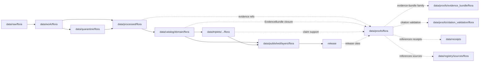

<!-- [KFM_META_BLOCK_V2]
doc_id: kfm://doc/data-proofs-flora-readme
title: data/proofs/flora/README.md — Flora Proofs README
version: v0.1
type: readme; proof-lane-guide; evidence-bundle-lane; flora-domain-proof-index; sensitive-location-claim-support-lane
status: draft; PROPOSED; data-root; proofs-root; flora; evidence-bundle; evidence-ref; claim-support; digest-closure; cite-or-abstain; sensitivity-aware; rare-plant-aware; release-gated; evidence-first
authors: ChatGPT-5.5 Thinking; reviewed_by: OWNER_TBD
owners: OWNER_TBD — Flora steward · Evidence steward · Proof steward · Sensitivity reviewer · Redaction reviewer · Policy steward · Release steward · Docs steward
created: NEEDS VERIFICATION — greenfield stub existed before v0.1 expansion
updated: 2026-06-25
policy_label: restricted-doc; data; proofs; flora; evidence; sensitivity; lifecycle; governed; release-gated
tags: [kfm, data, proofs, flora, plants, rare-plants, sensitive-location, EvidenceBundle, EvidenceRef, proof, claim-support, digest-closure, SourceDescriptor, CatalogMatrix, ReleaseManifest, ReviewRecord, CorrectionNotice, RollbackCard, PolicyDecision, ValidationReport, RedactionReceipt, PlantTaxon, FloraTaxonCrosswalk, FloraOccurrence, SpecimenRecord, RarePlantRecord, VegetationCommunity, InvasivePlantRecord, PhenologyObservation, RangePolygon, DistributionSurface, HabitatAssociation, BotanicalSurvey, RestorationPlanting, source-role, redaction, generalization, RAW, WORK, QUARANTINE, PROCESSED, CATALOG, TRIPLET, PUBLISHED]
related:
  - ../README.md
  - ../../README.md
  - evidence_bundle/README.md
  - evidence_bundle/flora/README.md
  - citation_validation/README.md
  - citation_validation/flora/README.md
  - ../../catalog/domain/flora/
  - ../../processed/flora/
  - ../../receipts/
  - ../../registry/sources/flora/
  - ../../published/layers/flora/
  - ../../triplets/
  - ../../../docs/domains/flora/README.md
  - ../../../docs/domains/flora/OBJECT_FAMILIES.md
  - ../../../docs/domains/flora/SOURCE_REGISTRY.md
  - ../../../docs/domains/flora/ARCHITECTURE.md
  - ../../../docs/domains/flora/RELEASE_INDEX.md
  - ../../../docs/domains/flora/MAP_UI_CONTRACTS.md
  - ../../../docs/domains/flora/CANONICAL_PATHS.md
  - ../../../docs/domains/flora/VERIFICATION_BACKLOG.md
  - ../../../contracts/domains/flora/
  - ../../../schemas/contracts/v1/domains/flora/
  - ../../../schemas/contracts/v1/evidence/evidence_bundle.schema.json
  - ../../../policy/domains/flora/
  - ../../../policy/sensitivity/flora/
  - ../../../release/candidates/flora/
  - ../../../release/
  - ../../../pipelines/domains/flora/
  - ../../../pipeline_specs/flora/
  - ../../../tools/validators/
notes:
  - "This file replaces a greenfield stub at `data/proofs/flora/README.md`."
  - "This is the parent Flora proof lane guide under `data/proofs/`. It is not RAW source storage, WORK scratch, QUARANTINE holding, PROCESSED data, CATALOG, TRIPLET, PUBLISHED output, receipt storage, source registry, policy authority, release authority, schema home, validator home, public API/UI output, public map/tile output, rare-plant discovery surface, exact-location disclosure surface, landowner/private-access surface, or stewardship decision authority."
  - "Proof records support Flora EvidenceBundle / EvidenceRef closure and claim support. Receipts such as RedactionReceipt, ValidationReport, ReviewRecord, PolicyDecision, ReleaseManifest, CorrectionNotice, and RollbackCard remain in their own receipt/release lanes and may be referenced by proofs; they are not owned here."
  - "Flora proof material is fail-closed where rare, protected, culturally sensitive, steward-reviewed, private-land, or exact-location evidence could leak."
  - "The `evidence_bundle/flora/` and `citation_validation/flora/` child lanes are confirmed present and expanded. Other child lanes listed here are PROPOSED until verified."
  - "This README is a proof-lane guide only. Contracts define semantic object meaning; schemas define machine shape; policy decides admissibility; release records decide publication."
  - "Rollback target for this expansion is previous greenfield stub blob SHA `9338f43f6e61ede5a93234afbfd145451d2d4301`."
[/KFM_META_BLOCK_V2] -->

<a id="top"></a>

# data/proofs/flora

> Parent Flora proof lane for EvidenceBundle, EvidenceRef, digest-closure, claim-support, sensitive-location posture, redaction/generalization support, release linkage, correction lineage, rollback linkage, citation validation, and governed answer support for botanical claims.

<p>
  
  
  
  
  
  
</p>

**Status:** draft / PROPOSED  
**Owners:** OWNER_TBD — Flora steward · Evidence steward · Proof steward · Sensitivity reviewer · Redaction reviewer · Policy steward · Release steward · Docs steward  
**Path:** `data/proofs/flora/README.md`  
**Owning root:** `data/proofs/`  
**Domain segment:** `flora`  
**Lifecycle role:** evidence/proof support referenced by processed Flora artifacts, catalog records, triplets, release candidates, corrections, rollbacks, Evidence Drawer payloads, and governed answer surfaces; not a lifecycle phase substitute  
**Exposure posture:** restricted by default; public use requires governed projection, sensitivity-safe representation, policy/review state, release state, correction path, and rollback target.  
**Truth posture:** CONFIRMED target was a greenfield stub · CONFIRMED parent `data/proofs/` is also still a greenfield stub · CONFIRMED Flora is evidence-first and anchored to `SourceDescriptor → EvidenceBundle → ValidationReport → ReleaseManifest → RollbackCard` · CONFIRMED `evidence_bundle/flora/` and `citation_validation/flora/` child lanes exist and are expanded · PROPOSED proof-lane details · NEEDS VERIFICATION for actual proof schemas, EvidenceBundle wire shape, proof inventory, validators, fixtures, access controls, release linkage, and governed route behavior.

**Quick jumps:** [Purpose](#purpose) · [Lifecycle relationship](#lifecycle-relationship) · [Repo fit](#repo-fit) · [Lane index](#lane-index) · [Accepted contents](#accepted-contents) · [Exclusions](#exclusions) · [Proof requirements](#proof-requirements) · [Flora proof guardrails](#flora-proof-guardrails) · [Evidence ledger](#evidence-ledger) · [Validation checklist](#validation-checklist) · [Rollback](#rollback)

---

## Purpose

`data/proofs/flora/` is the Flora domain proof lane. It should hold or index proof artifacts that make Flora claims inspectable, evidence-bound, sensitivity-safe, source-role-safe, redaction-aware, citation-ready, and rollback-capable.

This lane may contain or reference proof support for:

- EvidenceBundle closure for Flora catalog/triplet candidates;
- EvidenceRef resolution targets used by release-linked, restricted-review, or governed Flora payloads;
- claim-support records for `PlantTaxon`, `FloraTaxonCrosswalk`, `FloraOccurrence`, `SpecimenRecord`, `RarePlantRecord`, `VegetationCommunity`, `InvasivePlantRecord`, `PhenologyObservation`, `RangePolygon`, `DistributionSurface`, `HabitatAssociation`, `BotanicalSurvey`, and `RestorationPlanting` claims;
- digest closure, hash manifests, and proof indexes that support reproducibility;
- redaction/generalization proof support for rare, protected, culturally sensitive, steward-reviewed, private-land, and exact-location botanical claims;
- cross-lane proof support where Flora references Habitat, Fauna, Soil, Hydrology, Agriculture, Hazards, Archaeology, Settlements, Roads/Rail, or People/Land evidence while preserving ownership and sensitivity;
- proof metadata needed to show why a governed answer can `ANSWER`, `ABSTAIN`, `DENY`, `HOLD`, or `ERROR`.

This lane does not create, store, or decide the underlying Flora data, schemas, receipts, policy decisions, release decisions, public maps, access decisions, stewardship decisions, or public payloads. It supports claims; it does not replace the governed lifecycle.

## Lifecycle relationship

```text
RAW -> WORK / QUARANTINE -> PROCESSED -> CATALOG / TRIPLET -> PUBLISHED
                           \-> data/proofs/flora supports EvidenceBundle / EvidenceRef closure
```



Proofs support catalog, triplet, release, correction, rollback, Evidence Drawer, and governed answers. They do not publish anything by themselves.

## Repo fit

| Responsibility | Correct home | Rule |
|---|---|---|
| Raw Flora source payloads, specimen/source exports, original coordinates, source media, source-native records, or original exact geometry | `data/raw/flora/` | Not this lane. |
| In-process taxonomy reconciliation, occurrence matching, QA, redaction trials, generalization experiments, joins, notebooks, or scratch outputs | `data/work/flora/` | Not this lane. |
| Unsafe, unresolved, rights-unclear, sensitivity-unclear, source-role-unclear, validation-failed, review-unclear, or release-unclear material | `data/quarantine/flora/` | Not this lane until review/admission allows. |
| Normalized Flora processed artifacts | `data/processed/flora/` | Not this lane. |
| Flora catalog records | `data/catalog/domain/flora/` and related STAC/DCAT/PROV lanes | Catalog, not proof storage. |
| Flora triplet/graph records | `data/triplets/.../flora/` | Graph projection, not proof storage. |
| Flora proof support | `data/proofs/flora/` | This lane. |
| Flora EvidenceBundle proof support | `data/proofs/evidence_bundle/flora/` | Child proof-family lane. |
| Flora citation-validation proof support | `data/proofs/citation_validation/flora/` | Child proof-family lane. |
| Receipts and review records | `data/receipts/` or accepted receipt roots | Receipts are referenced by proofs but not stored here. |
| Source registry records | `data/registry/sources/flora/` | SourceDescriptor/source-admission authority. |
| Published public-safe Flora outputs | `data/published/layers/flora/` | Downstream after release only. |
| Release candidates and release manifests | `release/candidates/flora/`, `release/` | Publication authority, not proof storage. |
| Flora contracts | `contracts/domains/flora/` | Object meaning; not proof artifacts. |
| Flora schemas | `schemas/contracts/v1/domains/flora/` or ADR-resolved home | Machine shape; not proof artifacts. |
| Flora policy and sensitivity rules | `policy/domains/flora/`, `policy/sensitivity/flora/` | Admissibility authority; not proof artifacts. |
| Validators, tests, fixtures, pipelines, apps, packages | `tools/validators/`, `tests/`, `fixtures/`, `pipelines/`, `apps/`, `packages/` | Separate roots. |

## Lane index

Known or intended child lanes under `data/proofs/flora/` are listed below. Treat entries as **PROPOSED** unless current child READMEs, validators, fixtures, policies, receipts, access controls, and CI enforcement have been verified in the same implementation pass.

| Lane | Scope | Purpose | Hard boundary |
|---|---|---|---|
| `../evidence_bundle/flora/` | Flora EvidenceBundle family | Resolvable botanical EvidenceBundle / EvidenceRef closure, claim support, digest closure, sensitivity posture, and release linkage. | Not raw data, catalog, receipt store, release authority, public map, rare-plant discovery surface, or exact-location disclosure. |
| `../citation_validation/flora/` | Flora citation-validation family | Citation closure for botanical claims, EvidenceRefs, release state, source role, sensitivity posture, redaction/generalization posture, and governed answer readiness. | Not public answer text, canonical evidence store, validator authority, or stewardship decision authority. |
| `claim_support/` | PROPOSED | Claim-to-evidence manifests for Flora object families. | Must not become object contracts or schemas. |
| `digest_closure/` | PROPOSED | Source/processed/catalog/triplet/receipt digest closure. | Must not become receipt storage. |
| `sensitivity/` | PROPOSED | Rare/protected/cultural/steward-reviewed sensitivity proof pointers. | Must not expose restricted coordinates or withheld precision. |
| `redaction/` | PROPOSED | Generalized/withheld/staged/denied geometry proof support. | Must not expose redaction parameters, offsets, or restricted originals. |
| `cross_lane/` | PROPOSED | Governed proof support for cross-lane joins. | Owning-lane authority and sensitivity posture must remain explicit. |
| `releases/` | PROPOSED | Proof pointers used by release candidates. | Not ReleaseManifest authority. |
| `corrections/` | PROPOSED | Proof invalidation/correction pointers. | Not CorrectionNotice authority. |
| `validation/` | PROPOSED | Lane-local proof-validation notes. | Not ValidationReport authority. |

## Accepted contents

Flora proof artifacts may include:

- EvidenceBundle files, indexes, or pointers for Flora claims;
- EvidenceRef resolution maps and claim-support manifests;
- digest-closure manifests tying source captures, processed artifacts, catalog records, triplets, receipts, release candidates, correction records, rollback targets, and proof manifests to evidence;
- proof indexes for taxon, crosswalk, occurrence, specimen, rare-plant, vegetation community, invasive plant, phenology, range, distribution, habitat association, botanical survey, and restoration planting claims;
- redaction/generalization proof manifests that reference policy and review decisions without exposing restricted originals;
- sensitivity/review proof summaries that preserve exact-location restrictions, public-safe geometry posture, review state, rights posture, release state, and rollback posture;
- cross-lane proof support that preserves ownership, source role, sensitivity, and EvidenceBundle support for habitat, fauna, soil, hydrology, agriculture, hazards, archaeology, settlements, roads/rail, and people/land references;
- lane-local README or index notes that explain proof boundaries without becoming public outputs or authority records.

## Exclusions

Do not store these under `data/proofs/flora/`:

- RAW, WORK, QUARANTINE, PROCESSED, CATALOG, TRIPLET, or PUBLISHED data artifacts.
- RunReceipt, TransformReceipt, ValidationReport, PolicyDecision, ReviewRecord, RedactionReceipt, ReleaseManifest, RollbackCard, CorrectionNotice, WithdrawalNotice, AIReceipt, access records, or release signatures as primary receipt/release records.
- SourceDescriptor/source registry records.
- Contracts, schemas, policy bundles, validators, tests, fixtures, pipelines, app/UI/API code, packages, notebooks, or executable tooling.
- Public map/tile/API/UI payloads, Focus Mode answer payloads, direct downloads, model-answer text, release manifests, signatures, changelogs, or published products.
- Exact rare-plant locations, protected/culturally sensitive occurrence coordinates, private-landowner details, collection-risk details, stewardship-sensitive notes, access directions, suppressed precision, redaction parameters, transform offsets, aggregation/generalization thresholds that should not be exposed, credentials, secrets, or private agreement terms.
- Claims that treat habitat suitability as occurrence truth, modeled distribution as observed occurrence, specimen labels as unrestricted public coordinates, or generated summaries as evidence.

## Proof requirements

PROPOSED until concrete proof schemas, validators, fixtures, and route behavior are verified:

| Requirement | Meaning |
|---|---|
| EvidenceRef resolution | Every proof entry should identify which EvidenceRef, claim, catalog row, triplet, release candidate, correction, rollback, or governed answer it supports. |
| EvidenceBundle closure | Proof artifacts should support closure over source descriptors, processed artifacts, catalog/triplet records, receipts, validation state, policy posture, review state, redaction state, and release linkage where applicable. |
| Digest closure | Proofs should include or point to content digests for evidence inputs, processed artifacts, catalog rows, triplets, receipts, redaction products, release candidates, and proof manifests. |
| Source-role preservation | Occurrence, specimen, survey, modeled distribution, range, habitat association, restoration planting, invasive-plant record, and synthetic summary roles must remain explicit and not interchangeable. |
| Sensitivity linkage | Proofs involving exact occurrences or sensitive flora should reference RedactionReceipt, PolicyDecision, ReviewRecord, and release posture without exposing restricted details. |
| Public-safe derivative proof | Public products should show the transform path from restricted evidence to generalized, suppressed, buffered, gridded, aggregated, withheld, or redacted representation. |
| Cross-lane ownership | Habitat, Fauna, Soil, Hydrology, Agriculture, Hazards, Archaeology, Settlements, Roads/Rail, and People/Land evidence must keep owning-lane authority and sensitivity posture. |
| Policy posture | Proof artifacts must not bypass PolicyDecision or steward review when claims touch sensitive Flora material. |
| Release linkage | Proofs used by public outputs should link to release state, correction path, and rollback target without substituting for ReleaseManifest. |
| Correction and invalidation | Proofs should support correction, supersession, withdrawal, and rollback references when upstream evidence, rights, sensitivity, review, or release state changes. |
| No public surface by default | Proof files are not direct public APIs, tiles, downloads, Focus Mode answers, or model-answer sources. |

## Flora proof guardrails

- Proof records support evidence closure; they are not source data, processed data, receipts, catalog records, release manifests, or public products.
- EvidenceBundle outranks generated summaries.
- If a Flora claim lacks resolvable evidence support, the safe outcome is `ABSTAIN`, `DENY`, `HOLD`, or `ERROR`, not an uncited answer.
- Exact rare-plant geometry, protected/culturally sensitive occurrence coordinates, private-land details, collection-risk details, and stewardship-sensitive notes must not leak through proof files.
- Public proof references should point to generalized, redacted, staged, aggregated, gridded, suppressed, withheld, or denied representations when policy requires it; they must not expose the restricted original.
- Habitat suitability, range polygons, vegetation communities, and modeled distributions are not observed occurrences unless evidence explicitly supports that claim.
- Flora may cite habitat, fauna, soil, hydrology, agriculture, hazards, archaeology, settlements, roads/rail, and people/land evidence only through governed cross-lane relations that preserve ownership, source role, sensitivity, and EvidenceBundle support.
- AI summaries may reference only governed, released, evidence-supported surfaces and must preserve sensitivity posture; AI text is not proof.
- Public clients and Focus Mode must use governed APIs, released artifacts, catalog/triplet records, EvidenceBundle-backed payloads, and policy-safe envelopes, not this directory directly.

> [!CAUTION]
> Do not expose `data/proofs/flora/` directly as a public map, API, UI, download, Focus Mode answer, AI answer source, rare-plant discovery surface, exact-location disclosure surface, collection/access guide, private-land access surface, stewardship decision surface, or legal/compliance advice surface. Proofs support governed evidence closure; they do not publish Flora claims by themselves.

## Evidence ledger

| Source | Status | Supports | Limits |
|---|---|---|---|
| Previous file | CONFIRMED | Target existed as a greenfield stub. | Did not define Flora proof boundaries. |
| `data/proofs/README.md` | CONFIRMED | Parent proof root currently exists as a greenfield stub. | Does not define proof-root contract yet. |
| `data/proofs/evidence_bundle/flora/README.md` | CONFIRMED child README | Flora EvidenceBundle child lane exists and supports botanical EvidenceBundle / EvidenceRef closure, sensitivity posture, redaction/generalization support, and release linkage. | Does not prove concrete proof inventory or validator behavior. |
| `data/proofs/citation_validation/flora/README.md` | CONFIRMED child README | Flora citation-validation child lane exists and supports EvidenceRef/EvidenceBundle checks, citation closure, sensitivity-safe claim validation, and governed answer readiness. | Does not prove citation-validation schema or validator behavior. |
| `docs/domains/flora/README.md` | CONFIRMED doctrine / PROPOSED implementation | Flora is evidence-first, proof-bearing, deny-by-default for sensitive plant locations, and must preserve ownership/source-role/sensitivity/EvidenceBundle support in cross-lane joins. | Implementation paths, schemas, registries, validators, routes, and workflows remain PROPOSED/NEEDS VERIFICATION. |
| `contracts/domains/flora/` and `schemas/contracts/v1/domains/flora/` | NEEDS VERIFICATION | Expected semantic/machine-shape homes. | Specific proof/EvidenceBundle schemas were not verified in this task. |
| `policy/domains/flora/`, `policy/sensitivity/flora/`, and `release/` | NEEDS VERIFICATION | Expected admissibility and release homes. | Current policy/release enforcement was not verified in this task. |

## Validation checklist

- [ ] Confirm actual child directories under `data/proofs/flora/`.
- [ ] Expand or reconcile parent `data/proofs/README.md` beyond stub.
- [ ] Confirm EvidenceBundle, EvidenceRef, proof index, claim-support, digest-closure, sensitivity-proof, redaction-proof, source-role proof, and proof-invalidation schemas and contract homes.
- [ ] Confirm whether Flora proof files are concrete records here, indexes pointing to global proof stores, or generated artifacts linked from catalog/release.
- [ ] Confirm validators, fixtures, CI checks, source-role checks, digest checks, EvidenceRef resolution checks, rare-location checks, redaction/generalization checks, release-link checks, correction-invalidation checks, and access-control enforcement.
- [ ] Confirm SourceDescriptor/source registry linkage for every proof-supported source family.
- [ ] Confirm proof references to RunReceipt, TransformReceipt, ValidationReport, PolicyDecision, ReviewRecord, RedactionReceipt, ReleaseManifest, RollbackCard, CorrectionNotice, WithdrawalNotice, and AIReceipt are pointers, not misplaced records.
- [ ] Confirm exact rare-plant geometry, protected/culturally sensitive coordinates, private-land details, collection-risk details, stewardship-sensitive notes, access directions, redaction parameters, transform offsets, withheld precision, secrets, and release-unclear artifacts cannot enter public routes through proof files.
- [ ] Confirm public-candidate transitions are governed, evidence-backed, source-role-safe, rights-safe, sensitivity-safe, redaction-safe, review-backed, release-linked, and reversible.
- [ ] Confirm no RAW, WORK, QUARANTINE, PROCESSED, CATALOG, TRIPLET, PUBLISHED, receipt, registry, release, schema, policy, validator, package, pipeline, app, API, public map, public tile, direct download, Focus Mode answer, rare-plant discovery surface, exact-location disclosure, collection/access guide, private-land access surface, or stewardship decision artifact is misplaced here.
- [ ] Confirm public clients and Focus Mode cannot read this lane directly as public truth, public Flora service, public occurrence service, public map, public tile, public API, public UI, or AI-answer source.

## Rollback

Rollback is required if this lane becomes a RAW source-data root, WORK scratch root, QUARANTINE bypass, PROCESSED substitute, catalog root, triplet root, public output root, `data/published/` substitute, receipt store, source-registry root, release-decision root, schema root, policy root, validator root, implementation root, direct public API shortcut, direct public UI shortcut, direct public tile shortcut, direct public exposure shortcut, unrestricted canonical EvidenceBundle authority root without ADR, rare-plant exposure path, exact-location exposure path, redaction-bypass path, habitat-suitability-as-occurrence path, model-as-observation path, proof-without-evidence path, uncited-AI-answer source, collection/access guide, private-land access surface, stewardship decision surface, or legal/compliance advice surface.

Rollback target for this expansion: previous greenfield stub blob SHA `9338f43f6e61ede5a93234afbfd145451d2d4301`.

<p align="right"><a href="#top">Back to top</a></p>
