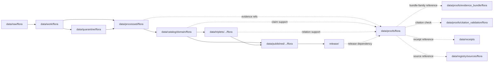

<!-- [KFM_META_BLOCK_V2]
doc_id: kfm://doc/data-proofs-flora-readme
title: data/proofs/flora/ — Flora Domain Proof Support
version: v0.2.0
type: directory-readme
subtype: flora-domain-proof-support-lane
status: repository-grounded draft; concrete Flora proof inventory, domain proof producer, Flora-specific validators and fixtures, policy enforcement, access controls, release linkage, and runtime behavior remain bounded
owners:
  - "NEEDS VERIFICATION — Flora domain steward"
  - "NEEDS VERIFICATION — evidence, EvidenceBundle, proof, and citation-validation stewards"
  - "NEEDS VERIFICATION — taxonomy, source-role, rights, sensitivity, geoprivacy, stewardship, and sovereignty reviewers"
  - "NEEDS VERIFICATION — policy, release, correction, rollback, governed-API, Evidence Drawer, governed-AI, and docs stewards"
created: NEEDS VERIFICATION — greenfield stub existed before v0.1 expansion
updated: 2026-07-26
policy_label: restricted-review; proof-support; flora; cite-or-abstain; deny-by-default-location; no-direct-public-path; release-gated
path: data/proofs/flora/README.md
truth_posture: >
  CONFIRMED exact target path, prior blob, Directory Rules proof placement, canonical proofs-root
  contract, Flora EvidenceBundle and citation-validation child lanes, fielded EvidenceBundle semantic
  contract, Draft 2020-12 schema, validator wrapper, minimal valid/invalid fixtures, source-registry
  boundary, current Flora workflow holds, scaffold-level Flora policy homes, and no established Flora
  release candidate or public release / PROPOSED Flora domain proof packet, claim-support and digest
  profiles, source-role closure, sensitivity-safe proof routing, invalidation propagation, and downstream
  handoff requirements / UNKNOWN recursive proof inventory, active writers and consumers, generated
  indexes, resolver runtime, access controls, public routes, caches, hosting, release instances, and
  public effects / NEEDS VERIFICATION accountable owners, accepted Flora proof profile, validator
  execution, Flora-specific fixture depth, CI graduation, policy and geoprivacy enforcement,
  stewardship and sovereignty review, correction propagation, withdrawal behavior, retention, and
  rollback drills
evidence_snapshot:
  repository: bartytime4life/Kansas-Frontier-Matrix
  base_ref: main
  base_commit: 01d927659c183d252fc655eeffb1f44f0e0830ad
  prior_blob: a2518d4cc029b9b16afa8bb5c3fb6907a0c1475a
  original_greenfield_stub_blob: 9338f43f6e61ede5a93234afbfd145451d2d4301
  directory_rules_blob: 2affb080e6f0043867c64c7f06c1ca52030fbd55
  proofs_root_blob: 0d8b6e92d3b4b9ff3961d29c53ead497922a31cf
  flora_evidence_bundle_blob: 2259e9b91a9d6d461e7c620e1a403e9bca74a19e
  flora_citation_validation_blob: 2a2fee3953ae85f0505e4835bdded4fb5e24c129
  evidence_bundle_contract_blob: 731c348832add23cddd14e796aa56ce2b9268259
  evidence_bundle_schema_blob: cf5256831b63dca46a5f68b168441adcf68b8751
  evidence_bundle_validator_blob: c1760c5e92eae6390f5adcde4593e8e9bab26535
  evidence_bundle_fixtures_readme_blob: 89ace659414a757c14a4d3e516fd31d44c6a9969
  flora_source_registry_blob: 356cd29ca5a764ffe1e774fb565bce50bba46011
  flora_policy_blob: b040bff13e654cff9d2f7336d6d6783c8467eaa9
  flora_sensitivity_policy_blob: 4c65abec24135f7e4467fd108e163cdce594d5f9
  flora_release_candidate_blob: 15a08f9fb2cdd33041d3a3f3e3c844f26a7a0998
  flora_workflow_blob: c792d126e5726d8895f56fd97800bee7fcba4a15
related:
  - ../README.md
  - ../evidence_bundle/flora/README.md
  - ../citation_validation/flora/README.md
  - ../../processed/flora/README.md
  - ../../catalog/domain/flora/README.md
  - ../../receipts/README.md
  - ../../registry/sources/flora/README.md
  - ../../published/flora/README.md
  - ../../published/layers/flora/README.md
  - ../../rollback/flora/README.md
  - ../../../contracts/evidence/evidence_bundle.md
  - ../../../contracts/evidence/evidence_ref.md
  - ../../../contracts/domains/flora/README.md
  - ../../../schemas/contracts/v1/evidence/evidence_bundle.schema.json
  - ../../../schemas/contracts/v1/domains/flora/README.md
  - ../../../fixtures/contracts/v1/evidence/evidence_bundle/README.md
  - ../../../tools/validators/validate_evidence_bundle.py
  - ../../../policy/domains/flora/README.md
  - ../../../policy/sensitivity/flora/README.md
  - ../../../release/candidates/flora/README.md
  - ../../../release/README.md
  - ../../../docs/domains/flora/README.md
  - ../../../docs/doctrine/directory-rules.md
  - ../../../.github/workflows/domain-flora.yml
notes:
  - "Same-path Markdown modernization only; no Flora source bytes, proof payloads, EvidenceBundle instances, contracts, schemas, policies, validators, fixtures, workflows, releases, routes, hosting, access controls, or publication state changed."
  - "data/proofs/flora/ is the Flora domain proof-support lane; data/proofs/evidence_bundle/flora/ is the Flora EvidenceBundle-family lane; data/proofs/citation_validation/flora/ is the Flora citation-validation lane. They must reference rather than duplicate mutable authority."
  - "The literal line '**Status:** draft / PROPOSED' is retained because the current read-only Flora proof-readiness workflow treats it as an explicit hold signal."
  - "EvidenceBundle schema, validator wrapper, and minimal valid/invalid fixtures are fielded. Execution, resolver integrity, Flora-specific profiles, policy enforcement, CI graduation, and runtime behavior remain NEEDS VERIFICATION."
  - "The original greenfield stub is retained as lineage; the documentation rollback target for v0.2.0 is prior blob a2518d4cc029b9b16afa8bb5c3fb6907a0c1475a."
[/KFM_META_BLOCK_V2] -->

<a id="top"></a>

# `data/proofs/flora/` — Flora Domain Proof Support

> **One-line purpose.** Hold or index claim-scoped Flora proof support that preserves botanical identity, evidence references, source roles, citations, rights, sensitivity, safe-representation posture, integrity, correction lineage, and release dependencies without becoming source truth, policy authority, release authority, or a public data service.

[](#status)
[](#authority-level)
[](../../../schemas/contracts/v1/evidence/evidence_bundle.schema.json)
[](#sensitivity-geoprivacy-and-safe-representation)
[](#outputs)
[](#validation)

> [!IMPORTANT]
> **Proof support is necessary but not sufficient for publication.** A structurally valid proof packet can support policy, review, and release evaluation, but it does not make a botanical claim true, taxonomically current, rights-cleared, sensitivity-safe, steward-approved, released, public, or suitable for collection or access use.

> [!CAUTION]
> Missing, stale, conflicting, role-collapsed, rights-unclear, sensitivity-unsafe, unreleased, withdrawn, invalidated, or unresolvable support must yield a finite fail-closed result such as `ABSTAIN`, `HOLD`, `RESTRICT`, `DENY`, or `ERROR`.

> [!WARNING]
> Do not place exact or reverse-engineerable rare, protected, culturally sensitive, steward-controlled, or private-land Flora locations—or collection clues, access directions, withheld precision, redaction offsets, generalization thresholds, transform parameters, or other control-defeating details—in this ordinary repository lane.

**Status:** draft / PROPOSED  
**Path:** `data/proofs/flora/`  
**Owning responsibility:** `data/proofs/`  
**Domain segment:** `flora/`  
**Direct public access:** denied  
**Documentation rollback target:** prior blob `a2518d4cc029b9b16afa8bb5c3fb6907a0c1475a`

**Quick navigation:** [Purpose](#purpose) · [Authority](#authority-level) · [Status](#status) · [Belongs](#what-belongs-here) · [Exclusions](#what-does-not-belong-here) · [Inputs](#inputs) · [Outputs](#outputs) · [Validation](#validation) · [Review](#review-burden) · [Related](#related-folders) · [ADRs](#adrs) · [Last reviewed](#last-reviewed) · [Operating contract](#operating-contract) · [Children](#current-bounded-child-lane-index) · [Claims](#flora-claim-and-source-role-closure) · [Sensitivity](#sensitivity-geoprivacy-and-safe-representation) · [Lifecycle](#lifecycle-relationship) · [Correction](#correction-withdrawal-invalidation-and-rollback) · [Evidence](#repository-evidence-ledger) · [Verification](#open-verification-register) · [No-loss](#no-loss-ledger) · [Rollback](#rollback)

---

## Purpose

`data/proofs/flora/` is the Flora domain proof-support lane under the canonical [`data/proofs/`](../README.md) responsibility. It supports inspectable claim closure across botanical taxonomy, occurrences, specimens, rare-plant records, vegetation communities, invasive plants, phenology, range and distribution products, habitat associations, surveys, restoration plantings, and governed cross-lane relations.

The lane exists to make these questions inspectable before a Flora claim advances:

1. What exact botanical claim, object family, taxon concept, geography, time, audience, and representation is being supported?
2. Which governed `EvidenceRef` values and reconstructable source records support it?
3. Which source roles, methods, uncertainty, limitations, rights, sensitivity, and stewardship dependencies qualify that support?
4. Which citations, transforms, checksums, policy/review references, correction lineage, and release dependencies close the packet?
5. Which exact/internal geometry posture and public generalized, withheld, staged, or denied representation apply?
6. Which finite downstream outcome is justified?

This lane supports evidence resolution and review. It does not admit sources, define botanical truth, establish taxonomic authority, execute geoprivacy, approve stewardship or sovereignty decisions, decide policy, approve release, publish maps, or authorize collection or access.

## Authority level

**Implementation-bearing domain proof-support lane under the canonical `data/proofs/` responsibility.**

Directory Rules place emitted proof objects under `data/`, identify `proofs` as a distinct data responsibility, and require domain names to appear as segments inside responsibility roots. This same-path update therefore preserves the correct responsibility root, proof family, and `flora/` domain segment; it creates no new root, lifecycle phase, proof family, or parallel authority.

The authority split is:

| Responsibility | Authoritative or supporting home | Boundary |
|---|---|---|
| Flora domain proof support | [`data/proofs/flora/`](./README.md) | This lane; domain-scoped proof packets, indexes, and limitations. |
| Flora EvidenceBundle-family support | [`data/proofs/evidence_bundle/flora/`](../evidence_bundle/flora/README.md) | Claim-scope EvidenceBundle closure; not a second domain proof authority. |
| Flora citation-validation support | [`data/proofs/citation_validation/flora/`](../citation_validation/flora/README.md) | Citation and `EvidenceRef` closure checks; not canonical evidence storage. |
| EvidenceBundle meaning | [`contracts/evidence/evidence_bundle.md`](../../../contracts/evidence/evidence_bundle.md) | Semantic contract; not proof data. |
| EvidenceBundle machine shape | [`schemas/contracts/v1/evidence/evidence_bundle.schema.json`](../../../schemas/contracts/v1/evidence/evidence_bundle.schema.json) | Fielded Draft 2020-12 schema; not policy or release authority. |
| Flora domain meaning and shape | [`contracts/domains/flora/`](../../../contracts/domains/flora/README.md) and [`schemas/contracts/v1/domains/flora/`](../../../schemas/contracts/v1/domains/flora/README.md) | Current Flora domain coverage remains draft/scaffold-level and incomplete. |
| Source admission and source role | [`data/registry/sources/flora/`](../../registry/sources/flora/README.md) | Source registry; topology reconciliation remains open. |
| Admissibility and sensitivity | [`policy/domains/flora/`](../../../policy/domains/flora/README.md) and [`policy/sensitivity/flora/`](../../../policy/sensitivity/flora/README.md) | Current documents are scaffolds; enforcement is not established. |
| Release, correction, withdrawal, rollback | [`release/`](../../../release/README.md) | Proofs may reference but never replace release-governance records. |
| Public delivery | Governed APIs and released artifacts | Public clients must not read this lane directly. |

When an artifact could fit more than one proof axis, an accepted contract and profile must select one authoritative home. Other lanes may hold immutable references, indexes, or bounded validation summaries; they must not duplicate mutable proof authority, restricted source material, policy decisions, release records, or public-state decisions.

<a id="repo-fit"></a>

## Status

| Surface | Bounded result |
|---|---|
| Exact path and document | **CONFIRMED** at `main@01d927659c183d252fc655eeffb1f44f0e0830ad`; prior blob `a2518d4cc029b9b16afa8bb5c3fb6907a0c1475a` |
| Documentation version | `v0.2.0` |
| Canonical proofs responsibility | **CONFIRMED repository-grounded draft** at [`data/proofs/README.md`](../README.md) |
| Flora EvidenceBundle lane | **CONFIRMED repository-grounded draft** at [`data/proofs/evidence_bundle/flora/`](../evidence_bundle/flora/README.md) |
| Flora citation-validation lane | **CONFIRMED repository-grounded draft** at [`data/proofs/citation_validation/flora/`](../citation_validation/flora/README.md) |
| EvidenceBundle semantic contract | **CONFIRMED fielded draft**; defines claim-scope closure and separates evidence, policy, release, receipts, public APIs, maps, and AI authority |
| EvidenceBundle schema | **CONFIRMED fielded / status `PROPOSED`**; ten required fields and root `additionalProperties: false` |
| Validator wrapper | **CONFIRMED fielded / NOT RUN in this task** at `tools/validators/validate_evidence_bundle.py` |
| Shared fixtures | **CONFIRMED minimal valid/invalid family / NOT RUN in this task**; coverage is not Flora-specific |
| Flora domain schemas | **CONFIRMED draft index**; only a proposed `redaction_receipt` scaffold is established by the inspected index |
| Flora policy homes | **CONFIRMED scaffold-level documents**; executable domain and sensitivity enforcement is not established |
| Flora proof workflow | **CONFIRMED read-only readiness workflow with explicit holds**; no proof producer, geoprivacy execution, release approval, or publication authority |
| Flora release candidate | No verified child candidate dossier, approved manifest, or published Flora release established by inspected evidence |
| Recursive proof inventory | `UNKNOWN` beyond README-level and bounded code-search evidence |
| Public readiness | `DENY BY DEFAULT` |

The repository now establishes stronger documentation, schema, validator, fixture, and workflow boundaries than the prior README described. It does **not** establish a populated Flora proof store, accepted Flora proof packet profile, operational resolver, executed validator suite, enforced geoprivacy policy, release closure, or public proof route.

<a id="accepted-contents"></a>

## What belongs here

Only bounded Flora proof-support artifacts such as:

- Flora domain proof packets or immutable indexes under an accepted profile;
- claim-to-evidence maps for `PlantTaxon`, `FloraTaxonCrosswalk`, `FloraOccurrence`, `SpecimenRecord`, `RarePlantRecord`, `VegetationCommunity`, `InvasivePlantRecord`, `PhenologyObservation`, `RangePolygon`, `DistributionSurface`, `HabitatAssociation`, `BotanicalSurvey`, and `RestorationPlanting`;
- references to accepted `EvidenceBundle` records without duplicating the EvidenceBundle-family authority;
- `EvidenceRef` resolution summaries and stable negative findings;
- digest-closure or integrity manifests that bind supported claims to source, processed, catalog, triplet, receipt, proof, correction, rollback, and release dependencies;
- source-role, rights, sensitivity, safe-representation, freshness, limitation, and review summaries;
- public-safe transform support that references redaction or generalization decisions without exposing protected parameters or restricted originals;
- cross-lane proof support that preserves the owning lane, source role, evidence scope, sensitivity posture, and limitation language;
- correction, supersession, withdrawal, invalidation, and rollback dependency indexes;
- lane-local README, inventory, digest, migration, retention, or disposition sidecars that do not create parallel authority.

<a id="exclusions"></a>

## What does NOT belong here

| Do not place here | Correct home or action |
|---|---|
| RAW captures, specimen exports, original coordinates, source media, or source-native records | `data/raw/flora/` or the governed source system |
| In-process taxonomy reconciliation, matching, redaction trials, joins, notebooks, or scratch outputs | `data/work/flora/` |
| Rights-, source-role-, sensitivity-, validation-, review-, or release-unclear material | `data/quarantine/flora/` |
| Canonical normalized Flora objects | [`data/processed/flora/`](../../processed/flora/README.md) |
| Catalog, STAC, DCAT, PROV, or triplet records | Their catalog or triplet lanes |
| Canonical EvidenceBundle-family records that belong under an accepted family profile | [`data/proofs/evidence_bundle/flora/`](../evidence_bundle/flora/README.md) |
| Citation-validation records that belong under the citation family | [`data/proofs/citation_validation/flora/`](../citation_validation/flora/README.md) |
| Process, validation, redaction, generalization, review, or publication receipts | [`data/receipts/`](../../receipts/README.md) |
| `SourceDescriptor` or source-admission authority | [`data/registry/sources/flora/`](../../registry/sources/flora/README.md) |
| Policy, rights, sensitivity, stewardship, or sovereignty decisions | Their accepted policy or review authority |
| Release approval, manifest, correction notice, withdrawal notice, or rollback card | [`release/`](../../../release/README.md) |
| Contracts, schemas, validators, fixtures, tests, pipelines, packages, apps, API, UI, or map code | Their responsibility roots |
| Public maps, tiles, downloads, popups, reports, Focus Mode answers, or AI output | Released governed delivery surfaces only |
| Exact or reverse-engineerable sensitive locations or control-defeating transform parameters | Approved restricted systems; never this ordinary repository lane |
| Generated summaries presented as proof, habitat suitability presented as occurrence truth, or modeled distribution presented as observation | Narrow the claim, resolve admissible evidence, or abstain |

## Inputs

A bounded Flora proof packet should identify, where applicable:

- stable claim ID, object family, taxon concept, accepted name, synonym or crosswalk identity, and governing spec identity;
- claim text or machine field, geography, spatial support, time scope, intended audience, and representation class;
- occurrence, specimen, survey, range, distribution, model, habitat-association, invasive-plant, restoration, or synthetic-summary source role;
- source identity, source version, source role, rights posture, attribution, and use limitations;
- governed `EvidenceRef` values and expected `EvidenceBundle` or proof-packet identity and digest;
- exact/internal geometry posture versus public generalized, withheld, staged, or denied representation;
- sensitivity classification, review state, stewardship or sovereignty dependency, and public-disclosure decision;
- redaction or generalization receipt references without protected parameters;
- processed, catalog, triplet, receipt, policy, review, release, correction, withdrawal, and rollback references;
- immutable pointers to `RunReceipt`, `TransformReceipt`, `ValidationReport`, `PolicyDecision`, `ReviewRecord`, `RedactionReceipt`, `ReleaseManifest`, `RollbackCard`, `CorrectionNotice`, `WithdrawalNotice`, and `AIReceipt` records owned by their respective lanes;
- taxonomy, source, observation, collection, validity, retrieval, review, correction, expiry, and release times where material;
- validator profile, validator version, schema/spec hash, input/output checksums, and stale-state posture.

Inputs that cannot resolve source role, rights, sensitivity, claim scope, or evidence lineage remain held, restricted, denied, quarantined, or abstained rather than plausibly completed.

## Outputs

This lane may emit or index:

- bounded Flora domain proof packets under an accepted profile;
- claim-to-proof and claim-to-bundle indexes;
- integrity and digest-closure summaries;
- source-role, limitation, rights, sensitivity, and safe-representation findings;
- finite negative findings explaining `ABSTAIN`, `HOLD`, `RESTRICT`, `DENY`, or `ERROR`;
- correction, withdrawal, invalidation, supersession, and rollback dependency summaries;
- immutable pointers to EvidenceBundle-family and citation-validation records.

Outputs are support for policy, review, release, Evidence Drawer, governed API, correction, rollback, and bounded AI evaluation. They are not release authority, public truth, public geometry, collection guidance, or a direct public endpoint.

## Validation

Validate only against declared profiles and report the scope actually checked.

| Validation axis | Required check |
|---|---|
| Placement and identity | Correct proof/domain lane, stable IDs, version/spec identity, no duplicate mutable authority |
| Claim scope | Claim text/field, object family, geography, time, audience, representation, and limitation boundaries agree |
| Evidence closure | Every required `EvidenceRef` resolves to the expected EvidenceBundle or an explicit finite negative result |
| Source role | Observation, specimen, survey, range, modeled distribution, habitat association, restoration, and synthetic summary roles remain distinct |
| Taxonomic identity | Accepted concept, synonyms, crosswalk, authority, and effective time are explicit where material |
| Rights and sensitivity | Rights, attribution, sensitivity, stewardship, sovereignty, geoprivacy, and disclosure dependencies are present |
| Safe representation | Exact/internal and generalized/withheld/staged/denied forms are not collapsed; protected parameters are absent |
| Integrity | Checksums, spec hash, input/output identity, and referenced receipt/proof identities agree |
| Lifecycle parity | Processed, catalog, triplet, proof, receipt, release, correction, withdrawal, and rollback references do not contradict |
| Citation closure | Citations support the declared claim scope and do not overstate source authority |
| Stale and conflict state | Superseded, expired, conflicting, invalidated, or withdrawn evidence produces an explicit bounded outcome |
| Sensitive-content scan | No exact or reverse-engineerable location, access clue, private-land detail, or transform secret is exposed |
| Links and Markdown | Repository-relative links, anchors, tables, alerts, fences, and metadata remain well formed |

The fielded `EvidenceBundle` schema, validator wrapper, and minimal fixtures support the shared EvidenceBundle shape. They do not prove a Flora domain proof packet profile, Flora-specific resolver behavior, policy enforcement, geoprivacy execution, source-rights adjudication, public safety, or release readiness.

A validation `PASS` proves only the accepted profile and checks that ran. A green readiness hold, README check, schema parse, pull request, or merge is not evidence closure or publication.

<a id="validation-checklist"></a>

### Validation checklist

- [ ] Confirm the recursive `data/proofs/flora/` payload inventory at a pinned commit.
- [ ] Confirm the accepted Flora proof packet, instance-versus-index profile, and authoritative home for overlapping proof axes.
- [ ] Run the shared EvidenceBundle validator and schema tests against pinned fixtures.
- [ ] Add and run public-safe Flora-specific valid, invalid, stale, conflicting, role-collapse, rights, sensitivity, geoprivacy, correction, and rollback fixtures.
- [ ] Confirm cross-record `EvidenceRef` resolution and checksum/spec-hash integrity.
- [ ] Confirm Flora domain contracts and schemas required by supported claims are field-complete, paired, and accepted.
- [ ] Confirm source descriptors, source roles, rights, sensitivity, stewardship, and sovereignty dependencies for each supported source family.
- [ ] Confirm proof references point to receipts, policy decisions, review records, release records, correction notices, withdrawal notices, and rollback cards rather than misplacing them here.
- [ ] Confirm current automation remains a read-only hold until an accepted deterministic no-network Flora proof command and producer exist.
- [ ] Confirm exact or reverse-engineerable sensitive Flora locations and transform controls cannot enter repository, logs, artifacts, public routes, caches, or exports.
- [ ] Confirm public clients and Focus Mode cannot read this lane directly.
- [ ] Confirm correction, invalidation, withdrawal, cache eviction, and rollback propagation through a bounded drill.

## Review burden

Accountable owners remain **NEEDS VERIFICATION**.

Review should include the Flora domain, evidence/proof, taxonomy, source-role, rights, sensitivity/geoprivacy, policy, release, correction/rollback, and documentation responsibilities as applicable. Policy-significant or public-effect changes require independent review separate from generation or implementation.

CODEOWNERS routing, a workflow check, a generated receipt, or a maintainer review is not by itself botanical stewardship, rights-holder approval, sovereign-community approval, policy clearance, release approval, or publication authority.

This README-only change requires documentation and proof-boundary review. Changes to payloads, contracts, schemas, policies, validators, fixtures, source activation, geoprivacy, public serving, release, correction, withdrawal, or rollback require their owning specialists and a separately scoped change.

## Related folders

- Parent proof responsibility: [`data/proofs/`](../README.md)
- Specialized proof support: [`evidence_bundle/flora/`](../evidence_bundle/flora/README.md) · [`citation_validation/flora/`](../citation_validation/flora/README.md)
- Lifecycle and support: [`processed/flora/`](../../processed/flora/README.md) · [`catalog/domain/flora/`](../../catalog/domain/flora/README.md) · [`receipts/`](../../receipts/README.md) · [`registry/sources/flora/`](../../registry/sources/flora/README.md) · [`published/flora/`](../../published/flora/README.md) · [`published/layers/flora/`](../../published/layers/flora/README.md) · [`rollback/flora/`](../../rollback/flora/README.md)
- Evidence meaning and shape: [`EvidenceBundle` contract](../../../contracts/evidence/evidence_bundle.md) · [`EvidenceRef` contract](../../../contracts/evidence/evidence_ref.md) · [`EvidenceBundle` schema](../../../schemas/contracts/v1/evidence/evidence_bundle.schema.json) · [shared fixtures](../../../fixtures/contracts/v1/evidence/evidence_bundle/README.md) · [validator wrapper](../../../tools/validators/validate_evidence_bundle.py)
- Flora domain: [domain README](../../../docs/domains/flora/README.md) · [contracts](../../../contracts/domains/flora/README.md) · [schema index](../../../schemas/contracts/v1/domains/flora/README.md)
- Governance: [domain policy](../../../policy/domains/flora/README.md) · [sensitivity policy](../../../policy/sensitivity/flora/README.md) · [release candidate lane](../../../release/candidates/flora/README.md) · [release root](../../../release/README.md)
- Doctrine and automation: [Directory Rules](../../../docs/doctrine/directory-rules.md) · [Flora readiness workflow](../../../.github/workflows/domain-flora.yml)

## ADRs

No accepted Flora-proof-specific ADR was verified in this bounded update.

Directory Rules require an ADR before splitting or merging a lifecycle phase, creating a parallel proof home, changing the schema-home rule, adding or renaming a canonical root, or bending a core invariant. This README accepts no new authority decision.

Before introducing a new child proof family, changing the instance-versus-index model, moving canonical proof records, or exposing a public route, verify the applicable accepted ADRs and provide a migration, correction, and rollback plan.

## Last reviewed

- **Date:** 2026-07-26
- **Evidence boundary:** `main@01d927659c183d252fc655eeffb1f44f0e0830ad`
- **Review type:** complete target read plus bounded parent, child, contract, schema, validator, fixture, policy, source-registry, release-candidate, workflow, branch, and pull-request inspection
- **Recursive proof-payload inventory:** not performed
- **Validator or schema-test execution:** not performed
- **Runtime, hosting, access-control, cache, release-instance, or public-route inspection:** not performed
- **Owners, independent review, retention, correction propagation, and operational rollback:** needs verification

Re-review on proof-profile, authority/topology, writer, source-role, taxonomy, policy, release, public-consumer, correction, withdrawal, or rollback changes—or within six months.

---

## Operating contract

A Flora proof packet must state the claim or artifact scope it supports, botanical identity and source role, spatial and temporal support, rights and sensitivity posture, exact/internal versus public-safe representation, evidence references and limitations, validation profile, integrity, policy/review dependencies, stale/conflict state, correction lineage, release dependency, and rollback reference.

Missing or contradictory support yields hold, abstain, restrict, deny, or error—not plausible completion.

### Proof packet minimum

| Field group | Minimum expectation |
|---|---|
| Identity | Stable proof ID, claim ID, object family, taxon concept, profile version, spec hash |
| Scope | Claim text/field, geography, time, audience, representation, limitations |
| Evidence | `EvidenceRef` values, expected EvidenceBundle identity, citations, source records, source roles |
| Rights and sensitivity | Rights, attribution, sensitivity, stewardship/sovereignty dependencies, disclosure decision |
| Representation | Exact/internal posture, public-safe derivative posture, transform receipt references |
| Integrity | Input/output checksums, referenced artifact identities, validator profile and version |
| Governance | Policy/review references, finite outcome, release dependency |
| Lifecycle | Correction, supersession, invalidation, withdrawal, stale, and rollback references |

## Current bounded child-lane index

| Lane | Current posture | Purpose | Hard boundary |
|---|---|---|---|
| [`../evidence_bundle/flora/`](../evidence_bundle/flora/README.md) | **CONFIRMED repository-grounded draft** | Flora EvidenceBundle-family support, claim-scope closure, source-role preservation, sensitivity-safe representation, and release dependencies | Not source admission, policy, release, public map, collection guidance, or a second domain proof authority |
| [`../citation_validation/flora/`](../citation_validation/flora/README.md) | **CONFIRMED repository-grounded draft** | Flora citation and `EvidenceRef` closure checks plus stable negative findings | Not canonical evidence storage, EvidenceBundle authority, policy, release, or stewardship authority |
| `claim_support/` | **PROPOSED; not verified** | Claim-to-evidence manifests for Flora object families | Must not become contracts, schemas, or duplicate mutable proof authority |
| `digest_closure/` | **PROPOSED; not verified** | Source/processed/catalog/triplet/receipt/proof integrity closure | Must not become receipt storage |
| `sensitivity/` | **PROPOSED; not verified** | Rare/protected/cultural/steward-review sensitivity proof pointers | Must not expose restricted coordinates or withheld precision |
| `redaction/` | **PROPOSED; not verified** | Generalized/withheld/staged/denied geometry support | Must not expose offsets, thresholds, parameters, or restricted originals |
| `cross_lane/` | **PROPOSED; not verified** | Governed proof support for cross-lane relations | Owning-lane authority and sensitivity must remain explicit |
| `releases/` | **PROPOSED; not verified** | Immutable proof pointers used by release candidates | Not `ReleaseManifest` or promotion authority |
| `corrections/` | **PROPOSED; not verified** | Proof invalidation and correction pointers | Not `CorrectionNotice` or withdrawal authority |
| `validation/` | **PROPOSED; not verified** | Lane-local proof-validation summaries | Not `ValidationReport` authority or validator code |

Do not create any proposed child path from this table without a separate placement and duplicate-authority review.

<a id="lane-index"></a>

## Flora claim and source-role closure

A Flora proof packet must preserve the distinction among support types.

| Claim or source role | What it can support | What it cannot support by itself |
|---|---|---|
| Taxonomic authority or crosswalk | Accepted concept, synonym, rank, authority mapping, effective time | Occurrence, abundance, current presence, public location safety |
| Specimen record | A collected specimen and its recorded metadata, subject to rights and uncertainty | Unrestricted public coordinates, current presence, population size, range |
| Occurrence observation | A bounded observation at a place/time/method with uncertainty | Taxonomic authority, range, habitat suitability, legal access |
| Botanical survey | Survey effort, method, coverage, detections/non-detections, limitations | Universal absence outside surveyed scope |
| Range polygon | Interpreted distribution extent under a method and time scope | Observed occurrence at every location |
| Distribution surface or model | Modeled likelihood, suitability, or inferred distribution | Observation truth, exact occurrence, collection target |
| Vegetation community | Community classification or mapped vegetation context | Species occurrence without independent evidence |
| Habitat association | Governed relation between Flora and Habitat evidence | Habitat truth ownership or occurrence proof |
| Invasive-plant record | Invasive status, observation, management context under a named source role | Legal status, treatment advice, or unrestricted site disclosure |
| Phenology observation | Observed or modeled life-cycle state with time/method scope | Taxonomic authority or future condition |
| Restoration planting | Documented planting or restoration action | Natural occurrence, establishment success, long-term persistence |
| Synthetic summary or AI text | Interpretation over released evidence | Evidence, policy decision, stewardship decision, or release authority |

Source-role collapse is a validation failure. A modeled distribution must not be described as an observed occurrence; a specimen label must not become unrestricted current-location truth; habitat suitability must not become presence; a restoration planting must not become natural occurrence.

<a id="proof-requirements"></a>

### Proof requirements

- Every packet identifies the exact claim scope and the evidence role of each member.
- Every consequential claim resolves `EvidenceRef` values to the expected EvidenceBundle or returns a finite negative outcome.
- Taxonomic identity and effective time remain explicit where names or concepts can change.
- Space, time, method, uncertainty, scale, and limitation boundaries remain visible.
- Rights, sensitivity, stewardship, sovereignty, and safe-representation dependencies remain visible without leaking protected details.
- Integrity covers critical inputs, outputs, profile/spec identity, and referenced receipts.
- Cross-lane evidence preserves the owning domain and does not transfer truth authority into Flora.
- Release-linked packets reference release, correction, withdrawal, and rollback records but do not replace them.

## Sensitivity, geoprivacy, and safe representation

Rare, protected, culturally sensitive, steward-controlled, private-land, or collection-risk Flora material is deny-by-default for precise public exposure.

A proof packet may state that a protective transform occurred and may reference its governed receipt. It must not expose:

- exact or reverse-engineerable coordinates;
- source-native precision that defeats public generalization;
- redaction offsets, fuzzing radii, seeds, grid keys, aggregation thresholds, transform parameters, or restricted originals;
- access directions, collection clues, landowner or parcel-targeting details;
- culturally sensitive knowledge, embargoed notes, private agreements, or steward-restricted annotations;
- joins that make generalized records re-identifiable.

Safe public representation may be generalized, aggregated, gridded, buffered, withheld, staged, delayed, or denied. The chosen form must be traceable to policy and review without revealing the controls that would defeat it.

Cross-lane joins can increase sensitivity. Flora proof review must re-evaluate exposure when combining Habitat, Fauna, Soil, Hydrology, Agriculture, Hazards, Archaeology, Settlements, Roads/Rail, or People/Land evidence.

<a id="flora-proof-guardrails"></a>

### Flora proof guardrails

- EvidenceBundle outranks generated summaries.
- A valid schema instance does not prove botanical truth, rights clearance, sensitivity safety, stewardship approval, release, or public suitability.
- Exact/internal evidence and public-safe derivatives remain separate and linked through governed transforms.
- Public clients and Focus Mode use governed APIs and released artifacts, not this directory directly.
- AI may summarize only released, evidence-supported, policy-safe material and must preserve citations, uncertainty, source role, sensitivity, and finite outcomes.
- Proofs support correction and rollback; they do not silently erase invalidated or withdrawn history.
- Collection, access, legal, land-management, medical, emergency, or stewardship advice is outside this lane.

## Lifecycle relationship

```text
RAW -> WORK / QUARANTINE -> PROCESSED -> CATALOG / TRIPLET -> PUBLISHED
                           \-> data/proofs/flora/ supports claim and evidence closure
```


```mermaid
flowchart LR
    RAW["data/raw/flora"] --> WORK["data/work/flora"]
    WORK --> QUAR["data/quarantine/flora"]
    WORK --> PROC["data/processed/flora"]
    QUAR --> PROC
    PROC --> CAT["data/catalog/domain/flora"]
    CAT --> TRIP["data/triplets/.../flora"]
    CAT --> PUB["data/published/.../flora"]
    TRIP --> PUB
    PUB --> REL["release/"]

    PROC -. "evidence refs" .-> PROOF["data/proofs/flora"]
    CAT -. "claim support" .-> PROOF
    TRIP -. "relation support" .-> PROOF
    REL -. "release dependency" .-> PROOF

    PROOF -. "bundle-family reference" .-> EB["data/proofs/evidence_bundle/flora"]
    PROOF -. "citation check" .-> CIT["data/proofs/citation_validation/flora"]
    PROOF -. "receipt reference" .-> RECEIPTS["data/receipts"]
    PROOF -. "source reference" .-> REG["data/registry/sources/flora"]
```

The dashed edges are support relationships, not lifecycle promotions. Proof creation does not move an artifact to `PUBLISHED`; release remains a separately governed state transition.

## Correction, withdrawal, invalidation, and rollback

A proof packet or index must be correctable without deleting evidence history or exposing restricted originals.

Trigger review when:

- source records, taxonomy, rights, sensitivity, stewardship, sovereignty, or release state changes;
- an `EvidenceRef`, bundle member, checksum, citation, transform, or spec identity becomes stale or invalid;
- a public-safe derivative is shown to be reversible or over-precise;
- a claim overstates source role, time, space, method, or uncertainty;
- a release is corrected, superseded, withdrawn, or rolled back.

Required behavior:

1. preserve the prior proof identity and the reason it became stale, conflicted, invalid, superseded, or withdrawn;
2. link the correction, withdrawal, release, and rollback authority records;
3. propagate invalidation to dependent catalog, triplet, release, API, Evidence Drawer, export, cache, and AI surfaces;
4. retain restricted originals only in approved systems;
5. never repair public state by silently editing proof history.

## Repository evidence ledger

| Evidence | Status | Supports | Does not prove |
|---|---|---|---|
| [`data/proofs/README.md`](../README.md) | **CONFIRMED repository-grounded draft** | Canonical proofs responsibility, anti-collapse boundary, no direct public path | Recursive payload inventory, active consumers, lane-wide validator |
| Prior `data/proofs/flora/README.md` | **CONFIRMED** | Strong Flora proof boundary, source-role and sensitivity guardrails, original stub lineage | Current parent/child/tooling maturity |
| [`data/proofs/evidence_bundle/flora/`](../evidence_bundle/flora/README.md) | **CONFIRMED repository-grounded draft** | Flora EvidenceBundle-family role, fielded shared schema/tooling evidence, workflow/release holds | Populated bundle inventory, resolver runtime, Flora profile acceptance |
| [`data/proofs/citation_validation/flora/`](../citation_validation/flora/README.md) | **CONFIRMED repository-grounded draft** | Flora citation and EvidenceRef closure boundary, stable negative findings | Accepted lane-wide profile, emitted records, runtime consumers |
| [`contracts/evidence/evidence_bundle.md`](../../../contracts/evidence/evidence_bundle.md) | **CONFIRMED fielded draft** | EvidenceBundle meaning, claim-scope closure, authority split | Runtime behavior, policy or release approval |
| [`EvidenceBundle` schema](../../../schemas/contracts/v1/evidence/evidence_bundle.schema.json) | **CONFIRMED fielded / `PROPOSED`** | Ten required fields, Draft 2020-12, closed top-level shape | Flora domain packet shape, semantic correctness, policy enforcement |
| [Validator wrapper](../../../tools/validators/validate_evidence_bundle.py) | **CONFIRMED fielded / NOT RUN** | Executable entry point to shared JSON Schema runner | Passing execution, resolver integrity, CI graduation |
| [Shared fixtures](../../../fixtures/contracts/v1/evidence/evidence_bundle/README.md) | **CONFIRMED minimal / NOT RUN** | One valid and one missing-required-field case | Flora-specific source-role, rights, sensitivity, stale, correction, or rollback coverage |
| [`data/registry/sources/flora/`](../../registry/sources/flora/README.md) | **CONFIRMED draft** | Flora source admission, role, rights, sensitivity, and topology warning | A single accepted topology or complete descriptor inventory |
| Flora domain contract/schema indexes | **CONFIRMED draft/scaffold-level** | Planned object families and one redaction-receipt scaffold | Field-complete domain schema suite or accepted proof profile |
| Flora policy homes | **CONFIRMED scaffolds** | Intended policy and sensitivity responsibility | Executable enforcement or public-safety approval |
| [`release/candidates/flora/`](../../../release/candidates/flora/README.md) | **CONFIRMED repository-grounded draft** | No verified child candidate, manifest, or release in bounded inspection | Exhaustive external/restricted-system inventory |
| [Flora readiness workflow](../../../.github/workflows/domain-flora.yml) | **CONFIRMED read-only hold** | Required boundary paths, explicit absence-of-producer and absence-of-release holds | Proof production, geoprivacy, policy, release, or publication |

<a id="evidence-ledger"></a>

## Open verification register

| Item | Status | Required evidence |
|---|---:|---|
| Recursive Flora proof payload inventory | `NEEDS VERIFICATION` | Pinned tree, payload families, LFS/external stores, rights/sensitivity, owners |
| Accepted Flora proof packet profile | `UNKNOWN` | Semantic contract, machine schema, identity, fixtures, validator, policy, review |
| Instance-versus-index authority | `UNKNOWN` | ADR/profile selecting one authoritative home for overlapping proof axes |
| Writers and consumers | `UNKNOWN` | Connector, pipeline, tool, workflow, runtime, API/UI, deployed consumer inventory |
| Cross-record resolver integrity | `UNKNOWN` | Deterministic resolver, positive/negative fixtures, execution results |
| Flora-specific fixture depth | `NEEDS VERIFICATION` | Public-safe valid and invalid cases for role, rights, sensitivity, geoprivacy, stale, correction, rollback |
| Domain contract/schema maturity | `NEEDS VERIFICATION` | Field-complete paired contracts and schemas for supported claims |
| Policy and geoprivacy enforcement | `UNKNOWN` | Accepted rules, deterministic transform, receipts, negative tests, steward review |
| CI graduation | `UNKNOWN` | Accepted no-network command, producer, validator, stable expected findings, workflow result |
| Release/correction/rollback closure | `UNKNOWN` | Candidate dossier, review, manifest, promotion decision, correction and rollback drill |
| Public serving and invalidation | `UNKNOWN` | Governed routes, access, hosting, caches, stale/correction/withdrawal propagation |
| Accountable ownership and separation of duties | `NEEDS VERIFICATION` | Named roles, review requirements, independent release authority |

Unknowns narrow claims and block higher-risk transitions; they do not invite plausible defaults.

## No-loss ledger

| Prior element | Disposition |
|---|---|
| Stable path and `doc_id` | **KEEP** — unchanged |
| Original greenfield-stub lineage | **KEEP** — recorded as `9338f43f...` |
| Purpose and lifecycle boundary | **CLARIFY** — normalized to the current proofs-root contract |
| Flora object-family inventory | **KEEP / ENRICH** — preserved with source-role matrix |
| EvidenceBundle and citation-validation child lanes | **REPAIR / ENRICH** — current repository-grounded posture replaces stale stub descriptions |
| Proposed child-lane ideas | **KEEP AS PROPOSED** — no directories created |
| Rare-plant and culturally sensitive safeguards | **KEEP / STRENGTHEN** — exact and reverse-engineerable exposure remains denied |
| Cross-lane ownership rule | **KEEP / CLARIFY** — owning-domain authority remains explicit |
| Proof requirements and validation checklist | **ENRICH** — tied to fielded shared tooling and current holds |
| Evidence ledger | **REPAIR** — distinguishes fielded surfaces from execution/runtime proof |
| Rollback target | **REPAIR** — current documentation rollback is prior blob `a2518d4c...`; original stub retained as lineage |
| Payload, contract, schema, policy, workflow, release, route, or public-state change | **NONE** |

### Change history

#### v0.2.0 — 2026-07-26

- normalized the Flora proof README to the current proofs-root and Directory Rules responsibility boundaries;
- preserved the exact `draft / PROPOSED` workflow hold signal;
- replaced stale parent-stub and tooling-absence claims with repository-grounded evidence;
- distinguished fielded EvidenceBundle contract/schema/validator/fixtures from unexecuted and unaccepted Flora proof behavior;
- clarified the domain lane, EvidenceBundle-family lane, and citation-validation lane authority split;
- strengthened source-role, sensitivity, geoprivacy, correction, and rollback guidance;
- changed Markdown only.

## Rollback

Rollback this documentation change if it weakens source-role, rights, sensitivity, geoprivacy, stewardship, sovereignty, evidence, policy, release, correction, withdrawal, or rollback boundaries; creates parallel proof authority; implies a populated or operational proof system without evidence; breaks workflow compatibility; exposes restricted Flora details; or changes public/release posture.

**Documentation rollback target:** restore prior blob `a2518d4cc029b9b16afa8bb5c3fb6907a0c1475a` through a transparent revert commit or revert pull request.

The original greenfield stub blob `9338f43f6e61ede5a93234afbfd145451d2d4301` remains lineage only; it is not the rollback target for this modernization.

[Back to top](#top)
