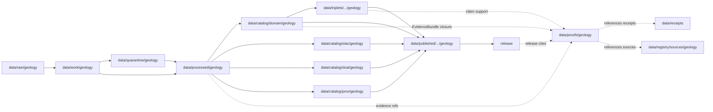

<!-- [KFM_META_BLOCK_V2]
doc_id: kfm://doc/data-proofs-geology-readme
title: data/proofs/geology/README.md — Geology Proofs README
version: v0.1
type: readme; proof-lane-guide; evidence-bundle-lane; geology-domain-proof-index; natural-resources-claim-support-lane; anti-collapse-proof-lane
status: draft; PROPOSED; data-root; proofs-root; geology; natural-resources; evidence-bundle; evidence-ref; claim-support; digest-closure; cite-or-abstain; source-role-aware; sensitivity-aware; release-gated; evidence-first
authors: ChatGPT-5.5 Thinking; reviewed_by: OWNER_TBD
owners: OWNER_TBD — Geology steward · Natural-resources steward · Subsurface data steward · Evidence steward · Proof steward · Sensitivity reviewer · Rights steward · Policy steward · Release steward · Docs steward
created: NEEDS VERIFICATION — greenfield stub existed before v0.1 expansion
updated: 2026-06-25
policy_label: public-doc; data; proofs; geology; natural-resources; evidence; lifecycle; governed; release-gated
tags: [kfm, data, proofs, geology, natural-resources, EvidenceBundle, EvidenceRef, proof, claim-support, digest-closure, SourceDescriptor, CatalogMatrix, ReleaseManifest, ReviewRecord, CorrectionNotice, RollbackCard, PolicyDecision, ValidationReport, RedactionReceipt, GeologicUnit, SurficialUnit, Lithology, StratigraphicInterval, GeologicAge, StructureFeature, FaultStructure, BoreholeReference, WellLogReference, CoreSampleReference, GeophysicalObservation, GeochemistrySampleReference, MineralOccurrence, ResourceDeposit, ResourceEstimate, ExtractionSite, ReclamationRecord, CrossSection, HydrostratigraphicUnit, occurrence, deposit, estimate, permit, production, reserve, model, interpretation, anti-collapse, borehole, sample, subsurface, RAW, WORK, QUARANTINE, PROCESSED, CATALOG, TRIPLET, PUBLISHED]
related:
  - ../README.md
  - ../../README.md
  - ../../processed/geology/README.md
  - ../../catalog/domain/geology/README.md
  - ../../catalog/stac/geology/
  - ../../catalog/dcat/geology/
  - ../../catalog/prov/geology/
  - ../../triplets/
  - ../../published/
  - ../../receipts/
  - ../../registry/sources/geology/
  - ../../../docs/domains/geology/DATA_LIFECYCLE.md
  - ../../../docs/domains/geology/ARCHITECTURE.md
  - ../../../docs/domains/geology/RELEASE_INDEX.md
  - ../../../docs/domains/geology/VERIFICATION_BACKLOG.md
  - ../../../docs/domains/geology/CANONICAL_PATHS.md
  - ../../../docs/runbooks/geology/ROLLBACK_RUNBOOK.md
  - ../../../docs/runbooks/geology/SOURCE_REFRESH_RUNBOOK.md
  - ../../../contracts/domains/geology/
  - ../../../contracts/domains/geology/domain_observation.md
  - ../../../schemas/contracts/v1/domains/geology/
  - ../../../policy/domains/geology/
  - ../../../policy/sensitivity/geology/
  - ../../../release/candidates/geology/
  - ../../../release/
  - ../../../pipelines/domains/geology/
  - ../../../pipelines/domains/geology/boreholes/README.md
  - ../../../pipeline_specs/geology/
  - ../../../tools/validators/
notes:
  - "This file replaces a greenfield stub at `data/proofs/geology/README.md`."
  - "This is a Geology and Natural Resources proof lane guide under `data/proofs/`. It is not RAW source storage, WORK scratch, QUARANTINE holding, PROCESSED data, CATALOG, TRIPLET, PUBLISHED output, receipt storage, source registry, policy authority, release authority, schema home, validator home, public API/UI output, public map/tile output, extraction/legal advice, mineral-rights evidence, property-rights evidence, engineering certification, hazard warning, or life-safety guidance."
  - "Proof records support Geology EvidenceBundle / EvidenceRef closure and claim support. Receipts such as RunReceipt, TransformReceipt, ValidationReport, PolicyDecision, ReviewRecord, RedactionReceipt, ReleaseManifest, CorrectionNotice, and RollbackCard remain in their own receipt/release lanes and may be referenced by proofs; they are not owned here."
  - "Anti-collapse is mandatory: occurrence, deposit, estimate, permit, production, reserve, model, observation, and interpretation claims must remain distinct in evidence, graph projection, and public summaries."
  - "Exact borehole, sample, sensitive resource, well-log, private-well, operator/parcel, and subsurface-sensitive locations require restriction, generalization, or denial before public exposure."
  - "This README is a proof-lane guide only. Contracts define semantic object meaning; schemas define machine shape; policy decides admissibility; release records decide publication."
  - "Rollback target for this expansion is previous greenfield stub blob SHA `1e9c5d30e39f25add18861bc3370deaa48f3b4e2`."
[/KFM_META_BLOCK_V2] -->

<a id="top"></a>

# data/proofs/geology

> Geology and Natural Resources proof lane for EvidenceBundle, EvidenceRef, digest-closure, claim-support, anti-collapse, sensitivity, source-role, release-linkage, correction, and rollback proof artifacts that support Geology claims without becoming source data, processed data, receipts, catalog records, release decisions, or public surfaces.

<p>
  
  
  
  
  
  
</p>

**Status:** draft / PROPOSED  
**Owners:** OWNER_TBD — Geology steward · Natural-resources steward · Subsurface data steward · Evidence steward · Proof steward · Sensitivity reviewer · Rights steward · Policy steward · Release steward · Docs steward  
**Path:** `data/proofs/geology/README.md`  
**Owning root:** `data/proofs/`  
**Domain segment:** `geology`  
**Lifecycle role:** evidence/proof support referenced by processed Geology artifacts, catalog records, triplets, release candidates, corrections, rollbacks, and governed answer surfaces; not a lifecycle phase substitute  
**Exposure posture:** not public by default; public use requires governed projection, source-role-safe representation, sensitivity-safe representation, policy/review state, release state, correction path, and rollback target.  
**Truth posture:** CONFIRMED target was a greenfield stub · CONFIRMED parent `data/proofs/` is also still a greenfield stub · CONFIRMED Geology processed and catalog docs separate proof records from processed/catalog lanes · CONFIRMED Geology doctrine requires responsibility-root placement and lifecycle transitions · PROPOSED proof-lane details · NEEDS VERIFICATION for actual proof schemas, EvidenceBundle wire shape, proof inventory, validators, fixtures, access controls, release linkage, and governed route behavior.

**Quick jumps:** [Purpose](#purpose) · [Lifecycle relationship](#lifecycle-relationship) · [Repo fit](#repo-fit) · [Accepted contents](#accepted-contents) · [Exclusions](#exclusions) · [Proof requirements](#proof-requirements) · [Geology proof guardrails](#geology-proof-guardrails) · [Directory map](#directory-map) · [Evidence ledger](#evidence-ledger) · [Validation checklist](#validation-checklist) · [Rollback](#rollback)

---

## Purpose

`data/proofs/geology/` is the Geology and Natural Resources domain proof lane. It should hold or index proof artifacts that make Geology claims inspectable, evidence-bound, source-role-safe, sensitivity-aware, anti-collapse-safe, citation-ready, and rollback-capable.

This lane may contain or reference proof support for:

- EvidenceBundle closure for Geology catalog/triplet candidates;
- EvidenceRef resolution targets used by release-linked, restricted-review, or governed Geology payloads;
- claim-support records for `GeologicUnit`, `SurficialUnit`, `Lithology`, `StratigraphicInterval`, `GeologicAge`, `StructureFeature`, `FaultStructure`, `BoreholeReference`, `WellLogReference`, `CoreSampleReference`, `GeophysicalObservation`, `GeochemistrySampleReference`, `MineralOccurrence`, `ResourceDeposit`, `ResourceEstimate`, `ExtractionSite`, `ReclamationRecord`, `CrossSection`, and `HydrostratigraphicUnit` claims;
- digest closure, hash manifests, and proof indexes that support reproducibility;
- source-role proof support that keeps occurrence, deposit, estimate, permit, production, reserve, model, observation, and interpretation claims distinct;
- sensitivity/review proof support for exact borehole, private-well, sample, well-log, operator/parcel, sensitive resource, subsurface-sensitive, or infrastructure-risk evidence;
- cross-lane proof support where Geology references Soil, Hydrology, Hazards, People/Land, 3D/Planetary, Archaeology, Agriculture, Roads/Rail, or Settlements evidence while preserving ownership and sensitivity;
- proof metadata needed to show why a governed answer can `ANSWER`, `ABSTAIN`, `DENY`, `HOLD`, or `ERROR`.

This lane does not create, store, or decide the underlying Geology data, schemas, receipts, policy decisions, release decisions, public maps, extraction decisions, property-rights decisions, engineering conclusions, hazard warnings, or public payloads. It supports claims; it does not replace the governed lifecycle.

## Lifecycle relationship

```text
RAW -> WORK / QUARANTINE -> PROCESSED -> CATALOG / TRIPLET -> PUBLISHED
                           \-> data/proofs/geology supports EvidenceBundle / EvidenceRef closure
```



Proofs support catalog, triplet, release, correction, rollback, Evidence Drawer, and governed answers. They do not publish anything by themselves.

## Repo fit

| Responsibility | Correct home | Rule |
|---|---|---|
| Raw geologic maps, source-native geodatabases, agency/steward exports, well-log files, source rasters, source tables, source media, source logs, original exact geometry, or source identifiers | `data/raw/geology/` | Not this lane. |
| In-process transforms, geometry repair, joins, stratigraphic matching, model experiments, redaction/generalization trials, QA, notebooks, or scratch products | `data/work/geology/` | Not this lane. |
| Unresolved rights, unresolved source role, sensitive exact locations, private-well data, operator/parcel joins, malformed files, disputed interpretations, or unsafe geology material | `data/quarantine/geology/` | Not this lane until review/admission allows. |
| Normalized Geology processed artifacts | `data/processed/geology/` | Not this lane. |
| Geology catalog records | `data/catalog/domain/geology/` and related STAC/DCAT/PROV lanes | Catalog, not proof storage. |
| Geology triplet/graph records | `data/triplets/.../geology/` | Graph projection, not proof storage. |
| Geology proof support | `data/proofs/geology/` | This lane. |
| Receipts and review records | `data/receipts/` or accepted receipt roots | Receipts are referenced by proofs but not stored here. |
| Source registry records | `data/registry/sources/geology/` | SourceDescriptor/source-admission authority. |
| Published public-safe Geology outputs | `data/published/.../geology/` | Downstream after release only. |
| Release candidates and release manifests | `release/candidates/geology/`, `release/` | Publication authority, not proof storage. |
| Geology contracts | `contracts/domains/geology/` | Object meaning; not proof artifacts. |
| Geology schemas | `schemas/contracts/v1/domains/geology/` or ADR-resolved home | Machine shape; not proof artifacts. |
| Geology policy and sensitivity rules | `policy/domains/geology/`, `policy/sensitivity/geology/` | Admissibility authority; not proof artifacts. |
| Validators, tests, fixtures, pipelines, apps, packages | `tools/validators/`, `tests/`, `fixtures/`, `pipelines/`, `apps/`, `packages/` | Separate roots. |

## Accepted contents

Geology proof artifacts may include:

- EvidenceBundle files, indexes, or pointers for Geology claims;
- EvidenceRef resolution maps and claim-support manifests;
- digest-closure manifests tying source captures, processed artifacts, catalog records, triplets, receipts, release candidates, correction records, rollback targets, and proof manifests to evidence;
- proof indexes for geologic unit, lithology, stratigraphy, age, structure, borehole, well-log, core/sample, geophysics, geochemistry, mineral occurrence, deposit, estimate, extraction, reclamation, cross-section, and hydrostratigraphy claims;
- anti-collapse proof manifests that preserve occurrence/deposit/estimate/permit/production/reserve/model/observation/interpretation distinctions;
- sensitivity/review proof summaries that preserve exact-location restrictions, public-safe geometry posture, rights posture, review state, release state, and rollback posture;
- cross-lane proof support that preserves ownership, source role, sensitivity, and EvidenceBundle support for Soil, Hydrology, Hazards, People/Land, 3D/Planetary, Archaeology, Agriculture, Roads/Rail, and Settlements references;
- lane-local README or index notes that explain proof boundaries without becoming public outputs or authority records.

## Exclusions

Do not store these under `data/proofs/geology/`:

- RAW, WORK, QUARANTINE, PROCESSED, CATALOG, TRIPLET, or PUBLISHED data artifacts.
- RunReceipt, TransformReceipt, ValidationReport, PolicyDecision, ReviewRecord, RedactionReceipt, RepresentationReceipt, ReleaseManifest, RollbackCard, CorrectionNotice, WithdrawalNotice, AIReceipt, access records, or release signatures as primary receipt/release records.
- SourceDescriptor/source registry records.
- Contracts, schemas, policy bundles, validators, tests, fixtures, pipelines, app/UI/API code, packages, notebooks, or executable tooling.
- Public map/tile/API/UI payloads, Focus Mode answer payloads, direct downloads, model-answer text, release manifests, signatures, changelogs, or published products.
- Exact restricted borehole locations, private-well details, core/sample locations, sensitive resource locations, well-log records with unclear rights, operator/parcel joins, infrastructure-risk detail, redaction parameters, transform offsets, credentials, secrets, or private agreement terms.
- Extraction/legal advice, mineral-rights evidence, property-rights evidence, engineering certification, hazard warning, emergency alert, or life-safety instructions.
- Claims that treat a mineral occurrence as a deposit, a deposit as a reserve, a permit as production, production as a reserve estimate, a model as observation, or an AI summary as evidence.

## Proof requirements

PROPOSED until concrete proof schemas, validators, fixtures, and route behavior are verified:

| Requirement | Meaning |
|---|---|
| EvidenceRef resolution | Every proof entry should identify which EvidenceRef, claim, catalog row, triplet, release candidate, correction, rollback, or governed answer it supports. |
| EvidenceBundle closure | Proof artifacts should support closure over source descriptors, processed artifacts, catalog/triplet records, receipts, validation state, policy posture, review state, redaction state, representation state, and release linkage where applicable. |
| Digest closure | Proofs should include or point to content digests for evidence inputs, processed artifacts, catalog rows, triplets, receipts, redaction/representation products, release candidates, and proof manifests. |
| Source-role preservation | Occurrence, deposit, estimate, permit, production, reserve, model, observation, and interpretation roles must remain explicit and not interchangeable. |
| Sensitivity linkage | Proofs involving exact boreholes, samples, sensitive resources, private wells, operator/parcel joins, or rights-controlled logs should reference PolicyDecision, ReviewRecord, RedactionReceipt/RepresentationReceipt, and release posture without exposing restricted details. |
| Public-safe derivative proof | Public products should show the transform path from restricted evidence to generalized, redacted, aggregated, or otherwise public-safe representation. |
| Cross-lane ownership | Soil, Hydrology, Hazards, People/Land, 3D/Planetary, Archaeology, Agriculture, Roads/Rail, and Settlements evidence must keep owning-lane authority and sensitivity posture. |
| Policy posture | Proof artifacts must not bypass PolicyDecision or steward review when claims touch sensitive Geology or Natural Resources material. |
| Release linkage | Proofs used by public outputs should link to release state, correction path, and rollback target without substituting for ReleaseManifest. |
| Correction and invalidation | Proofs should support correction, supersession, withdrawal, and rollback references when upstream evidence, rights, sensitivity, interpretation, review, or release state changes. |
| No public surface by default | Proof files are not direct public APIs, tiles, downloads, Focus Mode answers, or model-answer sources. |

## Geology proof guardrails

- Proof records support evidence closure; they are not source data, processed data, receipts, catalog records, release manifests, or public products.
- EvidenceBundle outranks generated summaries.
- If a Geology claim lacks resolvable evidence support, the safe outcome is `ABSTAIN`, `DENY`, `HOLD`, or `ERROR`, not an uncited answer.
- Occurrence, deposit, estimate, permit, production, reserve, model, observation, and interpretation claims must not collapse into one resource claim.
- Exact restricted boreholes, private wells, samples, sensitive resources, rights-controlled well logs, operator/parcel joins, and subsurface-sensitive locations must not leak through proof files.
- Public proof references should point to generalized, redacted, aggregated, staged, restricted, or denied representations when policy requires it; they must not expose the restricted original.
- Geology may cite Soil, Hydrology, Hazards, People/Land, 3D/Planetary, Archaeology, Agriculture, Roads/Rail, and Settlements evidence only through governed cross-lane relations that preserve ownership, source role, sensitivity, and EvidenceBundle support.
- AI summaries may reference only governed, released, evidence-supported surfaces and must preserve source-role and sensitivity posture; AI text is not proof.
- KFM must not become an extraction/legal, mineral-rights, property-rights, engineering-certification, hazard-warning, emergency-alert, or life-safety authority through Geology proof artifacts.
- Public clients and Focus Mode must use governed APIs, released artifacts, catalog/triplet records, EvidenceBundle-backed payloads, and policy-safe envelopes, not this directory directly.

> [!CAUTION]
> Do not expose `data/proofs/geology/` directly as a public map, API, UI, download, Focus Mode answer, AI answer source, mineral-rights evidence, property-rights evidence, extraction/legal advice, engineering certification, hazard warning, emergency alert, or life-safety product. Proofs support governed evidence closure; they do not publish Geology claims by themselves.

## Directory map

Actual child inventory remains **NEEDS VERIFICATION**. Use this as a proposed local organization pattern only after confirming current repo convention and validators.

```text
data/proofs/geology/
├── README.md
├── evidence_bundles/         # PROPOSED — Geology EvidenceBundle records or indexes
├── evidence_refs/            # PROPOSED — EvidenceRef resolution maps
├── claim_support/            # PROPOSED — claim-to-evidence manifests
├── digest_closure/           # PROPOSED — source/processed/catalog/triplet/receipt digest closure
├── anti_collapse/            # PROPOSED — occurrence/deposit/estimate/permit/production/reserve distinction proof
├── sensitivity/              # PROPOSED — borehole/sample/resource/private-well sensitivity pointers
├── source_roles/             # PROPOSED — observation/model/interpretation/resource-role support
├── cross_lane/               # PROPOSED — governed proof support for cross-lane joins
├── releases/                 # PROPOSED — proof pointers used by release candidates, not ReleaseManifest authority
├── corrections/              # PROPOSED — proof invalidation/correction pointers, not CorrectionNotice authority
├── validation/               # PROPOSED — proof-validation notes, not ValidationReport authority
└── _README_TODO.md           # PROPOSED — remove after actual child inventory is documented
```

## Evidence ledger

| Source | Status | Supports | Limits |
|---|---|---|---|
| Previous file | CONFIRMED | Target existed as a greenfield stub. | Did not define Geology proof boundaries. |
| `data/proofs/README.md` | CONFIRMED | Parent proof root currently exists as a greenfield stub. | Does not define proof-root contract yet. |
| Repository search | CONFIRMED | Found Geology lifecycle/canonical paths, processed README, catalog README, architecture, rollback, source refresh, domain observation contract, and borehole pipeline references. | Search is not a full tree audit. |
| `docs/domains/geology/DATA_LIFECYCLE.md` | CONFIRMED doctrine / PROPOSED implementation | Geology follows responsibility-root placement, data lifecycle lanes, schema/policy/test/fixture/package/pipeline/release homes, and RAW→PUBLISHED governed transitions. | File itself says repo/file-presence claims need verification. |
| `data/processed/geology/README.md` | CONFIRMED current repo doc / PROPOSED implementation | Processed Geology is not proof storage or public output; it requires EvidenceBundle, validation, policy, release, correction, and rollback before public use; anti-collapse and sensitive subsurface guardrails are explicit. | Does not prove proof inventory or validator behavior. |
| `data/catalog/domain/geology/README.md` | CONFIRMED current repo doc / PROPOSED implementation | Catalog lane separates catalog records from proof records, requires evidence references and source-role/sensitivity/release linkage, and keeps occurrence/deposit/estimate/permit/production/reserve/model/interpretation distinct. | Does not prove release state or validator behavior. |
| `contracts/domains/geology/` and `schemas/contracts/v1/domains/geology/` | NEEDS VERIFICATION | Expected semantic/machine-shape homes. | Specific proof/EvidenceBundle schemas were not verified in this task. |
| `policy/domains/geology/`, `policy/sensitivity/geology/`, and `release/` | NEEDS VERIFICATION | Expected admissibility and release homes. | Current policy/release enforcement was not verified in this task. |

## Validation checklist

- [ ] Confirm actual child directories under `data/proofs/geology/`.
- [ ] Expand or reconcile parent `data/proofs/README.md` beyond stub.
- [ ] Confirm EvidenceBundle, EvidenceRef, proof index, claim-support, digest-closure, anti-collapse proof, sensitivity-proof, source-role proof, and proof-invalidation schemas and contract homes.
- [ ] Confirm whether Geology proof files are concrete records here, indexes pointing to global proof stores, or generated artifacts linked from catalog/release.
- [ ] Confirm validators, fixtures, CI checks, source-role checks, digest checks, EvidenceRef resolution checks, borehole/sample/private-well checks, anti-collapse checks, release-link checks, correction-invalidation checks, and access-control enforcement.
- [ ] Confirm SourceDescriptor/source registry linkage for every proof-supported source family.
- [ ] Confirm proof references to RunReceipt, TransformReceipt, ValidationReport, PolicyDecision, ReviewRecord, RedactionReceipt, RepresentationReceipt, ReleaseManifest, RollbackCard, CorrectionNotice, WithdrawalNotice, and AIReceipt are pointers, not misplaced records.
- [ ] Confirm exact restricted boreholes, private wells, samples, sensitive resource locations, rights-controlled logs, operator/parcel joins, infrastructure-risk detail, redaction parameters, transform offsets, secrets, and release-unclear artifacts cannot enter public routes through proof files.
- [ ] Confirm public-candidate transitions are governed, evidence-backed, source-role-safe, rights-safe, sensitivity-safe, representation-safe, review-backed, release-linked, and reversible.
- [ ] Confirm no RAW, WORK, QUARANTINE, PROCESSED, CATALOG, TRIPLET, PUBLISHED, receipt, registry, release, schema, policy, validator, package, pipeline, app, API, public map, public tile, direct download, Focus Mode answer, extraction/legal advice, mineral-rights evidence, property-rights evidence, engineering certification, hazard warning, emergency alert, or life-safety artifact is misplaced here.
- [ ] Confirm public clients and Focus Mode cannot read this lane directly as public truth, public Geology service, public resource service, public map, public tile, public API, public UI, or AI-answer source.

## Rollback

Rollback is required if this lane becomes a RAW source-data root, WORK scratch root, QUARANTINE bypass, PROCESSED substitute, catalog root, triplet root, public output root, `data/published/` substitute, receipt store, source-registry root, release-decision root, schema root, policy root, validator root, implementation root, direct public API shortcut, direct public UI shortcut, direct public tile shortcut, direct public exposure shortcut, unrestricted canonical EvidenceBundle authority root without ADR, anti-collapse bypass, occurrence-as-deposit path, deposit-as-reserve path, permit-as-production path, model-as-observation path, borehole/sample/private-well exposure path, redaction-bypass path, proof-without-evidence path, uncited-AI-answer source, extraction/legal advice surface, mineral-rights evidence surface, property-rights evidence surface, engineering-certification surface, hazard-warning surface, emergency alert, or life-safety guidance source.

Rollback target for this expansion: previous greenfield stub blob SHA `1e9c5d30e39f25add18861bc3370deaa48f3b4e2`.

<p align="right"><a href="#top">Back to top</a></p>
