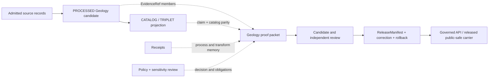

<!-- [KFM_META_BLOCK_V2]
doc_id: kfm://doc/data-proofs-geology-readme
title: data/proofs/geology/ — Geology and Natural Resources Proof Support
version: v0.2.0
type: directory-readme
subtype: geology-domain-proof-lane
status: repository-grounded draft; proof inventory, resolver integrity, domain-profile depth, executable validation, access controls, release linkage, and runtime behavior remain bounded
owners:
  - "NEEDS VERIFICATION — Geology and Natural Resources domain steward"
  - "NEEDS VERIFICATION — evidence, proof, catalog, and validation stewards"
  - "NEEDS VERIFICATION — subsurface, source-role, rights, sensitivity, and public-safe representation reviewers"
  - "NEEDS VERIFICATION — policy, release, correction, rollback, governed-API, Evidence Drawer, and docs stewards"
created: NEEDS VERIFICATION — greenfield stub existed before v0.1 expansion
updated: 2026-07-26
policy_label: restricted-review; proof-support; geology; natural-resources; claim-class-anti-collapse; exact-subsurface-deny-by-default; no-direct-public-path; release-gated
path: data/proofs/geology/README.md
truth_posture: >
  CONFIRMED exact target path, prior blob, Directory Rules proof placement, canonical proofs-root
  contract, Geology processed and catalog boundaries, fielded shared EvidenceBundle semantic contract,
  schema, validator wrapper, and minimal fixtures, current Geology readiness holds, sensitivity-registry
  documentation, scaffold-level Geology policy, and no established child release candidate / PROPOSED
  Geology-specific proof packet, claim-class closure profile, source-role checks, public-safe representation
  bindings, invalidation propagation, and downstream handoff requirements / UNKNOWN recursive proof inventory,
  active writers and consumers, generated indexes, resolver runtime, access controls, public routes, caches,
  hosting, release instances, and public effects / NEEDS VERIFICATION accountable owners, accepted Geology
  proof profile, cross-record resolver integrity, validator execution, Geology-specific fixture depth, CI
  enforcement, policy and sensitivity enforcement, independent review, correction propagation, withdrawal,
  cache invalidation, and rollback drills
evidence_snapshot:
  repository: bartytime4life/Kansas-Frontier-Matrix
  base_ref: main
  base_commit: 01d927659c183d252fc655eeffb1f44f0e0830ad
  prior_blob: e5b4e1d7a14e138607e718cf28f2b8db39e20e24
  greenfield_stub_lineage_blob: 1e9c5d30e39f25add18861bc3370deaa48f3b4e2
  directory_rules_blob: 2affb080e6f0043867c64c7f06c1ca52030fbd55
  proofs_root_blob: 0d8b6e92d3b4b9ff3961d29c53ead497922a31cf
  processed_geology_blob: 0ad68dd4fc4a9589a3c3828be2176967c5fa552b
  catalog_geology_blob: 6cf979fa8f48ed73b7a54db7f99701eb9160612c
  release_candidate_geology_blob: f0313cafc641c049d367af82418212e0bad1fc35
  geology_sensitivity_registry_blob: 4daa1d301c7b58bda21080a35772df8b9653da8a
  geology_policy_blob: 30125b2c59563bbb1307295373f1b9013010ebe9
  evidence_bundle_contract_blob: 731c348832add23cddd14e796aa56ce2b9268259
  evidence_bundle_schema_blob: cf5256831b63dca46a5f68b168441adcf68b8751
  evidence_bundle_validator_blob: c1760c5e92eae6390f5adcde4593e8e9bab26535
  evidence_bundle_fixtures_readme_blob: 89ace659414a757c14a4d3e516fd31d44c6a9969
  geology_workflow_blob: 26e28dc48a5a195b46f400c34aa7bb8614a9f158
related:
  - ../README.md
  - ../../processed/geology/README.md
  - ../../catalog/domain/geology/README.md
  - ../../receipts/README.md
  - ../../registry/sources/geology/README.md
  - ../../registry/sensitivity/geology/README.md
  - ../../published/geology/README.md
  - ../../published/layers/geology/README.md
  - ../../../contracts/evidence/evidence_bundle.md
  - ../../../contracts/evidence/evidence_ref.md
  - ../../../contracts/domains/geology/README.md
  - ../../../schemas/contracts/v1/evidence/evidence_bundle.schema.json
  - ../../../schemas/contracts/v1/evidence/evidence_ref.schema.json
  - ../../../schemas/contracts/v1/domains/geology/README.md
  - ../../../fixtures/contracts/v1/evidence/evidence_bundle/README.md
  - ../../../tools/validators/validate_evidence_bundle.py
  - ../../../policy/evidence/README.md
  - ../../../policy/domains/geology/README.md
  - ../../../release/candidates/geology/README.md
  - ../../../release/README.md
  - ../../../docs/doctrine/directory-rules.md
  - ../../../.github/workflows/domain-geology.yml
notes:
  - "Same-path Markdown modernization only; no Geology source data, proof payloads, EvidenceBundle instances, contracts, schemas, policy, validators, fixtures, workflows, release records, routes, hosting, or publication state changed."
  - "This is the Geology and Natural Resources domain proof-support lane under data/proofs/. It is not an EvidenceRef, PolicyDecision, ReviewRecord, ReleaseManifest, process receipt, source registry, catalog record, public response body, map layer, resource certification, engineering opinion, mineral-rights record, extraction recommendation, or AI-answer authority."
  - "The shared EvidenceBundle contract, schema, validator wrapper, and minimal fixture family are fielded. Geology-specific proof profile depth, cross-record resolution, policy enforcement, CI graduation, and runtime behavior remain NEEDS VERIFICATION."
  - "Occurrence, deposit, estimate, permit, production, reserve, observation, interpretation, model, and synthetic-summary roles must remain distinct."
  - "Exact or reverse-engineerable borehole, private-well, well-log, core, sample, geochemistry, sensitive-resource, operator/parcel, and extraction-targetable details fail closed for ordinary public exposure."
  - "The documentation rollback target for v0.2.0 is prior blob e5b4e1d7a14e138607e718cf28f2b8db39e20e24."
[/KFM_META_BLOCK_V2] -->

# `data/proofs/geology/` — Geology and Natural Resources Proof Support

> **One-line purpose.** Hold or index governed proof support for claim-scoped Geology and Natural Resources assertions while preserving evidence, source role, claim class, spatial and temporal scope, rights, sensitivity, public-safe representation, validation, correction, and release dependencies.

> [!IMPORTANT]
> A proof packet supports evaluation of a bounded claim. It does not certify a mineral occurrence, deposit, resource estimate, reserve, permit, production record, engineering conclusion, legal right, extraction decision, or public release.

> [!CAUTION]
> Missing, stale, conflicting, role-collapsed, rights-unclear, sensitivity-unsafe, unreleased, withdrawn, invalidated, or unresolvable support must yield a finite fail-closed result such as `ABSTAIN`, `HOLD`, `RESTRICT`, `DENY`, or `ERROR`.

> [!WARNING]
> Do not place exact or reverse-engineerable borehole, private-well, well-log, core, sample, geochemistry, sensitive-resource, operator/parcel, extraction-targetable, or infrastructure-sensitive details—or redaction offsets, transform secrets, private endpoints, or credentials—in this ordinary repository lane.

**Path:** `data/proofs/geology/README.md`  
**Owning root:** `data/proofs/`  
**Domain:** Geology and Natural Resources  
**Public posture:** no direct public path; released public-safe projections only  

**Quick navigation:** [Purpose](#purpose) · [Authority](#authority-level) · [Status](#status) · [Belongs](#what-belongs-here) · [Exclusions](#what-does-not-belong-here) · [Inputs](#inputs) · [Outputs](#outputs) · [Validation](#validation) · [Review](#review-burden) · [Related](#related-folders) · [ADRs](#adrs) · [Last reviewed](#last-reviewed) · [Operating contract](#operating-contract) · [Claim closure](#geology-claim-and-source-role-closure) · [Sensitivity](#subsurface-sensitivity-and-safe-representation) · [Lifecycle](#lifecycle-and-governed-handoff) · [Correction](#correction-withdrawal-and-rollback) · [Evidence](#evidence-basis) · [Verification](#open-verification-register) · [No-loss](#no-loss-ledger)

## Purpose

`data/proofs/geology/` is the Geology and Natural Resources domain proof-support lane under the canonical `data/proofs/` responsibility.

It supports reviewable evidence closure for geologic units, surficial units, lithology, stratigraphy, age, structures, boreholes, well logs, cores, samples, geophysics, geochemistry, mineral occurrences, resource deposits and estimates, extraction and production context, reclamation, cross-sections, hydrostratigraphic context, and public-safe derivatives.

This README explains the lane. It does not create a proof inventory, source admission, semantic meaning, machine shape, policy permission, review approval, release decision, public map, legal conclusion, engineering certification, or publication state.

## Authority level

**Domain proof-support lane under the canonical `data/proofs/` responsibility root.**

Directory Rules place proof artifacts under `data/proofs/`, keep receipts under `data/receipts/`, catalog records under `data/catalog/`, release decisions under `release/`, and domain names as segments inside responsibility roots. This path follows that responsibility and domain-lane pattern.

| Concern | Authority owner | This lane's role |
|---|---|---|
| Geology object and claim meaning | `contracts/domains/geology/` | Reference, never redefine |
| Shared EvidenceBundle meaning | `contracts/evidence/evidence_bundle.md` | Reference the claim-scope closure contract |
| Machine-checkable shape | `schemas/contracts/v1/` | Point to accepted schemas; do not redefine fields here |
| Source identity, role, rights, and cadence | `data/registry/sources/geology/` | Resolve source records; do not duplicate them |
| Sensitivity review state | `data/registry/sensitivity/geology/` and accepted policy lanes | Point to control state without exposing restricted detail |
| Policy and admissibility | `policy/` | Reference decisions and obligations |
| Process receipts | `data/receipts/` | Reference immutable process memory |
| Catalog and graph projections | `data/catalog/` and `data/triplets/` | Support claim closure and parity checks |
| Release, correction, withdrawal, rollback | `release/` | Reference decisions; never become release authority |
| Public serving | Governed APIs and released artifacts | No direct read from this lane |

## Status

| Field | Bounded result |
|---|---|
| Path | `data/proofs/geology/README.md` |
| Version | `v0.2.0` |
| Base evidence | `main@01d927659c183d252fc655eeffb1f44f0e0830ad` |
| Prior document blob | `e5b4e1d7a14e138607e718cf28f2b8db39e20e24` |
| Canonical proofs parent | Repository-grounded draft; recursive payload and runtime enforcement remain unverified |
| Shared EvidenceBundle contract/schema | Fielded and documented; status remains `PROPOSED` |
| Shared validator wrapper and fixtures | Present; execution and coverage depth were not established here |
| Geology processed/catalog boundaries | Repository-grounded documentation exists |
| Geology policy | Greenfield scaffold; executable enforcement not established |
| Geology sensitivity registry | Documentation exists; parent topology and concrete records remain bounded |
| Geology workflow | Read-only readiness holds; no proof producer or release authority |
| Recursive proof inventory | `UNKNOWN` |
| Active writers and consumers | `UNKNOWN` |
| Child Geology release candidate | None established by the inspected release-candidate index |
| Public readiness | `DENY BY DEFAULT` |

The current repository establishes a documented proof boundary and shared EvidenceBundle shape support. It does not establish populated Geology proof packets, an accepted Geology proof profile, cross-record resolver integrity, executable domain validation, policy enforcement, approved release, public route, or operational rollback.

## What belongs here

Only governed Geology proof-support material such as:

- claim-scoped `EvidenceBundle` instances or immutable pointers when an accepted profile selects this lane as their materialized home;
- proof packets or indexes binding a Geology claim to evidence, citations, source roles, rights, sensitivity, transforms, validation, review, and release dependencies;
- `EvidenceRef` resolution maps that point to accepted evidence without duplicating source payloads or source-registry authority;
- digest and identity closure manifests for source, processed, catalog, triplet, receipt, proof, and release dependencies;
- claim-class separation findings for occurrence, deposit, estimate, permit, production, reserve, observation, interpretation, model, aggregate, and synthetic-summary roles;
- spatial, temporal, scale, depth, vertical-datum, uncertainty, and interpretation-version support summaries;
- public-safe representation proofs that reference redaction, generalization, aggregation, masking, withholding, or staged-access receipts without exposing protected parameters;
- stable negative-result records explaining `ABSTAIN`, `HOLD`, `RESTRICT`, `DENY`, or `ERROR`;
- correction, supersession, withdrawal, invalidation, and rollback dependency summaries;
- README, index, digest, migration, retention, and disposition sidecars that do not create parallel authority.

## What does NOT belong here

| Do not place here | Correct responsibility or action |
|---|---|
| RAW maps, geodatabases, source rasters, logs, agency exports, source media, original exact geometry, or source-native records | `data/raw/geology/` or the governed source system |
| Mutable transforms, notebooks, matching, geometry repair, model experiments, or redaction trials | `data/work/geology/` |
| Rights-, role-, sensitivity-, validation-, review-, or release-unclear material | `data/quarantine/geology/` |
| Canonical normalized Geology candidates | `data/processed/geology/` |
| STAC, DCAT, PROV, domain catalog, or triplet records | `data/catalog/` and `data/triplets/` |
| Run, transform, validation, policy, review, redaction, representation, or AI receipts | `data/receipts/` |
| SourceDescriptor, source activation, rights, or sensitivity registry records | `data/registry/` |
| Policy decisions, rules, or steward assignments | Accepted policy and review authorities |
| ReleaseManifest, PromotionDecision, CorrectionNotice, WithdrawalNotice, or RollbackCard | `release/` |
| Contracts, schemas, validators, tests, fixtures, pipelines, packages, apps, API, UI, or map code | Their responsibility roots |
| Public maps, tiles, downloads, reports, Evidence Drawer payloads, Focus Mode responses, or AI answers | Released governed delivery surfaces only |
| Exact or reverse-engineerable sensitive subsurface/resource detail or transform parameters | Approved restricted systems; never this ordinary repository lane |
| Mineral-rights, property-rights, legal, investment, extraction, engineering, regulatory, emergency, or life-safety conclusions | Owning authority with sufficient evidence, or abstain/deny |

## Inputs

A proof packet must identify the bounded claim or artifact it supports and, where applicable, resolve:

- stable claim, object, artifact, release-candidate, and proof identity;
- object family and explicit claim class;
- source identity, source role, authority role, rights, license, access class, and citation requirements;
- geographic support, map scale, geometry role, exact/internal versus public-safe precision, and coordinate-reference system;
- depth, elevation, vertical datum, interval, and subsurface reference where material;
- valid time, observation time, interpretation time, source vintage, retrieval time, review time, release time, expiry, and correction time;
- `EvidenceRef` members and expected `EvidenceBundle` identity and digest;
- citations, caveats, limitations, confidence, uncertainty, and disputed interpretation state;
- ordered transforms from source evidence to processed and public-safe artifacts;
- checksums, `spec_hash`, code/spec/run identity, and validation profile;
- sensitivity classification, rights posture, policy decision, review state, and obligations;
- catalog, triplet, receipt, release, correction, withdrawal, and rollback references.

Missing required support is a named blocker, not an invitation to infer closure.

## Outputs

Permitted outputs are proof support for:

- processed-to-catalog and catalog-to-release review;
- Evidence Drawer and governed API resolution;
- citation validation and bounded Focus Mode review;
- sensitivity, public-safe representation, and correction review;
- release-candidate assembly, independent review, correction, withdrawal, and rollback.

This lane emits no public truth by itself. Public clients, maps, exports, search, graphs, Evidence Drawer, and AI surfaces must consume released, policy-safe, evidence-resolved interfaces—not repository proof files.

## Validation

A passing check proves only its declared profile. Validation should cover, where applicable:

1. **Placement and identity:** correct path, stable IDs, versions, digests, `spec_hash`, predecessor/successor, and correction lineage.
2. **Claim scope:** the proof supports only the named object, field, relation, geography, time, depth, scale, audience, and use.
3. **Source closure:** source records resolve; source role, authority role, rights, license, access class, and caveats remain explicit.
4. **Evidence closure:** required `EvidenceRef` members resolve to the expected claim-scoped `EvidenceBundle`.
5. **Shared schema shape:** the fielded EvidenceBundle schema checks required fields and rejects undeclared top-level properties.
6. **Claim-class anti-collapse:** occurrence, deposit, estimate, permit, production, reserve, observation, interpretation, model, aggregate, and synthetic roles remain distinct.
7. **Spatial and temporal support:** geometry role, CRS, precision, scale, depth/vertical reference, time scopes, vintage, stale state, and expiry match the claim.
8. **Rights and sensitivity:** exact subsurface points, private wells, restricted logs, extraction-targetable detail, private-parcel/operator joins, and rights-limited content fail closed.
9. **Representation:** generalized, redacted, aggregated, masked, withheld, staged, modeled, cross-section, and 3D products retain named transforms, uncertainty, and reality-boundary support.
10. **Receipts and integrity:** relevant run, transform, validation, policy, review, redaction, representation, and AI receipts resolve without being duplicated here.
11. **Catalog and triplet parity:** identities, source roles, claim classes, evidence refs, sensitivity, and correction state do not diverge.
12. **Release dependency:** any public-bound use resolves review, policy, immutable release identity, correction/withdrawal state, and rollback target.
13. **Negative cases:** missing evidence, role collapse, rights ambiguity, harmful precision, stale evidence, unsupported scope, invalid checksums, withdrawn release, and failed resolution yield finite negative outcomes.
14. **Sensitive-content scan:** no exact protected location, transform secret, credential, private endpoint, or restricted source payload enters ordinary repository paths.

**Current validation posture:** the shared EvidenceBundle schema, validator wrapper, and minimal fixture family are present. Geology-specific proof schemas, resolver checks, synthetic fixtures, accepted validator commands, CI graduation, policy execution, and runtime consumers remain **NEEDS VERIFICATION**. The current Geology workflow explicitly holds validation, proof production, and release readiness.

## Review burden

Accountable ownership remains **NEEDS VERIFICATION**. Review should include the responsibilities affected by the packet:

- Geology and Natural Resources domain stewardship;
- subsurface, borehole, well-log, core, sample, geophysics, geochemistry, and stratigraphic expertise;
- source authority, rights, and license review;
- sensitivity, harmful-precision, and public-safe representation review;
- evidence, proof, catalog, and validation review;
- policy, release, correction, withdrawal, and rollback review;
- owning-domain review for Soil, Hydrology, Hazards, Archaeology, People/Land, Infrastructure, Agriculture, or 3D relations.

Exact subsurface geometry, private-well information, rights-controlled logs, extraction-targetable resource details, operator/parcel joins, public serving, release, or correction changes require specialist and independent review. CODEOWNERS routing is not approval evidence.

## Related folders

- Parent: [`data/proofs/`](../README.md)
- Lifecycle: [`data/raw/geology/`](../../raw/geology/) · [`data/work/geology/`](../../work/geology/) · [`data/quarantine/geology/`](../../quarantine/geology/) · [`data/processed/geology/`](../../processed/geology/README.md)
- Catalog and graph: [`data/catalog/domain/geology/`](../../catalog/domain/geology/README.md) · [`data/triplets/`](../../triplets/)
- Trust support: [`data/receipts/`](../../receipts/README.md) · [`data/registry/sources/geology/`](../../registry/sources/geology/README.md) · [`data/registry/sensitivity/geology/`](../../registry/sensitivity/geology/README.md)
- Published carriers: [`data/published/geology/`](../../published/geology/README.md) · [`data/published/layers/geology/`](../../published/layers/geology/README.md)
- Semantic and shape authority: [`contracts/evidence/evidence_bundle.md`](../../../contracts/evidence/evidence_bundle.md) · [`contracts/domains/geology/`](../../../contracts/domains/geology/README.md) · [`schemas/contracts/v1/evidence/evidence_bundle.schema.json`](../../../schemas/contracts/v1/evidence/evidence_bundle.schema.json) · [`schemas/contracts/v1/domains/geology/`](../../../schemas/contracts/v1/domains/geology/README.md)
- Policy and release: [`policy/evidence/`](../../../policy/evidence/README.md) · [`policy/domains/geology/`](../../../policy/domains/geology/README.md) · [`release/candidates/geology/`](../../../release/candidates/geology/README.md) · [`release/`](../../../release/README.md)
- Validation: [`fixtures/contracts/v1/evidence/evidence_bundle/`](../../../fixtures/contracts/v1/evidence/evidence_bundle/README.md) · [`tools/validators/validate_evidence_bundle.py`](../../../tools/validators/validate_evidence_bundle.py) · [`.github/workflows/domain-geology.yml`](../../../.github/workflows/domain-geology.yml)
- Doctrine: [`Directory Rules`](../../../docs/doctrine/directory-rules.md)

## ADRs

This README accepts no new ADR and changes no authority root, lifecycle phase, schema home, proof home, receipt home, policy home, or release home.

Relevant decisions or unresolved boundaries include:

- schema-home authority and compatibility;
- receipt/proof/catalog/release object-family separation;
- source-registry subtype-first versus domain-first topology;
- sensitivity-registry and policy topology;
- singular/plural release-manifest and rollback families;
- accepted Geology proof packet and EvidenceBundle profile;
- validator ownership between broad and domain-specific lanes;
- claim-class and source-role vocabularies;
- public-safe subsurface and resource-location profiles.

Treat unresolved forms as `CONFLICTED` or `NEEDS VERIFICATION`. Do not create parallel authorities to resolve them locally.

## Last reviewed

- **Date:** 2026-07-26
- **Evidence boundary:** `main@01d927659c183d252fc655eeffb1f44f0e0830ad`
- **Review type:** exact target plus parent proofs, processed Geology, catalog Geology, release-candidate Geology, sensitivity registry, shared EvidenceBundle contract/schema/validator/fixtures, Geology policy scaffold, and domain workflow
- **Recursive proof payload/runtime inspection:** not performed
- **Owners, independent review, access controls, correction propagation, and operational rollback:** needs verification

Re-review on proof-profile, schema, source-role, claim-class, sensitivity, validator, writer, consumer, route, release, correction, withdrawal, or rollback changes—or within six months.

## Operating contract

A Geology proof packet should make the following reviewable without exposing restricted material:

| Dimension | Minimum posture |
|---|---|
| Claim | Stable ID, object family, claim class, bounded field/relation, geography, time, scale, depth, audience, and use |
| Evidence | Resolvable `EvidenceRef` members and claim-scoped `EvidenceBundle` identity/digest |
| Source | Source identity, source role, authority role, rights, citation, caveats, retrieval, and version |
| Integrity | Checksums, `spec_hash`, code/spec/run identity, transform sequence, and validation profile |
| Geology meaning | Unit, observation, occurrence, deposit, estimate, permit, production, reserve, interpretation, model, aggregate, or synthetic role |
| Representation | Exact/internal versus generalized, redacted, masked, aggregated, withheld, staged, modeled, cross-section, or 3D posture |
| Uncertainty | Confidence, limitations, interpolation/model assumptions, disputed state, and reality-boundary note where material |
| Governance | Sensitivity, policy decision, review state, obligations, release dependency, correction, withdrawal, and rollback |
| Outcome | Finite positive or negative result with reason codes and no plausible completion |

### Shared EvidenceBundle shape

The confirmed shared JSON Schema currently requires:

`bundle_id`, `claim_scope`, `evidence_refs`, `source_records`, `citations`, `rights`, `sensitivity`, `transforms`, `checksums`, and `spec_hash`.

It rejects undeclared top-level properties. Shape validation does not prove Geology claim semantics, cross-record resolution, current rights, safe precision, policy permission, review, release, public suitability, or correction propagation.

## Geology claim and source-role closure

| Claim or source role | Required closure | Prohibited upgrade |
|---|---|---|
| Geologic unit or boundary | Source scale/vintage, interpreted versus observed role, geometry confidence, citations, and version | Generalized display boundary must not replace authoritative interpreted evidence |
| Observation or measurement | Method, instrument/sample identity, location/time/depth support, quality, and limitations | Observation must not become a regional interpretation without explicit derivation |
| Interpretation | Author/method/date/version, evidence inputs, confidence, alternatives, and disputed state | Interpretation must not be relabeled as observation |
| Model or interpolated surface | Model/spec/run identity, training or input evidence, validation, uncertainty, scale, and reality boundary | Model must not become measured or observed geology |
| Mineral occurrence | Evidence of mineralization/commodity, source role, location posture, and uncertainty | Occurrence must not become deposit, resource, or reserve |
| Resource deposit | Geological and economic definition, classification scheme, evidence, date, and reviewer role | Deposit must not become reserve or production |
| Resource estimate or reserve | Named classification scheme, method, assumptions, effective date, qualified review, uncertainty, and supporting rights/context | Estimate or reserve must not be inferred from occurrence, map color, permit, or production |
| Permit or regulatory record | Issuing authority, jurisdiction, status, dates, and administrative role | Permit must not prove geology, deposit, production, ownership, or rights |
| Production record | Reporting authority, reporting unit, time interval, corrections, and lease/well relationship caveats | Production must not prove reserve, deposit geometry, or legal title |
| Borehole, core, well log, or sample | Stable identity, source, method, interval/depth, datum, rights, exact/internal precision, and public-safe representation | A reference record must not become public drilling guidance or unrestricted exact location |
| Cross-section or 3D representation | Input evidence, interpretation/model role, geometry transform, uncertainty, time/vintage, and reality-boundary support | Visualization must not become observed subsurface truth |
| AI or synthetic summary | Released evidence scope, citations, policy result, model/runtime receipt, and finite outcome | Generated language must not become evidence or independent proof |

## Subsurface sensitivity and safe representation

- Exact boreholes, private wells, cores, well logs, geochemistry samples, and similar subsurface points default to denied or generalized public exposure.
- Extraction-targetable mineral/resource detail requires sensitivity and public-interest review even when source data is technically public.
- Rights-restricted logs, proprietary records, terms-limited feeds, and private-parcel/operator joins fail closed.
- A high-quality source does not override sensitivity, rights, sovereignty, trespass, or harmful-precision concerns.
- Generalization, aggregation, masking, withholding, redaction, and staged access must reference named/versioned transform profiles and applicable receipts.
- Public proof pointers must resolve to the public-safe derivative and its transform lineage, never leak the restricted original or parameters that defeat the transform.
- Cross-sections, 3D scenes, interpolations, reconstructions, and modeled surfaces must preserve interpretation/model labels, uncertainty, input evidence, and reality-boundary notes.
- Geology proof support must not become mineral-rights evidence, property-rights evidence, legal advice, engineering certification, investment advice, extraction recommendation, hazard warning, emergency alert, or life-safety guidance.

## Lifecycle and governed handoff

```mermaid
flowchart LR
    SRC["Admitted source records"] --> PROC["PROCESSED Geology candidate"]
    PROC --> CAT["CATALOG / TRIPLET projection"]
    PROC -. "EvidenceRef members" .-> PROOF["Geology proof packet"]
    CAT -. "claim + catalog parity" .-> PROOF
    RECEIPT["Receipts"] -. "process and transform memory" .-> PROOF
    POLICY["Policy + sensitivity review"] -. "decision and obligations" .-> PROOF
    PROOF --> REVIEW["Candidate and independent review"]
    REVIEW --> RELEASE["ReleaseManifest + correction + rollback"]
    RELEASE --> PUBLIC["Governed API / released public-safe carrier"]
```

The arrows are governed dependencies, not automatic promotion. A proof packet may support a held, denied, restricted, withdrawn, or unreleased result.

## Correction, withdrawal, and rollback

A proof dependency changes when upstream evidence, source role, rights, sensitivity, interpretation, model, validation, policy, review, catalog, or release state changes.

Required behavior:

1. identify affected claim, proof, catalog, triplet, candidate, release, and public-carrier identities;
2. mark stale, invalidated, superseded, restricted, denied, withdrawn, or held state explicitly;
3. prevent unresolved or withdrawn proof from supporting a new `ANSWER` or public release;
4. preserve prior evidence and decision lineage rather than silently rewriting history;
5. rebuild or withdraw dependent catalogs, indexes, graph projections, tiles, exports, Evidence Drawer payloads, and AI caches through their owning processes;
6. publish correction or withdrawal records when public reliance requires them;
7. preserve an immutable rollback target and verify rollback without exposing restricted originals.

Documentation rollback for this update is a transparent revert to prior blob `e5b4e1d7a14e138607e718cf28f2b8db39e20e24`. Reverting this README does not roll back proof payloads, evidence, policy, release, APIs, maps, caches, or access state.

## Evidence basis

| Evidence | Status | What it supports | Limit |
|---|---:|---|---|
| Exact prior README | **CONFIRMED** | Stable path, `doc_id`, prior content, proof purpose, anti-collapse, sensitivity, and legacy fragments | Prior claims about parent proofs maturity and shared EvidenceBundle verification were stale |
| Directory Rules | **CONFIRMED doctrine** | Proof placement under `data/proofs/`; responsibility-root and domain-lane separation | Does not establish that payloads or validators exist |
| `data/proofs/README.md` | **CONFIRMED** | Canonical proofs responsibility, no-direct-public-path, cite-or-abstain, receipt/catalog/release separation | Recursive payloads, writers, consumers, and enforcement remain bounded |
| `data/processed/geology/README.md` | **CONFIRMED** | Processed Geology boundary, claim-class anti-collapse, exact-location restrictions, downstream proof handoff | Does not establish proof closure or release |
| `data/catalog/domain/geology/README.md` | **CONFIRMED** | Catalog/proof separation, source-role and claim-class requirements, explicit catalog closure hold | Catalog inventory and operational closure remain unproved |
| Shared EvidenceBundle contract/schema | **CONFIRMED fielded / PROPOSED status** | Claim-scope closure meaning, ten required fields, closed top-level shape | Does not establish resolver, policy, review, or release behavior |
| Shared validator wrapper and fixture README | **CONFIRMED present / NOT RUN** | Bounded shape-validation surface and minimal valid/invalid examples | Geology-specific depth and execution remain unverified |
| `data/registry/sensitivity/geology/README.md` | **CONFIRMED documentation** | Deny-by-default exact subsurface posture, public-safe transform dependencies, reality-boundary guidance | Parent topology, records, policy binding, and runtime enforcement remain bounded |
| `policy/domains/geology/README.md` | **CONFIRMED scaffold** | Geology policy home exists | Executable policy and substantive domain rules are not established |
| `release/candidates/geology/README.md` | **CONFIRMED** | No child candidate established by its bounded review; candidate-is-not-release boundary | Not a permanent recursive absence proof |
| `.github/workflows/domain-geology.yml` | **CONFIRMED workflow definition** | Read-only validation, proof, and release-readiness holds; no publication authority | Current run results and branch-protection significance are separate evidence |

## Open verification register

| Item | Status | Required evidence |
|---|---:|---|
| Recursive proof inventory | **UNKNOWN** | Pinned recursive tree, LFS/external stores, generated outputs, restricted-system inventory |
| Accepted Geology proof profile | **NEEDS VERIFICATION** | Contract/ADR selecting instance-versus-index posture, canonical home, identity, retention, and versioning |
| Cross-record EvidenceRef resolution | **NEEDS VERIFICATION** | Resolver implementation, negative tests, digest agreement, missing/conflict behavior |
| Geology-specific schemas and fixtures | **NEEDS VERIFICATION** | Public-safe synthetic positive and negative packets covering claim classes and sensitivity |
| Executable validators and CI graduation | **NEEDS VERIFICATION** | Accepted commands, deterministic no-network suite, workflow wiring, observed runs |
| Policy and sensitivity enforcement | **NEEDS VERIFICATION** | Executable rules, reason codes, obligations, reviewed fixtures, runtime decisions |
| Writers and consumers | **UNKNOWN** | Pipeline, tool, catalog, release, API/UI, Evidence Drawer, Focus Mode, and AI inventory |
| Access control and restricted storage | **UNKNOWN** | Authz design, restricted-store configuration, route tests, audit logs, leak tests |
| Release and public carrier instances | **UNKNOWN** | ReleaseManifest, PromotionDecision, proof linkage, published bytes, host and cache evidence |
| Correction propagation and rollback | **NEEDS VERIFICATION** | Tested invalidation, withdrawal, catalog/index/cache rebuild, and rollback drill |

Unknowns narrow claims and block higher-risk transitions; they do not invite plausible defaults.

## No-loss ledger

| Baseline element | Disposition | Result |
|---|---|---|
| Stable path, `doc_id`, and greenfield-stub lineage | **KEEP** | Preserved in the meta block and same-path update |
| Geology and Natural Resources proof purpose | **KEEP / ENRICH** | Retained and aligned with current proofs, processed, catalog, release, and EvidenceBundle evidence |
| Object families and cross-lane relationships | **KEEP / CLARIFY** | Preserved without claiming current payload inventory |
| Occurrence/deposit/estimate/permit/production/reserve/model/observation/interpretation anti-collapse | **KEEP / STRENGTHEN** | Expanded into an explicit closure matrix |
| Exact borehole, sample, private-well, sensitive-resource, operator/parcel, and subsurface controls | **KEEP / STRENGTHEN** | Preserved across exclusions, validation, sensitivity, correction, and public boundary |
| Parent `data/proofs/` described as a greenfield stub | **CORRECT** | Replaced with current repository-grounded parent contract |
| Shared EvidenceBundle schema and validator treated as wholly unverified | **CORRECT / NARROW** | Fielded shared contract, schema, wrapper, and fixtures recorded without claiming execution or Geology depth |
| Speculative child-directory tree | **REMOVE WITH EVIDENCE** | Removed because recursive inventory and accepted Geology proof profile remain unverified |
| Lifecycle arrows that could imply automatic promotion | **CLARIFY** | Replaced with governed dependencies and explicit finite negative outcomes |
| Validation checklist | **REORGANIZE** | Converted into bounded validation and open-verification matrices |
| Rollback posture | **CLARIFY** | Documentation rollback separated from operational proof/release rollback |
| Legacy fragments | **KEEP** | Explicit compatibility anchors preserve prior inbound fragment targets |
| Payload, source, schema, contract, policy, validator, fixture, workflow, release, route, or public-state change | **NONE** | Markdown only |

### Change history

#### v0.2.0 — 2026-07-26

- aligned the first twelve H2 sections with the Directory Rules folder-README contract;
- preserved stable identity, path, proof responsibility, anti-collapse, sensitivity, and public-boundary controls;
- corrected stale parent-proofs and shared EvidenceBundle posture claims;
- grounded the document in current Geology processed, catalog, release-candidate, sensitivity-registry, and workflow evidence;
- documented shared EvidenceBundle shape support without claiming Geology-specific closure or runtime enforcement;
- removed the speculative child-directory tree;
- strengthened claim-class, source-role, subsurface sensitivity, reality-boundary, correction, withdrawal, and rollback guidance;
- changed Markdown only.

[Back to top](#top)
