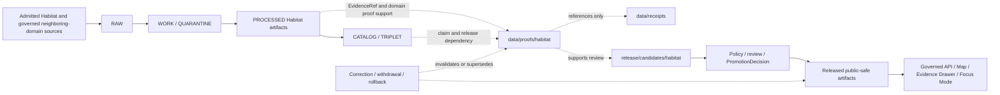

<!-- [KFM_META_BLOCK_V2]
doc_id: kfm://data/proofs/habitat/readme
title: data/proofs/habitat/ — Habitat Domain Proof Support
type: directory-readme
version: v0.2.0
status: repository-grounded draft; accepted Habitat proof producer, executable proof validator, complete proof schema/profile, payload inventory, policy enforcement, release linkage, and runtime behavior remain bounded
owners:
  - "NEEDS VERIFICATION — Habitat domain steward"
  - "NEEDS VERIFICATION — evidence, EvidenceBundle, proof, citation-validation, and validation stewards"
  - "NEEDS VERIFICATION — source-role, rights, sensitivity, geoprivacy, stewardship, and cross-domain reviewers"
  - "NEEDS VERIFICATION — policy, release, correction, rollback, governed-API, Evidence Drawer, governed-AI, and docs stewards"
created: 2026-06-25
updated: 2026-07-26
policy_label: restricted-review; proof-support; habitat; cite-or-abstain; join-induced-sensitivity; no-direct-public-path; release-gated
path: data/proofs/habitat/README.md
owning_root: data/
lifecycle_area: proofs
domain: habitat
truth_posture: >
  CONFIRMED exact target path, prior blob, Directory Rules proof placement, canonical proofs-root
  contract, Habitat domain and semantic-contract boundaries, Habitat schema and fixture indexes,
  Habitat source-registry boundary, two Habitat validator routing indexes, current read-only Habitat
  workflow holds, candidate-lane inventory, and no established Habitat release / PROPOSED accepted
  Habitat proof packet/profile, proof producer, deterministic validator command, source-role closure,
  join-sensitivity propagation, public-safe proof routing, invalidation propagation, and downstream
  handoff requirements / UNKNOWN recursive proof payload inventory, active writers and consumers,
  generated indexes, EvidenceRef-to-EvidenceBundle resolver behavior, public routes, caches, hosting,
  release instances, and public effects / NEEDS VERIFICATION accountable owners, accepted proof
  schema/profile, validator execution, fixture payload depth, CI graduation, policy and geoprivacy
  enforcement, stewardship review, correction propagation, withdrawal behavior, retention, and
  rollback drills
evidence_snapshot:
  repository: bartytime4life/Kansas-Frontier-Matrix
  base_ref: main
  base_commit: a6c78179e1c283321520a9bcc4c636d2f1d2673c
  prior_blob: 7f869ab1a13c4fecbdb08ad2cdc823e37d1519f0
  directory_rules_blob: 2affb080e6f0043867c64c7f06c1ca52030fbd55
  proofs_root_blob: 0d8b6e92d3b4b9ff3961d29c53ead497922a31cf
  habitat_docs_blob: 876d1fa41a00d94d7120c6ef065750748e6bf524
  habitat_contracts_blob: 65b5b259b3ac1887e6bb753f48d83d752ff0875a
  habitat_schema_index_blob: ab7563e33cd7a70919a68a5452514566fc53dfa4
  habitat_fixture_index_blob: 674c5acf8c2f1739762625e392616ce1034de0e6
  habitat_tests_index_blob: 4503de9bcb1c92db45012d897d647fb39a9f7172
  habitat_source_registry_blob: 5d9c90f88ff7e2e2b0d4f2064bc835589196d8b8
  habitat_domain_validator_blob: 95fc76eb4388327838f773af7bfab3c11e924f82
  habitat_routing_validator_blob: 0508099634ba079f1d01d4a2d91ff291052a480d
  habitat_policy_blob: 8456c65196354695b8eb5b8178ecb61cfc12b7dd
  habitat_release_candidate_blob: e55b9344cda673e069bce5525937f5a50666bf63
  habitat_workflow_blob: 14b2d933d44f61c2b8294affb5667811e4e133cf
related:
  - ../README.md
  - ../../receipts/habitat/README.md
  - ../../processed/habitat/README.md
  - ../../catalog/domain/habitat/README.md
  - ../../registry/sources/habitat/README.md
  - ../../published/habitat/README.md
  - ../../rollback/habitat/README.md
  - ../../../docs/domains/habitat/README.md
  - ../../../contracts/domains/habitat/README.md
  - ../../../schemas/contracts/v1/domains/habitat/README.md
  - ../../../fixtures/domains/habitat/README.md
  - ../../../tests/domains/habitat/README.md
  - ../../../tools/validators/domains/habitat/README.md
  - ../../../tools/validators/habitat/README.md
  - ../../../policy/domains/habitat/README.md
  - ../../../release/candidates/habitat/README.md
  - ../../../release/README.md
  - ../../../docs/doctrine/directory-rules.md
  - ../../../.github/workflows/domain-habitat.yml
notes:
  - "Same-path Markdown modernization only; no Habitat source bytes, proof payloads, EvidenceBundle instances, contracts, schemas, policies, validators, fixtures, workflows, releases, routes, hosting, access controls, or publication state changed."
  - "data/proofs/habitat/ is the Habitat domain proof-support lane. It must reference rather than duplicate source, evidence, receipt, catalog, policy, review, release, correction, rollback, or neighboring-domain authority."
  - "The literal phrase 'Implementation depth remains UNKNOWN' is retained because the current read-only Habitat proof-readiness workflow treats it as an explicit hold signal."
  - "Current repository evidence confirms schema, fixture, test, source-registry, validator-index, candidate-index, and workflow documentation surfaces; executable proof production, accepted proof validation, policy enforcement, and release remain unverified."
  - "The documentation rollback target for v0.2.0 is prior blob 7f869ab1a13c4fecbdb08ad2cdc823e37d1519f0."
[/KFM_META_BLOCK_V2] -->

# `data/proofs/habitat/` — Habitat Domain Proof Support

> **One-line purpose.** Hold or index claim-scoped Habitat proof support that preserves landscape identity, source roles, evidence references, spatial and temporal scope, model and observation distinctions, rights, join-induced sensitivity, public-safe representation, integrity, correction lineage, and release dependencies without becoming Habitat truth, policy authority, release authority, or a public data service.

> [!IMPORTANT]
> **Proof support is necessary but not sufficient for publication.** A structurally coherent Habitat proof packet can support policy, review, and release evaluation, but it does not make a habitat classification correct, a suitability model observational truth, a corridor biologically proven, a regulatory layer legally interpreted, a sensitive join public-safe, or an artifact released.

> [!CAUTION]
> Habitat sensitivity is frequently **join-induced or derivation-induced**. A benign patch, class, score, model, corridor, restoration opportunity, or stewardship layer can become restricted when associated with Fauna, Flora, archaeology, private land, infrastructure, cultural knowledge, or other controlled context.

> [!WARNING]
> Do not place exact or reverse-engineerable sensitive occurrences, stewardship-controlled details, access clues, private-land joins, cultural or archaeological context, restricted infrastructure relationships, withheld precision, redaction offsets, generalization thresholds, transform parameters, or other control-defeating details in this ordinary repository lane.

**Implementation depth remains UNKNOWN.**  
**Path:** `data/proofs/habitat/`  
**Owning responsibility:** `data/proofs/`  
**Domain segment:** `habitat/`  
**Direct public access:** denied  
**Documentation rollback target:** prior blob `7f869ab1a13c4fecbdb08ad2cdc823e37d1519f0`

**Quick navigation:** [Purpose](#purpose) · [Authority](#authority-level) · [Status](#status) · [Belongs](#what-belongs-here) · [Exclusions](#what-does-not-belong-here) · [Inputs](#inputs) · [Outputs](#outputs) · [Validation](#validation) · [Review](#review-burden) · [Related](#related-folders) · [ADRs](#adrs) · [Last reviewed](#last-reviewed) · [Operating contract](#operating-contract) · [Object families](#habitat-object-family-and-source-role-closure) · [Sensitivity](#sensitivity-geoprivacy-and-public-safe-representation) · [Lifecycle](#lifecycle-and-governed-handoff) · [Thin slice](#habitat--fauna-thin-slice-proof-pattern) · [Correction](#correction-withdrawal-invalidation-and-rollback) · [Evidence](#repository-evidence-ledger) · [Verification](#open-verification-register) · [No-loss](#no-loss-ledger)

---

## Purpose

`data/proofs/habitat/` is the Habitat domain proof-support lane under the canonical `data/proofs/` responsibility. It supports inspectable closure for Habitat claims and derived artifacts while preserving landscape identity, domain ownership, source role, evidence, space, time, model posture, rights, sensitivity, public-safe representation, validation, review, release dependency, correction lineage, and rollback support.

The lane exists to make bounded questions inspectable before a claim or artifact advances:

1. What Habitat object, claim, model, relationship, layer candidate, or release candidate is being supported?
2. Which admitted source records, `EvidenceRef` values, and `EvidenceBundle` members support it?
3. Which source roles, object families, classifications, model runs, joins, spatial scales, and temporal scopes qualify the support?
4. Which rights, sensitivity, geoprivacy, public-safe transforms, receipts, validations, and integrity checks apply?
5. Which policy, stewardship, review, catalog, release, correction, withdrawal, and rollback dependencies remain outside the proof packet?
6. Which finite downstream result—continue review, `ABSTAIN`, `HOLD`, `RESTRICT`, `DENY`, or `ERROR`—is justified?

This lane supports evidence and review. It does not admit sources, establish Habitat truth, define object meaning, define schema shape, execute models, decide legal or regulatory interpretation, determine species presence, execute geoprivacy, approve stewardship decisions, decide policy, approve release, publish maps, or authorize land-management action.

## Authority level

**Implementation-bearing specialized domain proof-support lane under the canonical `data/proofs/` responsibility.**

Authority remains separated:

| Concern | Owning surface | Relationship to this lane |
|---|---|---|
| Habitat doctrine and bounded context | [`docs/domains/habitat/`](../../../docs/domains/habitat/README.md) | Explains domain scope and non-ownership. |
| Habitat semantic meaning | [`contracts/domains/habitat/`](../../../contracts/domains/habitat/README.md) | Defines object meaning; proofs cite accepted contracts. |
| Machine shape | [`schemas/contracts/v1/domains/habitat/`](../../../schemas/contracts/v1/domains/habitat/README.md) | Defines schema shape; proofs record the applied profile. |
| Source identity, role, rights, cadence, and admission | [`data/registry/sources/habitat/`](../../registry/sources/habitat/README.md) | Proofs reference admitted sources; registry records do not live here. |
| Evidence and domain proof support | `data/proofs/` and this lane | Supports inspectable closure without becoming policy or release authority. |
| Process memory and receipts | [`data/receipts/habitat/`](../../receipts/habitat/README.md) | Proofs cite receipts; receipts remain separate. |
| Policy and sensitivity decisions | [`policy/domains/habitat/`](../../../policy/domains/habitat/README.md) and accepted sensitivity/geoprivacy homes | Proofs carry results; they do not decide them. |
| Validation implementation | [`tools/validators/domains/habitat/`](../../../tools/validators/domains/habitat/README.md) and [`tools/validators/habitat/`](../../../tools/validators/habitat/README.md) | Validator indexes are fielded; executable behavior remains bounded. |
| Candidate review and release | [`release/candidates/habitat/`](../../../release/candidates/habitat/README.md) and shared `release/` records | Proofs support candidates; candidate or proof existence is not release. |
| Public carriers | Governed APIs and released public-safe artifacts | No direct client path to this lane. |

When one artifact could fit more than one proof axis, an accepted contract and profile must select one authoritative home. Other lanes may carry immutable references, indexes, or validation summaries; they must not duplicate mutable proof authority, source payloads, receipts, policy decisions, release records, or restricted material.

This README creates no proof object, schema, policy, release, public route, or publication state.

## Status

| Surface | Repository-grounded result |
|---|---|
| Exact target | **CONFIRMED** at `main@a6c78179e1c283321520a9bcc4c636d2f1d2673c`; prior blob `7f869ab1a13c4fecbdb08ad2cdc823e37d1519f0` |
| Documentation version | `v0.2.0` |
| Canonical proof parent | **CONFIRMED repository-grounded draft** at [`data/proofs/README.md`](../README.md) |
| Habitat domain doctrine | **CONFIRMED draft document** with landscape-not-species and source-role anti-collapse rules |
| Habitat semantic contracts | **CONFIRMED draft parent contract** with land-cover and ecoregion surfaces; broader contract maturity remains bounded |
| Habitat schemas | **CONFIRMED draft index**; one land-cover observation schema scaffold is recorded; complete Habitat proof schema is not established |
| Habitat fixture index | **CONFIRMED populated README index** with synthetic child lanes; payload inventory was not established in this task |
| Habitat tests | **CONFIRMED expanded parent index**; executable suite and passing commands remain `NEEDS VERIFICATION` |
| Habitat source registry | **CONFIRMED subtype-first registry README** with unresolved domain-first compatibility topology |
| Habitat validators | **CONFIRMED two README indexes** plus Habitat/Fauna routing documentation; accepted executable proof validator is not established |
| Habitat policy | **CONFIRMED greenfield scaffold**; executable domain and sensitivity enforcement is not established |
| Habitat candidate inventory | **CONFIRMED parent plus `ecoregions/` and `habitat_fauna_thin_slice/` README indexes; no non-README candidate record or active candidate established** |
| Habitat workflow | **CONFIRMED read-only readiness workflow** with explicit validation, proof, and release holds |
| Proof payload inventory | `UNKNOWN` beyond this README; no governed recursive payload inventory was performed |
| Accepted proof producer | Not established |
| Public release | Not established by inspected evidence |
| Public readiness | `DENY BY DEFAULT` |

A green held workflow result proves only readiness checks and explicit holds. It is not Habitat truth, species-presence evidence, critical-habitat legal interpretation, a validated model, an `EvidenceBundle`, a `ProofPack`, a `PolicyDecision`, a release decision, or publication authority.

## What belongs here

Only bounded Habitat proof-support artifacts under an accepted profile, such as:

- claim-to-evidence or object-to-evidence closure packets;
- domain proof packets for `HabitatPatch`, `LandCoverObservation`, `EcologicalSystem`, `HabitatQualityScore`, `SuitabilityModel`, `ConnectivityEdge`, `Corridor`, `RestorationOpportunity`, `StewardshipZone`, `UncertaintySurface`, and public-safe cross-domain assignments;
- source-role, object-family, spatial, temporal, rights, sensitivity, model, review, catalog, and release dependency summaries;
- validation and integrity summaries that reference—but do not duplicate—authoritative reports and receipts;
- public-safe geometry proof summaries that identify the transform and receipt without exposing restricted originals or reversible parameters;
- stable negative-result records explaining `ABSTAIN`, `HOLD`, `RESTRICT`, `DENY`, or `ERROR`;
- correction, supersession, withdrawal, invalidation, and rollback dependency maps;
- immutable indexes or pointers to authoritative proof records;
- local README, inventory, digest, migration, retention, or disposition sidecars that do not create parallel authority.

### Admissible realization profiles

Current repository evidence does not establish whether this lane will hold full proof instances, immutable indexes, or both. Until an accepted profile decides that question:

- do not duplicate proof instances across domain, EvidenceBundle, citation-validation, or proof-pack lanes;
- keep source payloads, receipts, catalogs, policy decisions, and release records in their owning roots;
- mark illustrative filenames and fields as `PROPOSED`;
- fail closed when ownership, rights, sensitivity, or release dependency is unresolved.

## What does NOT belong here

| Do not place here | Correct home or action |
|---|---|
| RAW captures, source archives, rasters, vectors, tables, API dumps, or source-native geometry | `data/raw/habitat/` or the governed source system |
| In-process normalization, crosswalk trials, model experiments, joins, notebooks, or scratch outputs | `data/work/habitat/` |
| Rights-, sensitivity-, role-, identity-, validation-, review-, or release-unclear material | `data/quarantine/habitat/` |
| Canonical normalized Habitat objects | `data/processed/habitat/` |
| STAC, DCAT, PROV, domain catalog, or triplet records | Their catalog or triplet lanes |
| Runtime, transform, validation, redaction, aggregation, policy, review, or release receipts as primary records | `data/receipts/` or accepted receipt homes |
| `SourceDescriptor` or source activation authority | `data/registry/sources/habitat/` or ADR-selected registry home |
| Policy, rights, sensitivity, geoprivacy, stewardship, or legal/regulatory decisions | Their accepted policy or review authority |
| Candidate approval, PromotionDecision, ReleaseManifest, CorrectionNotice, WithdrawalNotice, or RollbackCard | `release/` |
| Contracts, schemas, validators, fixtures, tests, pipelines, packages, API, UI, map, graph, search, export, or AI code | Their responsibility roots |
| Public tiles, downloads, dashboards, popups, reports, screenshots, Focus Mode responses, or AI output | Released governed delivery surfaces only |
| Exact or reverse-engineerable sensitive joins, restricted locations, access clues, private-land details, withheld precision, transform parameters, or protected context | Approved restricted systems; never this ordinary repository lane |

## Inputs

A Habitat proof packet should identify or resolve, where applicable:

- stable proof ID, proof family, domain, supported object or candidate ID, run ID, and profile/spec identity;
- Habitat object family, source role, classification system, class code, model role, join role, and ownership boundary;
- source descriptor IDs, source heads/versions, rights, citation, cadence, retrieval state, and authority limits;
- `EvidenceRef` values and expected `EvidenceBundle` or proof-packet identity and digest;
- claim scope, geography, geometry posture, CRS, scale, resolution, valid extent, public-safe representation, and intended audience;
- source, observed, valid, retrieval, model-run, review, release, correction, and expiry times where material;
- model identity, inputs, assumptions, parameters or parameter references, validation status, uncertainty, and fitness-for-use limitations;
- validation report IDs, transform/validation/policy/review receipt IDs, policy decision IDs, and review records;
- catalog/triplet references, candidate/release references, correction/withdrawal references, and rollback target;
- input and output digests, content/spec hash, stale state, limitations, and finite result.

A packet must not imply that unresolved references, a schema pass, or a model run establishes proof closure.

## Outputs

This lane may emit or index proof support for:

- Habitat contract and schema review;
- domain validation and sensitive-join review;
- EvidenceBundle and citation closure;
- catalog/triplet review;
- release-candidate review and dry-run readiness;
- governed API and Evidence Drawer projection;
- Focus Mode or bounded AI `ANSWER`, `ABSTAIN`, `DENY`, or `ERROR` decisions;
- correction, withdrawal, supersession, invalidation, and rollback analysis.

Outputs remain internal or review-scoped unless a separate governed release explicitly admits a public-safe projection. Public clients must not use this lane as a direct data service.

## Validation

Validation must be layered and finite.

| Layer | Required check | Bounded posture |
|---|---|---|
| Placement | Correct proof/domain responsibility and no duplicate authority | Directory Rules and parent proof contract |
| Structure | Required IDs, references, profile/version, finite status, declared fields only | Accepted proof schema; currently not established |
| Identity and integrity | Stable identifiers, input/output digests, content/spec hash, replay or reconstruction support | Deterministic where practical |
| Source role and object family | Preserve observed, regulatory, modeled, aggregate, administrative, candidate, and synthetic roles; preserve neighboring-domain ownership | Reject role or authority collapse |
| Evidence | Resolve required evidence refs and claim-scope support | Missing or unresolvable support yields `ABSTAIN` or `HOLD` |
| Spatial | CRS, geometry type, bounds, scale, precision, topology, generalization, and public-safe representation | Over-precise or unsafe joins yield `DENY` |
| Temporal | Source, observed, valid, retrieval, model-run, release, correction, and expiry state | Stale or ambiguous support yields `ABSTAIN` or `STALE` |
| Model | Model identity, assumptions, validation, uncertainty, limitations, and no model-as-observation collapse | Unsupported model claims yield `ABSTAIN` or `DENY` |
| Rights and sensitivity | Rights, source terms, join-induced sensitivity, geoprivacy, stewardship, sovereignty/cultural, private-land, infrastructure, and other controlled context | Unknown or unsafe posture fails closed |
| Receipts and review | Required transform, validation, policy, review, redaction/aggregation, and other receipt links resolve | Missing dependencies yield `HOLD` or `DENY` |
| Catalog and release | Catalog/triplet parity, candidate identity, release dependency, correction, withdrawal, and rollback support | Proof is not promotion or release |
| Public surface | API, map, tile, popup, export, graph, search, screenshot, embedding, and AI projections cannot reveal more than the approved derivative | Leakage yields `DENY` or `ERROR` |

The current Habitat workflow confirms explicit holds and no accepted proof producer or deterministic proof command. It does not establish a passing Habitat proof suite. A pass proves only its declared validation profile.

## Review burden

Accountable owners remain **NEEDS VERIFICATION**. Review should include, as applicable:

- Habitat domain and proof/evidence stewards;
- source and rights reviewers;
- schema and validation reviewers;
- sensitivity/geoprivacy and cross-domain reviewers;
- Fauna, Flora, archaeology, infrastructure, private-land, stewardship, or cultural reviewers when joined context can raise sensitivity;
- policy, release, correction, withdrawal, and rollback reviewers;
- governed API, Evidence Drawer, map, export, and AI-surface reviewers when downstream carriers change.

CODEOWNERS routing, generation, schema validity, validator success, workflow success, branch merge, or author confidence is not independent review, policy approval, release approval, or publication authority.

## Related folders

- Parent proofs contract: [`data/proofs/README.md`](../README.md)
- Habitat doctrine: [`docs/domains/habitat/README.md`](../../../docs/domains/habitat/README.md)
- Habitat contracts: [`contracts/domains/habitat/README.md`](../../../contracts/domains/habitat/README.md)
- Habitat schemas: [`schemas/contracts/v1/domains/habitat/README.md`](../../../schemas/contracts/v1/domains/habitat/README.md)
- Habitat fixtures: [`fixtures/domains/habitat/README.md`](../../../fixtures/domains/habitat/README.md)
- Habitat tests: [`tests/domains/habitat/README.md`](../../../tests/domains/habitat/README.md)
- Habitat source registry: [`data/registry/sources/habitat/README.md`](../../registry/sources/habitat/README.md)
- Habitat receipts: [`data/receipts/habitat/README.md`](../../receipts/habitat/README.md)
- Habitat processed data: [`data/processed/habitat/README.md`](../../processed/habitat/README.md)
- Habitat catalog: [`data/catalog/domain/habitat/README.md`](../../catalog/domain/habitat/README.md)
- Habitat published lane: [`data/published/habitat/README.md`](../../published/habitat/README.md)
- Habitat rollback lane: [`data/rollback/habitat/README.md`](../../rollback/habitat/README.md)
- Habitat validator indexes: [`tools/validators/domains/habitat/README.md`](../../../tools/validators/domains/habitat/README.md) · [`tools/validators/habitat/README.md`](../../../tools/validators/habitat/README.md)
- Habitat policy scaffold: [`policy/domains/habitat/README.md`](../../../policy/domains/habitat/README.md)
- Habitat candidate lane: [`release/candidates/habitat/README.md`](../../../release/candidates/habitat/README.md)
- Release governance root: [`release/README.md`](../../../release/README.md)
- Directory Rules: [`docs/doctrine/directory-rules.md`](../../../docs/doctrine/directory-rules.md)
- Habitat workflow: [`.github/workflows/domain-habitat.yml`](../../../.github/workflows/domain-habitat.yml)

## ADRs

Relevant repository decisions and unresolved surfaces include:

- ADR-0001 schema-home placement;
- receipt, proof, catalog, manifest, candidate, correction, and rollback family separation;
- source-registry subtype-first versus domain-first topology;
- per-domain versus broad Habitat validator routing ownership;
- Habitat proof instance versus index/projection storage profile;
- join-induced sensitivity propagation and most-restrictive policy handling;
- public-safe geometry, model/observation/regulatory separation, and released-carrier requirements.

This README accepts no unresolved ADR. Changing proof-family placement, creating a parallel proof home, or merging proof with receipts, catalog, policy, release, or source authority requires an accepted decision, migration plan, validation, and rollback path.

## Last reviewed

- **Date:** 2026-07-26
- **Evidence boundary:** `main@a6c78179e1c283321520a9bcc4c636d2f1d2673c`
- **Review type:** complete target read plus bounded parent, domain, contract, schema, fixture, test, registry, validator, policy, candidate, and workflow inspection
- **Recursive proof payload/runtime inspection:** not performed
- **Owners, accepted proof profile, enforcement, retention, correction propagation, and rollback drills:** needs verification

Re-review on proof-profile, source, schema, policy, validator, workflow, writer, candidate, release, public-consumer, correction, withdrawal, or rollback changes—or within six months.

## Operating contract

A Habitat proof packet must preserve claim scope, Habitat object family, source role, domain ownership, evidence limitations, spatial and temporal support, model posture, rights and join-induced sensitivity, validation profile, policy/review references, integrity, stale state, correction lineage, and release dependency.

Minimum packet fields are **PROPOSED** until an accepted schema/profile defines them:

| Field group | Minimum intent |
|---|---|
| Identity | `proof_id`, `proof_family`, `domain`, `object_id` or `candidate_id`, `run_id`, profile/spec identity |
| Scope | claim/artifact scope, Habitat object family, source role, join role, geography, time, audience |
| Support | source descriptors, `EvidenceRef`, `EvidenceBundle`, validation, receipts, policy/review references |
| Model and representation | model identity/limitations, geometry posture, public-safe transform, uncertainty, limitations |
| Integrity | input/output digests, content/spec hash, generation/reconstruction support |
| Release dependency | catalog/triplet, candidate/release reference, correction, withdrawal, rollback target |
| Outcome | finite status plus stable reason codes |

Missing support does not invite plausible completion. It yields `ABSTAIN`, `HOLD`, `RESTRICT`, `DENY`, or `ERROR` according to the accepted contract.

## Habitat object-family and source-role closure

Habitat proofs may support these object families without replacing their semantic or schema authority:

| Object family | Required proof emphasis | Anti-collapse rule |
|---|---|---|
| `HabitatPatch` | identity, boundary/classification basis, source role, geometry, time, uncertainty | Patch is not occurrence, critical-habitat designation, suitability score, or release state |
| `LandCoverObservation` | native class scheme, source vintage, spatial resolution, retrieval/transform digest | Land cover is not species presence or suitability truth |
| `EcologicalSystem` | classification vocabulary, crosswalk method, source authority, uncertainty | Classification context is not observed occurrence or regulatory authority |
| `HabitatQualityScore` | scoring method, inputs, weights, uncertainty, review state | Score is descriptive support, not management prescription |
| `SuitabilityModel` | model identity, input closure, validation, uncertainty, limitations | Model is not observation, occurrence, or regulatory designation |
| `ConnectivityEdge` | graph method, impedance/cost support, endpoints, scale, uncertainty | Connectivity is derived support, not observed movement |
| `Corridor` | derivation method, geometry, generalization, source support, limitations | Corridor is not protected status, access guidance, or occurrence route |
| `RestorationOpportunity` | suitability basis, evidence, rights/stewardship caveats, uncertainty | Opportunity is not a restoration decision or land-use authority |
| `StewardshipZone` | administrative/steward source, rights, access, review, public-safe exposure | Stewardship context is not ownership, consent, or release authority |
| `UncertaintySurface` | method, inputs, resolution, semantics, downstream limits | Uncertainty is context, not replacement truth |
| Cross-domain assignment | owning Fauna/Flora or other domain evidence, join method, confidence, sensitivity propagation | Habitat does not absorb neighboring-domain truth |

Source roles must remain explicit and non-interchangeable: `observed`, `regulatory`, `modeled`, `aggregate`, `administrative`, `candidate`, and `synthetic`. Promotion does not upgrade one source role into another.

## Sensitivity, geoprivacy, and public-safe representation

Habitat proof support must treat sensitivity as a property of the full evidence and relationship graph, not only the visible Habitat object.

| Risk | Required posture |
|---|---|
| Sensitive Fauna or Flora join | Preserve owning domain, deny exact or reconstructable exposure, require accepted public-safe derivative and transform support |
| Archaeology, cultural, or sovereign context | Apply the stricter governing policy; ordinary proof indexes must not reveal protected context |
| Private land, access, stewardship, or restoration context | Preserve rights and access limits; avoid targeting, access clues, or implied permission |
| Infrastructure or dependency context | Restrict precision and relationship detail when exposure could increase risk |
| Regulatory Habitat context | Preserve issuing authority and legal scope; do not provide legal interpretation or species-presence proof |
| Suitability, connectivity, corridor, or restoration model | Expose model identity, uncertainty, limitations, and non-observation posture |
| Public map, tile, popup, export, graph, search, screenshot, or AI summary | Must not reveal more than the released public-safe representation |

Protective transforms must be upstream of public proof projection. Proof records may identify a transform and receipt, but they must not expose restricted originals, reversible offsets, protected thresholds, or other reconstruction-enabling details.

## Lifecycle and governed handoff

The proof lane is a sidecar support family. It does not replace any lifecycle stage, receipt family, policy decision, review record, release record, public carrier, or neighboring-domain authority.

### Finite handoff states

| State | Meaning | Permitted next step |
|---|---|---|
| `DRAFT_PROOF` | Packet or index is incomplete and not release-supporting | Complete or quarantine |
| `HOLD_FOR_EVIDENCE` | Required evidence or resolver support is missing | Resolve or abstain |
| `HOLD_FOR_RIGHTS` | Rights, terms, attribution, or derivative-use posture is unresolved | Rights review |
| `HOLD_FOR_SENSITIVITY` | Join-induced or direct sensitivity is unresolved | Specialist/steward review |
| `HOLD_FOR_VALIDATION` | Contract, schema, geometry, model, catalog, or integrity validation is incomplete | Run accepted validators |
| `RESTRICTED_REVIEW` | Packet is reviewable only under controlled access | Authorized review only |
| `INVALIDATED` | Correction, withdrawal, source drift, evidence failure, or policy change removed support | Propagate invalidation |
| `RELEASE_SUPPORTING` | Accepted checks support candidate review | Candidate review; not publication |
| `ERROR` | Deterministic processing or resolver failure | Repair and rerun; do not infer success |

These are proof-support states, not universal runtime, policy, review, or release enums.

## Habitat × Fauna thin-slice proof pattern

The prior README correctly identified a bounded, fixture-first Habitat × Fauna assignment slice as a useful proof pattern. That pattern remains **PROPOSED** and must not activate real occurrence sources or expose exact species locations.

### Bounded proof question

Can KFM demonstrate one synthetic public-safe occurrence-to-habitat assignment while preserving:

- Fauna ownership of occurrence truth;
- Habitat ownership of landscape context;
- source-role and EvidenceBundle support;
- exact-geometry denial or safe generalization for the sensitive case;
- finite validation and policy outcomes;
- candidate-only release posture;
- correction and rollback support?

### Minimum synthetic fixture family

| Fixture | Purpose |
|---|---|
| Non-sensitive synthetic occurrence | Positive public-safe assignment path |
| Sensitive synthetic occurrence | Exact-location denial or safe-derivative path |
| Habitat/land-cover context record | Habitat classification/context support |
| `EvidenceRef` and `EvidenceBundle` example | Cite-or-abstain behavior |
| Validation and policy examples | Deterministic finite outcomes |
| Public-safe transform receipt example | Protective transform linkage without restricted parameters |
| Layer or artifact candidate | Map/Evidence Drawer review without release bypass |
| Candidate/release dry-run reference | Promotion dependency without publication |
| Correction and rollback reference | Reversibility |

The repository confirms Habitat fixture and test index lanes for this thin slice, and a Habitat candidate child README index exists. Executable proof orchestration, actual payload inventory, accepted validation, and active candidate status remain **NEEDS VERIFICATION** or not established.

## Correction, withdrawal, invalidation, and rollback

A proof packet becomes stale or invalid when any material dependency changes, including:

- source withdrawal, supersession, version drift, or changed rights;
- corrected Habitat classification, geometry, model, score, or join method;
- failed evidence resolution or citation validation;
- changed sensitivity, geoprivacy, stewardship, cultural, private-land, or infrastructure posture;
- validator, contract, schema, policy, review, candidate, release, or catalog change;
- discovered public-surface leakage or reconstruction risk.

Required behavior:

1. preserve the historical proof identity and digest;
2. mark the current proof state finite and explicit;
3. identify the invalidating event, correction, withdrawal, or supersession record;
4. propagate invalidation to dependent candidates, manifests, catalogs, tiles, caches, exports, search/graph projections, Evidence Drawer payloads, and AI-answer eligibility;
5. identify the rollback or prior safe release target;
6. never restore restricted precision, stale model output, unsupported joins, or withdrawn material during rollback.

This README documents expectations only. Operational invalidation propagation and rollback drills remain **NEEDS VERIFICATION**.

## Repository evidence ledger

| Evidence | Confirmed observation | Limit |
|---|---|---|
| `data/proofs/habitat/README.md` | Existing substantive v0.1 proof-lane guide at prior blob `7f869ab1...` | No recursive proof payload inventory |
| `data/proofs/README.md` | Canonical proof responsibility and no-direct-public-path boundary | Parent payload/runtime enforcement unverified |
| Directory Rules v1.4 | `data/` owns lifecycle/proof material; Habitat is a domain segment; parallel proof homes require ADR | Placement doctrine does not prove a proof schema should exist |
| Habitat domain README | Landscape-not-species scope, source-role anti-collapse, model/observation/regulatory distinction | Document remains draft and carries stale implementation claims in places |
| Habitat contracts README | Fielded semantic-contract parent with land-cover/ecoregion surfaces | Complete contract and implementation maturity bounded |
| Habitat schema README | Fielded schema index and one land-cover observation scaffold | No accepted Habitat proof schema/profile established |
| Habitat fixtures README | Populated synthetic fixture index including thin-slice and land-cover children | Payload inventory and consumers not verified here |
| Habitat tests README | Expanded no-network test index with object-family and thin-slice lanes | Executable modules and pass state unverified |
| Habitat source registry README | Fielded subtype-first registry boundary and source-role discipline | Source topology remains unresolved; activation not established |
| Habitat validator indexes | Per-domain and broad routing READMEs exist; shared Habitat/Fauna routes documented | Executable validator behavior remains unverified |
| Habitat policy README | Greenfield scaffold | Executable policy and sensitivity enforcement not established |
| Habitat release candidate README | Parent plus two child README indexes; no non-README candidate or active release established | Other external or unindexed material remains unknown |
| Habitat workflow | Read-only `pull_request`/`push` readiness jobs; `contents: read`; explicit proof hold marker | Workflow readiness is not proof production or release authority |

## Open verification register

| Item | Status | Required evidence |
|---|---:|---|
| Recursive proof payload and LFS/external-store inventory | `NEEDS VERIFICATION` | Pinned recursive tree, payloads, rights/sensitivity, ownership, external stores |
| Accepted Habitat proof contract and schema/profile | `UNKNOWN` | Accepted semantic contract, JSON Schema, registry record, versioning/migration rules |
| Proof instance versus index/projection home | `NEEDS VERIFICATION` | ADR or accepted profile preventing duplicate authority |
| EvidenceRef-to-EvidenceBundle resolver integrity | `UNKNOWN` | Resolver implementation, fixtures, negative tests, observed run |
| Habitat-specific proof producer and deterministic command | `NOT ESTABLISHED` | Producer implementation, no-network fixtures, receipts, replay test |
| Habitat proof validator execution and CI graduation | `NOT ESTABLISHED` | Executable validator, accepted command, positive/negative suite, workflow update |
| Fixture payload inventory and rights/sensitivity review | `NEEDS VERIFICATION` | Recursive fixture tree and public-safe review |
| Source admission and topology convergence | `NEEDS VERIFICATION` | Accepted registry topology, descriptors, activation decisions, rights review |
| Join-induced sensitivity and geoprivacy enforcement | `UNKNOWN` | Accepted policy, restricted/public-safe fixtures, transform receipts, negative tests |
| Candidate/proof/release linkage | `UNKNOWN` | Emitted proof, candidate dossier, review, PromotionDecision, manifest, rollback card |
| Public routes, caches, exports, search/graph, Evidence Drawer, and AI consumers | `UNKNOWN` | Governed API/UI/runtime evidence and leakage tests |
| Correction/withdrawal propagation and rollback drills | `UNKNOWN` | Emitted records, invalidation graph, cache purge, drill evidence |
| Owners and separation of duties | `NEEDS VERIFICATION` | Maintainer/steward assignments and required-review enforcement |

Unknowns narrow claims and block higher-risk transitions. They do not invite plausible defaults.

## No-loss ledger

| Prior element | Disposition |
|---|---|
| Stable path and `doc_id` | Preserved |
| Habitat proof-lane purpose | Preserved and clarified |
| Proof-versus-receipt/catalog/release separation | Preserved and strengthened |
| Habitat object-family inventory | Preserved and expanded with current contract/test evidence |
| Naming, identity, digest, and minimum-field guidance | Consolidated into operating contract and validation sections |
| Minimum proof closure checklist | Preserved as layered validation requirements |
| Habitat × Fauna thin-slice pattern | Preserved and bounded to synthetic, public-safe, no-network review |
| Join-induced sensitivity, model-as-observation, and source-role controls | Preserved and strengthened |
| Promotion, publication, correction, and rollback boundary | Preserved and reconciled with current candidate/workflow evidence |
| Prior open verification backlog | Reconciled; verified paths upgraded, unresolved behavior retained |
| Legacy numbered headings | Replaced by responsibility contract headings; semantic anchors retained through named sections |
| Payload, code, schema, policy, workflow, release, route, or public-state change | None |

### Change history

#### v0.2.0 — 2026-07-26

- reconciled the full v0.1 baseline with current parent, domain, contract, schema, fixture, test, registry, validator, policy, candidate, and workflow evidence;
- normalized the README to the current proof-parent responsibility contract;
- replaced stale path and implementation-unknown claims with bounded repository-grounded results;
- strengthened source-role, model/observation/regulatory, join-induced sensitivity, public-safe representation, correction, invalidation, and rollback controls;
- preserved the workflow's literal `Implementation depth remains UNKNOWN` hold marker;
- changed Markdown only.

[Back to top](#top)
