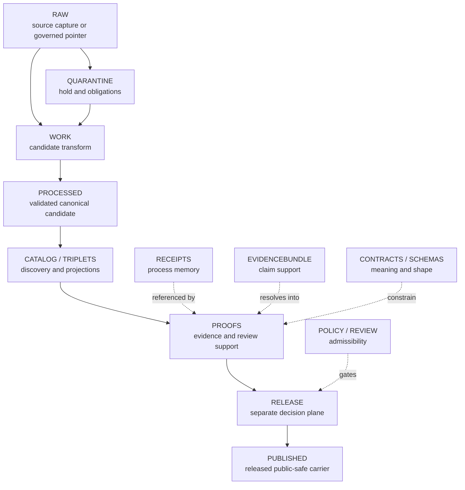

<!-- [KFM_META_BLOCK_V2]
doc_id: kfm://data/proofs/hydrology/readme
title: Hydrology Proofs README
type: data-lifecycle-readme; nested-directory-readme; proof-support-boundary
version: v0.2.0
status: repository-grounded draft; proof production, semantic closure, validation graduation, and release readiness remain held
owners:
  - "@bartytime4life — verified CODEOWNERS routing for /data/proofs/; routing is not review or approval"
  - "NEEDS VERIFICATION — data, proof, Hydrology, rights/sensitivity, public-safety, policy, release, correction/rollback, and independent-review stewardship"
created: 2026-06-25
updated: 2026-07-26
policy_label: public-review; no-direct-public-path; release-gated
intended_path: data/proofs/hydrology/README.md
owning_root: data/
lifecycle_area: proofs
evidence_snapshot:
  repository: bartytime4life/Kansas-Frontier-Matrix
  base_commit: b4102655f0f3e5665941150c93822a25375b547c
  baseline_blob: 015c9039de2ba3496b823d6b7fa203b3cd2da81e
  parent_proof_blob: 0d8b6e92d3b4b9ff3961d29c53ead497922a31cf
  hydrology_workflow_run: 30211934567
  method: complete baseline read plus pinned parent, doctrine, ADR, domain, contract, schema, policy, fixture, test, validator, workflow, source-registry, candidate, and published-lane evidence
related:
  - ../README.md
  - ../evidence_bundle/README.md
  - ../proof_pack/README.md
  - ../validation_report/README.md
  - ../citation_validation/README.md
  - ../review/README.md
  - ../../receipts/hydrology/README.md
  - ../../catalog/domain/hydrology/README.md
  - ../../registry/sources/hydrology/README.md
  - ../../published/hydrology/README.md
  - ../../../release/README.md
  - ../../../release/candidates/hydrology/README.md
  - ../../../docs/domains/hydrology/README.md
  - ../../../docs/domains/hydrology/PUBLICATION_POSTURE.md
  - ../../../docs/domains/hydrology/SOURCE_ROLE_MATRIX.md
  - ../../../docs/domains/hydrology/RELEASE_INDEX.md
  - ../../../contracts/domains/hydrology/README.md
  - ../../../contracts/domains/hydrology/evidence_bundle.md
  - ../../../schemas/contracts/v1/domains/hydrology/README.md
  - ../../../schemas/contracts/v1/domains/hydrology/evidence_bundle.schema.json
  - ../../../policy/domains/hydrology/README.md
  - ../../../fixtures/domains/hydrology/README.md
  - ../../../tests/domains/hydrology/README.md
  - ../../../tools/validators/domains/hydrology/README.md
  - ../../../.github/workflows/domain-hydrology.yml
  - ../../../.github/workflows/hydrology-proof-slice.yml
  - ../../../.github/CODEOWNERS
  - ../../../docs/doctrine/directory-rules.md
  - ../../../docs/doctrine/lifecycle-law.md
  - ../../../docs/doctrine/trust-membrane.md
  - ../../../docs/adr/ADR-0009-hydrology-is-the-first-proof-bearing-lane.md
  - ../../../docs/adr/ADR-0026-hydrology-source-spine-starts-with-wbd-huc12.md
  - ../../../docs/adr/ADR-0029-adopt-directory-governance-standard-v2.md
tags: [kfm, data, proofs, hydrology, evidence, validation, policy, release, rollback, huc12, wbd, nhdplus, usgs-water-data, nfhl, source-role]
notes:
  - "Same-path Markdown modernization only; no proof payload, source record, contract, schema, policy, validator, fixture, test, workflow, release object, route, emergency product, or publication state changed."
  - "Hydrology source roles remain separate: observations, hydrologic units, network identity, regulatory flood context, terrain derivatives, models, and released carriers cannot masquerade as one truth class."
  - "Implementation depth remains UNKNOWN beyond the pinned repository evidence and observed readiness checks; proof production, semantic EvidenceRef closure, CatalogMatrix closure, accepted validation, and release remain held."
  - "Directory Rules v2 and ADR-0029 remain proposed; the legacy architecture rules path is absent at the pinned head, and this README does not treat that deletion as adoption, supersession, or migration authority."
  - "A dynamic workflow badge is intentionally omitted because current Hydrology jobs include explicit semantic holds and an existing validation-readiness failure."
[/KFM_META_BLOCK_V2] -->

<a id="top"></a>

# Hydrology Proofs

> Bounded proof-support guidance for Hydrology claims and release candidates, with source role, identity, space, time, evidence, public safety, correction, and rollback kept inspectable.

[](#status-and-evidence-boundary)
[](../../../docs/doctrine/trust-membrane.md)
[](../README.md)
[](../../../docs/domains/hydrology/README.md)
[](#validation-and-held-automation)
[](#10-safety-policy-and-source-role-posture)

> [!IMPORTANT]
> **Status:** repository-grounded draft  
> **Review route:** `@bartytime4life` through [`.github/CODEOWNERS`](../../../.github/CODEOWNERS); routing is not accountable stewardship, independent review, or approval  
> **Path:** `data/proofs/hydrology/README.md`  
> **Evidence boundary:** [`main@b4102655f0f3e5665941150c93822a25375b547c`](https://github.com/bartytime4life/Kansas-Frontier-Matrix/tree/b4102655f0f3e5665941150c93822a25375b547c)  
> **Truth posture:** CONFIRMED repository evidence / PROPOSED proof-profile guidance / NEEDS VERIFICATION for accepted proof contracts, semantic closure, substantive tests, policy enforcement, release gates, public serving, correction propagation, and rollback drills.

> [!WARNING]
> This directory supports review. It is **not** a flood-warning feed, emergency alert, evacuation or rescue system, navigation aid, engineering determination, insurance determination, dam-safety directive, regulatory decision, source of current flood status, or publication authority. Use official authorities for operational and life-safety decisions.

---

<a id="mini-table-of-contents"></a>

## Quick jumps

| Section | Use it for |
|---|---|
| [Status and evidence boundary](#status-and-evidence-boundary) | What is confirmed, proposed, held, or unknown. |
| [1. Scope](#1-scope) | The claims and Hydrology surfaces this lane may support. |
| [2. Directory contract](#2-directory-contract) | Placement, authority, and the local responsibility boundary. |
| [3. What belongs here](#3-what-belongs-here) | Proposed proof-object families and packet requirements. |
| [4. What does not belong here](#4-what-does-not-belong-here) | Exclusions and the responsibility roots that own them. |
| [Inputs](#inputs) · [Outputs](#outputs) | What future proof support may reference and provide. |
| [5–6. Responsibilities and objects](#5-hydrology-proof-responsibilities) | Required closure questions and Hydrology object families. |
| [Lifecycle and trust relationship](#lifecycle-and-trust-relationship) | How proof support fits the lifecycle and decision plane. |
| [7. Naming and identity](#7-naming-and-identity) | Explicitly proposed naming and metadata guidance. |
| [8. Minimum closure checklist](#8-minimum-proof-closure-checklist) | Future packet-review requirements. |
| [9. Thin-slice pattern](#9-hydrology-thin-slice-proof-pattern) | The proposed deterministic no-network graduation slice. |
| [10. Safety and source roles](#10-safety-policy-and-source-role-posture) | Flood, regulatory, model, sensitivity, and cross-lane boundaries. |
| [Validation and held automation](#validation-and-held-automation) | Verified workflow behavior and explicit readiness holds. |
| [11. Validation expectations](#11-validation-expectations) | Current shape checks and future semantic burden. |
| [12. Promotion and rollback](#12-promotion-publication-and-rollback) | Release handoff, correction, withdrawal, and rollback. |
| [13. Maintenance checklist](#13-maintenance-checklist) | File-level review discipline. |
| [Review burden](#review-burden) · [Related folders](#related-folders) · [ADRs](#adrs) | Review and authority context. |
| [14. Open verification backlog](#14-open-verification-backlog) · [No-loss](#no-loss-ledger) | Remaining evidence gaps and document lineage. |

---

## Status and evidence boundary

| Surface | Current repository evidence | Boundary |
|---|---|---|
| README and path | This file exists at the pinned base as blob `015c9039de2ba3496b823d6b7fa203b3cd2da81e`, with stable document ID `kfm://data/proofs/hydrology/readme`. | File presence proves documentation only. |
| Parent proof contract | [`data/proofs/README.md`](../README.md) is a repository-grounded draft assigning evidence, validation, citation, review, integrity, and release-support responsibility to this root. | The parent explicitly does not create truth, policy permission, release, or publication. |
| Directory authority | The legacy `docs/architecture/directory-rules.md` body is absent at the pinned head; [Directory Rules v2](../../../docs/doctrine/directory-rules.md) is `PROPOSED_FOR_ADOPTION`, and [ADR-0029](../../../docs/adr/ADR-0029-adopt-directory-governance-standard-v2.md) is `proposed`. | No accepted replacement was verified. This README retains the existing path and does not infer adoption, supersession, migration, or deletion authority. |
| Hydrology decisions | [ADR-0009](../../../docs/adr/ADR-0009-hydrology-is-the-first-proof-bearing-lane.md) and [ADR-0026](../../../docs/adr/ADR-0026-hydrology-source-spine-starts-with-wbd-huc12.md) are both effectively `proposed`. | They define reviewable sequencing and graduation criteria; they do not make Hydrology proof-bearing or activate WBD HUC12. |
| Contracts and schemas | The [Hydrology contract lane](../../../contracts/domains/hydrology/README.md), an [EvidenceBundle contract](../../../contracts/domains/hydrology/evidence_bundle.md), a proposed [domain alias schema](../../../schemas/contracts/v1/domains/hydrology/evidence_bundle.schema.json), fixtures, and a JSON Schema wrapper exist. | Candidate shape is present; accepted semantic EvidenceRef-to-EvidenceBundle closure is not established. |
| Tests and validators | `test_hydrology_smoke.py::test_placeholder` is executable but vacuous; the dedicated EvidenceBundle closure test is documentation-only; a shape-validator wrapper exists. | No accepted substantive Hydrology validation or semantic closure suite is established. |
| Domain workflow | In [run `30211934567`](https://github.com/bartytime4life/Kansas-Frontier-Matrix/actions/runs/30211934567), `build-proof-hydrology` and `publish-dry-run-hydrology` succeeded while recording explicit holds; `validate-hydrology` failed on the placeholder smoke test. | Green held jobs are readiness evidence only. The failure is an existing graduation guard, not proof that a substantive suite ran. |
| Proof-slice workflow | [`hydrology-proof-slice.yml`](../../../.github/workflows/hydrology-proof-slice.yml) performs read-only, no-network-after-bootstrap readiness checks for proof production, EvidenceBundle closure, and CatalogMatrix closure. | All three jobs record `WORKFLOW_HOLD`; they do not build proof, resolve claims, admit sources, release, or publish. |
| Policy and source admission | The [Hydrology policy README](../../../policy/domains/hydrology/README.md) is a compact boundary scaffold; the [source registry](../../registry/sources/hydrology/README.md) retains proposed descriptors and unresolved topology. | Enforcement, source activation, rights closure, and admission remain unverified. |
| Release and published surfaces | A [candidate-review lane](../../../release/candidates/hydrology/README.md), [release index](../../../docs/domains/hydrology/RELEASE_INDEX.md), and [published Hydrology README](../../published/hydrology/README.md) exist. The observed domain job records no accepted release-dry-run command or candidate manifest contract. | Documentation and held checks do not prove a candidate, promotion decision, released carrier, deployment, or publication. |
| Ownership | CODEOWNERS routes `/data/proofs/` to `@bartytime4life`. | Accountable data, proof, Hydrology, public-safety, rights/sensitivity, policy, release, correction/rollback, and independent-review assignments remain `NEEDS VERIFICATION`. |
| Payloads and external stores | The observed proof-readiness job found no non-README file under this lane; the target and relevant workflow paths were unchanged by the subsequent Soil-only merge. | External/logical proof stores, writers, consumers, access controls, retention, and operational use remain `UNKNOWN`. |

Implementation depth remains UNKNOWN beyond these pinned files and observed checks. A current path, proposed decision, parsed fixture, schema wrapper, successful held job, commit, pull request, or merge is not proof-bearing graduation.

[Back to top](#top)

---

## 1. Scope

This directory is the Hydrology-domain lane under KFM's proof-support responsibility.

It may support review of claims and derived outputs involving watersheds, HUC12/WBD context, flowlines, NHD/NHDPlus identity, stream permanence, gauge and site observations, hydrographs, observed water conditions, groundwater/surface-water context, regulatory floodplain context, terrain-derived hydrology, wetland/riparian context, drought/flood hydrologic indicators, and public-safe Hydrology layer candidates.

A future proof object here should help answer:

1. Which source descriptors support this Hydrology object or derivative?
2. Is each source acting as observation, hydrologic-unit context, network identity, regulatory context, terrain derivative, model input/output, aggregate, candidate, or released carrier?
3. Which EvidenceBundle supports every consequential claim?
4. What geometry, CRS, topology, scale, resolution, snapping, conflation, and generalization rules apply?
5. What source, observed, valid, retrieval, release, stale, correction, and supersession times matter?
6. Are rights, terms, sensitivity, official-source referral, public-safety boundaries, policy, and review requirements satisfied?
7. Which validators actually ran, against which inputs, and what did their finite results prove?
8. Which release candidate or manifest references this proof support?
9. What correction, withdrawal, stale-state, invalidation, and rollback path exists?

### Safety boundary

KFM Hydrology outputs are evidence-backed context for mapping, history, review, planning, resilience, and explanation. They are not flood warnings, emergency alerts, evacuation instructions, rescue guidance, navigation guidance, dam-safety directives, engineering determinations, insurance determinations, or authoritative regulatory decisions.

Any proof support touching flood, drought, warning, advisory, or operational hydrologic material must keep official source authority, source role, issue time where applicable, valid time, observation time, retrieval time, release time, freshness/stale behavior, limitations, and official-source referral behavior visible.

### Truth posture

| Statement | Current status |
|---|---:|
| The exact README and directory path exist at the pinned base. | **CONFIRMED** |
| The parent proof README assigns a bounded proof-support role to `data/proofs/`. | **CONFIRMED repository contract** |
| Directory Rules v2 proposes `data/proofs/` as the proof-support home. | **PROPOSED; not adopted** |
| The proof families and packet fields below are the accepted Hydrology proof contract. | **PROPOSED / NEEDS VERIFICATION** |
| Hydrology contracts, schemas, fixtures, validator wrappers, tests, workflows, candidates, and published-lane docs exist. | **CONFIRMED configured surface; maturity varies** |
| Semantic evidence closure, a deterministic proof producer, accepted validation, CatalogMatrix closure, and release dry run are operational. | **HELD / not established** |
| Public Hydrology services, deployed consumers, operational alerts, and publication state exist. | **UNKNOWN; not asserted** |

[Back to top](#top)

---

## 2. Directory contract

`data/proofs/hydrology/` is an existing responsibility-rooted child lane, not a Hydrology topic bucket and not a second contract, schema, policy, source-registry, catalog, release, or publication authority.

At the pinned head, the legacy Directory Rules body has been deleted while its proposed successor and adoption ADR remain unaccepted. This same-path modernization therefore relies on the existing repository path, the parent proof contract, and the user's bounded review-branch instruction. It does not infer a new placement decision from deletion.

| Authority source | Verified state | Effect on this README |
|---|---|---|
| [Legacy Directory Rules v1.3.1 at the prior checkpoint](https://github.com/bartytime4life/Kansas-Frontier-Matrix/blob/b33687e072970ae12b36c9642ae1da09f900d1f2/docs/architecture/directory-rules.md) | Absent from current `main` after [`4977bca`](https://github.com/bartytime4life/Kansas-Frontier-Matrix/commit/4977bca73cb8bc6232f5a48c7768baf6f0a290c6). | Prior lineage remains inspectable; absence is not adoption, supersession, or completed migration. |
| [Directory Rules v2](../../../docs/doctrine/directory-rules.md) | `2.0.0-draft.1`; `PROPOSED_FOR_ADOPTION`. | Useful successor guidance only; it has no adoption or supersession effect here. |
| [ADR-0029](../../../docs/adr/ADR-0029-adopt-directory-governance-standard-v2.md) | `proposed`. | Does not adopt v2 or retroactively authorize the observed deletion. |
| [Parent proof README](../README.md) | Repository-grounded draft. | Defines the current proof-support boundary and anti-collapse rules. |

### Contract summary

| Field | Bounded result |
|---|---|
| Responsibility root | `data/` |
| Accountability lane | `proofs/` |
| Domain lane | Hydrology |
| Current tracked child | `README.md` |
| Direct public exposure | None by file path |
| Normal public path | Governed API and released public-safe carrier after evidence, policy, review, release, correction, and rollback closure |
| Inputs | EvidenceRefs, source descriptors, processed/catalog candidates, receipts, validation reports, policy/review context, and release candidates |
| Outputs | Proof support for review, Evidence Drawer, governed API, release, correction, withdrawal, and rollback |
| Mutability | Versioned and reviewable; proof instances should be immutable by identity/version where an accepted profile requires it |
| Retention | `NEEDS VERIFICATION` |
| Physical storage | Repository path is logical authority; external governed storage remains `UNKNOWN` |
| Forbidden shortcut | Direct UI, API, map, model, or agent use of this directory as public truth |

### Current bounded directory map

```text
data/proofs/hydrology/
└── README.md    # proof-support boundary; not a proof instance
```

The observed proof-readiness job found no other file in this directory. This bounded tree does not rule out external or future governed proof storage, and it does not authorize placeholder proof instances. If the proposed Directory Rules v2 is later accepted, its `DIR-DATA-005` rule would prohibit placeholder/scaffold instances in canonical trust-instance lanes.

[Back to top](#top)

---

## 3. What belongs here

Store only governed proof instances or proof-local sidecars that an accepted contract and schema permit and that can be independently inspected, validated, hashed, compared, referenced by a review/release decision, and used for correction or rollback review.

The families below preserve the baseline design, but they remain a **PROPOSED profile**. Their names do not prove that instances, producers, consumers, schemas, or accepted semantics exist.

| Proposed proof artifact | Review purpose | Admission boundary |
|---|---|---|
| `proofpack.<hydrology_object_id>.<run_id>.json` | Bundled proof closure for one Hydrology object, analytical summary, layer, or release candidate. | Must conform to an accepted ProofPack/proof profile; placement alone is not closure. |
| `validation-proof.<run_id>.json` | Schema, geometry, CRS, topology, temporal, freshness, source-reference, and source-role results. | Must identify the exact validator, version, inputs, findings, and scope. |
| `policy-proof.<run_id>.json` | Rights, sensitivity, source role, access, release state, and public-safety checks. | A referenced policy result is not release approval. |
| `identity-permanence-proof.<object_id>.json` | Hydrologic identity, crosswalk, split/merge/retired state, and deterministic continuity. | Ambiguous identity must remain visible and fail closed. |
| `huc12-context-proof.<huc12_id>.<run_id>.json` | Watershed identity, WBD/source version, geometry fingerprint, and time support. | Boundary context is not observed flow or flood status. |
| `gauge-observation-proof.<site_id>.<run_id>.json` | Site identity, observation time, retrieval time, unit, datum, qualifier, source role, and evidence. | Observations remain distinct from gauge metadata and released interpretation. |
| `nfhl-source-role-proof.<artifact_id>.json` | NFHL/regulatory flood context is not mislabeled as observed flood, current status, or warning. | Role collapse is denied. |
| `terrain-derivation-proof.<artifact_id>.json` | Terrain-derived stream, basin, wetness, slope, or flow-accumulation method, DEM source, resolution, and uncertainty. | A derivative is not direct observation. |
| `temporal-support-proof.<object_id>.json` | Source, observed, valid, retrieval, release, stale, correction, and supersession times remain distinct. | Required only where the profile makes those times material. |
| `evidence-closure-proof.<evidence_bundle_id>.json` | Consequential Hydrology claims resolve to admissible evidence support. | Current repository evidence proves candidate shape, not semantic closure. |
| `catalog-closure-proof.<catalog_record_id>.json` | Catalog, provenance, citation, digest, source-role, and release-candidate agreement. | Catalog metadata is not canonical claim or release authority. |
| `public-safe-geometry-proof.<artifact_id>.json` | Generalization, suppression, precision reduction, or withheld infrastructure/sensitive geometry. | Exact restricted geometry must not be copied into public-review proof content. |
| `public-safety-boundary-proof.<artifact_id>.json` | The artifact cannot be represented as a KFM-issued alert, warning, rescue instruction, or emergency directive. | Disclaimer text alone is not enforcement. |
| `rollback-proof.<release_candidate_id>.json` | A rollback target is defined and sufficient before release review. | Release and rollback authority remain under `release/`. |

### Minimum proof-packet profile

Any future packet should be governed by accepted semantic and machine profiles. Until then, this list is design guidance only:

- stable proof identity, version, proof family, claim/artifact scope, object family, and candidate or release reference;
- source-descriptor references, source roles, permitted/prohibited claim scope, rights, sensitivity, citation, and source version;
- HUC/reach/site/layer identity, geometry fingerprint, CRS, scale, topology, conflation/generalization, and ambiguity state where relevant;
- distinct source, observed, valid, retrieval, release, stale, correction, and supersession times where material;
- EvidenceRefs resolving to EvidenceBundles, with limitations and citation-validation state;
- content/spec/run identity plus receipt and ValidationReport references;
- policy, review, public-safety, public-geometry, and public-field posture;
- catalog, release, correction, withdrawal, invalidation, and rollback dependencies;
- a finite result and reason codes from the governing surface-specific contract.

[Back to top](#top)

---

## 4. What does not belong here

| Excluded material | Correct home or action | Why |
|---|---|---|
| Raw USGS, WBD, NHD/NHDPlus, NFHL, NOAA/NWS, state, local, sensor, gauge, raster, or source payloads | Governed RAW lane or approved logical object storage | Proof support references source material; it does not become the source store. |
| Live warning feeds, alert streams, emergency dashboards, or operational water-condition services | Official source/runtime surfaces under separately governed authority | Proof support may snapshot context; it is never a live alerting service. |
| Work-in-progress transforms or failed normalization | `data/work/` or `data/quarantine/` | Candidate work and remediation obligations must stay visible. |
| Validated source-derived Hydrology records | `data/processed/` | Processed records are not proof records. |
| STAC, DCAT, PROV, or domain catalog records | `data/catalog/` | Catalog projections aid discovery and agreement; they are not proof or release authority. |
| Runtime/process receipts | [`data/receipts/hydrology/`](../../receipts/hydrology/README.md) | Receipts record what ran; they do not prove a claim or approve release by themselves. |
| Candidate dossiers | [`release/candidates/hydrology/`](../../../release/candidates/hydrology/README.md) | Candidate review packets belong to the release decision plane. |
| ReleaseManifest, promotion decision, correction/withdrawal notice, or RollbackCard | [`release/`](../../../release/README.md) | Release, correction, withdrawal, and rollback authority stays separate. |
| Public PMTiles, GeoParquet, GeoJSON, COG, CSV, report, or API payload | [`data/published/hydrology/`](../../published/hydrology/README.md) after governed release | Published carriers are downstream outputs, not proof. |
| Policy rules or decisions authored as files here | [`policy/`](../../../policy/README.md) and accepted decision records | Proof support may reference policy; it does not define policy. |
| Semantic contracts or machine schemas | [`contracts/domains/hydrology/`](../../../contracts/domains/hydrology/README.md) and [`schemas/contracts/v1/domains/hydrology/`](../../../schemas/contracts/v1/domains/hydrology/README.md) | Meaning and shape remain separate authorities. |
| Tests or fixtures | [`tests/domains/hydrology/`](../../../tests/domains/hydrology/README.md) and [`fixtures/domains/hydrology/`](../../../fixtures/domains/hydrology/README.md) | Synthetic examples and expected failures are not proof instances. |
| Model, pipeline, notebook, or validator code | `packages/`, `pipelines/`, or [`tools/validators/domains/hydrology/`](../../../tools/validators/domains/hydrology/README.md) | Executable logic must not be hidden inside proof data. |
| Credentials, private endpoints, unsafe logs, exact restricted geometry, or harmful infrastructure detail | Approved restricted systems; otherwise redact, generalize, quarantine, or deny | A proof lane must not become an exposure channel. |
| Maps, graphs, indexes, screenshots, dashboards, tiles, AI text, or workflow badges presented as sovereign truth | Governed evidence and release resolution, or abstain | Derived surfaces do not replace evidence or decision authority. |

[Back to top](#top)

---

## Inputs

Future Hydrology proof support may reference:

- admitted source descriptors and immutable source/payload identity;
- processed Hydrology objects, catalog/triplet projections, and release candidates;
- EvidenceRefs and EvidenceBundles;
- run, transform, validation, policy, review, redaction/generalization, correction, and rollback receipts or records;
- contracts, schemas, validator profiles, fixtures, tests, and tool/spec versions;
- source-role, rights, sensitivity, spatial, temporal, public-safety, and official-source-referral decisions.

Each reference should carry stable identity and digest/version information appropriate to its owning contract. A locator or filename is not authority.

## Outputs

Future outputs may provide proof support for domain review, citation validation, Evidence Drawer payloads, governed API responses, catalog agreement, release decisions, correction, withdrawal, invalidation, and rollback.

This lane must not emit a release decision, mutate a public alias, deploy a carrier, publish a map/API/report, issue an operational warning, or silently revise prior evidence.

[Back to top](#top)

---

## 5. Hydrology proof responsibilities

Before a Hydrology artifact can support a public or semi-public claim, its proof support should answer:

1. **Source support:** Which source descriptors and immutable source versions support the object or derivative?
2. **Source role:** Is each basis observed, regulatory, modeled, aggregate, administrative, candidate, or synthetic/representational, and what may it prove?
3. **Evidence closure:** Which EvidenceBundle supports each consequential claim, and what limitations remain?
4. **Spatial support:** What geometry, CRS, topology, scale, resolution, snapping, conflation, uncertainty, and generalization apply?
5. **Temporal support:** What source, observed, valid, retrieval, release, freshness, stale, correction, and supersession times matter?
6. **Policy support:** Are rights, terms, sensitivity, access, official-source referral, public-safety, and review requirements satisfied?
7. **Validation support:** Which exact validators ran, against which versions and fixtures, and what did each result prove or leave unverified?
8. **Release support:** Which candidate, proof pack, catalog closure, promotion decision, or release manifest references the proof?
9. **Correction support:** What stale-state, correction, withdrawal, invalidation, supersession, and rollback path exists?

A future proof object should be held, denied, quarantined, or rejected under its governing profile when it cannot identify the source, evidence, policy, validation, review, release dependency, and rollback context it is intended to support.

[Back to top](#top)

---

## 6. Expected object families

Hydrology proof support may reference—but never replace—the following baseline object families:

| Hydrology object family | Proof concern |
|---|---|
| `WatershedUnit` / `HUC12` | Unit identity, WBD/boundary source, source version, geometry fingerprint, and valid/source/retrieval time. |
| `Flowline` / `Reach` | Stable identifier, crosswalk, exact/split/merge/retired/ambiguous state, conflation, topology, permanence, and source version. |
| `HydroSite` / `GaugeSite` | Site identity, station metadata, datum/unit handling, relocation, decommissioning, and registry/observation separation. |
| `WaterObservation` | Observed time, parameter, unit, method, qualifier/quality flag, no-data state, retrieval time, and evidence support. |
| `Hydrograph` | Time-series window, aggregation/model method, missing data, unit conversion, source role, uncertainty, and observed-versus-modeled flag. |
| `NFHLZone` / `RegulatoryFloodContext` | Regulatory role, effective date, zone semantics, and explicit separation from observed/current flood status. |
| `FloodEventObservation` | Event source, observed/valid time, boundary uncertainty, evidence lineage, and relation to official reports. |
| `DroughtHydrologyIndicator` | Indicator method, aggregation window, source role, uncertainty, freshness, and stale behavior. |
| `TerrainDerivedHydrology` | DEM source, resolution, flow-routing method, sinks/breaches, uncertainty, and derivative warning. |
| `WetlandRiparianContext` | Source vocabulary, relation to Habitat/Soil lanes, geometry generalization, and sensitivity review. |
| `HydrologyLayerManifest` | Layer identity, source roles, evidence links, public-safe geometry, release reference, correction path, and rollback target. |
| `EvidenceDrawerPayload` | Policy-filtered EvidenceBundle projection, citation status, source role, freshness, limitations, correction state, and finite response. |

Current Hydrology contracts and schemas use additional or narrower names, including `HUCUnit`, `FlowObservation`, `GaugeSite`, `NFHLZone`, and domain-layer/identity profiles. The table preserves the baseline guidance; accepted contracts and schemas—not this README—own final names and semantics.

When proof support references Hazards, Soil, Agriculture, Habitat, Fauna, Flora, Settlements/Infrastructure, Geology, or People/DNA/Land evidence, it must preserve the owning lane's source role, sensitivity, evidence, policy, and release state rather than absorb those claims into Hydrology authority.

[Back to top](#top)

---

## Lifecycle and trust relationship



Proof support is downstream of source and candidate work and upstream of a separate release decision. It may reference receipts, EvidenceBundles, contracts, schemas, policy, and review, but it does not absorb their authority or publish by placement.

[Back to top](#top)

---

## 7. Naming and identity

The baseline pattern is **PROPOSED** until an accepted proof contract, schema, registry, and collision policy define it:

```text
<proof_family>.<domain>.<stable_object_or_candidate_id>.<run_id>.json
```

Inherited illustrative examples—none are asserted to exist:

```text
proofpack.hydrology.huc12_102600060305_demo.run_20260625T000000Z.json
validation-proof.hydrology.gauge_usgs_06892350_demo.run_20260625T000000Z.json
identity-permanence-proof.hydrology.flowline_demo_comid_123456.run_20260625T000000Z.json
nfhl-source-role-proof.hydrology.nfhl_zone_demo.run_20260625T000000Z.json
terrain-derivation-proof.hydrology.flow_accumulation_demo.run_20260625T000000Z.json
catalog-closure-proof.hydrology.layer_candidate_huc12_public_demo.run_20260625T000000Z.json
public-safety-boundary-proof.hydrology.flood_context_demo.run_20260625T000000Z.json
```

<a id="identity-guidance"></a>

### Candidate identity fields

These fields remain **PROPOSED** and must not be implemented as proof instances until accepted semantic and machine profiles exist:

- `proof_id`, `proof_family`, `domain`, `object_family`, and `object_id` or `release_candidate_id`;
- `run_id`, `schema_version`, `generated_at`, `content_hash`, and `input_hashes`;
- `source_descriptor_ids`, `source_roles`, `permitted_claim_scope`, and source/version identity;
- `evidence_bundle_ids`, `validation_report_ids`, receipt references, and citation-validation state;
- `policy_decision_ids`, review-record references, catalog-record references, release references, and rollback references;
- geometry fingerprint, CRS, scale, topology/conflation/generalization context, and public-geometry posture where material;
- source, observed, valid, retrieval, release, freshness, stale, correction, and supersession time where material;
- limitations, sensitivity, rights, public-safety posture, finite result, and reason codes.

### Deterministic identity inputs

Identity should consider:

- source ID, version, authority role, and admitted source role;
- hydrologic identifier such as HUC, reach/COMID, site number, flood-zone ID, layer ID, or release-candidate ID;
- geometry fingerprint, CRS, scale, and crosswalk/conflation state when geometry matters;
- canonicalized payload hash, schema version, transform version, validator version, policy version, and tool/spec/run identity;
- material temporal dimensions;
- correction/supersession lineage.

Do not use display names, filenames alone, mutable URLs, or inferred reach/site matches as sovereign identity.

[Back to top](#top)

---

## 8. Minimum proof closure checklist

Before a Hydrology proof packet can support release review:

- [ ] An accepted semantic contract and machine schema govern the packet.
- [ ] The packet declares proof family, object family, claim/artifact scope, domain lane, source roles, and intended public surface.
- [ ] Every consequential claim resolves to at least one admissible EvidenceBundle or records the governing finite negative result.
- [ ] Source descriptors identify role, permitted/prohibited claim scope, rights, retrieval method, citation, cadence/version, freshness, and sensitivity.
- [ ] Hydrology source roles are not collapsed.
- [ ] NFHL/regulatory flood context is never labeled as observed flood, current flood status, forecast, or emergency warning.
- [ ] Observed-water records distinguish observation time from retrieval, release, stale, and correction time.
- [ ] Watershed, reach, and site identity include source version and deterministic identity inputs; ambiguity remains explicit.
- [ ] Geometry, CRS, precision, scale, topology, conflation, uncertainty, and generalization are recorded where relevant.
- [ ] Results use the accepted vocabulary of the owning surface. Public governed-answer surfaces use `ANSWER | ABSTAIN | DENY | ERROR`; policy, source, validation, review, and release surfaces may use different accepted enums such as `ALLOW`, `HOLD`, `RESTRICT`, `FAIL`, or `NEEDS_REVIEW`.
- [ ] Policy references cover rights, sensitivity, access, stale state, official-source referral, public safety, and restricted geometry where applicable.
- [ ] Catalog/provenance/citation agreement exists or the packet remains held from release.
- [ ] Content, input, spec, schema, policy, and tool/run identities are recorded as required.
- [ ] A release candidate references the proof support, or the packet is explicitly pre-release and non-public.
- [ ] Correction, withdrawal, invalidation, and rollback dependencies exist before public release.

> [!NOTE]
> Outcome vocabularies are contract-specific. This README does not invent one universal enum or translate a schema pass into `ANSWER`, a workflow success into `ALLOW`, or a merged PR into `PUBLISHED`.

[Back to top](#top)

---

## 9. Hydrology thin-slice proof pattern

A credible first slice remains fixture-first, deterministic, public-safe, and no-network during execution.

### Current graduation evidence

| Slice element | Current evidence | Graduation effect |
|---|---|---|
| WBD/HUC12 sequencing | ADR-0026 and source descriptors exist but remain proposed/placeholder. | No admitted source or accepted source-spine decision. |
| EvidenceBundle shape | Domain alias schema, common schema reference, valid/invalid fixtures, and a wrapper validator exist. | Candidate JSON shape only; semantic claim resolution remains held. |
| Domain tests | Smoke test is `assert True`; EvidenceBundle closure test is documentation-only. | No substantive accepted suite. |
| Proof producer | Pipeline files and Make target remain exact TODO/greenfield placeholders; proof-readiness job reports no payloads. | `WORKFLOW_HOLD`. |
| Catalog closure | CatalogMatrix files and readiness checks exist; producer/validator remain held. | `WORKFLOW_HOLD`. |
| Candidate and release dry run | Candidate-review documentation exists; no accepted Hydrology command or candidate manifest contract. | `WORKFLOW_HOLD`. |
| Public operation | Not established by the inspected repository evidence. | `UNKNOWN`; no publication claim. |

### Proposed slice

```text
one public-safe HUC12 fixture
+ one normalized Hydrology observation fixture
+ one regulatory flood-context fixture
+ one terrain or flowline identity fixture
+ one EvidenceBundle
+ one validation result
+ one policy decision
+ one catalog-closure result
+ one layer-manifest candidate
+ one Evidence Drawer payload fixture
+ one release dry-run
+ one correction and rollback proof
```

<a id="example-folder-sketch"></a>

<details>
<summary>Inherited illustrative future directory sketch</summary>

```text
data/proofs/hydrology/
├── README.md
├── huc12_demo/
│   ├── proofpack.hydrology.huc12_102600060305_demo.run_20260625T000000Z.json
│   ├── validation-proof.hydrology.huc12_102600060305_demo.run_20260625T000000Z.json
│   └── catalog-closure-proof.hydrology.layer_candidate_huc12_public_demo.run_20260625T000000Z.json
├── gauge_demo/
│   ├── proofpack.hydrology.gauge_usgs_06892350_demo.run_20260625T000000Z.json
│   └── temporal-support-proof.hydrology.gauge_usgs_06892350_demo.run_20260625T000000Z.json
├── nfhl_demo/
│   ├── nfhl-source-role-proof.hydrology.nfhl_zone_demo.run_20260625T000000Z.json
│   └── public-safety-boundary-proof.hydrology.flood_context_demo.run_20260625T000000Z.json
└── release_candidate_demo/
    ├── evidence-closure-proof.hydrology.layer_candidate_huc12_public_demo.run_20260625T000000Z.json
    └── rollback-proof.hydrology.layer_candidate_huc12_public_demo.run_20260625T000000Z.json
```

This sketch is design lineage only. Do not create these paths or instances until exact contracts, schemas, fixture IDs, naming/collision rules, producer commands, access/retention controls, and release relationships are accepted.

</details>

Proof-bearing graduation requires one documented command that runs from a clean checkout without live endpoints, mutable services, production data, ambient credentials, or a hard-coded approval fallback; emits deterministic artifacts and finite results; proves semantic evidence/catalog/policy/release closure; and demonstrates correction plus rollback without publishing.

[Back to top](#top)

---

## 10. Safety, policy, and source-role posture

Hydrology proof review must fail closed when source role, time, identity, evidence, rights, sensitivity, public safety, or rollback support is insufficient.

| Condition | Bounded result | Reason |
|---|---:|---|
| NFHL/regulatory flood context is described as observed flood or current flood status. | `DENY` | Regulatory context and observed events are different roles. |
| KFM output is framed as a flood warning, emergency alert, evacuation instruction, or rescue guidance. | `DENY` | KFM is not a life-safety authority. |
| Source rights, terms, attribution, or redistribution status are unclear. | `HOLD` / `DENY` under the governing profile | Public release requires rights support. |
| Source role is missing, conflicting, or outside permitted claim scope. | `HOLD`, `ABSTAIN`, `DENY`, or `QUARANTINE` under the owning contract | Hydrology depends on source-role separation. |
| Observation, valid, retrieval, release, or stale time is missing where material. | `HOLD` / `ABSTAIN` | Time-aware support is required. |
| HUC, reach, gauge, or site identity cannot be resolved. | `HOLD`, `ABSTAIN`, or `DENY` | Identity ambiguity must not be guessed away. |
| Geometry is overprecise for infrastructure, private-property, ecological, cultural, or security-relevant context. | Hold, restrict, generalize, redact, quarantine, or deny | Public-safe geometry must be proven. |
| EvidenceRef cannot resolve to an admissible EvidenceBundle. | `ABSTAIN` / `DENY` | Cite-or-abstain is the default truth posture. |
| Release candidate has no correction path or rollback target. | `HOLD` / `DENY` | Public release must be correctable and reversible. |

### Source-role anti-collapse rules

The Hydrology domain guidance uses seven role labels—`observed`, `regulatory`, `modeled`, `aggregate`, `administrative`, `candidate`, and `synthetic`/representational—but exact machine fields and enforcement remain governed by accepted contracts, schemas, registry, and policy.

The following distinctions are non-negotiable:

- `WatershedUnit` is not a water observation.
- `Flowline` or `ReachIdentity` is not proof of current water presence.
- `NFHLZone` is regulatory context, not an observed flood event, forecast, or live warning.
- `TerrainDerivedHydrology` is a method output, not direct observation.
- `Hydrograph` must preserve whether its series is observed, aggregated, or modeled.
- A `ModelOutput` carries method, assumptions, uncertainty, time scope, and limits.
- An aggregate is not a per-site observation.
- An administrative roster is not an observed event.
- A candidate is not a released or public object.
- A `PublishedLayer` is a released carrier, not sovereign truth.
- An AI/Focus Mode answer is interpretive and remains downstream of released evidence and policy.

### Cross-lane guard

| Join | Risk | Required posture |
|---|---|---|
| Hydrology × Hazards | NFHL regulatory context becomes observed-event or current-warning truth. | Keep roles and time scopes separate; deny KFM-issued life-safety authority. |
| Hydrology × Soil/Agriculture | HUC aggregate or observed flow becomes per-place soil/crop/yield certainty. | Preserve geometry scope and model/aggregation derivation. |
| Hydrology × Settlements/Infrastructure | Reach proximity exposes exact dam, levee, intake, or private-property detail. | Apply sensitivity review and public-safe generalization. |
| Hydrology × Habitat/Flora/Fauna | Watershed join reveals sensitive occurrence locations. | The ecology lane's sensitivity and geoprivacy decision governs. |
| Hydrology × People/DNA/Land | Well, right, owner, parcel, or household relation becomes living-person/title truth. | Deny unsupported inference; preserve the owning lane and legal/rights limits. |

[Back to top](#top)

---

## Validation and held automation

Two current workflows expose Hydrology readiness without manufacturing proof or release state.

### Domain readiness workflow

The [latest inspected `domain-hydrology` run](https://github.com/bartytime4life/Kansas-Frontier-Matrix/actions/runs/30211934567) had these job results:

| Job | Observed result | What it means |
|---|---|---|
| `validate-hydrology` | **Failure** | The guard found `tests/domains/hydrology/test_hydrology_smoke.py::test_placeholder`. This is an existing readiness/graduation failure, not a substantive validation run. |
| `build-proof-hydrology` | **Success with explicit hold** | Required boundaries were present, no non-README proof artifact surfaced, no accepted proof target/producer was found, and the workflow recorded `WORKFLOW_HOLD: no accepted Hydrology proof producer or deterministic proof command`. |
| `publish-dry-run-hydrology` | **Success with explicit hold** | Required release boundaries were present, no machine candidate surfaced, no accepted Hydrology dry-run target was found, and the workflow recorded `WORKFLOW_HOLD: no accepted Hydrology release dry-run command or candidate manifest contract`. |

### Proof-slice workflow

[`hydrology-proof-slice.yml`](../../../.github/workflows/hydrology-proof-slice.yml) is path-filtered to Hydrology proof/contract/schema/fixture/test/catalog surfaces and preserves three job IDs:

| Job | Current source behavior | Recorded boundary |
|---|---|---|
| `build-proof-slice` | Confirms the proof lane has no payloads, the pipeline and E2E test remain exact placeholders, the Make target remains TODO-only, and the promotion stub is not executed. | `WORKFLOW_SKIPPED_EXPLICIT` + `WORKFLOW_HOLD` |
| `verify-evidence-bundle-closure` | Parses the alias schema/fixtures, checks the wrapper and documentation-only test, and stops short of semantic resolution. | `WORKFLOW_SKIPPED_EXPLICIT` + `WORKFLOW_HOLD` |
| `verify-catalog-matrix` | Checks catalog boundaries and detects placeholder producers/validators or surfaced payloads. | `WORKFLOW_SKIPPED_EXPLICIT` + `WORKFLOW_HOLD` |

> [!CAUTION]
> Success means only that the reviewed hold/scaffold shape remained intact. It does not establish source admission, HUC/reach/gauge identity, observation accuracy, units, freshness, NFHL interpretation, public-safe geometry, EvidenceBundle closure, CatalogMatrix agreement, policy approval, proof production, release readiness, emergency authority, deployment, or publication.

A dynamic workflow badge is intentionally omitted because green held jobs would obscure their semantic state. The static proof-production badge links to this evidence instead.

[Back to top](#top)

---

## 11. Validation expectations

Future Hydrology proof validation should cover:

| Validator class | Required checks | Current evidence |
|---|---|---|
| Schema validation | Required fields, enums, closed-object behavior, version pins, canonical JSON, and accepted aliases. | EvidenceBundle alias/wrapper provides candidate shape; broader maturity varies. |
| Evidence validation | EvidenceRef resolution, EvidenceBundle admissibility/completeness, limitations, and citation closure. | **HELD**; dedicated closure test is documentation-only. |
| Source-role validation | Observed/regulatory/modeled/aggregate/administrative/candidate/representational separation and permitted-claim checks. | Documentation-rich; executable enforcement not established. |
| Identity validation | HUC/site/reach IDs, WBD/NHDPlus/source version, crosswalk exact/split/merge/retired/ambiguous behavior, and duplicate handling. | Accepted end-to-end coverage not established. |
| Temporal validation | Source, observed, valid, retrieval, release, freshness, stale, correction, and expiry semantics. | Accepted end-to-end coverage not established. |
| Spatial validation | Geometry validity, CRS, topology, scale, snapping/conflation, precision, uncertainty, and generalization. | Accepted proof-level coverage not established. |
| Policy validation | Rights, terms, attribution, sensitivity, access, public-safety boundary, official-source referral, and restricted geometry. | Hydrology policy README is a boundary scaffold; enforcement not established. |
| Catalog closure validation | STAC/DCAT/PROV/digest/citation/source-role/release agreement where applicable. | **HELD** by proof-slice workflow. |
| Release validation | Candidate identity, immutable artifact reference, ReleaseManifest/proof linkage, independent decision, correction, withdrawal, and rollback. | **HELD**; no accepted domain dry-run command or candidate manifest contract. |

Validator execution receipts normally belong under [`data/receipts/hydrology/`](../../receipts/hydrology/README.md). A result belongs here only when an accepted proof profile defines it as proof support. A report proves its declared checks and inputs—not universal Hydrology correctness, source authority, life-safety suitability, or publication.

### Graduation tests

An accepted suite should include deterministic positive and negative fixtures for:

- missing or conflicting source role;
- NFHL used as observed event/current flood/warning;
- unresolved EvidenceRef;
- missing rights or sensitivity decision;
- ambiguous/retired/split/merge reach identity;
- HUC/WBD/source-version drift;
- gauge parameter/unit/datum/qualifier/no-data mismatch;
- missing or stale time support;
- modeled/aggregate/administrative content relabeled as observation;
- restricted infrastructure/private-property/ecology location exposure;
- direct RAW/WORK/QUARANTINE/internal-store public access;
- missing correction, withdrawal, invalidation, or rollback target;
- hard-coded or unreviewed promotion approval.

[Back to top](#top)

---

## 12. Promotion, publication, and rollback

A proof object or README in this directory does not promote or publish a Hydrology artifact.

Public release requires support appropriate to the candidate's significance, including:

1. admitted source descriptors and rights/terms/attribution posture;
2. processed Hydrology objects or immutable candidate artifacts;
3. resolvable EvidenceBundle support for consequential claims;
4. substantive validation reports and proof closure;
5. policy decisions, including public-safety and sensitivity posture;
6. catalog/provenance/citation/digest agreement where applicable;
7. review records and separation of duties where material;
8. release manifest and promotion decision;
9. public-safe carrier generation and governed public-interface validation;
10. visible freshness/stale-state behavior, correction/withdrawal path, invalidation plan, and rollback target.

### Release handoff

Hydrology candidates should reference proof support by stable ID, version, and digest. [`release/candidates/hydrology/`](../../../release/candidates/hydrology/README.md) owns the pre-publication dossier; [`release/`](../../../release/README.md) owns final promotion, correction, withdrawal, and rollback decisions; [`data/published/hydrology/`](../../published/hydrology/README.md) owns released public-safe carriers.

A branch, commit, pull request, merge, workflow success, tag, GitHub release, deployed service, or file move is not KFM publication.

### Rollback expectations

Every public Hydrology carrier should have enough traceability to answer:

- Which proof objects and EvidenceBundles supported the release?
- Which source, schema, policy, validator, tool/spec, and input versions were used?
- Which map, API, report, cache, graph, index, Evidence Drawer, and AI surfaces depend on it?
- Which aliases, caches, tiles, indexes, and derivatives must be invalidated?
- Which prior release or safe empty state can be restored?
- Which correction or withdrawal notice should be shown?
- Which receipt proves that rollback or forward correction actually ran?

[Back to top](#top)

---

## Correction, withdrawal, and invalidation

When a Hydrology claim, source role, identity mapping, observation, model, regulatory context, rights decision, sensitivity posture, proof packet, or released carrier is stale or wrong:

1. identify the affected object, evidence, proof, candidate/release, and downstream consumers;
2. hold or withdraw unsafe reliance through the owning policy/release surfaces;
3. preserve prior proof and release lineage rather than silently overwriting it;
4. issue the appropriate correction or withdrawal record under `release/`;
5. record executed process memory under the accepted receipt lane;
6. invalidate or mark stale every governed API, map, report, tile/cache, graph/index, Evidence Drawer, and AI dependency that relied on the affected release;
7. revalidate a corrected candidate or restore a prior safe release through reviewed rollback.

No operational Hydrology correction propagation, public invalidation, withdrawal execution, or rollback drill was verified in this review. Documentation of a path is not evidence that it ran.

[Back to top](#top)

---

## 13. Maintenance checklist

Use this checklist when adding or reviewing Hydrology proof files:

- [ ] The file belongs in the proof lane because it is governed proof support, not merely Hydrology-related.
- [ ] An accepted contract and schema govern the instance; it is not labeled placeholder, scaffold, template, or merely proposed.
- [ ] The file is structured, deterministic where practical, versioned, hashable, and collision-safe.
- [ ] Identity includes proof family, domain, stable object/candidate identity, and run/version context required by the profile.
- [ ] Source roles and permitted/prohibited claim scopes are explicit and not collapsed.
- [ ] NFHL/regulatory context is not treated as observed flood, current status, forecast, or warning.
- [ ] HUC/reach/gauge/site identity and source versions are explicit; ambiguity is not guessed away.
- [ ] Material time fields, units, datum, qualifiers, no-data state, method, uncertainty, and limitations remain visible.
- [ ] EvidenceBundle references resolve or the packet records the governing finite negative result.
- [ ] Policy and validation references identify exact versions, scope, inputs, findings, and reasons.
- [ ] Sensitive geometry, infrastructure, private-property, ecology, cultural, and living-person implications are reviewed.
- [ ] Public-safety boundary and official-source referral are present where needed.
- [ ] Catalog, candidate, release, correction, withdrawal, invalidation, and rollback references are present when relevant.
- [ ] No raw payloads, work files, receipts, policies, schemas, fixtures, tests, notebooks, executable code, release decisions, or published carriers were placed here.
- [ ] The diff does not expose credentials, private endpoints, harmful precision, or restricted material.

[Back to top](#top)

---

## Review burden

| Change class | Minimum review burden |
|---|---|
| README clarification with no changed authority | Proof/data and Hydrology-domain review; link, workflow-sentinel, and no-loss validation. |
| Proof contract, schema, validator, fixture, test, or producer | Contract/schema, proof, validation, Hydrology, source-role, public-safety, and independent negative-case review. |
| Source, rights, sensitivity, spatial precision, time, or cross-domain change | Source, rights/sensitivity, policy, owning-domain, public-safety, and independent review. |
| Candidate, release, correction, withdrawal, invalidation, or rollback change | Proof, policy, release, correction/rollback, public-surface, security/safety, and independent approval as materiality requires. |

CODEOWNERS routing is not a StewardshipAssignment, ReviewRecord, PolicyDecision, source-admission decision, release approval, emergency authority, or independent approval.

## Related folders

- Parent proof contract: [`data/proofs/`](../README.md)
- Proof families: [`evidence_bundle/`](../evidence_bundle/README.md) · [`proof_pack/`](../proof_pack/README.md) · [`validation_report/`](../validation_report/README.md) · [`citation_validation/`](../citation_validation/README.md) · [`review/`](../review/README.md)
- Hydrology trust support: [`receipts/hydrology/`](../../receipts/hydrology/README.md) · [`catalog/domain/hydrology/`](../../catalog/domain/hydrology/README.md) · [`registry/sources/hydrology/`](../../registry/sources/hydrology/README.md)
- Downstream carrier boundary: [`published/hydrology/`](../../published/hydrology/README.md)
- Meaning and shape: [`contracts/domains/hydrology/`](../../../contracts/domains/hydrology/README.md) · [`EvidenceBundle contract`](../../../contracts/domains/hydrology/evidence_bundle.md) · [`schemas/contracts/v1/domains/hydrology/`](../../../schemas/contracts/v1/domains/hydrology/README.md)
- Admissibility and verification: [`policy/domains/hydrology/`](../../../policy/domains/hydrology/README.md) · [`fixtures/domains/hydrology/`](../../../fixtures/domains/hydrology/README.md) · [`tests/domains/hydrology/`](../../../tests/domains/hydrology/README.md) · [`tools/validators/domains/hydrology/`](../../../tools/validators/domains/hydrology/README.md)
- Release: [`release/candidates/hydrology/`](../../../release/candidates/hydrology/README.md) · [`release/`](../../../release/README.md)
- Domain context: [Hydrology README](../../../docs/domains/hydrology/README.md) · [Publication posture](../../../docs/domains/hydrology/PUBLICATION_POSTURE.md) · [Source-role matrix](../../../docs/domains/hydrology/SOURCE_ROLE_MATRIX.md) · [Release index](../../../docs/domains/hydrology/RELEASE_INDEX.md)
- Automation: [`domain-hydrology.yml`](../../../.github/workflows/domain-hydrology.yml) · [`hydrology-proof-slice.yml`](../../../.github/workflows/hydrology-proof-slice.yml)

## ADRs

| Record | Current status | Relevance |
|---|---|---|
| [ADR-0009](../../../docs/adr/ADR-0009-hydrology-is-the-first-proof-bearing-lane.md) | Proposed | Defines first-proof sequencing and graduation burden; does not declare Hydrology proof-bearing. |
| [ADR-0026](../../../docs/adr/ADR-0026-hydrology-source-spine-starts-with-wbd-huc12.md) | Proposed | Selects WBD HUC12 as a proposed lane-internal spine head; does not admit or activate WBD. |
| [ADR-0029](../../../docs/adr/ADR-0029-adopt-directory-governance-standard-v2.md) | Proposed | Would adopt Directory Rules v2 only after explicit acceptance gates pass. |

The [canonical ADR index](../../../docs/adr/INDEX.md) records every numbered ADR as effectively `proposed`. This README accepts none and uses no proposed decision as authority for a source activation, migration, proof claim, release, or deletion.

## Last reviewed

| Field | Value |
|---|---|
| Date | 2026-07-26 |
| Evidence boundary | `main@b4102655f0f3e5665941150c93822a25375b547c` |
| Baseline blob | `015c9039de2ba3496b823d6b7fa203b3cd2da81e` |
| Review type | Complete README plus parent proof, directory authority, ADR, Hydrology domain/source-role/publication, contract/schema/policy/fixture/test/validator/workflow/source-registry/catalog/candidate/published-lane evidence |
| Observed workflow evidence | `domain-hydrology` run `30211934567` |
| Runtime/deployment/public-operation inspection | Not established |
| Review trigger | Authority, writer, consumer, source, role, identity, rights, sensitivity, public safety, validation, workflow, release, correction, withdrawal, public route, invalidation, or rollback change |

## 14. Open verification backlog

| Item | Status | Evidence required |
|---|---:|---|
| Accepted directory authority | `NEEDS VERIFICATION` | Reviewed Directory Rules/ADR acceptance or another accepted placement body; current v2 and ADR-0029 are proposed. |
| Recursive and external proof inventory | `UNKNOWN` | Pinned tree plus logical/external stores, payload families, access controls, retention, and owners. |
| Writers and consumers | `UNKNOWN` | Pipeline, tool, runtime, API/UI, workflow, graph/index, alerting, and external-consumer inventory. |
| Accepted proof contract and schema | `NEEDS VERIFICATION` | Reviewed semantics, machine shape, identity/collision rules, versioning, fixtures, and compatibility. |
| Semantic EvidenceRef closure | `HELD` | Deterministic positive/negative resolver tests, admissibility, limitations, citations, and finite results. |
| Substantive validation | `HELD` | Accepted runner, non-vacuous tests, representative fixtures, stable findings/reasons, CI command, and receipts. |
| Proof producer and CatalogMatrix closure | `HELD` | Deterministic no-network producer, emitted packet, catalog agreement, proof IDs/digests, and validator results. |
| Source-role, identity, and temporal enforcement | `NEEDS VERIFICATION` | Accepted descriptors, role/claim mappings, HUC/reach/site/version rules, freshness/stale tests, and rejection cases. |
| Rights, sensitivity, and public-safe transforms | `NEEDS VERIFICATION` | Policy versions, review records, field/geometry allowlists, redaction/generalization receipts, and negative cases. |
| Candidate and release dry run | `HELD` | Accepted candidate-manifest contract, independent decision path, correction/withdrawal, and rollback evidence. |
| Public serving and emergency boundary | `UNKNOWN` | Governed routes, official-source referral, access controls, time/freshness display, alert denial, caches, and operational tests. |
| Correction, withdrawal, invalidation, and rollback | `UNKNOWN` | Prior-safe target, records, executed receipts, dependent-surface inventory, cache/alias handling, and drill evidence. |
| Accountable ownership and independent review | `NEEDS VERIFICATION` | Verified assignments and review records beyond CODEOWNERS routing. |

Unknowns narrow claims and block higher-risk transitions; they do not invite plausible defaults.

## Badge manifest

| Badge | Represented fact | Evidence destination | Decision |
|---|---|---|---|
| Status | Repository-grounded draft | [Status and evidence boundary](#status-and-evidence-boundary) | Repaired and linked |
| Truth posture | Cite or abstain | [Trust Membrane](../../../docs/doctrine/trust-membrane.md) | Repaired and linked |
| Lifecycle | Proof support | [Parent proof contract](../README.md) | Repaired and linked |
| Domain | Hydrology | [Hydrology domain README](../../../docs/domains/hydrology/README.md) | Repaired and linked |
| Proof production | Held | [Held automation](#validation-and-held-automation) | Added as a static boundary badge |
| Safety boundary | Not flood warning | [Safety and source-role posture](#10-safety-policy-and-source-role-posture) | Repaired and linked |
| Dynamic workflow | A green state would obscure explicit holds, and the latest domain workflow includes a readiness failure | [Domain workflow source](../../../.github/workflows/domain-hydrology.yml) | Intentionally omitted |

## No-loss ledger

| Prior element | Disposition |
|---|---|
| Stable path, document ID, title, created date, intended path, owning root, lifecycle area, and all 16 tags | Preserved |
| Fourteen numbered headings, Maintainer note, and legacy Mini TOC, Identity Guidance, and Example Folder Sketch anchor fragments | Preserved |
| Scope across watersheds, HUC12/WBD, flowlines, NHD/NHDPlus, stream permanence, gauges, hydrographs, groundwater/surface water, NFHL, terrain, wetlands/riparian, drought/flood indicators, and public-safe candidates | Preserved and grounded |
| Safety boundary and required source/issue/valid/retrieval/release/stale time posture | Preserved and strengthened |
| Fourteen proposed proof-artifact families | Preserved; explicitly labeled as unaccepted profiles |
| Nine proof-responsibility questions and twelve object families | Preserved and expanded from current repository evidence |
| Naming pattern, seven filename examples, candidate fields, and deterministic identity inputs | Preserved; examples labeled illustrative and non-existent |
| Minimum proof-closure checklist | Preserved; mixed outcome vocabulary repaired into surface-specific contracts |
| Thin-slice formula and illustrative directory sketch | Preserved; separated from the verified current one-file lane |
| Source-role anti-collapse rules, denial/hold table, validator classes, release requirements, rollback questions, maintenance checklist, and verification backlog | Preserved and strengthened |
| Owner placeholder | Replaced with verified CODEOWNERS routing plus explicit stewardship/independent-review gaps |
| Nonexistent `release/manifests/hydrology/README.md` relation | Removed after repository 404 verification; replaced with the verified candidate lane, release root, and release index |
| Stale “mounted repo not inspected” statements | Repaired with pinned repository evidence and bounded unknowns |
| Static badges | Repaired with evidence destinations; misleading dynamic workflow badge omitted |
| Directory Rules status | Updated to the current authority gap without inferring v2 adoption or ratifying legacy-path deletion |
| Proof payload, source, contract, schema, policy, validator, fixture, test, workflow, release, route, alert, or publication change | None |

### Change history

#### v0.2.0 — 2026-07-26

- grounded the README against the pinned repository and current Directory Rules authority gap;
- surfaced the configured Hydrology surface while preserving validation, proof-production, semantic-closure, catalog, and release holds;
- added inputs, outputs, review burden, related authority surfaces, ADR state, correction/withdrawal/invalidation, badge, and no-loss controls;
- repaired ownership, links, outcome vocabulary, and stale verification claims;
- preserved the Hydrology proof profile, safety boundary, thin-slice lineage, examples, and workflow sentinel;
- changed Markdown only.

[Back to top](#top)

---

## Maintainer note

Hydrology is easy to overstate because watershed boundaries, network lines, gauges, NFHL zones, terrain derivatives, models, event evidence, and public map layers all look spatially coherent. Keep source role, identity, geometry, time, method, unit, uncertainty, evidence, policy, review, public safety, release state, correction lineage, and rollback separate until accepted contracts and executable proof demonstrate closure.

When evidence, rights, role, identity, time, sensitivity, public-safety posture, correction path, or release state is incomplete, hold, abstain, deny, restrict, generalize, redact, or quarantine under the governing contract instead of publishing a confident Hydrology surface.
