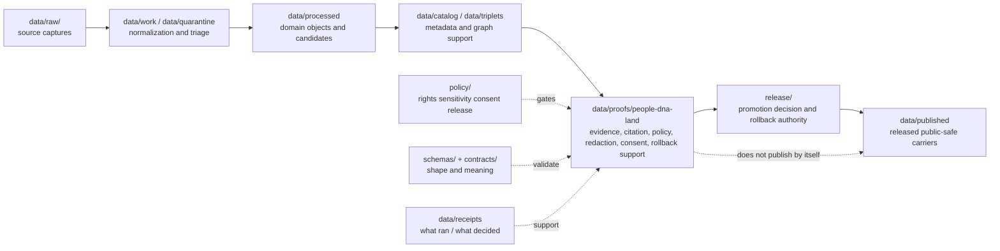

<!-- [KFM_META_BLOCK_V2]
doc_id: kfm://data/proofs/people-dna-land/readme
title: data/proofs/people-dna-land README
type: directory-readme
version: v0.1
status: draft
owners:
  - <data steward — TODO>
  - <people-dna-land domain steward — TODO>
  - <sensitivity reviewer — TODO>
  - <release steward — TODO>
created: 2026-06-25
updated: 2026-06-25
policy_label: restricted-review
path: data/proofs/people-dna-land/README.md
related:
  - ../../../docs/domains/people-dna-land/README.md
  - ../../../docs/domains/people-dna-land/ARCHITECTURE.md
  - ../../../docs/domains/people-dna-land/SENSITIVITY.md
  - ../../../docs/domains/people-dna-land/DNA_HANDLING.md
  - ../README.md
  - ../../receipts/README.md
  - ../../catalog/README.md
  - ../../published/README.md
  - ../../../release/README.md
  - ../../../policy/README.md
  - ../../../schemas/README.md
  - ../../../contracts/README.md
tags:
  - kfm
  - data
  - proofs
  - people-dna-land
  - evidence-bundle
  - proof-pack
  - consent
  - redaction
  - revocation
  - rollback
  - deny-by-default
notes:
  - "Directory README for proof objects only. It is not a schema, policy bundle, release decision, or proof artifact."
  - "Living-person, DNA/genomic, raw kit/vendor, exact burial/cultural, title, and private person-parcel claims fail closed unless policy, evidence, consent, and review explicitly allow release."
  - "Path and adjacent links should be rechecked after mounted-repo validation and CODEOWNERS review."
[/KFM_META_BLOCK_V2] -->

<a id="top"></a>

# `data/proofs/people-dna-land/`

> Proof-lane index for the **People / Genealogy / DNA / Land Ownership** domain. This directory is for reviewable proof objects that support evidence closure, sensitivity decisions, consent and revocation enforcement, redaction/generalization, catalog closure, promotion decisions, correction, and rollback for people/DNA/land claims.


> [!IMPORTANT]
> **Status:** `draft`  
> **Owner:** `<data steward>` · `<people-dna-land domain steward>` · `<sensitivity reviewer>` · `<release steward>` — TODO  
> **Path:** `data/proofs/people-dna-land/README.md`  
> **Truth posture:** CONFIRMED doctrine / PROPOSED implementation guidance / NEEDS VERIFICATION for emitted proof files, validator wiring, CI enforcement, and release-gate coverage.

> [!CAUTION]
> This is one of KFM's highest-risk proof lanes. Proof material for living persons, DNA/genomic evidence, relationship hypotheses, land ownership, title instruments, parcel joins, or cultural/community context **must not** become public merely because a file exists here. Proofs support review; they do not publish, authorize, certify title, prove kinship, or override policy.

---

## Quick jumps

| Section | Use it for |
|---|---|
| [1. Purpose](#1-purpose) | What this folder is for. |
| [2. Repository fit](#2-repository-fit) | Why this path belongs under `data/proofs/`. |
| [3. Accepted inputs](#3-accepted-inputs) | What may be stored here. |
| [4. Exclusions](#4-exclusions) | What must never be stored here. |
| [5. Proposed folder shape](#5-proposed-folder-shape) | Future child lanes and naming conventions. |
| [6. Lifecycle relationship](#6-lifecycle-relationship) | How proofs relate to RAW, WORK, CATALOG, PUBLISHED, and release. |
| [7. Sensitive-proof gates](#7-sensitive-proof-gates) | Fail-closed proof requirements. |
| [8. Cross-lane proof boundaries](#8-cross-lane-proof-boundaries) | How neighboring domains may be cited safely. |
| [9. Validation checklist](#9-validation-checklist) | Review checklist before promotion. |
| [10. Definition of done](#10-definition-of-done) | When this README and lane are usable. |
| [11. Failure modes](#11-failure-modes) | Drift patterns to block. |
| [12. FAQ](#12-faq) | Common maintainer questions. |

---

## 1. Purpose

`data/proofs/people-dna-land/` is the domain-specific proof lane for materialized, reviewable proof records connected to people, genealogy, DNA, consent, revocation, land instruments, ownership intervals, assessor/tax records, parcel versions, and person↔place assertions.

This folder may hold **proof instances** that help reviewers answer questions such as:

- Does a proposed claim resolve to an `EvidenceBundle`?
- Are citations complete and source-role labeled?
- Are living-person, DNA, title, and private person-parcel controls enforced?
- Was a redaction, aggregation, generalization, or denial decision recorded?
- Did the release candidate pass validation, citation, policy, review, and rollback gates?
- Can a correction, withdrawal, or revocation be traced back to the exact proof and release scope it affects?

This folder is **not** the source of truth for object semantics, field shape, policy logic, source authority, or publication state. Those remain in `contracts/`, `schemas/`, `policy/`, `data/registry/`, `data/catalog/`, `release/`, and `data/published/` as appropriate.

[Back to top](#top)

---

## 2. Repository fit

KFM separates lifecycle data, receipts, proofs, catalogs, releases, and published outputs so that no single artifact bucket becomes accidental authority.

| Neighbor | Relationship to this folder | Boundary rule |
|---|---|---|
| [`../README.md`](../README.md) | Parent proof root. | Defines proof-lane expectations; this file narrows them for people/DNA/land. |
| [`../../receipts/`](../../receipts/) | Process memory. | Receipts say what ran or what was decided; proofs assemble support for review. Receipts are not proof by themselves. |
| [`../../catalog/`](../../catalog/) | Catalog closure and metadata. | Catalog records describe released/managed artifacts; proofs may cite catalog IDs but do not replace them. |
| [`../../published/`](../../published/) | Public or semi-public released artifacts. | Published outputs require release decisions; proof-file placement alone does not publish. |
| [`../../../release/`](../../../release/) | Promotion decisions, manifests, rollback cards, correction notices. | Release authority lives here; this folder stores supporting proof objects only. |
| [`../../../policy/`](../../../policy/) | Rights, sensitivity, consent, and release logic. | Proofs record outcomes/evidence; policy logic lives in policy roots. |
| [`../../../schemas/`](../../../schemas/) | Machine-checkable shape. | Proof JSON shapes belong under schemas, not in this README. |
| [`../../../contracts/`](../../../contracts/) | Human semantic contracts. | Meaning and invariants belong in contracts, not emitted proof files. |
| [`../../../docs/domains/people-dna-land/`](../../../docs/domains/people-dna-land/) | Domain doctrine and reviewer guidance. | Documentation explains the lane; proofs support specific candidate claims or releases. |

> [!NOTE]
> Proof material here is downstream of evidence and policy. It supports promotion review but cannot bypass validators, source-role checks, consent checks, redaction review, release decisions, or rollback planning.

[Back to top](#top)

---

## 3. Accepted inputs

Use this directory for proof artifacts that are already safe to store under repository policy and are appropriate for review. Prefer synthetic fixtures until source rights, consent, sensitivity, and storage rules are fully verified.

| Proof family | Example content | Required posture |
|---|---|---|
| `evidence_bundle/` | EvidenceBundle closure records or references for a person, family, residence, migration, land, or aggregate claim. | Must not include raw living-person, raw DNA, raw kit/vendor, or unredacted sensitive details. |
| `proof_pack/` | A bundled index of validation, citation, policy, redaction, catalog, release, and rollback proof refs for one candidate release. | Must reference, not duplicate, sensitive source material. |
| `validation_report/` | Schema, fixture, lifecycle, crosswalk, geometry, source-role, or policy-validation reports. | Must include finite outcome and reason codes. |
| `citation_validation/` | Citation and EvidenceRef resolution checks for claims, maps, reports, Focus Mode answers, or drawer payloads. | Must support cite-or-abstain. |
| `redaction/` | Redaction or generalization proof for a person, parcel, ownership interval, cultural/community context, or location-bearing claim. | Must record transform, reason, reviewer, and target tier. |
| `consent/` | Consent enforcement proof summaries for consent-gated records or aggregate outputs. | Must cite consent scope and expiration without exposing private tokens. |
| `revocation/` | Revocation enforcement proof summaries, tombstone refs, cache-invalidation refs, or withdrawal support. | Must fail closed when revocation status is unknown. |
| `title_boundary/` | Proof that a release avoids claiming title truth from assessor/tax/parcel geometry alone. | Must preserve the assessor/tax/title distinction. |
| `rollback/` | Rollback-support proof refs connected to release, correction, withdrawal, or revocation state. | Must reference release/rollback authority, not replace it. |

[Back to top](#top)

---

## 4. Exclusions

Do **not** place these materials in this directory.

| Excluded material | Correct home or action | Reason |
|---|---|---|
| Raw source captures, GEDCOM exports, vendor CSVs, assessor extracts, deed scans, tax rolls, parcel dumps, or cemetery/vital-record files | `data/raw/`, `data/work/`, or `data/quarantine/` under source-specific controls | Proof lanes are not source storage. |
| Raw genotype, raw DNA segment data, raw `DNAKitToken`, raw kit/vendor IDs, or individual match tables | Deny/quarantine under DNA policy; never store in public repo proof lanes | Raw DNA and kit identifiers must not appear in non-RAW/public review artifacts. |
| Living-person PII, private person↔parcel joins, or unredacted relationship hypotheses | Deny/quarantine/generalize/redact before proof publication | This lane fails closed for living-person and private-join risk. |
| Legal advice, title certification, or title-boundary conclusions | Out of scope; cite land instruments and uncertainty only | KFM does not certify title. |
| Schema definitions | `schemas/contracts/v1/...` | Machine-checkable shape belongs in schema homes. |
| Semantic contracts | `contracts/...` | Meaning and invariants belong in contracts. |
| Policy logic or consent rules | `policy/consent/...`, `policy/sensitivity/...`, `policy/release/...` | Proofs record policy outcomes; they do not define policy. |
| Release decisions, promotion decisions, release manifests, correction notices, or rollback cards as authority | `release/` | This directory may reference release authority but must not become it. |
| Public map tiles, PMTiles, GeoParquet, reports, API payloads, or story exports | `data/published/` after release gates | Published artifacts are downstream and must remain separate. |

[Back to top](#top)

---

## 5. Proposed folder shape

The target child lanes below are **PROPOSED** until directories, schemas, validators, and CI are verified.

```text
data/proofs/people-dna-land/
├── README.md
├── evidence_bundle/
│   └── <release_or_claim_scope>.evidence-bundle.json
├── proof_pack/
│   └── <release_id>.proof-pack.json
├── validation_report/
│   └── <run_id>.validation-report.json
├── citation_validation/
│   └── <run_id>.citation-validation-report.json
├── redaction/
│   └── <release_id>.redaction-proof.json
├── consent/
│   └── <scope_id>.consent-enforcement-proof.json
├── revocation/
│   └── <scope_id>.revocation-enforcement-proof.json
├── title_boundary/
│   └── <claim_scope>.title-boundary-proof.json
└── rollback/
    └── <release_id>.rollback-proof.json
```

### Naming guidance

Prefer deterministic, reviewable names over friendly labels:

```text
<domain>.<proof_family>.<scope>.<version_or_run_id>.<short_hash>.json
```

Examples:

```text
people-dna-land.validation_report.synthetic-living-person-deny.v0.1.0123abcd.json
people-dna-land.citation_validation.historic-land-assertion.v0.1.89ab4567.json
people-dna-land.redaction.public-family-story.v0.1.4567cdef.json
```

A future schema may replace this naming pattern. Until then, treat it as local guidance, not global identity law.

[Back to top](#top)

---

## 6. Lifecycle relationship

Proof records sit near the promotion edge. They are not RAW data, not working data, not catalog records, and not published artifacts.



Promotion remains a governed state transition. Moving a file into `data/proofs/people-dna-land/` does not promote it, publish it, or make it safe.

[Back to top](#top)

---

## 7. Sensitive-proof gates

Every proof pack in this lane should show the applicable gate result explicitly. Missing, stale, or unresolved gate state fails closed.

| Risk surface | Required proof before any public or semi-public release | Default result when missing |
|---|---|---|
| Living-person status | Living/deceased/unknown classification, source role, reviewer decision, and policy decision. | `DENY` or `ABSTAIN`. |
| DNA or genomic evidence | Consent scope, revocation status, no raw genotype, no raw segment, no kit/vendor ID, aggregate/k-anonymous derivation if released. | `DENY`. |
| Relationship hypothesis | EvidenceBundle, source-role labels, uncertainty statement, reviewer state, and no living-person leakage. | `ABSTAIN` or `DENY`. |
| Person↔parcel join | Proof that release is authorized, necessary, generalized/redacted, and not exposing private ownership/safety risk. | `DENY`. |
| Assessor/tax record | Proof that output is labeled as administrative evidence, not title truth. | `ABSTAIN` if title-like claim is requested. |
| Parcel geometry | Proof that geometry is a versioned representation, not title-boundary proof. | `ABSTAIN` or `DENY`. |
| Cultural, sovereignty, archaeology, burial, or community context | Steward review, rights/sensitivity decision, generalized representation, and correction path. | `DENY`. |
| Revoked consent | RevocationReceipt or equivalent proof, cache invalidation, and release correction/withdrawal reference. | `DENY` or `WITHDRAW`. |
| Unresolved source rights | SourceDescriptor/rights decision and policy result. | `DENY`. |

[Back to top](#top)

---

## 8. Cross-lane proof boundaries

People/DNA/Land may cite neighboring lanes as context. A neighbor's context never weakens this lane's restrictions.

| Neighbor lane | Safe proof relationship | Unsafe collapse to block |
|---|---|---|
| Settlements / Infrastructure | Residence events may cite settlement identity, townsite context, or legal place context. | Treating residence context as proof of identity, status, or living-person publishability. |
| Frontier Matrix | Aggregated population observations may feed matrix cells with release/rollback support. | Publishing person-level records as analytical cells. |
| Archaeology / Cultural Heritage | Cultural/community context may be cited only under steward review and rights boundaries. | Publishing exact site, burial, sacred-place, or community-sensitive details through a people/land proof. |
| Agriculture | LandParcel context may bound field or ownership-candidate joins. | Publishing private person↔field/operator/parcel joins. |
| Roads / Rail / Trade | Migration or access context may cite corridors or route uncertainty. | Turning route proximity into a person or ownership claim. |
| Spatial Foundation | Geometry validity, generalization, and coordinate reference checks may support proof. | Treating geometry as ownership, title, or identity truth. |

[Back to top](#top)

---

## 9. Validation checklist

Before a proof artifact in this directory is used for promotion review, verify:

- [ ] The proof artifact contains no raw genotype, raw segment, raw kit/vendor ID, raw living-person PII, or unredacted private person↔parcel join.
- [ ] Every consequential claim resolves `EvidenceRef → EvidenceBundle` or abstains.
- [ ] Source roles distinguish evidence, observation, model, administrative record, legal instrument, and review decision.
- [ ] DNA evidence is treated as evidence or model output, never as identity or relationship authority.
- [ ] Assessor/tax records are labeled as administrative records, not title truth.
- [ ] Parcel geometry is labeled as a versioned representation, not title-boundary proof.
- [ ] Consent, revocation, retention, and purpose scope are checked where applicable.
- [ ] Redaction/generalization transform, reason, reviewer, tier, and target artifact are recorded.
- [ ] Citation validation supports cite-or-abstain behavior.
- [ ] PolicyDecision result is present for rights, sensitivity, consent, and release posture.
- [ ] ValidationReport result is finite: `ANSWER`, `DENY`, `ABSTAIN`, or `ERROR` where applicable.
- [ ] Catalog closure is checked before release references are accepted.
- [ ] Release authority remains in `release/`; published output remains in `data/published/`.
- [ ] Correction, withdrawal, revocation, and rollback targets are traceable.
- [ ] CI or local validator evidence is linked, or the artifact remains `NEEDS VERIFICATION`.

[Back to top](#top)

---

## 10. Definition of done

This README becomes operationally useful when:

- [ ] CODEOWNERS or equivalent review ownership is assigned for data, domain, sensitivity, and release review.
- [ ] The parent `data/proofs/README.md` is no longer a greenfield stub or this README is explicitly linked from it.
- [ ] Child proof folders are created only when their schemas, validators, fixtures, and review path are known.
- [ ] People/DNA/Land proof schemas are present under the approved schema home.
- [ ] Semantic contracts describe the proof objects and their invariants.
- [ ] Policy bundles cover living-person, DNA, consent, revocation, title, land/parcel, cultural/community, and release-risk decisions.
- [ ] Valid and invalid fixtures exist for each high-risk gate.
- [ ] CI blocks proof packs that contain excluded content or unresolved EvidenceRefs.
- [ ] Release dry-run proves correction, withdrawal, revocation, and rollback paths.

[Back to top](#top)

---

## 11. Failure modes

| Failure mode | Why it is dangerous | Required response |
|---|---|---|
| Proof file includes sensitive raw content | Proof lanes may be reviewed more widely than RAW stores. | Remove/quarantine, rotate affected references if needed, record incident/correction. |
| Proof pack treats a relationship hypothesis as confirmed kinship | Collapses model/evidence into authority. | Downgrade to hypothesis, require EvidenceBundle and review, or `ABSTAIN`. |
| Assessor/tax record becomes title claim | Creates legal/title overclaim. | Correct language; require land instrument evidence and uncertainty labels. |
| Parcel geometry becomes title-boundary proof | Collapses representation into legal truth. | Deny title-boundary claim; cite geometry as representation only. |
| Consent revoked but proof remains active | Violates consent lifecycle and cache invalidation. | Withdraw/correct release, invalidate caches, attach revocation proof. |
| Release decision stored only in `data/proofs/` | Collapses proof support with release authority. | Move decision authority to `release/` and leave only proof references here. |
| Map or Focus Mode uses proof fields directly as truth | Bypasses governed API and EvidenceBundle resolution. | Deny direct path; require governed API envelope and citation validation. |

[Back to top](#top)

---

## 12. FAQ

### Does a proof pack make a people/DNA/land claim public?

No. A proof pack supports review. Publication requires governed promotion, policy decisions, review state, release authority, catalog closure, and a rollback target.

### Can this directory contain raw DNA evidence for review?

No. Raw DNA/genotype/segment/kit/vendor identifiers must not appear in this proof lane. Use protected RAW/quarantine handling and policy-controlled summaries only.

### Can a parcel proof establish title?

No. KFM may cite land instruments, assessor/tax records, legal descriptions, and parcel versions, but it must not convert those into title certification or title-boundary proof.

### Can public maps show people-land relationships?

Only when the release is evidence-supported, policy-allowed, rights-cleared, sensitivity-reviewed, and public-safe. Private person↔parcel joins are denied by default.

### What should happen when evidence is plausible but incomplete?

Use `ABSTAIN`, `DENY`, or quarantine. Do not publish a fluent summary, map label, graph edge, or Focus Mode answer as if evidence were complete.

---

## Maintainer note

This README intentionally favors fail-closed handling over convenience. The people/DNA/land lane is valuable precisely because it can preserve evidence-rich history without turning sensitive identity, kinship, genetic, title, parcel, or cultural claims into unsupported public truth.
