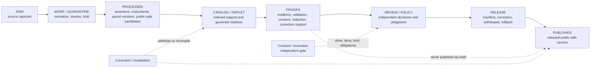

<!-- [KFM_META_BLOCK_V2]
doc_id: kfm://data/proofs/people-dna-land/readme
title: data/proofs/people-dna-land/ — Restricted People, DNA, and Land Proof Support
type: directory-readme
subtype: restricted-domain-proof-lane
version: v0.2.0
status: repository-grounded draft; proof payloads, executable domain validators, consent enforcement, release integration, and public effects remain held
owners:
  - "NEEDS VERIFICATION — People/DNA/Land domain, proof, evidence, privacy, consent, sensitivity, policy, and release stewards"
  - "CONFIRMED GitHub review routing — @bartytime4life via .github/CODEOWNERS; routing is not approval"
created: 2026-06-25
updated: 2026-07-26
policy_label: restricted-review; t4-deny-by-default; living-person; dna-genomic; consent-revocation; land-title; no-direct-public-path; release-gated
path: data/proofs/people-dna-land/README.md
prepared_under_prompt: KFM Markdown Modernization & GitHub Documentation Implementation Agent v4.0.0
truth_posture: >
  CONFIRMED exact target path and prior blob, Directory Rules proof placement, modernized proofs-root
  contract, People/DNA/Land bounded-context and sensitivity doctrine, consent-policy documentation,
  candidate-release lane, CODEOWNERS routing, and read-only readiness workflow / PROPOSED accepted
  materialization profile, proof packet shapes, public-safe derived products, revocation cascade, and
  cross-lane closure rules / UNKNOWN recursive proof payload inventory, active writers and consumers,
  deployed policy runtime, caches, hosting, public routes, release instances, and public effects /
  NEEDS VERIFICATION accountable stewards, segment-placement ADR, schemas, executable validators,
  synthetic fixtures, consent and revocation enforcement, EvidenceBundle resolution, independent review,
  release/correction/withdrawal integration, cache invalidation, and rollback drills
evidence_snapshot:
  repository: bartytime4life/Kansas-Frontier-Matrix
  base_ref: main
  base_commit: 4ce20df8b12d640fa527147407a24f56d61e0b46
  prior_blob: 05359bb623e69dccbda1ee22f8ba0d8345d9d412
  directory_rules_blob: 2affb080e6f0043867c64c7f06c1ca52030fbd55
  proofs_root_blob: 0d8b6e92d3b4b9ff3961d29c53ead497922a31cf
  validator_index_blob: 7a78d278aa03d843107d4d66a954c7a670d2ac19
  consent_policy_readme_blob: fa7ea7c95a473a7fd498053536ca0b72b17461f6
  release_candidate_readme_blob: cbbef9394fbdbe94ed742957e1b764c84c9907f3
  domain_workflow_blob: bb5626ff3aaba558070f53807027e70b2ba89a6e
  codeowners_blob: dd2a84aa514d8ecd9208bc347f90f9a2ed37dd61
related:
  - ../README.md
  - ../../receipts/people-dna-land/README.md
  - ../../registry/sources/people-dna-land/README.md
  - ../../processed/people-dna-land/README.md
  - ../../catalog/domain/people-dna-land/land-ownership/README.md
  - ../../published/people-dna-land/README.md
  - ../../../docs/domains/people-dna-land/README.md
  - ../../../docs/domains/people-dna-land/SCOPE_AND_BOUNDARY.md
  - ../../../docs/domains/people-dna-land/SENSITIVITY.md
  - ../../../docs/domains/people-dna-land/DNA_HANDLING.md
  - ../../../docs/domains/people-dna-land/DATA_LIFECYCLE.md
  - ../../../docs/domains/people-dna-land/VERIFICATION_BACKLOG.md
  - ../../../contracts/domains/people-dna-land/README.md
  - ../../../schemas/contracts/v1/domains/people-dna-land/README.md
  - ../../../policy/domains/people-dna-land/README.md
  - ../../../policy/consent/people-dna-land/README.md
  - ../../../tools/validators/domains/people-dna-land/README.md
  - ../../../tests/domains/people-dna-land/README.md
  - ../../../tests/domains/people-dna-land/consent/revocation/README.md
  - ../../../release/candidates/people-dna-land/README.md
  - ../../../docs/doctrine/directory-rules.md
  - ../../../.github/workflows/domain-people-dna-land.yml
  - ../../../.github/CODEOWNERS
notes:
  - "Same-path Markdown modernization only; no person, genealogy, DNA, land, consent, revocation, proof, contract, schema, policy, validator, fixture, workflow, release, route, hosting, or publication state changed."
  - "This README preserves the exact phrase NEEDS VERIFICATION for emitted proof files because the current readiness workflow checks that sentinel before reporting a held proof lane."
  - "People/DNA/Land is treated as T4 / deny-by-default. Consent is necessary where required but never sufficient for publication."
  - "The documentation rollback target for v0.2.0 is prior blob 05359bb623e69dccbda1ee22f8ba0d8345d9d412."
[/KFM_META_BLOCK_V2] -->

<a id="top"></a>

# `data/proofs/people-dna-land/` — Restricted People, DNA, and Land Proof Support

> **One-line purpose.** Hold or index reviewable, public-repository-safe proof support for bounded People, Genealogy, DNA, consent, revocation, land-instrument, ownership-interval, parcel-representation, correction, and rollback claims without becoming identity, kinship, title, policy, release, or publication authority.

[](#status)
[](#sensitive-proof-gates)
[](#authority-level)
[](#consent-and-revocation-boundary)
[](#outputs)
[](#validation)

> [!IMPORTANT]
> **Proof support is necessary but not sufficient for release.** A valid-looking proof packet cannot make a person identity, relationship, DNA inference, consent state, ownership assertion, parcel boundary, cultural context, or public derivative true, lawful, safe, reviewed, released, or KFM-published.

> [!CAUTION]
> **This is a T4 / deny-by-default lane.** Missing, stale, conflicted, revoked, unresolvable, rights-unclear, sensitivity-unsafe, living-person-exposing, title-like, or consent-ambiguous support must yield a finite fail-closed result such as `ABSTAIN`, `HOLD`, `RESTRICT`, `DENY`, `WITHDRAW`, or `ERROR` according to the applicable contract.

> [!WARNING]
> Never place raw genotype, DNA segments, kit or vendor identifiers, living-person PII, private person↔parcel joins, exact burial or sacred-place details, secrets, access tokens, unredacted relationship hypotheses, control-defeating transform parameters, or restricted source material in this ordinary repository lane.

- **Path:** `data/proofs/people-dna-land/README.md`
- **Owning responsibility:** `data/proofs/`
- **Domain segment:** `people-dna-land/`
- **Direct public access:** denied
- **Documentation rollback target:** prior blob `05359bb623e69dccbda1ee22f8ba0d8345d9d412`

**Quick navigation:** [Purpose](#purpose) · [Authority](#authority-level) · [Status](#status) · [Belongs](#what-belongs-here) · [Exclusions](#what-does-not-belong-here) · [Inputs](#inputs) · [Outputs](#outputs) · [Validation](#validation) · [Review](#review-burden) · [Related](#related-folders) · [ADRs](#adrs) · [Last reviewed](#last-reviewed) · [Lifecycle](#lifecycle-relationship) · [Proof packet](#restricted-proof-packet) · [Consent](#consent-and-revocation-boundary) · [Sensitive gates](#sensitive-proof-gates) · [Cross-lane boundaries](#cross-lane-proof-boundaries) · [Failure modes](#failure-modes) · [Verification](#open-verification-register) · [No-loss](#no-loss-ledger) · [Rollback](#rollback)

---

## Purpose

`data/proofs/people-dna-land/` is the domain-specific proof-support lane for candidate claims involving:

- assertion-first person evidence and identity candidates;
- genealogy relationships and relationship hypotheses;
- restricted DNA/genomic evidence and derived relationship support;
- consent, suspension, dispute, revocation, and downstream invalidation;
- land instruments, ownership intervals, assessor/tax records, parcel versions, and legal descriptions;
- person↔place or person↔land assertions under strict privacy and purpose limitations;
- validation, citation, policy, redaction, aggregation, review, correction, withdrawal, and rollback support.

The lane exists to make the following review questions inspectable:

1. What exact claim or release scope is being supported?
2. Which `EvidenceRef` values and EvidenceBundle members support it?
3. Which source roles, time intervals, spatial representations, rights, consent, sensitivity, and review limits apply?
4. Which fields, relations, geometry, derivations, exports, or audiences are allowed, generalized, withheld, or denied?
5. Which correction, revocation, withdrawal, cache invalidation, and rollback dependencies remain outside the proof packet?
6. Which finite outcome is justified?

This lane supports review. It does not establish person identity, kinship, DNA truth, consent validity, title, parcel-boundary truth, source rights, policy approval, release approval, legal sufficiency, or publication.

## Authority level

**Implementation-bearing specialized proof-support lane under the canonical `data/proofs/` responsibility.** Directory Rules assign proof material to `data/proofs/`; the domain remains a nested segment rather than a new root. fileciteturn73file9

| Responsibility | Owning surface |
|---|---|
| People/DNA/Land domain meaning and bounded context | `docs/domains/people-dna-land/` and accepted semantic contracts |
| Machine shape | `schemas/contracts/v1/...` after the segment-placement conflict is resolved |
| Rights, sensitivity, consent, and admissibility | `policy/` and accepted policy runtime surfaces |
| Source identity and activation | `data/registry/sources/people-dna-land/` and source-governance records |
| Proof support | `data/proofs/people-dna-land/` — this lane |
| Process receipts | `data/receipts/people-dna-land/` and accepted receipt families |
| Candidate and release decisions | `release/candidates/people-dna-land/` and `release/` |
| Published public-safe carriers | `data/published/people-dna-land/` after governed release |
| Governed API, map, search, export, and AI behavior | application/runtime surfaces downstream of release and policy |

This README creates no new proof family, policy authority, source registry, release state, public route, or legal determination.

## Status

| Surface | Bounded result |
|---|---|
| Exact target path and prior content | **CONFIRMED** at `main@4ce20df8b12d640fa527147407a24f56d61e0b46`; prior blob `05359bb623e69dccbda1ee22f8ba0d8345d9d412` |
| Documentation version | `v0.2.0` |
| Parent proof responsibility | **CONFIRMED repository-grounded draft** at [`data/proofs/README.md`](../README.md); no longer a greenfield stub |
| People/DNA/Land bounded-context doctrine | **CONFIRMED draft repository docs**; assertion-first identity, source-role separation, T4 sensitivity, title/parcel anti-collapse, and neighbor-control rules are documented |
| Consent-policy documentation | **CONFIRMED README / placement conflicted / enforcement unproved**; consent is purpose-, audience-, subject-, field/relation-, precision-, export-, and time-specific |
| Domain validator index | **CONFIRMED README-only index**; no accepted executable domain validator body is established by the inspected readiness workflow |
| Domain workflow | **CONFIRMED read-only readiness workflow** with validation, proof, and release holds; it intentionally does not open surfaced fixture or proof payloads |
| GitHub review routing | **CONFIRMED** `/data/proofs/` routes to `@bartytime4life`; routing is not review approval, policy approval, or release approval |
| Proof payload inventory | **UNKNOWN / held**; no recursive sensitive-payload inspection was performed in this Markdown task |
| Executable consent, revocation, validation, proof production, release integration, or public behavior | **NEEDS VERIFICATION / held** |
| Public readiness | **DENY BY DEFAULT** |

The current workflow expects the posture text **“NEEDS VERIFICATION for emitted proof files”** and reports an explicit proof hold when no accepted producer or deterministic command exists. This README preserves that sentinel and does not graduate the workflow.

## What belongs here

Only repository-policy-safe proof artifacts under an accepted profile belong here. Prefer synthetic, generalized, aggregate, or reference-only material until rights, consent, sensitivity, storage, and review controls are proven.

| Artifact class | Bounded purpose | Required posture |
|---|---|---|
| EvidenceBundle support or index | Link a bounded claim scope to evidence members, citations, source roles, rights, sensitivity, and limitations. | Reference governed records; do not duplicate raw sensitive material. |
| ProofPack support | Collect immutable references to validation, citation, policy, consent, redaction, review, release dependency, correction, and rollback objects. | A proof pack is not a release manifest or legal finding. |
| ValidationReport support | Record deterministic shape, source-role, lifecycle, crosswalk, geometry, public-safety, or policy checks. | Finite result and reason codes; passing scope stated precisely. |
| CitationValidation support | Check claim-to-citation and `EvidenceRef → EvidenceBundle` resolution for reports, maps, drawer payloads, exports, or AI responses. | Cite-or-abstain; unsupported claims remain held. |
| Redaction or aggregation proof | Record the safe transform, source and target precision, target audience, withheld fields, reason, policy decision, and reviewer state. | Never expose offsets, secrets, or reversal-enabling parameters. |
| Consent or revocation proof summary | Reference consent scope, expiry, suspension, dispute, revocation, obligations, and invalidation outcomes. | No private tokens; consent is never sufficient by itself. |
| Title/parcel boundary proof | Demonstrate that administrative records and geometry were not promoted into title or boundary truth. | Preserve instrument, assessor/tax, legal-description, and parcel-version distinctions. |
| Correction, withdrawal, and rollback support | Link affected claims, derivatives, releases, caches, indexes, and rollback targets. | Authority remains in `release/` and correction records. |
| Lane-local inventory, digest, migration, or disposition note | Explain proof identity and maintenance. | Must not become a parallel authority register. |

## What does NOT belong here

| Excluded material or authority | Correct home or action | Why |
|---|---|---|
| Raw GEDCOM, vital-record, cemetery, assessor, deed, tax, parcel, vendor, or source captures | Governed RAW, WORK, or QUARANTINE lanes | Proof storage is not source storage. |
| Raw genotype, DNA segment, kit/vendor ID, match table, credential, or token | Deny or quarantine under approved DNA controls | Ordinary repository proof lanes must not hold reconstructable DNA material. |
| Living-person PII, private person↔parcel or person↔family joins, unredacted hypotheses | Deny, quarantine, redact, aggregate, or generalize before proof consideration | T4 and privacy controls fail closed. |
| Exact burial, sacred-place, archaeology, cultural-sovereignty, or community-sensitive detail | Restricted steward-controlled systems or denied output | Neighbor context cannot weaken the most restrictive policy. |
| Contracts, schemas, policy rules, source descriptors, validators, tests, fixtures, pipelines, or application code | Their owning responsibility roots | Proof artifacts cannot redefine governing behavior. |
| Receipts used as proof by themselves | `data/receipts/` plus separate proof closure | A receipt records process; it does not prove a claim or release. |
| ReleaseManifest, PromotionDecision, CorrectionNotice, WithdrawalNotice, or RollbackCard as authority | `release/` | This lane may reference authority records but cannot own them. |
| Public map tiles, PMTiles, GeoParquet, reports, story exports, search indexes, graph views, or API payloads | `data/published/` after release | Derived carriers remain downstream and governed. |
| Legal advice, title certification, kinship adjudication, consent legal sufficiency, or boundary determination | Out of KFM proof-lane scope | KFM supports evidence and uncertainty; it does not adjudicate. |

## Inputs

A restricted proof packet may reference only admitted or explicitly held governed records. As applicable, inputs include:

- stable claim, assertion, person-candidate, relationship, instrument, parcel-version, release-candidate, and run identities;
- `EvidenceRef` values, EvidenceBundle members, citations, source records, source roles, rights, and limitations;
- valid, observed, source, retrieval, decision, consent, revocation, correction, and release times;
- living/deceased/unknown classification and applicable review state;
- consent scope, purpose, audience, fields/relations, precision, export class, expiration, suspension, dispute, and revocation status;
- sensitivity, privacy, sovereignty, cultural, burial, archaeology, land, and reconstruction-risk posture;
- land instruments, assessor/tax administrative records, legal descriptions, parcels, and parcel versions with anti-collapse labels;
- transform, redaction, generalization, aggregation, checksum, `spec_hash`, validation, receipt, policy, review, release dependency, correction, invalidation, and rollback references.

An unresolved member remains unresolved. Documentation must not fabricate closure.

## Outputs

Outputs are proof-support records or indexes for independent review, release preflight, correction, withdrawal, rollback, Evidence Drawer projection, governed API resolution, and bounded AI use.

They must not:

- become a direct public data service;
- expose sensitive source content or reverse-engineerable derivatives;
- convert `EvidenceRef` into EvidenceBundle closure without resolution;
- convert consent into broad authorization;
- convert DNA evidence into identity truth;
- convert assessor/tax records or parcel geometry into title truth;
- convert validation success into review, policy, or release approval;
- convert a branch, commit, PR, merge, badge, generated report, or workflow conclusion into KFM publication.

## Validation

Validation is layered. A passing layer proves only its declared scope.

| Layer | Current posture | What it can prove | What it cannot prove |
|---|---|---|---|
| README/source validation | **Performed for this update** | One H1, anchors, links introduced in scope, fences, tables, alerts, metadata, no-loss, exact remote bytes | Host rendering, runtime enforcement, sensitive payload safety |
| Domain readiness workflow | **CONFIRMED definition / expected hold** | Required boundary paths, absence of accepted executable tests/validators, current policy scaffolding, and fixture non-consumption posture | Person, relationship, DNA, consent, title, rights, privacy, evidence, release, or public safety |
| Proof readiness workflow | **CONFIRMED definition / expected hold** | README sentinel, no accepted proof payload/producer/Make target surfaced within its declared checks | Proof correctness, EvidenceBundle closure, consent/revocation execution, release readiness |
| Schemas, validators, and synthetic fixtures | **NEEDS VERIFICATION** | Machine shape and bounded negative cases after implementation | Source truth, legal sufficiency, review or release approval |
| Policy runtime and consent/revocation integration | **NEEDS VERIFICATION** | Exact finite policy results and obligations after accepted activation | Evidence truth or release approval by itself |
| Release/correction/rollback drills | **NEEDS VERIFICATION** | Candidate-to-release, correction, withdrawal, invalidation, and restoration behavior | Truth beyond the tested scope |

Before any proof artifact advances, verify at minimum:

- [ ] no raw genotype, segments, kit/vendor IDs, living-person PII, private joins, or restricted exact context;
- [ ] every consequential claim resolves `EvidenceRef → EvidenceBundle` or returns a finite negative result;
- [ ] source roles distinguish observation, assertion, hypothesis, administrative record, legal instrument, model, review, policy, and release state;
- [ ] living/deceased/unknown, rights, consent, revocation, sensitivity, purpose, audience, precision, retention, and export posture are explicit;
- [ ] DNA-derived hints remain evidence or hypotheses, never identity or kinship authority without governed review;
- [ ] assessor/tax records are administrative evidence, not title truth;
- [ ] parcel geometry is a versioned representation, not title-boundary proof;
- [ ] transforms and obligations are named, reviewable, and irreversible from the public derivative where required;
- [ ] correction, withdrawal, invalidation, and rollback targets are traceable;
- [ ] release authority stays in `release/`; public artifacts stay in `data/published/`;
- [ ] validator, workflow, or review evidence is linked, otherwise the artifact remains held.

## Review burden

This lane requires the highest practical review burden appropriate to the exact operation.

- GitHub CODEOWNERS routes `/data/proofs/` review to `@bartytime4life`; this proves routing only.
- Accountable People/DNA/Land, privacy, consent, sensitivity, rights, proof/evidence, policy, correction, and release roles remain **NEEDS VERIFICATION**.
- The generator or author must not be treated as the sole approver for policy-significant, living-person, DNA, consent, title, cultural, or public-exposure decisions.
- Any new payload, schema, validator, fixture, policy, consent or revocation mechanism, release candidate, public derivative, correction, or rollback change requires the corresponding specialist and independent review.
- Review must distinguish documentation approval, proof validity, policy decision, release approval, and publication state.

## Related folders

- Parent proof contract: [`data/proofs/`](../README.md)
- Domain receipts: [`data/receipts/people-dna-land/`](../../receipts/people-dna-land/README.md)
- Source registry: [`data/registry/sources/people-dna-land/`](../../registry/sources/people-dna-land/README.md)
- Processed lane: [`data/processed/people-dna-land/`](../../processed/people-dna-land/README.md)
- Catalog land-ownership lane: [`data/catalog/domain/people-dna-land/land-ownership/`](../../catalog/domain/people-dna-land/land-ownership/README.md)
- Published lane: [`data/published/people-dna-land/`](../../published/people-dna-land/README.md)
- Domain doctrine: [`docs/domains/people-dna-land/`](../../../docs/domains/people-dna-land/README.md)
- Bounded context: [`SCOPE_AND_BOUNDARY.md`](../../../docs/domains/people-dna-land/SCOPE_AND_BOUNDARY.md)
- Sensitivity doctrine: [`SENSITIVITY.md`](../../../docs/domains/people-dna-land/SENSITIVITY.md)
- DNA handling: [`DNA_HANDLING.md`](../../../docs/domains/people-dna-land/DNA_HANDLING.md)
- Domain validator index: [`tools/validators/domains/people-dna-land/`](../../../tools/validators/domains/people-dna-land/README.md)
- Consent policy documentation: [`policy/consent/people-dna-land/`](../../../policy/consent/people-dna-land/README.md)
- Release candidates: [`release/candidates/people-dna-land/`](../../../release/candidates/people-dna-land/README.md)
- Workflow: [`domain-people-dna-land.yml`](../../../.github/workflows/domain-people-dna-land.yml)
- Placement doctrine: [`Directory Rules`](../../../docs/doctrine/directory-rules.md)

## ADRs

This README changes no path or authority and accepts no unresolved decision. Relevant open or proposed decisions include:

- schema and contract segment naming: `people` versus `people-dna-land`;
- top-level consent placement versus domain-nested consent policy;
- proof instance versus index/materialization profile;
- consent and revocation credential format, evaluator binding, obligations, retention, and cache invalidation;
- release/correction/withdrawal separation and independent review requirements.

Until accepted decisions exist, preserve the current path, avoid parallel homes, mark conflicts, and fail closed.

## Last reviewed

- **Date:** 2026-07-26
- **Evidence boundary:** `main@4ce20df8b12d640fa527147407a24f56d61e0b46`
- **Review type:** complete target baseline; Directory Rules; parent proof README; bounded-context and sensitivity docs; consent policy README; validator index; candidate-release README; CODEOWNERS; domain workflow
- **Recursive proof payload inspection:** not performed
- **Runtime, deployed policy, consent/revocation service, caches, release instances, and public effects:** not inspected

Re-review on any proof payload, source, policy, consent, revocation, validator, fixture, workflow, release, correction, withdrawal, cache, public-consumer, ownership, or path-authority change—or within six months.

## Lifecycle relationship


```mermaid
flowchart LR
  RAW["RAW<br/>source captures"] --> WORK["WORK / QUARANTINE<br/>normalize, resolve, hold"]
  WORK --> PROC["PROCESSED<br/>assertions, instruments, parcel versions, public-safe candidates"]
  PROC --> CAT["CATALOG / TRIPLET<br/>indexed support and governed relations"]
  CAT --> PROOF["PROOFS<br/>evidence, validation, consent, redaction, correction support"]
  PROOF --> REVIEW["REVIEW / POLICY<br/>independent decisions and obligations"]
  REVIEW --> REL["RELEASE<br/>manifest, correction, withdrawal, rollback"]
  REL --> PUB["PUBLISHED<br/>released public-safe carriers"]

  PROOF -. "never publishes by itself" .-> PUB
  CONSENT["Consent / revocation<br/>independent gate"] -. "allow, deny, hold, obligations" .-> REVIEW
  CORR["Correction / invalidation"] -. "withdraw or recompile" .-> CAT
  CORR -.-> PUB
```

Proof support remains alongside the canonical lifecycle; it does not replace a phase. Promotion is a governed decision, not a file move.

## Restricted proof packet

A future accepted proof packet should bind the minimum necessary metadata without copying sensitive source payloads.

| Packet area | Minimum inspectable content |
|---|---|
| Scope and identity | proof ID, claim or candidate scope, domain object family, space/time scope, intended audience and operation |
| Evidence | EvidenceRefs, EvidenceBundle status, citations, source records, source roles, limitations and conflicts |
| Rights and consent | rights decision, consent basis and scope, expiry/suspension/revocation state, obligations, purpose and audience |
| Sensitivity | living-person, DNA/genomic, land/title, cultural/sovereignty, archaeology/burial, exact-location, reconstruction-risk posture |
| Representation | public-safe fields and relations, generalized geometry, withheld counts, transform version and digest, no reversal-enabling parameters |
| Validation | schema/contract profile, deterministic checks, reason codes, negative cases, validator/run identity |
| Review and policy | PolicyDecision, ReviewRecord or held state, independent reviewer role, unresolved obligations |
| Release dependency | candidate/release reference, correction/withdrawal path, cache/index invalidation plan, rollback target |
| Integrity | content hashes, spec hash, receipt references, stale/supersession state |

The exact schema and artifact family remain **PROPOSED** until accepted contracts, schemas, policy, validators, and storage rules select them.

## Consent and revocation boundary

Consent is an independent, purpose-bound gate—not evidence, title, release, or publication authority.

A consent evaluation must be bound to:

- exact subject or authorized holder;
- operation and purpose;
- audience and access class;
- fields, relations, derived inferences, geometry precision, export, search, graph, map, AI, and publication surfaces;
- valid time, expiry, suspension, dispute, and revocation state;
- obligations, retention, purge, notification, correction, and invalidation behavior.

A valid consent state cannot:

- prove identity, kinship, ownership, occupancy, title, or parcel boundary;
- clear source rights or sensitivity by itself;
- authorize a materially different derivative, inference, join, precision, export, or audience;
- waive evidence or citation requirements;
- make a candidate released or public;
- authorize disclosure about another living person automatically.

When consent is revoked or disputed, the system must fail closed and identify every affected derivative, cache, map, graph, search index, API payload, export, AI context, release, correction, withdrawal, and rollback dependency. Execution of that cascade remains **NEEDS VERIFICATION**.

## Sensitive-proof gates

| Risk surface | Required support before public or semi-public use | Default when absent or unresolved |
|---|---|---|
| Living-person status | classification, source role, purpose, policy decision, review, field/relationship minimization | `DENY` or `ABSTAIN` |
| DNA/genomic evidence | scoped consent where required, revocation state, no raw genotype/segment/kit ID, approved aggregate or public-safe derivative | `DENY` |
| Identity or relationship hypothesis | EvidenceBundle, source-role separation, uncertainty, independent review, no living-person leakage | `ABSTAIN`, `HOLD`, or `DENY` |
| Person↔parcel or person↔land join | necessity, lawful purpose, most-restrictive policy, minimization, generalization/redaction, review, release dependency | `DENY` |
| Assessor/tax record | administrative-role label and explicit non-title limitation | `ABSTAIN` for title-like requests |
| Parcel or map geometry | versioned representation label and explicit non-boundary limitation | `ABSTAIN` or `DENY` |
| Consent missing, stale, expired, suspended, disputed, revoked, or unverifiable | finite decision plus downstream obligation and invalidation posture | `DENY`, `HOLD`, or `WITHDRAW` |
| Cultural, sovereignty, burial, archaeology, sacred-place, or community context | steward/rights review, sensitivity decision, generalized or withheld representation, correction path | `DENY` |
| Unknown source rights or redistribution terms | SourceDescriptor, rights decision, permitted-use and attribution posture | `DENY` |
| Missing release, correction, or rollback dependency | complete review and release references | `HOLD` or `DENY` |

## Cross-lane proof boundaries

A neighboring domain may provide context, but never a sensitivity downgrade or ownership transfer.

| Neighbor | Permitted proof relationship | Collapse to deny |
|---|---|---|
| Settlements / Infrastructure | residence or place identity context under living-person controls | settlement context used as person identity or publishability proof |
| Frontier Matrix | aggregate population or historical context with release support | person-level records exposed as matrix cells |
| Archaeology / Cultural Heritage | cultural/community context under steward and sovereignty review | exact site, burial, sacred-place, or community-sensitive detail exposed through this lane |
| Agriculture | parcel or historical land context for bounded analysis | private person↔field, producer, operator, or parcel joins made public |
| Roads / Rail / Trade | migration or access context with uncertainty | proximity converted into person, residence, ownership, or safety truth |
| Spatial Foundation | geometry validity, CRS, representation, redaction, and generalization checks | geometry treated as title, boundary, identity, or consent truth |

The most restrictive applicable policy follows the relationship.

## Failure modes

| Failure mode | Risk | Required response |
|---|---|---|
| Sensitive raw material appears in proof lane | Broad review or repository exposure | Quarantine/remove, assess disclosure, rotate references where needed, record correction or incident privately |
| Relationship or DNA hypothesis becomes confirmed kinship | Evidence/model role collapse | Downgrade to hypothesis, require evidence and independent review, or abstain |
| Assessor/tax record becomes title claim | Legal/title overclaim | Correct language; require instruments and uncertainty; deny certification |
| Parcel geometry becomes title-boundary truth | Representation-to-legal-truth collapse | Deny claim; label geometry as versioned representation only |
| Consent exists but scope differs | Unauthorized secondary use | Deny; evaluate exact operation, audience, purpose, fields, precision, export, and time |
| Consent revoked but derivatives remain active | Privacy, legal, and governance failure | Hold/withdraw, invalidate derivatives and caches, issue correction, preserve audit and rollback lineage |
| Proof packet contains release decision as local authority | Proof/release authority collapse | Retain immutable reference only; release authority stays in `release/` |
| Map, search, graph, export, or AI uses proof fields directly | Governed-interface bypass | Deny direct path; require released public-safe payload and evidence/policy envelope |
| Workflow hold is presented as proof success | Readiness/result collapse | State the hold explicitly; do not claim validator, consent, proof, or release execution |

## Open verification register

| Item | Status | Evidence required |
|---|---:|---|
| Recursive proof payload inventory and storage class | `UNKNOWN` | Pinned tree, restricted-storage design, artifact families, access controls, content review |
| Accountable owners and independent reviewers | `NEEDS VERIFICATION` | StewardshipAssignments, review policy, branch/ruleset evidence |
| `people` versus `people-dna-land` segment and consent placement | `CONFLICTED` | Accepted ADR and migration/compatibility plan |
| Proof packet semantic contract and schema | `NEEDS VERIFICATION` | Accepted contract, JSON Schema, versioning and migration rules |
| Synthetic public-safe valid and invalid fixtures | `NEEDS VERIFICATION` | Fixture inventory, rights/sensitivity review, deterministic tests |
| Executable domain validators and consent/revocation policy | `NEEDS VERIFICATION` | Source, fixtures, tests, policy bundle, evaluator wiring, negative cases |
| EvidenceRef resolver and EvidenceBundle closure | `NEEDS VERIFICATION` | Accepted resolver, deterministic valid/denied tests, consumer behavior |
| Proof producer and deterministic command | `NEEDS VERIFICATION for emitted proof files` | Producer code, Make/CLI target, artifact schema, receipts, independent validation |
| Consent and revocation credential/sidecar format | `NEEDS VERIFICATION` | Accepted object family, binding, privacy, expiry, revocation and replay design |
| Downstream revocation/correction cascade | `UNKNOWN` | Cache, graph, search, map, API, export, AI, release, correction, withdrawal and rollback drills |
| Candidate-to-release integration | `NEEDS VERIFICATION` | ReleaseManifest, PolicyDecision, ReviewRecord, correction/rollback links and dry run |
| Public serving, access, hosting, caches, and effects | `UNKNOWN` | Governed routes, authorization, logs, deployment, public-safe artifacts and invalidation evidence |

Unknowns and conflicts narrow the lane and block higher-risk transitions. They never authorize plausible completion.

## No-loss ledger

| Prior v0.1 element | Disposition in v0.2.0 |
|---|---|
| Stable `doc_id`, path, domain, proof-support identity, top anchor | Preserved |
| Purpose and review questions | Preserved, clarified, and expanded |
| Parent/neighbor authority split | Preserved and reconciled with the modernized parent proof README |
| Accepted proof families | Preserved as artifact classes without falsely asserting child directories |
| Raw DNA, living-person, private join, title, parcel, cultural, release, and public-output exclusions | Preserved and strengthened |
| Proposed child-folder shape and deterministic naming guidance | Preserved as packet/artifact-class guidance; no directories created |
| Lifecycle diagram and “proof does not publish” rule | Preserved and modernized |
| Sensitive-proof gate matrix | Preserved and expanded with current consent/revocation evidence |
| Cross-lane boundaries | Preserved |
| Validation checklist and definition-of-done intent | Preserved through layered validation and open-verification registers |
| Failure modes and FAQ content | Preserved and consolidated into direct operating rules |
| Prior owners and maturity placeholders | Replaced with explicit `NEEDS VERIFICATION` and verified CODEOWNERS routing distinction |
| Payload, code, schema, policy, fixture, workflow, release, route, or public-state change | None |

## Rollback

Before merge, rollback means closing the draft pull request or abandoning its review branch. Neither action changes proof payloads, consent state, releases, caches, or public state.

After merge, restore the documentation with a transparent revert of the implementation commit or by restoring prior blob:

```text
05359bb623e69dccbda1ee22f8ba0d8345d9d412
```

Documentation rollback does not revoke consent, withdraw a release, invalidate caches, restore sensitive data, or reverse proof/release state. Operational correction and rollback must use the owning consent, policy, correction, withdrawal, cache-invalidation, and release mechanisms.

## Change history

### v0.2.0 — 2026-07-26

- reconciled the lane with current Directory Rules and the modernized `data/proofs/` parent;
- replaced stale greenfield and ownership placeholders with bounded repository evidence;
- preserved the workflow’s proof-readiness sentinel and explicit hold posture;
- strengthened consent, revocation, T4 sensitivity, title/parcel anti-collapse, cross-lane, correction, invalidation, and rollback guidance;
- added evidence-backed badges, alerts, navigation, status and authority tables, layered validation, an open-verification register, a no-loss ledger, and explicit documentation rollback;
- changed Markdown only.

### v0.1 — 2026-06-25

- established the first People/DNA/Land proof-lane guide with purpose, repository fit, proof families, exclusions, lifecycle, gates, validation, failure modes, FAQ, and rollback posture.

[Back to top](#top)
