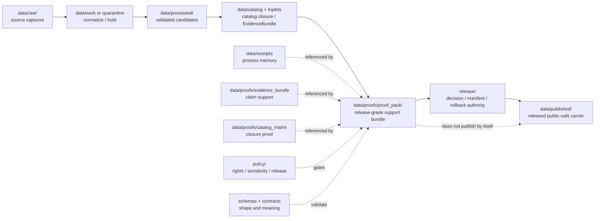

<!-- [KFM_META_BLOCK_V2]
doc_id: kfm://data/proofs/proof-pack/readme
title: data/proofs/proof_pack README
type: directory-readme
version: v0.1
status: draft
owners:
  - <data steward — TODO>
  - <proof steward — TODO>
  - <release steward — TODO>
  - <domain stewards — TODO>
created: 2026-06-25
updated: 2026-06-25
policy_label: public-review
path: data/proofs/proof_pack/README.md
related:
  - ../README.md
  - ../evidence_bundle/README.md
  - ../catalog_matrix/README.md
  - ../validation_report/README.md
  - ../citation_validation/README.md
  - ../integrity/README.md
  - ../../receipts/README.md
  - ../../catalog/README.md
  - ../../published/README.md
  - ../../../release/README.md
  - ../../../docs/adr/ADR-0011-receipts-vs-proofs-vs-manifests-vs-catalog-separation.md
  - ../../../docs/doctrine/directory-rules.md
  - ../../../docs/doctrine/lifecycle-law.md
  - ../../../docs/doctrine/trust-membrane.md
  - ../../../contracts/README.md
  - ../../../schemas/README.md
  - ../../../policy/README.md
tags:
  - kfm
  - data
  - proofs
  - proof-pack
  - evidence-bundle
  - catalog-matrix
  - citation-validation
  - validation-report
  - integrity
  - release-gate
  - rollback
  - correction
  - cite-or-abstain
notes:
  - "Parent directory README for ProofPack instances and domain proof-pack lanes. It is not itself a ProofPack schema, ProofPack instance, ReleaseManifest, catalog record, or policy bundle."
  - "ProofPacks are release-grade proof support; they may reference receipts, catalog records, release candidates, and published artifacts, but they do not replace any of those authority families."
  - "Promotion is a governed state transition, not a file move. A ProofPack supports review; it does not publish by placement."
[/KFM_META_BLOCK_V2] -->

<a id="top"></a>

# `data/proofs/proof_pack/`

> Parent lane for KFM **ProofPack** support objects. A ProofPack is a release-grade support bundle that gathers evidence, validation, policy, catalog, integrity, review, correction, and rollback references so a release steward can inspect whether a candidate artifact is ready to move toward publication.


> [!IMPORTANT]
> **Status:** `draft`  
> **Owner:** `<data steward>` · `<proof steward>` · `<release steward>` · `<domain stewards>` — TODO  
> **Path:** `data/proofs/proof_pack/README.md`  
> **Truth posture:** CONFIRMED doctrine / PROPOSED implementation guidance / NEEDS VERIFICATION for schemas, validators, CI workflows, emitted ProofPack instances, and complete domain coverage.

> [!WARNING]
> A ProofPack is **not** a receipt, catalog record, release manifest, promotion decision, rollback card, public layer, or published report. It may reference those artifacts, but it must not become their parallel authority.

---

## Quick jumps

| Section | Use it for |
|---|---|
| [1. Purpose](#1-purpose) | What ProofPacks do in KFM. |
| [2. Authority boundary](#2-authority-boundary) | How proof packs differ from receipts, catalog, release, and publication. |
| [3. What belongs here](#3-what-belongs-here) | Accepted ProofPack files and domain sublanes. |
| [4. What must not live here](#4-what-must-not-live-here) | Wrong homes and trust-membrane violations. |
| [5. Required ProofPack contents](#5-required-proofpack-contents) | Minimum fields / reference families. |
| [6. Domain sublane pattern](#6-domain-sublane-pattern) | How domains should use this parent lane. |
| [7. Naming and identity](#7-naming-and-identity) | Suggested file and folder naming. |
| [8. Lifecycle relationship](#8-lifecycle-relationship) | How ProofPacks sit beside RAW → PUBLISHED. |
| [9. Review and validation checklist](#9-review-and-validation-checklist) | What maintainers should check. |
| [10. Failure modes](#10-failure-modes) | Drift and overclaim patterns to block. |
| [11. Definition of done](#11-definition-of-done) | What is still needed for operational maturity. |

---

## 1. Purpose

`data/proofs/proof_pack/` stores **ProofPack instances and domain ProofPack lanes**. A ProofPack is a compact, inspectable support bundle for a release candidate, correction candidate, rollback candidate, or high-risk public-safe derived artifact.

A ProofPack should let a reviewer answer:

- What claim, layer, report, API payload, story, tile set, or graph projection is being considered?
- Which source descriptors, EvidenceBundles, catalog records, receipts, validators, policy decisions, review records, and release candidates support it?
- Which rights, sensitivity, source-role, geoprivacy, identity, temporal, geometry, and integrity gates passed or failed?
- What public surface is proposed, and what exact artifact IDs or digests would be released?
- What rollback target, correction path, stale-state behavior, and withdrawal path exist?
- What should happen when evidence is missing, ambiguous, stale, contradicted, or policy-blocked?

ProofPacks are especially useful where a domain artifact is not one simple object but a governed release bundle: public map layer, Evidence Drawer payload, Focus Mode answer set, source-derived report, county/regional proof slice, graph projection, PMTiles/GeoParquet layer, or public-safe API payload.

[Back to top](#top)

---

## 2. Authority boundary

KFM keeps artifact families separate so that process memory, proof support, discovery metadata, release decisions, and public artifacts cannot silently substitute for each other.

| Family | Canonical home | What it does | What it must not do |
|---|---|---|---|
| Receipts | `data/receipts/` | Record that a governed operation ran or a decision step occurred. | Act as release-grade proof by themselves. |
| ProofPacks | `data/proofs/proof_pack/` | Assemble release-grade support references and closure status. | Act as a ReleaseManifest, PromotionDecision, or public artifact. |
| EvidenceBundles | `data/proofs/evidence_bundle/` or referenced from domain proof lanes | Bind claims to evidence, source role, spatial/temporal scope, and support status. | Replace source payloads, policy decisions, or release decisions. |
| Catalog records | `data/catalog/{stac,dcat,prov,domain}/` | Provide discovery, interchange, and lineage carriers. | Approve release or serve as proof without dereferencing evidence. |
| Release decisions | `release/{candidates,manifests,promotion_decisions,rollback_cards,correction_notices,withdrawal_notices,signatures,changelog}/` | Govern promotion, release, correction, withdrawal, and rollback. | Store canonical ProofPack instances or raw source data. |
| Published artifacts | `data/published/<domain>/...` | Serve released public-safe carriers. | Contain RAW, WORK, QUARANTINE, proof packs, or release authority. |

> [!NOTE]
> A ProofPack can point to all of these families. It cannot collapse them. When the review path needs convenience, use stable IDs, digests, and indexes — not duplicate authority.

[Back to top](#top)

---

## 3. What belongs here

Use this folder for ProofPack files or domain lanes that are safe to store under repository policy and useful for release review.

| Accepted item | Suggested placement | Notes |
|---|---|---|
| Domain ProofPack lane README | `data/proofs/proof_pack/<domain>/README.md` | Explains domain-specific proof-pack gates. |
| Candidate ProofPack instance | `data/proofs/proof_pack/<domain>/candidates/<release_id>.proof-pack.json` | PROPOSED until schema and validator are confirmed. |
| Superseded ProofPack | `data/proofs/proof_pack/<domain>/retired/<release_id>.superseded-proof-pack.json` | Keep for audit; do not delete prior meaning silently. |
| ProofPack index | `data/proofs/proof_pack/<domain>/indexes/proof-pack-index.json` | Optional lookup aid; not the canonical truth source. |
| Valid / invalid fixtures | Prefer `fixtures/` or `tests/fixtures/` unless a local README explicitly scopes examples | Avoid competing fixture homes. Local fixtures here are PROPOSED until test strategy is verified. |
| Cross-domain release bundle support | `data/proofs/proof_pack/cross_domain/<scope>/` | Use only when a release candidate spans multiple domains and cannot be owned by one domain lane. |

### Known authored sublanes

| Lane | Purpose | Special gates |
|---|---|---|
| [`atmosphere/`](./atmosphere/) | ProofPack support for air, AQI, smoke, weather, climate, model fields, remote-sensing, advisory context, and public-safe atmosphere products. | AQI is not concentration; AOD is not PM2.5; model fields are not observations; low-cost sensors require correction/caveats/confidence/limitations. |
| [`flora/`](./flora/) | ProofPack support for plant taxonomy, specimen/occurrence evidence, vegetation communities, rare plants, geoprivacy, phenology, restoration, and public-safe botanical surfaces. | Exact rare/protected/culturally sensitive/steward-reviewed locations fail closed; source roles and public/restricted occurrence split must be preserved. |

> [!TIP]
> New domain sublanes should be boring and responsibility-rooted: `data/proofs/proof_pack/<domain>/README.md`. Do not create new root folders for domains.

[Back to top](#top)

---

## 4. What must not live here

| Excluded material | Correct home or action | Why |
|---|---|---|
| Raw source payloads, downloads, vendor exports, rasters, scans, logs, or source-system dumps | `data/raw/`, `data/work/`, or `data/quarantine/` | ProofPacks reference source material; they do not store it. |
| Process-only receipts with no release-proof context | `data/receipts/` | Receipts are process memory, not proof packs. |
| ReleaseManifest, PromotionDecision, ReleaseDecision, CorrectionNotice, WithdrawalNotice, RollbackCard, release signatures | `release/` | Release authority must remain separate from proof support. |
| STAC/DCAT/PROV discovery records as primary artifacts | `data/catalog/` | Catalog is discovery/interchange, not ProofPack authority. |
| Public map layers, PMTiles, GeoParquet, API payloads, reports, or stories | `data/published/` after release gates | Published artifacts are downstream carriers. |
| Policy logic, Rego/OPA bundles, sensitivity rules, release rules | `policy/` | ProofPacks record policy outcomes; they do not define policy. |
| Machine schemas | `schemas/contracts/v1/...` | Shape belongs in schemas. |
| Semantic contracts | `contracts/...` | Meaning belongs in contracts. |
| AI summaries as proof | Governed API / Focus Mode outputs may cite ProofPacks but cannot replace them | Generated language is interpretive, not root truth. |
| Sensitive exact locations or living-person/private data in public-review files | Quarantine, restrict, redact, generalize, or deny | Proof lanes may be more broadly reviewed than restricted stores. |

[Back to top](#top)

---

## 5. Required ProofPack contents

A complete ProofPack should be a structured object with stable references, finite outcomes, and digest closure. The exact schema is **PROPOSED** until verified.

| Field family | Required meaning | Example values / references |
|---|---|---|
| `proof_pack_id` | Stable deterministic ID for the proof bundle. | `kfm-proof-pack:<domain>:<release_id>:<digest>` |
| `domain` | Primary domain lane or `cross_domain`. | `flora`, `atmosphere`, `hydrology`, `hazards`, `cross_domain` |
| `scope` | What candidate the ProofPack supports. | Layer, report, API payload, Focus Mode slice, graph projection, correction, rollback. |
| `release_candidate_refs` | Candidate release IDs without claiming release. | `release/candidates/<domain>/<release_id>/...` |
| `source_descriptor_refs` | Source identity, role, rights, sensitivity, cadence, and citation. | `data/registry/sources/...` or domain source descriptor IDs. |
| `evidence_bundle_refs` | Evidence support for the exact claims. | EvidenceBundle IDs, digests, and resolved status. |
| `receipt_refs` | Process memory for fetch, transform, validation, redaction, model, AI, migration, release-time actions. | RunReceipt, TransformReceipt, ValidationReceipt, AIReceipt, RedactionReceipt. |
| `validation_report_refs` | Deterministic validator outcomes. | pass/fail/warn/skip; expected finite result codes. |
| `policy_decision_refs` | Rights, sensitivity, release, consent, runtime, geoprivacy, access decisions. | allow/restrict/deny/abstain/error with reason. |
| `catalog_refs` | Catalog closure references. | STAC, DCAT, PROV, domain index, CatalogMatrix. |
| `integrity_refs` | Digests, hashes, Merkle references, signature refs, spec hash. | Input/output digests, validator version, schema version. |
| `review_refs` | Steward review or separation-of-duty records. | ReviewRecord IDs, reviewer role, outcome, timestamp. |
| `rollback_refs` | Rollback target and correction/withdrawal support. | RollbackCard ID, CorrectionNotice ID, invalidation list. |
| `outcome` | Finite review-support result. | `READY_FOR_RELEASE_REVIEW`, `HOLD`, `DENY`, `ABSTAIN`, `ERROR`, `WITHDRAW`. |

### Minimal JSON shape, PROPOSED

```json
{
  "proof_pack_id": "kfm-proof-pack:<domain>:<release_id>:<digest>",
  "domain": "<domain>",
  "scope": {
    "release_candidate_id": "<release_id>",
    "artifact_kind": "layer | api_payload | report | story | focus_mode | graph_projection | correction | rollback",
    "spatial_scope": "<id-or-description>",
    "temporal_scope": "<time-kind-aware-scope>",
    "public_surface": "<governed-api-or-published-artifact-ref>"
  },
  "source_descriptor_refs": [],
  "evidence_bundle_refs": [],
  "receipt_refs": [],
  "validation_report_refs": [],
  "policy_decision_refs": [],
  "catalog_refs": [],
  "integrity_refs": [],
  "review_refs": [],
  "rollback_refs": [],
  "outcome": "HOLD",
  "reasons": [],
  "created_at": "<iso8601>",
  "created_by": "<tool-or-steward>",
  "schema_version": "PROPOSED"
}
```

[Back to top](#top)

---

## 6. Domain sublane pattern

Domain lanes under `data/proofs/proof_pack/` should be narrow, testable, and aligned with the owning domain docs.

```text
data/proofs/proof_pack/
├── README.md
├── <domain>/
│   ├── README.md
│   ├── candidates/
│   ├── indexes/
│   └── retired/
└── cross_domain/
    └── <scope>/
```

Use domain sublanes when one domain owns the release candidate. Use `cross_domain/` only when the proof candidate is explicitly compositional and no single domain owns the release decision alone.

### Domain README requirements

Each `data/proofs/proof_pack/<domain>/README.md` should include:

- domain-specific proof-pack purpose;
- placement and authority boundary;
- required support bundle;
- domain-specific denial gates;
- what must not be stored there;
- proposed file pattern;
- lifecycle diagram;
- validation checklist;
- failure modes;
- definition of done.

[Back to top](#top)

---

## 7. Naming and identity

Suggested directory pattern:

```text
data/proofs/proof_pack/<domain>/candidates/<release_id>.proof-pack.json
```

Suggested deterministic file name:

```text
<domain>.proof_pack.<scope>.<release_or_run_id>.<short_hash>.json
```

Examples:

```text
atmosphere.proof_pack.pm25-hourly-kansas.v0.1.0123abcd.json
flora.proof_pack.rare-plant-generalized-occurrence.v0.1.89ab4567.json
hydrology.proof_pack.huc12-public-safe-layer.v0.1.4567cdef.json
hazards.proof_pack.floodplain-context-layer.v0.1.cdef0123.json
```

> [!CAUTION]
> This naming pattern is guidance, not global identity law, until it is backed by a semantic contract, JSON Schema, validator, fixtures, and CI enforcement.

[Back to top](#top)

---

## 8. Lifecycle relationship

ProofPacks sit beside the lifecycle as proof support. They do not replace lifecycle phases.



Promotion still requires release authority under `release/`, not ProofPack placement.

[Back to top](#top)

---

## 9. Review and validation checklist

Before any ProofPack is used in promotion review, verify:

- [ ] It identifies the domain, release candidate, artifact kind, spatial scope, temporal scope, and intended public surface.
- [ ] Every material claim resolves to EvidenceBundle support or the ProofPack records `ABSTAIN`, `DENY`, `HOLD`, or `ERROR`.
- [ ] SourceDescriptor refs include role, rights, sensitivity, cadence, source time, retrieval time, citation, and digest where applicable.
- [ ] Receipts are referenced but not treated as proof by themselves.
- [ ] ValidationReport refs include both happy-path and negative-path validation where relevant.
- [ ] PolicyDecision refs cover rights, sensitivity, release, access, consent, geoprivacy, or domain-specific policy gates as applicable.
- [ ] Catalog refs prove discovery/lineage closure without treating catalog metadata as release approval.
- [ ] Integrity refs include input/output digests and schema/validator version where available.
- [ ] Review refs capture required stewardship and separation-of-duty decisions.
- [ ] Release refs point to `release/` without moving release authority into `data/proofs/`.
- [ ] Rollback/correction/withdrawal refs are traceable before publication.
- [ ] Sensitive exact locations, living-person data, raw genomic data, private parcel joins, archaeological/cultural sensitivity, rare species coordinates, infrastructure vulnerability, or other protected materials are denied, redacted, generalized, staged, or held according to policy.
- [ ] Public clients consume only governed APIs or released artifacts, never this ProofPack path directly.

[Back to top](#top)

---

## 10. Failure modes

| Failure mode | Why it matters | Required response |
|---|---|---|
| ProofPack stored in `data/receipts/` | Collapses proof support with process memory. | Move to this lane; leave receipt refs in `data/receipts/`. |
| ReleaseManifest stored in `data/proofs/proof_pack/` | Collapses release authority with proof support. | Move release authority to `release/manifests/`; keep only a reference here. |
| ProofPack includes raw source payloads | Collapses proof support with source storage. | Move payloads to RAW/WORK/QUARANTINE; keep refs/digests. |
| Catalog metadata is treated as evidence | Discovery carrier becomes truth source. | Require EvidenceBundle dereference and citation validation. |
| Published layer consumes ProofPack directly | Bypasses governed API and release gates. | Deny direct path; use ReleaseManifest and published artifact lane. |
| AI output replaces ProofPack support | Generated language becomes root truth. | Deny; require EvidenceBundle and ProofPack refs. |
| Sensitive data leaks through proof bundle | Review files become exposure channel. | Quarantine, redact, rotate identifiers if needed, emit correction/incident record. |
| ProofPack has no rollback target | Release is not reversible. | Hold release review until rollback support exists. |

[Back to top](#top)

---

## 11. Definition of done

This parent lane is operationally useful when:

- [ ] `contracts/` contains the semantic ProofPack contract.
- [ ] `schemas/contracts/v1/...` contains the machine-checkable ProofPack schema.
- [ ] `tools/` or approved validator home includes a ProofPack validator.
- [ ] Fixtures include valid and invalid ProofPacks across at least one low-risk and one high-risk domain.
- [ ] CI blocks unresolved EvidenceRefs, missing policy decisions, release-authority collapse, missing rollback support, and unsafe sensitive content.
- [ ] Domain sublane READMEs exist for active domains before live ProofPack instances land there.
- [ ] `release/` docs cross-link the ProofPack closure requirement.
- [ ] `data/receipts/`, `data/catalog/`, `data/published/`, and `release/` READMEs all preserve the family separation rule.
- [ ] At least one synthetic no-network release candidate demonstrates `receipt → proof → catalog closure → release manifest → published artifact → rollback` traceability without direct RAW/WORK/QUARANTINE exposure.

---

## Maintainer note

ProofPacks should make review easier without making governance invisible. Keep them compact, reference-rich, deterministic, and reversible. When evidence, policy, release state, or rollback support is incomplete, the correct outcome is `HOLD`, `ABSTAIN`, `DENY`, or `ERROR` — not a polished public artifact.
