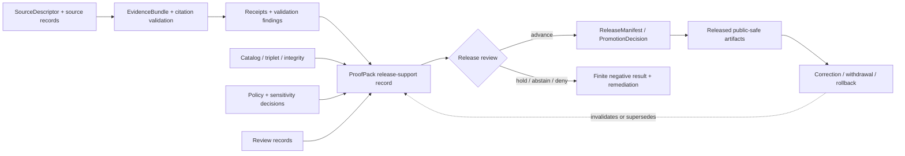

<!-- [KFM_META_BLOCK_V2]
doc_id: kfm://data/proofs/proof-pack/readme
title: data/proofs/proof_pack/ — ProofPack Release-Support Lane
version: v0.2.0
type: directory-readme; proof-family-guide; proof-pack-release-support
status: repository-grounded draft; parent and child proof lanes confirmed; ProofPack contract/schema/validator surface not established
owners: NEEDS VERIFICATION — data, proof, evidence, validation, policy, release, correction, rollback, domain, and docs stewards
created: 2026-06-25
updated: 2026-07-26
supersedes: v0.1 at the same path; documentation only
prepared_under_prompt: KFM Markdown Modernization & GitHub Documentation Implementation Agent v4.0.0
policy_label: restricted-review; proof-support; release-gated; no-direct-public-path; cite-or-abstain
current_path: data/proofs/proof_pack/README.md
truth_posture: >
  CONFIRMED exact target path and prior blob, canonical parent proof contract,
  Directory Rules v1.4, proposed ADR-0011 authority separation, modernized
  EvidenceBundle and citation-validation sibling lanes, and Atmosphere/Flora
  ProofPack child READMEs / PROPOSED ProofPack semantic profile, instance shape,
  validator, fixture, review, release, correction, and rollback closure / UNKNOWN
  recursive ProofPack inventory, active writers and consumers, production release
  assembly, access controls, public routes, caches, and operational rollback /
  NEEDS VERIFICATION accountable owners, accepted ProofPack contract and schema,
  deterministic validators and fixtures, CI enforcement, retention, invalidation,
  and separation-of-duty review

evidence_snapshot:
  repository: bartytime4life/Kansas-Frontier-Matrix
  base_ref: main
  base_commit: 4ce20df8b12d640fa527147407a24f56d61e0b46
  prior_blob: b03674bebb03252511cb76e03b949e885a9fd79f
  directory_rules_blob: 2affb080e6f0043867c64c7f06c1ca52030fbd55
  proofs_root_blob: 0d8b6e92d3b4b9ff3961d29c53ead497922a31cf
  adr_0011_blob: 40b0f47b87d584040803ed76aa6b31f5204b7fca
  atmosphere_child_blob: 42b947efd1cb7b68b0ba99b445c520ba63d210af
  flora_child_blob: b09212e278121a317652d1b9106d2fdbca267a96
notes:
  - "Same-path Markdown modernization only; no ProofPack payloads, contracts, schemas, policies, validators, fixtures, workflows, releases, routes, or publication state changed."
  - "ProofPack supports release review but does not become a ReleaseManifest, PromotionDecision, receipt, catalog record, published artifact, or public answer authority."
  - "Exact paths checked for contracts/evidence/proof_pack.md, schemas/contracts/v1/evidence/proof_pack.schema.json, and tools/validators/validate_proof_pack.py were not found at the pinned base; absence is bounded to those exact paths."
  - "Rollback target for v0.2.0 is prior blob b03674bebb03252511cb76e03b949e885a9fd79f."
[/KFM_META_BLOCK_V2] -->

<a id="top"></a>
<a id="dataproofsproof_pack"></a>

# `data/proofs/proof_pack/` — ProofPack Release-Support Lane

> **One-line purpose.** Hold or index governed ProofPack support records that assemble evidence, validation, policy, catalog, integrity, review, correction, and rollback dependencies for a release decision without becoming that decision or a public artifact.

[](#status)
[](#authority-level)
[](#status)
[](#current-bounded-child-lane-index)
[](#validation)
[](#outputs)

> [!IMPORTANT]
> A ProofPack is release-support evidence, not release authority. It may help a reviewer decide whether a candidate is ready for release review, but it does not create a `ReleaseManifest`, `PromotionDecision`, correction, rollback, publication state, or public claim.

> [!CAUTION]
> Do not place restricted source payloads, exact sensitive locations, credentials, private endpoints, hidden redaction parameters, or other control-defeating details in an ordinary repository ProofPack lane.

**Quick navigation:** [Purpose](#purpose) · [Authority](#authority-level) · [Status](#status) · [Belongs](#what-belongs-here) · [Exclusions](#what-does-not-belong-here) · [Inputs](#inputs) · [Outputs](#outputs) · [Validation](#validation) · [Review](#review-burden) · [Related](#related-folders) · [ADRs](#adrs) · [Last reviewed](#last-reviewed) · [Operating model](#operating-model) · [Packet contract](#proofpack-support-packet) · [Children](#current-bounded-child-lane-index) · [Outcomes](#finite-outcomes-and-guardrails) · [Correction](#correction-withdrawal-invalidation-and-rollback) · [Verification](#open-verification-register) · [No-loss](#no-loss-ledger)

---

## Purpose

`data/proofs/proof_pack/` is the parent proof-family lane for ProofPack release-support records and domain sublanes. Its responsibility is to make a release candidate's support inspectable by assembling stable references and closure findings across evidence, validation, policy, catalog, integrity, review, correction, withdrawal, and rollback families.

A ProofPack should let a reviewer determine:

1. what exact claim, layer, report, API payload, story, tile archive, graph projection, Focus Mode slice, correction, or rollback candidate is under review;
2. which source descriptors and EvidenceBundles support that scope;
3. which validators and policy decisions ran, and what they actually proved;
4. which catalog, integrity, review, release, correction, and rollback dependencies remain open;
5. whether the candidate should advance, hold, abstain, deny, withdraw, or error under the applicable profile.

Directory placement does not make a ProofPack complete, accepted, reviewed, released, public-safe, or authoritative.

## Authority level

**Implementation-bearing proof-support lane inside the canonical `data/proofs/` responsibility.**

<a id="2-authority-boundary"></a>

| Responsibility | Owning surface | This lane's relationship |
|---|---|---|
| ProofPack meaning | Accepted semantic contract under `contracts/` | Consumes the contract; no accepted ProofPack contract was established at the checked path. |
| ProofPack machine shape | Accepted schema under `schemas/contracts/v1/` | Consumes the schema; no ProofPack schema was established at the checked path. |
| ProofPack instances and indexes | `data/proofs/proof_pack/` | This lane may hold accepted-profile proof-support records and domain indexes. |
| Process memory | `data/receipts/` | Referenced, never absorbed. |
| Evidence closure | `data/proofs/evidence_bundle/` | Required support family; ProofPack does not replace EvidenceBundle. |
| Citation-validation support | `data/proofs/citation_validation/` | Referenced findings; not duplicated as authority. |
| Catalog and provenance | `data/catalog/` | Discovery/interchange carrier; not release approval. |
| Policy and sensitivity | `policy/` | Decides admissibility and obligations; ProofPack records references and findings. |
| Release, correction, withdrawal, rollback | `release/` | Owns release-governance decisions and records. |
| Public artifacts | `data/published/` | Downstream only after governed release. |
| Runtime/API/UI/AI | governed delivery surfaces | May consume released proof summaries; must not read this lane as a direct public service. |

## Status

| Surface | Bounded current result | Safe interpretation |
|---|---|---|
| Target path and README | **CONFIRMED** | Existing v0.1 document upgraded in place. |
| Parent proof root | **CONFIRMED repository document / draft** | Establishes proof-support responsibility and no-direct-public-path posture. |
| Atmosphere child README | **CONFIRMED** | Domain-specific ProofPack guidance exists; emitted instances and enforcement remain unverified. |
| Flora child README | **CONFIRMED** | Domain-specific sensitive ProofPack guidance exists; emitted instances and enforcement remain unverified. |
| ADR-0011 | **CONFIRMED file / `proposed` status** | Supports receipt/proof/catalog/release separation but is not accepted or enforced by this README. |
| ProofPack semantic contract | **NOT ESTABLISHED at checked exact path** | Do not claim canonical field meaning beyond documented proposals. |
| ProofPack machine schema | **NOT ESTABLISHED at checked exact path** | Proposed JSON shapes remain illustrative. |
| Dedicated ProofPack validator | **NOT ESTABLISHED at checked exact path** | No validator behavior or CI enforcement is claimed. |
| Recursive ProofPack instances | **UNKNOWN** | No recursive payload inventory or sensitive-content inspection was performed. |
| Active writers, consumers, release assembly, public routes | **UNKNOWN** | Presence of documentation establishes none of these states. |

<a id="3-what-belongs-here"></a>

## What belongs here

Good fits are accepted-profile ProofPack support records and indexes that preserve scope, references, findings, limitations, and lifecycle dependencies without duplicating the underlying authorities:

- candidate ProofPack instances for a bounded release, correction, withdrawal, or rollback review;
- domain ProofPack indexes and lane READMEs;
- claim/layer/report/API/story/tile/graph/Focus-Mode-to-proof maps;
- digest-closure summaries covering referenced evidence, receipts, catalog records, candidate artifacts, and release dependencies;
- stable negative-state support explaining why release review must hold, abstain, deny, withdraw, or error;
- supersession, migration, compatibility, retention, and disposition sidecars that preserve audit lineage;
- cross-domain ProofPacks only when a release candidate genuinely spans multiple domains and no single domain lane owns the complete proof scope.

Accepted records should prefer stable identifiers, hashes, and bounded summaries over duplicated source payloads.

<a id="4-what-must-not-live-here"></a>

## What does NOT belong here

| Do not place here | Correct home or action |
|---|---|
| RAW, WORK, QUARANTINE, or canonical PROCESSED payloads | Their governed lifecycle lanes |
| Source descriptors and source-activation authority | `data/registry/sources/` and governed source-intake surfaces |
| Process receipts as primary records | `data/receipts/` |
| Canonical EvidenceBundle records | `data/proofs/evidence_bundle/` or the accepted evidence-proof home |
| Citation-validation records as primary authority | `data/proofs/citation_validation/` |
| STAC, DCAT, PROV, or domain catalog records as primary records | `data/catalog/` |
| Contracts, schemas, or policy modules | `contracts/`, `schemas/`, `policy/` |
| ReleaseManifest, PromotionDecision, CorrectionNotice, WithdrawalNotice, RollbackCard, or signatures as authority records | `release/` |
| Public PMTiles, GeoParquet, COG, API payloads, reports, stories, layers, or exports | `data/published/` after release |
| Secrets, private endpoints, exact protected geometry, living-person/private data, or unsafe logs | Approved restricted storage, quarantine, redaction, generalization, staged access, or denial |
| Generated language, screenshots, map pixels, graph edges, or badges used as proof | Resolve admissible evidence or abstain |

## Inputs

A ProofPack may reference only governed records and must preserve missing, stale, conflicted, denied, withdrawn, or inaccessible states instead of inventing closure.

As applicable, inputs include:

- stable candidate identity, artifact kind, scope, version, and content digest;
- SourceDescriptor and source-role references;
- EvidenceBundle and citation-validation references;
- RunReceipt, TransformReceipt, ValidationReport, RedactionReceipt, AIReceipt, migration, and related process-memory references;
- contract/schema profile identifiers and validator versions;
- rights, sensitivity, policy, access, and review decisions;
- catalog/triplet identities and integrity findings;
- release-candidate references and intended public surfaces;
- correction, supersession, withdrawal, invalidation, retention, and rollback dependencies.

Inputs remain references to their governing records. This lane must not duplicate protected content merely to make review convenient.

## Outputs

A ProofPack output should identify:

- the exact candidate and claim/artifact scope under review;
- the named ProofPack profile and version;
- every referenced evidence, receipt, validation, policy, catalog, integrity, review, release, correction, withdrawal, and rollback dependency;
- stable findings, limitations, unresolved dependencies, and stale/conflict state;
- a finite review-support result;
- deterministic identity and integrity information sufficient to detect drift or substitution.

Outputs support steward review and release assembly. They are not public claims, runtime envelopes, release approvals, or publication state. Public clients must not read this proof lane directly.

## Validation

At minimum, an accepted ProofPack profile should validate:

1. placement, stable identity, version, schema/contract profile, and digest;
2. exact candidate and claim/artifact scope;
3. SourceDescriptor identity, source role, rights, cadence, and citation dependencies;
4. EvidenceBundle and citation-validation closure for the stated scope;
5. receipt and transform references without treating receipts as proof by themselves;
6. deterministic validator findings and profile coverage;
7. policy, rights, sensitivity, geoprivacy, access, and reviewer obligations;
8. catalog/triplet and integrity agreement;
9. release-candidate, correction, withdrawal, invalidation, and rollback dependencies;
10. sensitive-content minimization and no-direct-public-path behavior;
11. deterministic finite outcomes and stable finding identifiers;
12. supersession, retention, and audit-lineage behavior.

No accepted ProofPack schema, dedicated validator, fixture suite, or CI enforcement was established at the checked exact paths. A future pass proves only its declared profile and evidence snapshot; it does not prove factual truth, policy clearance, release readiness, or publication by itself.

## Review burden

Accountable ownership remains **NEEDS VERIFICATION**.

Changes should include proof, evidence, validation, policy, release, correction, rollback, and affected domain stewards as applicable. Independent rights/sensitivity review is required when living-person data, DNA/genomics, rare species, archaeology, cultural/sovereignty concerns, land/title data, precise infrastructure, protected facilities, or harmful-precision geometry could be exposed.

CODEOWNERS routing, automated checks, schema validity, a signed receipt, or a passing ProofPack validator do not substitute for approval evidence or separation of duties.

## Related folders

- Parent proof contract: [`../README.md`](../README.md)
- Confirmed child lanes: [`atmosphere/`](atmosphere/README.md) · [`flora/`](flora/README.md)
- Evidence support: [`../evidence_bundle/`](../evidence_bundle/README.md) · [`../citation_validation/`](../citation_validation/README.md) · [`../validation_report/`](../validation_report/README.md)
- Process memory: [`../../receipts/`](../../receipts/README.md)
- Catalog and lifecycle: [`../../catalog/`](../../catalog/README.md) · [`../../processed/`](../../processed/README.md) · [`../../published/`](../../published/README.md)
- Authority roots: [`../../../contracts/`](../../../contracts/README.md) · [`../../../schemas/`](../../../schemas/README.md) · [`../../../policy/`](../../../policy/README.md) · [`../../../release/`](../../../release/README.md)
- Doctrine: [`../../../docs/doctrine/directory-rules.md`](../../../docs/doctrine/directory-rules.md) · [`../../../docs/doctrine/lifecycle-law.md`](../../../docs/doctrine/lifecycle-law.md) · [`../../../docs/doctrine/trust-membrane.md`](../../../docs/doctrine/trust-membrane.md)

## ADRs

[`ADR-0011`](../../../docs/adr/ADR-0011-receipts-vs-proofs-vs-manifests-vs-catalog-separation.md) is confirmed at `proposed` status. It supports distinct responsibility boundaries among receipts, proofs, catalogs, release-governance records, and published artifacts, but this README does not accept or enforce it by implication.

An accepted ADR plus contracts, schemas, migration, compatibility, validation, review, correction, and rollback plans is required before this lane becomes a second receipt home, catalog home, release-manifest home, public service, or replacement for domain proof lanes.

## Last reviewed

- **Date:** 2026-07-26
- **Evidence boundary:** `main@4ce20df8b12d640fa527147407a24f56d61e0b46`
- **Review type:** complete target README, parent proof contract, Directory Rules, ADR-0011, exact-path contract/schema/validator checks, and confirmed Atmosphere/Flora child READMEs
- **Recursive ProofPack payload or sensitive-content inspection:** not performed
- **Owners, accepted ProofPack profile, retention, deployed release assembly, invalidation propagation, and rollback drills:** need verification

Re-review when a ProofPack contract/schema/profile, child lane, validator, workflow, release assembly, public consumer, correction mechanism, or rollback dependency changes—or within six months.

## Operating model


```mermaid
flowchart LR
    SRC["SourceDescriptor + source records"] --> EB["EvidenceBundle + citation validation"]
    EB --> REC["Receipts + validation findings"]
    REC --> PP["ProofPack release-support record"]
    CAT["Catalog / triplet / integrity"] --> PP
    POL["Policy + sensitivity decisions"] --> PP
    REV["Review records"] --> PP
    PP --> DEC{"Release review"}
    DEC -->|advance| REL["ReleaseManifest / PromotionDecision"]
    DEC -->|hold / abstain / deny| NEG["Finite negative result + remediation"]
    REL --> PUB["Released public-safe artifacts"]
    PUB --> CORR["Correction / withdrawal / rollback"]
    CORR -. invalidates or supersedes .-> PP
```

The diagram is a responsibility and review flow, not evidence that runtime orchestration exists.

<a id="5-required-proofpack-contents"></a>

## ProofPack support packet

The exact machine schema is **PROPOSED** until an accepted contract and schema exist. A reviewable support packet should cover these families:

| Family | Minimum support | Boundary |
|---|---|---|
| Identity | `proof_pack_id`, profile/version, candidate identity, scope, content/spec digests | Identity is not release status. |
| Sources | SourceDescriptor refs, source roles, rights, cadence, citations | Do not duplicate source payloads. |
| Evidence | EvidenceBundle and citation-validation refs | Evidence closure is necessary, not sufficient. |
| Receipts | Run/transform/validation/redaction/AI/migration refs | Receipts are process memory. |
| Validation | Named profiles, validator versions, stable findings, limitations | A passing check proves only its declared scope. |
| Policy | Rights, sensitivity, geoprivacy, access, release, and obligation decisions | ProofPack does not decide policy. |
| Catalog/integrity | STAC/DCAT/PROV/domain/triplet refs, hashes, signatures, Merkle or equivalent integrity refs where applicable | Catalog and integrity are separate authorities. |
| Review | ReviewRecord refs, reviewer roles, separation-of-duty posture | CODEOWNERS is not approval. |
| Release dependency | Candidate release refs and intended public artifacts | No release approval is stored here. |
| Correction/rollback | Correction, withdrawal, invalidation, supersession, retention, and rollback refs | Silent mutation is prohibited. |
| Outcome | One finite review-support state plus reason/finding codes | Must not invent a universal policy/runtime enum. |

<details>
<summary><strong>Illustrative packet shape — PROPOSED, not a current schema</strong></summary>

```json
{
  "proof_pack_id": "kfm-proof-pack:<domain>:<candidate>:<digest>",
  "profile": "kfm-proof-pack/<version>",
  "scope": {
    "candidate_id": "<candidate-id>",
    "artifact_kind": "layer | api_payload | report | story | tile_archive | focus_mode | graph_projection | correction | rollback"
  },
  "source_descriptor_refs": [],
  "evidence_bundle_refs": [],
  "receipt_refs": [],
  "validation_report_refs": [],
  "policy_decision_refs": [],
  "catalog_refs": [],
  "integrity_refs": [],
  "review_refs": [],
  "release_candidate_refs": [],
  "correction_refs": [],
  "rollback_refs": [],
  "outcome": "READY_FOR_RELEASE_REVIEW | HOLD | ABSTAIN | DENY | ERROR | WITHDRAW",
  "finding_codes": [],
  "limitations": []
}
```

</details>

## Current bounded child-lane index

| Child lane | Current bounded posture |
|---|---|
| [`atmosphere/`](atmosphere/README.md) | Confirmed README with Atmosphere-specific knowledge-character, freshness, unit, caveat, and public-safety gates; emitted ProofPacks and enforcement unverified. |
| [`flora/`](flora/README.md) | Confirmed README with taxonomy, source-role, geoprivacy, rare-plant, join-sensitivity, correction, and rollback gates; emitted ProofPacks and enforcement unverified. |

Additional domain lanes are not claimed from omission or expectation. Add them only after path presence, role, profile, review burden, and non-duplication are verified.

## Finite outcomes and guardrails

Keep outcome vocabularies surface-specific:

| Surface | Appropriate posture |
|---|---|
| ProofPack review support | A named profile may use `READY_FOR_RELEASE_REVIEW`, `HOLD`, `ABSTAIN`, `DENY`, `ERROR`, and `WITHDRAW` after acceptance. |
| Governed runtime | Use the applicable runtime contract, commonly `ANSWER`, `ABSTAIN`, `DENY`, or `ERROR`. |
| Policy evaluation | Use the accepted policy contract; do not invent a universal enum. |
| Release decision | Use the accepted PromotionDecision/ReleaseManifest vocabulary. |

Guardrails:

- missing or unresolved evidence cannot be completed by generated rationale;
- receipt presence cannot replace evidence or review closure;
- a catalog item, signature, or hash cannot become release approval;
- a ProofPack cannot promote itself or write `PUBLISHED` state;
- stale, superseded, corrected, withdrawn, or invalidated support must propagate into review findings;
- failed or unavailable checks remain visible and block higher-risk claims as required;
- domain-specific safety gates remain stricter than this parent guide where appropriate.

## Correction, withdrawal, invalidation, and rollback

When a referenced source, EvidenceBundle, receipt, validation result, policy decision, catalog record, artifact digest, review, or release dependency is corrected, superseded, withdrawn, invalidated, or made inaccessible:

1. preserve the original ProofPack identity and content for audit unless policy requires restricted retention;
2. mark or supersede the ProofPack through an accepted mechanism rather than mutating relied-upon history silently;
3. identify downstream release candidates, manifests, public artifacts, caches, exports, drawers, indexes, and AI contexts that depend on it;
4. emit or reference the governing correction, withdrawal, invalidation, or rollback record under its owning authority root;
5. re-run the accepted ProofPack profile before any replacement advances;
6. retain the prior rollback target and explain why the replacement differs.

This README changes no correction, withdrawal, cache, or rollback behavior.

## Open verification register

| Item | Status | Required evidence |
|---|---:|---|
| Accepted ProofPack meaning and profile | `NEEDS VERIFICATION` | Accepted contract, profile/version register, compatibility rules |
| Machine schema | `NOT ESTABLISHED at checked path` | Canonical JSON Schema and schema-home confirmation |
| Validator and fixture coverage | `NOT ESTABLISHED at checked path` | Dedicated validator, valid/invalid fixtures, deterministic negative tests |
| Recursive ProofPack inventory | `UNKNOWN` | Pinned tree, payload families, hashes, rights/sensitivity review |
| Writers and consumers | `UNKNOWN` | Pipeline/tool/release/runtime/API/UI dependency inventory |
| Release assembly and separation of duties | `UNKNOWN` | Accepted workflow, review records, promotion decisions, release manifests |
| Correction/invalidation propagation | `NEEDS VERIFICATION` | Dependency graph, notices, cache/export invalidation tests |
| Retention and restricted review | `NEEDS VERIFICATION` | Retention policy, access controls, deletion/withdrawal obligations |
| Operational rollback drills | `NEEDS VERIFICATION` | Dry-run records tied to actual release dependencies |

Unknowns narrow claims and hold higher-risk transitions; they do not invite plausible defaults.

## No-loss ledger

| Prior element | Disposition in v0.2.0 |
|---|---|
| Stable path and `doc_id` | Preserved |
| ProofPack release-support purpose | Preserved and clarified |
| Receipt/proof/catalog/release/publication separation | Preserved and strengthened |
| Atmosphere and Flora child-lane identity | Preserved and linked |
| Proposed ProofPack field families | Preserved as a bounded illustrative packet; not promoted to schema fact |
| Lifecycle and promotion boundaries | Preserved |
| Rights, sensitivity, geoprivacy, correction, withdrawal, and rollback controls | Preserved and expanded |
| Prior anchors | Legacy top and numbered-purpose/authority/content anchors retained where practical |
| Prior blob and rollback target | Recorded |
| Payload, move, deletion, migration, release, or public-state change | None |

### Change history

#### v0.2.0 — 2026-07-26

- normalized the parent lane to the Directory Rules folder-README contract;
- reconciled current parent, child, and ADR evidence;
- made exact-path ProofPack contract/schema/validator gaps explicit;
- separated ProofPack review outcomes from policy, runtime, and release vocabularies;
- added correction, invalidation, verification, and no-loss controls;
- modernized navigation and presentation without creating authority.

[Back to top](#top)
