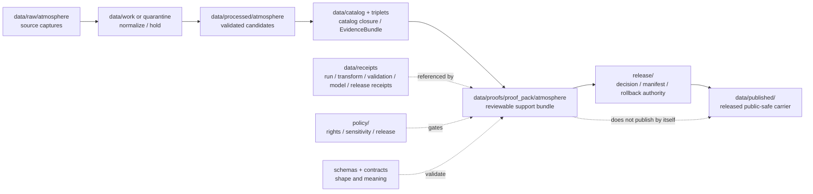

<!-- [KFM_META_BLOCK_V2]
doc_id: kfm://data/proofs/proof-pack/atmosphere/readme
title: data/proofs/proof_pack/atmosphere README
type: directory-readme
version: v0.1
status: draft
owners:
  - <data steward — TODO>
  - <proof steward — TODO>
  - <atmosphere-domain steward — TODO>
  - <release steward — TODO>
created: 2026-06-25
updated: 2026-06-25
policy_label: public-review
path: data/proofs/proof_pack/atmosphere/README.md
related:
  - ../../README.md
  - ../README.md
  - ../../atmosphere/README.md
  - ../../../receipts/README.md
  - ../../../catalog/README.md
  - ../../../published/README.md
  - ../../../../docs/domains/atmosphere/ARCHITECTURE.md
  - ../../../../docs/domains/atmosphere/DATA_LIFECYCLE.md
  - ../../../../docs/doctrine/directory-rules.md
  - ../../../../release/README.md
  - ../../../../policy/README.md
  - ../../../../schemas/README.md
  - ../../../../contracts/README.md
tags:
  - kfm
  - data
  - proofs
  - proof-pack
  - atmosphere
  - air
  - climate
  - smoke
  - evidence-bundle
  - validation-report
  - release-gate
  - rollback
notes:
  - "Directory README for Atmosphere proof-pack support. It is not itself a ProofPack instance, schema, policy bundle, release manifest, or catalog record."
  - "Atmosphere proof packs must preserve knowledge-character labels: AQI is not concentration, AOD is not PM2.5, model fields are not observations, and low-cost sensors require caveats/correction before release."
  - "Atmosphere/Air carries evidence-labeled context and public-safe products; it is not an emergency alerting or life-safety instruction system."
[/KFM_META_BLOCK_V2] -->

<a id="top"></a>

# `data/proofs/proof_pack/atmosphere/`

> Domain lane for **Atmosphere / Air / Climate ProofPack support**. Files under this directory should assemble the evidence, validation, policy, catalog, review, release, correction, and rollback references needed to decide whether an atmosphere artifact can move toward public or semi-public release.


> [!IMPORTANT]
> **Status:** `draft`  
> **Owner:** `<data steward>` · `<proof steward>` · `<atmosphere-domain steward>` · `<release steward>` — TODO  
> **Path:** `data/proofs/proof_pack/atmosphere/README.md`  
> **Truth posture:** CONFIRMED doctrine / PROPOSED implementation guidance / NEEDS VERIFICATION for emitted ProofPack instances, schemas, validators, CI wiring, and release-gate enforcement.

> [!WARNING]
> A ProofPack is **support for a release decision**, not the release decision itself. Release authority remains under `release/`; released public artifacts remain under `data/published/`; raw/work/quarantine material remains unavailable to public clients.

---

## Quick jumps

| Section | Use it for |
|---|---|
| [1. Purpose](#1-purpose) | What this directory is for. |
| [2. Placement and authority](#2-placement-and-authority) | Why this path belongs under `data/proofs/proof_pack/`. |
| [3. What an Atmosphere ProofPack should contain](#3-what-an-atmosphere-proofpack-should-contain) | Minimum support bundle. |
| [4. Atmosphere-specific gates](#4-atmosphere-specific-gates) | Domain denials and proof requirements. |
| [5. What must not be stored here](#5-what-must-not-be-stored-here) | Exclusions and wrong homes. |
| [6. Proposed folder and file pattern](#6-proposed-folder-and-file-pattern) | Future naming and structure. |
| [7. Lifecycle relationship](#7-lifecycle-relationship) | How ProofPacks relate to receipts, catalog, release, and published outputs. |
| [8. Validation checklist](#8-validation-checklist) | Maintainer checklist. |
| [9. Failure modes](#9-failure-modes) | Drift patterns to block. |
| [10. Definition of done](#10-definition-of-done) | When this lane is operationally usable. |

---

## 1. Purpose

`data/proofs/proof_pack/atmosphere/` is the Atmosphere domain's sublane for proof packs: compact, reviewable bundles that show whether an air-quality, smoke, weather, climate, advisory-context, model-field, remote-sensing, or fusion product has enough governed support to be considered for release.

A valid Atmosphere ProofPack should answer:

- Which source descriptors, raw captures, transform receipts, validation reports, policy decisions, and EvidenceBundles support the candidate?
- Are knowledge-character labels preserved, including `OBSERVATION`, `PUBLIC_AQI_REPORT`, `MODEL_FIELD`, `REMOTE_SENSING_MASK`, `CLIMATE_NORMAL_OR_ANOMALY`, `DERIVED_FUSION`, and `ALERT_AND_ADVISORY_CONTEXT`?
- Did validators block the acute domain conflations: AQI-as-concentration, AOD-as-PM2.5, model-as-observation, and uncorrected low-cost sensor truth claims?
- Are rights, freshness, source role, time semantics, units, calibration/correction context, and public caveats recorded?
- Does the candidate have catalog closure, release decision support, correction path, and rollback target?

This directory is for **proof-pack indexes and support bundles**, not source captures, policy code, schemas, release manifests, public map layers, or emergency/life-safety instructions.

[Back to top](#top)

---

## 2. Placement and authority

KFM places files by responsibility root. `data/` is the lifecycle root; `data/proofs/` holds EvidenceBundle, ProofPack, validation, citation, and integrity support; `release/` holds release decisions; `data/published/` holds released public-safe artifacts.

| Surface | Role | Boundary |
|---|---|---|
| [`../../README.md`](../../README.md) | Parent proof root. | Defines proof-lane expectations; this README narrows them to Atmosphere ProofPacks. |
| [`../README.md`](../README.md) | ProofPack family root. | Greenfield/stub at time of authoring; this file documents the atmosphere domain sublane. |
| [`../../atmosphere/README.md`](../../atmosphere/README.md) | Domain proof lane peer. | May hold broader atmosphere proof material; this path is specifically for ProofPack bundles. |
| [`../../../receipts/`](../../../receipts/) | Operation memory. | Receipts say what ran or what was decided; ProofPacks reference them but do not replace them. |
| [`../../../catalog/`](../../../catalog/) | Catalog closure and EvidenceBundle discovery. | ProofPacks require catalog closure but are not catalog records. |
| [`../../../../release/`](../../../../release/) | Release decisions, manifests, corrections, rollback cards. | ProofPacks support release decisions; they do not make them. |
| [`../../../published/`](../../../published/) | Released public-safe artifacts. | Published artifacts are downstream and require release gates. |
| [`../../../../policy/`](../../../../policy/) | Admissibility, rights, sensitivity, release, and runtime policy. | ProofPacks record policy outcomes; policy logic lives in policy roots. |
| [`../../../../schemas/`](../../../../schemas/) | Machine shape. | ProofPack schemas belong under the approved schema home. |
| [`../../../../contracts/`](../../../../contracts/) | Object meaning. | ProofPack semantics belong in contracts. |

> [!NOTE]
> This README documents a subdirectory that already exists in the repository. It does not create a new lifecycle phase or parallel proof authority.

[Back to top](#top)

---

## 3. What an Atmosphere ProofPack should contain

A proof pack should be small enough to review but complete enough to support a decision. Prefer references and digests over duplicated source payloads.

| Component | Required support | Atmosphere-specific requirement |
|---|---|---|
| `scope` | Candidate release ID, dataset/layer ID, spatial/temporal bounds, source family, intended public surface. | Pin observed time, valid time, issue time, expiry time, model run time, and release time where material. |
| `source_refs` | SourceDescriptor IDs, retrieval/run receipts, source role, rights, cadence, and citation. | Distinguish agency observation, public AQI report, regulatory archive, model field, low-cost sensor, and remote-sensing mask. |
| `evidence_refs` | Resolved EvidenceRefs / EvidenceBundle IDs and digest closure. | Evidence must support the exact knowledge-character claim, not merely a nearby atmospheric theme. |
| `validation_refs` | ValidationReport refs and finite outcomes. | Must include AQI/concentration, AOD/PM2.5, model/observation, low-cost-sensor, unit, time, freshness, and dry-run/no-live-fetch checks when applicable. |
| `policy_refs` | PolicyDecision refs for rights, sensitivity, release, and access role. | Unknown rights, stale source state, missing caveats, or unsafe joins block release. |
| `transform_refs` | TransformReceipt refs for unit conversion, projection, aggregation, calibration, correction, and generalization. | Unit conversions and sensor corrections must be recorded, not silently flattened. |
| `catalog_refs` | CatalogMatrix, STAC/DCAT/PROV, EvidenceBundle, triplet/graph refs where applicable. | Realtime and historical AQ collections should stay distinct where cadence, rights, or freshness differ. |
| `review_refs` | ReviewRecord refs or reviewer signoff requirements. | Low-cost sensors, derived fusion, advisory context, stale-state override, and sensitive joins require explicit review. |
| `release_refs` | ReleaseManifest candidate refs and target public artifacts. | Release decision stays in `release/`; ProofPack only points to it. |
| `rollback_refs` | RollbackCard, CorrectionNotice, invalidation list, stale-state/correction path. | Public atmosphere layers must be rollback-capable, especially realtime feeds and stale/corrected advisory context. |

[Back to top](#top)

---

## 4. Atmosphere-specific gates

Atmosphere is public/safe-by-default only when source roles, knowledge characters, units, time semantics, and caveats are correct. These gates should fail closed.

| Gate | Required proof | Failure outcome |
|---|---|---|
| AQI vs concentration | Proof that AQI buckets are not represented as µg/m³, ppb, or measured concentration values. | `DENY` release or require correction. |
| AOD vs PM2.5 | Proof that Aerosol Optical Depth is not treated as surface PM2.5 concentration. | `DENY` release or require re-labeling/model explanation. |
| Model vs observation | Proof that HRRR-Smoke, CAMS, forecast, or fusion model fields are labeled `MODEL_FIELD` / `DERIVED_FUSION`, not observed truth. | `DENY` claim or require model-context labeling. |
| Low-cost sensor release | Calibration/correction, confidence, caveats, limitations, and trust-state proof. | `RESTRICT`, `ABSTAIN`, or `DENY` public release. |
| Advisory context | Official-source reference, issue/expiry time, and redirect language. | `DENY` life-safety wording; replace with official-source redirect. |
| Freshness/staleness | Source cadence, retrieval time, stale-state computation, and visible stale badge where needed. | `ABSTAIN`, hold, or mark stale. |
| Rights and redistribution | SourceDescriptor rights and policy decision. | `DENY` public promotion if unresolved. |
| Sensitive joins | Redaction/aggregation/generalization proof for facility-level pollutant, small-population, residence, school, hospital, or other sensitive joins. | `DENY` or require generalized release. |
| Dry-run validation | No live fetches during CI/validation; fixtures prove deterministic behavior. | `ERROR` or validator failure. |

[Back to top](#top)

---

## 5. What must not be stored here

| Excluded material | Correct home or action | Reason |
|---|---|---|
| Raw source captures, API responses, sensor exports, rasters, model files, or advisory text dumps | `data/raw/atmosphere/`, `data/work/atmosphere/`, or `data/quarantine/atmosphere/` | ProofPacks should reference source material, not duplicate it. |
| Working normalized records or candidate layers | `data/work/` or `data/processed/` after validation | ProofPacks are review bundles, not canonical data. |
| Policy logic or release rules | `policy/domains/atmosphere/` or other approved policy roots | ProofPacks record policy outcomes, not policy definitions. |
| JSON Schemas | `schemas/contracts/v1/...` | Machine shape belongs in schemas. |
| Semantic contracts | `contracts/...` | Meaning belongs in contracts. |
| ReleaseManifest, PromotionDecision, CorrectionNotice, or RollbackCard as authority | `release/` | ProofPacks may reference these but must not become release authority. |
| Published PMTiles, GeoParquet, API payloads, reports, stories, or map layers | `data/published/...` after release gates | Published artifacts are downstream carriers. |
| Emergency instructions, evacuation/routing advice, or life-safety guidance | Do not publish through KFM; redirect to official authority | Atmosphere is context/evidence, not emergency alerting. |

[Back to top](#top)

---

## 6. Proposed folder and file pattern

The target child structure below is **PROPOSED** until schemas, validators, and CI are verified.

```text
data/proofs/proof_pack/atmosphere/
├── README.md
├── candidates/
│   └── <release_id>.proof-pack.json
├── fixtures/
│   ├── valid/
│   └── invalid/
├── indexes/
│   └── proof-pack-index.json
└── retired/
    └── <release_id>.superseded-proof-pack.json
```

Suggested file name pattern:

```text
atmosphere.proof_pack.<scope>.<release_or_run_id>.<short_hash>.json
```

Examples:

```text
atmosphere.proof_pack.pm25-hourly-kansas.v0.1.0123abcd.json
atmosphere.proof_pack.hms-smoke-context.v0.1.89ab4567.json
atmosphere.proof_pack.climate-normal-county-panel.v0.1.4567cdef.json
```

Do not treat this naming pattern as global identity law until it is backed by a schema, contract, and validator.

[Back to top](#top)

---

## 7. Lifecycle relationship



The ProofPack should make the release-support record inspectable. It should not cause publication by its existence.

[Back to top](#top)

---

## 8. Validation checklist

Before a ProofPack is used in promotion review, verify:

- [ ] The candidate scope, release ID, dataset/layer ID, spatial bounds, temporal bounds, and intended public surface are stated.
- [ ] Every source has a SourceDescriptor, source role, rights status, cadence/freshness expectation, and citation.
- [ ] EvidenceRefs resolve to EvidenceBundles and support the exact claim being released.
- [ ] AQI is not represented as concentration.
- [ ] AOD is not represented as PM2.5.
- [ ] Model fields and forecast/fusion products are not labeled as observations.
- [ ] Low-cost sensor data includes correction, caveats, confidence, trust state, and limitations before any public release.
- [ ] Unit conversions, projections, aggregation, calibration, and correction steps have TransformReceipt or equivalent references.
- [ ] Stale-state and freshness badges are computed and visible where applicable.
- [ ] AdvisoryContext carries official-source redirect and does not reproduce life-safety instructions as KFM advice.
- [ ] Rights, sensitivity, release, and access policy decisions are present and finite.
- [ ] Realtime and historical collections are separated where cadence, rights, or freshness differ.
- [ ] Catalog closure, PROV/STAC/DCAT support, EvidenceBundle support, and digest closure are recorded.
- [ ] Release decision authority is under `release/`, not inside this directory.
- [ ] Rollback/correction/invalidation targets are traceable.
- [ ] Invalid fixtures cover AQI/concentration, AOD/PM2.5, model/observation, uncorrected low-cost sensor, stale source, unresolved rights, and live-fetch-in-CI failures.

[Back to top](#top)

---

## 9. Failure modes

| Failure mode | Why it matters | Required response |
|---|---|---|
| ProofPack contains raw source payloads | Collapses proof support into source storage. | Move source payload to lifecycle homes; keep references/digests here. |
| ProofPack acts as release manifest | Collapses proof and release authority. | Move decision authority to `release/`; keep a reference in ProofPack. |
| AQI, AOD, model, or low-cost sensor labels are flattened | Publishes misleading air-quality meaning. | Fail validation; correct labels and evidence support. |
| Advisory context becomes life-safety guidance | KFM is not the issuing emergency authority. | Replace with official-source redirect and context label, or deny. |
| Stale realtime feed lacks stale-state marker | Users may treat outdated context as current. | Hold, badge stale, or withdraw release. |
| Rights or source role unresolved | Public release may violate source terms or misrepresent authority. | Deny promotion until source steward resolves. |
| Sensitive facility/population joins lack redaction | Can expose sensitive local context. | Generalize, aggregate, suppress, or deny. |

[Back to top](#top)

---

## 10. Definition of done

This sublane is operationally useful when:

- [ ] `data/proofs/proof_pack/README.md` defines the parent ProofPack contract or links to the semantic contract.
- [ ] Atmosphere ProofPack schema and contract exist under approved homes.
- [ ] Valid and invalid fixtures exist for all atmosphere-specific gates.
- [ ] CI runs the proof-pack validator and blocks missing EvidenceBundles, unresolved policy, knowledge-character conflation, and missing rollback support.
- [ ] Domain docs, policy docs, release docs, and data-lifecycle docs cross-link this directory.
- [ ] CODEOWNERS or equivalent review ownership covers data steward, atmosphere steward, proof steward, and release steward.
- [ ] At least one synthetic no-network Atmosphere ProofPack passes end-to-end dry-run validation.

---

## Maintainer note

Atmosphere ProofPacks are most valuable when they preserve distinctions that maps and dashboards tend to blur. Do not optimize this lane for visual convenience. Optimize it for evidence closure, source-role clarity, public-safe release, correction, and rollback.
