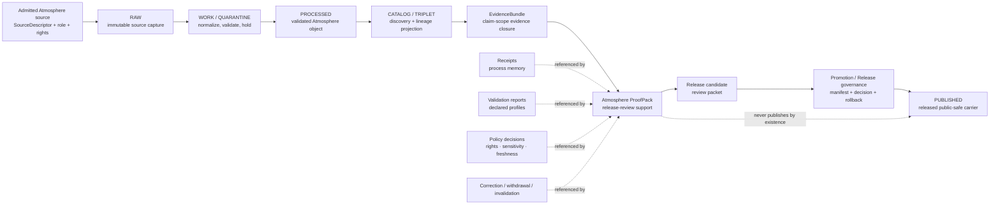

<!-- [KFM_META_BLOCK_V2]
doc_id: kfm://data/proofs/proof-pack/atmosphere/readme
title: data/proofs/proof_pack/atmosphere/ — Atmosphere ProofPack Support
type: directory-readme
subtype: atmosphere-proof-pack-support-lane
version: v0.2.0
status: repository-grounded draft; accepted ProofPack semantic contract, machine schema, deterministic validator, proof producer, payload inventory, policy enforcement, release linkage, and runtime behavior remain bounded
owners:
  - "NEEDS VERIFICATION — Atmosphere domain steward"
  - "NEEDS VERIFICATION — evidence, EvidenceBundle, ProofPack, proof, citation-validation, and validation stewards"
  - "NEEDS VERIFICATION — source-role, rights, freshness, sensitivity, and advisory-context reviewers"
  - "NEEDS VERIFICATION — policy, release, correction, withdrawal, rollback, governed-API, Evidence Drawer, governed-AI, and docs stewards"
created: 2026-06-25
updated: 2026-07-26
policy_label: restricted-review; proof-pack-support; atmosphere; cite-or-abstain; freshness-aware; no-direct-public-path; release-gated; not-emergency-authority
path: data/proofs/proof_pack/atmosphere/README.md
owning_root: data/
artifact_family: proofs/proof_pack
domain: atmosphere
truth_posture: >
  CONFIRMED exact target path, prior blob, Directory Rules proof placement, canonical proofs-root
  contract, substantive ProofPack parent README, Atmosphere domain proof lane, Atmosphere contract,
  schema, fixture, test, source-registry, validator-index, catalog, receipt, published-lane,
  release-candidate, ADR, and readiness-workflow documentation / PROPOSED accepted Atmosphere
  ProofPack profile, stable object shape, deterministic producer and validator, source-role closure,
  knowledge-character closure, finite review-support outcomes, correction propagation, and downstream
  handoff requirements / UNKNOWN recursive ProofPack payload inventory, active writers and consumers,
  resolver behavior, generated indexes, public routes, caches, hosting, release instances, and public
  effects / NEEDS VERIFICATION accountable owners, accepted semantic contract and schema, fixture
  payload depth, validator execution, CI graduation, policy and freshness enforcement, independent
  review, correction and withdrawal propagation, retention, and rollback drills
evidence_snapshot:
  repository: bartytime4life/Kansas-Frontier-Matrix
  base_ref: main
  base_commit: 4ce20df8b12d640fa527147407a24f56d61e0b46
  prior_blob: 42b947efd1cb7b68b0ba99b445c520ba63d210af
  directory_rules_blob: 2affb080e6f0043867c64c7f06c1ca52030fbd55
  proofs_root_blob: 0d8b6e92d3b4b9ff3961d29c53ead497922a31cf
  proof_pack_parent_blob: b03674bebb03252511cb76e03b949e885a9fd79f
  atmosphere_domain_proof_blob: c85bea4e5524b934eef66fa7d8bc65f7036d0726
  atmosphere_contract_index_blob: 2626d011b5d80e6d58870be3eff817d95116ffc7
  atmosphere_schema_index_blob: 1165bd4719fff2c17ce4e7f5253fa8af8315f333
  atmosphere_fixture_index_blob: 3046c1246e4f6999a1c1eae0040a47b49012d52f
  atmosphere_test_index_blob: 6474cc33c3bdd668fd8713e06e94f7dacda97b6b
  atmosphere_validator_index_blob: 0bdf0d021a093b61cdeca0686a936cd91c1af318
  atmosphere_source_registry_blob: 6a50dd496225cd9e4c3165dead10cde3d0f23959
  atmosphere_policy_blob: d897f4f67458f9d12e0ef2b2e7146eeba935df4b
  atmosphere_catalog_blob: ebdf3266d35a49fa02de3740e59f49cf4fe3cef6
  receipts_root_blob: 041f205dd5e618185fc7c75e95c85872fc9bbf69
  atmosphere_published_blob: 25f26ea54c3c298175c510191427e5cef8eaa4cd
  atmosphere_release_candidate_blob: 2cff863a65c035cc167583ecae481c03580fc24a
  atmosphere_workflow_blob: 3bd0183481a73c1aaad011e4ef1e361a3ee6b5f2
  adr_0011_blob: 40b0f47b87d584040803ed76aa6b31f5204b7fca
related:
  - ../README.md
  - ../../README.md
  - ../../atmosphere/README.md
  - ../../../receipts/README.md
  - ../../../catalog/domain/atmosphere/README.md
  - ../../../registry/sources/atmosphere/README.md
  - ../../../published/atmosphere/README.md
  - ../../../../docs/domains/atmosphere/README.md
  - ../../../../contracts/domains/atmosphere/README.md
  - ../../../../schemas/contracts/v1/domains/atmosphere/README.md
  - ../../../../fixtures/domains/atmosphere/README.md
  - ../../../../tests/domains/atmosphere/README.md
  - ../../../../tools/validators/domains/atmosphere/README.md
  - ../../../../policy/domains/atmosphere/README.md
  - ../../../../release/candidates/atmosphere/README.md
  - ../../../../release/README.md
  - ../../../../docs/doctrine/directory-rules.md
  - ../../../../docs/adr/ADR-0011-receipts-vs-proofs-vs-manifests-vs-catalog-separation.md
  - ../../../../.github/workflows/domain-atmosphere.yml
notes:
  - "Same-path Markdown modernization only; no Atmosphere source bytes, proof payloads, EvidenceBundle or ProofPack instances, contracts, schemas, policies, validators, fixtures, tests, workflows, candidates, releases, routes, hosting, access controls, or publication state changed."
  - "The ProofPack parent is a substantive repository README, not a greenfield stub. It defines guidance and a proposed object shape, but its own definition of done remains open."
  - "The bounded inspection did not establish an accepted ProofPack semantic contract, machine schema, deterministic validator, proof producer, concrete Atmosphere ProofPack inventory, or released Atmosphere artifact."
  - "Knowledge-character distinctions are retained: OBSERVATION, PUBLIC_AQI_REPORT, MODEL_FIELD, REMOTE_SENSING_MASK, CLIMATE_NORMAL_OR_ANOMALY, DERIVED_FUSION, and ALERT_AND_ADVISORY_CONTEXT."
  - "The documentation rollback target for v0.2.0 is prior blob 42b947efd1cb7b68b0ba99b445c520ba63d210af."
[/KFM_META_BLOCK_V2] -->

<a id="top"></a>

# `data/proofs/proof_pack/atmosphere/` — Atmosphere ProofPack Support

> **One-line purpose.** Hold or index compact, claim-scoped Atmosphere ProofPack support that binds source roles, evidence, validation, policy, catalog, integrity, review, freshness, correction, withdrawal, and rollback dependencies without becoming source truth, release authority, a public data service, or emergency guidance.

[](#current-repository-status)
[](#placement-and-authority)
[](#purpose)
[](#atmosphere-specific-gates)
[](#outputs-and-downstream-handoff)
[](#validation-checklist)

> [!IMPORTANT]
> **A ProofPack supports release review; it is not the release decision.** A file, schema result, validator result, pull request, merge, workflow run, map render, catalog entry, or ProofPack placement does not make an Atmosphere claim true, rights-cleared, policy-admitted, reviewed, released, public, regulatory, medical, or safe for emergency use.

> [!CAUTION]
> **Atmosphere meaning is easy to flatten.** AQI is not concentration; AOD is not surface PM2.5; a model, forecast, reanalysis, or fusion field is not an observation; a low-cost sensor reading requires calibration and caveat posture; advisory context is not KFM-issued life-safety guidance.

> [!WARNING]
> Do not place secrets, restricted source terms, private access details, harmful-precision station or facility joins, control-defeating calibration internals, official advisory text dumps, or other protected operational material in this ordinary repository lane.

**Status:** repository-grounded draft  
**Path:** `data/proofs/proof_pack/atmosphere/`  
**Owning responsibility:** `data/` → `proofs/` → `proof_pack/`  
**Domain segment:** `atmosphere/`  
**Direct public access:** denied  
**Documentation rollback target:** prior blob `42b947efd1cb7b68b0ba99b445c520ba63d210af`

**Quick navigation:** [Purpose](#purpose) · [Placement](#placement-and-authority) · [Status](#current-repository-status) · [Contents](#what-an-atmosphere-proofpack-should-contain) · [Gates](#atmosphere-specific-gates) · [Exclusions](#what-must-not-be-stored-here) · [Pattern](#proposed-folder-and-file-pattern) · [Lifecycle](#lifecycle-relationship) · [Validation](#validation-checklist) · [Failures](#failure-modes) · [Handoff](#outputs-and-downstream-handoff) · [Verification](#open-verification-register) · [No-loss](#no-loss-ledger) · [Done](#definition-of-done) · [Rollback](#rollback)

---

<a id="1-purpose"></a>

## Purpose

`data/proofs/proof_pack/atmosphere/` is the Atmosphere/Air specialization of the repository's ProofPack support family. It may hold or index reviewable support bundles for an Atmosphere release candidate, correction candidate, withdrawal candidate, rollback candidate, or other high-burden public-safe derivative.

A bounded Atmosphere ProofPack should make it possible to inspect:

1. the exact claim, layer, API payload, report, tile package, Evidence Drawer payload, Focus Mode scope, graph projection, correction, or rollback under review;
2. the immutable source roles and knowledge-character labels carried by that scope;
3. the admitted source descriptors, evidence bundles, receipts, validation results, policy decisions, catalog records, integrity records, review records, and release dependencies that support it;
4. the spatial, temporal, pollutant, variable, unit, averaging-window, method, QA, calibration, uncertainty, caveat, freshness, and stale-state limits of the support;
5. the exact released carrier proposed, if any, and the correction, withdrawal, invalidation, and rollback path required before public exposure.

This lane does not create Atmosphere truth. It does not issue AQI, health, regulatory, emergency, evacuation, or life-safety guidance. It supports governed review and must yield a finite hold, abstention, restriction, denial, or error when support is incomplete.

[Back to top](#top)

---

<a id="2-placement-and-authority"></a>

## Placement and authority

Directory Rules place proof support under `data/proofs/`, with ProofPack as a proof-family segment and Atmosphere as a domain segment. The file remains at its existing path; no root, lifecycle phase, proof family, schema home, policy home, source registry, receipt home, release home, or public route is created.

| Surface | Verified repository role | Boundary |
|---|---|---|
| [`data/proofs/`](../../README.md) | Canonical proofs responsibility. | Proof support does not own contracts, schemas, policy, release decisions, public serving, or factual truth. |
| [`data/proofs/proof_pack/`](../README.md) | Substantive ProofPack-family README and domain-lane router. | Guidance and proposed shape; not an accepted semantic contract, schema, validator, or release authority. |
| [`data/proofs/atmosphere/`](../../atmosphere/README.md) | Broader Atmosphere domain proof-support lane. | Domain proof support; this directory is the narrower ProofPack specialization. |
| [`data/receipts/`](../../../receipts/README.md) | Canonical process-memory responsibility. | ProofPacks reference receipts; receipts do not become release-grade proof by themselves. |
| [`data/catalog/domain/atmosphere/`](../../../catalog/domain/atmosphere/README.md) | Atmosphere catalog-stage discovery and indexing. | Catalog metadata is not evidence closure or release authority. |
| [`data/registry/sources/atmosphere/`](../../../registry/sources/atmosphere/README.md) | Source admission, role, rights, cadence, sensitivity, and stale-state routing. | A source descriptor does not prove a claim or publish a source. |
| [`release/candidates/atmosphere/`](../../../../release/candidates/atmosphere/README.md) | Pre-publication candidate review lane. | A candidate is not a release; no active child candidate is established in bounded evidence. |
| [`release/`](../../../../release/README.md) | Release, promotion, correction, withdrawal, and rollback authority. | ProofPacks can support and reference release records but cannot replace them. |
| [`data/published/atmosphere/`](../../../published/atmosphere/README.md) | Downstream released-carrier lane. | Nothing becomes public by path placement; emitted released artifacts remain unverified. |

The proposed artifact-family separation is also documented by [ADR-0011](../../../../docs/adr/ADR-0011-receipts-vs-proofs-vs-manifests-vs-catalog-separation.md), whose current repository status remains `proposed`. This README preserves that separation without treating the ADR as accepted.

[Back to top](#top)

---

## Current repository status

| Question | Bounded answer |
|---|---|
| Does this README exist? | **CONFIRMED.** Prior blob: `42b947efd1cb7b68b0ba99b445c520ba63d210af`. |
| Does the ProofPack parent exist? | **CONFIRMED.** It is a substantive domain-router and guidance README, not a greenfield stub. |
| Is a canonical Atmosphere domain proof lane present? | **CONFIRMED.** [`data/proofs/atmosphere/`](../../atmosphere/README.md) is repository-grounded documentation with no verified complete domain validator or public readiness. |
| Are Atmosphere semantic contracts documented? | **CONFIRMED.** The domain contract index lists Atmosphere object contracts, while runtime and enforcement remain bounded. |
| Is Atmosphere schema coverage complete? | **No.** The schema index confirms one permissive proposed decision-envelope scaffold and records most object schemas as `NEEDS VERIFICATION`. |
| Are synthetic Atmosphere fixture lanes documented? | **CONFIRMED at README level.** Payload inventory remains `NEEDS VERIFICATION`; tests and validators were not run by that index. |
| Are executable Atmosphere tests established? | **No.** The test lane identifies itself as a scaffold and leaves executable modules, fixture inventory, validator commands, and CI coverage unresolved. |
| Is a deterministic Atmosphere ProofPack validator or producer established? | **No accepted implementation was established.** The per-domain validator index is README-backed; the domain workflow explicitly holds proof production and deterministic validation. |
| Is executable Atmosphere policy established? | **No.** The inspected domain policy README remains a greenfield scaffold. |
| Is an active Atmosphere release candidate established? | **No.** The candidate index establishes no child dossier, active candidate, manifest-ready candidate, or published release. |
| Is a released Atmosphere artifact established? | **No.** Published-lane documentation exists, but emitted released bytes and governing release manifests remain unverified. |
| Is the recursive ProofPack payload inventory known? | **UNKNOWN.** No complete recursive payload, writer, consumer, runtime, cache, or hosting inventory was established. |
| May public clients read this lane directly? | **No.** Public clients use governed APIs and released public-safe carriers. |

### Current automation posture

The current [`domain-atmosphere` workflow](../../../../.github/workflows/domain-atmosphere.yml) is a read-only readiness workflow:

- `validate-atmosphere` holds because executable Atmosphere validation is not established;
- `build-proof-atmosphere` holds because no accepted proof producer or deterministic proof command is established;
- `publish-dry-run-atmosphere` holds because no accepted release dry-run command or candidate-manifest contract is established;
- the workflow performs no live source request, proof production, source admission, release, deployment, publication, or write to lifecycle, proof, receipt, release, or published stores.

A held or green readiness result is not an EvidenceBundle, ProofPack, policy decision, release decision, regulatory determination, medical statement, emergency alert, or publication authority.

[Back to top](#top)

---

## Authority separation

| Concern | Authority home | Relationship to this lane |
|---|---|---|
| Atmosphere doctrine and domain scope | [`docs/domains/atmosphere/`](../../../../docs/domains/atmosphere/README.md) | Referenced; not redefined here. |
| Atmosphere semantic meaning | [`contracts/domains/atmosphere/`](../../../../contracts/domains/atmosphere/README.md) | ProofPacks cite accepted contracts; current ProofPack-specific contract is not established by bounded inspection. |
| Machine-checkable shape | [`schemas/contracts/v1/domains/atmosphere/`](../../../../schemas/contracts/v1/domains/atmosphere/README.md) and accepted shared evidence/proof schema homes | Current Atmosphere schema coverage is mostly scaffolded; an accepted ProofPack schema was not established. |
| Synthetic examples | [`fixtures/domains/atmosphere/`](../../../../fixtures/domains/atmosphere/README.md) | README-level fixture lanes exist; payload depth and consumer coverage remain unverified. |
| Enforceability tests | [`tests/domains/atmosphere/`](../../../../tests/domains/atmosphere/README.md) | Test planning and boundaries exist; executable accepted suite remains unverified. |
| Validator implementation | [`tools/validators/domains/atmosphere/`](../../../../tools/validators/domains/atmosphere/README.md) and accepted shared validator lanes | Current index confirms README routes, not an accepted ProofPack executable. |
| Source admission | [`data/registry/sources/atmosphere/`](../../../registry/sources/atmosphere/README.md) | ProofPacks reference admitted source identity and role; they do not activate sources. |
| Policy and sensitivity | [`policy/domains/atmosphere/`](../../../../policy/domains/atmosphere/README.md) and accepted shared policy roots | ProofPacks carry results; policy defines admissibility. Current domain policy remains a scaffold. |
| Catalog and provenance | [`data/catalog/domain/atmosphere/`](../../../catalog/domain/atmosphere/README.md) and shared STAC/DCAT/PROV lanes | ProofPacks require closure; catalog presence does not approve release. |
| Receipts | [`data/receipts/`](../../../receipts/README.md) | ProofPacks reference process memory; receipts remain separate. |
| Candidate review | [`release/candidates/atmosphere/`](../../../../release/candidates/atmosphere/README.md) | Candidate dossiers point to proof support; no active candidate is established. |
| Promotion, release, correction, withdrawal, rollback | [`release/`](../../../../release/README.md) | Separate authoritative records; never embedded as competing authority here. |
| Public carriers | [`data/published/atmosphere/`](../../../published/atmosphere/README.md) | Downstream only after governed release. |
| Public/API/UI/AI behavior | Governed application and runtime roots | May resolve released ProofPack/evidence references; must not read this internal lane directly. |

[Back to top](#top)

---

<a id="3-what-an-atmosphere-proofpack-should-contain"></a>

## What an Atmosphere ProofPack should contain

A ProofPack should be small enough to review and complete enough to support a bounded decision. Prefer stable identifiers, digests, and resolvable references over copied source payloads.

| Component | Minimum support | Atmosphere-specific burden |
|---|---|---|
| Claim and candidate scope | ProofPack ID, release-candidate reference, artifact kind, audience, intended public surface, geography, time, and exact claims. | Pin pollutant/variable, method, units, averaging window, observation/source/retrieval/model-run/valid/issue/expiry/correction/release times where material. |
| Source closure | SourceDescriptor references, immutable source role, issuing authority, rights, cadence, citation, source head, and stale-state rules. | Distinguish observed sensor, regulatory/archive, public AQI/report, modeled/forecast/reanalysis, remote-sensing proxy, aggregate/climate, advisory context, candidate, synthetic, and restricted context according to the admitted descriptor. |
| Evidence closure | EvidenceRef and EvidenceBundle references, resolution status, claim scope, citations, checksums, and limitations. | Evidence must support the exact knowledge character, pollutant, variable, geography, time, method, and public representation—not merely a related Atmosphere topic. |
| Validation closure | ValidationReport and citation-validation references, validator/profile versions, findings, and finite outcomes. | Exercise AQI/concentration, AOD/PM2.5, model/observation, low-cost-sensor, unit, time, freshness, stale-state, advisory, rights, sensitive-join, and no-network gates where applicable. |
| Transform closure | Run/Transform/Redaction/Aggregation/model/calibration/correction receipt references and input/output digests. | Unit conversion, projection, aggregation, sensor correction, calibration, model fusion, interpolation, and generalization must remain inspectable. |
| Policy and review closure | PolicyDecision, rights/sensitivity result, obligations, steward/reviewer role, review state, and separation-of-duty references. | Low-cost sensors, derived fusion, stale overrides, advisory context, health/regulatory-adjacent language, and sensitive joins require explicit bounded review. |
| Catalog and integrity closure | CatalogMatrix/STAC/DCAT/PROV/domain-catalog references, spec/schema/validator versions, checksums, signatures or Merkle references when required. | Realtime, historical, provisional, corrected, and final collections remain distinct where cadence, rights, freshness, or authority differ. |
| Release dependency | Candidate and proposed release-manifest references without claiming release, plus target carrier IDs/digests. | The release decision stays under `release/`; the ProofPack only supports review. |
| Correction and rollback closure | CorrectionNotice, WithdrawalNotice, RollbackCard, invalidation list, stale/expiry behavior, cache/index propagation, and prior release target where applicable. | Realtime or advisory-adjacent carriers need explicit stale, correction, withdrawal, and rollback behavior before public exposure. |
| Review-support outcome | A finite outcome defined by the accepted ProofPack contract. | The parent README currently proposes review-support states, but the accepted enum and state machine remain `NEEDS VERIFICATION`. |

### Required knowledge-character preservation

The prior README's knowledge-character set is retained as domain guidance:

| Knowledge character | Required interpretation |
|---|---|
| `OBSERVATION` | Direct or QA-qualified measurement with method, units, station/network context, and time scope. |
| `PUBLIC_AQI_REPORT` | Public report/index context; not concentration unless separately supported and labeled. |
| `MODEL_FIELD` | Forecast, reanalysis, simulation, interpolation, or other modeled field; never observation by presentation. |
| `REMOTE_SENSING_MASK` | AOD, smoke plume, cloud/satellite mask, or related proxy/context product; not surface concentration or exposure proof. |
| `CLIMATE_NORMAL_OR_ANOMALY` | Baseline, departure, percentile, or anomaly context with reference period and method; not realtime observation or attribution by itself. |
| `DERIVED_FUSION` | Combined or inferred product with explicit inputs, method, uncertainty, and model role. |
| `ALERT_AND_ADVISORY_CONTEXT` | Official-source referral context with issuer, issue/expiry time, and redirect; not KFM-issued instruction. |

These labels do not replace immutable source role, object-family meaning, evidence support, policy state, review state, or release state.

[Back to top](#top)

---

<a id="4-atmosphere-specific-gates"></a>

## Atmosphere-specific gates

Atmosphere ProofPacks must fail closed when meaning, time, rights, freshness, source role, or public representation is unresolved.

| Gate | Required support | Finite response when missing or unsafe |
|---|---|---|
| AQI versus concentration | Evidence and validation proving that AQI categories/index values are not represented as measured µg/m³, ppb, ppm, or concentration. | `HOLD`, `DENY`, or correction. |
| AOD versus PM2.5 | Proxy/model explanation proving AOD is not represented as surface PM2.5 concentration, exposure, or monitor truth. | `HOLD`, `DENY`, or relabel with limitations. |
| Model versus observation | Model/run identity, initialization, forecast hour, inputs, validation posture, uncertainty, and explicit modeled label. | `ABSTAIN`, `HOLD`, or `DENY` an observed-truth claim. |
| Low-cost sensor posture | Device/network identity, calibration/correction, QA, confidence, caveats, rights, privacy/siting posture, and review. | `RESTRICT`, `ABSTAIN`, `HOLD`, or `DENY`. |
| Units and averaging | Pollutant/variable, canonical/native units, conversion receipt, averaging interval, method, and detection/precision context. | `ERROR`, `HOLD`, or correction. |
| Time validity and freshness | Observation/source/retrieval/model-run/valid/issue/expiry/correction/release times, cadence, stale threshold source, and visible stale state. | `ABSTAIN`, `HOLD`, mark stale, withdraw, or correct. |
| Provisional versus final | Revision state, source version, correction history, and downstream invalidation dependencies. | `HOLD`, label provisional, correct, or withdraw. |
| Advisory context | Official issuer, exact referral source, issue/expiry time, jurisdiction/scope, and redirect language. | `DENY` KFM life-safety wording; provide official-source referral only. |
| Rights and redistribution | SourceDescriptor rights, attribution, redistribution, derivative-use, retention, and policy decision. | `DENY` or quarantine until resolved. |
| Sensitive joins | Policy-approved aggregation/generalization/redaction, transform receipt, re-identification review, and safe public representation for facility, school, hospital, residence, small-population, private-sensor, or infrastructure-adjacent joins. | `DENY`, `RESTRICT`, generalize, aggregate, suppress, or quarantine. |
| Source-role preservation | Immutable role and authority scope from admission through processing, proof, catalog, release, map, graph, export, and AI surfaces. | `HOLD`, `ABSTAIN`, or `DENY` role collapse. |
| Evidence closure | EvidenceRef resolution to EvidenceBundle for every material claim or an explicit unresolved state. | `ABSTAIN`, `HOLD`, `DENY`, or `ERROR`. |
| No-network validation | Synthetic public-safe fixtures and deterministic checks; no live source request in the default validation path. | Validator failure or `ERROR`. |
| Release and rollback | Candidate, review, promotion/release dependency, correction, withdrawal, invalidation, and rollback target. | `HOLD` or `DENY` release review. |

Passing a gate proves only the gate's declared scope. It does not prove Atmosphere truth, medical actionability, regulatory status, emergency authority, release, or publication.

[Back to top](#top)

---

<a id="5-what-must-not-be-stored-here"></a>

## What must not be stored here

| Excluded material | Correct home or action | Reason |
|---|---|---|
| RAW source captures, API responses, station exports, rasters, model files, advisory text dumps, or source-system logs | Atmosphere RAW/WORK/QUARANTINE lifecycle lanes | ProofPacks reference source material; they do not duplicate it. |
| Normalized canonical Atmosphere records or candidate layers | `data/processed/atmosphere/` or governed candidate staging | Proof support is not canonical domain data. |
| SourceDescriptor instances or activation decisions | [`data/registry/sources/atmosphere/`](../../../registry/sources/atmosphere/README.md) or accepted registry/decision homes | Source admission authority remains separate. |
| Process receipts or execution logs as primary artifacts | [`data/receipts/`](../../../receipts/README.md) | Receipts are process memory. |
| STAC, DCAT, PROV, domain catalog, or graph/triplet records as primary artifacts | Catalog/triplet lanes | Discovery and projection do not become proof or release authority. |
| Policy rules, rights rules, sensitivity rules, or geoprivacy parameters | Policy roots | ProofPacks carry decisions and obligations; policy defines them. |
| JSON Schemas or semantic contracts | Schema and contract responsibility roots | Shape and meaning remain separate from materialized proof support. |
| Tests, fixtures, validator implementations, pipelines, packages, API code, UI code, or map styles | Their responsibility roots | This lane stores proof support, not implementation authority. |
| ReleaseManifest, PromotionDecision, ReviewRecord, CorrectionNotice, WithdrawalNotice, RollbackCard, or release signatures as competing authority | [`release/`](../../../../release/README.md) and accepted review homes | ProofPacks reference release-governance objects; they do not own them. |
| Published PMTiles, GeoParquet, GeoJSON, COG, API payloads, reports, stories, maps, or dashboards | [`data/published/atmosphere/`](../../../published/atmosphere/README.md) after governed release | Public carriers are downstream. |
| AI answer, map pixel, popup, screenshot, graph edge, search result, or dashboard treated as proof | Governed public surfaces must dereference released evidence | Derived carriers are not sovereign truth. |
| Emergency instructions, evacuation/routing advice, clinical guidance, compliance determinations, or KFM-issued alerts | Do not publish through this lane; redirect to official authority | Atmosphere is evidence/context, not emergency or medical authority. |

[Back to top](#top)

---

<a id="6-proposed-folder-and-file-pattern"></a>

## Proposed folder and file pattern

No child directory or payload is created by this README. The parent ProofPack guide proposes the following pattern only after a semantic contract, schema, validator, fixtures, ownership, and CI posture are accepted:

```text
data/proofs/proof_pack/atmosphere/
├── README.md
├── candidates/
│   └── <release_id>.proof-pack.json
├── indexes/
│   └── proof-pack-index.json
└── retired/
    └── <release_id>.superseded-proof-pack.json
```

Fixtures should normally remain under the accepted fixture roots rather than creating a competing local fixture authority.

Suggested naming guidance retained from the parent:

```text
atmosphere.proof_pack.<scope>.<release_or_run_id>.<short_hash>.json
```

Illustrative names:

```text
atmosphere.proof_pack.pm25-hourly-kansas.v0.1.0123abcd.json
atmosphere.proof_pack.hms-smoke-context.v0.1.89ab4567.json
atmosphere.proof_pack.climate-normal-county-panel.v0.1.4567cdef.json
```

> [!CAUTION]
> These names are illustrative. They are not global identity law, accepted schema instances, release IDs, or proof of existing payloads. Deterministic identity must be defined by the accepted contract/schema and enforced by validators and fixtures.

[Back to top](#top)

---

<a id="7-lifecycle-relationship"></a>

## Lifecycle relationship


```mermaid
flowchart LR
    SRC["Admitted Atmosphere source<br/>SourceDescriptor + role + rights"] --> RAW["RAW<br/>immutable source capture"]
    RAW --> WORK["WORK / QUARANTINE<br/>normalize, validate, hold"]
    WORK --> PROC["PROCESSED<br/>validated Atmosphere object"]
    PROC --> CAT["CATALOG / TRIPLET<br/>discovery + lineage projection"]
    CAT --> EB["EvidenceBundle<br/>claim-scope evidence closure"]
    EB --> PACK["Atmosphere ProofPack<br/>release-review support"]
    PACK --> CAND["Release candidate<br/>review packet"]
    CAND --> REL["Promotion / Release governance<br/>manifest + decision + rollback"]
    REL --> PUB["PUBLISHED<br/>released public-safe carrier"]

    REC["Receipts<br/>process memory"] -. referenced by .-> PACK
    VAL["Validation reports<br/>declared profiles"] -. referenced by .-> PACK
    POL["Policy decisions<br/>rights · sensitivity · freshness"] -. referenced by .-> PACK
    CORR["Correction / withdrawal / invalidation"] -. referenced by .-> PACK

    PACK -. "never publishes by existence" .-> PUB
```

The ProofPack is a closure aid beside the lifecycle. It does not replace RAW, WORK, QUARANTINE, PROCESSED, CATALOG/TRIPLET, release governance, or PUBLISHED. It must preserve stable references back to those families rather than copying their mutable authority.

[Back to top](#top)

---

## Outputs and downstream handoff

A completed Atmosphere ProofPack may support:

- release-candidate review;
- policy and stewardship review;
- governed API and Evidence Drawer resolution;
- map-layer, tile, API-payload, report, export, graph, or Focus Mode release review;
- correction, withdrawal, supersession, cache invalidation, and rollback analysis;
- audit of source role, knowledge character, time validity, freshness, caveats, and public representation.

It does **not** produce a public answer, public map, AQI service, regulatory result, medical statement, emergency alert, or released artifact by itself.

The handoff order remains:

```text
ProofPack support
  -> independent policy / validation / review closure
  -> PromotionDecision and ReleaseManifest
  -> released public-safe carrier
  -> governed API / UI / map / Evidence Drawer / bounded AI
```

When closure is incomplete, the handoff stops with a finite non-release result.

[Back to top](#top)

---

<a id="8-validation-checklist"></a>

## Validation checklist

Before an Atmosphere ProofPack is used in promotion review, verify all applicable checks and record every non-applicable check with a reason:

- [ ] The ProofPack profile, schema version, validator version, and deterministic identity rule are accepted and recorded.
- [ ] The candidate, artifact kind, exact claim scope, geography, audience, intended public surface, and immutable artifact references are stated.
- [ ] Every source has a SourceDescriptor, immutable source role, issuing authority, rights, cadence, citation, source head, and stale-state posture.
- [ ] Every material claim resolves to an EvidenceBundle or records an explicit finite unresolved outcome.
- [ ] Knowledge-character labels remain explicit and are not silently derived from a filename, map style, provider, or product appearance.
- [ ] AQI is not represented as concentration.
- [ ] AOD is not represented as PM2.5, exposure, or ground observation.
- [ ] Model, forecast, reanalysis, interpolation, and fusion fields are not represented as observations.
- [ ] Low-cost sensor support includes calibration/correction, QA, confidence, caveats, limitations, rights, and review.
- [ ] Pollutant/variable, units, averaging window, method, precision, and conversion receipts are explicit.
- [ ] Observation, source, retrieval, model-run, valid, issue, expiry, correction, release, and stale times are separated where material.
- [ ] Advisory context identifies the official issuer and redirects to official sources without reproducing KFM life-safety instructions.
- [ ] Sensitive joins have policy-approved public-safe transforms and transformation receipts.
- [ ] Validation references cover positive and negative cases for the declared profile.
- [ ] Default validation is deterministic, synthetic, public-safe, and no-network.
- [ ] Receipts are referenced as process memory rather than treated as proof by themselves.
- [ ] Catalog/STAC/DCAT/PROV references preserve discovery and provenance without becoming evidence or release authority.
- [ ] Policy, rights, sensitivity, freshness, review, and release dependencies are explicit and finite.
- [ ] The candidate index and release records are separate from this ProofPack lane.
- [ ] Correction, withdrawal, supersession, invalidation, cache/index propagation, and rollback targets are traceable.
- [ ] Public clients consume only governed APIs or released public-safe carriers.
- [ ] No secret, restricted source term, harmful-precision detail, private access clue, official advisory dump, or control-defeating transform parameter is exposed.

A successful source parse or workflow is not complete validation. No accepted Atmosphere ProofPack validator or producer was established in the bounded inspection.

[Back to top](#top)

---

<a id="9-failure-modes"></a>

## Failure modes

| Failure mode | Why it matters | Required response |
|---|---|---|
| ProofPack duplicates RAW or processed payloads | Collapses proof support with source/canonical data. | Move payloads to the correct lifecycle lane; keep immutable refs and digests. |
| ProofPack acts as ReleaseManifest or PromotionDecision | Collapses proof and release authority. | Move authoritative records to `release/`; retain references only. |
| Receipt is treated as proof | Process memory becomes claim support without closure. | Require EvidenceBundle, validation, policy, review, and release dependencies. |
| Catalog record is treated as evidence or approval | Discovery metadata becomes sovereign truth. | Dereference evidence and keep release decision separate. |
| AQI, concentration, AOD, PM2.5, model, forecast, or sensor roles are flattened | Publishes misleading Atmosphere meaning. | Fail validation; correct source role, knowledge character, claim, and evidence. |
| Advisory context becomes KFM life-safety guidance | KFM impersonates an issuing authority. | Deny the wording; retain official-source referral and scope. |
| Realtime or advisory-adjacent carrier lacks stale/expiry state | Users may treat old context as current. | Hold, label stale, correct, withdraw, invalidate, or roll back. |
| Rights, source role, issuing authority, or redistribution posture is unresolved | Public release may misrepresent authority or violate terms. | Quarantine or deny until resolved. |
| Sensitive facility/population/private-sensor join lacks public-safe transformation | A review bundle becomes an exposure channel. | Restrict, aggregate, generalize, suppress, quarantine, or deny. |
| ProofPack contains no correction, withdrawal, or rollback dependency | Release cannot be safely reversed. | Hold release review. |
| Public client reads this lane directly | Internal proof support bypasses release governance. | Deny direct access; use governed release and API paths. |
| AI summary or map output replaces the ProofPack | Fluent or visual output becomes root truth. | Deny; require released evidence and bounded interpretation. |
| Unknown state is replaced with a plausible default | Uncertainty disappears from the trust path. | Restore `UNKNOWN` or `NEEDS VERIFICATION`; narrow or abstain. |

[Back to top](#top)

---

## Repository evidence ledger

| Evidence | What it establishes | What it does not establish |
|---|---|---|
| [`data/proofs/README.md`](../../README.md) | Canonical proofs responsibility and no-direct-public-path boundary. | Complete proof payload inventory or runtime enforcement. |
| [`data/proofs/proof_pack/README.md`](../README.md) | ProofPack family guidance, proposed content families, domain pattern, and open definition of done. | Accepted ProofPack semantic contract, schema, validator, or release authority. |
| [`data/proofs/atmosphere/README.md`](../../atmosphere/README.md) | Repository-grounded Atmosphere proof boundary and source-role/knowledge-character cautions. | Complete domain proof validator or public readiness. |
| [`contracts/domains/atmosphere/README.md`](../../../../contracts/domains/atmosphere/README.md) | Atmosphere object-meaning lane and documented contract roster. | ProofPack-specific accepted semantics or runtime behavior. |
| [`schemas/contracts/v1/domains/atmosphere/README.md`](../../../../schemas/contracts/v1/domains/atmosphere/README.md) | Draft schema index, alias posture, one proposed decision-envelope scaffold, and incomplete coverage. | Accepted ProofPack shape or complete Atmosphere schemas. |
| [`fixtures/domains/atmosphere/README.md`](../../../../fixtures/domains/atmosphere/README.md) | README-level synthetic fixture lanes and intended no-network posture. | Payload validity, full inventory, validator consumption, or pass results. |
| [`tests/domains/atmosphere/README.md`](../../../../tests/domains/atmosphere/README.md) | Test-lane boundaries and planned Atmosphere test families. | Executable accepted suite or CI pass state. |
| [`tools/validators/domains/atmosphere/README.md`](../../../../tools/validators/domains/atmosphere/README.md) | Per-domain validator index and confirmed smoke README route. | Accepted ProofPack executable or validator results. |
| [`data/registry/sources/atmosphere/README.md`](../../../registry/sources/atmosphere/README.md) | Source-admission, role, rights, freshness, advisory, and no-public-path boundaries. | Concrete descriptor inventory, activation, or claim proof. |
| [`policy/domains/atmosphere/README.md`](../../../../policy/domains/atmosphere/README.md) | The intended policy home. | Executable policy or enforcement; it remains a greenfield scaffold. |
| [`data/catalog/domain/atmosphere/README.md`](../../../catalog/domain/atmosphere/README.md) | Release-blocked catalog-stage documentation and placeholder PM2.5 posture. | Atmosphere release, evidence closure, or publication. |
| [`data/receipts/README.md`](../../../receipts/README.md) | Canonical receipt/process-memory boundary. | Proof closure or release approval. |
| [`release/candidates/atmosphere/README.md`](../../../../release/candidates/atmosphere/README.md) | No child dossier, active candidate, manifest-ready candidate, or published release in bounded inventory. | Absolute absence outside the governed candidate index. |
| [`data/published/atmosphere/README.md`](../../../published/atmosphere/README.md) | Downstream released-carrier contract and no-public-by-placement warning. | Emitted released bytes or governing release manifest. |
| [`domain-atmosphere.yml`](../../../../.github/workflows/domain-atmosphere.yml) | Read-only readiness holds and no accepted validation/proof/release commands. | Atmosphere truth, proof production, policy approval, release, or publication. |
| [ADR-0011](../../../../docs/adr/ADR-0011-receipts-vs-proofs-vs-manifests-vs-catalog-separation.md) | Proposed family-separation decision and repository maturity boundary. | Accepted decision or enforced end-to-end closure. |

[Back to top](#top)

---

## Open verification register

| Item | Status | Required evidence |
|---|---:|---|
| Recursive ProofPack payload and index inventory | `UNKNOWN` | Pinned recursive tree, payload types, LFS/external stores, rights/sensitivity, owners |
| Accepted ProofPack semantic contract | `NEEDS VERIFICATION` | Accepted contract path/version and steward review |
| Accepted ProofPack machine schema | `NEEDS VERIFICATION` | Canonical schema path, `$id`, required fields, enums, compatibility, fixtures |
| Deterministic ProofPack identity and digest rules | `NEEDS VERIFICATION` | Contract/schema rule, canonicalization algorithm, validator tests |
| Atmosphere ProofPack producer | `NOT ESTABLISHED` | Bounded executable, inputs, output contract, receipts, no-network fixtures |
| Atmosphere ProofPack validator | `NOT ESTABLISHED` | Deterministic command, stable findings, positive/negative fixtures, CI graduation |
| EvidenceRef-to-EvidenceBundle resolver integrity | `UNKNOWN` | Resolver implementation, cross-record checks, tests, runtime evidence |
| Concrete SourceDescriptor and activation inventory | `UNKNOWN` | Registry records, rights/sensitivity review, activation decisions |
| Fixture payload depth and validity | `NEEDS VERIFICATION` | Recursive fixture inventory, expected outputs, consumer tests, validator results |
| Executable policy and freshness enforcement | `NOT ESTABLISHED` | Policy bundle, finite outcomes, fixtures, tests, decision records |
| Active writers and consumers | `UNKNOWN` | Connector, pipeline, tool, release, API/UI, workflow, deployed-consumer inventory |
| Candidate-to-ProofPack-to-Release linkage | `NOT ESTABLISHED` | Candidate dossier, ProofPack instance, review, promotion decision, manifest |
| Public serving, caches, and invalidation | `UNKNOWN` | Governed routes, hosting, cache keys, stale/correction/withdrawal propagation |
| Independent review and separation of duties | `NEEDS VERIFICATION` | Accountable stewards, required reviews, policy/release approval evidence |
| Correction, withdrawal, and rollback drill | `NEEDS VERIFICATION` | Synthetic drill, records, invalidation receipts, restored prior state |

Unknowns narrow claims and block higher-risk transitions. They do not invite plausible defaults.

[Back to top](#top)

---

## No-loss ledger

| Prior element | Disposition |
|---|---|
| Stable path, `doc_id`, created date, and Atmosphere/ProofPack role | **KEEP** — preserved. |
| ProofPack-is-not-release boundary | **KEEP / STRENGTHEN** — retained in header, authority table, lifecycle, failures, and handoff. |
| Atmosphere knowledge-character labels | **KEEP** — retained verbatim and expanded with explicit interpretations. |
| AQI/concentration, AOD/PM2.5, model/observation, low-cost-sensor gates | **KEEP / ENRICH** — preserved as fail-closed gates and checklist items. |
| Rights, freshness, time, units, calibration, caveats, catalog, correction, rollback burden | **KEEP / ENRICH** — made repository-grounded and more explicit. |
| Exclusions and authority-family separation | **KEEP / REPAIR** — corrected parent-stub and fixture-home claims; retained family boundaries. |
| Proposed folder and naming pattern | **CLARIFY** — retained as illustrative guidance, removed local-fixture authority, added admission conditions. |
| Lifecycle Mermaid | **REPAIR / ENRICH** — retains RAW-to-PUBLISHED flow while adding source admission, EvidenceBundle, candidate, correction, and release boundaries. |
| Validation checklist and failure modes | **KEEP / ENRICH** — preserved with finite outcomes and current evidence. |
| Definition of done | **KEEP / UPDATE** — reframed around current repository evidence and open implementation closure. |
| Unsupported claim that parent ProofPack README was a greenfield stub | **REPAIR** — parent is substantive; operational maturity remains open. |
| Broad unknown claim for all repo surfaces | **REPAIR** — current documentation surfaces are confirmed; execution and release remain bounded. |
| Source payload, proof payload, schema, contract, policy, test, workflow, release, route, or public-state mutation | **NONE**. |

[Back to top](#top)

---

<a id="10-definition-of-done"></a>

## Definition of done

This sublane becomes operationally usable only when all required criteria are satisfied:

- [ ] An accepted ProofPack semantic contract defines meaning, invariants, finite outcomes, versioning, correction, and supersession.
- [ ] An accepted machine schema defines the canonical ProofPack shape and deterministic identity/digest rules.
- [ ] Valid, invalid, denied, abstained, stale, corrected, withdrawn, and rollback fixture families exist under accepted fixture homes.
- [ ] Atmosphere-specific fixtures cover AQI/concentration, AOD/PM2.5, model/observation, low-cost sensors, units, time, freshness, provisional/final state, advisory context, rights, sensitive joins, and no-network behavior.
- [ ] A deterministic ProofPack producer emits only accepted, reviewable, reference-rich objects and corresponding receipts.
- [ ] A deterministic validator resolves required cross-record references and emits stable finite findings.
- [ ] EvidenceRef-to-EvidenceBundle resolver integrity is tested for positive, missing, stale, conflicted, restricted, withdrawn, and invalidated cases.
- [ ] Policy bundles and negative fixtures fail closed for unresolved rights, source role, freshness, sensitivity, advisory scope, and public representation.
- [ ] CI runs the accepted no-network suite and is graduated deliberately from readiness hold to validated behavior.
- [ ] Accountable owners and independent review requirements are established.
- [ ] At least one synthetic Atmosphere candidate demonstrates source admission → evidence closure → receipts → ProofPack → catalog closure → candidate review → release dry-run → correction/rollback traceability without live source access or public publication.
- [ ] No public client, renderer, export, search, graph, or AI surface reads this lane directly.
- [ ] Correction, withdrawal, cache/index invalidation, and rollback drills restore a prior safe state and preserve audit lineage.

Until then, the correct posture is repository-grounded documentation plus `HOLD`, `ABSTAIN`, `RESTRICT`, `DENY`, or `ERROR` where closure is incomplete.

[Back to top](#top)

---

## Rollback

### Documentation rollback

Before merge, close the draft pull request and abandon the review branch. After merge, restore prior blob:

```text
42b947efd1cb7b68b0ba99b445c520ba63d210af
```

through a transparent reviewed revert or restoration commit.

### Operational rollback

Not applicable to this Markdown-only change. No source, payload, ProofPack instance, receipt, catalog record, policy decision, candidate, release record, route, cache, deployment, or public artifact changes.

---

## Maintainer note

Atmosphere ProofPacks are most valuable when they preserve distinctions that maps, dashboards, and generated summaries tend to blur. Optimize this lane for evidence closure, source-role and knowledge-character integrity, freshness, public-safe representation, correction, withdrawal, and rollback—not visual convenience or persuasive completeness.

[Back to top](#top)
