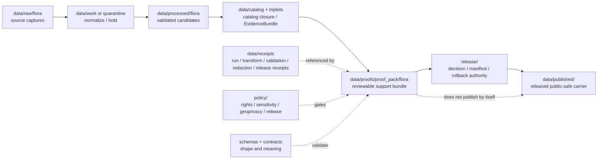

<!-- [KFM_META_BLOCK_V2]
doc_id: kfm://data/proofs/proof-pack/flora/readme
title: data/proofs/proof_pack/flora README
type: directory-readme
version: v0.1
status: draft
owners:
  - <data steward — TODO>
  - <proof steward — TODO>
  - <flora-domain steward — TODO>
  - <sensitivity reviewer — TODO>
  - <release steward — TODO>
created: 2026-06-25
updated: 2026-06-25
policy_label: restricted-review
path: data/proofs/proof_pack/flora/README.md
related:
  - ../../README.md
  - ../README.md
  - ../../flora/README.md
  - ../../../receipts/README.md
  - ../../../catalog/README.md
  - ../../../published/README.md
  - ../../../../docs/domains/flora/ARCHITECTURE.md
  - ../../../../docs/domains/flora/DATA_LIFECYCLE.md
  - ../../../../docs/doctrine/directory-rules.md
  - ../../../../release/README.md
  - ../../../../policy/README.md
  - ../../../../schemas/README.md
  - ../../../../contracts/README.md
tags:
  - kfm
  - data
  - proofs
  - proof-pack
  - flora
  - biodiversity
  - rare-plants
  - geoprivacy
  - redaction-receipt
  - evidence-bundle
  - validation-report
  - release-gate
  - rollback
notes:
  - "Directory README for Flora proof-pack support. It is not itself a ProofPack instance, schema, policy bundle, release manifest, or catalog record."
  - "Exact rare-plant, protected-plant, culturally sensitive, steward-reviewed, and join-sensitive flora locations fail closed unless a documented geoprivacy transform and review state allow release."
  - "Proof packs must preserve source role and distinguish raw occurrence/specimen evidence from generalized, modeled, aggregated, and released public-safe botanical surfaces."
[/KFM_META_BLOCK_V2] -->

<a id="top"></a>

# `data/proofs/proof_pack/flora/`

> Domain lane for **Flora ProofPack support**. Files under this directory should assemble the evidence, validation, policy, geoprivacy, catalog, review, release, correction, and rollback references needed to decide whether a flora artifact can move toward public or semi-public release.


> [!IMPORTANT]
> **Status:** `draft`  
> **Owner:** `<data steward>` · `<proof steward>` · `<flora-domain steward>` · `<sensitivity reviewer>` · `<release steward>` — TODO  
> **Path:** `data/proofs/proof_pack/flora/README.md`  
> **Truth posture:** CONFIRMED doctrine / PROPOSED implementation guidance / NEEDS VERIFICATION for emitted ProofPack instances, schemas, validators, CI wiring, and release-gate enforcement.

> [!CAUTION]
> Flora proof packs frequently touch sensitive biodiversity data. Exact rare-plant, protected-plant, culturally sensitive, steward-reviewed, or join-sensitive locations **must not** become public because a proof file exists here. A ProofPack supports review; it does not publish, authorize, generalize, release, or override policy by itself.

---

## Quick jumps

| Section | Use it for |
|---|---|
| [1. Purpose](#1-purpose) | What this directory is for. |
| [2. Placement and authority](#2-placement-and-authority) | Why this path belongs under `data/proofs/proof_pack/`. |
| [3. What a Flora ProofPack should contain](#3-what-a-flora-proofpack-should-contain) | Minimum support bundle. |
| [4. Flora-specific gates](#4-flora-specific-gates) | Rare-plant, geoprivacy, taxonomy, and join-sensitive proof requirements. |
| [5. What must not be stored here](#5-what-must-not-be-stored-here) | Exclusions and wrong homes. |
| [6. Proposed folder and file pattern](#6-proposed-folder-and-file-pattern) | Future naming and structure. |
| [7. Lifecycle relationship](#7-lifecycle-relationship) | How ProofPacks relate to receipts, catalog, release, and published outputs. |
| [8. Validation checklist](#8-validation-checklist) | Maintainer checklist. |
| [9. Failure modes](#9-failure-modes) | Drift patterns to block. |
| [10. Definition of done](#10-definition-of-done) | When this lane is operationally usable. |

---

## 1. Purpose

`data/proofs/proof_pack/flora/` is the Flora domain's sublane for proof packs: compact, reviewable bundles that show whether a plant-taxonomy, specimen, occurrence, vegetation-community, invasive-plant, phenology, range/distribution, habitat-association, restoration, or public-safe botanical product has enough governed support to be considered for release.

A valid Flora ProofPack should answer:

- Which source descriptors, raw captures, transform receipts, validation reports, policy decisions, and EvidenceBundles support the candidate?
- Are source roles preserved for authority, observation, context, and model inputs?
- Were rare-plant, protected-plant, culturally sensitive, steward-controlled, private-land, and join-induced sensitivity risks evaluated?
- Was exact sensitive geometry generalized, withheld, staged, or denied through a recorded redaction/geoprivacy transform?
- Did validators check taxonomy/crosswalk integrity, occurrence uncertainty, specimen provenance, public/restricted occurrence split, and release-state closure?
- Does the candidate have catalog closure, release decision support, correction path, and rollback target?

This directory is for **proof-pack indexes and support bundles**, not source captures, policy code, schemas, release manifests, public map layers, or unredacted sensitive biodiversity data.

[Back to top](#top)

---

## 2. Placement and authority

KFM places files by responsibility root. `data/` is the lifecycle root; `data/proofs/` holds EvidenceBundle, ProofPack, validation, citation, and integrity support; `release/` holds release decisions; `data/published/` holds released public-safe artifacts.

| Surface | Role | Boundary |
|---|---|---|
| [`../../README.md`](../../README.md) | Parent proof root. | Defines proof-lane expectations; this README narrows them to Flora ProofPacks. |
| [`../README.md`](../README.md) | ProofPack family root. | May be a greenfield/stub parent; this file documents the flora domain sublane. |
| [`../../flora/README.md`](../../flora/README.md) | Domain proof lane peer. | May hold broader flora proof material; this path is specifically for ProofPack bundles. |
| [`../../../receipts/`](../../../receipts/) | Operation memory. | Receipts say what ran or what was decided; ProofPacks reference them but do not replace them. |
| [`../../../catalog/`](../../../catalog/) | Catalog closure and EvidenceBundle discovery. | ProofPacks require catalog closure but are not catalog records. |
| [`../../../../release/`](../../../../release/) | Release decisions, manifests, corrections, rollback cards. | ProofPacks support release decisions; they do not make them. |
| [`../../../published/`](../../../published/) | Released public-safe artifacts. | Published artifacts are downstream and require release gates. |
| [`../../../../policy/`](../../../../policy/) | Sensitivity, rights, geoprivacy, release, and runtime policy. | ProofPacks record policy outcomes; policy logic lives in policy roots. |
| [`../../../../schemas/`](../../../../schemas/) | Machine shape. | ProofPack schemas belong under the approved schema home. |
| [`../../../../contracts/`](../../../../contracts/) | Object meaning. | ProofPack semantics belong in contracts. |

> [!NOTE]
> This README documents a subdirectory that already exists in the repository. It does not create a new lifecycle phase or parallel proof authority.

[Back to top](#top)

---

## 3. What a Flora ProofPack should contain

A proof pack should be small enough to review but complete enough to support a decision. Prefer references, digests, summaries, and finite outcomes over duplicated source payloads.

| Component | Required support | Flora-specific requirement |
|---|---|---|
| `scope` | Candidate release ID, dataset/layer ID, spatial/temporal bounds, object family, source family, intended public surface. | Identify whether the candidate concerns `PlantTaxon`, `FloraOccurrence`, `SpecimenRecord`, `RarePlantRecord`, `VegetationCommunity`, `InvasivePlantRecord`, `PhenologyObservation`, `RangePolygon` / `DistributionSurface`, `HabitatAssociation`, `BotanicalSurvey`, or `RestorationPlanting`. |
| `source_refs` | SourceDescriptor IDs, retrieval/run receipts, source role, rights, cadence, and citation. | Source role must be one of `authority`, `observation`, `context`, or `model`; mixed roles in one record should quarantine. |
| `evidence_refs` | Resolved EvidenceRefs / EvidenceBundle IDs and digest closure. | Evidence must support the exact botanical claim, not merely a nearby taxon, location, or habitat theme. |
| `validation_refs` | ValidationReport refs and finite outcomes. | Must cover taxonomy/crosswalk integrity, occurrence uncertainty, coordinate/geoprivacy posture, rights, source role, and public/restricted split. |
| `policy_refs` | PolicyDecision refs for rights, sensitivity, geoprivacy, release, and access role. | Unknown rights, rare-plant exact geometry, steward-controlled data, or unsafe joins block release. |
| `redaction_refs` | RedactionReceipt or geoprivacy transform refs. | Required for exact rare-plant, protected-plant, cultural/steward-sensitive, or join-sensitive geometry before public release. |
| `transform_refs` | TransformReceipt refs for projection, generalization, aggregation, taxonomic reconciliation, range modeling, or vegetation-index derivation. | Observed occurrence, aggregated range, and modeled distribution surfaces must remain distinct. |
| `catalog_refs` | CatalogMatrix, STAC/DCAT/PROV, EvidenceBundle, triplet/graph refs where applicable. | Catalog closure must preserve source role, sensitivity tier, release state, and correction lineage. |
| `review_refs` | ReviewRecord refs or reviewer signoff requirements. | RarePlantRecord, steward-controlled records, cultural sensitivity, private-land restoration records, and sensitive joins require explicit review. |
| `release_refs` | ReleaseManifest candidate refs and target public artifacts. | Release decision stays in `release/`; ProofPack only points to it. |
| `rollback_refs` | RollbackCard, CorrectionNotice, invalidation list, stale-state/correction path. | Public flora layers must be rollback-capable, especially species ranges, rare-plant generalizations, and corrected taxonomy snapshots. |

[Back to top](#top)

---

## 4. Flora-specific gates

Flora proof packs must fail closed when evidence, source role, sensitivity, geoprivacy, rights, or release state is incomplete.

| Gate | Required proof | Failure outcome |
|---|---|---|
| Rare-plant exact geometry | Proof that exact geometry is withheld, generalized, staged, or denied unless steward review and geoprivacy policy explicitly allow the target surface. | `DENY`, `RESTRICT`, or quarantine. |
| Protected / culturally sensitive flora | Sensitivity review, policy decision, redaction/generalization proof, and correction path. | `DENY` or restricted release. |
| Join-induced sensitivity | Proof that joins with GBIF, iNaturalist, herbarium, NatureServe, KDWP, habitat, land, roads, or restoration records do not expose sensitive locations or private-land context. | `DENY`, aggregate, suppress, or generalize. |
| Source rights | SourceDescriptor rights, license/terms review, redistribution decision, and citation. | `DENY` public promotion if unresolved. |
| Source-role discipline | One declared source role per source record and no authority/observation/model/context collapse. | Quarantine or `ABSTAIN`. |
| Taxonomic crosswalk | FloraTaxonCrosswalk version, authority snapshot, synonym handling, and conflict notes. | Hold until reviewed; do not publish ambiguous taxon identity. |
| Occurrence uncertainty | Coordinate uncertainty, observation/specimen method, date/time, and geoprivacy posture. | Generalize, restrict, or abstain. |
| Public vs restricted occurrence split | Proof that public occurrence objects cannot reveal restricted exact coordinates or steward-only fields. | `DENY` public release. |
| Modeled vs observed range | Proof that `RangePolygon` / `DistributionSurface` is labeled as modeled, aggregated, or observed as appropriate. | `ABSTAIN` or require re-labeling. |
| Watcher / connector boundary | Proof that watchers and connectors emit only candidate events/receipts/source captures, never processed/catalog/published outputs. | `ERROR` or quarantine candidate. |

[Back to top](#top)

---

## 5. What must not be stored here

| Excluded material | Correct home or action | Reason |
|---|---|---|
| Raw GBIF, iNaturalist, USDA PLANTS, iDigBio, herbarium, NatureServe, KDWP, KBS, KSU, vegetation-index, or restoration payloads | `data/raw/flora/`, `data/work/flora/`, or `data/quarantine/flora/` | ProofPacks should reference source material, not duplicate it. |
| Exact rare-plant, protected-plant, culturally sensitive, or steward-only coordinates | Restricted lifecycle stores only; public proof packs should use redacted/generalized refs | Proof lanes may be reviewed more widely than RAW stores. |
| Working normalized records or candidate layers | `data/work/` or `data/processed/` after validation | ProofPacks are review bundles, not canonical data. |
| Policy logic or release rules | `policy/domains/flora/`, `policy/sensitivity/flora/`, or approved policy roots | ProofPacks record policy outcomes, not policy definitions. |
| JSON Schemas | `schemas/contracts/v1/...` | Machine shape belongs in schemas. |
| Semantic contracts | `contracts/...` | Meaning belongs in contracts. |
| ReleaseManifest, PromotionDecision, CorrectionNotice, or RollbackCard as authority | `release/` | ProofPacks may reference these but must not become release authority. |
| Published PMTiles, GeoParquet, API payloads, reports, stories, or map layers | `data/published/...` after release gates | Published artifacts are downstream carriers. |
| AI summaries as proof | Governed API / Focus Mode outputs may cite proofs but cannot replace them | Generated language is interpretive, not root truth. |

[Back to top](#top)

---

## 6. Proposed folder and file pattern

The target child structure below is **PROPOSED** until schemas, validators, fixtures, and CI are verified.

```text
data/proofs/proof_pack/flora/
├── README.md
├── candidates/
│   └── <release_id>.proof-pack.json
├── fixtures/
│   ├── valid/
│   └── invalid/
├── indexes/
│   └── proof-pack-index.json
└── retired/
    └── <release_id>.superseded-proof-pack.json
```

Suggested file name pattern:

```text
flora.proof_pack.<scope>.<release_or_run_id>.<short_hash>.json
```

Examples:

```text
flora.proof_pack.public-plant-taxon-checklist.v0.1.0123abcd.json
flora.proof_pack.rare-plant-generalized-occurrence.v0.1.89ab4567.json
flora.proof_pack.vegetation-community-layer.v0.1.4567cdef.json
flora.proof_pack.restoration-planting-public-summary.v0.1.cdef0123.json
```

Do not treat this naming pattern as global identity law until it is backed by a schema, contract, and validator.

[Back to top](#top)

---

## 7. Lifecycle relationship



The ProofPack should make the release-support record inspectable. It should not cause publication by its existence.

[Back to top](#top)

---

## 8. Validation checklist

Before a Flora ProofPack is used in promotion review, verify:

- [ ] The candidate scope, release ID, dataset/layer ID, spatial bounds, temporal bounds, object family, and intended public surface are stated.
- [ ] Every source has a SourceDescriptor, source role, rights status, citation, retrieval/run receipt, and sensitivity posture.
- [ ] Source-role labels are preserved and not collapsed across authority, observation, context, and model sources.
- [ ] EvidenceRefs resolve to EvidenceBundles and support the exact taxon, occurrence, specimen, vegetation-community, range, phenology, invasive, restoration, or habitat-association claim.
- [ ] RarePlantRecord, protected species, cultural sensitivity, steward-controlled data, and private-land contexts have policy decisions and reviewer state.
- [ ] Exact sensitive geometry is withheld, generalized, staged, or denied before public release.
- [ ] RedactionReceipt / geoprivacy transform records source geometry class, target geometry class, transform reason, reviewer, and target artifact.
- [ ] Taxonomic crosswalk version, synonym handling, authority snapshot, and unresolved conflicts are recorded.
- [ ] Occurrence uncertainty, date/time, observation/specimen method, and coordinate uncertainty are preserved.
- [ ] Public and restricted occurrence products cannot be joined back into restricted exact locations through public fields.
- [ ] Join-induced sensitivity checks cover habitat, land, roads, settlement, restoration, agriculture, and public/citizen-observation sources where applicable.
- [ ] Modeled, aggregated, and observed range/distribution surfaces remain distinct.
- [ ] Catalog closure, PROV/STAC/DCAT support, EvidenceBundle support, and digest closure are recorded.
- [ ] Release decision authority is under `release/`, not inside this directory.
- [ ] Rollback/correction/invalidation targets are traceable.
- [ ] Invalid fixtures cover rare-plant exact-location leak, unresolved source rights, taxonomy collision, source-role collapse, missing EvidenceBundle, missing RedactionReceipt, unsafe join, and direct RAW/WORK/CATALOG public access failures.

[Back to top](#top)

---

## 9. Failure modes

| Failure mode | Why it matters | Required response |
|---|---|---|
| ProofPack contains raw occurrence/specimen payloads | Collapses proof support into source storage. | Move source payload to lifecycle homes; keep references/digests here. |
| Exact rare-plant geometry appears in a public-review proof | Can expose sensitive biodiversity locations. | Quarantine, remove/rotate artifact, emit correction/incident record as appropriate. |
| ProofPack acts as release manifest | Collapses proof and release authority. | Move decision authority to `release/`; keep a reference in ProofPack. |
| Source roles are mixed or flattened | Authority, observation, context, and model evidence become misleading. | Fail validation; split records or quarantine. |
| Taxonomic conflict is hidden | Public claim may attach to the wrong plant concept. | Hold for review; record crosswalk conflict. |
| Generalized public layer can be joined back to exact restricted geometry | Redaction transform is ineffective. | Deny release; redesign transform and fixtures. |
| Watcher output becomes processed/catalog/published truth | Bypasses the trust membrane. | Block; enforce watcher-as-non-publisher invariant. |
| AI summary replaces EvidenceBundle proof | Turns generated language into root truth. | Deny; require EvidenceBundle and citation validation. |

[Back to top](#top)

---

## 10. Definition of done

This sublane is operationally useful when:

- [ ] `data/proofs/proof_pack/README.md` defines the parent ProofPack contract or links to the semantic contract.
- [ ] Flora ProofPack schema and contract exist under approved homes.
- [ ] Valid and invalid fixtures exist for all flora-specific gates.
- [ ] CI runs the proof-pack validator and blocks missing EvidenceBundles, unresolved rights, source-role collapse, rare-location leaks, missing redaction receipts, unsafe joins, and missing rollback support.
- [ ] Domain docs, policy docs, release docs, and data-lifecycle docs cross-link this directory.
- [ ] CODEOWNERS or equivalent review ownership covers data steward, flora steward, sensitivity reviewer, proof steward, and release steward.
- [ ] At least one synthetic no-network Flora ProofPack passes end-to-end dry-run validation.

---

## Maintainer note

Flora ProofPacks are most valuable when they keep public botanical products useful without leaking exact sensitive locations or collapsing evidence types. Optimize this lane for evidence closure, source-role clarity, geoprivacy, public-safe release, correction, and rollback — not for convenience or visual completeness.
