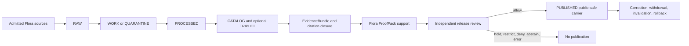

<!-- [KFM_META_BLOCK_V2]
doc_id: kfm://data/proofs/proof-pack/flora/readme
title: data/proofs/proof_pack/flora/ — Flora ProofPack Support
version: v0.2.0
type: directory-readme; proof-pack-domain-lane; flora-release-support-index
status: repository-grounded draft; accepted Flora ProofPack schema, producer, deterministic validator, public-safe fixtures, policy enforcement, review binding, release linkage, and runtime use remain unverified
owners:
  - "NEEDS VERIFICATION — Flora domain steward"
  - "NEEDS VERIFICATION — evidence, ProofPack, EvidenceBundle, and citation-validation stewards"
  - "NEEDS VERIFICATION — taxonomy, source-role, rights, sensitivity, geoprivacy, stewardship, and sovereignty reviewers"
  - "NEEDS VERIFICATION — validation, release, correction, withdrawal, rollback, governed-API, Evidence Drawer, governed-AI, and docs stewards"
created: 2026-06-25
updated: 2026-07-26
policy_label: restricted-review; proof-pack-support; flora; cite-or-abstain; deny-by-default-location; no-direct-public-path; release-gated
path: data/proofs/proof_pack/flora/README.md
truth_posture: >
  CONFIRMED exact target path and prior blob, canonical proofs-root contract, current ProofPack parent lane,
  repository-grounded Flora domain proof lane, Flora EvidenceBundle and citation-validation lanes, fielded
  EvidenceBundle semantic contract and machine schema, current Flora workflow holds, scaffold-level Flora
  policy homes, and no established Flora proof payload, candidate dossier, release, or public serving /
  PROPOSED Flora ProofPack profile, deterministic identity, source-role and sensitivity closure, safe-
  representation evidence, review packet, correction-invalidation contract, and automation graduation /
  UNKNOWN recursive ProofPack payload inventory, active writers and consumers, generated indexes, access
  controls, resolver runtime, public routes, caches, hosting, and public effects / NEEDS VERIFICATION
  accountable owners, accepted ProofPack contract and schema, executable producer and validators, Flora-
  specific fixtures, policy and geoprivacy enforcement, stewardship and sovereignty review, release instances,
  correction propagation, withdrawal behavior, retention, and rollback drills
evidence_snapshot:
  repository: bartytime4life/Kansas-Frontier-Matrix
  base_ref: main
  base_commit: 4ce20df8b12d640fa527147407a24f56d61e0b46
  prior_blob: b09212e278121a317652d1b9106d2fdbca267a96
  proofs_root_blob: 0d8b6e92d3b4b9ff3961d29c53ead497922a31cf
  proof_pack_parent_blob: b03674bebb03252511cb76e03b949e885a9fd79f
  flora_proof_lane_blob: 130effccfd6e14f2660de04c3cc30d839503ef8a
  flora_workflow_blob: c792d126e5726d8895f56fd97800bee7fcba4a15
related:
  - ../../README.md
  - ../README.md
  - ../../flora/README.md
  - ../../evidence_bundle/flora/README.md
  - ../../citation_validation/flora/README.md
  - ../../../receipts/README.md
  - ../../../registry/sources/flora/README.md
  - ../../../processed/flora/README.md
  - ../../../catalog/domain/flora/README.md
  - ../../../published/flora/README.md
  - ../../../rollback/flora/README.md
  - ../../../../contracts/evidence/evidence_bundle.md
  - ../../../../contracts/domains/flora/README.md
  - ../../../../schemas/contracts/v1/evidence/evidence_bundle.schema.json
  - ../../../../schemas/contracts/v1/domains/flora/README.md
  - ../../../../policy/domains/flora/README.md
  - ../../../../policy/sensitivity/flora/README.md
  - ../../../../release/candidates/flora/README.md
  - ../../../../release/README.md
  - ../../../../docs/domains/flora/README.md
  - ../../../../docs/doctrine/directory-rules.md
  - ../../../../.github/workflows/domain-flora.yml
notes:
  - "Same-path Markdown modernization only; no Flora source bytes, ProofPack payloads, EvidenceBundle instances, contracts, schemas, policies, validators, fixtures, workflows, candidates, releases, routes, hosting, access controls, or publication state changed."
  - "This lane narrows the parent ProofPack responsibility to Flora. It must reference rather than duplicate source, evidence, receipt, policy, catalog, release, correction, withdrawal, rollback, or public-delivery authority."
  - "Exact or reverse-engineerable rare, protected, culturally sensitive, steward-controlled, or private-land Flora locations and control-defeating transform details remain denied from ordinary public-repository review lanes."
  - "The current domain-flora workflow holds validation, proof production, and release dry-run; it does not directly consume this child path or establish ProofPack maturity."
  - "The documentation rollback target for v0.2.0 is prior blob b09212e278121a317652d1b9106d2fdbca267a96."
[/KFM_META_BLOCK_V2] -->

<a id="top"></a>

# `data/proofs/proof_pack/flora/` — Flora ProofPack Support

> **One-line purpose.** Hold or index compact, claim-scoped Flora ProofPack support that assembles immutable references to botanical evidence, source roles, rights, sensitivity, safe representation, validation, policy, review, catalog, release dependency, correction, withdrawal, and rollback without becoming source truth, policy authority, release authority, or a public data service.

[](#status)
[](#authority-level)
[](#flora-claim-and-source-role-closure)
[](#sensitivity-geoprivacy-and-safe-representation)
[](#outputs)
[](#validation)

> [!IMPORTANT]
> **A ProofPack supports a release decision; it is not the decision.** File placement, schema validity, a green check, or a complete-looking packet does not make a Flora claim botanically true, rights-cleared, sensitivity-safe, steward-approved, released, public, or suitable for collection or access use.

> [!CAUTION]
> Missing, stale, conflicting, role-collapsed, rights-unclear, sensitivity-unsafe, unreleased, withdrawn, invalidated, or unresolvable support must yield a finite fail-closed result such as `ABSTAIN`, `HOLD`, `RESTRICT`, `DENY`, or `ERROR`.

> [!WARNING]
> Do not place exact or reverse-engineerable rare, protected, culturally sensitive, steward-controlled, or private-land Flora locations—or collection clues, access directions, withheld precision, redaction offsets, generalization thresholds, transform parameters, or other control-defeating details—in this ordinary repository lane.

**Path:** `data/proofs/proof_pack/flora/README.md`  
**Owning responsibility:** `data/proofs/proof_pack/`  
**Domain segment:** `flora/`  
**Direct public access:** denied  
**Documentation rollback target:** prior blob `b09212e278121a317652d1b9106d2fdbca267a96`

**Quick navigation:** [Purpose](#purpose) · [Authority](#authority-level) · [Status](#status) · [Belongs](#what-belongs-here) · [Exclusions](#what-does-not-belong-here) · [Inputs](#inputs) · [Outputs](#outputs) · [Validation](#validation) · [Review](#review-burden) · [Related](#related-folders) · [ADRs](#adrs) · [Last reviewed](#last-reviewed) · [Operating contract](#operating-contract) · [ProofPack profile](#flora-proofpack-profile) · [Claims](#flora-claim-and-source-role-closure) · [Sensitivity](#sensitivity-geoprivacy-and-safe-representation) · [Lifecycle](#lifecycle-and-authority-relationship) · [Automation](#workflow-and-automation-posture) · [Correction](#correction-withdrawal-invalidation-and-rollback) · [Evidence](#repository-evidence-ledger) · [Verification](#open-verification-register) · [No-loss](#no-loss-ledger)

---

## Purpose

`data/proofs/proof_pack/flora/` is the Flora domain sublane under the ProofPack support family. It is intended for compact review packets or indexes that help an independent reviewer inspect whether a specific botanical candidate has enough governed support to proceed toward release evaluation.

A Flora ProofPack should make these questions answerable:

1. What exact claim, object family, taxon concept, artifact, geography, time, audience, and representation is under review?
2. Which admitted sources, `EvidenceRef` values, `EvidenceBundle` records, receipts, validation reports, policy decisions, and catalog records support it?
3. Are authority, observation, context, model, aggregate, synthetic, candidate, and released roles distinct where material?
4. Are rights, sovereignty, cultural sensitivity, rare-plant sensitivity, stewardship, private-land context, and join-induced disclosure risks resolved?
5. Is exact/internal geometry separated from public generalized, withheld, staged, or denied representation?
6. Which review, release-candidate, correction, withdrawal, invalidation, and rollback records remain outside the ProofPack but are referenced by it?
7. Which finite review-support outcome is justified?

This lane does not admit sources, define botanical truth, establish taxonomy authority, execute a geoprivacy transform, decide policy, approve release, publish a layer, or authorize collection or access.

## Authority level

**Implementation-bearing Flora sublane under the canonical ProofPack support responsibility.**

The authority split is deliberate:

| Responsibility | Home | Boundary |
|---|---|---|
| Parent proof responsibility | [`data/proofs/`](../../README.md) | Owns cross-cutting proof support; not release authority. |
| ProofPack family support | [`data/proofs/proof_pack/`](../README.md) | Defines the family lane and domain-sublane pattern. |
| Flora domain proof support | [`data/proofs/flora/`](../../flora/README.md) | Broader Flora proof packet, claim-support, and limitation lane. |
| Flora EvidenceBundle support | [`data/proofs/evidence_bundle/flora/`](../../evidence_bundle/flora/README.md) | Claim-scope evidence closure; not a duplicate ProofPack authority. |
| Flora citation validation | [`data/proofs/citation_validation/flora/`](../../citation_validation/flora/README.md) | Citation and evidence-reference closure support. |
| Source identity and activation | [`data/registry/sources/flora/`](../../../registry/sources/flora/README.md) | Source role, rights, cadence, sensitivity, and admission. |
| Process memory | [`data/receipts/`](../../../receipts/README.md) | Records what ran; does not become release-grade proof by itself. |
| Catalog and provenance carriers | [`data/catalog/`](../../../catalog/README.md) | Discovery and lineage; not release approval. |
| Policy and sensitivity | [`policy/domains/flora/`](../../../../policy/domains/flora/README.md) and [`policy/sensitivity/flora/`](../../../../policy/sensitivity/flora/README.md) | Admissibility, access, and safe-representation decisions. |
| Release, correction, withdrawal, rollback | [`release/`](../../../../release/README.md) | Decision authority remains outside proof data. |
| Public delivery | Governed APIs and released artifacts | Public clients must not read this lane directly. |

This same-path update creates no new proof family, lifecycle phase, domain root, release state, or public route.

## Status

| Surface | Repository-grounded result |
|---|---|
| Exact target | **CONFIRMED** at `main@4ce20df8b12d640fa527147407a24f56d61e0b46`; prior blob `b09212e278121a317652d1b9106d2fdbca267a96` |
| Documentation version | `v0.2.0` |
| ProofPack parent lane | **CONFIRMED authored draft** at [`data/proofs/proof_pack/README.md`](../README.md) |
| Flora proof lane | **CONFIRMED repository-grounded draft** at [`data/proofs/flora/README.md`](../../flora/README.md) |
| Flora EvidenceBundle and citation-validation lanes | **CONFIRMED repository-grounded drafts** |
| Shared EvidenceBundle contract/schema | **CONFIRMED fielded semantic contract and Draft 2020-12 schema** |
| Concrete Flora ProofPack payloads | **Not established by this bounded inspection** |
| Accepted ProofPack contract/schema/profile | **Not established** |
| Accepted Flora ProofPack producer or deterministic command | **Not established** |
| Flora policy and sensitivity enforcement | **Not established; current policy homes are scaffold-level** |
| Current Flora workflow | **CONFIRMED readiness workflow** with explicit validation, proof, and release-dry-run holds |
| Active Flora candidate or published release | **Not established** |
| Direct public access | **Denied** |

A successful readiness or hold job proves only its declared maturity check. It is not a `ProofPack`, `EvidenceBundle`, stewardship decision, geoprivacy decision, release decision, or publication authority.

## What belongs here

Under an accepted ProofPack profile, appropriate contents include:

- Flora ProofPack instances or indexes that contain immutable references rather than duplicated source payloads;
- candidate-scope summaries for taxonomy, occurrences, specimens, rare plants, vegetation communities, invasive plants, phenology, range/distribution, habitat association, surveys, restoration, and governed cross-lane products;
- source-role, evidence, citation, validation, rights, sensitivity, geoprivacy, integrity, catalog, review, release-dependency, correction, withdrawal, and rollback closure summaries;
- safe-representation evidence showing how exact/internal and public representations remain separated;
- README, inventory, digest, migration, and disposition sidecars that explain the lane without creating parallel authority.

Every record must remain reconstructable to its source descriptors, evidence, receipts, policy/review state, release dependency, and correction lineage.

## What does not belong here

| Do not place here | Correct home or action |
|---|---|
| Raw GBIF, iNaturalist, USDA PLANTS, iDigBio, herbarium, NatureServe, KDWP, KBS, KSU, vegetation-index, restoration, or other source payloads | Corresponding `data/raw/`, `data/work/`, or `data/quarantine/` lane |
| Exact or reverse-engineerable sensitive Flora locations and withheld control parameters | Restricted storage, quarantine, aggregation, redaction, staged access, or denial |
| Process-only receipts | `data/receipts/` |
| STAC, DCAT, PROV, or domain catalog records | `data/catalog/` |
| Semantic contracts or machine schemas | `contracts/` and `schemas/` |
| Policy logic, rights decisions, sensitivity rules, geoprivacy rules, stewardship decisions, or access decisions | `policy/` and applicable steward authority |
| Candidate dossiers, promotion decisions, release manifests, correction notices, withdrawal notices, or rollback cards | `release/` |
| Public PMTiles, GeoParquet, GeoJSON, COG, raster, vector, API payloads, reports, stories, maps, search, graphs, exports, or dashboards | `data/published/` and governed delivery roots after release |
| AI summaries presented as proof | Governed AI may cite a released packet; generated language cannot replace proof |
| Collection or access guidance derived from sensitive location information | Deny or refer to authorized stewardship channels |

## Inputs

A Flora ProofPack may reference, without duplicating mutable authority:

- admitted source descriptors and source-activation state;
- immutable RAW and processed artifact identities and digests;
- Flora semantic objects and machine-shape validation reports;
- `EvidenceRef` and `EvidenceBundle` records;
- source-role, taxonomy, uncertainty, provenance, rights, sensitivity, geoprivacy, and safe-representation records;
- receipts for retrieval, transformation, validation, redaction/generalization, catalog emission, and release dry-run;
- policy decisions, review records, catalog closure, release-candidate references, correction lineage, withdrawal state, and rollback targets.

Sensitive or restricted inputs remain in their owning controlled systems. A ProofPack should point to approved identifiers and bounded summaries, not reproduce protected content.

## Outputs

The lane may provide a finite review-support result and an inspectable reference graph for an independent reviewer. Suggested outcomes are:

```text
READY_FOR_RELEASE_REVIEW
HOLD
RESTRICT
DENY
ABSTAIN
ERROR
WITHDRAW
```

`READY_FOR_RELEASE_REVIEW` means only that the accepted ProofPack profile is complete enough for release review. It does not mean approved, released, published, public-safe, or suitable for collection or access use.

Ordinary public clients, MapLibre, Evidence Drawer, search, graph, exports, and governed AI must use released, policy-filtered interfaces rather than this internal lane.

## Validation

Validation should be deterministic, no-network by default, profile-pinned, and fail closed. At minimum, verify:

| Validation family | Required behavior |
|---|---|
| Placement and identity | Path, `proof_pack_id`, candidate scope, versions, digests, and immutable references are coherent. |
| Contract and schema | The accepted ProofPack contract/schema/profile validates; unknown fields or missing required references fail according to that profile. |
| Evidence closure | Every material claim resolves to the correct EvidenceBundle support or yields `ABSTAIN`, `HOLD`, or `DENY`. |
| Source-role anti-collapse | Authority, observation, context, model, aggregate, synthetic, candidate, and released roles remain distinct. |
| Botanical identity | Taxon concept, authority snapshot, synonym/crosswalk handling, and conflicts are explicit. |
| Rights and sensitivity | Rights, redistribution, cultural/steward sensitivity, private-land context, and access conditions are resolved or fail closed. |
| Safe representation | Exact/internal geometry is separated from generalized, withheld, staged, or denied public representation. |
| Join-induced sensitivity | Cross-lane joins cannot reconstruct restricted locations or private context. |
| Integrity and reproducibility | Inputs, outputs, transforms, validator/profile versions, and digests close deterministically where practical. |
| Policy and review | Required policy decisions and independent review references exist; routing is not approval evidence. |
| Release dependency | Candidate and release references are present without claiming release. |
| Correction and rollback | Stale, correction, withdrawal, invalidation, supersession, and rollback references are complete. |
| Public membrane | No direct RAW, WORK, QUARANTINE, proof, candidate, or restricted-store path is exposed as public truth. |

No accepted end-to-end Flora ProofPack validator or producer was established in this bounded review. A pass proves only the check's declared scope.

## Review burden

Accountable ownership remains **NEEDS VERIFICATION**. Review burden should increase with claim significance and sensitivity.

At minimum:

- proof/evidence review for claim and EvidenceBundle closure;
- Flora domain review for botanical identity and object-family scope;
- source/rights review for authority, terms, redistribution, and citation;
- sensitivity/geoprivacy/stewardship review for rare, protected, culturally sensitive, private-land, or join-sensitive material;
- validation review for deterministic negative cases and profile/version closure;
- independent release review for candidate, correction, withdrawal, and rollback handoff.

CODEOWNERS routing, authorship, a green workflow, or documentation completeness is not independent approval.

## Related folders

- Parent proof support: [`data/proofs/`](../../README.md)
- ProofPack family: [`data/proofs/proof_pack/`](../README.md)
- Flora domain proof support: [`data/proofs/flora/`](../../flora/README.md)
- Flora EvidenceBundle support: [`data/proofs/evidence_bundle/flora/`](../../evidence_bundle/flora/README.md)
- Flora citation validation: [`data/proofs/citation_validation/flora/`](../../citation_validation/flora/README.md)
- Source registry: [`data/registry/sources/flora/`](../../../registry/sources/flora/README.md)
- Processed Flora lane: [`data/processed/flora/`](../../../processed/flora/README.md)
- Flora catalog: [`data/catalog/domain/flora/`](../../../catalog/domain/flora/README.md)
- Receipts: [`data/receipts/`](../../../receipts/README.md)
- Published Flora: [`data/published/flora/`](../../../published/flora/README.md)
- Flora rollback support: [`data/rollback/flora/`](../../../rollback/flora/README.md)
- Flora contracts and schemas: [`contracts/domains/flora/`](../../../../contracts/domains/flora/README.md) · [`schemas/contracts/v1/domains/flora/`](../../../../schemas/contracts/v1/domains/flora/README.md)
- Flora policy: [`policy/domains/flora/`](../../../../policy/domains/flora/README.md) · [`policy/sensitivity/flora/`](../../../../policy/sensitivity/flora/README.md)
- Flora release candidates: [`release/candidates/flora/`](../../../../release/candidates/flora/README.md)
- Doctrine and workflow: [Directory Rules](../../../../docs/doctrine/directory-rules.md) · [Flora domain](../../../../docs/domains/flora/README.md) · [domain-flora workflow](../../../../.github/workflows/domain-flora.yml)

## ADRs

Relevant proposed decisions include ADR-0001 (schema home), ADR-0011 (receipt/proof/manifest/catalog separation), ADR-0012 (connector output boundary), ADR-0015 (published aliases and rollback split), and ADR-0025 (public clients do not read internal stores). This README accepts none.

An accepted ADR, contract/profile, migration note, and rollback plan are required before creating parallel proof authority, changing the lifecycle responsibility, moving restricted content into ordinary review paths, or turning this lane into a public service.

## Last reviewed

- **Date:** 2026-07-26
- **Evidence boundary:** `main@4ce20df8b12d640fa527147407a24f56d61e0b46`
- **Review type:** complete target baseline plus parent ProofPack, parent proof, Flora proof, and Flora workflow evidence
- **Recursive payload/runtime inspection:** not performed
- **Owners, accepted profile, enforcement, release instances, retention, correction propagation, and operational rollback:** need verification

Re-review on ProofPack contract/schema, writer, validator, policy, sensitivity, source, release, public-consumer, correction, withdrawal, retention, or rollback changes—or within six months.

## Operating contract

A Flora ProofPack must identify the exact claim and candidate scope it supports; reference admitted sources and EvidenceBundles; preserve botanical identity and source roles; record rights, sensitivity, safe-representation, validation, policy, review, catalog, integrity, correction, withdrawal, and rollback dependencies; and emit a finite review-support outcome.

Missing or unresolved support must narrow scope or produce `HOLD`, `RESTRICT`, `DENY`, `ABSTAIN`, `ERROR`, or `WITHDRAW`—never plausible completion.

## Flora ProofPack profile

The exact machine profile remains **PROPOSED / NEEDS VERIFICATION**. A complete packet should minimally carry these families:

| Family | Minimum intent |
|---|---|
| Identity | Stable `proof_pack_id`, domain, profile/version, candidate ID, object/artifact kind, spec hash, created/reviewed times. |
| Scope | Claim IDs, taxon concepts, object families, spatial/temporal support, audience, intended public carrier. |
| Sources | Source descriptor IDs, activation state, source roles, rights, cadence, citation obligations. |
| Evidence | EvidenceBundle IDs, EvidenceRef closure, support limitations, conflicting or missing evidence. |
| Validation | Deterministic report IDs, finite outcomes, validator/profile/schema versions, negative-case closure. |
| Sensitivity | Policy decision IDs, sensitivity class, exact/internal posture, public-safe representation, redaction/generalization receipts without exposing control parameters. |
| Integrity | Input/output digests, transform references, checksums, catalog and artifact identity agreement. |
| Review | Required reviewer roles, review records, unresolved obligations, separation-of-duty posture. |
| Release dependency | Candidate references, target artifacts, promotion dependency, explicit not-released state. |
| Correction | Stale state, correction lineage, invalidation targets, withdrawal state, rollback target. |
| Outcome | One finite review-support outcome with reason codes and limitations. |

A packet may use stable references and bounded summaries to avoid copying sensitive or mutable authority into this lane.

## Flora claim and source-role closure

| Claim or carrier | Required distinction |
|---|---|
| Taxonomic authority | Authority snapshot and taxon concept are not occurrence evidence. |
| Specimen record | Preserved specimen evidence is not automatically a current occurrence. |
| Observation | Observation evidence is not an authoritative range boundary. |
| Rare-plant record | Restricted exact evidence is not a public feature. |
| Vegetation community | Community classification is not individual-species occurrence proof. |
| Range polygon | Aggregated or interpreted range is not a precise occurrence set. |
| Distribution surface | Modeled probability or suitability is not observed presence. |
| Phenology observation | Time-bounded observation is not a permanent species trait. |
| Invasive-plant record | Detection and management context must remain distinct. |
| Restoration planting | Planned or implemented planting is not naturally occurring distribution. |
| Habitat association | Cross-lane association does not transfer habitat authority into Flora or vice versa. |
| Public map/API/AI carrier | Downstream representation is not botanical, policy, or release authority. |

A record or packet that collapses these roles must be quarantined, narrowed, relabeled, or denied.

## Sensitivity, geoprivacy, and safe representation

Required posture:

- exact/internal sensitive geometry remains in restricted owning systems;
- public proof support uses approved identifiers, bounded summaries, and public-safe representations;
- no redaction offset, generalization threshold, jitter seed, transform parameter, or reconstruction clue is exposed;
- rights, stewardship, sovereignty, cultural sensitivity, private-land context, and collection-risk concerns remain first-class;
- joins across Flora, Fauna, Habitat, roads, parcels, restoration, archaeology, or infrastructure are evaluated for disclosure amplification;
- missing policy or review produces a finite fail-closed outcome rather than public release.

A geoprivacy transform cannot be inferred merely from reduced coordinate precision. It requires an accepted policy/profile, deterministic receipt, reviewer state, and public-safe output proof.

## Lifecycle and authority relationship


```mermaid
flowchart LR
    S[Admitted Flora sources] --> R[RAW]
    R --> W[WORK or QUARANTINE]
    W --> P[PROCESSED]
    P --> C[CATALOG and optional TRIPLET]
    C --> E[EvidenceBundle and citation closure]
    E --> PP[Flora ProofPack support]
    PP --> RV[Independent release review]
    RV -->|allow| PUB[PUBLISHED public-safe carrier]
    RV -->|hold, restrict, deny, abstain, error| H[No publication]
    PUB --> X[Correction, withdrawal, invalidation, rollback]
```

The ProofPack lane is downstream of evidence resolution and upstream of release review. It is neither a lifecycle substitute nor a publication mechanism.

## Workflow and automation posture

The current `domain-flora` workflow is a read-only readiness workflow. It explicitly holds:

- executable Flora validation;
- Flora proof production;
- Flora release dry-run.

It checks the broader Flora proof lane and related boundaries, but it does not directly require or validate this ProofPack child path. It performs no live source access, geoprivacy transform, ProofPack assembly, policy decision, release, deployment, or publication.

Automation must not graduate this lane until all of the following are accepted and verified:

1. canonical ProofPack semantic contract and machine schema/profile;
2. deterministic no-network producer or assembly command;
3. public-safe positive and negative Flora fixtures;
4. source-role, taxonomy, rights, sensitivity, geoprivacy, evidence, integrity, review, release-dependency, correction, withdrawal, and rollback validators;
5. access controls and restricted-reference handling;
6. finite outcome grammar and stable reason codes;
7. independent review and release handoff;
8. correction propagation, cache/index invalidation, withdrawal, and rollback drills.

A green held workflow remains readiness evidence only.

## Correction, withdrawal, invalidation, and rollback

A Flora ProofPack must support correction without silent overwrite.

Correction or withdrawal is required when:

- botanical identity, synonymy, taxon concept, occurrence, specimen provenance, method, time, uncertainty, rights, source role, sensitivity, or evidence support changes materially;
- a public-safe representation is found reversible or too precise;
- joins expose restricted or private context;
- a cited source, EvidenceBundle, validation report, policy decision, review, catalog record, artifact digest, or release record is invalidated;
- a release candidate is denied, withdrawn, superseded, or rolled back.

A correction flow should:

1. record the new evidence or defect;
2. invalidate affected ProofPack support and downstream references;
3. create new receipts, evidence, validation, policy/review, and release records as applicable;
4. preserve prior lineage and reason codes;
5. withdraw or replace public carriers through release governance;
6. invalidate caches, indexes, search, graph, exports, and generated summaries where affected;
7. retain a rollback target and audit trail.

## Repository evidence ledger

| Evidence | Status | Supports | Limits |
|---|---:|---|---|
| Target prior blob `b09212e278121a317652d1b9106d2fdbca267a96` | **CONFIRMED** | Existing Flora ProofPack README, stable document identity, sensitivity and authority boundaries. | Baseline predates newer parent and Flora proof documentation. |
| [`data/proofs/README.md`](../../README.md) | **CONFIRMED repository-grounded draft** | Canonical proof-support responsibility and separation from receipts, release, and public serving. | Recursive payloads and runtime remain unverified. |
| [`data/proofs/proof_pack/README.md`](../README.md) | **CONFIRMED authored draft** | ProofPack family meaning, domain-sublane pattern, expected references, and anti-collapse rules. | Exact schema, validator, instances, and complete domain coverage remain unverified. |
| [`data/proofs/flora/README.md`](../../flora/README.md) | **CONFIRMED repository-grounded draft** | Flora domain proof boundary, fielded shared EvidenceBundle surfaces, workflow holds, release and sensitivity posture. | Concrete Flora proof inventory and enforcement remain bounded. |
| [`.github/workflows/domain-flora.yml`](../../../../.github/workflows/domain-flora.yml) | **CONFIRMED workflow source** | Explicit validation, proof-production, and release-dry-run holds; no source access or publication. | Does not directly consume or validate this child lane. |
| Flora policy homes | **CONFIRMED scaffold-level** | Intended policy and sensitivity responsibility. | Executable enforcement not established. |
| Release candidate lane | **CONFIRMED repository-grounded draft** | No active candidate or release established by bounded inspection. | Unindexed or external state remains unknown. |

## Open verification register

| Item | Status | Required evidence |
|---|---:|---|
| Recursive Flora ProofPack payload inventory | `NEEDS VERIFICATION` | Pinned recursive tree, payload families, generated indexes, restricted/external stores |
| Canonical ProofPack contract/schema/profile | `UNKNOWN` | Accepted semantic contract, machine schema, versioning and compatibility policy |
| Producer and deterministic command | `UNKNOWN` | Executable implementation, no-network fixtures, receipts, reproducibility tests |
| Flora-specific validation and negative cases | `UNKNOWN` | Accepted validator suite, reason codes, fixture coverage, CI execution |
| Rights, sensitivity, geoprivacy, stewardship enforcement | `UNKNOWN` | Executable policy, decisions, redaction/generalization receipts, reviewer records |
| Writers, consumers, access controls | `UNKNOWN` | Pipeline/tool/API/UI/AI inventory, roles, permissions, audit evidence |
| Release, correction, withdrawal, rollback linkage | `UNKNOWN` | Emitted candidates, manifests, promotion decisions, notices, cards, drills |
| Public invalidation and cache behavior | `UNKNOWN` | Route, tile, search, graph, export, cache, correction propagation evidence |

Unknowns narrow claims and block higher-risk transitions; they do not invite plausible defaults.

## No-loss ledger

| Prior element | Disposition |
|---|---|
| Stable path and `doc_id` | Preserved |
| Flora ProofPack purpose | Preserved and clarified |
| Proof/release/catalog/receipt separation | Preserved and strengthened |
| Rare-plant and sensitive-location fail-closed posture | Preserved and strengthened |
| Source-role, taxonomy, uncertainty, public/restricted, modeled/observed distinctions | Preserved |
| Proposed folder/file pattern | Replaced with profile-dependent, non-authoritative guidance to avoid implying current payload structure |
| Lifecycle, validation, failure modes, and definition-of-done material | Preserved and integrated into current contract sections |
| Exact sensitive coordinates or control parameters | None added |
| Source, payload, contract, schema, policy, fixture, workflow, release, route, or publication change | None |
| Documentation rollback target | Prior blob recorded |

### Change history

#### v0.2.0 — 2026-07-26

- reconciled the lane with the current parent ProofPack and Flora proof documentation;
- normalized the first twelve folder-contract sections to the current Directory Rules pattern;
- added pinned evidence, a bounded Flora ProofPack profile, source-role and safe-representation matrices, automation graduation criteria, correction/invalidation flow, verification register, and no-loss ledger;
- preserved all fail-closed rights, sensitivity, geoprivacy, review, release, correction, and rollback boundaries;
- changed Markdown only.

[Back to top](#top)
