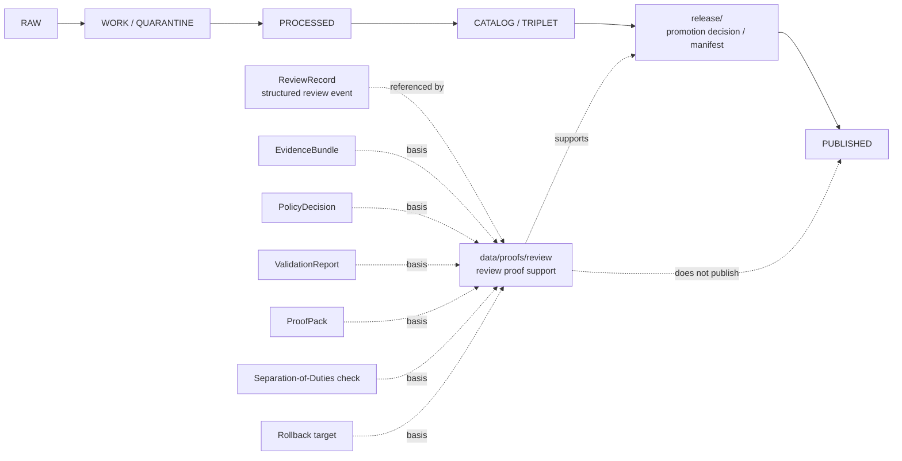

<!-- [KFM_META_BLOCK_V2]
doc_id: kfm://data/proofs/review/readme
title: data/proofs/review README
type: directory-readme
version: v0.1
status: draft
owners:
  - <data steward — TODO>
  - <proof steward — TODO>
  - <governance steward — TODO>
  - <review steward — TODO>
  - <release steward — TODO>
created: 2026-06-25
updated: 2026-06-25
policy_label: public-review
path: data/proofs/review/README.md
related:
  - ../README.md
  - ../proof_pack/README.md
  - ../evidence_bundle/README.md
  - ../validation_report/README.md
  - ../citation_validation/README.md
  - ../integrity/README.md
  - ../../receipts/README.md
  - ../../catalog/README.md
  - ../../published/README.md
  - ../../../release/README.md
  - ../../../contracts/governance/ReviewRecord.md
  - ../../../contracts/review/README.md
  - ../../../docs/governance/SEPARATION_OF_DUTIES.md
  - ../../../docs/governance/REVIEW_DUTIES.md
  - ../../../docs/architecture/publication/RELEASE_GATES.md
  - ../../../docs/adr/ADR-0011-receipts-vs-proofs-vs-manifests-vs-catalog-separation.md
  - ../../../docs/doctrine/directory-rules.md
  - ../../../contracts/README.md
  - ../../../schemas/README.md
  - ../../../policy/README.md
tags:
  - kfm
  - data
  - proofs
  - review
  - review-record
  - separation-of-duties
  - evidence-bundle
  - policy-decision
  - promotion-decision
  - release-gate
  - rollback
  - cite-or-abstain
notes:
  - "Directory README for review proof support. It is not itself a ReviewRecord schema, ReviewRecord instance, PolicyDecision, PromotionDecision, ReleaseManifest, or Review Duties standard."
  - "Review proof objects support auditability by connecting ReviewRecords to evidence, policy, validation, catalog closure, release candidates, correction paths, and rollback targets."
  - "A review may support promotion, but it does not itself promote or publish anything."
[/KFM_META_BLOCK_V2] -->

<a id="top"></a>

# `data/proofs/review/`

> Proof-support lane for KFM review evidence. Files under this directory should make review posture inspectable by connecting `ReviewRecord` objects, separation-of-duties checks, evidence support, policy context, validation outputs, release candidates, correction paths, and rollback targets.


> [!IMPORTANT]
> **Status:** `draft`  
> **Owner:** `<data steward>` · `<proof steward>` · `<governance steward>` · `<review steward>` · `<release steward>` — TODO  
> **Path:** `data/proofs/review/README.md`  
> **Truth posture:** CONFIRMED doctrine / PROPOSED implementation guidance / NEEDS VERIFICATION for emitted review proof objects, schemas, validators, CI workflows, CODEOWNERS, branch protection, and release-gate enforcement.

> [!WARNING]
> Review proof support is **not** the review decision itself. A review proof may reference a `ReviewRecord`, `PolicyDecision`, `PromotionDecision`, `ReleaseManifest`, `EvidenceBundle`, `RollbackCard`, or platform check, but it must not become a parallel authority for any of them.

---

## Quick jumps

| Section | Use it for |
|---|---|
| [1. Purpose](#1-purpose) | What this directory is for. |
| [2. Authority boundary](#2-authority-boundary) | How review proofs differ from ReviewRecords, policy, release, and receipts. |
| [3. What belongs here](#3-what-belongs-here) | Accepted review proof files and support bundles. |
| [4. What must not live here](#4-what-must-not-live-here) | Wrong homes and anti-collapse rules. |
| [5. Required review proof contents](#5-required-review-proof-contents) | Minimum fields and reference families. |
| [6. Review proof families](#6-review-proof-families) | Common proof categories. |
| [7. Naming and identity](#7-naming-and-identity) | Suggested file and folder naming. |
| [8. Lifecycle relationship](#8-lifecycle-relationship) | How review proof sits beside RAW → PUBLISHED. |
| [9. Validation checklist](#9-validation-checklist) | What maintainers should check. |
| [10. Failure modes](#10-failure-modes) | Drift and overclaim patterns to block. |
| [11. Definition of done](#11-definition-of-done) | What is still needed for operational maturity. |

---

## 1. Purpose

`data/proofs/review/` stores **review proof support**: structured, reviewable objects that demonstrate whether required review posture is present, complete, separated, evidence-based, policy-aware, and traceable.

A review proof should help answer:

- Which object, claim, file, source, schema, policy, release candidate, map layer, Focus Mode answer, Evidence Drawer payload, or public artifact was reviewed?
- Which `ReviewRecord` objects apply, and are they scoped to the correct decision?
- Which evidence, policy, validation, sensitivity, rights, release, catalog, correction, or rollback references formed the review basis?
- Did the reviewer have the correct role and authority for the review scope?
- Was separation of duties required, and if so, was author-versus-approver separation satisfied?
- Were review conditions resolved before promotion, release, public display, correction, or withdrawal?
- Does the review expire, require refresh, or become invalid if source evidence, policy, sensitivity posture, or release scope changes?

This directory exists so review support is auditable without turning comments, chats, CI checks, or human summaries into unstructured governance memory.

[Back to top](#top)

---

## 2. Authority boundary

Review proof is an audit-support family. It connects other families; it does not replace them.

| Artifact family | Canonical home | Role | Boundary rule |
|---|---|---|---|
| `ReviewRecord` semantic meaning | `contracts/governance/ReviewRecord.md` | Defines what a review event means. | This README does not define the object contract. |
| `ReviewRecord` instances | Approved governance/proof/release instance home — NEEDS VERIFICATION | Record who reviewed what, in what role, with what disposition. | A review instance may be referenced here; it is not replaced by a proof summary. |
| Review proof support | `data/proofs/review/` | Assembles proof that review posture, basis, separation, conditions, and closure are inspectable. | Supports review audit; does not approve or promote by itself. |
| Receipts | `data/receipts/` | Process memory for runs, validation, AI, platform checks, release-time actions. | Receipts may be basis refs; they are not review proof alone. |
| EvidenceBundles | `data/proofs/evidence_bundle/` or approved proof lane | Evidence support for claims. | Review proof must dereference evidence; it cannot replace evidence. |
| PolicyDecision | `policy/` outputs or approved policy decision home — NEEDS VERIFICATION | Records allow/deny/restrict/abstain/error policy results. | Review proof may cite policy results; it does not decide policy. |
| PromotionDecision / ReleaseManifest | `release/` | Records promotion and release authority. | Review proof may support release; it does not release. |
| Public artifacts | `data/published/` | Released public-safe carriers. | Public clients must not read this proof directory as runtime truth. |

> [!NOTE]
> Review proof is useful because it gathers references that otherwise scatter across comments, CI, policy output, review records, and release dossiers. The gathering is not authority transfer.

[Back to top](#top)

---

## 3. What belongs here

Use this folder for review-proof files that are safe to store under repository policy and useful for audit or release review.

| Accepted item | Suggested placement | Notes |
|---|---|---|
| Review closure proof | `data/proofs/review/<domain_or_scope>/<review_id>.review-proof.json` | Shows review basis, disposition, conditions, and closure state. |
| Separation-of-duties proof | `data/proofs/review/sod/<scope>/<review_id>.sod-proof.json` | Shows author/reviewer separation, role coverage, and materiality trigger. |
| Review condition closure proof | `data/proofs/review/conditions/<review_id>.condition-closure.json` | Shows requested changes or approval conditions were resolved. |
| Escalation support proof | `data/proofs/review/escalation/<scope>/<review_id>.escalation-proof.json` | Shows why review escalated and what authority accepted it. |
| Release review support | `data/proofs/review/release/<release_id>.review-proof.json` | Points to release candidate, ReviewRecords, policy, proof pack, catalog closure, and rollback. |
| AI-surface review proof | `data/proofs/review/ai/<scope>/<review_id>.review-proof.json` | Shows Focus Mode / Evidence Drawer / generated output review basis. |
| Sensitive-lane review proof | `data/proofs/review/sensitivity/<domain>/<review_id>.review-proof.json` | Shows rights, privacy, location exposure, sovereignty, ecology, archaeology, living-person, or other sensitive review support. |

> [!TIP]
> Prefer stable references and digests over copied prose. A review proof should make the audit path navigable, not duplicate every reviewed artifact.

[Back to top](#top)

---

## 4. What must not live here

| Excluded material | Correct home or action | Why |
|---|---|---|
| Raw source data, scans, exports, logs, or sensitive exact locations | `data/raw/`, `data/work/`, or `data/quarantine/` under domain policy | Review proofs should reference source material, not store it. |
| The semantic ReviewRecord contract | `contracts/governance/ReviewRecord.md` | Contracts own meaning. |
| ReviewRecord JSON schema | `schemas/contracts/v1/...` | Schemas own machine shape. |
| Policy bundles or decision logic | `policy/` | Policy owns allow/deny/restrict/abstain logic. |
| Release manifests, promotion decisions, rollback cards, correction notices, withdrawal notices | `release/` | Release authority stays in release roots. |
| Process receipts as primary artifacts | `data/receipts/` | Receipts are process memory. |
| Catalog records | `data/catalog/` | Catalog is discovery/interchange, not review proof. |
| Public-safe artifacts | `data/published/` after release gates | Published carriers are downstream. |
| GitHub comments, chat transcripts, or screenshots as the only review artifact | Convert to structured ReviewRecord and cite the comment/transcript only as basis | Review must be scoped, structured, and auditable. |
| AI-generated summary as review proof | Require EvidenceBundle, ReviewRecord, policy, validation, and review refs | Generated language is interpretive, not root truth. |

[Back to top](#top)

---

## 5. Required review proof contents

A review proof object should be structured enough for a validator to decide whether review support is complete. Exact schema is **PROPOSED** until verified.

| Field family | Required meaning | Example values / references |
|---|---|---|
| `review_proof_id` | Stable deterministic ID for this proof object. | `kfm-review-proof:<scope>:<review_id>:<digest>` |
| `review_scope` | Bounded scope of review. | `source`, `schema`, `policy`, `sensitivity`, `release`, `ai`, `ui`, `data`, `docs`, `cross_domain`. |
| `reviewed_object_refs` | Objects, files, claims, release candidates, policy bundles, outputs, or artifacts reviewed. | File refs, artifact refs, release IDs, claim IDs, PR refs. |
| `review_record_refs` | Structured ReviewRecord instances. | `review_record_id`, digest, status, disposition. |
| `reviewer_role_refs` | Reviewer roles and authority. | docs steward, domain steward, policy steward, sensitivity reviewer, release authority, AI-surface steward. |
| `author_refs` | Producer/author refs for separation checks. | GitHub actor, pipeline actor, service identity, steward ID. |
| `basis_refs` | Evidence, policy, validation, citation, schema, contract, source, ADR, catalog, release, or rollback basis. | EvidenceBundle, PolicyDecision, ValidationReport, ProofPack, CatalogMatrix, ADR. |
| `sod_assessment` | Whether separation of duties was required and satisfied. | `not_required`, `satisfied`, `waived_with_reason`, `failed`, `needs_verification`. |
| `condition_refs` | Approval conditions and closure refs. | Requested change IDs, follow-up proofs, validator results. |
| `disposition_summary` | The review outcome being supported. | approve, approve_with_conditions, request_changes, abstain, deny, escalate, informational. |
| `expiry_or_refresh` | Time or trigger requiring review refresh. | source cadence, policy change, evidence update, release scope change. |
| `release_refs` | Related release candidate, promotion, manifest, correction, withdrawal, or rollback refs. | `release/candidates/...`, `release/manifests/...`, `rollback_card_id`. |
| `integrity_refs` | Digests and schema/validator versions. | Input/output hashes, proof hash, validator version. |
| `outcome` | Finite proof-support result. | `REVIEW_READY`, `HOLD`, `DENY`, `ABSTAIN`, `ERROR`, `EXPIRED`, `SUPERSEDED`. |

### Minimal JSON shape, PROPOSED

```json
{
  "review_proof_id": "kfm-review-proof:<scope>:<review_id>:<digest>",
  "review_scope": "release",
  "reviewed_object_refs": [],
  "review_record_refs": [],
  "reviewer_role_refs": [],
  "author_refs": [],
  "basis_refs": [],
  "sod_assessment": {
    "required": true,
    "status": "needs_verification",
    "reason": "reviewer-role evidence missing"
  },
  "condition_refs": [],
  "disposition_summary": "HOLD",
  "expiry_or_refresh": null,
  "release_refs": [],
  "integrity_refs": [],
  "outcome": "HOLD",
  "reasons": [],
  "created_at": "<iso8601>",
  "created_by": "<tool-or-steward>",
  "schema_version": "PROPOSED"
}
```

[Back to top](#top)

---

## 6. Review proof families

| Family | Purpose | Typical blockers |
|---|---|---|
| `release-review` | Proves review support for release candidate promotion. | Missing rollback, missing policy decision, unresolved evidence, author as sole approver. |
| `sensitivity-review` | Proves rights/privacy/location/cultural/ecology/infrastructure review support. | Unresolved tier, missing steward, exact sensitive geometry, living-person leakage. |
| `source-review` | Proves source descriptor or source-role review support. | Missing rights, mixed source roles, unverified authority, stale cadence. |
| `schema-contract-review` | Proves semantic contract and schema changes were reviewed. | Shape/meaning collapse, compatibility break without ADR, missing fixtures. |
| `ai-surface-review` | Proves AI output or AI-facing surface was reviewed against cite-or-abstain. | Generated language used as evidence, missing EvidenceBundle, missing DENY/ABSTAIN behavior. |
| `ui-map-review` | Proves public UI/layer/drawer review support. | Direct RAW/WORK/CATALOG access, missing Evidence Drawer refs, sensitive geometry leak. |
| `condition-closure` | Proves approval conditions were completed. | Unresolved requested changes, stale reviewer approval, unverified CI. |
| `escalation-review` | Proves escalation path was invoked and resolved. | No accepted authority, unrecorded override, missing reason. |

[Back to top](#top)

---

## 7. Naming and identity

Suggested directory pattern:

```text
data/proofs/review/<review_scope>/<review_id>.review-proof.json
```

Suggested deterministic file name:

```text
review.<scope>.<reviewed_object_slug>.<review_id>.<short_hash>.json
```

Examples:

```text
review.release.habitat-layer-r001.rev-20260625.0123abcd.json
review.sensitivity.flora-rare-plant-generalization.rev-20260625.89ab4567.json
review.ai.ellsworth-focus-mode-answer.rev-20260625.4567cdef.json
review.sod.release-candidate-r001.rev-20260625.cdef0123.json
```

> [!CAUTION]
> This naming pattern is guidance, not global identity law, until it is backed by a semantic contract, JSON Schema, validator, fixtures, and CI enforcement.

[Back to top](#top)

---

## 8. Lifecycle relationship

Review proof sits beside the lifecycle as support for gate review. It does not replace lifecycle phases or release authority.



Promotion remains a governed state transition. Review proof may be required before promotion, but it is not the promotion event.

[Back to top](#top)

---

## 9. Validation checklist

Before a review proof is used in release, promotion, correction, withdrawal, or public-surface review, verify:

- [ ] The reviewed object and review scope are explicit and bounded.
- [ ] Every ReviewRecord reference resolves and has a disposition.
- [ ] Reviewer role is present and appropriate for the scope.
- [ ] Author/producer identity is present when separation of duties matters.
- [ ] Separation-of-duties status is recorded as not required, satisfied, waived with reason, failed, or needs verification.
- [ ] EvidenceBundle, PolicyDecision, ValidationReport, ProofPack, CatalogMatrix, or CitationValidationReport refs are present when required by the review type.
- [ ] Conditions attached to approval have closure refs or the proof remains `HOLD`.
- [ ] Sensitive domains fail closed if rights, sensitivity, sovereignty, privacy, geoprivacy, living-person, archaeology, cultural, ecological, infrastructure, or exact-location exposure is unresolved.
- [ ] Any review expiration, source-cadence refresh, policy-change refresh, or release-scope refresh is stated.
- [ ] Release-significant review has rollback target and correction/withdrawal path refs.
- [ ] Review proof does not contain raw restricted material or become a surrogate release manifest.
- [ ] Public clients consume governed APIs and released artifacts, never review proof files directly.

[Back to top](#top)

---

## 10. Failure modes

| Failure mode | Why it matters | Required response |
|---|---|---|
| GitHub comment treated as complete review proof | Comments are useful context but not structured governance records. | Create or reference a ReviewRecord and scoped review proof. |
| Reviewer approves their own policy-significant release | Violates separation of duties when materiality requires another actor. | Hold release; require independent review or explicit accepted waiver. |
| Review proof contains a PromotionDecision or ReleaseManifest | Collapses review support with release authority. | Move authority to `release/`; keep a reference here. |
| Review proof omits EvidenceBundle or PolicyDecision refs | Review becomes unsupported human assertion. | Hold, abstain, or deny until basis refs resolve. |
| Conditional approval has no closure proof | Conditions can be skipped silently. | Keep outcome `HOLD` until closure refs exist. |
| Sensitive exact data appears in review proof | Review artifact becomes exposure channel. | Quarantine, redact, rotate identifiers if needed, emit correction/incident record. |
| Review expires but is still treated as current | Stale review can authorize unsafe release. | Mark expired and require refresh. |
| AI summary replaces reviewer basis | Generated language becomes root truth. | Deny; require evidence, policy, and review refs. |

[Back to top](#top)

---

## 11. Definition of done

This review proof lane is operationally useful when:

- [ ] `contracts/governance/ReviewRecord.md` is accepted or superseded by a verified semantic contract.
- [ ] `contracts/review/README.md` and this data lane agree on vocabulary and boundaries.
- [ ] A machine-checkable review proof schema exists under the approved schema home.
- [ ] Valid and invalid review proof fixtures exist for release, sensitivity, source, AI, UI/map, schema/contract, and condition-closure reviews.
- [ ] CI or validator tooling blocks missing ReviewRecord refs, missing EvidenceBundle/PolicyDecision refs, SoD failures, stale reviews, missing rollback targets, and sensitive material leaks.
- [ ] Release docs require review proof where materiality or sensitivity requires it.
- [ ] CODEOWNERS or equivalent reviewer routing is assigned and documented.
- [ ] At least one synthetic no-network release candidate demonstrates: ReviewRecord → review proof → ProofPack → ReleaseManifest → published artifact → correction/rollback traceability.

---

## Maintainer note

Review proof should make governance inspectable without making governance performative. A review without evidence, policy context, role authority, conditions, and rollback support is not release-ready. When in doubt, `HOLD`, `ABSTAIN`, `DENY`, or `ERROR` is safer than turning an incomplete review into public trust.
