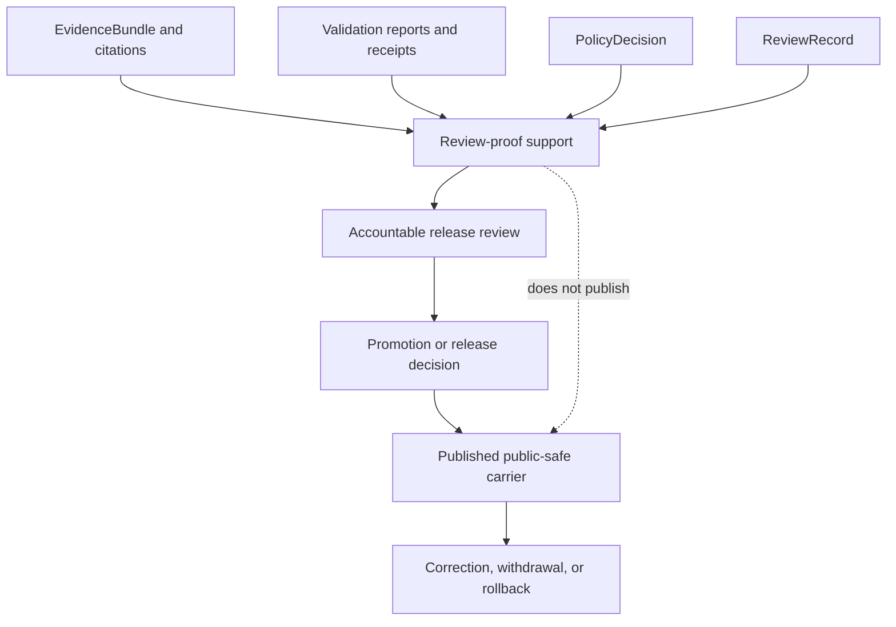

<!-- [KFM_META_BLOCK_V2]
doc_id: kfm://data/proofs/review/readme
title: data/proofs/review/ — Review-Proof Support Lane
type: directory-readme; proof-support-child-lane; review-audit-boundary
version: v0.2.0
status: repository-grounded draft; review-proof schema, payload, producer, validator, and release use not established
owners:
  - "@bartytime4life — verified CODEOWNERS routing for /data/proofs/; routing is not accountable review or approval"
  - "NEEDS VERIFICATION — proof, governance, policy, sensitivity, release, correction, and rollback steward assignments"
created: 2026-06-25
updated: 2026-07-26
prepared_under_prompt: KFM Markdown Modernization & GitHub Documentation Implementation Agent v4.0.0
policy_label: "restricted-review; proof-support; no-direct-public-path; release-gated; cite-or-abstain"
path: data/proofs/review/README.md
truth_posture: >
  CONFIRMED exact target path and prior blob, canonical proofs-root boundary, README-only
  target inventory, draft ReviewRecord semantic contract, proposed governance schema,
  paired governance fixtures, generic schema-test wiring, placeholder dedicated validator,
  promotion-gate hold, release-review guidance-only inventory, and CODEOWNERS routing /
  PROPOSED review-proof profile and identity, closure, condition, expiry, correction,
  invalidation, and finite-outcome requirements / CONFLICTED governance-versus-review
  ReviewRecord schema relationship and schema-to-contract path casing / UNKNOWN active
  review-proof writers, consumers, access controls, external stores, platform enforcement,
  public effects, and operational correction or rollback / NEEDS VERIFICATION accepted
  review-proof contract and schema, accountable owners, deterministic producer and validator,
  public-safe fixtures, policy and separation-of-duties enforcement, governed review records,
  release linkage, retention, correction propagation, withdrawal, and rollback drills
evidence_snapshot:
  repository: bartytime4life/Kansas-Frontier-Matrix
  base_ref: main
  base_commit: ce8968cc8f86e4bbce48f5e714dfededa74bebfa
  prior_blob: 3a7a4eaca11148ba92b26fea2344c85059e32d11
  proofs_root_blob: 0d8b6e92d3b4b9ff3961d29c53ead497922a31cf
  review_record_contract_blob: 9641345d1e5d939dc59687a900e60a563d92c4f0
  governance_schema_blob: fe2f2223af46481e7fb19b0baa94f62ce9c6c855
  review_schema_scaffold_blob: a053448d68e8379b92b12a16e6528275b975433c
  dedicated_validator_blob: e1aa5fcc4b2da4055eb61276a031512512bcb4ca
  promotion_gate_workflow_blob: c22941d5e1fad3317f46591705091ef2b6e7d265
  codeowners_blob: dd2a84aa514d8ecd9208bc347f90f9a2ed37dd61
documentation_rollback_target: 3a7a4eaca11148ba92b26fea2344c85059e32d11
related:
  - ../README.md
  - ../evidence_bundle/README.md
  - ../proof_pack/README.md
  - ../validation_report/README.md
  - ../citation_validation/README.md
  - ../../receipts/README.md
  - ../../catalog/README.md
  - ../../published/README.md
  - ../../../contracts/governance/ReviewRecord.md
  - ../../../contracts/review/README.md
  - ../../../schemas/contracts/v1/governance/review_record.schema.json
  - ../../../schemas/contracts/v1/review/review_record.schema.json
  - ../../../fixtures/contracts/v1/governance/review_record/README.md
  - ../../../tests/schemas/test_common_contracts.py
  - ../../../tools/validators/validate_review_record.py
  - ../../../release/reviews/README.md
  - ../../../release/README.md
  - ../../../docs/governance/SEPARATION_OF_DUTIES.md
  - ../../../docs/governance/REVIEW_DUTIES.md
  - ../../../docs/architecture/publication/RELEASE_GATES.md
  - ../../../docs/adr/ADR-0011-receipts-vs-proofs-vs-manifests-vs-catalog-separation.md
  - ../../../docs/doctrine/directory-rules.md
  - ../../../.github/workflows/promotion-gate.yml
  - ../../../.github/CODEOWNERS
notes:
  - "Same-path Markdown modernization only; no proof payload, contract, schema, fixture, validator, policy, workflow, review record, release object, public route, access control, or publication state changed."
  - "This lane supports audit of review posture. It is not the ReviewRecord semantic or machine authority, the release-review instance authority, a PolicyDecision, a PromotionDecision, a ReleaseManifest, or platform approval."
  - "The current directory contains only this README at the evidence snapshot."
  - "The documentation rollback target for v0.2.0 is prior blob 3a7a4eaca11148ba92b26fea2344c85059e32d11."
[/KFM_META_BLOCK_V2] -->

<a id="top"></a>

# `data/proofs/review/` — Review-Proof Support Lane

> **One-line purpose.** Hold or index compact, claim-scoped support that makes review basis, scope, role separation, conditions, freshness, and closure inspectable without becoming the review event, policy decision, release decision, or public truth.

[](#status)
[](#authority-level)
[](#current-enforcement-posture)
[](#outputs)
[](#validation)

> [!IMPORTANT]
> **Review proof supports audit; it does not perform review.** A file here may bind a `ReviewRecord` to evidence, validation, policy, conditions, release dependencies, correction, and rollback. It cannot approve, promote, release, publish, or override another object's authority.

> [!CAUTION]
> Do not place raw source material, credentials, living-person details, genomic data, exact rare-species or archaeological locations, culturally restricted information, private-land details, critical-infrastructure vulnerabilities, or control-defeating redaction parameters in this ordinary repository lane. Reference governed restricted stores through approved identifiers and fail closed when safe reference is unresolved.

- **Path:** `data/proofs/review/README.md`
- **Owning responsibility:** [`data/proofs/`](../README.md)
- **Current payload inventory:** README only
- **Direct public access:** denied
- **Documentation rollback target:** prior blob `3a7a4eaca11148ba92b26fea2344c85059e32d11`

**Quick navigation:** [Purpose](#purpose) · [Authority](#authority-level) · [Status](#status) · [Belongs](#what-belongs-here) · [Exclusions](#what-does-not-belong-here) · [Inputs](#inputs) · [Outputs](#outputs) · [Validation](#validation) · [Review](#review-burden) · [Related](#related-folders) · [ADRs](#adrs) · [Last reviewed](#last-reviewed) · [Model](#operating-model) · [Profile](#proposed-review-proof-profile) · [Separation](#separation-conditions-and-freshness) · [Sensitivity](#sensitivity-and-public-safe-support) · [Enforcement](#current-enforcement-posture) · [Correction](#correction-invalidation-withdrawal-and-rollback) · [Failures](#failure-modes) · [Graduation](#graduation-criteria) · [Evidence](#repository-evidence-ledger) · [Verification](#open-verification-register) · [No-loss](#no-loss-ledger)

## Purpose

`data/proofs/review/` is the cross-cutting review-support child lane under the canonical proofs responsibility. Its intended role is to make a bounded review trail inspectable by binding stable references to:

- the exact object, claim, source, policy, schema, candidate, public carrier, correction, or other scope reviewed;
- the applicable `ReviewRecord` and reviewer-role context;
- evidence, validation, citation, policy, sensitivity, catalog, integrity, release-dependency, correction, withdrawal, and rollback support;
- approval conditions, requested changes, escalation, expiry, supersession, and closure.

The current directory contains no review-proof payloads. This README therefore defines a conservative boundary and a proposed graduation profile; it does not claim an operational review-proof family.

## Authority level

**Implementation-bearing nested lane under the canonical `data/proofs/` responsibility; review-proof object authority remains proposed.**

This lane may assemble or index review support after an accepted profile exists. It does not own:

| Responsibility | Current owning surface | Boundary |
|---|---|---|
| Review-event meaning | [`contracts/governance/ReviewRecord.md`](../../../contracts/governance/ReviewRecord.md) | Draft semantic contract; not proof that a review occurred. |
| ReviewRecord machine shape | [`schemas/contracts/v1/governance/review_record.schema.json`](../../../schemas/contracts/v1/governance/review_record.schema.json) | Proposed schema; alternate scaffold remains conflicted. |
| Review-family orientation | [`contracts/review/README.md`](../../../contracts/review/README.md) | Compatibility pointer; must not duplicate governance authority. |
| Release-review records | [`release/reviews/`](../../../release/reviews/README.md) | Release-governance lane; current inventory is guidance only. |
| Policy decisions | [`policy/`](../../../policy/README.md) | Policy owns admissibility and finite decision outcomes. |
| Promotion, release, correction, withdrawal, rollback | [`release/`](../../../release/README.md) | Release authority stays outside proofs. |
| Evidence and validation | [`evidence_bundle/`](../evidence_bundle/README.md), [`validation_report/`](../validation_report/README.md), and [`citation_validation/`](../citation_validation/README.md) | Review support references these families; it does not replace them. |
| Public delivery | Governed APIs and released artifacts | Public clients must not read this lane directly. |

The gathering of references is not an authority transfer.

## Status

| Surface | Repository-grounded result |
|---|---|
| Exact target | **CONFIRMED** at `main@ce8968cc8f86e4bbce48f5e714dfededa74bebfa`; prior blob `3a7a4eaca11148ba92b26fea2344c85059e32d11` |
| Directory inventory | **CONFIRMED** README only |
| Parent proof boundary | **CONFIRMED** repository-grounded draft at [`data/proofs/README.md`](../README.md) |
| ReviewRecord meaning | **CONFIRMED authored draft** at [`contracts/governance/ReviewRecord.md`](../../../contracts/governance/ReviewRecord.md) |
| Governance ReviewRecord schema | **CONFIRMED proposed, fielded Draft 2020-12 schema** with required fields and closed additional properties |
| Alternate review schema | **CONFLICTED:** [`schemas/contracts/v1/review/review_record.schema.json`](../../../schemas/contracts/v1/review/review_record.schema.json) is a separate permissive scaffold with no properties |
| Schema-to-contract link | **CONFLICTED:** governance schema metadata names lowercase `contracts/governance/review_record.md`; the tracked semantic contract is case-sensitive `ReviewRecord.md` |
| ReviewRecord fixtures | **CONFIRMED** one minimal valid and one required-field-invalid governance fixture |
| Generic schema test | **CONFIRMED source wiring** for governance schemas with matching fixtures; observed execution is reported in the PR, not promoted to review authority |
| Dedicated ReviewRecord validator | **CONFIRMED placeholder** raising `NotImplementedError("Greenfield placeholder")` |
| Promotion workflow | **CONFIRMED read-only readiness hold** that asserts the validator remains a placeholder and that no governed release ReviewRecord is present |
| CODEOWNERS | **CONFIRMED** `@bartytime4life` routes `/data/proofs/`; routing is not independent review or approval evidence |
| Review-proof contract, schema, payload, producer, validator, or public consumer | **Not established** |

The repository has more ReviewRecord shape evidence than the prior README reported, but it does not yet have an operational review-proof system.

## What belongs here

Until an accepted review-proof contract and machine profile exist, conservative contents are:

- this README and bounded inventory, digest, migration, or disposition sidecars;
- stable-reference indexes that do not claim schema validity or review closure;
- public-safe review-support summaries that point to governed evidence and decision objects;
- explicit limitation, conflict, expiry, supersession, correction, withdrawal, and invalidation notes.

After profile acceptance and validator graduation, this lane may hold or index review-proof objects that bind review scope and `ReviewRecord` references to evidence, validation, policy, conditions, release dependencies, correction, and rollback.

Prefer immutable references and digests over copied payloads or prose.

## What does NOT belong here

| Do not place here | Correct home or action |
|---|---|
| Raw source bytes, scans, logs, sensitive geometry, private evidence, or restricted payloads | Owning `data/raw/`, `data/work/`, or `data/quarantine/` lane with approved access controls |
| `ReviewRecord` semantic definition | `contracts/governance/ReviewRecord.md` |
| ReviewRecord or review-proof JSON Schema | Accepted home under `schemas/contracts/v1/` |
| Policy bundles or policy decisions as proof payloads | `policy/` and the approved policy-decision instance lane |
| Process receipts as primary proof | `data/receipts/`; reference them when relevant |
| Release reviews, PromotionDecisions, ReleaseManifests, corrections, withdrawals, or RollbackCards | `release/` |
| Catalog or public artifacts | `data/catalog/` or governed `data/published/` lanes |
| GitHub comments, chat transcripts, screenshots, or green checks as the only review record | Create a governed `ReviewRecord`; retain the platform item only as bounded basis evidence |
| AI-generated summaries as review authority | Resolve evidence, policy, and review records or abstain |
| An invented filename, ID, field set, or outcome enum presented as current contract | Hold until accepted contract, schema, fixtures, validator, and migration evidence exist |

## Inputs

An accepted review-proof object may reference:

- reviewed object identity, version, digest, scope, audience, space, and time;
- `ReviewRecord` identity, disposition, reviewer-role, authorship, conditions, and expiry;
- `EvidenceBundle`, `EvidenceRef`, `ValidationReport`, `CitationValidationReport`, `ProofPack`, receipt, source, schema, contract, ADR, catalog, policy, and integrity references;
- release candidate, promotion, manifest, correction, withdrawal, supersession, and rollback references.

Inputs must remain in their owning roots. A dangling, stale, conflicting, rights-unclear, sensitivity-unsafe, or unauthorized reference cannot be upgraded by copying its label into a proof file.

## Outputs

The intended output is a compact, machine-checkable review-support object or index that helps an accountable reviewer or release process inspect whether the required review basis is present and current.

An output from this lane is not:

- a `ReviewRecord`;
- a `PolicyDecision`;
- a `PromotionDecision` or `ReleaseManifest`;
- a release, publication, correction, withdrawal, or rollback action;
- a public API, map, export, report, or AI answer.

Public and ordinary UI consumers must use governed APIs and released public-safe carriers, not `data/proofs/review/`.

## Validation

Validation must remain layered.

| Check | Current evidence | What a pass does not prove |
|---|---|---|
| ReviewRecord semantic review | Draft contract exists | Accepted vocabulary, accountable review, or platform enforcement |
| Governance schema fixture test | Generic test discovers the governance schema and paired fixtures | Review-proof schema, dedicated validator, policy, release, or publication readiness |
| Dedicated validator | Placeholder only | Nothing operational; `NotImplementedError` is an explicit hold |
| Promotion workflow | Read-only readiness inventory and hold | Review approval, separation of duties, promotion, release, rollback readiness, or publication |
| Markdown/link validation | Required for this README change | Runtime, policy, evidence, review, release, or public behavior |

The repository-grounded schema-fixture command is:

```bash
python -m pytest -q tests/schemas/test_common_contracts.py -k review_record
```

This command exercises the proposed governance ReviewRecord schema against its current fixture pair. It does not inspect this README as a review-proof payload and does not graduate the dedicated validator.

Do not cite `python tools/validators/validate_review_record.py` as a passing command while the file intentionally raises `NotImplementedError`.

## Review burden

`@bartytime4life` is the verified GitHub CODEOWNERS route for `/data/proofs/`. CODEOWNERS routing proves neither accountable role assignment nor independent approval.

Accountable proof, governance, policy, sensitivity, release, correction, and rollback assignments remain **NEEDS VERIFICATION**. Review scope should determine the required specialists. Material or sensitive changes should preserve author-versus-approver separation, and no reviewer should infer authority from a role label that has not been assigned and verified.

This README-only change does not create a `ReviewRecord` or satisfy the review burden it describes.

## Related folders

- Proof families: [`data/proofs/`](../README.md) · [`evidence_bundle/`](../evidence_bundle/README.md) · [`proof_pack/`](../proof_pack/README.md) · [`validation_report/`](../validation_report/README.md) · [`citation_validation/`](../citation_validation/README.md)
- Process, catalog, and public carriers: [`data/receipts/`](../../receipts/README.md) · [`data/catalog/`](../../catalog/README.md) · [`data/published/`](../../published/README.md)
- Review meaning and orientation: [`ReviewRecord`](../../../contracts/governance/ReviewRecord.md) · [`contracts/review/`](../../../contracts/review/README.md)
- Machine shape and fixtures: [governance schema](../../../schemas/contracts/v1/governance/review_record.schema.json) · [alternate review scaffold](../../../schemas/contracts/v1/review/review_record.schema.json) · [fixture family](../../../fixtures/contracts/v1/governance/review_record/README.md) · [generic schema test](../../../tests/schemas/test_common_contracts.py)
- Enforcement evidence: [placeholder validator](../../../tools/validators/validate_review_record.py) · [promotion-gate workflow](../../../.github/workflows/promotion-gate.yml) · [CODEOWNERS](../../../.github/CODEOWNERS)
- Release governance: [`release/reviews/`](../../../release/reviews/README.md) · [`release/`](../../../release/README.md)
- Doctrine and guidance: [Directory Rules](../../../docs/doctrine/directory-rules.md) · [Separation of Duties](../../../docs/governance/SEPARATION_OF_DUTIES.md) · [Review Duties](../../../docs/governance/REVIEW_DUTIES.md) · [Release Gates](../../../docs/architecture/publication/RELEASE_GATES.md)

## ADRs

[`ADR-0011`](../../../docs/adr/ADR-0011-receipts-vs-proofs-vs-manifests-vs-catalog-separation.md) is the relevant proposed receipt/proof/catalog/release separation decision. Its identity is confirmed; its effective status is `proposed`, so this README does not treat it as accepted enforcement authority.

Directory Rules §9.1 places proof support under `data/proofs/`; §13.2 prohibits mixing proofs, process receipts, build output, and release decisions. This same-path README update creates no new proof family, lifecycle phase, responsibility root, schema home, or release authority.

## Last reviewed

- **Date:** 2026-07-26
- **Evidence boundary:** `main@ce8968cc8f86e4bbce48f5e714dfededa74bebfa`
- **Review type:** complete target, recursive target inventory, parent/sibling proof lanes, ReviewRecord contract and schemas, fixture/test wiring, dedicated validator, promotion workflow, release-review inventory, CODEOWNERS, Directory Rules, governance/release guidance, and overlap preflight
- **Payload/runtime/public-operation inspection:** no review-proof payload or active consumer exists in the tracked target; external or untracked systems remain unknown
- **Re-review trigger:** accepted review-proof contract/schema, schema-home reconciliation, validator implementation, new payload, owner assignment, policy or separation-of-duties enforcement, release linkage, public consumer, correction/withdrawal path, or rollback drill

## Operating model

Review support preserves distinct object families.

| Family | What it contributes | What it cannot become here |
|---|---|---|
| `ReviewRecord` | Who reviewed what, in which role, against what basis, with what disposition | Review-proof payload or release decision |
| `EvidenceBundle` / citation validation | Claim-scoped support and citation closure | Reviewer judgment or policy permission |
| `ValidationReport` / receipts | What was checked or executed and with which result | Factual truth, review approval, or release authority |
| `PolicyDecision` | Surface-specific admissibility outcome | Evidence or human review record |
| Review-proof support | Inspectable binding across review basis, conditions, freshness, and dependencies | Semantic contract, policy, release review, or publication |
| Release review | Accountable review of a candidate or release-facing object | Promotion or publication by prose alone |
| PromotionDecision / ReleaseManifest | Governed release decision and released set | EvidenceBundle or ReviewRecord |
| Published carrier | Released public-safe bytes or service payload | Canonical truth merely because it is visible |


```mermaid
flowchart TD
    EB["EvidenceBundle and citations"] --> RP["Review-proof support"]
    VR["Validation reports and receipts"] --> RP
    PD["PolicyDecision"] --> RP
    RR["ReviewRecord"] --> RP
    RP --> RV["Accountable release review"]
    RV --> DEC["Promotion or release decision"]
    DEC --> PUB["Published public-safe carrier"]
    PUB --> COR["Correction, withdrawal, or rollback"]
    RP -. "does not publish" .-> PUB
```

The review-proof lane assembles inspectable support between review records and release review. Every authority-bearing decision remains in its owning family.

## Proposed review-proof profile

No accepted review-proof schema was found. The profile below is therefore **PROPOSED** and must not be treated as a machine contract.

| Family | Minimum intent before graduation |
|---|---|
| Identity | Stable proof ID, profile/version, digest, creation time, and supersession state allocated by an accepted rule |
| Scope | Exact reviewed object refs, claim/artifact class, audience, spatial and temporal bounds, and review purpose |
| Review | Resolving `ReviewRecord` refs, reviewer-role context, authorship, disposition, conditions, and expiry |
| Basis | Resolving evidence, citation, validation, receipt, policy, schema/contract, source, catalog, and integrity refs |
| Separation | Whether independence is required, how it was satisfied, and any governed waiver reference |
| Sensitivity | Rights, sovereignty, privacy, geoprivacy, cultural, ecological, infrastructure, living-person, or genomic posture without restricted payload disclosure |
| Release dependency | Candidate, release-review, promotion, manifest, correction, withdrawal, and rollback refs where applicable |
| Freshness | Source, policy, evidence, schema, scope, or release changes that invalidate or refresh review |
| Outcome | One finite, contract-defined support outcome with reason codes; no universal enum is asserted here |

Stable references should be sufficient to re-resolve the reviewed basis. Copied prose is a convenience view, not authority.

### Identity and naming

The prior README proposed specific folders, suffixes, and `review_proof_id` syntax. No accepted registry, schema, generator, or validator was found to support those patterns.

Until the profile is accepted:

- do not create payloads merely to populate this directory;
- do not infer identity from filename or path alone;
- do not mint a new universal review outcome vocabulary;
- record naming and identity proposals in review notes or an ADR/migration plan;
- preserve any future stable identifier across correction and supersession.

## Separation, conditions, and freshness

A review-support object is incomplete when it cannot answer:

1. Which bounded object and decision scope were reviewed?
2. Which `ReviewRecord` applies, and does its subject match?
3. Was author-versus-approver separation required for the materiality and sensitivity involved?
4. Are conditional approvals still conditional, and do closure references resolve?
5. Did evidence, policy, schema, source role, sensitivity, candidate scope, or release state change after review?
6. Has the review expired, been superseded, withdrawn, invalidated, or narrowed?

Self-review, missing reviewer authority, stale review, unresolved conditions, or scope mismatch must remain visible and fail closed where trust-bearing action depends on review.

## Sensitivity and public-safe support

Review proof can become an exposure channel even when the reviewed public carrier is generalized.

Required posture:

- keep restricted source material and exact internal geometry in approved owning systems;
- use stable governed refs, bounded summaries, and public-safe representations;
- do not expose redaction offsets, jitter seeds, transform parameters, generalization thresholds, access directions, or reconstruction clues;
- test cross-lane joins for re-identification or location reconstruction risk;
- preserve rights, stewardship, sovereignty, consent, revocation, cultural, living-person, ecological, archaeological, land/title, and infrastructure review state;
- narrow, hold, restrict, abstain, deny, or error when safe support cannot be established under the applicable contract.

A review or schema pass cannot override sensitivity policy.

## Current enforcement posture

| Evidence | Confirmed behavior | Limit |
|---|---|---|
| [`ReviewRecord`](../../../contracts/governance/ReviewRecord.md) | Draft semantic contract defines an inspectable review event and anti-collapse rules | Field vocabulary and enforcement are not accepted end to end |
| [Governance schema](../../../schemas/contracts/v1/governance/review_record.schema.json) | Proposed schema requires `review_id`, `subject_ref`, `reviewer_role`, `decision`, `reasons`, `obligations`, and `reviewed_at` | Schema metadata points to a case-mismatched contract path |
| [Alternate review schema](../../../schemas/contracts/v1/review/review_record.schema.json) | Proposed scaffold allows arbitrary properties and declares no contract | Creates unresolved schema-family drift; generic common-contract test does not scan the `review` family |
| [Governance fixtures](../../../fixtures/contracts/v1/governance/review_record/README.md) | One valid fixture and one fixture missing required `review_id` | Narrow shape examples only |
| [Generic schema test](../../../tests/schemas/test_common_contracts.py) | Discovers governance schemas with matching fixtures and checks valid/invalid behavior | Not the dedicated ReviewRecord validator and not review-proof validation |
| [Dedicated validator](../../../tools/validators/validate_review_record.py) | Raises `NotImplementedError("Greenfield placeholder")` | No accepted CLI, finite outcomes, diagnostics, or review-proof coverage |
| [Promotion workflow](../../../.github/workflows/promotion-gate.yml) | Uses read-only permissions and explicitly holds review/promotion readiness while validator scaffolds remain | Workflow green means the hold assumptions remain true; it is not approval |
| [`release/reviews/`](../../../release/reviews/README.md) | Contains parent and Atmosphere guidance plus `.gitkeep` | No governed release ReviewRecord is present at the snapshot |
| This target | Contains only this README | No proof payload, producer, validator, active writer, consumer, or public route is established |

The safe current outcome is documentation-grounded readiness with operational review proof held.

## Correction, invalidation, withdrawal, and rollback

Review support must not be silently overwritten.

Invalidate or refresh affected review proof when:

- the reviewed object, claim, digest, audience, space, time, or release scope changes;
- an evidence, citation, validation, policy, schema, source-role, sensitivity, or integrity dependency changes;
- a reviewer role, authority, separation requirement, condition, disposition, or expiry changes;
- a candidate is repaired, denied, withdrawn, superseded, released, corrected, or rolled back;
- a public-safe representation is found unsafe or reversible.

A future correction flow should preserve the prior proof and reason, emit a superseding object, update release dependencies, withdraw or correct affected public carriers through release governance, invalidate caches and indexes where applicable, and retain a tested rollback target.

For this documentation change, rollback is a same-path revert to blob `3a7a4eaca11148ba92b26fea2344c85059e32d11`. Reverting this README does not revert any external review, policy, release, or public state.

## Failure modes

| Failure mode | Why it matters | Required response |
|---|---|---|
| GitHub comment or green check treated as the review | Platform context replaces structured governance | Require a resolving `ReviewRecord`; retain platform evidence only as bounded basis |
| Review proof invents its own disposition or release outcome | Object families and finite vocabularies collapse | Hold; use the accepted contract for the applicable surface |
| Review proof contains a PromotionDecision or ReleaseManifest | Proof support becomes release authority | Keep decision objects under `release/` and reference them |
| Evidence or policy refs are missing or dangling | Review becomes unsupported assertion | Hold, narrow, abstain, restrict, deny, or error under the applicable contract |
| Conditional approval lacks closure | Conditions can be bypassed | Keep the dependent action held |
| Self-review is treated as independent approval | Separation of duties becomes performative | Require an independently authorized reviewer or governed waiver |
| Stale review is treated as current | Changed evidence or scope can authorize unsafe reuse | Mark expired or invalidated and require refresh |
| Sensitive or reconstructable detail appears here | Proof becomes an exposure channel | Quarantine, restrict, redact safely, assess incident/correction duties, and rotate exposed identifiers when needed |
| Alternate schema scaffold is treated as accepted authority | Permissive shape can silently accept arbitrary records | Reconcile schema homes through reviewed migration/ADR work before use |
| AI summary replaces the review basis | Generated language becomes root truth | Deny or abstain until evidence, policy, and review refs resolve |

## Graduation criteria

This lane becomes operational only after all applicable criteria are independently verified:

- [ ] accept one semantic review-proof contract and one machine-schema home;
- [ ] reconcile the two ReviewRecord schema paths and the case-mismatched contract reference;
- [ ] define stable identity, versioning, finite outcomes, reason codes, compatibility, retention, and supersession;
- [ ] implement a deterministic no-network producer or assembler;
- [ ] implement the dedicated fail-closed validator with stable diagnostics;
- [ ] add public-safe valid, invalid, denied, held, stale, expired, superseded, and sensitive-leak fixtures;
- [ ] test subject binding, reference resolution, role authority, separation of duties, condition closure, freshness, sensitivity, and release dependencies;
- [ ] wire CI without converting a green check into review or release authority;
- [ ] establish accountable ownership and independent review routing;
- [ ] produce one synthetic no-network trace from `ReviewRecord` and evidence through review proof, release review, decision, public-safe carrier, correction, withdrawal, and rollback;
- [ ] verify governed consumers reject absent, stale, conflicted, withdrawn, or unreleased support.

## Repository evidence ledger

| Evidence | Status | Supports | Limits |
|---|---:|---|---|
| Prior target blob `3a7a4eaca11148ba92b26fea2344c85059e32d11` | **CONFIRMED** | Stable document identity, review-support purpose, anti-collapse, sensitivity, failure, and rollback guidance | Understated current schema/fixture evidence and proposed an unaccepted standalone shape |
| [`data/proofs/README.md`](../README.md) | **CONFIRMED repository-grounded draft** | Canonical proof responsibility and separation from receipts, release, and public serving | Recursive payload/runtime enforcement remains incomplete |
| [`contracts/governance/ReviewRecord.md`](../../../contracts/governance/ReviewRecord.md) | **CONFIRMED authored draft** | Review-event meaning and semantic anti-collapse rules | Acceptance and enforcement remain unproved |
| Two ReviewRecord schema paths | **CONFIRMED / CONFLICTED** | Fielded governance proposal plus separate review scaffold | Canonical relationship and casing mismatch unresolved |
| Governance fixtures and generic schema test | **CONFIRMED source evidence** | Narrow positive/negative schema-shape path | Does not establish review-proof behavior or dedicated validation |
| Placeholder validator and promotion workflow | **CONFIRMED hold evidence** | Explicitly prevents overclaiming operational review and promotion maturity | Does not implement review proof |
| [`release/reviews/`](../../../release/reviews/README.md) | **CONFIRMED guidance-only inventory** | Release-review responsibility is separate | No governed release ReviewRecord at snapshot |
| [`CODEOWNERS`](../../../.github/CODEOWNERS) | **CONFIRMED routing** | `@bartytime4life` is the executable GitHub route for this path | Routing is not independent approval or steward assignment |
| Directory Rules §9.1 and §13.2 | **CONFIRMED placement doctrine** | Proof support belongs under `data/proofs/`; proofs, receipts, build outputs, and release decisions remain distinct | Does not define review-proof fields or accept implementation |

## Open verification register

| Item | Status | Required evidence |
|---|---:|---|
| Canonical review-proof semantic contract and schema | `UNKNOWN` | Accepted contract, schema, ADR/migration decision, compatibility policy |
| ReviewRecord schema reconciliation | `CONFLICTED` | Canonical-family decision, case-correct contract ref, migration and parity tests |
| Review-proof identity and outcome vocabulary | `UNKNOWN` | Registry/generator rule, finite enum, reason codes, versioning and supersession |
| Dedicated producer and validator | `UNKNOWN` | Executable no-network implementation, CLI, fixtures, diagnostics, deterministic tests |
| Accountable roles and separation enforcement | `NEEDS VERIFICATION` | Approved assignments, platform/policy controls, representative ReviewRecords |
| Rights, sensitivity, privacy, sovereignty, and geoprivacy enforcement | `UNKNOWN` | Policy bundles/decisions, restricted-ref handling, negative fixtures, review evidence |
| Active writers, consumers, external stores, and access controls | `UNKNOWN` | Pipeline/tool/release/API/UI inventory, permissions, audit evidence |
| Release, correction, withdrawal, invalidation, and rollback integration | `UNKNOWN` | Emitted synthetic records, resolver tests, cache/index propagation, drills |
| Public/runtime behavior | `UNKNOWN` | Governed route tests proving unreleased, stale, invalidated, or withdrawn support is rejected |

Unknowns narrow claims and block higher-risk transitions; they do not invite plausible defaults.

## No-loss ledger

| Prior element | Disposition |
|---|---|
| Stable path, `doc_id`, created date, and review-support purpose | Preserved |
| ReviewRecord, evidence, policy, validation, release, correction, and rollback boundaries | Preserved and clarified against current repository bytes |
| Separation-of-duties, condition closure, expiry, and fail-closed guidance | Preserved and strengthened |
| Sensitive-data and no-direct-public-path posture | Preserved and strengthened |
| Proposed review-proof subfolders, filename pattern, ID format, fields, and outcome enum | Repaired into a clearly proposed profile because no accepted schema/registry/validator supports them |
| Lifecycle diagram | Preserved as a grounded authority relationship with review and release families separated |
| Validation checklist, failure modes, and definition of done | Preserved and reconciled with actual schema, fixtures, placeholder validator, and workflow hold |
| Broken `../integrity/README.md` link | Removed; no tracked file existed at the pinned base |
| Placeholder owner labels | Replaced with verified CODEOWNERS routing plus explicit unassigned steward roles |
| Proof payload, contract, schema, fixture, validator, policy, workflow, release, route, or publication change | None |
| Documentation rollback target | Prior blob recorded |

### Change history

#### v0.2.0 — 2026-07-26

- reconciled the README with the current proof parent, ReviewRecord contract, two schema paths, fixtures, generic schema test, placeholder validator, promotion workflow hold, release-review inventory, and CODEOWNERS;
- normalized the first twelve sections to the repository's current folder-contract presentation while retaining nested-lane scope;
- replaced unaccepted object-shape, naming, and outcome claims with an explicit proposed profile and graduation gates;
- added evidence, enforcement, schema-conflict, sensitivity, correction, withdrawal, invalidation, rollback, verification, and no-loss ledgers;
- repaired the missing `integrity/README.md` link;
- changed Markdown only.

[Back to top](#top)
