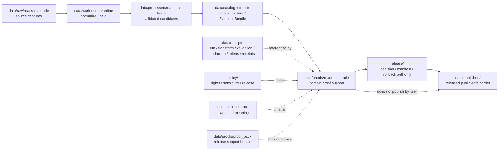

<!-- [KFM_META_BLOCK_V2]
doc_id: kfm://data/proofs/roads-rail-trade/readme
title: data/proofs/roads-rail-trade README
type: directory-readme
version: v0.1
status: draft
owners:
  - <data steward — TODO>
  - <proof steward — TODO>
  - <roads-rail-trade domain steward — TODO>
  - <sensitivity reviewer — TODO>
  - <release steward — TODO>
created: 2026-06-25
updated: 2026-06-25
policy_label: public-review
path: data/proofs/roads-rail-trade/README.md
related:
  - ../README.md
  - ../proof_pack/README.md
  - ../evidence_bundle/README.md
  - ../validation_report/README.md
  - ../citation_validation/README.md
  - ../review/README.md
  - ../integrity/README.md
  - ../../receipts/README.md
  - ../../catalog/README.md
  - ../../published/README.md
  - ../../../release/README.md
  - ../../../docs/domains/roads-rail-trade/ARCHITECTURE.md
  - ../../../docs/domains/roads-rail-trade/CATALOG_INDEX.md
  - ../../../docs/domains/roads-rail-trade/SOURCE_REGISTRY.md
  - ../../../docs/domains/roads-rail-trade/RELEASE_INDEX.md
  - ../../../docs/runbooks/roads-rail-trade/ROLLBACK_RUNBOOK.md
  - ../../../docs/doctrine/directory-rules.md
  - ../../../docs/doctrine/lifecycle-law.md
  - ../../../docs/doctrine/trust-membrane.md
  - ../../../contracts/README.md
  - ../../../schemas/README.md
  - ../../../policy/README.md
tags:
  - kfm
  - data
  - proofs
  - roads-rail-trade
  - roads
  - rail
  - trade-routes
  - transport
  - corridor
  - network-edge
  - source-role
  - evidence-bundle
  - release-gate
  - rollback
  - cite-or-abstain
notes:
  - "Directory README for Roads/Rail/Trade proof support. It is not itself a schema, contract, policy bundle, ProofPack, ReleaseManifest, catalog record, or published transport layer."
  - "Derived graph and connectivity projections are downstream carriers only; they are never canonical truth and must remain reversible to EvidenceBundles and catalog state."
  - "Modern routing graphs, live WZDx-like events, historic route claims, Indigenous/trade corridors, and operational restrictions must not collapse source role, time scope, sensitivity, or release state."
[/KFM_META_BLOCK_V2] -->

<a id="top"></a>

# `data/proofs/roads-rail-trade/`

> Domain proof lane for **Roads, Rail, and Trade Routes**. Files under this directory should support evidence closure, source-role separation, network/corridor proof, restriction-event proof, sensitivity review, catalog closure, release review, correction, and rollback for transport-lane claims and public-safe transport products.


> [!IMPORTANT]
> **Status:** `draft`  
> **Owner:** `<data steward>` · `<proof steward>` · `<roads-rail-trade domain steward>` · `<sensitivity reviewer>` · `<release steward>` — TODO  
> **Path:** `data/proofs/roads-rail-trade/README.md`  
> **Truth posture:** CONFIRMED doctrine / PROPOSED implementation guidance / NEEDS VERIFICATION for emitted proof objects, schemas, validators, CI workflows, source descriptors, release gates, and rollback drills.

> [!WARNING]
> This folder supports review. It does **not** publish a road layer, certify a route, authorize routing, issue live closure guidance, prove a historic corridor, or make a derived graph canonical truth by file placement.

---

## Quick jumps

| Section | Use it for |
|---|---|
| [1. Purpose](#1-purpose) | What this proof lane is for. |
| [2. Placement and authority](#2-placement-and-authority) | Why this path belongs under `data/proofs/`. |
| [3. What belongs here](#3-what-belongs-here) | Accepted proof families and examples. |
| [4. What must not live here](#4-what-must-not-live-here) | Exclusions and wrong homes. |
| [5. Roads/Rail/Trade proof responsibilities](#5-roadsrailtrade-proof-responsibilities) | Domain-specific support obligations. |
| [6. Object families and proof concerns](#6-object-families-and-proof-concerns) | What each transport object needs proved. |
| [7. Source-role and temporal gates](#7-source-role-and-temporal-gates) | How to block source-role collapse and time confusion. |
| [8. Sensitivity and publication gates](#8-sensitivity-and-publication-gates) | Restricted facilities, historic corridors, live feeds, and overprecision. |
| [9. Naming and identity](#9-naming-and-identity) | Suggested file naming and identifiers. |
| [10. Lifecycle relationship](#10-lifecycle-relationship) | How proofs relate to RAW → PUBLISHED and release. |
| [11. Validation checklist](#11-validation-checklist) | Maintainer checklist. |
| [12. Failure modes](#12-failure-modes) | Drift and overclaim patterns to block. |
| [13. Definition of done](#13-definition-of-done) | What is still needed for operational maturity. |

---

## 1. Purpose

`data/proofs/roads-rail-trade/` stores proof support for the Roads/Rail/Trade domain lane: roads, rail corridors, historic routes, trade corridors, crossings, bridges, depots, yards, facilities, restrictions, operator/status intervals, movement-story nodes, and derived network projections.

A proof file here should help answer:

- Which EvidenceBundle supports a route, segment, crossing, facility, restriction, graph edge, historic route claim, or trade-corridor claim?
- What source role was assigned at admission, and was it preserved through release?
- Are modern routing graphs, historic claims, live event feeds, and derived network projections clearly separated?
- Are source, observed, valid, retrieval, release, and correction times preserved where material?
- Are critical facility, Indigenous corridor, historic route, cultural, archaeological, infrastructure, or live operational sensitivities handled by policy and review?
- Is any public geometry generalized, aggregated, staged, withheld, or denied where needed?
- Does the candidate have validation, catalog closure, release support, correction path, and rollback target?

This directory is not a source-data lane, not a catalog lane, not a release decision lane, and not a public transport API or routing surface.

[Back to top](#top)

---

## 2. Placement and authority

KFM places files by responsibility root. `data/proofs/` is the proof-support area for release-grade evidence support, ProofPacks, catalog closure, citation validation, review proof, and integrity support. The domain segment `roads-rail-trade/` narrows the proof responsibility to the transport lane.

| Surface | Role | Boundary |
|---|---|---|
| [`../README.md`](../README.md) | Parent proof root. | Defines proof-lane expectations. This README narrows them for Roads/Rail/Trade. |
| [`../proof_pack/`](../proof_pack/) | ProofPack family. | Domain proof files may feed or be referenced by ProofPacks, but this folder is broader than ProofPack instances. |
| [`../evidence_bundle/`](../evidence_bundle/) | EvidenceBundle support. | Roads/Rail proof files may cite EvidenceBundles; they do not replace them. |
| [`../review/`](../review/) | Review proof support. | Sensitive or release-significant transport proof may cite review proof; it does not replace review. |
| [`../../receipts/`](../../receipts/) | Process memory. | Receipts say what ran; proof files use them as basis, not as proof by themselves. |
| [`../../catalog/`](../../catalog/) | Discovery and interchange. | Catalog records aid discovery; proof files support closure and release review. |
| [`../../published/`](../../published/) | Released public-safe artifacts. | Public layers/API payloads belong downstream, only after release gates. |
| [`../../../release/`](../../../release/) | Release decisions, manifests, rollback cards, correction and withdrawal notices. | Release authority stays in `release/`; this folder supports it. |
| [`../../../docs/domains/roads-rail-trade/`](../../../docs/domains/roads-rail-trade/) | Domain doctrine. | Docs explain lane meaning and boundaries; proof files support concrete claims/candidates. |
| [`../../../contracts/`](../../../contracts/) | Semantic meaning. | Object meaning belongs in contracts. |
| [`../../../schemas/`](../../../schemas/) | Machine shape. | Field-level JSON Schema belongs under the accepted schema home. |
| [`../../../policy/`](../../../policy/) | Admissibility. | Proof files record policy outcomes; policy logic lives in policy roots. |

> [!NOTE]
> This README does not resolve the open schema/contract slug conflict between `roads-rail-trade` and `transport`. It governs the already-present data proof lane named `roads-rail-trade`.

[Back to top](#top)

---

## 3. What belongs here

Use this directory for proof support objects that are safe to store under repository policy and useful for review, release, correction, rollback, or audit.

| Proof family | Example content | Required posture |
|---|---|---|
| `evidence_closure` | Proof that a Road Segment, Rail Segment, Crossing, Bridge, CorridorRoute, RestrictionEvent, Historic RouteClaim, or Network Edge resolves to EvidenceBundle support. | Must preserve source role, time scope, uncertainty, and release state. |
| `source_role` | Proof that modern base maps, regulatory feeds, historic maps, WZDx-like events, oral-history context, and derived graph outputs are not collapsed. | Source role fixed at admission and never upgraded by promotion. |
| `temporal_scope` | Proof that source, observed, valid, retrieval, release, correction, vintage, event, and status-interval times remain distinct. | Mandatory for restrictions, operator assignments, live/event feeds, historic route claims, and graph snapshots. |
| `network_projection` | Proof that derived graph edges are reversible to segments, route memberships, catalog records, and EvidenceBundles. | Graph edges are downstream carriers only. |
| `corridor_generalization` | Proof that historic routes, Indigenous/trade corridors, and uncertain route geometries are generalized or uncertainty-labeled. | Exact or overprecise public geometry fails closed. |
| `restriction_event` | Proof for closure, detour, weight limit, hazard exposure, or operational access-restriction candidates. | Not a live routing or life-safety instruction. |
| `facility_sensitivity` | Proof for depot, yard, bridge, crossing, freight, intermodal, critical facility, capacity, or vulnerability exposure. | Critical-asset details require review and possible redaction. |
| `cross_lane_closure` | Proof that hydrology, hazards, settlements, archaeology, people/land, and Frontier Matrix joins preserve ownership. | Neighboring lane truth must not be absorbed by Roads/Rail. |
| `release_support` | Proof refs for catalog closure, ProofPack, ReviewRecord, ReleaseManifest, correction path, and rollback target. | Release authority stays in `release/`. |

[Back to top](#top)

---

## 4. What must not live here

| Excluded material | Correct home or action | Why |
|---|---|---|
| Raw source captures, TIGER/KDOT/FHWA/FRA/WZDx/GTFS/OSM/scan payloads, historic-map files, or source dumps | `data/raw/roads-rail-trade/`, `data/work/roads-rail-trade/`, or `data/quarantine/roads-rail-trade/` | Proof files reference source material; they do not store it. |
| Canonical processed transport objects | `data/processed/roads-rail-trade/` after validation | Proof lanes are support, not canonical data. |
| Catalog records, STAC/DCAT/PROV, or domain indexes | `data/catalog/...` | Catalog is discovery/interchange, not proof authority. |
| ReleaseManifest, PromotionDecision, RollbackCard, CorrectionNotice, WithdrawalNotice, or release signature | `release/` | Release authority stays separate. |
| Public map layers, PMTiles, GeoParquet, API payloads, reports, or stories | `data/published/...` after release gates | Published artifacts are downstream carriers. |
| Policy logic or release rules | `policy/` | Proof files record policy outcomes, not policy definitions. |
| JSON Schemas | `schemas/contracts/v1/...` | Machine shape belongs in schemas. |
| Semantic contracts | `contracts/...` | Meaning belongs in contracts. |
| Live routing, dispatch, emergency, evacuation, or life-safety instructions | Do not publish through KFM; redirect to official/operational authority | KFM is evidence/context, not a live transport control system. |
| Exact sensitive archaeological, Indigenous, cultural, private-land, critical-facility, or vulnerability details | Quarantine, restrict, generalize, or deny | Public-review proof files must not leak sensitive location or infrastructure data. |

[Back to top](#top)

---

## 5. Roads/Rail/Trade proof responsibilities

A proof file in this lane should support one or more of these responsibilities:

1. **Evidence closure** — every claim resolves to EvidenceBundle support or records `ABSTAIN`, `DENY`, `HOLD`, or `ERROR`.
2. **Source-role separation** — modern observation, authority, context, model, historic claim, and derived graph roles remain distinct.
3. **Temporal discipline** — source, observed, valid, retrieval, release, correction, vintage, event, and status-interval times are not flattened.
4. **Identity discipline** — segment, route, corridor, route membership, graph edge, facility, restriction, and story node identities remain distinct.
5. **Graph reversibility** — network projections and connectivity edges can be traced back to source segments, memberships, catalog records, and EvidenceBundles.
6. **Sensitivity control** — historic Indigenous/trade corridors, critical facilities, live operational feeds, and overprecise historic routes are generalized, restricted, or denied where required.
7. **Cross-lane ownership** — roads/rail claims cite hydrology, hazards, settlements, archaeology, people/land, and Frontier Matrix context without absorbing their truth.
8. **Release support** — proofs connect to policy decisions, validation reports, catalog closure, review records, release candidates, correction paths, and rollback targets.

[Back to top](#top)

---

## 6. Object families and proof concerns

| Object family | Proof concern |
|---|---|
| `Road Segment` | Source role, source vintage, geometry uncertainty, route membership, release state. |
| `Rail Segment` | Carrier/operator/status interval, abandonment/suspension/decommissioning time, source evidence. |
| `Crossing` | Road-rail or road-water evidence, cross-lane hydrology/settlement/hazard ownership, safety sensitivity. |
| `Bridge` | Structure relation to route and water feature; critical-infrastructure sensitivity; hydrology edge preserved. |
| `Ferry` / `River Crossing` | Time-bound crossing evidence; hydrology edge; historic uncertainty. |
| `Depot`, `Siding`, `Yard`, `TransportFacility` | Facility identity versus route relation; critical-asset exposure and co-ownership with settlements. |
| `RestrictionEvent` / `Access Restriction` | Temporal scope, source authority, stale state, not live routing/life-safety guidance. |
| `StatusEvent` / `Route Event` | Open/suspended/abandoned/decommissioned state with valid interval and correction path. |
| `OperatorAssignment` / `Operator Status` | Operator identity, interval, source basis, release state. |
| `CorridorRoute` / `RouteMembership` | Route claim and segment membership separated; designation and geometry not conflated. |
| `Historic RouteClaim` | Claim, not observation; uncertainty and overprecision denial required. |
| `TradeRouteCorridor` | Generalized public geometry by default; sovereignty/cultural review when applicable. |
| `Network Edge` | Derived projection only; reversible to catalog records and EvidenceBundles. |
| `Movement Story Node` | Narrative support with evidence refs; generated story text never becomes proof. |

[Back to top](#top)

---

## 7. Source-role and temporal gates

| Gate | Required proof | Failure outcome |
|---|---|---|
| Modern graph vs historic route | Proof that modern road/rail geometry is not used as direct evidence of a historic route without supporting historic sources. | `DENY` or require relabeling as context. |
| Historic claim vs operational restriction | Proof that a historic route claim is not used to imply current access, closure, or legal status. | `DENY` operational claim. |
| Live/event feed vs public routing | Proof that WZDx-like or live operational feeds are treated as context/analysis, not KFM routing or life-safety instructions. | `DENY` public runtime guidance. |
| Source vintage | Source vintage and retrieval time are recorded for annual/static products. | `HOLD` or quarantine. |
| Event validity | Valid/issue/expiry/event interval recorded for restrictions, closures, operator status, and incident context. | `ABSTAIN`, stale badge, or hold. |
| Graph projection | NetworkEdge can be traced to source segments, memberships, evidence, and catalog closure. | `DENY` graph-as-truth release. |
| Cross-lane context | Neighboring lane support and ownership preserved. | `ABSTAIN` or `DENY` if ownership collapses. |

[Back to top](#top)

---

## 8. Sensitivity and publication gates

| Risk surface | Required support | Default when unresolved |
|---|---|---|
| Critical transport facilities, capacity, vulnerability, or structural sensitivity | Sensitivity review, RedactionReceipt/generalization, PolicyDecision, ReviewRecord. | `DENY` or restricted release. |
| Indigenous, treaty, cultural, oral-history, trade, or mobility corridor context | Sovereignty/cultural review, generalized geometry, source-role label, EvidenceBundle support. | `DENY`, staged access, or generalized-only release. |
| Historic route overprecision | Uncertainty representation, generalization proof, overprecision validator. | `ABSTAIN` or `DENY`. |
| Archaeology-adjacent route claims | Archaeology ownership preserved; exact coordinates denied or generalized. | `DENY` exact exposure. |
| Private land / living-person adjacency | People/Land ownership preserved; no private person-parcel exposure. | `DENY` or aggregate. |
| Live restrictions / work-zone events | Temporal scope, official-source context, stale-state rule, no routing/life-safety language. | `DENY` runtime guidance. |
| Hazard closure or detour context | Hazards event ownership preserved; roads/rail owns only route-restriction relation. | `ABSTAIN` or `DENY` if source role unclear. |
| Public graph/network layer | Proof of reversibility, digest closure, public-safe geometry, and release manifest. | `HOLD` or `DENY`. |

[Back to top](#top)

---

## 9. Naming and identity

Suggested file pattern:

```text
roads-rail-trade.<proof_family>.<scope>.<release_or_run_id>.<short_hash>.json
```

Examples:

```text
roads-rail-trade.evidence_closure.road-segment-kdot-demo.v0.1.0123abcd.json
roads-rail-trade.source_role.historic-route-claim-demo.v0.1.89ab4567.json
roads-rail-trade.network_projection.public-graph-snapshot-demo.v0.1.4567cdef.json
roads-rail-trade.corridor_generalization.trade-route-corridor-demo.v0.1.cdef0123.json
roads-rail-trade.restriction_event.wzdx-analytical-context-demo.v0.1.abcd4567.json
```

Minimum proof metadata should include:

- `proof_id`
- `proof_family`
- `domain: roads-rail-trade`
- `object_family`
- `object_id` or `release_candidate_id`
- `source_descriptor_refs`
- `source_roles`
- `evidence_bundle_refs`
- `receipt_refs`
- `validation_report_refs`
- `policy_decision_refs`
- `review_record_refs`
- `catalog_refs`
- `release_refs`
- `rollback_refs`
- `time_scope` with distinct source/observed/valid/retrieval/release/correction times where material
- `sensitivity_posture`
- `public_geometry_posture`
- `outcome`
- `reasons`

[Back to top](#top)

---

## 10. Lifecycle relationship



Proof files support review and release. They do not publish, route, alert, or certify by placement.

[Back to top](#top)

---

## 11. Validation checklist

Before a roads/rail/trade proof supports release review, verify:

- [ ] The proof identifies the object family, object/release scope, source family, spatial scope, temporal scope, and intended public surface.
- [ ] Every consequential claim resolves to EvidenceBundle support or records `ABSTAIN`, `DENY`, `HOLD`, or `ERROR`.
- [ ] SourceDescriptor refs include source role, rights, sensitivity, citation, cadence/vintage, retrieval time, and digest where applicable.
- [ ] Modern graph, historic claim, live/event feed, source authority, observation, context, and model roles remain distinct.
- [ ] Route, segment, route membership, corridor, and graph edge identities remain distinct.
- [ ] Derived NetworkEdge / graph projection is reversible to source segments, memberships, catalog records, and EvidenceBundles.
- [ ] Source, observed, valid, retrieval, release, and correction times remain distinct where material.
- [ ] Restrictions, closures, detours, operator assignments, and status events have temporal intervals and stale/correction handling.
- [ ] Historic route and trade-corridor products show uncertainty and do not overstate precision.
- [ ] Indigenous/cultural/archaeology-sensitive context has review state and public-safe geometry posture.
- [ ] Critical facility or infrastructure exposure has sensitivity review, redaction/generalization support, and policy decision.
- [ ] Live feed contexts do not become routing, dispatch, emergency, or life-safety instructions.
- [ ] Cross-lane joins preserve hydrology, hazards, settlements, archaeology, people/land, and Frontier Matrix ownership.
- [ ] Release refs point to `release/`; published artifact refs point to `data/published/`; raw/work/quarantine data is not exposed.
- [ ] Rollback, correction, withdrawal, and invalidation targets are traceable.

[Back to top](#top)

---

## 12. Failure modes

| Failure mode | Why it matters | Required response |
|---|---|---|
| Modern routing graph presented as historic route evidence | Collapses current geometry/context into historical proof. | Deny or relabel as context; require historic evidence. |
| Historic route claim presented as current access or legal status | Misleads users about operational or legal conditions. | Deny operational claim; require current authority source. |
| Derived NetworkEdge treated as canonical truth | Graph projections are downstream carriers only. | Fail validation; require reversibility to EvidenceBundle and catalog state. |
| Live WZDx/work-zone event shown as KFM routing/life-safety instruction | KFM is not a dispatch or alert authority. | Deny runtime guidance; redirect to official sources if needed. |
| Facility capacity/vulnerability leaked through proof file | Creates infrastructure sensitivity risk. | Quarantine, redact, generalize, or restrict. |
| Indigenous/cultural corridor exact geometry exposed without review | Violates sovereignty/cultural sensitivity posture. | Deny exact exposure; require review and generalized geometry. |
| Cross-lane hazard/hydrology/settlement truth absorbed by roads/rail | Breaks bounded-context ownership. | Split claim and cite owning lane EvidenceBundles. |
| Proof file acts as ReleaseManifest | Collapses proof support with release authority. | Move authority to `release/`; keep reference here. |
| AI route story replaces evidence | Generated language becomes root truth. | Deny; require EvidenceBundle and citation validation. |

[Back to top](#top)

---

## 13. Definition of done

This proof lane is operationally useful when:

- [ ] Roads/Rail/Trade proof schemas and semantic contracts exist under approved homes or the slug conflict is resolved by ADR.
- [ ] Valid and invalid fixtures cover source-role collapse, graph-as-truth, historic overprecision, live-feed routing, unresolved rights, facility sensitivity, cross-lane ownership collapse, and missing rollback support.
- [ ] CI or validators block public release when EvidenceBundle, PolicyDecision, ReviewRecord, catalog closure, or rollback target is missing.
- [ ] Source descriptors exist for active transport source families and record rights, cadence, role, citation, and sensitivity.
- [ ] Release docs cross-link proof requirements for route layers, network projections, restriction contexts, historic route claims, and movement stories.
- [ ] CODEOWNERS or equivalent review ownership covers data steward, roads/rail/trade steward, sensitivity reviewer, proof steward, and release steward.
- [ ] At least one synthetic no-network release candidate demonstrates: source capture → processed candidate → EvidenceBundle → roads/rail proof → ProofPack → ReleaseManifest → public-safe artifact → rollback.

---

## Maintainer note

Roads/Rail/Trade proof work is high-risk because maps make routes look more certain, current, and authoritative than the evidence may allow. Keep proof files boring, explicit, reversible, and source-role strict. When evidence, policy, time scope, sensitivity, or release state is incomplete, hold, abstain, deny, or quarantine instead of drawing a confident line on the map.
