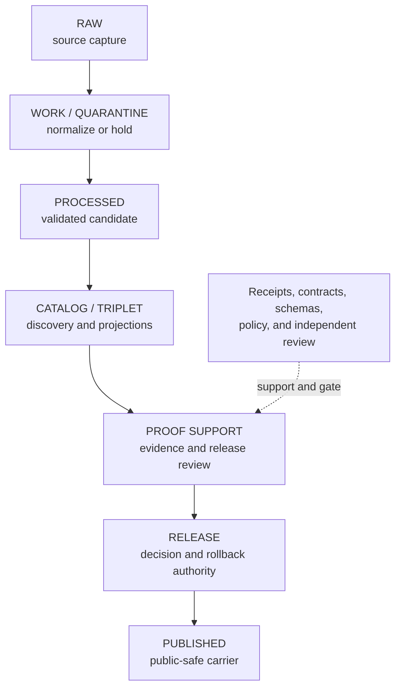

<!-- [KFM_META_BLOCK_V2]
doc_id: kfm://data/proofs/roads-rail-trade/readme
title: data/proofs/roads-rail-trade/README.md — Roads, Rail, and Trade Proof Support
type: directory-readme; nested-domain-proof-lane; release-support-boundary
version: v0.2.0
status: repository-grounded draft; semantic validation, proof production, and release dry-run remain held
owners:
  - "NEEDS VERIFICATION — Roads/Rail/Trade domain steward"
  - "NEEDS VERIFICATION — evidence, proof, validation, and catalog stewards"
  - "NEEDS VERIFICATION — source-role, rights, sensitivity, cultural, and infrastructure reviewers"
  - "NEEDS VERIFICATION — policy, release, correction, rollback, and documentation stewards"
created: 2026-06-25
updated: 2026-07-26
prepared_under_prompt: KFM Markdown Modernization & GitHub Documentation Implementation Agent v4.0.0
policy_label: restricted-review; proof-support; roads-rail-trade; cite-or-abstain; no-routing-authority; no-direct-public-path; release-gated
path: data/proofs/roads-rail-trade/README.md
truth_posture: >
  CONFIRMED exact target path and prior blob, canonical data/proofs parent contract,
  Directory Rules v1.4 placement basis, current Roads/Rail/Trade architecture and
  canonical-path guidance, draft contract and schema lanes, permissive PROPOSED
  EvidenceBundle schema stub, placeholder validators and smoke test, PROPOSED
  fail-closed policy scaffolds, empty validation and publish pipeline specs, and
  explicit validation, proof, and release-dry-run workflow holds / PROPOSED proof
  packet, source-role closure, temporal closure, public-safe representation, and
  correction-invalidation profiles / CONFLICTED roads-rail-trade versus transport
  and domains-versus-flat contract/schema topology / UNKNOWN recursive proof payload
  inventory, active writers and consumers, external or restricted stores, accepted
  release inventory, governed public routes, hosting, caches, and runtime behavior /
  NEEDS VERIFICATION for emitted proof objects, accountable owners, accepted proof
  contract and schema, executable validators and fixtures, policy enforcement,
  independent review, release instances, correction propagation, and rollback drills
evidence_snapshot:
  repository: bartytime4life/Kansas-Frontier-Matrix
  base_ref: main
  base_commit: f0b6f604822c8a3a8de4a7bd799af79048f271d6
  prior_blob: 3c2e952418dce5dfa461de83b97badcb92b8818d
  directory_rules_blob: 2affb080e6f0043867c64c7f06c1ca52030fbd55
  proofs_root_blob: 0d8b6e92d3b4b9ff3961d29c53ead497922a31cf
  architecture_blob: d46386ce6a655486532f4da537fbc1928cacbaca
  canonical_paths_blob: 684de491db1cdd7d141954603842acc9244075db
  evidence_bundle_schema_blob: 5452bd1ed6404d6e38fe85c0f2a33a825949863e
  evidence_bundle_validator_blob: 03048c8641117f51e34017b5f4db9d863763c7c3
  policy_scaffold_blob: 7d7378028bb1c7f3fe62a328ee8d401b70ebe6e3
  smoke_test_blob: 967f997329a7308cd5267df96d258de8092224c7
  workflow_blob: 92692e7a10eff86c4e72958c52173dce15b43458
related:
  - ../README.md
  - ../evidence_bundle/README.md
  - ../proof_pack/README.md
  - ../validation_report/README.md
  - ../citation_validation/README.md
  - ../review/README.md
  - ../../receipts/README.md
  - ../../registry/sources/roads-rail-trade/README.md
  - ../../processed/roads-rail-trade/README.md
  - ../../catalog/domain/roads-rail-trade/README.md
  - ../../published/roads-rail-trade/README.md
  - ../../../docs/domains/roads-rail-trade/README.md
  - ../../../docs/domains/roads-rail-trade/ARCHITECTURE.md
  - ../../../docs/domains/roads-rail-trade/CANONICAL_PATHS.md
  - ../../../docs/domains/roads-rail-trade/SENSITIVITY.md
  - ../../../contracts/domains/roads-rail-trade/README.md
  - ../../../schemas/contracts/v1/domains/roads-rail-trade/README.md
  - ../../../policy/domains/roads-rail-trade/README.md
  - ../../../fixtures/domains/roads-rail-trade/README.md
  - ../../../tests/domains/roads-rail-trade/README.md
  - ../../../tools/validators/domains/roads-rail-trade/README.md
  - ../../../release/candidates/roads-rail-trade/README.md
  - ../../../docs/runbooks/roads-rail-trade/ROLLBACK_RUNBOOK.md
  - ../../../docs/doctrine/directory-rules.md
  - ../../../docs/doctrine/lifecycle-law.md
  - ../../../docs/doctrine/trust-membrane.md
  - ../../../.github/workflows/domain-roads-rail-trade.yml
notes:
  - "Same-path Markdown modernization only; no source bytes, proof payloads, contracts, schemas, policies, validators, fixtures, workflows, candidates, releases, routes, hosting, or publication state changed."
  - "The domain workflow requires the literal phrase 'NEEDS VERIFICATION for emitted proof objects'; this revision preserves that compatibility token."
  - "A dynamic workflow badge is intentionally omitted because successful jobs currently include explicit validation, proof-production, and release-dry-run holds."
  - "The documentation rollback target for v0.2.0 is prior blob 3c2e952418dce5dfa461de83b97badcb92b8818d."
[/KFM_META_BLOCK_V2] -->

<a id="top"></a>

# `data/proofs/roads-rail-trade/` — Roads, Rail, and Trade Proof Support

> **One-line purpose.** Hold or index governed proof support for Roads, Rail, and Trade claims while preserving source role, identity, time, uncertainty, sensitivity, evidence, review, release dependency, correction, and rollback boundaries.

[](#status)
[](#authority-level)
[](../../../.github/workflows/domain-roads-rail-trade.yml)
[](#source-role-temporal-and-operational-boundaries)

> [!CAUTION]
> **KFM is not a routing, dispatch, closure, detour, legal-access, safe-passage, bridge-condition, rail-status, emergency, regulatory, or life-safety authority.** Operational decisions must use the applicable official authority.

> [!IMPORTANT]
> Proof support is necessary but not sufficient for release. A path, proof-shaped file, green readiness check, commit, pull request, merge, graph, map, story, or AI response does not create truth, policy permission, release approval, or KFM publication.

> [!WARNING]
> This is an ordinary public-repository lane. Do not commit harmful-precision route or facility details, restricted Indigenous or cultural corridor geometry, archaeological locations, private-land or living-person joins, credentials, operational vulnerabilities, or reconstructive derivatives.

**Path:** `data/proofs/roads-rail-trade/README.md`  
**Owning responsibility:** `data/proofs/`  
**Domain segment:** `roads-rail-trade/`  
**Direct public access:** denied  
**Documentation rollback target:** prior blob `3c2e952418dce5dfa461de83b97badcb92b8818d`

**Quick navigation:** [Purpose](#purpose) · [Authority](#authority-level) · [Status](#status) · [Belongs](#what-belongs-here) · [Exclusions](#what-does-not-belong-here) · [Inputs](#inputs) · [Outputs](#outputs) · [Validation](#validation) · [Review](#review-burden) · [Related](#related-folders) · [ADRs](#adrs) · [Last reviewed](#last-reviewed) · [Evidence](#repository-evidence-ledger) · [Proof packet](#roads-rail-and-trade-proof-packet) · [Objects](#object-families-and-proof-concerns) · [Source and time](#source-role-temporal-and-operational-boundaries) · [Sensitivity](#sensitivity-and-public-safe-representation) · [Lifecycle](#lifecycle-and-governed-handoff) · [Automation](#workflow-and-automation-posture) · [Correction](#correction-withdrawal-invalidation-and-rollback) · [Verification](#open-verification-register) · [No-loss](#no-loss-ledger)

---

## Purpose

`data/proofs/roads-rail-trade/` is the domain proof-support lane for roads, rail corridors, routes and route memberships, historic and trade corridors, crossings, bridges, ferries, depots, sidings, yards, transport facilities, restrictions, operator and status intervals, Movement Story Nodes, and derived network projections.

The lane exists to make bounded questions inspectable before a claim or artifact advances:

1. Which admitted sources and EvidenceBundles support the exact object, relation, event, graph projection, or release-candidate scope?
2. Which source role was assigned at admission, and was it preserved rather than upgraded by processing or promotion?
3. Which source, observed, valid, retrieval, vintage, event, release, correction, and stale-state times govern interpretation?
4. Which geometry uncertainty, rights, cultural, archaeological, private-land, critical-infrastructure, or operational-sensitivity controls apply?
5. Which validation reports, receipts, policy decisions, reviews, catalog records, release dependencies, corrections, withdrawals, and rollback targets remain outside the proof packet?
6. Which finite outcome is justified under the applicable contract when support is missing, stale, conflicted, restricted, or unsafe?

This directory supports evidence and release review. It does not admit sources, own canonical processed transport objects, decide policy, approve release, publish a layer, or operate a transport service.

## Authority level

**Implementation-bearing nested domain proof-support lane under the canonical `data/proofs/` responsibility.**

This path may hold or index Roads/Rail/Trade proof records under an accepted profile. It does not own:

| Authority | Governing home |
|---|---|
| Object meaning | [`contracts/`](../../../contracts/README.md) |
| Machine shape | [`schemas/`](../../../schemas/README.md) |
| Policy decisions | [`policy/`](../../../policy/README.md) |
| Process memory | [`data/receipts/`](../../receipts/README.md) |
| Catalog discovery | [`data/catalog/`](../../catalog/README.md) |
| Release decisions and rollback authority | [`release/`](../../../release/README.md) |
| Public-safe domain carriers | [`data/published/roads-rail-trade/`](../../published/roads-rail-trade/README.md), after governed release |

Directory Rules §§4, 9, and 12 support this placement: `data/` owns lifecycle and emitted trust-support material, `proofs/` owns proof families, and `roads-rail-trade/` is the domain segment. No new root, lifecycle phase, or parallel proof authority is created.

## Status

| Surface | Repository-grounded result |
|---|---|
| Exact target | **CONFIRMED** at `main@f0b6f604822c8a3a8de4a7bd799af79048f271d6`; prior blob `3c2e952418dce5dfa461de83b97badcb92b8818d` |
| Documentation version | `v0.2.0` |
| Parent proof responsibility | **CONFIRMED repository-grounded draft** at [`data/proofs/README.md`](../README.md) |
| Domain doctrine | **CONFIRMED draft** architecture, canonical-path, pipeline, sensitivity, source-registry, release-index, and rollback guidance |
| Contract/schema topology | **CONFLICTED**: `roads-rail-trade` versus `transport`, and `domains/` versus flat homes remain unresolved |
| EvidenceBundle schema | **CONFIRMED `PROPOSED` stub**; it requires only `id` and permits additional properties |
| Domain validators | **CONFIRMED placeholders** that raise `NotImplementedError` |
| Domain test | **CONFIRMED** one `assert True` smoke placeholder |
| Policy | **CONFIRMED `PROPOSED` fail-closed scaffolds**; accepted evaluator inputs, decisions, fixtures, and tests are not established |
| Pipeline specs | **CONFIRMED** `validate` and `publish` specs with empty `stages` arrays |
| Domain workflow | **CONFIRMED** read-only static-readiness workflow with explicit validation, proof, and release-dry-run holds |
| Concrete proof payloads and accepted producer | **Not established by inspected evidence** |
| Accepted release and governed public use | **Not established by inspected evidence** |
| Direct public access | **Denied** |

The exact maturity statement **NEEDS VERIFICATION for emitted proof objects** remains part of this README because the current domain workflow checks for it before recording the proof-production hold.

A green held workflow proves only that its declared readiness boundary was observed. It is not an EvidenceBundle, ProofPack, route proof, legal-access determination, policy decision, release decision, or publication authority.

## What belongs here

Only repository-safe proof support that is useful for review, release evaluation, correction, rollback, or audit belongs here.

| Proof family | Supported question | Required posture |
|---|---|---|
| Evidence closure | Does a segment, route, crossing, facility, restriction, historic claim, or graph edge resolve to admitted EvidenceBundle support? | Preserve scope, source role, time, uncertainty, and release dependency. |
| Source-role closure | Were regulatory, observed, administrative, historic, contextual, modeled, candidate, synthetic, and derived roles kept distinct? | A source role is fixed at admission and cannot be upgraded by promotion. |
| Temporal closure | Are source, observed, valid, retrieval, vintage, event, release, correction, and stale-state times distinguishable? | Required when the claim depends on current status, historical interpretation, or an event interval. |
| Network-projection closure | Can a derived node or edge be traced to source-bound objects, memberships, catalog records, and EvidenceBundles? | Graph projections remain downstream and non-canonical. |
| Corridor-generalization closure | Is uncertain, historic, Indigenous, treaty, cultural, or trade-corridor geometry appropriately bounded? | Harmful or unsupported precision fails closed. |
| Restriction-event closure | Is a closure, detour, weight limit, hazard relation, or access-restriction claim time- and source-bounded? | Never becomes KFM routing or life-safety guidance. |
| Facility-sensitivity closure | Are crossing, bridge, depot, yard, freight, intermodal, capacity, and vulnerability details reviewed? | Restrict, redact, generalize, or deny where required. |
| Cross-lane closure | Are Hydrology, Hazards, Settlements/Infrastructure, Archaeology, People/Land, and Frontier Matrix ownership boundaries preserved? | Cite the owning lane; do not absorb its truth. |
| Release-support closure | Are validation, policy, review, catalog, release, correction, withdrawal, and rollback dependencies explicit? | Release authority stays under `release/`. |

## What does NOT belong here

| Excluded material | Governing home or action |
|---|---|
| Raw captures, source dumps, scans, feeds, or source payloads | Corresponding `data/raw/`, `data/work/`, or `data/quarantine/` lane |
| Canonical processed transport objects | [`data/processed/roads-rail-trade/`](../../processed/roads-rail-trade/README.md) |
| Catalog records, STAC/DCAT/PROV records, or domain indexes | [`data/catalog/`](../../catalog/README.md) and its accepted format/domain lanes |
| Process, transform, validation, generalization, AI, or release receipts | [`data/receipts/`](../../receipts/README.md) |
| ReleaseManifest, PromotionDecision, RollbackCard, CorrectionNotice, WithdrawalNotice, or signature | [`release/`](../../../release/README.md) |
| Published tiles, APIs, graphs, reports, stories, or UI payloads | Accepted public-safe published lane after governed release |
| Semantic contracts, JSON Schemas, policy logic, validators, tests, pipeline code, or applications | Their responsibility roots |
| Live routing, dispatch, closure, detour, emergency, evacuation, safe-passage, or legal-access instructions | Do not publish through KFM; use the applicable official authority |
| Exact sensitive archaeological, Indigenous, cultural, private-land, critical-facility, vulnerability, or operational detail | Quarantine outside public Git, restrict, redact, generalize, stage, or deny |
| AI-generated route stories, maps, graphs, or catalog records used as proof | Resolve admitted evidence and the governing release state or abstain |

## Inputs

Proof packets may reference, but must not absorb:

- stable object, relation, event, graph-projection, or release-candidate identity;
- admitted SourceDescriptors with fixed role, provider, rights, terms, citation, cadence, freshness, authority limits, sensitivity, retrieval time, and digest;
- EvidenceRefs that resolve to EvidenceBundles;
- validation, transform, catalog-build, generalization, redaction, citation, review, and correction receipts;
- contract- and schema-version references;
- policy decisions and independent review records where applicable;
- catalog, triplet, release, correction, withdrawal, and rollback references;
- distinct spatial and temporal scope, uncertainty, stale state, and public-representation posture.

Missing, stale, conflicted, rights-unclear, sensitivity-unclear, or evidence-incomplete inputs must narrow or block the downstream transition according to the applicable contract. Do not invent one universal outcome enum where surfaces differ.

## Outputs

This lane may support:

- reviewable domain proof packets and indexes under an accepted profile;
- evidence, source-role, temporal, generalization, cross-lane, and release-support closure;
- release-candidate evaluation, Evidence Drawer resolution, correction, withdrawal, invalidation, and rollback;
- governed public interfaces after an independently approved release.

It emits no route truth, graph truth, legal-access decision, operational instruction, PolicyDecision, ReleaseManifest, public API, map layer, or KFM publication by directory placement.

## Validation

No accepted end-to-end Roads/Rail/Trade proof validator or producer was verified. Current validation evidence is intentionally bounded:

- the EvidenceBundle and validation-report schemas are permissive `PROPOSED` stubs;
- the inspected domain validators raise `NotImplementedError`;
- the domain test is an `assert True` placeholder;
- the `validate` and `publish` pipeline specs have no stages;
- the domain workflow performs static readiness checks and records explicit holds.

Before a future proof packet supports release review, verify at least:

- [ ] exact object, relation, event, graph, or release-candidate scope and stable identity;
- [ ] admitted source identity, role, rights, sensitivity, citation, cadence, retrieval time, and digest;
- [ ] EvidenceRef-to-EvidenceBundle resolution for every consequential claim;
- [ ] separation of regulatory, observed, administrative, historic, contextual, modeled, candidate, synthetic, and derived roles;
- [ ] distinct segment, route, corridor, membership, facility, restriction, event, and graph identities;
- [ ] source, observed, valid, retrieval, vintage, event, release, correction, and stale-state time handling;
- [ ] graph reversibility to source-bound objects, memberships, catalog records, and EvidenceBundles;
- [ ] uncertainty and generalization for historic, Indigenous, cultural, trade, or otherwise sensitive corridors;
- [ ] critical-facility and infrastructure review, with public-safe transformation evidence where required;
- [ ] cross-lane ownership for Hydrology, Hazards, Settlements/Infrastructure, Archaeology, People/Land, and Frontier Matrix relations;
- [ ] validation, receipt, policy, independent review, catalog, release, correction, withdrawal, invalidation, and rollback closure;
- [ ] no live routing, safe-passage, legal-access, closure, detour, emergency, regulatory, or life-safety claim.

Passing one check proves only that check's declared scope. It does not prove current conditions, policy admission, release readiness, or public safety.

## Review burden

Accountable stewardship remains **NEEDS VERIFICATION**.

The current [CODEOWNERS file](../../../.github/CODEOWNERS) routes `data/proofs/` changes to `@bartytime4life`; routing is not approval evidence. Review should include the Roads/Rail/Trade, evidence/proof, source-role, rights/sensitivity, cultural/archaeological, infrastructure, validation, policy, catalog, release, correction, and rollback responsibilities implicated by the change. High-risk or authority-changing changes require independent review appropriate to their significance.

## Related folders

- Proof responsibility: [`data/proofs/`](../README.md)
- Shared proof families: [`evidence_bundle/`](../evidence_bundle/README.md) · [`proof_pack/`](../proof_pack/README.md) · [`validation_report/`](../validation_report/README.md) · [`citation_validation/`](../citation_validation/README.md) · [`review/`](../review/README.md)
- Lifecycle support: [`receipts/`](../../receipts/README.md) · [`source registry`](../../registry/sources/roads-rail-trade/README.md) · [`processed`](../../processed/roads-rail-trade/README.md) · [`catalog`](../../catalog/domain/roads-rail-trade/README.md) · [`published`](../../published/roads-rail-trade/README.md)
- Domain authority: [`dossier`](../../../docs/domains/roads-rail-trade/README.md) · [`architecture`](../../../docs/domains/roads-rail-trade/ARCHITECTURE.md) · [`canonical paths`](../../../docs/domains/roads-rail-trade/CANONICAL_PATHS.md) · [`sensitivity`](../../../docs/domains/roads-rail-trade/SENSITIVITY.md)
- Meaning, shape, and decisions: [`contracts`](../../../contracts/domains/roads-rail-trade/README.md) · [`schemas`](../../../schemas/contracts/v1/domains/roads-rail-trade/README.md) · [`policy`](../../../policy/domains/roads-rail-trade/README.md)
- Enforceability: [`fixtures`](../../../fixtures/domains/roads-rail-trade/README.md) · [`tests`](../../../tests/domains/roads-rail-trade/README.md) · [`validators`](../../../tools/validators/domains/roads-rail-trade/README.md) · [`workflow`](../../../.github/workflows/domain-roads-rail-trade.yml)
- Release and recovery: [`candidate lane`](../../../release/candidates/roads-rail-trade/README.md) · [`release index`](../../../docs/domains/roads-rail-trade/RELEASE_INDEX.md) · [`rollback runbook`](../../../docs/runbooks/roads-rail-trade/ROLLBACK_RUNBOOK.md)
- Doctrine: [Directory Rules](../../../docs/doctrine/directory-rules.md) · [Lifecycle Law](../../../docs/doctrine/lifecycle-law.md) · [Trust Membrane](../../../docs/doctrine/trust-membrane.md)

## ADRs

- [ADR-0011 — Receipts vs proofs vs manifests vs catalog separation](../../../docs/adr/ADR-0011-receipts-vs-proofs-vs-manifests-vs-catalog-separation.md) is currently `proposed`; this README does not treat it as accepted authority.
- [`CANONICAL_PATHS.md`](../../../docs/domains/roads-rail-trade/CANONICAL_PATHS.md) records the unresolved `roads-rail-trade` versus `transport` and `domains/` versus flat contract/schema topology. This README does not resolve it or invent a hybrid home.
- No accepted target-specific proof-profile ADR was verified in the bounded evidence review.

## Last reviewed

- **Date:** 2026-07-26
- **Evidence boundary:** `main@f0b6f604822c8a3a8de4a7bd799af79048f271d6`
- **Review type:** complete target read; current Directory Rules; parent proof contract; bounded domain doctrine, schema, validator, test, policy, pipeline-spec, workflow, release, and rollback evidence
- **Recursive payload/runtime inspection:** not performed
- **Owners, accepted proof profile, enforcement, independent review, releases, public serving, and rollback drills:** need verification

Re-review on proof-profile, topology, writer, schema, validator, fixture, policy, workflow, release, public-consumer, correction, or rollback changes—or within six months.

## Repository evidence ledger

| Evidence | What it establishes | Limit |
|---|---|---|
| Prior [`data/proofs/roads-rail-trade/README.md`](./README.md) blob | Stable path, doc ID, domain scope, proof families, source/time/sensitivity gates, lifecycle, and rollback expectations | Prior implementation claims were not reconciled with current scaffolds |
| [`data/proofs/README.md`](../README.md) | Canonical proof-support responsibility and anti-collapse boundary | Does not establish domain payloads or enforcement |
| [`ARCHITECTURE.md`](../../../docs/domains/roads-rail-trade/ARCHITECTURE.md) and [`CANONICAL_PATHS.md`](../../../docs/domains/roads-rail-trade/CANONICAL_PATHS.md) | Draft domain boundaries, object/source-role vocabulary, and unresolved topology | Doctrine and plans do not prove runtime implementation |
| [`evidence_bundle.schema.json`](../../../schemas/contracts/v1/domains/roads-rail-trade/evidence_bundle.schema.json) | A `PROPOSED` schema stub exists and points to intended contract, fixture, validator, and policy homes | Requires only `id`; allows additional properties; semantic closure is not established |
| [`validate_evidence_bundle.py`](../../../tools/validators/domains/roads-rail-trade/validate_evidence_bundle.py) and [`validate_schema.py`](../../../tools/validators/domains/roads-rail-trade/validate_schema.py) | Validator paths exist | Both are greenfield placeholders that raise `NotImplementedError` |
| [`test_roads_rail_trade_smoke.py`](../../../tests/domains/roads-rail-trade/test_roads_rail_trade_smoke.py) | A domain smoke-test path exists | It contains only `assert True` |
| [`graph_projection_non_canonical.rego`](../../../policy/domains/roads-rail-trade/graph_projection_non_canonical.rego), [`public_generalization_required.rego`](../../../policy/domains/roads-rail-trade/public_generalization_required.rego), and [`sensitivity_critical_facilities.rego`](../../../policy/domains/roads-rail-trade/sensitivity_critical_facilities.rego) | Fail-closed `PROPOSED` policy scaffold paths exist | No accepted input contract, decision envelope, evaluator wiring, fixture, or observed decision was verified |
| [`validate.yaml`](../../../pipeline_specs/roads-rail-trade/validate.yaml) and [`publish.yaml`](../../../pipeline_specs/roads-rail-trade/publish.yaml) | Declarative lane names and versions exist | Both have empty stage lists |
| [`domain-roads-rail-trade.yml`](../../../.github/workflows/domain-roads-rail-trade.yml) | Current read-only readiness checks and explicit validation, proof, and release-dry-run holds | A green hold is not proof, release readiness, or publication |
| [`release/candidates/roads-rail-trade/README.md`](../../../release/candidates/roads-rail-trade/README.md) and the [rollback runbook](../../../docs/runbooks/roads-rail-trade/ROLLBACK_RUNBOOK.md) | Candidate and recovery boundaries are documented | No accepted candidate, release, correction, withdrawal, or rollback drill was established |

## Roads, Rail, and Trade proof packet

The following is a **PROPOSED review profile**, not a verified schema or an observed payload.

| Packet part | Minimum review question |
|---|---|
| Scope and identity | Which proof family, object family, stable object/relation/event ID, graph snapshot, or release candidate is supported? |
| Source and evidence | Which SourceDescriptors, fixed source roles, EvidenceRefs, EvidenceBundles, receipts, and validation reports support the exact claim? |
| Space and time | Which geometry, uncertainty, source/observed/valid/retrieval/vintage/event/release/correction times, and stale-state rules apply? |
| Rights and sensitivity | Which rights, cultural, archaeological, private-land, critical-facility, operational, redaction, generalization, or access controls apply? |
| Policy and review | Which policy decision, reasons, review record, and separation-of-duties evidence apply? |
| Catalog and release | Which catalog, triplet, release, correction, withdrawal, invalidation, and rollback objects remain outside and are referenced? |
| Outcome and limitations | Which surface-specific finite outcome and reasons are justified, and what does the packet not prove? |

Suggested naming pattern:

```text
roads-rail-trade.<proof_family>.<scope>.<release_or_run_id>.<short_hash>.json
```

<details>
<summary>Illustrative profile keys — not an accepted schema</summary>

- `proof_id`
- `proof_family`
- `domain`
- `object_family`
- `object_id` or `release_candidate_id`
- `source_descriptor_refs`
- `source_roles`
- `evidence_bundle_refs`
- `receipt_refs`
- `validation_report_refs`
- `policy_decision_refs`
- `review_record_refs`
- `catalog_refs`
- `release_refs`
- `rollback_refs`
- `time_scope`
- `sensitivity_posture`
- `public_geometry_posture`
- `outcome`
- `reasons`

The applicable accepted contract and schema must define requiredness, enums,
reference integrity, and compatibility before a payload uses this profile.
</details>

<details>
<summary>Illustrative naming examples — not observed repository artifacts</summary>

```text
roads-rail-trade.evidence_closure.road-segment-kdot-demo.v0.1.0123abcd.json
roads-rail-trade.source_role.historic-route-claim-demo.v0.1.89ab4567.json
roads-rail-trade.network_projection.public-graph-snapshot-demo.v0.1.4567cdef.json
roads-rail-trade.corridor_generalization.trade-route-corridor-demo.v0.1.cdef0123.json
roads-rail-trade.restriction_event.wzdx-analytical-context-demo.v0.1.abcd4567.json
```

These names illustrate identity dimensions only. They do not allocate IDs, establish an accepted filename grammar, or prove that any corresponding payload exists.
</details>

## Object families and proof concerns

| Object family | Proof concern |
|---|---|
| Road Segment | Source role and vintage, geometry uncertainty, route membership, evidence, and release state |
| Rail Segment | Carrier/operator/status interval, abandonment or suspension time, source authority, and evidence |
| Crossing | Road-rail or road-water evidence, Hydrology/Settlement/Hazard ownership, safety sensitivity |
| Bridge | Route and water-feature relation, critical-infrastructure sensitivity, Hydrology edge preservation |
| Ferry / River Crossing | Time-bounded crossing evidence, Hydrology relation, historic uncertainty |
| Depot / Siding / Yard / TransportFacility | Facility identity versus route relation, Settlement co-ownership, critical-asset exposure |
| RestrictionEvent / AccessRestriction | Source authority, validity interval, expiry/stale state, and no routing or life-safety implication |
| StatusEvent / RouteEvent | Time-bounded status with source basis, correction, and supersession path |
| OperatorAssignment / OperatorStatus | Operator identity, valid interval, source basis, and release state |
| CorridorRoute / RouteMembership | Route claim and segment membership remain distinct; designation and geometry are not conflated |
| HistoricRouteClaim | Claim rather than observation; uncertainty and overprecision controls required |
| TradeRouteCorridor | Generalized public geometry by default; sovereignty and cultural review where applicable |
| Network node or edge | Derived projection only; reversible to source-bound objects, catalogs, and EvidenceBundles |
| Movement Story Node | Evidence-subordinate narrative support; generated story text never becomes proof |

## Source-role, temporal, and operational boundaries

| Boundary | Required support | Default when unresolved |
|---|---|---|
| Modern graph versus historic route | Historic evidence must support a historic claim; modern geometry may remain context only | Deny or relabel the claim |
| Historic claim versus current access | Current authority evidence must support operational or legal-access assertions | Deny the operational assertion |
| Live/event feed versus routing | Official-source context, validity, freshness, expiry, and explicit non-routing posture | Deny KFM runtime guidance |
| Source vintage | Vintage and retrieval time for static or periodic products | Hold, quarantine, or abstain under the governing contract |
| Event validity | Issue, valid, expiry, event, and correction intervals for restrictions and status claims | Mark stale, hold, abstain, or deny as defined by the surface |
| Route, segment, and membership identity | Separate stable identities and time-bounded relations | Deny collapsed identity |
| Graph projection | Reversibility to source-bound objects, memberships, evidence, and catalog state | Deny graph-as-truth use |
| Cross-lane context | Evidence and ownership retained by the contributing domain | Split the claim or abstain |

Source role is fixed at admission. Promotion, cataloging, mapping, graph projection, review, or release cannot upgrade an observation, candidate, administrative name, contextual source, model, or historical interpretation into regulatory or operational authority.

## Sensitivity and public-safe representation

| Risk surface | Required support | Default when unresolved |
|---|---|---|
| Critical transport facilities, capacity, vulnerability, or structural detail | Sensitivity review, public-safe transform or redaction evidence, policy decision, and review record | Restrict or deny |
| Indigenous, treaty, cultural, oral-history, trade, or mobility corridor context | Sovereignty/cultural review, source-role label, uncertainty, generalized representation, and evidence | Deny exact exposure or publish only an approved generalized form |
| Historic-route overprecision | Uncertainty representation and a reviewed generalization decision | Abstain or deny |
| Archaeology-adjacent route claims | Archaeology ownership and protected-location handling | Deny exact exposure |
| Private land or living-person adjacency | People/Land ownership and non-identifying aggregation | Deny or aggregate |
| Live restriction or work-zone context | Official-source limits, validity/expiry, stale-state handling, and no operational guidance | Deny runtime guidance |
| Hazard closure or detour context | Hazard-event ownership and a bounded transport relation | Abstain or deny if role or time is unclear |
| Public graph or network carrier | Reversibility, digest closure, public-safe geometry, policy/review, and release dependency | Hold or deny |

Public-safe representation must be independently reviewable and reversible to the protected source-bound object and transform evidence without exposing the protected value.

## Lifecycle and governed handoff


```mermaid
flowchart TD
  A["RAW<br/>source capture"] --> B["WORK / QUARANTINE<br/>normalize or hold"]
  B --> C["PROCESSED<br/>validated candidate"]
  C --> D["CATALOG / TRIPLET<br/>discovery and projections"]
  D --> E["PROOF SUPPORT<br/>evidence and release review"]
  E --> F["RELEASE<br/>decision and rollback authority"]
  F --> G["PUBLISHED<br/>public-safe carrier"]
  H["Receipts, contracts, schemas,<br/>policy, and independent review"] -. "support and gate" .-> E
```

The lifecycle is a governed state transition, not a directory move. Proof support may reference receipts, contracts, schemas, policy decisions, reviews, catalogs, triplets, and release objects, but it does not replace them. A graph, map, story, API payload, badge, or AI response remains a downstream carrier.

## Workflow and automation posture

The current [`domain-roads-rail-trade` workflow](../../../.github/workflows/domain-roads-rail-trade.yml) has read-only `contents` permission, runs on pull requests and pushes to `main`, and contains three bounded jobs:

| Job | Current behavior | What a green result does not prove |
|---|---|---|
| `validate-roads-rail-trade` | Confirms responsibility boundaries, parses current schema and fixture structure, recognizes the known smoke placeholder, and detects validator or test work that requires deliberate graduation | Semantic validity, source truth, policy enforcement, test coverage, operational safety, release readiness |
| `build-proof-roads-rail-trade` | Confirms this README and related boundaries, preserves the maturity token, expects no non-README proof payload, and records that no accepted proof producer or command is established | Evidence closure, ProofPack production, proof integrity, route or graph truth |
| `publish-dry-run-roads-rail-trade` | Confirms release boundaries and records that no accepted candidate manifest contract or release dry-run command is established | Candidate approval, release, deployment, publication, routing, or safe-passage authority |

Graduation requires an accepted bounded profile, deterministic no-network fixtures and commands, substantive positive and negative tests, source-role and temporal controls, receipts, policy decisions, independent review, release dependency, correction and withdrawal behavior, and a rollback target.

A workflow status badge is intentionally omitted. The present green state can include successful holds and would be easy to misread as semantic validation, proof closure, release readiness, or operational authority.

## Correction, withdrawal, invalidation, and rollback

Proof support must preserve:

1. stable identity and the exact superseded scope;
2. corrected evidence, source role, time, uncertainty, rights, sensitivity, and policy/review state;
3. affected catalogs, graphs, maps, APIs, stories, caches, and AI indexes;
4. correction, supersession, or withdrawal notices as required;
5. the prior release and explicit rollback target;
6. verification that stale public and derived carriers no longer present the retracted meaning.

Operational rollback authority remains under `release/` and the reviewed [Roads/Rail/Trade rollback runbook](../../../docs/runbooks/roads-rail-trade/ROLLBACK_RUNBOOK.md). A Git revert may restore documentation bytes; it does not by itself correct a relied-on claim, withdraw a release, invalidate caches, or restore an operational state.

## Open verification register

| Item | Status | Required evidence |
|---|---:|---|
| Accepted proof contract, schema, and filename/identity profile | `NEEDS VERIFICATION` | Accepted contract/schema/ADR, required fields, valid and invalid fixtures |
| Contract/schema slug and topology | `CONFLICTED` | Accepted ADR or migration resolving `roads-rail-trade` / `transport` and path form |
| Proof producer and deterministic command | `UNKNOWN` | Bounded implementation, no-network command, receipts, tests, workflow wiring |
| Executable domain validators and substantive tests | `UNKNOWN` | Implemented validators, representative fixtures, collected suite, observed runs |
| Pipeline validation and publish stages | `NOT ESTABLISHED` | Non-empty accepted specs, implementation binding, retries, idempotency, receipts |
| Policy inputs, decisions, and enforcement | `NEEDS VERIFICATION` | Accepted policy contract, rules, fixtures, tests, evaluator output |
| Concrete proof payload inventory | `UNKNOWN` | Pinned recursive tree, LFS/external-store inventory, rights and sensitivity review |
| Source admission and source-role enforcement | `UNKNOWN` | Active SourceDescriptors, admission decisions, role validator, negative cases |
| Public-safe geometry and sensitive-join enforcement | `UNKNOWN` | Access policy, transform receipts, review records, reconstruction tests |
| Candidate, release, correction, withdrawal, and rollback instances | `UNKNOWN` | Accepted records, immutable hashes, independent review, drills |
| Governed public routes, hosting, cache invalidation, and runtime behavior | `UNKNOWN` | Route implementation, deployment configuration, logs, artifacts, drills |
| Accountable owners and separation of duties | `NEEDS VERIFICATION` | Steward assignments, review rules, and review records |

Unknowns narrow claims and block higher-risk transitions; they do not invite plausible defaults.

## No-loss ledger

| Baseline element | Disposition |
|---|---|
| Stable path, `doc_id`, creation date, and draft lineage | Preserved |
| Domain proof-lane purpose and non-publication boundary | Preserved and clarified |
| Evidence, source-role, temporal, network, corridor, restriction, facility, cross-lane, and release proof families | Preserved |
| Road, rail, crossing, facility, route, event, operator, graph, and story object-family concerns | Preserved |
| Source-role anti-collapse and time-scope gates | Preserved and grounded |
| Sensitivity, cultural, archaeology, private-land, infrastructure, operational, and public-safe controls | Preserved and strengthened |
| Minimum proof metadata field set | Preserved as an explicitly illustrative profile rather than a current schema claim |
| Naming pattern and five unique examples | Preserved as explicitly illustrative proposals |
| RAW-to-PUBLISHED lifecycle and proof/receipt/catalog/release separation | Preserved; diagram simplified without changing meaning |
| Validation checklist, failure responses, and definition-of-done intent | Preserved and reconciled with current scaffolds and workflow holds |
| Exact workflow compatibility phrase | Preserved |
| Broken `integrity/README.md` and root `data/published/README.md` metadata links | Removed or replaced with verified domain paths |
| Six unlinked static badges | Replaced with four compact, evidence-linked badges |
| Prior blob and documentation rollback target | Recorded |
| Payload, path, contract, schema, policy, validator, fixture, workflow, release, or public-state change | None |

### Change history

#### v0.2.0 — 2026-07-26

- reconciled the complete existing README with the current parent proof contract, Directory Rules, domain doctrine, schema, validator, test, policy, pipeline-spec, workflow, release, and rollback evidence;
- made the current scaffold and explicit-hold posture visible without weakening fail-closed boundaries;
- preserved the workflow maturity token and all material proof, source-role, time, sensitivity, lifecycle, correction, and rollback guidance;
- repaired related-link drift and replaced the badge wall with a compact evidence-linked strip;
- changed Markdown only at the same canonical path.

## Documentation rollback

Before merge, close the draft pull request or leave it unmerged if review rejects this documentation change. After merge, revert the implementation commit in a new reviewable commit. The exact content rollback target is prior blob `3c2e952418dce5dfa461de83b97badcb92b8818d`.

Documentation rollback does not authorize proof deletion, release withdrawal, cache invalidation, branch deletion, source deactivation, or operational rollback.

<p align="right"><a href="#top">Back to top</a></p>
