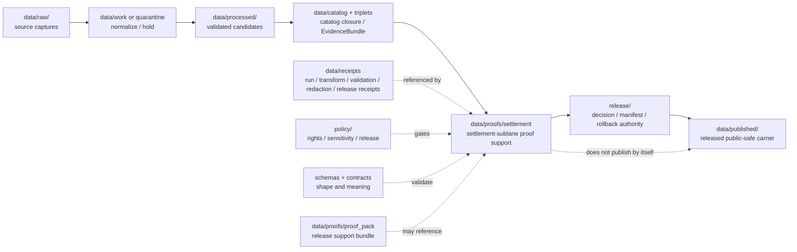

<!-- [KFM_META_BLOCK_V2]
doc_id: kfm://data/proofs/settlement/readme
title: data/proofs/settlement README
type: directory-readme
version: v0.1
status: draft
owners:
  - <data steward — TODO>
  - <proof steward — TODO>
  - <settlements-infrastructure domain steward — TODO>
  - <settlement sublane steward — TODO>
  - <sensitivity reviewer — TODO>
  - <release steward — TODO>
created: 2026-06-25
updated: 2026-06-25
policy_label: public-review
path: data/proofs/settlement/README.md
related:
  - ../README.md
  - ../proof_pack/README.md
  - ../evidence_bundle/README.md
  - ../validation_report/README.md
  - ../citation_validation/README.md
  - ../review/README.md
  - ../integrity/README.md
  - ../../receipts/README.md
  - ../../catalog/README.md
  - ../../published/README.md
  - ../../../release/README.md
  - ../../../docs/domains/settlements-infrastructure/ARCHITECTURE.md
  - ../../../docs/domains/settlements-infrastructure/sublanes/settlements.md
  - ../../../docs/domains/settlements-infrastructure/IDENTITY_MODEL.md
  - ../../../docs/domains/settlements-infrastructure/DATA_LIFECYCLE.md
  - ../../../docs/doctrine/directory-rules.md
  - ../../../docs/doctrine/lifecycle-law.md
  - ../../../docs/doctrine/trust-membrane.md
  - ../../../contracts/README.md
  - ../../../schemas/README.md
  - ../../../policy/README.md
tags:
  - kfm
  - data
  - proofs
  - settlement
  - settlements-infrastructure
  - settlements-sublane
  - place-identity
  - municipality
  - census-place
  - townsite
  - ghost-town
  - fort
  - mission
  - reservation-community
  - evidence-bundle
  - source-role
  - release-gate
  - rollback
  - cite-or-abstain
notes:
  - "Directory README for settlement-sublane proof support under the broader Settlements/Infrastructure domain. It is not itself a schema, semantic contract, policy bundle, ProofPack, ReleaseManifest, catalog record, or published place layer."
  - "This path uses the existing singular settlement lane while documenting it as a settlement proof lane, not a new root authority separate from settlements-infrastructure doctrine."
  - "Settlement proof files must preserve place identity, source role, temporal scope, sensitivity, cross-lane ownership, release state, and rollback support."
[/KFM_META_BLOCK_V2] -->

<a id="top"></a>

# `data/proofs/settlement/`

> Proof-support lane for **Settlement** evidence inside the broader **Settlements / Infrastructure** domain. Files under this directory should support evidence closure, source-role separation, deterministic identity, sensitivity review, catalog closure, release review, correction, and rollback for settlement-sublane claims and public-safe place/community products.


> [!IMPORTANT]
> **Status:** `draft`  
> **Owner:** `<data steward>` · `<proof steward>` · `<settlements-infrastructure domain steward>` · `<settlement sublane steward>` · `<sensitivity reviewer>` · `<release steward>` — TODO  
> **Path:** `data/proofs/settlement/README.md`  
> **Truth posture:** CONFIRMED doctrine / PROPOSED implementation guidance / NEEDS VERIFICATION for emitted proof objects, schemas, validators, CI workflows, source descriptors, release gates, and rollback drills.

> [!WARNING]
> This folder supports review. It does **not** publish a settlement layer, certify municipal status, prove land ownership, expose archaeological/cultural locations, authorize infrastructure disclosure, or turn a place-name match into a canonical identity by file placement.

---

## Quick jumps

| Section | Use it for |
|---|---|
| [1. Purpose](#1-purpose) | What this proof lane is for. |
| [2. Placement and authority](#2-placement-and-authority) | Why this path belongs under `data/proofs/`. |
| [3. What belongs here](#3-what-belongs-here) | Accepted proof families and examples. |
| [4. What must not live here](#4-what-must-not-live-here) | Exclusions and wrong homes. |
| [5. Settlement proof responsibilities](#5-settlement-proof-responsibilities) | Domain-specific support obligations. |
| [6. Object families and proof concerns](#6-object-families-and-proof-concerns) | What each settlement object needs proved. |
| [7. Identity and temporal gates](#7-identity-and-temporal-gates) | How to block identity collapse and time confusion. |
| [8. Sensitivity and publication gates](#8-sensitivity-and-publication-gates) | Cultural, sovereignty, archaeology, private, and infrastructure-adjacent controls. |
| [9. Naming and identity](#9-naming-and-identity) | Suggested file naming and identifiers. |
| [10. Lifecycle relationship](#10-lifecycle-relationship) | How proofs relate to RAW → PUBLISHED and release. |
| [11. Validation checklist](#11-validation-checklist) | Maintainer checklist. |
| [12. Failure modes](#12-failure-modes) | Drift and overclaim patterns to block. |
| [13. Definition of done](#13-definition-of-done) | What is still needed for operational maturity. |

---

## 1. Purpose

`data/proofs/settlement/` stores proof support for the settlement sublane of the Settlements / Infrastructure domain: `Settlement`, `Municipality`, `CensusPlace`, `Townsite`, `GhostTown`, `Fort`, `Mission`, and `ReservationCommunity` claims and their public-safe derivatives.

A proof file here should help answer:

- Which EvidenceBundle supports the place/community claim?
- What source role was assigned at admission, and was it preserved through release?
- Are legal, census, historic, military, religious, and reservation-community identities kept distinct?
- Are source, observed, valid, retrieval, release, and correction times preserved where material?
- Are name variants, boundary vintages, status events, founding/abandonment claims, and succession relations explicitly represented?
- Are sovereignty, cultural, archaeology, living-person, parcel/ownership, and infrastructure-adjacent sensitivities handled by policy and review?
- Does the candidate have validation, catalog closure, review support, release support, correction path, and rollback target?

This directory is not a raw source lane, not the whole Settlements / Infrastructure domain, not an infrastructure proof lane, not a catalog lane, not a release decision lane, and not a public place API.

[Back to top](#top)

---

## 2. Placement and authority

KFM places files by responsibility root. `data/proofs/` is the proof-support area for release-grade evidence support, ProofPacks, catalog closure, citation validation, review proof, and integrity support. The singular `settlement/` path is treated here as a **settlement-sublane proof lane** inside the broader `settlements-infrastructure` domain, not as a new root-level domain authority.

| Surface | Role | Boundary |
|---|---|---|
| [`../README.md`](../README.md) | Parent proof root. | Defines proof-lane expectations. This README narrows them for settlement-sublane proof. |
| [`../proof_pack/`](../proof_pack/) | ProofPack family. | Settlement proof files may feed or be referenced by ProofPacks, but this folder is broader than ProofPack instances. |
| [`../evidence_bundle/`](../evidence_bundle/) | EvidenceBundle support. | Settlement proof files may cite EvidenceBundles; they do not replace them. |
| [`../review/`](../review/) | Review proof support. | Sensitive or release-significant settlement proof may cite review proof; it does not replace review. |
| [`../../receipts/`](../../receipts/) | Process memory. | Receipts say what ran; proof files use them as basis, not as proof by themselves. |
| [`../../catalog/`](../../catalog/) | Discovery and interchange. | Catalog records aid discovery; proof files support closure and release review. |
| [`../../published/`](../../published/) | Released public-safe artifacts. | Public layers/API payloads belong downstream, only after release gates. |
| [`../../../release/`](../../../release/) | Release decisions, manifests, rollback cards, correction and withdrawal notices. | Release authority stays in `release/`; this folder supports it. |
| [`../../../docs/domains/settlements-infrastructure/`](../../../docs/domains/settlements-infrastructure/) | Parent domain doctrine. | Docs explain lane meaning and boundaries; proof files support concrete claims/candidates. |
| [`../../../contracts/`](../../../contracts/) | Semantic meaning. | Object meaning belongs in contracts. |
| [`../../../schemas/`](../../../schemas/) | Machine shape. | Field-level JSON Schema belongs under the accepted schema home. |
| [`../../../policy/`](../../../policy/) | Admissibility. | Proof files record policy outcomes; policy logic lives in policy roots. |

> [!NOTE]
> The KFM docs carry a naming variance: broader doctrine uses `settlements-infrastructure`, while some schema/path lineage uses singular `settlement`. This README documents the existing `data/proofs/settlement/` path as a proof lane and does not resolve schema-home naming conflicts.

[Back to top](#top)

---

## 3. What belongs here

Use this directory for settlement proof support objects that are safe to store under repository policy and useful for review, release, correction, rollback, or audit.

| Proof family | Example content | Required posture |
|---|---|---|
| `evidence_closure` | Proof that a Settlement, Municipality, CensusPlace, Townsite, GhostTown, Fort, Mission, or ReservationCommunity resolves to EvidenceBundle support. | Must preserve source role, temporal scope, identity basis, uncertainty, and release state. |
| `identity_resolution` | Proof that name variants, authority IDs, census vintages, legal status, and historic aliases were reconciled or intentionally kept separate. | Must not merge distinct legal/census/historic identities silently. |
| `temporal_scope` | Proof that founding, incorporation, census vintage, abandonment, operation, reservation-community, release, and correction times remain distinct. | Time is identity-bearing, not a decoration. |
| `status_event` | Proof for incorporation, dissolution, annexation, depopulation, founding, abandonment, fort activation/decommissioning, or mission operation intervals. | Administrative status is not observed population unless supported by evidence. |
| `boundary_vintage` | Proof for boundary geometry or public-safe generalized geometry by source vintage and release target. | Boundary vintage must be explicit. |
| `cultural_sovereignty_review` | Proof that ReservationCommunity, mission, fort, archaeology-adjacent, sacred, or Indigenous/community-sensitive materials had proper review. | Exact/sensitive geometry fails closed without review. |
| `cross_lane_closure` | Proof that roads/rail, hydrology, hazards, people/land, archaeology, and Frontier Matrix joins preserve ownership. | Neighboring lane truth must not be absorbed by settlement. |
| `release_support` | Proof refs for catalog closure, ProofPack, ReviewRecord, ReleaseManifest, correction path, and rollback target. | Release authority stays in `release/`. |

[Back to top](#top)

---

## 4. What must not live here

| Excluded material | Correct home or action | Why |
|---|---|---|
| Raw source captures, census tables, gazetteer exports, municipal records, plat scans, historic maps, tribal/community records, or archival payloads | `data/raw/settlements-infrastructure/`, `data/raw/settlement/`, `data/work/...`, or `data/quarantine/...` according to accepted path policy | Proof files reference source material; they do not store it. |
| Canonical processed settlement objects | `data/processed/...` after validation | Proof lanes are support, not canonical data. |
| Infrastructure asset/network/facility/condition/dependency proof | Infrastructure sublane or broader settlements-infrastructure proof lane | This path is settlement/place identity, not critical asset proof. |
| Catalog records, STAC/DCAT/PROV, or domain indexes | `data/catalog/...` | Catalog is discovery/interchange, not proof authority. |
| ReleaseManifest, PromotionDecision, RollbackCard, CorrectionNotice, WithdrawalNotice, or release signature | `release/` | Release authority stays separate. |
| Public map layers, PMTiles, GeoParquet, API payloads, reports, or stories | `data/published/...` after release gates | Published artifacts are downstream carriers. |
| Policy logic or release rules | `policy/` | Proof files record policy outcomes, not policy definitions. |
| JSON Schemas | `schemas/contracts/v1/...` | Machine shape belongs in schemas. |
| Semantic contracts | `contracts/...` | Meaning belongs in contracts. |
| Property ownership, land title, living-person residence, DNA, or person-parcel proof | People / DNA / Land lane | Settlement proof may cite context only and must not publish restricted joins. |
| Exact archaeological, sacred, culturally sensitive, sovereignty-sensitive, or private-location details | Quarantine, restrict, generalize, or deny | Public-review proof files must not leak sensitive community/site geometry. |

[Back to top](#top)

---

## 5. Settlement proof responsibilities

A proof file in this lane should support one or more of these responsibilities:

1. **Evidence closure** — every claim resolves to EvidenceBundle support or records `ABSTAIN`, `DENY`, `HOLD`, or `ERROR`.
2. **Identity discipline** — `Settlement`, `Municipality`, `CensusPlace`, `Townsite`, `GhostTown`, `Fort`, `Mission`, and `ReservationCommunity` identities remain distinct unless an explicit reconciliation proof supports a relation.
3. **Source-role separation** — administrative compilations, legal records, census aggregates, historic gazetteers, maps, oral histories, and archaeological/cultural contexts are not collapsed into observations.
4. **Temporal discipline** — source, observed, valid, retrieval, release, correction, census vintage, legal status, founding, abandonment, and operation times remain distinct where material.
5. **Boundary discipline** — geometry and boundary vintages are scoped, uncertain where necessary, and public-safe at release.
6. **Sensitivity control** — ReservationCommunity, mission, fort, sacred/cultural context, archaeology adjacency, private-location, and people/land joins are generalized, restricted, or denied where required.
7. **Cross-lane ownership** — settlement claims cite roads/rail, hydrology, hazards, people/land, archaeology, infrastructure, and Frontier Matrix context without absorbing their truth.
8. **Release support** — proofs connect to policy decisions, validation reports, catalog closure, review records, release candidates, correction paths, and rollback targets.

[Back to top](#top)

---

## 6. Object families and proof concerns

| Object family | Proof concern |
|---|---|
| `Settlement` | Umbrella place identity; name variants, source role, temporal scope, geometry uncertainty, and release state. |
| `Municipality` | Legal incorporated entity; charter/status events, jurisdiction key, incorporation/dissolution/annexation intervals, boundary vintage. |
| `CensusPlace` | Statistical identity; census vintage, external authority ID, statistical boundary, non-legal-status warning. |
| `Townsite` | Plat/founding claim; source role, filing/reference evidence, operation uncertainty, relation to later settlement/ghost town. |
| `GhostTown` | Successor relation to prior settlement; depopulation evidence, historical source role, uncertainty and public geometry posture. |
| `Fort` | Military post identity; operating authority, activation/decommissioning epochs, archaeology/cultural sensitivity, public geometry posture. |
| `Mission` | Religious/cultural site identity; operating interval, cultural sensitivity, community/steward review, public geometry posture. |
| `ReservationCommunity` | Community identity with sovereignty sensitivity; naming, geometry precision, authority context, review state, and restricted joins. |

[Back to top](#top)

---

## 7. Identity and temporal gates

| Gate | Required proof | Failure outcome |
|---|---|---|
| Legal vs census identity | Proof that Municipality and CensusPlace identities are not silently merged. | `DENY`, `ABSTAIN`, or require explicit relation proof. |
| Historic townsite vs active settlement | Proof that Townsite, Settlement, and GhostTown statuses are distinct over time. | `HOLD` or relabel claim. |
| Fort / mission sensitivity | Proof of operating interval, source role, archaeology/cultural review where applicable, and public geometry posture. | `DENY` exact exposure or hold. |
| ReservationCommunity sovereignty | Proof of source authority, naming posture, review state, and geometry/publication limits. | `DENY` or restricted release. |
| Administrative compilation vs observation | Proof that annexation, gazetteer, census, or legal records are not represented as observed field events unless evidence supports that role. | `DENY` source-role collapse. |
| Boundary vintage | Boundary source/vintage and valid time are recorded for any geometry claim. | `ABSTAIN`, stale badge, or hold. |
| Deterministic identity | Source ID, object role, temporal scope, and normalized digest are present or referenced. | `ERROR` or hold. |
| Cross-lane context | Neighboring lane support and ownership preserved. | `ABSTAIN` or `DENY` if ownership collapses. |

[Back to top](#top)

---

## 8. Sensitivity and publication gates

| Risk surface | Required support | Default when unresolved |
|---|---|---|
| ReservationCommunity, Indigenous/community naming, or sovereignty-sensitive content | Steward review, source authority, public naming/geometry posture, PolicyDecision, ReviewRecord. | `DENY`, staged access, or restricted release. |
| Archaeology-adjacent townsites, forts, missions, sacred/cultural sites | Archaeology/cultural ownership preserved; generalized geometry and review state. | `DENY` exact exposure. |
| Living-person, residence, migration, ownership, parcel, DNA, or person-place joins | People / DNA / Land lane support, privacy policy, aggregation/generalization, ReviewRecord. | `DENY` or aggregate. |
| Infrastructure-adjacent place context | Critical-asset details stripped or routed to infrastructure proof/review. | `DENY` exact facility exposure. |
| Historic-place overprecision | Uncertainty representation, public geometry generalization, overprecision denial. | `ABSTAIN` or `DENY`. |
| Hazard/resilience/exposure relation | Hazards ownership preserved; settlement proof only records place relation. | `ABSTAIN` or `DENY` if source role unclear. |
| Public settlement layer | EvidenceBundle, validation, catalog closure, release manifest, rollback target, public-safe geometry. | `HOLD` or `DENY`. |

[Back to top](#top)

---

## 9. Naming and identity

Suggested file pattern:

```text
settlement.<proof_family>.<scope>.<release_or_run_id>.<short_hash>.json
```

Examples:

```text
settlement.evidence_closure.municipality-boundary-demo.v0.1.0123abcd.json
settlement.identity_resolution.censusplace-municipality-demo.v0.1.89ab4567.json
settlement.temporal_scope.ghost-town-status-demo.v0.1.4567cdef.json
settlement.cultural_sovereignty_review.reservation-community-public-summary-demo.v0.1.cdef0123.json
settlement.boundary_vintage.census-place-2020-demo.v0.1.abcd4567.json
```

Minimum proof metadata should include:

- `proof_id`
- `proof_family`
- `domain: settlements-infrastructure`
- `sublane: settlement`
- `object_family`
- `object_id` or `release_candidate_id`
- `source_descriptor_refs`
- `source_roles`
- `evidence_bundle_refs`
- `receipt_refs`
- `validation_report_refs`
- `policy_decision_refs`
- `review_record_refs`
- `catalog_refs`
- `release_refs`
- `rollback_refs`
- `identity_basis`
- `time_scope` with distinct source/observed/valid/retrieval/release/correction times where material
- `sensitivity_posture`
- `public_geometry_posture`
- `outcome`
- `reasons`

[Back to top](#top)

---

## 10. Lifecycle relationship



Proof files support review and release. They do not publish, certify municipal status, establish property ownership, or expose restricted community/site geometry by placement.

[Back to top](#top)

---

## 11. Validation checklist

Before a settlement proof supports release review, verify:

- [ ] The proof identifies the object family, object/release scope, source family, spatial scope, temporal scope, and intended public surface.
- [ ] Every consequential claim resolves to EvidenceBundle support or records `ABSTAIN`, `DENY`, `HOLD`, or `ERROR`.
- [ ] SourceDescriptor refs include source role, rights, sensitivity, citation, cadence/vintage, retrieval time, and digest where applicable.
- [ ] Settlement, Municipality, CensusPlace, Townsite, GhostTown, Fort, Mission, and ReservationCommunity identities are not silently merged.
- [ ] Source ID, object role, temporal scope, and normalized digest are present or referenced for identity-bearing claims.
- [ ] Administrative, legal, census, aggregate, map, historic, oral-history, and observed source roles remain distinct.
- [ ] Boundary geometry has source vintage, uncertainty, valid time, public geometry posture, and release state.
- [ ] Legal status, census vintage, founding, operation, abandonment, and correction times remain distinct where material.
- [ ] ReservationCommunity, fort, mission, archaeology-adjacent, cultural, sacred, and sovereignty-sensitive contexts have review state and public-safe geometry posture.
- [ ] Living-person, DNA, residence, ownership, parcel, and person-place joins are denied, aggregated, or routed to People / DNA / Land proof and policy.
- [ ] Infrastructure-adjacent details do not leak critical assets, dependencies, condition observations, operator-sensitive data, or exact facility exposure.
- [ ] Cross-lane joins preserve roads/rail, hydrology, hazards, archaeology, people/land, infrastructure, and Frontier Matrix ownership.
- [ ] Release refs point to `release/`; published artifact refs point to `data/published/`; raw/work/quarantine data is not exposed.
- [ ] Rollback, correction, withdrawal, and invalidation targets are traceable.

[Back to top](#top)

---

## 12. Failure modes

| Failure mode | Why it matters | Required response |
|---|---|---|
| Municipality and CensusPlace merged because names match | Legal and statistical identities are different evidence objects. | Split identities or create explicit relation proof. |
| Townsite treated as active settlement without evidence | Historic/founding claim becomes current-place claim. | Relabel, abstain, or require current evidence. |
| GhostTown status asserted without temporal/evidence basis | Status claim may be contested or overprecise. | Hold until EvidenceBundle and temporal proof exist. |
| Administrative compilation cited as observation | Source-role collapse misleads users. | Deny or relabel as administrative/context evidence. |
| ReservationCommunity geometry/naming released without review | Sovereignty and community sensitivity risk. | Deny, generalize, restrict, or require steward review. |
| Archaeology-adjacent fort/mission/townsite exact geometry exposed | Sensitive cultural/site location leak. | Quarantine and generalize or deny. |
| Settlement proof includes private person-place or ownership joins | Violates People / DNA / Land trust boundary. | Deny, aggregate, or route to proper lane. |
| Infrastructure condition/dependency details leak through settlement proof | Critical-asset risk. | Move to infrastructure lane and apply stricter sensitivity review. |
| Proof file acts as ReleaseManifest | Collapses proof support with release authority. | Move authority to `release/`; keep reference here. |
| AI place story replaces evidence | Generated language becomes root truth. | Deny; require EvidenceBundle and citation validation. |

[Back to top](#top)

---

## 13. Definition of done

This proof lane is operationally useful when:

- [ ] The `settlement` path choice is confirmed as accepted compatibility/path convention or resolved against `settlements-infrastructure` by ADR/migration note.
- [ ] Settlement proof schemas and semantic contracts exist under approved homes or the schema-home naming conflict is resolved.
- [ ] Valid and invalid fixtures cover identity collapse, administrative-as-observation, boundary vintage omission, historic overprecision, sovereignty-sensitive exposure, archaeology-adjacent geometry leak, people/land privacy joins, infrastructure detail leakage, and missing rollback support.
- [ ] CI or validators block public release when EvidenceBundle, PolicyDecision, ReviewRecord, catalog closure, public-safe geometry, or rollback target is missing.
- [ ] Source descriptors exist for active settlement source families and record rights, cadence, role, citation, and sensitivity.
- [ ] Release docs cross-link proof requirements for settlement layers, historic place claims, municipality/census boundaries, ghost-town summaries, forts/missions, and reservation-community public summaries.
- [ ] CODEOWNERS or equivalent review ownership covers data steward, settlement sublane steward, settlements-infrastructure steward, sensitivity reviewer, proof steward, and release steward.
- [ ] At least one synthetic no-network release candidate demonstrates: source capture → processed candidate → EvidenceBundle → settlement proof → ProofPack → ReleaseManifest → public-safe artifact → rollback.

---

## Maintainer note

Settlement proof work is high-risk because names make places look simpler and more stable than the evidence often allows. Keep legal identity, census identity, historic identity, cultural context, time, source role, and public geometry separate until evidence and policy say otherwise. When evidence, policy, time scope, sensitivity, or release state is incomplete, hold, abstain, deny, or quarantine instead of publishing a confident place on the map.
