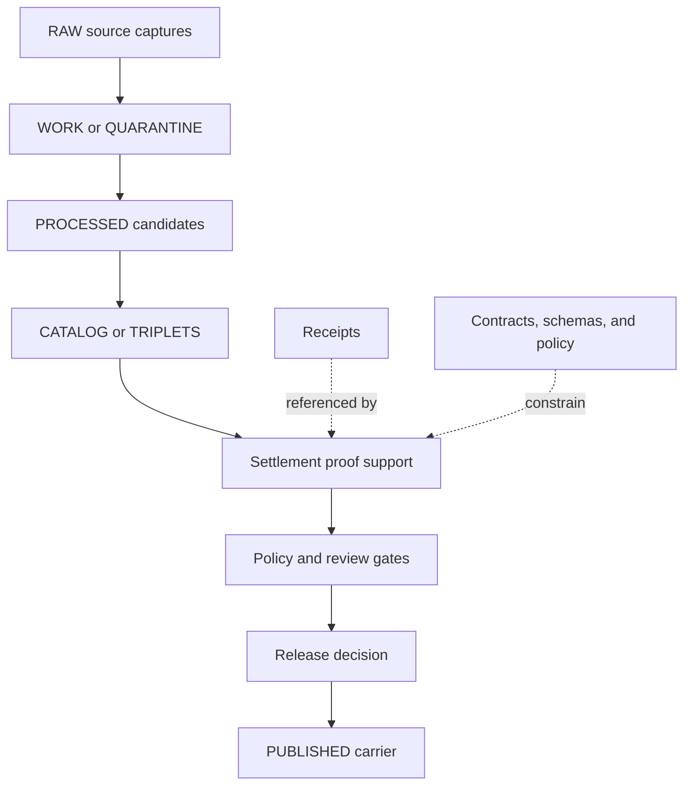

<!-- [KFM_META_BLOCK_V2]
doc_id: kfm://data/proofs/settlement/readme
title: data/proofs/settlement README
type: directory-readme
version: v0.2.0
status: repository-grounded draft; settlement proof production and release readiness remain unverified
owners:
  - "@bartytime4life — verified CODEOWNERS routing for /data/proofs/; routing is not review or approval"
  - "NEEDS VERIFICATION — proof, settlement-sublane, Settlements / Infrastructure, sensitivity, policy, and release stewardship"
created: 2026-06-25
updated: 2026-07-26
policy_label: public-review
path: data/proofs/settlement/README.md
related:
  - ../README.md
  - ../settlements-infrastructure/README.md
  - ../proof_pack/README.md
  - ../evidence_bundle/README.md
  - ../validation_report/README.md
  - ../citation_validation/README.md
  - ../review/README.md
  - ../../receipts/README.md
  - ../../catalog/README.md
  - ../../published/README.md
  - ../../../release/README.md
  - ../../../docs/domains/settlements-infrastructure/ARCHITECTURE.md
  - ../../../docs/domains/settlements-infrastructure/sublanes/settlements.md
  - ../../../docs/domains/settlements-infrastructure/IDENTITY_MODEL.md
  - ../../../docs/domains/settlements-infrastructure/DATA_LIFECYCLE.md
  - ../../../docs/architecture/directory-rules.md
  - ../../../docs/doctrine/directory-rules.md
  - ../../../docs/doctrine/lifecycle-law.md
  - ../../../docs/doctrine/trust-membrane.md
  - ../../../docs/adr/ADR-0010-deny-by-default-for-dna-rare-species-archaeology-infrastructure.md
  - ../../../docs/adr/ADR-0011-receipts-vs-proofs-vs-manifests-vs-catalog-separation.md
  - ../../../docs/adr/ADR-0029-adopt-directory-governance-standard-v2.md
  - ../../../contracts/domains/settlements-infrastructure/README.md
  - ../../../schemas/contracts/v1/domains/settlements-infrastructure/README.md
  - ../../../policy/domains/settlements-infrastructure/README.md
  - ../../../tests/domains/settlements-infrastructure/README.md
  - ../../../fixtures/domains/settlements-infrastructure/README.md
  - ../../../tools/validators/domains/settlements-infrastructure/README.md
  - ../../../.github/workflows/domain-settlements-infrastructure.yml
tags:
  - kfm
  - data
  - proofs
  - settlement
  - settlements-infrastructure
  - settlements-sublane
  - place-identity
  - municipality
  - census-place
  - townsite
  - ghost-town
  - fort
  - mission
  - reservation-community
  - evidence-bundle
  - source-role
  - release-gate
  - rollback
  - cite-or-abstain
notes:
  - "Same-path Markdown modernization only; no proof payload, source record, contract, schema, policy, validator, fixture, workflow, release object, route, or publication state changed."
  - "The singular settlement lane and compound settlements-infrastructure lane remain CONFLICTED until an accepted ADR or migration note resolves their relationship."
  - "Directory Rules v2 and ADR-0029 remain proposed; this README does not adopt them or retire the legacy architecture rule body."
  - "A dynamic workflow badge is intentionally omitted because the current domain jobs record semantic-validation, proof-production, and release-dry-run holds."
[/KFM_META_BLOCK_V2] -->

<a id="top"></a>

# `data/proofs/settlement/` — Settlement Proof Support

> Bounded proof-support guidance for settlement-side place and community claims inside the broader **Settlements / Infrastructure** domain.

[](#status-and-evidence-boundary)
[](../../../docs/doctrine/trust-membrane.md)
[](../README.md)
[](../../../docs/domains/settlements-infrastructure/ARCHITECTURE.md)
[](#2-placement-and-authority)

> [!IMPORTANT]
> **Status:** repository-grounded draft  
> **Review route:** `@bartytime4life` through [`.github/CODEOWNERS`](../../../.github/CODEOWNERS); routing is not accountable stewardship, independent review, or approval  
> **Path:** `data/proofs/settlement/README.md`  
> **Evidence boundary:** [`main@7b75e3bd590cd37321113f8336559060ae4c4358`](https://github.com/bartytime4life/Kansas-Frontier-Matrix/tree/7b75e3bd590cd37321113f8336559060ae4c4358)  
> **Truth posture:** CONFIRMED repository evidence / PROPOSED proof-profile guidance / NEEDS VERIFICATION for emitted proof objects, target-specific schemas, executable validators, public-safe fixtures, policy enforcement, release gates, and rollback drills.

> [!WARNING]
> This directory supports review. It does **not** publish a settlement layer, certify municipal status, prove land ownership, expose archaeological or cultural locations, authorize infrastructure disclosure, resolve the `settlement` versus `settlements-infrastructure` path conflict, or turn a name match into canonical identity.

---

## Quick jumps

| Section | Use it for |
|---|---|
| [Status and evidence boundary](#status-and-evidence-boundary) | What is confirmed, held, conflicted, or still unknown. |
| [1. Purpose](#1-purpose) | What this proof-support lane is for. |
| [2. Placement and authority](#2-placement-and-authority) | Why the existing path is retained without claiming canonical status. |
| [3. What belongs here](#3-what-belongs-here) | Proposed proof-support families and admission limits. |
| [4. What must not live here](#4-what-must-not-live-here) | Exclusions and owning responsibility roots. |
| [Inputs](#inputs) · [Outputs](#outputs) | What future proof support may reference or emit. |
| [5–8. Responsibilities and gates](#5-settlement-proof-responsibilities) | Identity, time, source-role, sensitivity, and publication controls. |
| [9. Naming and identity](#9-naming-and-identity) | Explicitly proposed naming and metadata sketch. |
| [10. Lifecycle relationship](#10-lifecycle-relationship) | Proof support inside the governed lifecycle. |
| [Validation and held automation](#validation-and-held-automation) | Verified placeholders and explicit workflow holds. |
| [11. Validation checklist](#11-validation-checklist) | Future packet review checklist. |
| [12. Failure modes](#12-failure-modes) | Drift and overclaim patterns to block. |
| [13. Definition of done](#13-definition-of-done) | Open verification and graduation evidence. |
| [Review burden](#review-burden) · [Related folders](#related-folders) · [ADRs](#adrs) | Review and authority context. |
| [Last reviewed](#last-reviewed) · [No-loss ledger](#no-loss-ledger) | Evidence boundary, preserved content, and lineage. |

---

## Status and evidence boundary

| Surface | Current evidence | Boundary |
|---|---|---|
| README and path | This file exists at the pinned base with stable document ID `kfm://data/proofs/settlement/readme`. | File presence proves documentation only. |
| Placement | `data/proofs/` owns proof support; both singular and compound-domain child lanes exist. | The exact `settlement` versus `settlements-infrastructure` relationship is **CONFLICTED**. |
| Contracts and schemas | The compound-domain contract lane is a draft with object files proposed; the schema lane is a proposed greenfield scaffold. | No accepted target-specific proof profile was verified. |
| Validation and fixtures | Two domain validators raise `NotImplementedError`; the domain fixture README is a greenfield stub. | No executable settlement-proof validation or representative fixture suite was verified. |
| Automation | The domain workflow performs bounded readiness checks and records explicit semantic-validation, proof-production, and release-dry-run holds. | A green held job is not proof production, release readiness, or publication authority. |
| Ownership | CODEOWNERS routes `/data/proofs/` to `@bartytime4life`. | Accountable proof, domain, sensitivity, policy, release, and independent-review assignments remain NEEDS VERIFICATION. |
| Proof payloads and external stores | Not established by the bounded file review. | Presence, absence, access control, or operational use remains UNKNOWN. |

[Back to top](#top)

---

## 1. Purpose

`data/proofs/settlement/` stores proof support for the settlement sublane of the Settlements / Infrastructure domain: `Settlement`, `Municipality`, `CensusPlace`, `Townsite`, `GhostTown`, `Fort`, `Mission`, and `ReservationCommunity` claims and their public-safe derivatives.

A proof file here should help answer:

- Which EvidenceBundle supports the place/community claim?
- What source role was assigned at admission, and was it preserved through release?
- Are legal, census, historic, military, religious, and reservation-community identities kept distinct?
- Are source, observed, valid, retrieval, release, and correction times preserved where material?
- Are name variants, boundary vintages, status events, founding/abandonment claims, and succession relations explicitly represented?
- Are sovereignty, cultural, archaeology, living-person, parcel/ownership, and infrastructure-adjacent sensitivities handled by policy and review?
- Does the candidate have validation, catalog closure, review support, release support, correction path, and rollback target?

This directory is not a raw source lane, not the whole Settlements / Infrastructure domain, not an infrastructure proof lane, not a catalog lane, not a release decision lane, and not a public place API.

[Back to top](#top)

---

## 2. Placement and authority

KFM places artifacts by responsibility. The still-operative [Directory Rules v1.3.1](../../../docs/architecture/directory-rules.md#9-data-and-release-roots) assigns evidence and proof support to `data/proofs/` and separates it from receipts, catalog metadata, release decisions, and published carriers. The [parent proof contract](../README.md) applies that boundary to the current repository.

The child-lane name is not settled. The repository contains both this singular lane and the broader [`data/proofs/settlements-infrastructure/`](../settlements-infrastructure/README.md); the domain [canonical-path guide](../../../docs/domains/settlements-infrastructure/CANONICAL_PATHS.md) records singular-versus-compound path variance. This revision therefore keeps the existing path, marks the relationship **CONFLICTED**, and makes no move, alias, compatibility, canonicalization, or migration claim.

| Authority source | Verified state at the evidence boundary | Effect on this README |
|---|---|---|
| [Directory Rules v1.3.1](../../../docs/architecture/directory-rules.md) | Existing `review` rule body and active compatibility dependency. | Its responsibility-root, data/proof split, domain-lane, and no-parallel-authority rules constrain this edit. |
| [Directory Rules v2](../../../docs/doctrine/directory-rules.md) | `2.0.0-draft.1`; `PROPOSED_FOR_ADOPTION`. | Useful proposed successor guidance only; it does not supersede v1.3.1 here. |
| [ADR-0029](../../../docs/adr/ADR-0029-adopt-directory-governance-standard-v2.md) | `proposed`. | Does not adopt v2, retire the legacy body, or authorize dependent path migration. |
| [Parent proof README](../README.md) | Repository-grounded draft. | Defines the current proof-support boundary and anti-collapse rules. |
| [Compound-domain proof README](../settlements-infrastructure/README.md) | Repository-grounded draft at a sibling path. | Records the same path variance; neither README may resolve it by assertion. |

| Surface | Role | Boundary |
|---|---|---|
| [`../README.md`](../README.md) | Parent proof responsibility. | Defines proof-lane expectations; this file narrows them for settlement-side claims. |
| [`../proof_pack/`](../proof_pack/README.md) | ProofPack support. | A future settlement proof may be referenced by a ProofPack; this lane is not the ProofPack authority. |
| [`../evidence_bundle/`](../evidence_bundle/README.md) | EvidenceBundle support. | Settlement proof support may resolve EvidenceRefs; it does not replace evidence. |
| [`../review/`](../review/README.md) | Review support. | Review records remain independently addressable. |
| [`../../receipts/`](../../receipts/README.md) | Process memory. | Receipts say what ran; they do not prove a claim or release by themselves. |
| [`../../catalog/`](../../catalog/README.md) | Discovery and interchange. | Catalog records aid closure; they are not canonical claim or release authority. |
| [`../../published/`](../../published/README.md) | Released public-safe carriers. | Public layers and API payloads belong downstream of governed release. |
| [`../../../release/`](../../../release/README.md) | Release decisions, correction, withdrawal, and rollback. | Release authority stays separate from proof support. |
| [Domain architecture](../../../docs/domains/settlements-infrastructure/ARCHITECTURE.md) | Domain meaning and boundaries. | Documentation does not establish proof payload or runtime maturity. |
| [Contracts](../../../contracts/domains/settlements-infrastructure/README.md) | Semantic meaning. | Current object-level settlement contracts remain proposed. |
| [Schemas](../../../schemas/contracts/v1/domains/settlements-infrastructure/README.md) | Machine shape. | Current domain schema lane is a proposed scaffold. |
| [Policy](../../../policy/domains/settlements-infrastructure/README.md) | Admissibility. | Current domain policy lane is a proposed scaffold; enforcement is not established. |

> [!NOTE]
> Existing-path retention is a reversible documentation choice, not proof that `settlement/` is canonical or compatible. Resolving the variance requires an accepted ADR or migration note, consumer inventory, link closure, and rollback plan.

[Back to top](#top)

---

## 3. What belongs here

No accepted settlement proof schema, contract, producer, validator, or payload profile was verified. The families below are **PROPOSED classification guidance** for future repository-safe proof support; they do not authorize adding payloads or treating filenames as proof.

| Proposed proof family | Support question | Required posture |
|---|---|---|
| `evidence_closure` | Proof that a Settlement, Municipality, CensusPlace, Townsite, GhostTown, Fort, Mission, or ReservationCommunity resolves to EvidenceBundle support. | Must preserve source role, temporal scope, identity basis, uncertainty, and release state. |
| `identity_resolution` | Proof that name variants, authority IDs, census vintages, legal status, and historic aliases were reconciled or intentionally kept separate. | Must not merge distinct legal/census/historic identities silently. |
| `temporal_scope` | Proof that founding, incorporation, census vintage, abandonment, operation, reservation-community, release, and correction times remain distinct. | Time is identity-bearing, not a decoration. |
| `status_event` | Proof for incorporation, dissolution, annexation, depopulation, founding, abandonment, fort activation/decommissioning, or mission operation intervals. | Administrative status is not observed population unless supported by evidence. |
| `boundary_vintage` | Proof for boundary geometry or public-safe generalized geometry by source vintage and release target. | Boundary vintage must be explicit. |
| `cultural_sovereignty_review` | Proof that ReservationCommunity, mission, fort, archaeology-adjacent, sacred, or Indigenous/community-sensitive materials had proper review. | Exact/sensitive geometry fails closed without review. |
| `cross_lane_closure` | Proof that roads/rail, hydrology, hazards, people/land, archaeology, and Frontier Matrix joins preserve ownership. | Neighboring lane truth must not be absorbed by settlement. |
| `release_support` | Proof refs for catalog closure, ProofPack, ReviewRecord, ReleaseManifest, correction path, and rollback target. | Release authority stays in `release/`. |

[Back to top](#top)

---

## 4. What must not live here

| Excluded material | Correct home or action | Why |
|---|---|---|
| Raw captures, census tables, gazetteer exports, municipal records, plats, historic maps, tribal or community records, or archival payloads | The accepted domain lane under [`data/raw/`](../../raw/README.md), [`data/work/`](../../work/README.md), or [`data/quarantine/`](../../quarantine/README.md) | Proof support references source material; it does not store source payloads. The exact domain slug remains conflicted. |
| Canonical processed settlement objects | The accepted domain lane under `data/processed/` after validation | Proof support is not canonical domain truth. |
| Infrastructure asset, network, facility, condition, or dependency proof | The infrastructure-side or compound-domain proof boundary after path authority is resolved | This lane is scoped to settlement/place identity and must not become critical-asset authority. |
| Process, transform, validation, generalization, redaction, AI, or release receipts | [`data/receipts/`](../../receipts/README.md) | Receipts preserve process memory; they do not replace proof closure. |
| Catalog records, STAC, DCAT, PROV, or domain indexes | [`data/catalog/`](../../catalog/README.md) | Catalog is discovery or interchange, not proof authority. |
| ReleaseManifest, PromotionDecision, RollbackCard, CorrectionNotice, WithdrawalNotice, or release signature | [`release/`](../../../release/README.md) | Release authority stays separate. |
| Public map layers, PMTiles, GeoParquet, API payloads, reports, or stories | [`data/published/`](../../published/README.md), after governed release | Published artifacts are downstream carriers. |
| Policy logic or release rules | [`policy/`](../../../policy/README.md) | Proof support records or references policy outcomes; policy decides admissibility. |
| JSON Schema | [`schemas/`](../../../schemas/README.md) | Machine shape belongs under the accepted schema home. |
| Semantic contract | [`contracts/`](../../../contracts/README.md) | Meaning belongs under the contract root. |
| Property ownership, land title, living-person residence, DNA, or person-parcel proof | People / DNA / Land lane and applicable policy | Settlement proof may cite bounded context only and must not expose restricted joins. |
| Exact archaeological, sacred, culturally sensitive, sovereignty-sensitive, private-location, or critical-infrastructure details | Quarantine, restrict, generalize, aggregate, delay, abstain, or deny | A public repository must not become an exposure channel. |

[Back to top](#top)

---

## Inputs

A future reviewable settlement proof-support packet may reference, but must not absorb:

- a bounded claim, relation, object, derivative, or release-candidate identity;
- SourceDescriptor identifiers, source roles, retrieval records, rights, citation, cadence, and freshness state;
- EvidenceRefs that resolve to independently addressable EvidenceBundles;
- validation and citation reports, receipts, policy decisions, and review records;
- catalog, ProofPack, release, correction, withdrawal, invalidation, and rollback references; and
- public-field or public-geometry allowlists for a bounded derivative under review.

Unresolved evidence, rights, sensitivity, identity, time, ownership, precision, or release state is input to a contract-defined negative outcome; it is not permission to omit the gap.

[Back to top](#top)

---

## Outputs

Once an accepted proof profile and producer exist, permitted outputs are repository-safe proof-support records or indexes for evidence closure, identity resolution, temporal and geometry review, source-role preservation, sensitivity review, release-candidate evaluation, correction, withdrawal, invalidation, and rollback support.

Outputs must retain independently addressable references and must not claim more than their evidence. Outcome vocabularies are surface-specific: governed responses, promotion gates, validators, and migration checks must use the enum defined by their applicable contract. This README does not create a universal enum.

No output is public merely because it is reviewable, committed, or stored under `data/proofs/`.

[Back to top](#top)

---

## 5. Settlement proof responsibilities

A proof file in this lane should support one or more of these responsibilities:

1. **Evidence closure** — every consequential claim resolves to EvidenceBundle support or a negative outcome defined by the applicable governed-response, validation, promotion, or release contract.
2. **Identity discipline** — `Settlement`, `Municipality`, `CensusPlace`, `Townsite`, `GhostTown`, `Fort`, `Mission`, and `ReservationCommunity` identities remain distinct unless an explicit reconciliation proof supports a relation.
3. **Source-role separation** — administrative compilations, legal records, census aggregates, historic gazetteers, maps, oral histories, and archaeological/cultural contexts are not collapsed into observations.
4. **Temporal discipline** — source, observed, valid, retrieval, release, correction, census vintage, legal status, founding, abandonment, and operation times remain distinct where material.
5. **Boundary discipline** — geometry and boundary vintages are scoped, uncertain where necessary, and public-safe at release.
6. **Sensitivity control** — ReservationCommunity, mission, fort, sacred/cultural context, archaeology adjacency, private-location, and people/land joins are generalized, restricted, or denied where required.
7. **Cross-lane ownership** — settlement claims cite roads/rail, hydrology, hazards, people/land, archaeology, infrastructure, and Frontier Matrix context without absorbing their truth.
8. **Release support** — proofs connect to policy decisions, validation reports, catalog closure, review records, release candidates, correction paths, and rollback targets.

[Back to top](#top)

---

## 6. Object families and proof concerns

> [!NOTE]
> These object-family names are grounded in current domain documentation and the compound-domain contract README. Their object-level contracts, schema bindings, proof profiles, and executable validation remain PROPOSED or NEEDS VERIFICATION.

| Object family | Proof concern |
|---|---|
| `Settlement` | Umbrella place identity; name variants, source role, temporal scope, geometry uncertainty, and release state. |
| `Municipality` | Legal incorporated entity; charter/status events, jurisdiction key, incorporation/dissolution/annexation intervals, boundary vintage. |
| `CensusPlace` | Statistical identity; census vintage, external authority ID, statistical boundary, non-legal-status warning. |
| `Townsite` | Plat/founding claim; source role, filing/reference evidence, operation uncertainty, relation to later settlement/ghost town. |
| `GhostTown` | Successor relation to prior settlement; depopulation evidence, historical source role, uncertainty and public geometry posture. |
| `Fort` | Military post identity; operating authority, activation/decommissioning epochs, archaeology/cultural sensitivity, public geometry posture. |
| `Mission` | Religious/cultural site identity; operating interval, cultural sensitivity, community/steward review, public geometry posture. |
| `ReservationCommunity` | Community identity with sovereignty sensitivity; naming, geometry precision, authority context, review state, and restricted joins. |

[Back to top](#top)

---

## 7. Identity and temporal gates

| Gate | Required proof | Contract-dependent fail-closed response |
|---|---|---|
| Legal vs census identity | Proof that Municipality and CensusPlace identities are not silently merged. | Deny or abstain, or require explicit relation proof. |
| Historic townsite vs active settlement | Proof that Townsite, Settlement, and GhostTown statuses are distinct over time. | Hold promotion or relabel the claim. |
| Fort / mission sensitivity | Proof of operating interval, source role, archaeology/cultural review where applicable, and public geometry posture. | Deny exact exposure or hold promotion. |
| ReservationCommunity sovereignty | Proof of source authority, naming posture, review state, and geometry/publication limits. | Deny or restrict release. |
| Administrative compilation vs observation | Proof that annexation, gazetteer, census, or legal records are not represented as observed field events unless evidence supports that role. | Deny the source-role upcast. |
| Boundary vintage | Boundary source/vintage and valid time are recorded for any geometry claim. | Contract-defined abstention or hold, plus a stale-state marker where the applicable contract defines one. |
| Deterministic identity | Source ID, object role, temporal scope, and normalized digest are present or referenced. | Contract-defined error or hold. |
| Cross-lane context | Neighboring lane support and ownership preserved. | Abstain or deny if ownership collapses. |

> [!IMPORTANT]
> Outcome labels do not transfer automatically between surfaces. Adjacent domain docs propose `ANSWER | ABSTAIN | DENY | ERROR` for governed responses, allow promotion or release gates to `HOLD`, and use `PASS | FAIL` for validators. Until accepted contracts bind those surfaces, record the applicable contract and do not normalize the labels by prose.

[Back to top](#top)

---

## 8. Sensitivity and publication gates

The [current domain policy lane](../../../policy/domains/settlements-infrastructure/README.md) is a proposed greenfield scaffold. The table below states the fail-closed support a future release would need; it is not evidence of active evaluator behavior.

| Risk surface | Required support | Default when unresolved |
|---|---|---|
| ReservationCommunity, Indigenous/community naming, or sovereignty-sensitive content | Steward review, source authority, public naming/geometry posture, PolicyDecision, ReviewRecord. | `DENY`, staged access, or restricted release. |
| Archaeology-adjacent townsites, forts, missions, sacred/cultural sites | Archaeology/cultural ownership preserved; generalized geometry and review state. | `DENY` exact exposure. |
| Living-person, residence, migration, ownership, parcel, DNA, or person-place joins | People / DNA / Land lane support, privacy policy, aggregation/generalization, ReviewRecord. | `DENY` or aggregate. |
| Infrastructure-adjacent place context | Critical-asset details stripped or routed to infrastructure proof/review. | `DENY` exact facility exposure. |
| Historic-place overprecision | Uncertainty representation, public geometry generalization, overprecision denial. | `ABSTAIN` or `DENY`. |
| Hazard/resilience/exposure relation | Hazards ownership preserved; settlement proof only records place relation. | `ABSTAIN` or `DENY` if source role unclear. |
| Public settlement layer | EvidenceBundle, validation, catalog closure, release manifest, rollback target, public-safe geometry. | `HOLD` or `DENY`. |

[Back to top](#top)

---

## 9. Naming and identity

> [!NOTE]
> **PROPOSED naming sketch.** No accepted settlement proof contract, schema, identity registry, producer, or filename validator was verified. The pattern and metadata list below are review guidance only and must not be used to infer current payload shape.

Proposed file pattern:

```text
settlement.<proof_family>.<scope>.<release_or_run_id>.<short_hash>.json
```

Illustrative synthetic examples:

```text
settlement.evidence_closure.municipality-boundary-demo.v0.1.0123abcd.json
settlement.identity_resolution.censusplace-municipality-demo.v0.1.89ab4567.json
settlement.temporal_scope.ghost-town-status-demo.v0.1.4567cdef.json
settlement.cultural_sovereignty_review.reservation-community-public-summary-demo.v0.1.cdef0123.json
settlement.boundary_vintage.census-place-2020-demo.v0.1.abcd4567.json
```

A future accepted proof profile should define at least:

- `proof_id`
- `proof_family`
- `domain: settlements-infrastructure`
- `sublane: settlement`
- `object_family`
- `object_id` or `release_candidate_id`
- `source_descriptor_refs`
- `source_roles`
- `evidence_bundle_refs`
- `receipt_refs`
- `validation_report_refs`
- `policy_decision_refs`
- `review_record_refs`
- `catalog_refs`
- `release_refs`
- `rollback_refs`
- `identity_basis`
- `time_scope` with distinct source/observed/valid/retrieval/release/correction times where material
- `sensitivity_posture`
- `public_geometry_posture`
- `outcome`
- `reasons`

[Back to top](#top)

---

## 10. Lifecycle relationship


```mermaid
flowchart TD
  RAW["RAW source captures"] --> WQ["WORK or QUARANTINE"]
  WQ --> PROC["PROCESSED candidates"]
  PROC --> CAT["CATALOG or TRIPLETS"]
  CAT --> PROOF["Settlement proof support"]
  PROOF --> REVIEW["Policy and review gates"]
  REVIEW --> REL["Release decision"]
  REL --> PUB["PUBLISHED carrier"]

  REC["Receipts"] -. "referenced by" .-> PROOF
  AUTH["Contracts, schemas, and policy"] -. "constrain" .-> PROOF
```

Proof support is evidence-subordinate input to review. It cannot skip lifecycle phases, authorize release, publish, certify municipal status, establish property ownership, or expose restricted community, site, or infrastructure geometry by placement.

[Back to top](#top)

---

## Validation and held automation

No accepted end-to-end settlement proof validator or producer was verified at the pinned base:

- [`validate_evidence_bundle.py`](../../../tools/validators/domains/settlements-infrastructure/validate_evidence_bundle.py) and [`validate_schema.py`](../../../tools/validators/domains/settlements-infrastructure/validate_schema.py) are greenfield placeholders whose `main()` raises `NotImplementedError`;
- the [domain fixture lane](../../../fixtures/domains/settlements-infrastructure/README.md) is a one-line greenfield stub;
- the [domain test README](../../../tests/domains/settlements-infrastructure/README.md) documents proposed deterministic, synthetic, no-network families but does not prove executable coverage; and
- the [domain workflow](../../../.github/workflows/domain-settlements-infrastructure.yml) performs bounded readiness checks with `contents: read` on GitHub-hosted runners and records explicit holds.

| Workflow job | Current behavior | Explicit boundary |
|---|---|---|
| `validate-settlements-infrastructure` | Inspects boundary files, placeholders, fixture structure, and readiness signals. | `WORKFLOW_HOLD: semantic Settlements/Infrastructure validation is not established` |
| `build-proof-settlements-infrastructure` | Checks the compound-domain proof lane and rejects surfaced proof artifacts or producer commands until graduation. | `WORKFLOW_HOLD: no accepted Settlements/Infrastructure proof producer or deterministic proof command` |
| `publish-dry-run-settlements-infrastructure` | Checks candidate and release boundaries without releasing or publishing. | `WORKFLOW_HOLD: no accepted Settlements/Infrastructure release dry-run command or candidate manifest contract` |

The workflow names the compound-domain proof lane, not a target-specific singular-settlement producer. A successful run proves only that its bounded readiness and hold checks completed. A dynamic green workflow badge is intentionally omitted because it would obscure those holds.

[Back to top](#top)

---

## 11. Validation checklist

Before a settlement proof supports release review, verify:

- [ ] The proof identifies the object family, object/release scope, source family, spatial scope, temporal scope, and intended public surface.
- [ ] Every consequential claim resolves to EvidenceBundle support or records a negative outcome defined by the applicable contract.
- [ ] SourceDescriptor refs include source role, rights, sensitivity, citation, cadence/vintage, retrieval time, and digest where applicable.
- [ ] The `settlement` versus `settlements-infrastructure` path conflict remains explicit; no payload, producer, consumer, or release claim relies on an unaccepted path resolution.
- [ ] Settlement, Municipality, CensusPlace, Townsite, GhostTown, Fort, Mission, and ReservationCommunity identities are not silently merged.
- [ ] Source ID, object role, temporal scope, and normalized digest are present or referenced for identity-bearing claims.
- [ ] Administrative, legal, census, aggregate, map, historic, oral-history, and observed source roles remain distinct.
- [ ] Boundary geometry has source vintage, uncertainty, valid time, public geometry posture, and release state.
- [ ] Legal status, census vintage, founding, operation, abandonment, and correction times remain distinct where material.
- [ ] ReservationCommunity, fort, mission, archaeology-adjacent, cultural, sacred, and sovereignty-sensitive contexts have review state and public-safe geometry posture.
- [ ] Living-person, DNA, residence, ownership, parcel, and person-place joins are denied, aggregated, or routed to People / DNA / Land proof and policy.
- [ ] Infrastructure-adjacent details do not leak critical assets, dependencies, condition observations, operator-sensitive data, or exact facility exposure.
- [ ] Cross-lane joins preserve roads/rail, hydrology, hazards, archaeology, people/land, infrastructure, and Frontier Matrix ownership.
- [ ] Release refs point to `release/`; published artifact refs point to `data/published/`; raw/work/quarantine data is not exposed.
- [ ] Rollback, correction, withdrawal, and invalidation targets are traceable.

[Back to top](#top)

---

## 12. Failure modes

| Failure mode | Why it matters | Required response |
|---|---|---|
| Municipality and CensusPlace merged because names match | Legal and statistical identities are different evidence objects. | Split identities or create explicit relation proof. |
| Townsite treated as active settlement without evidence | Historic/founding claim becomes current-place claim. | Relabel, abstain, or require current evidence. |
| GhostTown status asserted without temporal/evidence basis | Status claim may be contested or overprecise. | Hold until EvidenceBundle and temporal proof exist. |
| Administrative compilation cited as observation | Source-role collapse misleads users. | Deny or relabel as administrative/context evidence. |
| ReservationCommunity geometry/naming released without review | Sovereignty and community sensitivity risk. | Deny, generalize, restrict, or require steward review. |
| Archaeology-adjacent fort/mission/townsite exact geometry exposed | Sensitive cultural/site location leak. | Quarantine and generalize or deny. |
| Settlement proof includes private person-place or ownership joins | Violates People / DNA / Land trust boundary. | Deny, aggregate, or route to proper lane. |
| Infrastructure condition/dependency details leak through settlement proof | Critical-asset risk. | Move to infrastructure lane and apply stricter sensitivity review. |
| Proof file acts as ReleaseManifest | Collapses proof support with release authority. | Move authority to `release/`; keep reference here. |
| AI place story replaces evidence | Generated language becomes root truth. | Deny; require EvidenceBundle and citation validation. |
| Singular path treated as canonical or compatibility by repetition | Documentation silently resolves an authority conflict. | Keep the path CONFLICTED until an accepted ADR or migration note closes it. |
| Green held workflow presented as proof production or release readiness | Readiness checks and explicit holds are mistaken for implementation. | State the hold and the exact bounded check; omit a misleading dynamic badge. |
| One universal outcome enum used across API, validation, promotion, and migration | Distinct contracts lose their finite semantics. | Use the enum from the applicable accepted contract and surface unresolved vocabulary. |

[Back to top](#top)

---

## 13. Definition of done

| Item | Current state | Graduation evidence |
|---|---|---|
| `settlement` versus `settlements-infrastructure` path authority | **CONFLICTED** | Accepted ADR or migration note, consumer and writer inventory, compatibility map, link closure, and rollback plan. |
| Settlement proof contract and schema | **PROPOSED / NEEDS VERIFICATION** | Accepted versioned semantic contract and machine schema with compatibility and supersession rules. |
| Proof payload inventory and producer | **UNKNOWN / NEEDS VERIFICATION** | Bounded repository and approved external-store inventory, deterministic no-network producer, stable identity, replay behavior, and receipts. |
| Executable validation | **HELD** | Graduated validators, representative valid and invalid public-safe fixtures, meaningful tests, and contract-defined outcomes. |
| SourceDescriptor closure | **NEEDS VERIFICATION** | Active source-family descriptors with authority role, rights, citation, cadence or vintage, sensitivity, retrieval time, and digest. |
| Rights and sensitivity enforcement | **NEEDS VERIFICATION** | Accepted evaluator, policy profile, obligations, denial evidence, and review for cultural, sovereignty, archaeology, privacy, land, and infrastructure concerns. |
| Catalog, release, correction, and rollback closure | **NEEDS VERIFICATION** | Accepted candidate and manifest flow, independently addressable review, correction propagation, withdrawal, invalidation, and a tested rollback target. |
| Review ownership | CODEOWNERS routing **CONFIRMED**; accountable assignments **NEEDS VERIFICATION** | Verified proof, sublane, domain, sensitivity, policy, release, and independent reviewers. |
| End-to-end demonstration | **NOT ESTABLISHED** | Synthetic no-network path from admitted source fixture through processed candidate, EvidenceBundle, settlement proof, ProofPack, release decision, public-safe carrier, correction, and rollback. |
| Public clients and governed routes | **UNKNOWN** | Verified released artifacts, governed API contracts, access controls, negative-state behavior, cache invalidation, and public-safe responses. |

[Back to top](#top)

---

## Review burden

The current [CODEOWNERS file](../../../.github/CODEOWNERS) routes `data/proofs/` changes to `@bartytime4life`. That route is not an accountable ReviewRecord, a policy decision, release approval, stewardship assignment, or independent review.

Review depth should follow the change:

- **Documentation-only:** proof responsibility, domain boundaries, link and anchor integrity, truth labels, and no-loss review.
- **Object or profile change:** semantic contract, schema, identity, source role, time, validation, fixture, and compatibility review.
- **Sensitive or public-facing change:** rights, privacy, cultural and sovereignty concerns, archaeology, harmful precision, critical infrastructure, policy, public-safe transformation, release, correction, and rollback.
- **Authority or path change:** accepted ADR or migration note, writer and consumer inventory, link closure, compatibility plan, independent review, and rollback.

[Back to top](#top)

---

## Related folders

- **Parent proof responsibility:** [`data/proofs/`](../README.md)
- **Sibling or possible compatibility lane:** [`data/proofs/settlements-infrastructure/`](../settlements-infrastructure/README.md)
- **Shared proof support:** [`evidence_bundle/`](../evidence_bundle/README.md) · [`proof_pack/`](../proof_pack/README.md) · [`validation_report/`](../validation_report/README.md) · [`citation_validation/`](../citation_validation/README.md) · [`review/`](../review/README.md)
- **Process, discovery, public carrier, and release:** [`data/receipts/`](../../receipts/README.md) · [`data/catalog/`](../../catalog/README.md) · [`data/published/`](../../published/README.md) · [`release/`](../../../release/README.md)
- **Domain doctrine:** [`ARCHITECTURE.md`](../../../docs/domains/settlements-infrastructure/ARCHITECTURE.md) · [`CANONICAL_PATHS.md`](../../../docs/domains/settlements-infrastructure/CANONICAL_PATHS.md) · [`IDENTITY_MODEL.md`](../../../docs/domains/settlements-infrastructure/IDENTITY_MODEL.md) · [`DATA_LIFECYCLE.md`](../../../docs/domains/settlements-infrastructure/DATA_LIFECYCLE.md) · [settlements sublane dossier](../../../docs/domains/settlements-infrastructure/sublanes/settlements.md)
- **Meaning, shape, and policy:** [contracts](../../../contracts/domains/settlements-infrastructure/README.md) · [schemas](../../../schemas/contracts/v1/domains/settlements-infrastructure/README.md) · [policy](../../../policy/domains/settlements-infrastructure/README.md)
- **Validation scaffolds:** [tests](../../../tests/domains/settlements-infrastructure/README.md) · [fixtures](../../../fixtures/domains/settlements-infrastructure/README.md) · [validators](../../../tools/validators/domains/settlements-infrastructure/README.md) · [workflow](../../../.github/workflows/domain-settlements-infrastructure.yml)

[Back to top](#top)

---

## ADRs

- [ADR-0010](../../../docs/adr/ADR-0010-deny-by-default-for-dna-rare-species-archaeology-infrastructure.md) has source status `draft` and effective decision status `proposed`. This README preserves a stricter fail-closed posture without claiming accepted or active enforcement.
- [ADR-0011](../../../docs/adr/ADR-0011-receipts-vs-proofs-vs-manifests-vs-catalog-separation.md) is `proposed`. The existing repository and Directory Rules already distinguish these families; this README does not treat the ADR as accepted.
- [ADR-0029](../../../docs/adr/ADR-0029-adopt-directory-governance-standard-v2.md) is `proposed`. Its merge did not adopt Directory Rules v2, retire v1.3.1, or resolve the settlement proof-lane naming conflict.
- No accepted target-specific proof-profile ADR or accepted resolution of `settlement` versus `settlements-infrastructure` was verified.

[Back to top](#top)

---

## Last reviewed

- **Review date:** 2026-07-26
- **Pinned evidence boundary:** [`main@7b75e3bd590cd37321113f8336559060ae4c4358`](https://github.com/bartytime4life/Kansas-Frontier-Matrix/tree/7b75e3bd590cd37321113f8336559060ae4c4358)
- **Target baseline:** blob `8b03c15acba6e1eee5f394009e2cdff66f95f7ad`; 27,122 UTF-8 bytes; 393 newline-terminated lines; LF endings; final newline present
- **Review type:** complete target, parent and sibling proof contracts, directory authority, ADR-0029, domain docs, contract/schema/policy lanes, validators, fixtures, tests, workflow, CODEOWNERS, and introduced links
- **Not performed:** recursive proof-payload inventory, approved external-store inventory, runtime execution, live policy evaluation, proof production, release dry-run, publication, correction propagation, or rollback drill
- **Still unresolved:** accountable stewardship, independent review, accepted path authority, target-specific proof profile, executable validation, and operational closure

[Back to top](#top)

---

## No-loss ledger

| Prior element | Disposition |
|---|---|
| Stable path, document ID, created date, policy label, tags, and final newline | **KEEP** |
| Purpose, scope, and proof-support boundary | **CLARIFY** with current evidence limits |
| Object-family, identity, temporal, sensitivity, and cross-lane guidance | **KEEP / CLARIFY** |
| Proof-family table, exclusion table, checklist, failure modes, and maintainer warning | **KEEP / ENRICH** |
| Proposed filename and metadata sketch | **CLARIFY** as non-authoritative and synthetic |
| Lifecycle diagram | **REPAIR** to make proof, review, release, and published authority sequential and distinct |
| Universal `ABSTAIN / DENY / HOLD / ERROR` wording | **REPAIR** to preserve surface-specific contract enums |
| Unresolved owner placeholders | **REPAIR** to verified CODEOWNERS routing plus explicit assignment gaps |
| Unlinked static badge wall | **REPAIR** to compact evidence-linked badges; dynamic workflow badge skipped because jobs carry explicit holds |
| Missing implementation-status evidence | **ENRICH** with verified placeholders, scaffold state, and workflow holds |
| Broken `../integrity/README.md` metadata reference | **REMOVE_WITH_EVIDENCE** because the path did not resolve at the pinned base |
| Numbered headings and generated anchors | **KEEP** |
| Singular-versus-compound path conflict | **SURFACE_CONFLICT**; no path or authority change |

### Change history

| Version | Date | Change |
|---|---|---|
| v0.1 | 2026-06-25 | Established the settlement-sublane proof-support guide, object families, gates, proposed naming, lifecycle, checklist, and failure modes. |
| v0.2.0 | 2026-07-26 | Reconciled the full baseline with pinned repository evidence; surfaced path conflict and workflow holds; repaired ownership, links, badges, outcome semantics, and lifecycle boundaries; added validation, review, ADR, and no-loss evidence. |

---

## Maintainer note

> [!CAUTION]
> Place names make identity look simpler and more stable than the evidence often allows. Keep legal, census, historic, military, religious, cultural, and reservation-community identity; source role; time; geometry; review; and release state distinct until evidence and policy close the claim. When evidence, rights, sensitivity, path authority, time scope, or release state is incomplete, use the applicable contract-defined negative state or quarantine path instead of publishing a confident place on the map.
