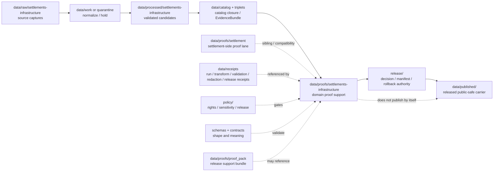

<!-- [KFM_META_BLOCK_V2]
doc_id: kfm://data/proofs/settlements-infrastructure/readme
title: data/proofs/settlements-infrastructure README
type: directory-readme
version: v0.1
status: draft
owners:
  - <data steward — TODO>
  - <proof steward — TODO>
  - <settlements-infrastructure domain steward — TODO>
  - <settlement-side reviewer — TODO>
  - <infrastructure-side reviewer — TODO>
  - <sensitivity reviewer — TODO>
  - <release steward — TODO>
created: 2026-06-25
updated: 2026-06-25
policy_label: restricted-review
path: data/proofs/settlements-infrastructure/README.md
related:
  - ../README.md
  - ../settlement/README.md
  - ../proof_pack/README.md
  - ../evidence_bundle/README.md
  - ../validation_report/README.md
  - ../citation_validation/README.md
  - ../review/README.md
  - ../integrity/README.md
  - ../../receipts/README.md
  - ../../catalog/README.md
  - ../../published/README.md
  - ../../../release/README.md
  - ../../../docs/domains/settlements-infrastructure/ARCHITECTURE.md
  - ../../../docs/domains/settlements-infrastructure/IDENTITY_MODEL.md
  - ../../../docs/domains/settlements-infrastructure/DATA_LIFECYCLE.md
  - ../../../docs/domains/settlements-infrastructure/sublanes/settlements.md
  - ../../../docs/domains/settlements-infrastructure/sublanes/infrastructure.md
  - ../../../docs/doctrine/directory-rules.md
  - ../../../docs/doctrine/lifecycle-law.md
  - ../../../docs/doctrine/trust-membrane.md
  - ../../../contracts/README.md
  - ../../../schemas/README.md
  - ../../../policy/README.md
tags:
  - kfm
  - data
  - proofs
  - settlements-infrastructure
  - settlement
  - infrastructure
  - critical-assets
  - place-identity
  - facilities
  - service-areas
  - operators
  - condition-observations
  - dependencies
  - evidence-bundle
  - source-role
  - geoprivacy
  - redaction
  - release-gate
  - rollback
  - cite-or-abstain
notes:
  - "Directory README for Settlements/Infrastructure proof support. It is not itself a schema, semantic contract, policy bundle, ProofPack, ReleaseManifest, catalog record, or published place/infrastructure layer."
  - "This parent proof lane covers both the settlement-side place/community families and the infrastructure-side asset/network/facility/operator/condition/dependency families."
  - "Critical infrastructure detail, condition/vulnerability data, dependency graphs, living-person joins, exact cultural/archaeology-adjacent locations, and unresolved rights fail closed."
[/KFM_META_BLOCK_V2] -->

<a id="top"></a>

# `data/proofs/settlements-infrastructure/`

> Parent proof lane for **Settlements / Infrastructure**. Files under this directory should support evidence closure, source-role separation, deterministic identity, sensitivity review, redaction/generalization, catalog closure, release review, correction, withdrawal, and rollback for settled-place and infrastructure claims.


> [!IMPORTANT]
> **Status:** `draft`  
> **Owner:** `<data steward>` · `<proof steward>` · `<settlements-infrastructure domain steward>` · `<settlement-side reviewer>` · `<infrastructure-side reviewer>` · `<sensitivity reviewer>` · `<release steward>` — TODO  
> **Path:** `data/proofs/settlements-infrastructure/README.md`  
> **Truth posture:** CONFIRMED doctrine / PROPOSED implementation guidance / NEEDS VERIFICATION for emitted proof objects, schemas, validators, fixtures, CI workflows, source descriptors, release gates, and rollback drills.

> [!WARNING]
> This directory supports review. It does **not** publish a settlement or infrastructure layer, certify municipal/legal status, reveal critical-asset condition or dependency details, authorize emergency/planning decisions, prove property ownership, or expose cultural/archaeology-adjacent locations by file placement.

---

## Quick jumps

| Section | Use it for |
|---|---|
| [1. Purpose](#1-purpose) | What this proof lane is for. |
| [2. Placement and authority](#2-placement-and-authority) | Why this path belongs under `data/proofs/`. |
| [3. What belongs here](#3-what-belongs-here) | Accepted proof families and examples. |
| [4. What must not live here](#4-what-must-not-live-here) | Exclusions and wrong homes. |
| [5. Proof responsibilities](#5-proof-responsibilities) | Domain-specific support obligations. |
| [6. Object families and proof concerns](#6-object-families-and-proof-concerns) | Settlement-side and infrastructure-side proof concerns. |
| [7. Identity, source-role, and temporal gates](#7-identity-source-role-and-temporal-gates) | How to block identity collapse and time confusion. |
| [8. Sensitivity and publication gates](#8-sensitivity-and-publication-gates) | Critical assets, culture, privacy, living-person, and public-safe geometry controls. |
| [9. Naming and identity](#9-naming-and-identity) | Suggested file naming and metadata. |
| [10. Lifecycle relationship](#10-lifecycle-relationship) | How proofs relate to RAW → PUBLISHED and release. |
| [11. Validation checklist](#11-validation-checklist) | Maintainer checklist. |
| [12. Failure modes](#12-failure-modes) | Drift and overclaim patterns to block. |
| [13. Definition of done](#13-definition-of-done) | What is still needed for operational maturity. |

---

## 1. Purpose

`data/proofs/settlements-infrastructure/` stores proof support for the whole Settlements / Infrastructure bounded context.

This parent lane covers two evidence regimes:

1. **Settlement-side place/community identity** — `Settlement`, `Municipality`, `CensusPlace`, `Townsite`, `GhostTown`, `Fort`, `Mission`, and `ReservationCommunity` claims.
2. **Infrastructure-side asset/network evidence** — `Infrastructure Asset`, `Network Node`, `Network Segment`, `Facility`, `Service Area`, `Operator`, `Condition Observation`, and `Dependency` claims.

A proof file here should help answer:

- Which EvidenceBundle supports the place, facility, asset, network, service-area, operator, condition, dependency, or public-safe derivative claim?
- What source role was assigned at admission, and was it preserved through release?
- Are settlement identities, infrastructure asset identities, network graph derivatives, and cross-lane relations kept distinct?
- Are source, observed, valid, retrieval, release, correction, census vintage, legal-status, condition-observation, and dependency-validity times preserved where material?
- Are critical-asset detail, condition/vulnerability, dependency graph, sovereignty, cultural, archaeology, living-person, parcel/ownership, and exact-location sensitivities handled by policy and review?
- Is any public geometry generalized, aggregated, staged, withheld, or denied where required?
- Does the candidate have validation, catalog closure, review support, release support, correction path, withdrawal path, and rollback target?

This directory is not a raw source lane, not a catalog lane, not a release decision lane, not a public API, not an emergency/planning authority, and not an infrastructure disclosure surface.

[Back to top](#top)

---

## 2. Placement and authority

KFM places files by responsibility root. `data/proofs/` is the proof-support area for release-grade evidence support, ProofPacks, catalog closure, citation validation, review proof, and integrity support. The `settlements-infrastructure/` segment is the parent domain lane for proof support across both settlement-side and infrastructure-side object families.

| Surface | Role | Boundary |
|---|---|---|
| [`../README.md`](../README.md) | Parent proof root. | Defines proof-lane expectations. This README narrows them for Settlements / Infrastructure. |
| [`../settlement/`](../settlement/) | Settlement-side proof lane / compatibility lane. | May hold singular settlement/place-identity proof support. This parent lane remains the broader domain lane. |
| [`../proof_pack/`](../proof_pack/) | ProofPack family. | Domain proof files may feed or be referenced by ProofPacks, but this folder is broader than ProofPack instances. |
| [`../evidence_bundle/`](../evidence_bundle/) | EvidenceBundle support. | Settlement/infrastructure proof files may cite EvidenceBundles; they do not replace them. |
| [`../review/`](../review/) | Review proof support. | Sensitive or release-significant proof may cite review proof; it does not replace review. |
| [`../../receipts/`](../../receipts/) | Process memory. | Receipts say what ran; proof files use them as basis, not as proof by themselves. |
| [`../../catalog/`](../../catalog/) | Discovery and interchange. | Catalog records aid discovery; proof files support closure and release review. |
| [`../../published/`](../../published/) | Released public-safe artifacts. | Public layers/API payloads belong downstream, only after release gates. |
| [`../../../release/`](../../../release/) | Release decisions, manifests, rollback cards, correction and withdrawal notices. | Release authority stays in `release/`; this folder supports it. |
| [`../../../docs/domains/settlements-infrastructure/`](../../../docs/domains/settlements-infrastructure/) | Domain doctrine. | Docs explain lane meaning and boundaries; proof files support concrete claims/candidates. |
| [`../../../contracts/`](../../../contracts/) | Semantic meaning. | Object meaning belongs in contracts. |
| [`../../../schemas/`](../../../schemas/) | Machine shape. | Field-level JSON Schema belongs under the accepted schema home. |
| [`../../../policy/`](../../../policy/) | Admissibility. | Proof files record policy outcomes; policy logic lives in policy roots. |

> [!NOTE]
> The related docs include naming tensions around `settlement`, `settlements-infrastructure`, and schema-home forms. This README documents the already-present `data/proofs/settlements-infrastructure/` path as the broad proof lane and does not resolve schema-home conflicts.

[Back to top](#top)

---

## 3. What belongs here

Use this directory for Settlements / Infrastructure proof support objects that are safe to store under repository policy and useful for review, release, correction, rollback, or audit.

| Proof family | Example content | Required posture |
|---|---|---|
| `evidence_closure` | Proof that a settlement/place or infrastructure/asset claim resolves to EvidenceBundle support. | Must preserve source role, temporal scope, identity basis, uncertainty, sensitivity, and release state. |
| `identity_resolution` | Proof that place names, legal entities, census vintages, assets, facilities, operators, service areas, and dependencies were reconciled or intentionally kept separate. | Must not merge legal/statistical/historic/infrastructure identities silently. |
| `temporal_scope` | Proof that legal status, census vintage, founding/abandonment, operation, condition, dependency, release, and correction times remain distinct. | Time is identity-bearing, not decorative. |
| `boundary_or_geometry` | Proof for settlement boundaries, public-safe place geometry, facility footprints, service areas, network nodes/segments, and generalized public geometry. | Public geometry posture and source vintage are mandatory. |
| `condition_observation` | Proof for infrastructure condition, inspection, status, vulnerability, or service condition observations. | Condition/vulnerability details default to restricted/denied unless policy allows. |
| `dependency_graph` | Proof for asset, facility, network, service-area, or operator dependencies. | Dependency graphs are restricted by default and public release requires aggregation/redaction. |
| `cultural_sovereignty_review` | Proof that ReservationCommunity, mission, fort, archaeology-adjacent, sacred, or Indigenous/community-sensitive materials had proper review. | Exact/sensitive geometry fails closed without review. |
| `critical_asset_review` | Proof that critical facility, bridge, dam, levee, water/wastewater, utility, or vulnerability details had sensitivity review. | T4 or restricted until policy and review allow a safe summary. |
| `cross_lane_closure` | Proof that roads/rail, hydrology, hazards, people/land, archaeology, and Frontier Matrix joins preserve ownership. | Neighboring lane truth must not be absorbed by Settlements / Infrastructure. |
| `release_support` | Proof refs for catalog closure, ProofPack, ReviewRecord, ReleaseManifest, correction path, withdrawal path, and rollback target. | Release authority stays in `release/`. |

[Back to top](#top)

---

## 4. What must not live here

| Excluded material | Correct home or action | Why |
|---|---|---|
| Raw source captures, census tables, gazetteer exports, municipal records, infrastructure inventories, inspection records, operator data, facility feeds, GIS payloads, plat scans, historic maps, or source dumps | `data/raw/settlements-infrastructure/`, `data/work/settlements-infrastructure/`, or `data/quarantine/settlements-infrastructure/` according to accepted path policy | Proof files reference source material; they do not store it. |
| Canonical processed settlement or infrastructure objects | `data/processed/settlements-infrastructure/` after validation | Proof lanes are support, not canonical data. |
| Catalog records, STAC/DCAT/PROV, or domain indexes | `data/catalog/...` | Catalog is discovery/interchange, not proof authority. |
| ReleaseManifest, PromotionDecision, RollbackCard, CorrectionNotice, WithdrawalNotice, or release signature | `release/` | Release authority stays separate. |
| Public map layers, PMTiles, GeoParquet, API payloads, reports, or stories | `data/published/...` after release gates | Published artifacts are downstream carriers. |
| Policy logic or release rules | `policy/` | Proof files record policy outcomes, not policy definitions. |
| JSON Schemas | `schemas/contracts/v1/...` | Machine shape belongs in schemas. |
| Semantic contracts | `contracts/...` | Meaning belongs in contracts. |
| Emergency operations, utility operations, evacuation, planning, dispatch, engineering, or vulnerability instructions | Do not publish through KFM; redirect to official authority where appropriate | KFM is evidence/context, not an operational authority. |
| Property ownership, land title, living-person residence, DNA, or person-parcel proof | People / DNA / Land lane | Settlement/infrastructure proof may cite context only and must not publish restricted joins. |
| Exact archaeological, sacred, culturally sensitive, sovereignty-sensitive, critical-infrastructure, condition/vulnerability, or dependency details | Quarantine, restrict, generalize, aggregate, or deny | Public-review proof files must not leak sensitive community/site/asset data. |

[Back to top](#top)

---

## 5. Proof responsibilities

A proof file in this lane should support one or more of these responsibilities:

1. **Evidence closure** — every consequential claim resolves to EvidenceBundle support or records `ABSTAIN`, `DENY`, `HOLD`, or `ERROR`.
2. **Identity discipline** — settlement-side place identities and infrastructure-side asset/network/facility/operator identities remain distinct unless explicit relation proof supports a join.
3. **Source-role separation** — administrative, regulatory, observed, aggregate, modeled, candidate, synthetic, historic, and contextual evidence are not collapsed.
4. **Temporal discipline** — source, observed, valid, retrieval, release, correction, census vintage, legal-status, condition-observation, and dependency-validity times remain distinct where material.
5. **Geometry discipline** — boundaries, footprints, service areas, and network geometries are source-vintaged, uncertainty-aware, and public-safe at release.
6. **Critical-asset control** — condition, vulnerability, exact facility geometry, dependency graphs, and operator-sensitive details fail closed unless reviewed and public-safe.
7. **Cultural/sovereignty control** — ReservationCommunity, mission, fort, sacred/cultural, archaeology-adjacent, and Indigenous/community-sensitive surfaces require review and public-safe geometry posture.
8. **Cross-lane ownership** — this lane cites roads/rail, hydrology, hazards, people/land, archaeology, and Frontier Matrix context without absorbing their truth.
9. **Release support** — proofs connect to policy decisions, validation reports, catalog closure, review records, release candidates, correction paths, withdrawal paths, and rollback targets.

[Back to top](#top)

---

## 6. Object families and proof concerns

### Settlement-side families

| Object family | Proof concern |
|---|---|
| `Settlement` | Umbrella place identity; name variants, source role, temporal scope, geometry uncertainty, and release state. |
| `Municipality` | Legal incorporated entity; charter/status events, jurisdiction key, incorporation/dissolution/annexation intervals, boundary vintage. |
| `CensusPlace` | Statistical identity; census vintage, external authority ID, statistical boundary, non-legal-status warning. |
| `Townsite` | Plat/founding claim; source role, filing/reference evidence, operation uncertainty, relation to later settlement/ghost town. |
| `GhostTown` | Successor relation to prior settlement; depopulation evidence, historical source role, uncertainty and public geometry posture. |
| `Fort` | Military post identity; operating authority, activation/decommissioning epochs, archaeology/cultural sensitivity, public geometry posture. |
| `Mission` | Religious/cultural site identity; operating interval, cultural sensitivity, community/steward review, public geometry posture. |
| `ReservationCommunity` | Community identity with sovereignty sensitivity; naming, geometry precision, authority context, review state, and restricted joins. |

### Infrastructure-side families

| Object family | Proof concern |
|---|---|
| `Infrastructure Asset` | Asset identity, location precision, operator, source role, asset class, sensitivity tier, and public-safe geometry posture. |
| `Network Node` | Network identity distinct from transport nodes; exact node exposure and dependency sensitivity. |
| `Network Segment` | Endpoint identity, network class, service context, dependency exposure, public-safe geometry. |
| `Facility` | Operational complex identity, co-located assets, operator, service mission, critical-asset sensitivity. |
| `Service Area` | Aggregate footprint, operator/system context, aggregation receipt, join-to-individual prevention. |
| `Operator` | Public/private/tribal/operator identity, temporal validity, rights, source role, and operator-sensitive fields. |
| `Condition Observation` | Observed-at time, inspection/status class, measurement digest, vulnerability/condition disclosure posture. |
| `Dependency` | Directed reliance relation, dependency class, temporal validity, cascading-risk sensitivity, restricted graph posture. |

[Back to top](#top)

---

## 7. Identity, source-role, and temporal gates

| Gate | Required proof | Failure outcome |
|---|---|---|
| Settlement vs infrastructure identity | Proof that place/community identity and asset/facility/network identity are not silently merged. | `DENY`, `ABSTAIN`, or require explicit relation proof. |
| Legal vs census vs historic identity | Proof that Municipality, CensusPlace, Townsite, GhostTown, Fort, Mission, and ReservationCommunity identities remain distinct. | `DENY`, `ABSTAIN`, or hold. |
| Asset vs facility vs network | Proof that an asset, facility, network node/segment, service area, operator, condition observation, and dependency are modeled separately. | `DENY` identity collapse or hold. |
| Administrative/regulatory/observed role | Proof that source roles are not inferred from convenience or upgraded by promotion. | `DENY` source-role collapse. |
| Boundary / footprint vintage | Geometry source/vintage and valid time are recorded for any boundary, footprint, service area, or network geometry claim. | `ABSTAIN`, stale badge, or hold. |
| Deterministic identity | Source ID, object role, temporal scope, and normalized digest are present or referenced. | `ERROR` or hold. |
| Condition observation time | Observed-at time and measurement/inspection context are present and not replaced by release time. | `DENY`, hold, or restrict. |
| Dependency validity | Dependency relation has temporal scope, basis evidence, sensitivity posture, and rollback support. | `DENY` public graph release or restrict. |
| Cross-lane context | Neighboring lane support and ownership preserved. | `ABSTAIN` or `DENY` if ownership collapses. |

[Back to top](#top)

---

## 8. Sensitivity and publication gates

| Risk surface | Required support | Default when unresolved |
|---|---|---|
| Critical infrastructure asset, facility, utility, bridge, dam, levee, water/wastewater, or dependency detail | Sensitivity review, policy decision, RedactionReceipt/generalization, review state, rollback target. | `DENY`, restricted release, or generalized summary only. |
| Condition, vulnerability, inspection, dependency, or cascading-risk information | Need-to-publish justification, aggregation/redaction, policy decision, review state. | `DENY` public detail. |
| Operator-sensitive or private-operator data | Rights review, operator/source role, access tier, aggregation/generalization. | `DENY` or restricted release. |
| ReservationCommunity, Indigenous/community naming, or sovereignty-sensitive content | Steward review, source authority, public naming/geometry posture, PolicyDecision, ReviewRecord. | `DENY`, staged access, or restricted release. |
| Archaeology-adjacent townsites, forts, missions, sacred/cultural sites | Archaeology/cultural ownership preserved; generalized geometry and review state. | `DENY` exact exposure. |
| Living-person, residence, migration, ownership, parcel, DNA, or person-place joins | People / DNA / Land lane support, privacy policy, aggregation/generalization, ReviewRecord. | `DENY` or aggregate. |
| Hazard/resilience/exposure relation | Hazards ownership preserved; settlement/infrastructure proof only records relation. | `ABSTAIN` or `DENY` if source role unclear. |
| Public settlement/infrastructure layer | EvidenceBundle, validation, catalog closure, release manifest, rollback target, public-safe geometry. | `HOLD` or `DENY`. |

[Back to top](#top)

---

## 9. Naming and identity

Suggested file pattern:

```text
settlements-infrastructure.<proof_family>.<scope>.<release_or_run_id>.<short_hash>.json
```

Examples:

```text
settlements-infrastructure.evidence_closure.municipality-boundary-demo.v0.1.0123abcd.json
settlements-infrastructure.identity_resolution.facility-operator-demo.v0.1.89ab4567.json
settlements-infrastructure.critical_asset_review.water-utility-public-summary-demo.v0.1.4567cdef.json
settlements-infrastructure.dependency_graph.generalized-service-area-demo.v0.1.cdef0123.json
settlements-infrastructure.cultural_sovereignty_review.reservation-community-public-summary-demo.v0.1.abcd4567.json
```

Minimum proof metadata should include:

- `proof_id`
- `proof_family`
- `domain: settlements-infrastructure`
- `object_group: settlement-side | infrastructure-side | cross-group`
- `object_family`
- `object_id` or `release_candidate_id`
- `source_descriptor_refs`
- `source_roles`
- `evidence_bundle_refs`
- `receipt_refs`
- `validation_report_refs`
- `policy_decision_refs`
- `review_record_refs`
- `catalog_refs`
- `release_refs`
- `rollback_refs`
- `identity_basis`
- `time_scope` with distinct source/observed/valid/retrieval/release/correction times where material
- `sensitivity_posture`
- `public_geometry_posture`
- `outcome`
- `reasons`

[Back to top](#top)

---

## 10. Lifecycle relationship



Proof files support review and release. They do not publish, certify legal status, establish property ownership, disclose infrastructure condition/vulnerability, or expose restricted community/site/asset geometry by placement.

[Back to top](#top)

---

## 11. Validation checklist

Before a Settlements / Infrastructure proof supports release review, verify:

- [ ] The proof identifies the object group, object family, object/release scope, source family, spatial scope, temporal scope, and intended public surface.
- [ ] Every consequential claim resolves to EvidenceBundle support or records `ABSTAIN`, `DENY`, `HOLD`, or `ERROR`.
- [ ] SourceDescriptor refs include source role, rights, sensitivity, citation, cadence/vintage, retrieval time, and digest where applicable.
- [ ] Settlement-side and infrastructure-side identities are not silently merged.
- [ ] Source ID, object role, temporal scope, and normalized digest are present or referenced for identity-bearing claims.
- [ ] Administrative, regulatory, observed, aggregate, modeled, candidate, synthetic, map, historic, operator, and legal source roles remain distinct.
- [ ] Boundary, footprint, service-area, and network geometry have source vintage, uncertainty, valid time, public geometry posture, and release state.
- [ ] Legal status, census vintage, founding, operation, abandonment, condition observation, dependency validity, and correction times remain distinct where material.
- [ ] ReservationCommunity, fort, mission, archaeology-adjacent, cultural, sacred, and sovereignty-sensitive contexts have review state and public-safe geometry posture.
- [ ] Critical infrastructure, condition, vulnerability, operator-sensitive, service-area, and dependency details are denied, restricted, aggregated, or generalized according to policy.
- [ ] Living-person, DNA, residence, ownership, parcel, and person-place joins are denied, aggregated, or routed to People / DNA / Land proof and policy.
- [ ] Cross-lane joins preserve roads/rail, hydrology, hazards, archaeology, people/land, and Frontier Matrix ownership.
- [ ] Release refs point to `release/`; published artifact refs point to `data/published/`; raw/work/quarantine data is not exposed.
- [ ] Rollback, correction, withdrawal, and invalidation targets are traceable.

[Back to top](#top)

---

## 12. Failure modes

| Failure mode | Why it matters | Required response |
|---|---|---|
| Settlement and infrastructure identities merged for convenience | Place identity and asset/facility/network identity have different authority and sensitivity regimes. | Split identities or create explicit relation proof. |
| Critical asset detail appears in a public-review proof | Proof artifact becomes an exposure channel. | Quarantine, redact, generalize, restrict, or deny. |
| Condition/vulnerability or dependency graph treated as public by default | Infrastructure side carries strict deny-by-default posture. | Hold until policy, review, and public-safe transform exist. |
| Municipality and CensusPlace merged because names match | Legal and statistical identities are different evidence objects. | Split identities or create explicit relation proof. |
| Administrative compilation cited as observation | Source-role collapse misleads users. | Deny or relabel as administrative/context evidence. |
| ReservationCommunity geometry/naming released without review | Sovereignty and community sensitivity risk. | Deny, generalize, restrict, or require steward review. |
| Archaeology-adjacent fort/mission/townsite exact geometry exposed | Sensitive cultural/site location leak. | Quarantine and generalize or deny. |
| Proof includes private person-place, parcel, ownership, or living-person joins | Violates People / DNA / Land trust boundary. | Deny, aggregate, or route to proper lane. |
| Proof file acts as ReleaseManifest | Collapses proof support with release authority. | Move authority to `release/`; keep reference here. |
| AI settlement/infrastructure story replaces evidence | Generated language becomes root truth. | Deny; require EvidenceBundle and citation validation. |

[Back to top](#top)

---

## 13. Definition of done

This proof lane is operationally useful when:

- [ ] The relationship between `data/proofs/settlement/` and `data/proofs/settlements-infrastructure/` is confirmed as an accepted compatibility/path convention or resolved by ADR/migration note.
- [ ] Settlements / Infrastructure proof schemas and semantic contracts exist under approved homes or the schema-home naming conflict is resolved.
- [ ] Valid and invalid fixtures cover identity collapse, administrative-as-observation, boundary vintage omission, critical-asset leakage, condition/vulnerability exposure, dependency graph release, sovereignty-sensitive exposure, archaeology-adjacent geometry leak, people/land privacy joins, and missing rollback support.
- [ ] CI or validators block public release when EvidenceBundle, PolicyDecision, ReviewRecord, catalog closure, public-safe geometry, or rollback target is missing.
- [ ] Source descriptors exist for active settlement and infrastructure source families and record rights, cadence, role, citation, sensitivity, and freshness/staleness posture.
- [ ] Release docs cross-link proof requirements for settlement layers, municipality/census boundaries, historic place claims, public infrastructure summaries, service-area layers, condition summaries, and generalized dependency outputs.
- [ ] CODEOWNERS or equivalent review ownership covers data steward, settlements-infrastructure steward, settlement-side reviewer, infrastructure-side reviewer, sensitivity reviewer, proof steward, and release steward.
- [ ] At least one synthetic no-network release candidate demonstrates: source capture → processed candidate → EvidenceBundle → settlements-infrastructure proof → ProofPack → ReleaseManifest → public-safe artifact → rollback.

---

## Maintainer note

Settlements / Infrastructure proof work is deceptively risky: town names feel public, but the same lane also touches critical infrastructure, dependencies, operators, sensitive community contexts, and private joins. Keep identity, source role, time, sensitivity, evidence, review state, public geometry, release state, and rollback separate until proof and policy say otherwise. When in doubt, hold, abstain, deny, restrict, generalize, or quarantine instead of publishing a confident dot, polygon, or network on the map.
