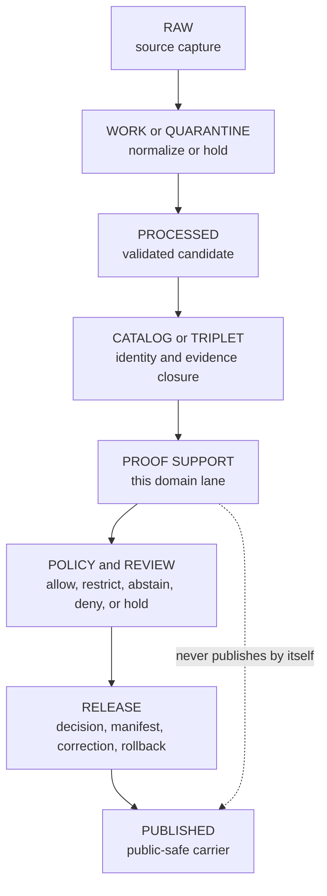

<!-- [KFM_META_BLOCK_V2]
doc_id: kfm://data/proofs/settlements-infrastructure/readme
title: data/proofs/settlements-infrastructure/README.md — Settlements / Infrastructure Proof Support
type: directory-readme; nested-domain-proof-lane; restricted-release-support-boundary
version: v0.2.0
status: repository-grounded draft; executable proof validation, proof production, and release dry-run remain held
owners:
  - "@bartytime4life — verified CODEOWNERS routing for /data/proofs/; routing is not accountable review or approval"
  - "NEEDS VERIFICATION — Settlements / Infrastructure domain, settlement-side, and infrastructure-side steward assignments"
  - "NEEDS VERIFICATION — evidence, proof, validation, catalog, rights, sensitivity, cultural, sovereignty, and security reviewers"
  - "NEEDS VERIFICATION — policy, release, correction, rollback, governed-API, governed-AI, and documentation steward assignments"
created: 2026-06-25
updated: 2026-07-26
prepared_under_prompt: KFM Markdown Modernization & GitHub Documentation Implementation Agent v4.0.0
policy_label: restricted-review; proof-support; settlements-infrastructure; cite-or-abstain; critical-infrastructure-aware; no-operational-authority; no-direct-public-path; release-gated
path: data/proofs/settlements-infrastructure/README.md
truth_posture: >
  CONFIRMED exact target path and prior blob, Directory Rules v1.4 proof placement,
  canonical data/proofs parent contract, current domain architecture and path-variance
  guidance, working contract lane, proposed schema and policy scaffolds, two
  NotImplementedError domain validators, greenfield fixture stub, domain test guidance,
  read-only CODEOWNERS routing, and explicit validation, proof-production, and
  release-dry-run workflow holds / PROPOSED proof packet, identity, source-role,
  temporal, sensitivity, correction, invalidation, and public-safe representation
  requirements / CONFLICTED settlement versus settlements-infrastructure and
  domains-versus-flat contract/schema topology / UNKNOWN recursive proof payload
  inventory, active writers and consumers, external or restricted stores, accepted
  release inventory, governed public routes, caches, hosting, and runtime behavior /
  NEEDS VERIFICATION for emitted proof objects, accountable owners, accepted proof
  contract and schema, executable validators and fixtures, policy enforcement,
  independent review, release instances, correction propagation, and rollback drills
evidence_snapshot:
  repository: bartytime4life/Kansas-Frontier-Matrix
  base_ref: main
  base_commit: 6a3f05adcddad59b73a8f9a976a895976f457769
  prior_blob: 467e43b0ce3aba0c59788e1076bd088c1cd8a06a
  directory_rules_blob: 2affb080e6f0043867c64c7f06c1ca52030fbd55
  proofs_root_blob: 0d8b6e92d3b4b9ff3961d29c53ead497922a31cf
  codeowners_blob: dd2a84aa514d8ecd9208bc347f90f9a2ed37dd61
  architecture_blob: c8fd2b4ee3d02cc02d868355f0d119f966156bb0
  canonical_paths_blob: a388ccbf2802fc4f705ec470aee3bddfe39dfd37
  contract_lane_blob: e5dd0c110fcd751437873b5d7eaeb0403161a6d7
  schema_lane_blob: 5b8d78c55ca6872e54e5ad99ed418427313a62e9
  evidence_bundle_schema_blob: cf5256831b63dca46a5f68b168441adcf68b8751
  policy_lane_blob: c3e612e83864954859ff419e2638288b292cd6c4
  tests_lane_blob: 08cd09f1700ca02fae7a35c55a1c22684c996448
  fixtures_lane_blob: 7c72dba10228decae24e9b46561e1370fa6a6cec
  evidence_validator_blob: eaa98287492c3549e817f47206840f81e9f12901
  schema_validator_blob: 6a2d445855f62615513171d264173a5920fa9dcc
  workflow_blob: c43d5bca79ee6b4d3b6177d0985e917825953b2e
  source_registry_blob: 913d694acbe8fbd1660790c9b4c8c614a9cdd627
  candidate_lane_blob: 3594fb43ab481d39697deb41790d484f9782fec2
  published_lane_blob: 27507202e391d742351163a174deb1b3ec6585e9
related:
  - ../README.md
  - ../settlement/README.md
  - ../evidence_bundle/README.md
  - ../proof_pack/README.md
  - ../validation_report/README.md
  - ../citation_validation/README.md
  - ../review/README.md
  - ../../receipts/README.md
  - ../../registry/sources/settlements-infrastructure/README.md
  - ../../published/settlements-infrastructure/README.md
  - ../../../release/candidates/settlements-infrastructure/README.md
  - ../../../docs/domains/settlements-infrastructure/ARCHITECTURE.md
  - ../../../docs/domains/settlements-infrastructure/CANONICAL_PATHS.md
  - ../../../docs/domains/settlements-infrastructure/IDENTITY_MODEL.md
  - ../../../docs/domains/settlements-infrastructure/DATA_LIFECYCLE.md
  - ../../../docs/doctrine/directory-rules.md
  - ../../../docs/doctrine/lifecycle-law.md
  - ../../../contracts/domains/settlements-infrastructure/README.md
  - ../../../schemas/contracts/v1/domains/settlements-infrastructure/README.md
  - ../../../policy/domains/settlements-infrastructure/README.md
  - ../../../tests/domains/settlements-infrastructure/README.md
  - ../../../fixtures/domains/settlements-infrastructure/README.md
  - ../../../tools/validators/domains/settlements-infrastructure/README.md
notes:
  - "Same-path Markdown modernization only; no source bytes, proof payloads, contracts, schemas, policies, validators, fixtures, workflows, candidates, releases, routes, hosting, or publication state changed."
  - "The domain workflow requires the literal phrase 'NEEDS VERIFICATION for emitted proof objects'; this revision preserves that compatibility token."
  - "A dynamic workflow badge is intentionally omitted because successful jobs currently include explicit validation, proof-production, and release-dry-run holds."
  - "No sensitivity tier is declared as current policy here; the stricter fail-closed posture remains until an accepted policy profile and review support a bounded public-safe derivative."
[/KFM_META_BLOCK_V2] -->

<a id="top"></a>

# `data/proofs/settlements-infrastructure/` — Settlements / Infrastructure Proof Support

> **One-line purpose.** Hold or index governed proof support for settled-place and infrastructure claims while keeping identity, source role, time, uncertainty, rights, sensitivity, review, release dependency, correction, and rollback inspectable.

[](#authority-level)
[](#status)
[](../../../.github/workflows/domain-settlements-infrastructure.yml)
[](#sensitivity-and-public-safe-representation)
[](#lifecycle-and-governed-handoff)

> [!IMPORTANT]
> Proof support is necessary but not sufficient for release. A path, proof-shaped file, green held check, commit, pull request, merge, map, graph, story, or AI response does not create truth, policy permission, release approval, or KFM publication.

> [!CAUTION]
> This is an ordinary public-repository lane. Do not commit exact critical-asset or facility geometry, condition or vulnerability detail, dependency topology, operator-sensitive information, restricted cultural or sovereignty context, archaeology-adjacent locations, living-person or private-property joins, credentials, access clues, or reconstructive derivatives.

**Path:** `data/proofs/settlements-infrastructure/README.md`  
**Owning responsibility:** `data/proofs/`  
**Domain lane:** `settlements-infrastructure`  
**Current implementation posture:** documentation-rich, proof-production-held, release-gated, and enforcement-incomplete

**Quick navigation:** [Purpose](#purpose) · [Authority](#authority-level) · [Status](#status) · [Belongs](#what-belongs-here) · [Exclusions](#what-does-not-belong-here) · [Inputs](#inputs) · [Outputs](#outputs) · [Validation](#validation) · [Review](#review-burden) · [Related](#related-folders) · [ADRs](#adrs) · [Last reviewed](#last-reviewed) · [Evidence](#repository-evidence-ledger) · [Proof packet](#settlements-infrastructure-proof-packet) · [Objects](#object-families-and-proof-concerns) · [Identity and time](#identity-source-role-and-temporal-gates) · [Sensitivity](#sensitivity-and-public-safe-representation) · [Lifecycle](#lifecycle-and-governed-handoff) · [Automation](#workflow-and-automation-posture) · [Correction](#correction-withdrawal-invalidation-and-rollback) · [Failures](#failure-modes) · [Verification](#open-verification-register) · [No-loss](#no-loss-ledger)

---

<a id="1-purpose"></a>

## Purpose

`data/proofs/settlements-infrastructure/` is the parent domain proof-support lane for two related but distinct evidence regimes:

1. **Settlement-side place and community identity** — `Settlement`, `Municipality`, `CensusPlace`, `Townsite`, `GhostTown`, `Fort`, `Mission`, and `ReservationCommunity`.
2. **Infrastructure-side asset and network evidence** — `InfrastructureAsset`, `NetworkNode`, `NetworkSegment`, `Facility`, `ServiceArea`, `Operator`, `ConditionObservation`, and `Dependency`.

A proof packet or index in this lane should make these questions answerable:

1. Which `EvidenceBundle` supports the bounded claim, relation, candidate, or public-safe derivative?
2. Which source role was assigned at admission, and was it preserved rather than upgraded by normalization, mapping, graph projection, promotion, or generated language?
3. Are settlement identities, legal entities, statistical geographies, historic places, assets, facilities, networks, operators, observations, and dependencies kept distinct?
4. Are source, observed, valid, retrieval, census-vintage, legal-status, operation, condition-observation, dependency-validity, release, and correction times separated where material?
5. Which rights, critical-infrastructure, cultural, sovereignty, archaeology, living-person, private-property, or harmful-precision controls apply?
6. Which validation reports, receipts, policy decisions, review records, catalog records, release dependencies, corrections, withdrawals, invalidations, and rollback targets remain outside the proof packet?
7. Which finite outcome is justified when support is missing, stale, conflicted, restricted, or unsafe?

This directory is not a raw source lane, canonical domain store, catalog, release-decision lane, public API, emergency or planning authority, or infrastructure-disclosure surface.

[Back to top](#top)

---

<a id="2-placement-and-authority"></a>

## Authority level

**Implementation-bearing nested domain proof-support lane under the canonical `data/proofs/` responsibility.**

[Directory Rules §§4, 9, and 12](../../../docs/doctrine/directory-rules.md) support this placement: `data/` owns lifecycle and emitted trust-support material, `proofs/` owns proof families, and `settlements-infrastructure/` is a domain segment. The path creates no new root, lifecycle phase, release authority, or parallel proof home.

This README may define directory use and review expectations. It does not own:

- semantic meaning, which belongs under [`contracts/`](../../../contracts/README.md);
- machine shape, which belongs under [`schemas/`](../../../schemas/README.md);
- admissibility, which belongs under [`policy/`](../../../policy/README.md);
- process memory, which belongs under [`data/receipts/`](../../receipts/README.md);
- discovery or interchange, which belongs under `data/catalog/`;
- release decisions, correction notices, withdrawal notices, and rollback cards, which belong under [`release/`](../../../release/README.md); or
- released public-safe carriers, which belong under [`data/published/`](../../published/README.md).

The repository also contains [`data/proofs/settlement/`](../settlement/README.md). Current domain path guidance records `settlement` versus `settlements-infrastructure` and flat-versus-`domains/` topology as unresolved variance. This README keeps the broad compound-domain lane at its existing path and does not resolve that conflict by assertion.

[Back to top](#top)

---

## Status

| Surface | Current evidence | What it does not prove |
|---|---|---|
| Target and parent proof lane | **CONFIRMED** at this path and [`data/proofs/README.md`](../README.md) | Proof payloads, producers, consumers, or release use |
| Domain contract lane | **CONFIRMED working lane** with documented slug conflict | Accepted object contracts or runtime adoption |
| Domain schema lane | **CONFIRMED `PROPOSED (greenfield scaffold)` README** | Accepted field shapes or executable validation |
| EvidenceBundle schema | **CONFIRMED proposed schema** with required evidence, citation, rights, sensitivity, and checksum fields | Accepted domain proof profile or complete closure resolver |
| Domain policy lane | **CONFIRMED `PROPOSED (greenfield scaffold)` README** | Active evaluator, accepted policy bundle, or public-safe decision |
| Domain validators | **CONFIRMED two placeholders** whose `main()` raises `NotImplementedError` | Semantic validation |
| Domain fixtures | **CONFIRMED greenfield README stub** | Representative valid, invalid, denied, held, or public-safe fixtures |
| Domain tests | **CONFIRMED guidance/index README** | Executable domain coverage or passing behavior |
| Domain workflow | **CONFIRMED read-only static-readiness checks plus explicit holds** | EvidenceBundle closure, proof production, release readiness, or publication |
| Proof objects, writers, consumers, and external stores | **UNKNOWN from the bounded inspection** | Absence, acceptance, access control, or operational use |

The exact maturity statement **NEEDS VERIFICATION for emitted proof objects** remains in this README because the current domain workflow checks for that phrase before recording its proof-production hold.

**Held-check boundary.** A green held job means the declared readiness boundary was observed. It is not an EvidenceBundle, ProofPack, legal-status finding, facility-condition finding, dependency-disclosure approval, policy decision, release decision, or publication authority.

[Back to top](#top)

---

<a id="3-what-belongs-here"></a>

## What belongs here

Only repository-safe proof support useful for review, release evaluation, correction, rollback, or audit belongs here.

| Proof family | Supported question | Required posture |
|---|---|---|
| Evidence closure | Does each consequential claim resolve to an EvidenceBundle? | Preserve citations, rights, sensitivity, transforms, checksums, and uncertainty. |
| Identity resolution | Were place, legal, statistical, historic, asset, facility, operator, service-area, and dependency identities reconciled or deliberately kept separate? | Never merge by name or geometry alone. |
| Source-role closure | Did administrative, regulatory, observed, aggregate, modeled, candidate, synthetic, historic, and contextual roles remain distinct? | Promotion does not upgrade source authority. |
| Temporal closure | Are legal status, census vintage, operation, condition, dependency, release, and correction times explicit? | Time is identity-bearing, not decorative. |
| Boundary and geometry support | What evidence supports a boundary, footprint, service area, network segment, or generalized public geometry? | Record vintage, uncertainty, sensitivity, and public-geometry posture. |
| Condition-observation support | What supports a bounded condition, inspection, status, or service observation? | Exact condition or vulnerability detail defaults to restricted or denied. |
| Dependency support | What supports a directed asset, facility, network, operator, or service dependency? | Restricted by default; public derivatives require aggregation or redaction evidence. |
| Cultural and sovereignty review | Were ReservationCommunity, mission, fort, sacred, cultural, archaeology-adjacent, or community-sensitive claims reviewed? | Preserve cultural ownership and public-safe geometry posture. |
| Critical-asset review | Were facility, bridge, dam, levee, utility, water or wastewater, operator, condition, or dependency details assessed? | Do not declare a tier here; fail closed until accepted policy and review support a bounded derivative. |
| Cross-lane closure | Are Roads/Rail, Hydrology, Hazards, Archaeology, People/Land, and Frontier Matrix ownership boundaries preserved? | Cite the owning lane; do not absorb its truth. |
| Release-support closure | Are validation, policy, review, catalog, release, correction, withdrawal, invalidation, and rollback dependencies explicit? | Release authority stays under `release/`. |

Proof support may reference stable object IDs, source descriptors, EvidenceRefs, EvidenceBundles, validation reports, receipts, review records, policy decisions, catalog records, release candidates, correction notices, withdrawal notices, and rollback targets. Those referenced objects retain their own authority and lifecycle.

[Back to top](#top)

---

<a id="4-what-must-not-live-here"></a>

## What does NOT belong here

| Excluded material | Correct home or response | Why |
|---|---|---|
| Raw source captures, census tables, gazetteer exports, municipal records, infrastructure inventories, inspections, operator data, facility feeds, GIS payloads, plats, or historic maps | `data/raw/`, `data/work/`, or `data/quarantine/` under the accepted domain path | Proof support references source material; it does not store source payloads. |
| Canonical processed settlement or infrastructure objects | `data/processed/settlements-infrastructure/` after validation | Proof support is not canonical domain truth. |
| STAC, DCAT, PROV, catalog records, or domain indexes | `data/catalog/` | Catalog metadata is discovery or interchange, not proof or release authority. |
| Process, transform, validation, generalization, redaction, AI, or release receipts | [`data/receipts/`](../../receipts/README.md) | Receipts record what ran; they do not replace proof closure. |
| ReleaseManifest, PromotionDecision, RollbackCard, CorrectionNotice, WithdrawalNotice, or signature | [`release/`](../../../release/README.md) | Release authority remains separate. |
| Public layers, PMTiles, GeoParquet, API payloads, reports, stories, or public indexes | [`data/published/`](../../published/README.md), after release gates | Published artifacts are downstream carriers. |
| Policy logic or release rules | [`policy/`](../../../policy/README.md) | Proof support records or references policy outcomes; policy decides admissibility. |
| JSON Schema | [`schemas/`](../../../schemas/README.md) | Machine-checkable shape belongs under the schema root. |
| Semantic contract | [`contracts/`](../../../contracts/README.md) | Object meaning belongs under the contract root. |
| Emergency operations, dispatch, evacuation, utility operation, engineering, vulnerability, access, or safety instructions | Do not publish through KFM; direct readers to the proper official authority | KFM provides governed evidence context, not operational authority. |
| Property title, ownership, living-person residence, DNA, or person-parcel proof | People / DNA / Land lane and applicable policy | This lane may cite bounded context but must not expose restricted joins. |
| Exact archaeology, sacred, culturally sensitive, sovereignty-sensitive, critical-infrastructure, condition, vulnerability, dependency, or access detail | Quarantine, restrict, generalize, aggregate, delay, abstain, or deny | A public repository must not become an exposure channel. |

[Back to top](#top)

---

## Inputs

A reviewable proof packet may reference, but must not absorb:

- the bounded claim, relation, object, graph snapshot, derivative, or release-candidate identity;
- `SourceDescriptor` identifiers, source roles, retrieval records, rights, citation, cadence, and freshness state;
- `EvidenceRef` values resolved to `EvidenceBundle` support;
- domain contract and schema versions or immutable digests;
- validation reports and transform, generalization, redaction, aggregation, citation, and review receipts;
- policy decisions, access class, sensitivity posture, reviewer conditions, expiry, and obligations;
- catalog or triplet closure references where applicable;
- release-candidate, correction, withdrawal, invalidation, and rollback references; and
- public-geometry or public-field allowlists when a bounded derivative is under review.

Unresolved evidence, rights, sensitivity, ownership, precision, identity, time, or release state is an input to a negative outcome, not permission to omit the field.

[Back to top](#top)

---

## Outputs

Permitted outputs are repository-safe proof-support records or indexes under an accepted profile, including:

- evidence-closure and identity-resolution support;
- source-role, temporal, geometry, and sensitivity closure summaries;
- validation and review support that references independently addressable records;
- release-candidate evaluation support;
- correction, withdrawal, invalidation, and rollback support; and
- explicit finite outcomes and reason codes.

An output must not claim more than its evidence. Depending on the applicable contract, incomplete or unsafe support should yield `ABSTAIN`, `DENY`, `HOLD`, `ERROR`, quarantine, restriction, or another defined negative state. Do not invent a universal outcome enum when the relevant contract has not been accepted.

No output in this directory is public merely because the repository is public or a file is reviewable.

[Back to top](#top)

---

<a id="11-validation-checklist"></a>

## Validation

No accepted end-to-end Settlements / Infrastructure proof validator or producer was verified. Current implementation evidence is deliberately bounded:

- [`validate_evidence_bundle.py`](../../../tools/validators/domains/settlements-infrastructure/validate_evidence_bundle.py) and [`validate_schema.py`](../../../tools/validators/domains/settlements-infrastructure/validate_schema.py) raise `NotImplementedError`;
- the [domain fixture lane](../../../fixtures/domains/settlements-infrastructure/README.md) remains a greenfield stub;
- the [domain test README](../../../tests/domains/settlements-infrastructure/README.md) describes intended deterministic, synthetic, no-network coverage but does not prove executable coverage; and
- the [domain workflow](../../../.github/workflows/domain-settlements-infrastructure.yml) performs bounded static readiness checks and records explicit validation, proof-production, and release-dry-run holds.

Before a future proof packet supports release review, verify at least:

- [ ] The proof identifies proof family, object group, object or release scope, source family, spatial scope, temporal scope, and intended public surface.
- [ ] Every consequential claim resolves to an EvidenceBundle or records a contract-defined negative outcome.
- [ ] SourceDescriptor references carry source role, rights, sensitivity, citation, cadence or vintage, retrieval time, and digest where applicable.
- [ ] Settlement-side and infrastructure-side identities are not silently merged.
- [ ] Municipality, CensusPlace, Townsite, GhostTown, Fort, Mission, and ReservationCommunity identities remain distinct.
- [ ] Asset, facility, network node or segment, service area, operator, condition observation, and dependency identities remain distinct.
- [ ] Source, observed, valid, retrieval, release, correction, census-vintage, legal-status, operation, condition, and dependency times remain distinct where material.
- [ ] Boundary, footprint, service-area, and network geometry has source vintage, uncertainty, valid time, sensitivity, public-geometry posture, and release state.
- [ ] Critical-infrastructure, condition, vulnerability, operator-sensitive, service-area, and dependency details are denied, restricted, aggregated, or generalized under accepted policy.
- [ ] Cultural, sacred, sovereignty, Indigenous/community, and archaeology-adjacent contexts have appropriate review and public-safe representation.
- [ ] Living-person, DNA, residence, ownership, parcel, and person-place joins are denied, aggregated, or routed to the owning lane.
- [ ] Cross-lane joins preserve Roads/Rail, Hydrology, Hazards, Archaeology, People/Land, and Frontier Matrix ownership.
- [ ] Validation, receipt, policy, review, catalog, release, correction, withdrawal, invalidation, and rollback closure is traceable.
- [ ] Public clients receive only released, public-safe carriers through governed interfaces.
- [ ] Tests use deterministic, synthetic, no-network, public-safe fixtures and exercise positive and fail-closed cases.

Passing shape or readiness checks cannot prove a place claim, legal status, infrastructure condition, dependency, public safety, policy approval, evidence closure, release, or publication.

[Back to top](#top)

---

## Review burden

The current [CODEOWNERS file](../../../.github/CODEOWNERS) routes `data/proofs/` changes to `@bartytime4life`. Routing is not an accountable `ReviewRecord`, policy decision, release approval, or proof that independent review occurred.

Review should cover the responsibilities implicated by the change:

- Settlements / Infrastructure domain and the affected settlement-side or infrastructure-side object family;
- evidence, proof, source role, identity, time, validation, and catalog closure;
- rights, security, critical infrastructure, cultural, sovereignty, archaeology, privacy, and harmful precision;
- policy, public-safe transformation, governed API, and governed AI behavior;
- release, correction, withdrawal, invalidation, and rollback; and
- documentation accuracy and stable-link preservation.

High-risk, public-surface, behavioral, policy-significant, or authority-changing changes require independent review appropriate to their significance. Unverified role labels are requirements to assign, not executable GitHub identities.

[Back to top](#top)

---

## Related folders

- **Parent proof responsibility:** [`data/proofs/`](../README.md)
- **Sibling or compatibility lane:** [`data/proofs/settlement/`](../settlement/README.md)
- **Shared proof families:** [`evidence_bundle/`](../evidence_bundle/README.md) · [`proof_pack/`](../proof_pack/README.md) · [`validation_report/`](../validation_report/README.md) · [`citation_validation/`](../citation_validation/README.md) · [`review/`](../review/README.md)
- **Process memory:** [`data/receipts/`](../../receipts/README.md)
- **Source registry:** [`data/registry/sources/settlements-infrastructure/`](../../registry/sources/settlements-infrastructure/README.md)
- **Published carriers:** [`data/published/settlements-infrastructure/`](../../published/settlements-infrastructure/README.md)
- **Candidate review:** [`release/candidates/settlements-infrastructure/`](../../../release/candidates/settlements-infrastructure/README.md)
- **Domain doctrine:** [`ARCHITECTURE.md`](../../../docs/domains/settlements-infrastructure/ARCHITECTURE.md) · [`CANONICAL_PATHS.md`](../../../docs/domains/settlements-infrastructure/CANONICAL_PATHS.md) · [`IDENTITY_MODEL.md`](../../../docs/domains/settlements-infrastructure/IDENTITY_MODEL.md) · [`DATA_LIFECYCLE.md`](../../../docs/domains/settlements-infrastructure/DATA_LIFECYCLE.md)
- **Meaning, shape, and policy:** [`contracts/domains/settlements-infrastructure/`](../../../contracts/domains/settlements-infrastructure/README.md) · [`schemas/contracts/v1/domains/settlements-infrastructure/`](../../../schemas/contracts/v1/domains/settlements-infrastructure/README.md) · [`policy/domains/settlements-infrastructure/`](../../../policy/domains/settlements-infrastructure/README.md)
- **Enforcement scaffolds:** [`tests/domains/settlements-infrastructure/`](../../../tests/domains/settlements-infrastructure/README.md) · [`fixtures/domains/settlements-infrastructure/`](../../../fixtures/domains/settlements-infrastructure/README.md) · [`tools/validators/domains/settlements-infrastructure/`](../../../tools/validators/domains/settlements-infrastructure/README.md)

[Back to top](#top)

---

## ADRs

- [ADR-0010 — Deny-by-Default for DNA, Rare Species, Archaeology, and Critical Infrastructure](../../../docs/adr/ADR-0010-deny-by-default-for-dna-rare-species-archaeology-infrastructure.md) is currently `draft` with effective decision status `proposed`. This README preserves the stricter fail-closed posture without claiming the ADR is accepted or enforced.
- [ADR-0011 — Receipts vs Proofs vs Manifests vs Catalog Separation](../../../docs/adr/ADR-0011-receipts-vs-proofs-vs-manifests-vs-catalog-separation.md) is currently `proposed`. This README follows that separation as repository and Directory Rules guidance without treating the ADR as accepted.
- No accepted target-specific proof-profile ADR or accepted resolution of `settlement` versus `settlements-infrastructure` was verified in the bounded review.

An accepted ADR or migration note is required before this README may resolve an authority-home conflict, establish a new proof family home, or promote a compatibility path to canonical.

[Back to top](#top)

---

## Last reviewed

- **Review date:** 2026-07-26
- **Evidence base:** `main@6a3f05adcddad59b73a8f9a976a895976f457769`
- **Review type:** complete target read; current Directory Rules; parent proof contract; bounded domain doctrine, contract, schema, validator, test, fixture, policy, workflow, source-registry, candidate, published-lane, ADR, and CODEOWNERS evidence
- **Owners, accepted proof profile, enforcement, independent review, release instances, public serving, and rollback drills:** need verification

Re-review on proof-profile, topology, writer, schema, validator, fixture, policy, workflow, release, public-consumer, correction, withdrawal, invalidation, or rollback changes—or within six months.

[Back to top](#top)

---

## Repository evidence ledger

| Evidence | What it supports | Limit |
|---|---|---|
| Prior [`README.md`](./README.md) blob `467e43b0…` | Stable path, doc ID, broad domain scope, object families, proof concerns, lifecycle, sensitivity, and rollback expectations | Did not reconcile claims with current scaffolds or workflow holds |
| [`data/proofs/README.md`](../README.md) | Canonical proof-support responsibility and anti-collapse boundary | Does not establish domain proof payloads or enforcement |
| [`Directory Rules`](../../../docs/doctrine/directory-rules.md) | `data/proofs/` placement and domain-lane law | Does not prove current payloads, writers, or release state |
| [`ARCHITECTURE.md`](../../../docs/domains/settlements-infrastructure/ARCHITECTURE.md) and [`CANONICAL_PATHS.md`](../../../docs/domains/settlements-infrastructure/CANONICAL_PATHS.md) | Domain vocabulary, risk surfaces, and recorded path variance | Draft doctrine and proposed implementation do not prove runtime |
| [Contract lane](../../../contracts/domains/settlements-infrastructure/README.md) | Working semantic lane and object-family vocabulary | Slug topology and acceptance remain conflicted or unverified |
| [Schema lane](../../../schemas/contracts/v1/domains/settlements-infrastructure/README.md) | Current domain schema-home scaffold | No accepted domain proof schema or executable validator |
| [`evidence_bundle.schema.json`](../../../schemas/contracts/v1/evidence/evidence_bundle.schema.json) | Proposed shared EvidenceBundle shape | Proposed status; does not prove complete domain closure |
| [Policy lane](../../../policy/domains/settlements-infrastructure/README.md) | Current domain policy scaffold | No accepted evaluator or active policy bundle |
| [Validator files](../../../tools/validators/domains/settlements-infrastructure/README.md) | Validator paths and intended responsibilities | Two inspected executables are `NotImplementedError` placeholders |
| [Tests](../../../tests/domains/settlements-infrastructure/README.md) and [fixtures](../../../fixtures/domains/settlements-infrastructure/README.md) | Intended no-network test posture and current fixture-lane presence | Executable coverage and representative fixtures are not established |
| [Domain workflow](../../../.github/workflows/domain-settlements-infrastructure.yml) | Read-only readiness checks and explicit holds | A green hold is not proof, release readiness, or publication |
| [Source registry](../../registry/sources/settlements-infrastructure/README.md) | Source-role, rights, freshness, and sensitivity guidance | Does not establish accepted descriptors or active sources |
| [Candidate lane](../../../release/candidates/settlements-infrastructure/README.md) | Candidate-is-not-release boundary | Does not establish candidate or release instances |
| [Published lane](../../published/settlements-infrastructure/README.md) | Public-safe carrier boundary | Does not establish approved artifacts or public routes |

[Back to top](#top)

---

<a id="5-proof-responsibilities"></a>

## Settlements / Infrastructure proof packet

An accepted proof profile should answer each dimension without collapsing authority:

| Dimension | Required closure |
|---|---|
| Scope and identity | Proof family, object group, object family, stable object or relation ID, release-candidate ID, spatial scope, temporal scope, and normalized digest |
| Source support | SourceDescriptor refs, fixed source roles, retrieval refs, rights, citations, vintage, cadence, freshness, and source limitations |
| Evidence | EvidenceRefs resolved to EvidenceBundles, checksums, uncertainty, conflicts, and cite-or-abstain outcome |
| Validation | Schema or contract versions, validation reports, validator identity, deterministic fixture basis, and finite result |
| Sensitivity | Rights, access class, critical-infrastructure, cultural, sovereignty, archaeology, living-person, private-property, and harmful-precision review |
| Public-safe transform | Field allowlist, aggregation, generalization, redaction, geometry posture, transformation receipts, and residual-risk review |
| Cross-lane ownership | Owning lane for every external object, relation, or fact; no absorption of neighboring truth |
| Review and policy | PolicyDecision and ReviewRecord refs, conditions, obligations, expiry, separation, and unresolved dissent |
| Release dependency | Catalog closure, candidate, manifest dependency, correction, withdrawal, invalidation, and rollback refs |
| Outcome | Contract-defined finite outcome, reason codes, missing obligations, and safe next action |

The packet should be immutable or content-addressed under an accepted profile. Mutable “latest” pointers, if later introduced, must resolve through governed release state rather than replace stable proof identity.

[Back to top](#top)

---

<a id="6-object-families-and-proof-concerns"></a>

## Object families and proof concerns

### Settlement-side families

| Object family | Proof concern |
|---|---|
| `Settlement` | Umbrella place identity, names, source role, temporal scope, geometry uncertainty, and release state |
| `Municipality` | Legal entity, charter or status events, jurisdiction key, incorporation or dissolution interval, annexation, and boundary vintage |
| `CensusPlace` | Statistical identity, census vintage, external authority ID, boundary, and explicit non-legal-status warning |
| `Townsite` | Plat or founding claim, filing evidence, operating uncertainty, and relation to later settlements or ghost towns |
| `GhostTown` | Relation to a prior settlement, depopulation evidence, historical role, uncertainty, and public geometry posture |
| `Fort` | Operating authority and interval, archaeology or cultural sensitivity, and public geometry posture |
| `Mission` | Operating interval, cultural sensitivity, community or steward review, and public geometry posture |
| `ReservationCommunity` | Community identity, sovereignty sensitivity, naming and geometry posture, authority context, review state, and restricted joins |

### Infrastructure-side families

| Object family | Proof concern |
|---|---|
| `InfrastructureAsset` | Asset identity, location precision, operator, source role, asset class, sensitivity, and public-safe geometry |
| `NetworkNode` | Network identity distinct from transport nodes, exact-location exposure, and dependency sensitivity |
| `NetworkSegment` | Endpoint identity, network class, service context, dependency exposure, and public-safe geometry |
| `Facility` | Operational-complex identity, co-located assets, operator, service mission, and critical-asset sensitivity |
| `ServiceArea` | Aggregate footprint, operator or system context, aggregation receipt, and prevention of individual-level inference |
| `Operator` | Public, private, tribal, or other operator identity, temporal validity, rights, source role, and sensitive fields |
| `ConditionObservation` | Observed-at time, inspection or status class, measurement digest, uncertainty, and disclosure posture |
| `Dependency` | Directed reliance relation, dependency class, temporal validity, evidence basis, cascading-risk sensitivity, and restricted graph posture |

[Back to top](#top)

---

<a id="7-identity-source-role-and-temporal-gates"></a>

## Identity, source-role, and temporal gates

| Gate | Required support | Fail-closed response |
|---|---|---|
| Settlement versus infrastructure | Evidence that place or community identity and asset, facility, or network identity are not silently merged | Deny the merge, abstain, or require an explicit relation |
| Legal versus census versus historic | Evidence separating Municipality, CensusPlace, Townsite, GhostTown, Fort, Mission, and ReservationCommunity | Deny, abstain, or hold |
| Asset versus facility versus network | Evidence separating assets, facilities, nodes, segments, service areas, operators, observations, and dependencies | Deny identity collapse or hold |
| Administrative, regulatory, observed, or modeled role | Source role assigned from source scope and preserved through transforms | Deny source-role upcast |
| Boundary, footprint, or service-area vintage | Source, vintage, valid time, uncertainty, and public-geometry posture | Abstain, mark stale, restrict, or hold |
| Deterministic identity | Source ID, object role, temporal scope, and normalized digest | Error or hold under the applicable contract |
| Condition observation | Observed-at time, measurement or inspection context, uncertainty, and source authority | Deny, restrict, or hold |
| Dependency validity | Directed relation, evidence basis, temporal scope, sensitivity, and rollback support | Deny public graph release or restrict |
| Cross-lane relation | Owning-lane support and explicit relation identity | Abstain or deny if ownership collapses |

Promotion, map rendering, graph projection, generated summaries, or a newer retrieval time must not silently change identity, source role, valid time, legal status, condition, dependency, or authority.

[Back to top](#top)

---

<a id="8-sensitivity-and-publication-gates"></a>

## Sensitivity and public-safe representation

| Risk surface | Required support | Default when unresolved |
|---|---|---|
| Critical asset, facility, utility, bridge, dam, levee, water or wastewater, or dependency detail | Accepted sensitivity decision, need-to-publish basis, public-safe transform, review, release dependency, and rollback | Deny, restrict, or generalized summary only |
| Condition, vulnerability, inspection, dependency, or cascading-risk information | Evidence, aggregation or redaction, policy decision, review, residual-risk assessment, and expiry | Deny public detail |
| Operator-sensitive or private-operator data | Rights, source role, access class, field allowlist, aggregation, and review | Deny or restrict |
| ReservationCommunity, Indigenous/community naming, or sovereignty-sensitive context | Source authority, steward review, naming and geometry posture, policy, and review record | Deny, stage, restrict, or abstain |
| Archaeology-adjacent townsite, fort, mission, sacred, or cultural site | Owning archaeology or cultural lane, generalized representation, and review | Deny exact exposure |
| Living-person, residence, migration, ownership, parcel, DNA, or person-place join | Owning People / DNA / Land support, privacy policy, aggregation, and review | Deny or aggregate |
| Hazard, resilience, or exposure relation | Hazards-lane ownership and explicit source role | Abstain or deny when ownership or role is unclear |
| Public settlement or infrastructure carrier | EvidenceBundle, validation, catalog closure, policy, review, release manifest, correction path, rollback target, and public-safe fields or geometry | Hold or deny |

The repository documents a proposed deny-by-default ADR for critical infrastructure, but no accepted target-specific policy profile or evaluator was verified. This README therefore avoids asserting a current sensitivity tier while retaining the stricter operational rule: unresolved harmful precision stays out of the public repository and public surfaces.

[Back to top](#top)

---

<a id="9-naming-and-identity"></a>

## Proposed naming and identity profile

No accepted domain proof filename contract was verified. The prior README's illustrative pattern is preserved as a proposal:

```text
settlements-infrastructure.<proof_family>.<scope>.<release_or_run_id>.<short_hash>.json
```

Illustrative, synthetic-only examples:

```text
settlements-infrastructure.evidence_closure.municipality-boundary-demo.v0.1.0123abcd.json
settlements-infrastructure.identity_resolution.facility-operator-demo.v0.1.89ab4567.json
settlements-infrastructure.critical_asset_review.public-summary-demo.v0.1.4567cdef.json
settlements-infrastructure.dependency_graph.generalized-service-area-demo.v0.1.cdef0123.json
settlements-infrastructure.cultural_sovereignty_review.community-public-summary-demo.v0.1.abcd4567.json
```

An accepted profile should define at least:

- `proof_id`, `proof_family`, domain, object group, object family, and object or release-candidate ID;
- source-descriptor, source-role, EvidenceBundle, receipt, validation, policy, review, catalog, release, correction, withdrawal, invalidation, and rollback refs;
- identity basis and normalized digest;
- source, observed, valid, retrieval, release, and correction time scopes where material;
- sensitivity, access, and public-geometry or public-field posture;
- finite outcome, reasons, missing obligations, and safe next action; and
- schema or profile version plus content digest.

These fields remain **PROPOSED** until an accepted contract and schema establish them.

[Back to top](#top)

---

<a id="10-lifecycle-relationship"></a>

## Lifecycle and governed handoff


```mermaid
flowchart TD
  RAW["RAW<br/>source capture"] --> WQ["WORK or QUARANTINE<br/>normalize or hold"]
  WQ --> PROC["PROCESSED<br/>validated candidate"]
  PROC --> CAT["CATALOG or TRIPLET<br/>identity and evidence closure"]
  CAT --> PROOF["PROOF SUPPORT<br/>this domain lane"]
  PROOF --> REVIEW["POLICY and REVIEW<br/>allow, restrict, abstain, deny, or hold"]
  REVIEW --> REL["RELEASE<br/>decision, manifest, correction, rollback"]
  REL --> PUB["PUBLISHED<br/>public-safe carrier"]
  PROOF -. "never publishes by itself" .-> PUB
```

Proof support may cite receipts, contracts, schemas, policy decisions, review records, catalogs, release candidates, and rollback targets. It must not absorb their authority. Public clients consume governed APIs or released artifacts, never this internal proof-support lane as a normal data source.

AI may help retrieve, compare, or summarize an already authorized proof packet. It does not create evidence, decide sensitivity, approve release, or make generated language authoritative.

[Back to top](#top)

---

## Workflow and automation posture

The current [`domain-settlements-infrastructure`](../../../.github/workflows/domain-settlements-infrastructure.yml) workflow runs on pull requests, pushes to `main`, and explicit dispatch with `contents: read`.

| Job | Current behavior | Explicit boundary |
|---|---|---|
| `validate-settlements-infrastructure` | Inspects required boundary files, placeholder tests, fixture structure, validator scaffolds, policy posture, and command-surface drift | `WORKFLOW_HOLD: semantic Settlements/Infrastructure validation is not established` |
| `build-proof-settlements-infrastructure` | Requires this README and related boundaries, rejects surfaced proof artifacts or producer commands, and preserves the compatibility phrase in Status | `WORKFLOW_HOLD: no accepted Settlements/Infrastructure proof producer or deterministic proof command` |
| `publish-dry-run-settlements-infrastructure` | Checks candidate and release boundaries and rejects surfaced candidate records or release commands | `WORKFLOW_HOLD: no accepted Settlements/Infrastructure release dry-run command or candidate manifest contract` |

The workflow is deliberately fail-closed when substantive validators, tests, proof artifacts, proof producers, candidate records, or commands appear. Graduation requires an accepted contract, public-safe fixtures, deterministic no-network validation, sensitivity and access controls, receipts, release linkage, correction, and rollback review.

A dynamic green workflow badge is omitted because it would obscure these explicit holds.

[Back to top](#top)

---

## Correction, withdrawal, invalidation, and rollback

When support changes:

1. Preserve the prior proof identity and bytes; do not rewrite historical meaning.
2. Record why evidence, identity, source role, time, rights, sensitivity, policy, review, or release support changed.
3. Emit or reference the applicable correction, withdrawal, supersession, invalidation, and rollback records in their owning roots.
4. Propagate invalidation to dependent catalogs, triplets, maps, reports, stories, API payloads, caches, indexes, and AI retrieval material.
5. Re-evaluate any public-safe transformation; a corrected source can invalidate an aggregation, geometry, field allowlist, or derivative.
6. Require a new governed release decision before republishing corrected material.

Deleting or editing a proof-shaped file is not a complete correction. A Git revert does not by itself invalidate downstream released carriers or reconstructive derivatives.

[Back to top](#top)

---

<a id="12-failure-modes"></a>

## Failure modes

| Failure mode | Why it matters | Required response |
|---|---|---|
| Settlement and infrastructure identities merge for convenience | Place and asset regimes have different authority and sensitivity | Split identities or add an evidence-backed relation |
| Municipality and CensusPlace merge because names match | Legal and statistical identities are different | Deny, split, or require explicit crosswalk evidence |
| Administrative compilation is cited as observation | Source-role collapse overstates what the source proves | Deny or relabel to its actual role |
| Proof support appears without EvidenceBundle closure | A proof-shaped file becomes unsupported authority | Abstain, deny, hold, or quarantine |
| Exact critical-asset detail enters the public repository | The proof lane becomes an exposure channel | Remove from public scope; quarantine, restrict, aggregate, generalize, or deny |
| Condition, vulnerability, or dependency graph is public by default | It may expose operational or cascading-risk detail | Deny until accepted policy, review, and public-safe transformation close |
| ReservationCommunity naming or geometry is released without review | Sovereignty and community harms are possible | Deny, restrict, stage, or require steward review |
| Archaeology-adjacent site geometry is exposed | It can reveal protected cultural locations | Quarantine, generalize, or deny |
| Living-person, parcel, ownership, residence, or DNA join appears | It crosses the People / DNA / Land trust boundary | Deny, aggregate, or route to the owning lane |
| Proof support acts as a ReleaseManifest | Proof and release authority collapse | Keep release decisions under `release/` and reference them |
| A receipt is treated as proof closure | Process execution is mistaken for evidentiary support | Require resolved evidence and the applicable proof profile |
| A green held workflow is described as validation or release readiness | Readiness scaffolding is overstated | Preserve the explicit hold and bounded claim |
| AI-generated settlement or infrastructure language replaces evidence | Fluency becomes root truth | Deny; resolve EvidenceBundle support and cite or abstain |
| Correction updates only this file | Downstream carriers remain stale or unsafe | Propagate invalidation and use governed correction and rollback |

[Back to top](#top)

---

<a id="13-definition-of-done"></a>

## Open verification register

| Item | Current state | Graduation evidence |
|---|---|---|
| `settlement` versus `settlements-infrastructure` | **CONFLICTED** | Accepted ADR or migration note, compatibility map, and link updates |
| Domain proof contract and schema | **NEEDS VERIFICATION** | Accepted versioned contract/schema with valid and invalid fixtures |
| Proof payload inventory | **UNKNOWN** | Recursive inventory across repository and approved external stores, with access controls |
| Deterministic producer | **NEEDS VERIFICATION** | Accepted no-network command, stable identity, replay behavior, and receipts |
| Executable validation | **HELD** | Graduated validators, representative fixtures, meaningful tests, and documented outcomes |
| Rights and sensitivity enforcement | **NEEDS VERIFICATION** | Accepted evaluator, policy profile, obligations, tests, and denial evidence |
| Cultural, sovereignty, archaeology, privacy, and infrastructure review | **NEEDS VERIFICATION** | Accountable assignments, ReviewRecords, conditions, expiry, and separation controls |
| Catalog, release, correction, and rollback closure | **NEEDS VERIFICATION** | Accepted candidate and manifest flow, correction propagation, withdrawal, invalidation, and drill evidence |
| Public clients and governed routes | **UNKNOWN** | Verified released artifacts, API contracts, access controls, caches, and public-safe responses |
| CODEOWNERS versus accountable stewardship | **PARTIAL** | Verified steward assignments and independent-review controls beyond routing |

This lane is operationally mature only when representative synthetic no-network evidence demonstrates the governed path from admitted source support through EvidenceBundle resolution, domain proof validation, policy and review, release decision, public-safe carrier, correction, and rollback—without real sensitive locations, operational details, living-person data, or restricted joins.

[Back to top](#top)

---

## No-loss ledger

| Prior material | Disposition in v0.2.0 |
|---|---|
| Stable path, doc ID, created date, domain scope, and restricted-review posture | **KEPT and clarified** |
| Parent proof-lane and settlement-sibling relationship | **KEPT; conflict surfaced more explicitly** |
| Settlement-side and infrastructure-side object families | **KEPT and normalized to current contract vocabulary** |
| Evidence, identity, source-role, temporal, geometry, sensitivity, release, and rollback responsibilities | **KEPT and expanded with current evidence limits** |
| Proof-family table and exclusion table | **KEPT, clarified, and linked to owning roots** |
| Proposed filename and metadata profile | **KEPT as explicitly proposed, not current contract fact** |
| Lifecycle diagram | **REPAIRED to separate proof, review, release, and published authority** |
| Validation checklist and failure modes | **KEPT and enriched with workflow holds, no-network fixtures, public clients, and correction propagation** |
| Unresolved TODO owners | **REPAIRED to verified CODEOWNERS routing plus `NEEDS VERIFICATION` assignments** |
| Static unlinked badge wall | **REPAIRED to compact linked badges; misleading dynamic workflow badge omitted** |
| Overbroad sensitivity-tier language | **NARROWED; no current tier is asserted without accepted policy** |
| Numbered generated anchors | **PRESERVED through explicit compatibility anchors** |
| Maintainer warning | **KEPT across the CAUTION alert, sensitivity section, failure modes, and closing rule** |

### Change history

| Version | Date | Change |
|---|---|---|
| v0.1 | 2026-06-25 | Established the parent domain proof-lane guide, object families, gates, naming proposal, lifecycle, validation checklist, and failure modes. |
| v0.2.0 | 2026-07-26 | Reconciled the complete prior file with current repository evidence; preserved stable identity and anchors; surfaced workflow holds and implementation gaps; repaired metadata and badges; narrowed unsupported tier claims; strengthened review, correction, invalidation, and rollback boundaries. |

[Back to top](#top)

---

## Documentation rollback

Before merge, close the draft pull request and abandon the review branch under separate authority. After merge, revert the documentation commit through a reviewed pull request if the v0.2.0 wording is wrong; do not rewrite shared history. A documentation revert does not roll back proof payloads, policy, review, release, public artifacts, caches, or downstream derivatives.

**Maintainer rule:** keep settlement identity, infrastructure identity, source role, time, evidence, rights, sensitivity, review, public-safe representation, release state, correction, and rollback separate until accepted proof and policy say otherwise. When support is incomplete, narrow, hold, abstain, deny, restrict, generalize, aggregate, delay, or quarantine instead of publishing a confident dot, polygon, network, status, or story.

[Back to top](#top)
