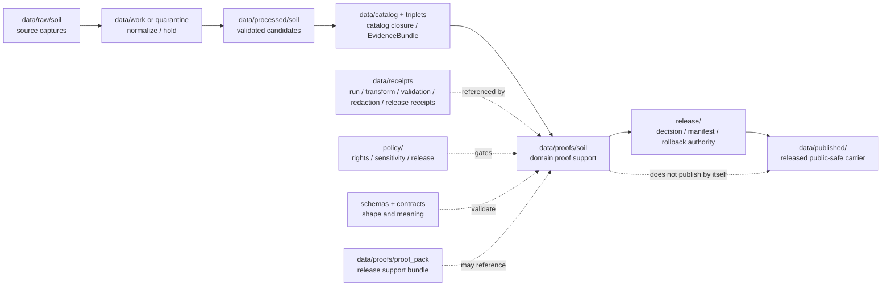

<!-- [KFM_META_BLOCK_V2]
doc_id: kfm://data/proofs/soil/readme
title: data/proofs/soil README
type: directory-readme
version: v0.1
status: draft
owners:
  - <data steward — TODO>
  - <proof steward — TODO>
  - <soil domain steward — TODO>
  - <sensitivity reviewer — TODO>
  - <release steward — TODO>
created: 2026-06-25
updated: 2026-06-25
policy_label: public-review
path: data/proofs/soil/README.md
related:
  - ../README.md
  - ../proof_pack/README.md
  - ../evidence_bundle/README.md
  - ../validation_report/README.md
  - ../citation_validation/README.md
  - ../review/README.md
  - ../integrity/README.md
  - ../../receipts/README.md
  - ../../catalog/README.md
  - ../../published/README.md
  - ../../../release/README.md
  - ../../../docs/domains/soil/ARCHITECTURE.md
  - ../../../docs/domains/soil/CANONICAL_PATHS.md
  - ../../../docs/domains/soil/API_CONTRACTS.md
  - ../../../docs/runbooks/soil/PROMOTION_RUNBOOK.md
  - ../../../docs/runbooks/soil/SOURCE_REFRESH_RUNBOOK.md
  - ../../../contracts/domains/soil/README.md
  - ../../../contracts/domains/soil/soil_map_unit.md
  - ../../../contracts/domains/soil/soil_component.md
  - ../../../contracts/domains/soil/soil_property.md
  - ../../../contracts/domains/soil/domain_feature_identity.md
  - ../../../contracts/domains/soil/domain_layer_descriptor.md
  - ../../../pipelines/domains/soil/README.md
  - ../../../pipelines/domains/soil/ssurgo_ingest/README.md
  - ../../../docs/doctrine/directory-rules.md
  - ../../../docs/doctrine/lifecycle-law.md
  - ../../../docs/doctrine/trust-membrane.md
  - ../../../contracts/README.md
  - ../../../schemas/README.md
  - ../../../policy/README.md
tags:
  - kfm
  - data
  - proofs
  - soil
  - ssurgo
  - gssurgo
  - gnatsgo
  - sda
  - soil-map-unit
  - soil-component
  - horizon
  - hydrologic-soil-group
  - soil-moisture
  - pedon
  - support-type
  - evidence-bundle
  - release-gate
  - rollback
  - cite-or-abstain
notes:
  - "Directory README for Soil proof support. It is not itself a schema, semantic contract, policy bundle, ProofPack, ReleaseManifest, catalog record, or published soil layer."
  - "Support-type separation is mandatory: static survey, gridded derivative, station reading, satellite grid, pedon evidence, and interpretation cannot masquerade as one surface."
  - "Public-scale soil products may be public-safe with support-type and time caveats; farm-specific, owner-specific, proprietary, unpublished, or operational sensor data fail closed until rights and sensitivity review allow release."
[/KFM_META_BLOCK_V2] -->

<a id="top"></a>

# `data/proofs/soil/`

> Domain proof lane for **Soil**. Files under this directory should support evidence closure, support-type separation, source-role discipline, survey-lineage integrity, soil-moisture proof, interpretation caveats, catalog closure, release review, correction, and rollback for soil-domain claims and public-safe soil products.


> [!IMPORTANT]
> **Status:** `draft`  
> **Owner:** `<data steward>` · `<proof steward>` · `<soil domain steward>` · `<sensitivity reviewer>` · `<release steward>` — TODO  
> **Path:** `data/proofs/soil/README.md`  
> **Truth posture:** CONFIRMED doctrine / PROPOSED implementation guidance / NEEDS VERIFICATION for emitted proof objects, schemas, validators, CI workflows, source descriptors, release gates, and rollback drills.

> [!WARNING]
> This folder supports review. It does **not** publish a soil layer, certify agronomic suitability, replace NRCS/USDA source authority, merge survey and sensor evidence, expose farm/owner-specific data, or turn an interpretation into operational advice by file placement.

---

## Quick jumps

| Section | Use it for |
|---|---|
| [1. Purpose](#1-purpose) | What this proof lane is for. |
| [2. Placement and authority](#2-placement-and-authority) | Why this path belongs under `data/proofs/`. |
| [3. What belongs here](#3-what-belongs-here) | Accepted proof families and examples. |
| [4. What must not live here](#4-what-must-not-live-here) | Exclusions and wrong homes. |
| [5. Soil proof responsibilities](#5-soil-proof-responsibilities) | Domain-specific support obligations. |
| [6. Object families and proof concerns](#6-object-families-and-proof-concerns) | What each soil object needs proved. |
| [7. Support-type and source-role gates](#7-support-type-and-source-role-gates) | How to block support collapse. |
| [8. Sensitivity and publication gates](#8-sensitivity-and-publication-gates) | Farm, owner, sensor, rights, and public-scale controls. |
| [9. Naming and identity](#9-naming-and-identity) | Suggested file naming and metadata. |
| [10. Lifecycle relationship](#10-lifecycle-relationship) | How proofs relate to RAW → PUBLISHED and release. |
| [11. Validation checklist](#11-validation-checklist) | Maintainer checklist. |
| [12. Failure modes](#12-failure-modes) | Drift and overclaim patterns to block. |
| [13. Definition of done](#13-definition-of-done) | What is still needed for operational maturity. |

---

## 1. Purpose

`data/proofs/soil/` stores proof support for the Soil domain: static soil-survey evidence, gridded soil derivatives, map units, components, horizons, component-horizon joins, soil properties, hydrologic soil groups, pedons/profile views, soil-moisture observations, erosion context, suitability ratings, and public-safe soil map/API products.

A proof file here should help answer:

- Which EvidenceBundle supports the soil claim, layer, drawer payload, report, or public-safe derivative?
- What source role and support type were assigned at admission, and were they preserved through release?
- Are static survey evidence, gridded derivatives, station readings, satellite grids, pedon evidence, and interpretations kept separate?
- Are MUKEY/COKEY/CHKEY and horizon lineage intact?
- Are source, observed, valid, retrieval, release, correction, source-vintage, and sensor/depth times preserved where material?
- Are units, depth, quality-control flags, aggregation rules, and interpretation caveats recorded?
- Are farm-specific, owner-specific, private sensor, proprietary, unpublished, rare-location-adjacent, or operational details handled by policy and review?
- Does the candidate have validation, catalog closure, release support, correction path, and rollback target?

This directory is not a source-data lane, not a catalog lane, not a release decision lane, not a published soil layer, and not an agronomic/legal/engineering recommendation authority.

[Back to top](#top)

---

## 2. Placement and authority

KFM places files by responsibility root. `data/proofs/` is the proof-support area for release-grade evidence support, ProofPacks, catalog closure, citation validation, review proof, and integrity support. The `soil/` segment narrows the proof responsibility to the Soil domain lane.

| Surface | Role | Boundary |
|---|---|---|
| [`../README.md`](../README.md) | Parent proof root. | Defines proof-lane expectations. This README narrows them for Soil. |
| [`../proof_pack/`](../proof_pack/) | ProofPack family. | Soil proof files may feed or be referenced by ProofPacks, but this folder is broader than ProofPack instances. |
| [`../evidence_bundle/`](../evidence_bundle/) | EvidenceBundle support. | Soil proof files may cite EvidenceBundles; they do not replace them. |
| [`../validation_report/`](../validation_report/) | Validation proof support. | Soil proofs should cite validation outcomes for lineage, units, support type, and release gates. |
| [`../review/`](../review/) | Review proof support. | Sensitive or release-significant soil proof may cite review proof; it does not replace review. |
| [`../../receipts/`](../../receipts/) | Process memory. | Receipts say what ran; proof files use them as basis, not as proof by themselves. |
| [`../../catalog/`](../../catalog/) | Discovery and interchange. | Catalog records aid discovery; proof files support closure and release review. |
| [`../../published/`](../../published/) | Released public-safe artifacts. | Public layers/API payloads belong downstream, only after release gates. |
| [`../../../release/`](../../../release/) | Release decisions, manifests, rollback cards, correction and withdrawal notices. | Release authority stays in `release/`; this folder supports it. |
| [`../../../docs/domains/soil/`](../../../docs/domains/soil/) | Domain doctrine. | Docs explain lane meaning and boundaries; proof files support concrete claims/candidates. |
| [`../../../contracts/domains/soil/`](../../../contracts/domains/soil/) | Semantic meaning. | Soil object meaning belongs in contracts. |
| [`../../../schemas/`](../../../schemas/) | Machine shape. | Field-level JSON Schema belongs under the accepted schema home. |
| [`../../../policy/`](../../../policy/) | Admissibility. | Proof files record policy outcomes; policy logic lives in policy roots. |

> [!NOTE]
> Soil is a domain lane under responsibility roots, not a top-level repository authority. This README documents the existing `data/proofs/soil/` proof lane and does not create a new lifecycle phase.

[Back to top](#top)

---

## 3. What belongs here

Use this directory for soil proof support objects that are safe to store under repository policy and useful for review, release, correction, rollback, or audit.

| Proof family | Example content | Required posture |
|---|---|---|
| `evidence_closure` | Proof that a SoilMapUnit, SoilComponent, Horizon, SoilProperty, Hydrologic Soil Group, SoilMoistureObservation, Pedon, ErosionRisk, or SuitabilityRating resolves to EvidenceBundle support. | Must preserve source role, support type, temporal scope, units, uncertainty, and release state. |
| `support_type` | Proof that static survey, gridded derivative, station observation, satellite grid, pedon evidence, and interpretation are not collapsed. | Missing support type fails closed. |
| `survey_lineage` | Proof that MUKEY/COKEY/CHKEY, component-horizon joins, map unit identity, and source vintage are intact. | Required for SSURGO/SDA/gSSURGO/gNATSGO-derived products. |
| `soil_moisture` | Proof for station or satellite soil-moisture observations, depth, units, QC, cadence, and observed/retrieved/released time. | Sensor/satellite support type and caveats required. |
| `interpretation_caveat` | Proof for ErosionRisk, SuitabilityRating, hydrologic group, or other interpretive products. | Interpretation is not hazard, crop, yield, engineering, or legal truth. |
| `cross_support_derivation` | Proof that any aggregation or fusion across support types has a reviewed derivation step. | Cross-support aggregation without derivation fails closed. |
| `rights_sensitivity` | Proof for source rights, private network authorization, farm/owner-specific redaction, and public-scale posture. | Unclear rights or sensitive joins block promotion. |
| `cross_lane_closure` | Proof that agriculture, hydrology, hazards, geology, habitat, flora, fauna, or people/land joins preserve ownership. | Neighboring lane truth must not be absorbed by Soil. |
| `release_support` | Proof refs for catalog closure, ProofPack, ReviewRecord, ReleaseManifest, correction path, and rollback target. | Release authority stays in `release/`. |

[Back to top](#top)

---

## 4. What must not live here

| Excluded material | Correct home or action | Why |
|---|---|---|
| Raw SSURGO/SDA/gSSURGO/gNATSGO/SCAN/Mesonet/USCRN/SMAP/SoilGrids payloads, rasters, sensor dumps, or source extracts | `data/raw/soil/`, `data/work/soil/`, or `data/quarantine/soil/` | Proof files reference source material; they do not store it. |
| Canonical processed soil objects | `data/processed/soil/` after validation | Proof lanes are support, not canonical data. |
| Catalog records, STAC/DCAT/PROV, or domain indexes | `data/catalog/...` | Catalog is discovery/interchange, not proof authority. |
| ReleaseManifest, PromotionDecision, RollbackCard, CorrectionNotice, WithdrawalNotice, or release signature | `release/` | Release authority stays separate. |
| Public map layers, PMTiles, GeoParquet, API payloads, reports, or stories | `data/published/...` after release gates | Published artifacts are downstream carriers. |
| Policy logic or release rules | `policy/` | Proof files record policy outcomes, not policy definitions. |
| JSON Schemas | `schemas/contracts/v1/...` | Machine shape belongs in schemas. |
| Semantic contracts | `contracts/domains/soil/` | Meaning belongs in contracts. |
| Farm-specific, owner-specific, unpublished, proprietary, or private sensor data as public-review proof content | Quarantine, restrict, redact, generalize, or deny | Proof files must not become exposure channels. |
| Crop/yield, water-flow, flood, geology, habitat, rare-species, land-ownership, or legal/engineering recommendations | Owning domain lane or official authority | Soil may provide context only and must preserve source/claim ownership. |

[Back to top](#top)

---

## 5. Soil proof responsibilities

A proof file in this lane should support one or more of these responsibilities:

1. **Evidence closure** — every consequential claim resolves to EvidenceBundle support or records `ABSTAIN`, `DENY`, `HOLD`, or `ERROR`.
2. **Support-type separation** — static survey, gridded derivative, station reading, satellite grid, pedon evidence, and interpretation remain distinct unless an explicit derivation proof supports aggregation.
3. **Source-role separation** — authority, observation, context, model, aggregate, candidate, synthetic, and interpretation roles are not inferred from source convenience or upgraded by promotion.
4. **Survey lineage integrity** — MUKEY/COKEY/CHKEY, horizon depth, component percent, source vintage, and normalized digest remain traceable.
5. **Temporal discipline** — source, observed, valid, retrieval, release, correction, source-vintage, station cadence, and sensor observed-at times remain distinct where material.
6. **Unit/depth/QC discipline** — soil-moisture and property values preserve units, depth, method, QC flag, and caveats.
7. **Sensitivity control** — field/owner-specific, private sensor, proprietary, unpublished, rare-location-adjacent, and unsafe cross-domain joins are denied, restricted, generalized, or reviewed.
8. **Cross-lane ownership** — soil claims cite agriculture, hydrology, hazards, geology, habitat, flora, fauna, and people/land context without absorbing their truth.
9. **Release support** — proofs connect to policy decisions, validation reports, catalog closure, review records, release candidates, correction paths, and rollback targets.

[Back to top](#top)

---

## 6. Object families and proof concerns

| Object family | Proof concern |
|---|---|
| `SoilMapUnit` | MUKEY/source-vintage lineage, geometry fingerprint, survey support type, public-safe scale, EvidenceBundle support. |
| `SoilComponent` | COKEY/component percent, component-to-map-unit relation, source vintage, normalized digest. |
| `Horizon` | CHKEY/depth range, monotonic depth, component-horizon lineage, property method/caveat. |
| `Component Horizon Join` | MUKEY/COKEY/CHKEY join integrity, no silent row loss, digest closure. |
| `SoilProperty` | Unit, method, depth, source role, estimate/measurement distinction, support type. |
| `Hydrologic Soil Group` | Classification basis, runoff context, not streamflow/flood truth, hydrology cross-lane boundary. |
| `Soil Moisture Observation` | Station/satellite support type, observed time, depth, unit, QC, cadence, stale/retrieval/release time. |
| `Pedon` / `SoilProfileView` | Profile-level evidence, location precision, horizon sequence, source role, public geometry posture. |
| `ErosionRisk` | Interpretation caveats, method/version, not an authoritative hazard warning. |
| `SuitabilityRating` | Fitness-for-use caveats, target use, method/version, not crop/yield/engineering/legal advice. |
| `SoilTimeCaveat` | Per-product temporal limitation; support for public caveat display and stale/valid state. |

[Back to top](#top)

---

## 7. Support-type and source-role gates

| Gate | Required proof | Failure outcome |
|---|---|---|
| Missing support type | Proof object carries support type such as `authoritative_static_soil`, `gridded_derivative_soil`, `station_soil_moisture`, `satellite_soil_moisture`, `pedon_evidence`, or `interpretation`. | `DENY`, `ABSTAIN`, or quarantine. |
| Static survey vs gridded derivative | Proof that SSURGO/SDA survey evidence and gSSURGO/gNATSGO/SoilGrids derivatives are labeled distinctly. | `DENY` support collapse. |
| Station vs satellite moisture | Proof of station/satellite source, depth, units, QC, cadence, and time semantics. | `HOLD` or `DENY` if ambiguous. |
| Pedon vs map unit | Proof that profile-level evidence is not generalized as map-unit truth without derivation. | `ABSTAIN` or require derivation proof. |
| Interpretation vs observation | ErosionRisk/SuitabilityRating/hydrologic group labeled as interpretation/classification where appropriate. | `DENY` observation claim. |
| Cross-support aggregation | Explicit derivation step, method/version, reviewer/policy state, and evidence closure. | `DENY` mixed surface. |
| Source role per use | SourceDescriptor and proof state show role for this use, not source brand alone. | `DENY` source-role collapse. |
| Temporal caveat | Source vintage, observed/retrieval/release time, stale state, and correction path recorded where material. | `ABSTAIN`, stale badge, or hold. |

[Back to top](#top)

---

## 8. Sensitivity and publication gates

| Risk surface | Required support | Default when unresolved |
|---|---|---|
| Field- or owner-specific soil condition, farm management, or private operational detail | Rights review, sensitivity decision, aggregation/generalization proof, ReviewRecord. | `DENY` or generalized release only. |
| Private sensor networks or operational metadata | Operator authorization, source role, cadence, access tier, public-safe transform. | `DENY` or restricted release. |
| Proprietary or unpublished survey/derived data | Source rights, license/terms, steward review, quarantine outcome if unresolved. | `QUARANTINE` / `DENY`. |
| Rare-species or sensitive habitat joins via substrate/moisture | Flora/fauna/habitat ownership preserved; exact sensitive locations suppressed. | `DENY` exact exposure. |
| People/land/parcel/owner joins | People / DNA / Land lane support, privacy policy, aggregation/generalization. | `DENY` or aggregate. |
| Hydrology/flood interpretation | Hydrology/Hazards ownership preserved; hydrologic soil group not treated as flood or streamflow truth. | `ABSTAIN` or `DENY` if claim overreaches. |
| Public soil layer | EvidenceBundle, validation, catalog closure, release manifest, support-type caveat, time caveat, rollback target. | `HOLD` or `DENY`. |

[Back to top](#top)

---

## 9. Naming and identity

Suggested file pattern:

```text
soil.<proof_family>.<scope>.<release_or_run_id>.<short_hash>.json
```

Examples:

```text
soil.evidence_closure.mapunit-ssurgo-demo.v0.1.0123abcd.json
soil.survey_lineage.mukey-cokey-chkey-demo.v0.1.89ab4567.json
soil.support_type.gssurgo-derivative-layer-demo.v0.1.4567cdef.json
soil.soil_moisture.station-depth-qc-demo.v0.1.cdef0123.json
soil.interpretation_caveat.hydrologic-soil-group-demo.v0.1.abcd4567.json
```

Minimum proof metadata should include:

- `proof_id`
- `proof_family`
- `domain: soil`
- `object_family`
- `object_id` or `release_candidate_id`
- `support_type`
- `source_descriptor_refs`
- `source_roles`
- `evidence_bundle_refs`
- `receipt_refs`
- `validation_report_refs`
- `policy_decision_refs`
- `review_record_refs`
- `catalog_refs`
- `release_refs`
- `rollback_refs`
- `identity_basis`
- `survey_lineage_refs` where applicable
- `unit_depth_qc_context` where applicable
- `time_scope` with distinct source/observed/valid/retrieval/release/correction times where material
- `sensitivity_posture`
- `public_geometry_or_scale_posture`
- `outcome`
- `reasons`

[Back to top](#top)

---

## 10. Lifecycle relationship



Proof files support review and release. They do not publish, certify, advise, or merge support types by placement.

[Back to top](#top)

---

## 11. Validation checklist

Before a soil proof supports release review, verify:

- [ ] The proof identifies the object family, object/release scope, support type, source family, spatial/scale scope, temporal scope, and intended public surface.
- [ ] Every consequential claim resolves to EvidenceBundle support or records `ABSTAIN`, `DENY`, `HOLD`, or `ERROR`.
- [ ] SourceDescriptor refs include source role, rights, sensitivity, citation, cadence/vintage, retrieval time, and digest where applicable.
- [ ] Static survey, gridded derivative, station reading, satellite grid, pedon evidence, and interpretation remain distinct.
- [ ] Cross-support aggregation has an explicit derivation proof, method/version, review state, and policy decision.
- [ ] MUKEY/COKEY/CHKEY, component percent, horizon depth, and map-unit/component/horizon lineage remain intact where applicable.
- [ ] Units, depth, sensor method, QC flags, source vintage, observed time, retrieval time, release time, and correction time remain distinct where material.
- [ ] Hydrologic soil group, suitability rating, and erosion risk carry interpretation caveats and do not become hydrology, hazard, crop/yield, legal, or engineering truth.
- [ ] Farm-specific, owner-specific, private sensor, proprietary, unpublished, or operational details are denied, restricted, generalized, or reviewed.
- [ ] Rare-species/habitat, people/land, hydrology, agriculture, geology, flora, fauna, and hazard joins preserve owning-lane authority.
- [ ] Release refs point to `release/`; published artifact refs point to `data/published/`; raw/work/quarantine data is not exposed.
- [ ] Rollback, correction, withdrawal, and invalidation targets are traceable.

[Back to top](#top)

---

## 12. Failure modes

| Failure mode | Why it matters | Required response |
|---|---|---|
| Static survey and gridded derivative merged into one surface | Users cannot tell source authority from derived representation. | Deny release or require derivation proof and labels. |
| Soil-moisture value lacks support type, depth, unit, or QC context | Observation cannot be interpreted safely. | Deny, hold, or quarantine. |
| Pedon/profile evidence generalized as map-unit truth without derivation | Profile evidence is not automatically polygon truth. | Abstain or require derivation proof. |
| SuitabilityRating presented as crop/yield/engineering/legal recommendation | Interpretation becomes advice outside Soil authority. | Deny overclaim; relabel with caveats. |
| Hydrologic soil group presented as flood/streamflow evidence | Soil context is not hydrology/hazard truth. | Deny or route to Hydrology/Hazards. |
| Farm/owner/private sensor detail appears in proof file | Proof artifact becomes an exposure channel. | Quarantine, redact, generalize, restrict, or deny. |
| Rare-species or habitat sensitive location leaked through soil substrate join | Cross-lane join exposes sensitive ecology. | Deny exact exposure; require owning-lane review. |
| Proof file acts as ReleaseManifest | Collapses proof support with release authority. | Move authority to `release/`; keep reference here. |
| AI soil summary replaces evidence | Generated language becomes root truth. | Deny; require EvidenceBundle and citation validation. |

[Back to top](#top)

---

## 13. Definition of done

This proof lane is operationally useful when:

- [ ] Soil proof schemas and semantic contracts exist under approved homes.
- [ ] Valid and invalid fixtures cover support-type absence, support-type collapse, MUKEY/COKEY/CHKEY lineage break, horizon depth error, missing unit/depth/QC, cross-support aggregation without derivation, unresolved rights, private sensor exposure, rare-location join leak, and missing rollback support.
- [ ] CI or validators block public release when EvidenceBundle, PolicyDecision, ReviewRecord, catalog closure, support-type caveat, time caveat, or rollback target is missing.
- [ ] Source descriptors exist for active soil source families and record rights, cadence, role, citation, sensitivity, freshness/staleness posture, and source-vintage metadata.
- [ ] Release docs cross-link proof requirements for soil map layers, hydrologic group layers, soil moisture summaries, pedon/profile views, suitability products, and erosion-risk context.
- [ ] CODEOWNERS or equivalent review ownership covers data steward, soil steward, sensitivity reviewer, proof steward, and release steward.
- [ ] At least one synthetic no-network release candidate demonstrates: source capture → processed candidate → EvidenceBundle → soil proof → ProofPack → ReleaseManifest → public-safe artifact → rollback.

---

## Maintainer note

Soil proof work is easy to overstate because soil survey maps, gridded derivatives, sensor readings, and interpretations all look like layers. Keep support type, source role, time, unit, depth, scale, evidence, review state, public geometry, release state, and rollback separate until proof and policy say otherwise. When evidence, rights, support type, time scope, sensitivity, or release state is incomplete, hold, abstain, deny, restrict, generalize, or quarantine instead of publishing a confident soil surface.
