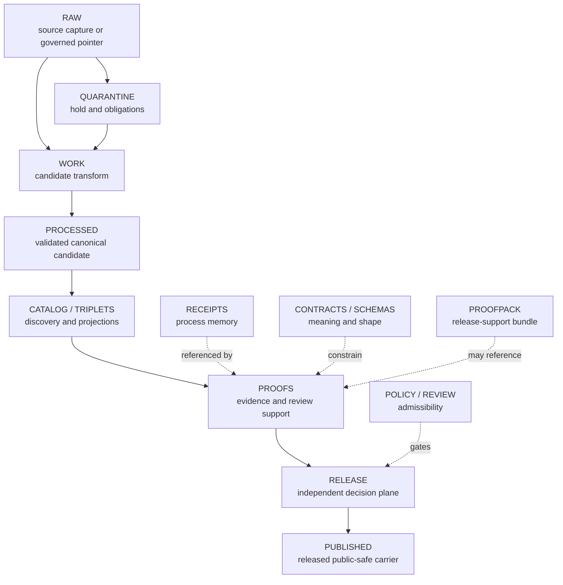

<!-- [KFM_META_BLOCK_V2]
doc_id: kfm://data/proofs/soil/readme
title: data/proofs/soil README
type: directory-readme
version: v0.2.0
status: repository-grounded draft; Soil proof production and release readiness remain unverified
owners:
  - "@bartytime4life — verified CODEOWNERS routing for /data/proofs/; routing is not review or approval"
  - "NEEDS VERIFICATION — data, proof, Soil domain, rights/sensitivity, policy, release, correction/rollback, and independent-review stewardship"
created: 2026-06-25
updated: 2026-07-26
policy_label: public-review
path: data/proofs/soil/README.md
related:
  - ../README.md
  - ../proof_pack/README.md
  - ../evidence_bundle/README.md
  - ../validation_report/README.md
  - ../citation_validation/README.md
  - ../review/README.md
  - ../../receipts/README.md
  - ../../receipts/soil/README.md
  - ../../catalog/README.md
  - ../../catalog/domain/soil/README.md
  - ../../registry/sources/soil/README.md
  - ../../published/README.md
  - ../../published/soil/README.md
  - ../../published/layers/soil/README.md
  - ../../rollback/soil/README.md
  - ../../../release/README.md
  - ../../../release/candidates/soil/README.md
  - ../../../docs/domains/soil/ARCHITECTURE.md
  - ../../../docs/domains/soil/CANONICAL_PATHS.md
  - ../../../docs/domains/soil/API_CONTRACTS.md
  - ../../../docs/domains/soil/DATA_LIFECYCLE.md
  - ../../../docs/runbooks/soil/PROMOTION_RUNBOOK.md
  - ../../../docs/runbooks/soil/SOURCE_REFRESH_RUNBOOK.md
  - ../../../docs/runbooks/soil/ROLLBACK_RUNBOOK.md
  - ../../../contracts/domains/soil/README.md
  - ../../../contracts/domains/soil/soil_map_unit.md
  - ../../../contracts/domains/soil/soil_component.md
  - ../../../contracts/domains/soil/soil_property.md
  - ../../../contracts/domains/soil/domain_feature_identity.md
  - ../../../contracts/domains/soil/domain_layer_descriptor.md
  - ../../../contracts/README.md
  - ../../../schemas/contracts/v1/domains/soil/README.md
  - ../../../schemas/README.md
  - ../../../policy/domains/soil/README.md
  - ../../../policy/README.md
  - ../../../pipelines/domains/soil/README.md
  - ../../../pipelines/domains/soil/ssurgo_ingest/README.md
  - ../../../fixtures/domains/soil/README.md
  - ../../../tests/domains/soil/README.md
  - ../../../tools/validators/domains/soil/README.md
  - ../../../.github/workflows/domain-soil.yml
  - ../../../.github/CODEOWNERS
  - ../../../docs/doctrine/directory-rules.md
  - ../../../docs/doctrine/lifecycle-law.md
  - ../../../docs/doctrine/trust-membrane.md
  - ../../../docs/adr/ADR-0011-receipts-vs-proofs-vs-manifests-vs-catalog-separation.md
  - ../../../docs/adr/ADR-0029-adopt-directory-governance-standard-v2.md
tags:
  - kfm
  - data
  - proofs
  - soil
  - ssurgo
  - gssurgo
  - gnatsgo
  - sda
  - soil-map-unit
  - soil-component
  - horizon
  - hydrologic-soil-group
  - soil-moisture
  - pedon
  - support-type
  - evidence-bundle
  - release-gate
  - rollback
  - cite-or-abstain
notes:
  - "Same-path Markdown modernization only; no proof payload, source record, contract, schema, policy, validator, fixture, test, workflow, release object, route, or publication state changed."
  - "Support-type separation is mandatory: static survey, gridded derivative, station reading, satellite grid, pedon evidence, and interpretation cannot masquerade as one surface."
  - "Directory Rules v2 and ADR-0029 remain proposed; the legacy architecture rules path is absent at the pinned head, and this README does not treat that deletion as adoption, supersession, or migration authority."
  - "A dynamic workflow badge is intentionally omitted because the current Soil jobs record validation, proof-production, and release-dry-run holds."
[/KFM_META_BLOCK_V2] -->

<a id="top"></a>

# `data/proofs/soil/` — Soil Proof Support

> Bounded proof-support guidance for Soil claims and release candidates, with support type, source role, survey lineage, time, rights, sensitivity, correction, and rollback kept inspectable.

[](#status-and-evidence-boundary)
[](../../../docs/doctrine/trust-membrane.md)
[](../README.md)
[](../../../docs/domains/soil/ARCHITECTURE.md)
[](#7-support-type-and-source-role-gates)
[](#validation-and-held-automation)

> [!IMPORTANT]
> **Status:** repository-grounded draft  
> **Review route:** `@bartytime4life` through [`.github/CODEOWNERS`](../../../.github/CODEOWNERS); routing is not accountable stewardship, independent review, or approval  
> **Path:** `data/proofs/soil/README.md`  
> **Evidence boundary:** [`main@ee5289d5ff2649a660d665f9601431c3f5839a98`](https://github.com/bartytime4life/Kansas-Frontier-Matrix/tree/ee5289d5ff2649a660d665f9601431c3f5839a98)  
> **Truth posture:** CONFIRMED repository evidence / PROPOSED proof-profile guidance / NEEDS VERIFICATION for emitted proof objects, accepted proof schemas, executable validators, representative fixtures, policy enforcement, release gates, and rollback drills.

> [!WARNING]
> This directory supports review. It does **not** publish a Soil layer, certify agronomic suitability, replace source authority, merge survey and sensor evidence, expose farm- or owner-specific data, prove conservation compliance, authorize engineering or legal conclusions, or turn an interpretation into operational advice.

---

## Quick jumps

| Section | Use it for |
|---|---|
| [Status and evidence boundary](#status-and-evidence-boundary) | What is confirmed, proposed, held, or unknown. |
| [1. Purpose](#1-purpose) | What this proof-support lane is for. |
| [2. Placement and authority](#2-placement-and-authority) | Why the existing path belongs under `data/proofs/`. |
| [3. What belongs here](#3-what-belongs-here) | Proposed proof-support families and admission limits. |
| [4. What must not live here](#4-what-must-not-live-here) | Exclusions and owning responsibility roots. |
| [Inputs](#inputs) · [Outputs](#outputs) | What future Soil proof support may reference or emit. |
| [5–8. Responsibilities and gates](#5-soil-proof-responsibilities) | Evidence, support type, lineage, sensitivity, and publication controls. |
| [9. Naming and identity](#9-naming-and-identity) | Explicitly proposed naming and metadata sketch. |
| [10. Lifecycle relationship](#10-lifecycle-relationship) | Proof support inside the governed lifecycle. |
| [Validation and held automation](#validation-and-held-automation) | Verified placeholders and explicit workflow holds. |
| [11. Validation checklist](#11-validation-checklist) | Future packet-review checklist. |
| [Correction and invalidation](#correction-withdrawal-and-invalidation) | How a defect remains traceable without hidden edits. |
| [12. Failure modes](#12-failure-modes) | Drift and overclaim patterns to block. |
| [13. Definition of done](#13-definition-of-done) | Evidence required to graduate the lane. |
| [Review burden](#review-burden) · [Related folders](#related-folders) · [ADRs](#adrs) | Review and authority context. |
| [Last reviewed](#last-reviewed) · [Open verification](#open-verification-register) · [No-loss](#no-loss-ledger) | Evidence boundary, unknowns, and lineage. |

---

## Status and evidence boundary

| Surface | Current repository evidence | Boundary |
|---|---|---|
| README and path | This file exists at the pinned base as blob `6e8238d53813af659af9eddd2f8719bc42043201`, with stable document ID `kfm://data/proofs/soil/readme`. | File presence proves documentation only. |
| Parent proof contract | [`data/proofs/README.md`](../README.md) is a repository-grounded draft that assigns evidence, validation, citation, review, integrity, and release-support responsibility to this root. | The parent explicitly does not create truth, policy permission, release, or publication. |
| Directory authority | The legacy `docs/architecture/directory-rules.md` body is absent at the pinned head; [Directory Rules v2](../../../docs/doctrine/directory-rules.md) is still `PROPOSED_FOR_ADOPTION`, and [ADR-0029](../../../docs/adr/ADR-0029-adopt-directory-governance-standard-v2.md) is still `proposed`. | No accepted replacement was verified. This README retains the already-existing path and does not infer adoption, supersession, migration, or deletion authority from repository absence. |
| Contracts and schemas | The [Soil contract lane](../../../contracts/domains/soil/README.md) is draft/experimental; the [Soil schema lane](../../../schemas/contracts/v1/domains/soil/README.md) is a scaffolded draft whose object shapes still need field-complete verification. | No accepted Soil proof profile or proof-object schema was verified. |
| Policy and fixtures | The [Soil policy README](../../../policy/domains/soil/README.md) and [fixture README](../../../fixtures/domains/soil/README.md) are greenfield scaffolds. | Policy enforcement and representative positive/negative fixture coverage are not established. |
| Tests and validators | The domain has one `test_placeholder` smoke test and four validator files whose `main()` functions raise `NotImplementedError`. | No substantive Soil proof validation is established. |
| Automation | The [Soil workflow](../../../.github/workflows/domain-soil.yml) performs bounded readiness checks and records explicit validation, proof, and release-dry-run holds. | A green held job is not proof production, semantic validation, release readiness, or publication authority. |
| Source registry | The [Soil source registry README](../../registry/sources/soil/README.md) records competing domain-first and subtype-first topology and marks final topology `NEEDS VERIFICATION`. | This proof README cannot resolve registry topology or activate a source. |
| Ownership | CODEOWNERS routes `/data/proofs/` to `@bartytime4life`. | Accountable proof, data, Soil, rights/sensitivity, policy, release, correction/rollback, and independent-review assignments remain `NEEDS VERIFICATION`. |
| Proof payloads and external stores | Not established by the bounded file review. | Recursive payload inventory, writers, consumers, access controls, retention, and operational use remain `UNKNOWN`. |

[Back to top](#top)

---

## 1. Purpose

`data/proofs/soil/` is the Soil domain lane inside the parent proof-support responsibility. It may support review of static soil-survey evidence, gridded derivatives, map units, components, horizons, component-horizon joins, soil properties, hydrologic soil groups, pedons/profile views, soil-moisture observations, erosion context, suitability ratings, and public-safe Soil delivery candidates. Prior source-family lineage includes SSURGO, SDA, gSSURGO, gNATSGO, SCAN, Kansas Mesonet, USCRN, SMAP, and SoilGrids; naming a family does not admit it, assign its role, clear its rights, or prove current use.

A future proof object here should help answer:

- Which EvidenceBundle supports the Soil claim, layer, Evidence Drawer payload, report, or public-safe derivative?
- What source role and support type were assigned at admission, and were they preserved through review?
- Are static survey evidence, gridded derivatives, station readings, satellite grids, pedon evidence, and interpretations kept separate?
- Are MUKEY/COKEY/CHKEY and horizon lineage intact?
- Are source, observed, valid, retrieval, release, correction, source-vintage, and sensor/depth times preserved where material?
- Are units, depth, quality-control flags, aggregation rules, uncertainty, and interpretation caveats recorded?
- Are farm-specific, owner-specific, private-sensor, proprietary, unpublished, rare-location-adjacent, or operational details handled by policy and review?
- Does the candidate have validation, catalog closure, release support, a correction path, and a rollback target?

This directory is not a source-data lane, catalog lane, release-decision lane, published Soil layer, source registry, policy engine, or agronomic, conservation-compliance, legal, regulatory, or engineering authority.

[Back to top](#top)

---

## 2. Placement and authority

KFM's documented lineage places artifacts by responsibility, separates proof support from receipts and release decisions, and treats Soil as a lane rather than a root. At the pinned head, however, the legacy Directory Rules body has been deleted while its proposed successor and adoption ADR remain unaccepted. This same-path modernization therefore relies on the existing repository path, the current parent proof contract, and the user's bounded review-branch instruction; it does not infer a new placement decision from deletion.

| Authority source | Verified state at the evidence boundary | Effect on this README |
|---|---|---|
| [Legacy Directory Rules v1.3.1 at the prior checkpoint](https://github.com/bartytime4life/Kansas-Frontier-Matrix/blob/b33687e072970ae12b36c9642ae1da09f900d1f2/docs/architecture/directory-rules.md) | Absent from the current head after [`4977bca`](https://github.com/bartytime4life/Kansas-Frontier-Matrix/commit/4977bca73cb8bc6232f5a48c7768baf6f0a290c6). | Prior lineage remains inspectable; absence is not acceptance, supersession, or proof of completed migration. |
| [Directory Rules v2](../../../docs/doctrine/directory-rules.md) | `2.0.0-draft.1`; `PROPOSED_FOR_ADOPTION`. | Useful successor guidance only; it has no adoption or supersession effect here. |
| [ADR-0029](../../../docs/adr/ADR-0029-adopt-directory-governance-standard-v2.md) | `proposed`; its source still records legacy-path deletion as held pending acceptance and migration evidence. | Does not adopt v2 or retroactively authorize the observed deletion. |
| [Parent proof README](../README.md) | Repository-grounded draft. | Defines the current proof-support boundary and anti-collapse rules. |

| Surface | Role | Boundary |
|---|---|---|
| [`../README.md`](../README.md) | Parent proof responsibility. | Defines proof-lane expectations; this file narrows them for Soil. |
| [`../proof_pack/`](../proof_pack/README.md) | ProofPack support. | A future Soil proof may be referenced by a ProofPack; this lane is not the ProofPack authority. |
| [`../evidence_bundle/`](../evidence_bundle/README.md) | EvidenceBundle support. | Soil proof support may resolve EvidenceRefs; it does not replace evidence. |
| [`../validation_report/`](../validation_report/README.md) | Validation-report support. | A report proves only its declared checks and inputs. |
| [`../review/`](../review/README.md) | Review support. | Review records remain independently addressable and do not become release decisions. |
| [`../../receipts/soil/`](../../receipts/soil/README.md) | Soil process memory. | Receipts say what ran; they do not prove a claim or release by themselves. |
| [`../../catalog/domain/soil/`](../../catalog/domain/soil/README.md) | Discovery and interchange. | Catalog records aid closure; they are not canonical claim or release authority. |
| [`../../published/layers/soil/`](../../published/layers/soil/README.md) | Released public-safe carriers. | Public layers belong downstream of governed release. |
| [`../../rollback/soil/`](../../rollback/soil/README.md) | Existing rollback-support lane. | Directory Rules v2 proposes deprecating ambiguous `data/rollback/`; no migration is authorized here. |
| [`../../../release/`](../../../release/README.md) | Release decisions, correction, withdrawal, and rollback authority. | Release authority stays separate from proof support. |
| [Domain architecture](../../../docs/domains/soil/ARCHITECTURE.md) | Draft Soil meaning and boundaries. | Documentation does not establish proof payload or runtime maturity. |
| [Contracts](../../../contracts/domains/soil/README.md) | Semantic meaning. | Current Soil contracts remain draft/experimental. |
| [Schemas](../../../schemas/contracts/v1/domains/soil/README.md) | Machine shape. | Current Soil schema lane remains a scaffolded draft. |
| [Policy](../../../policy/domains/soil/README.md) | Admissibility. | Current Soil policy lane is a greenfield scaffold; enforcement is not established. |

> [!NOTE]
> Existing-path retention is a reversible documentation choice. It is not a claim that every neighboring Soil path is canonical, implemented, compatible, or approved.

[Back to top](#top)

---

## 3. What belongs here

The families below are a **PROPOSED proof-support profile**, not confirmation that instances, schemas, producers, or consumers exist.

| Proof family | Example review concern | Required posture |
|---|---|---|
| `evidence_closure` | A SoilMapUnit, SoilComponent, Horizon, SoilProperty, Hydrologic Soil Group, SoilMoistureObservation, Pedon, ErosionRisk, or SuitabilityRating resolves to EvidenceBundle support. | Preserve source role, support type, temporal scope, units, uncertainty, limitations, and release dependency. |
| `support_type` | Static survey, gridded derivative, station observation, satellite grid, pedon evidence, and interpretation are not collapsed. | Missing or ambiguous support type fails closed. |
| `survey_lineage` | MUKEY/COKEY/CHKEY, component-horizon joins, map-unit identity, source vintage, and normalized digest remain intact. | Required for survey-derived candidates. |
| `soil_moisture` | Station or satellite observation depth, units, QC, cadence, observed/retrieved/released time, and stale state. | Sensor/satellite support type and caveats required. |
| `interpretation_caveat` | ErosionRisk, SuitabilityRating, hydrologic group, or another interpretive product retains method, target use, limits, and owning-lane context. | Interpretation is not hazard, crop, yield, engineering, legal, or regulatory truth. |
| `cross_support_derivation` | Aggregation or fusion across support types has an explicit derivation record. | Undeclared cross-support aggregation is denied or held. |
| `rights_sensitivity` | Source rights, private-network authorization, farm/owner-specific redaction, and public-scale posture are reviewable. | Unclear rights or sensitive joins block promotion. |
| `cross_lane_closure` | Agriculture, Hydrology, Hazards, Geology, Habitat, Flora, Fauna, or People / DNA / Land joins preserve ownership. | Neighboring-lane truth must not be absorbed by Soil. |
| `release_support` | Proof refs connect validation, policy, review, catalog, release, correction, withdrawal, and rollback. | Release authority stays in `release/`. |

### Minimum proof-packet profile

Any future packet should be governed by an accepted contract and schema. Until those exist, this list is design guidance only:

- stable proof identity, version, claim or artifact scope, object family, and candidate/release reference;
- source descriptors, source roles, support types, source vintage, spatial/scale support, and temporal support;
- EvidenceRefs resolving to EvidenceBundles, with limitations and citation-validation state;
- content/spec/run identity plus receipt and `ValidationReport` references;
- rights, sensitivity, policy, review, public-geometry, and public-field posture;
- catalog, release, correction, withdrawal, invalidation, and rollback dependencies;
- a finite declared outcome and reason codes from the governing profile.

[Back to top](#top)

---

## 4. What must not live here

| Excluded material | Correct home or action | Why |
|---|---|---|
| Raw source payloads, rasters, sensor dumps, source extracts, or live-fetch output | Governed RAW, WORK, or QUARANTINE lane | Proof files reference source material; they do not store or admit it. |
| Canonical processed Soil objects | `data/processed/soil/` after accepted validation | Proof support is not canonical data. |
| Catalog records, STAC/DCAT/PROV, or domain indexes | `data/catalog/...` | Catalog is discovery/interchange, not proof or release authority. |
| ReleaseManifest, PromotionDecision, RollbackCard, CorrectionNotice, WithdrawalNotice, or release signature | `release/` | Release authority stays separate. |
| Public map layers, PMTiles, GeoParquet, API payloads, reports, or stories | Governed `data/published/...` lane after release | Published artifacts are downstream carriers. |
| Policy logic or release rules | `policy/` | Proof support records policy references and outcomes; it does not define policy. |
| JSON Schemas | `schemas/contracts/v1/...` | Machine shape belongs in schemas. |
| Semantic contracts | `contracts/domains/soil/` | Meaning belongs in contracts. |
| Farm-specific, owner-specific, unpublished, proprietary, or private-sensor material in public-review proof content | Quarantine, restrict, redact, generalize, or deny | A proof artifact must not become an exposure channel. |
| Crop/yield, streamflow/flood, geology, habitat, rare-species, land-ownership, conservation-compliance, legal, regulatory, or engineering conclusions | Owning domain, policy, or official authority | Soil may provide bounded context only. |
| Generated language presented as evidence or approval | Resolve governed evidence and decision state, or abstain | AI is interpretive and cannot replace EvidenceBundle, review, or release authority. |

[Back to top](#top)

---

## Inputs

Future Soil proof support may reference:

- admitted source descriptors and source-role decisions;
- processed candidates plus catalog/triplet projections;
- EvidenceRefs and EvidenceBundles;
- run, transform, validation, redaction/generalization, aggregation, review, correction, and rollback receipts;
- validation and citation-validation reports;
- policy decisions and review records;
- release candidates, manifests, correction/withdrawal notices, and rollback targets.

Inputs remain owned by their responsibility roots. Copying content into this directory must not erase identity, rights, sensitivity, retention, or correction lineage.

## Outputs

Future outputs may include Soil-scoped proof packets, indexes, limitations, validation/citation summaries, review support, and release-support references under accepted profiles.

An output from this directory is not a release decision, public payload, public route, agronomic recommendation, conservation-compliance record, engineering certification, regulatory finding, or proof that all required evidence exists.

[Back to top](#top)

---

## 5. Soil proof responsibilities

A future proof file in this lane should support one or more of these responsibilities:

1. **Evidence closure** — every consequential claim resolves to EvidenceBundle support or records a bounded fail-closed outcome.
2. **Support-type separation** — static survey, gridded derivative, station reading, satellite grid, pedon evidence, and interpretation remain distinct unless an explicit derivation supports aggregation.
3. **Source-role separation** — authority, observation, context, model, aggregate, candidate, synthetic, and interpretation roles are not inferred from source convenience or upgraded by promotion.
4. **Survey-lineage integrity** — MUKEY/COKEY/CHKEY, horizon depth, component percent, source vintage, and normalized digest remain traceable.
5. **Temporal discipline** — source, observed, valid, retrieval, release, correction, source-vintage, cadence, and stale-state times remain distinct where material.
6. **Unit/depth/QC discipline** — Soil-moisture and property values preserve units, depth, method, QC flag, uncertainty, and caveats.
7. **Sensitivity control** — field/owner-specific, private-sensor, proprietary, unpublished, rare-location-adjacent, and unsafe cross-domain joins are denied, restricted, generalized, or reviewed.
8. **Cross-lane ownership** — Soil claims cite Agriculture, Hydrology, Hazards, Geology, Habitat, Flora, Fauna, and People / DNA / Land context without absorbing their truth.
9. **Release support** — proofs connect to policy decisions, validation reports, catalog closure, review records, release candidates, correction paths, and rollback targets.

This README does not define one universal outcome enum. API, validator, policy, release, and placement outcomes remain distinct and must use the accepted vocabulary for their decision class.

[Back to top](#top)

---

## 6. Object families and proof concerns

| Object family | Proof concern |
|---|---|
| `SoilMapUnit` | MUKEY/source-vintage lineage, geometry fingerprint, survey support type, public-safe scale, EvidenceBundle support. |
| `SoilComponent` | COKEY/component percent, component-to-map-unit relation, source vintage, normalized digest. |
| `Horizon` | CHKEY/depth range, monotonic depth, component-horizon lineage, property method and caveat. |
| `Component Horizon Join` | MUKEY/COKEY/CHKEY join integrity, no silent row loss, digest closure. |
| `SoilProperty` | Unit, method, depth, source role, estimate/measurement distinction, support type, uncertainty. |
| `Hydrologic Soil Group` | Classification basis, runoff context, and explicit separation from streamflow or flood truth. |
| `Soil Moisture Observation` | Station/satellite support type, observed time, depth, unit, QC, cadence, stale/retrieval/release time. |
| `Pedon` / `SoilProfileView` | Profile-level evidence, location precision, horizon sequence, source role, public-geometry posture. |
| `ErosionRisk` | Interpretation caveats, method/version, and explicit separation from authoritative hazard warning. |
| `SuitabilityRating` | Fitness-for-use caveats, target use, method/version, and separation from crop/yield, compliance, engineering, or legal advice. |
| `SoilTimeCaveat` | Per-product temporal limitation, public caveat display, stale state, and correction trigger. |

[Back to top](#top)

---

## 7. Support-type and source-role gates

**Support-type separation is mandatory.**

| Gate | Required proof | Fail-closed response |
|---|---|---|
| Missing support type | The packet carries an accepted support-type value and its authority reference. | Deny, abstain, hold, or quarantine according to the governing profile. |
| Static survey vs gridded derivative | Survey evidence and gridded derivatives are labeled and cited distinctly. | Deny support collapse. |
| Station vs satellite moisture | Source, depth, units, QC, cadence, spatial support, and time semantics are explicit. | Hold or deny if ambiguous. |
| Pedon vs map unit | Profile-level evidence is not generalized as map-unit truth without an explicit derivation. | Abstain or require derivation proof. |
| Interpretation vs observation | ErosionRisk, SuitabilityRating, and classification products retain their declared interpretation role. | Deny observation or authoritative-advice overclaim. |
| Cross-support aggregation | Method/version, inputs, identity, reviewer/policy state, uncertainty, and evidence closure are explicit. | Deny an undeclared mixed surface. |
| Source role per use | SourceDescriptor and decision state show the role for this use, not the source brand alone. | Deny source-role collapse. |
| Temporal caveat | Source vintage, observed/retrieval/release time, stale state, and correction path are recorded where material. | Abstain, mark stale, or hold. |

The prior README used the illustrative labels `authoritative_static_soil`, `gridded_derivative_soil`, `station_soil_moisture`, `satellite_soil_moisture`, `pedon_evidence`, and `interpretation`, plus the design outcomes `ABSTAIN`, `DENY`, `HOLD`, and `ERROR`. They remain proposal lineage, not an accepted enum; an adopted contract or policy profile must define the values used by an implementation.

[Back to top](#top)

---

## 8. Sensitivity and publication gates

| Risk surface | Required support | Default when unresolved |
|---|---|---|
| Field- or owner-specific Soil condition, farm management, or private operational detail | Rights review, sensitivity decision, aggregation/generalization proof, and review record. | Deny or release only a reviewed generalized product. |
| Private sensor networks or operational metadata | Operator authorization, source role, cadence, access tier, and public-safe transform. | Deny or restrict. |
| Proprietary or unpublished survey/derived data | Source rights, license/terms, steward review, and quarantine disposition. | Quarantine or deny. |
| Rare-species or sensitive-habitat joins through substrate/moisture | Owning-lane review and exact-location suppression. | Deny exact exposure. |
| People, parcel, land, or owner joins | Owning-lane evidence, privacy policy, aggregation/generalization, and review. | Deny or aggregate. |
| Hydrology/flood interpretation | Hydrology/Hazards ownership remains explicit; hydrologic Soil group is not flood or streamflow truth. | Abstain or deny overreach. |
| Agronomic, conservation-compliance, land-value, legal, regulatory, or engineering use | Explicit fitness-for-use authority outside this README. | Abstain or deny authoritative use. |
| Public Soil layer or API payload | EvidenceBundle, validation, catalog closure, release manifest, support-type/time caveats, public-safe scale, correction path, and rollback target. | Hold or deny. |

[Back to top](#top)

---

## 9. Naming and identity

The following pattern is **PROPOSED** until an accepted proof contract, schema, registry, and collision policy define it:

```text
soil.<proof_family>.<scope>.<release_or_run_id>.<short_hash>.json
```

Synthetic, non-authoritative examples:

```text
soil.evidence_closure.mapunit-ssurgo-demo.v0.1.0123abcd.json
soil.survey_lineage.mukey-cokey-chkey-demo.v0.1.89ab4567.json
soil.support_type.gssurgo-derivative-layer-demo.v0.1.4567cdef.json
soil.soil_moisture.station-depth-qc-demo.v0.1.cdef0123.json
soil.interpretation_caveat.hydrologic-soil-group-demo.v0.1.abcd4567.json
```

Candidate metadata fields remain **PROPOSED**:

- `proof_id`, `proof_family`, `domain`, `object_family`, and `object_id` or `release_candidate_id`;
- `support_type`, `source_descriptor_refs`, `source_roles`, and `identity_basis`;
- `evidence_bundle_refs`, `receipt_refs`, and `validation_report_refs`;
- `policy_decision_refs`, `review_record_refs`, `catalog_refs`, `release_refs`, and `rollback_refs`;
- `survey_lineage_refs` where applicable;
- `unit_depth_qc_context` where applicable;
- `time_scope` with distinct source/observed/valid/retrieval/release/correction fields where material;
- `sensitivity_posture`, `public_geometry_or_scale_posture`, limitations, outcome, and reasons.

Do not implement these fields as repository instances until the accepted semantic and machine profiles exist.

[Back to top](#top)

---

## 10. Lifecycle relationship


```mermaid
flowchart TD
  RAW["RAW<br/>source capture or governed pointer"] --> WORK["WORK<br/>candidate transform"]
  RAW --> QUAR["QUARANTINE<br/>hold and obligations"]
  QUAR --> WORK
  WORK --> PROC["PROCESSED<br/>validated canonical candidate"]
  PROC --> CAT["CATALOG / TRIPLETS<br/>discovery and projections"]
  CAT --> PROOF["PROOFS<br/>evidence and review support"]
  PROOF --> REL["RELEASE<br/>independent decision plane"]
  REL --> PUB["PUBLISHED<br/>released public-safe carrier"]

  REC["RECEIPTS<br/>process memory"] -. referenced by .-> PROOF
  POL["POLICY / REVIEW<br/>admissibility"] -. gates .-> REL
  SEM["CONTRACTS / SCHEMAS<br/>meaning and shape"] -. constrain .-> PROOF
  PACK["PROOFPACK<br/>release-support bundle"] -. may reference .-> PROOF
```

Proof support may help a release decision, correction, or rollback. It does not publish, certify, advise, admit a source, apply policy, approve release, or merge support types by placement.

[Back to top](#top)

---

## Validation and held automation

The current [domain workflow](../../../.github/workflows/domain-soil.yml) is a fail-closed readiness detector with three jobs:

| Job | What it currently checks | Recorded boundary |
|---|---|---|
| `validate-soil` | Required responsibility boundaries; the exact smoke placeholder; four exact `NotImplementedError` validator placeholders; parseable Soil schema/fixture JSON; absence of a repository-owned Soil validation target. | `WORKFLOW_HOLD: accepted executable Soil validation suite is not established` |
| `build-proof-soil` | Required proof/runbook/candidate/test boundaries; the literal support-type invariant; surfacing of proof artifacts, proof targets, or Soil proof implementations. | `WORKFLOW_HOLD: no accepted Soil proof producer or deterministic proof command` |
| `publish-dry-run-soil` | Required candidate, release-index, runbook, published-layer, and shared dry-run boundaries; surfacing of candidate records or release targets. | `WORKFLOW_HOLD: no accepted Soil release dry-run command or candidate manifest contract` |

> [!CAUTION]
> These jobs are intentionally green-capable while recording holds. Their success means the expected scaffold/hold shape was observed. It does not establish source admission, survey lineage, units, depth, time, freshness, support-type separation, rights, sensitivity, EvidenceBundle closure, policy approval, proof production, release readiness, deployment, or publication.

A dynamic workflow-status badge is omitted because a green badge would hide the semantic holds. The static automation badge links here instead.

[Back to top](#top)

---

## 11. Validation checklist

Before a Soil proof packet supports release review, verify:

- [ ] An accepted semantic contract and machine schema govern the packet.
- [ ] The packet identifies object family, object/release scope, support type, source family, spatial/scale scope, temporal scope, and intended public surface.
- [ ] Every consequential claim resolves to EvidenceBundle support or records a bounded fail-closed outcome.
- [ ] SourceDescriptor refs include source role, rights, sensitivity, citation, cadence/vintage, retrieval time, and digest where applicable.
- [ ] Static survey, gridded derivative, station reading, satellite grid, pedon evidence, and interpretation remain distinct.
- [ ] Cross-support aggregation has an explicit derivation, method/version, uncertainty, review state, and policy decision.
- [ ] MUKEY/COKEY/CHKEY, component percent, horizon depth, and map-unit/component/horizon lineage remain intact where applicable.
- [ ] Units, depth, sensor method, QC flags, source vintage, observed time, retrieval time, release time, and correction time remain distinct where material.
- [ ] Hydrologic Soil group, suitability rating, and erosion risk carry interpretation caveats and do not become Hydrology, Hazard, crop/yield, compliance, legal, regulatory, or engineering truth.
- [ ] Farm-specific, owner-specific, private-sensor, proprietary, unpublished, or operational details are denied, restricted, generalized, or reviewed.
- [ ] Rare-species/Habitat, People / DNA / Land, Hydrology, Agriculture, Geology, Flora, Fauna, and Hazard joins preserve owning-lane authority.
- [ ] Release refs point to `release/`; published artifact refs point to governed `data/published/` carriers; RAW, WORK, QUARANTINE, and unresolved candidate state is not exposed.
- [ ] Correction, withdrawal, invalidation, cache/stale-state propagation, and rollback targets are traceable.
- [ ] Validation output states exactly what was checked and does not turn a partial pass into universal proof.

[Back to top](#top)

---

## Correction, withdrawal, and invalidation

When a Soil claim, derivation, source version, support type, rights decision, sensitivity posture, or published carrier is found stale or wrong:

1. identify the affected object, evidence, proof packet, release, and downstream carriers;
2. hold or withdraw unsafe reliance through the owning release and policy surfaces;
3. preserve the prior proof and release lineage rather than silently overwriting it;
4. issue the appropriate correction or withdrawal record under `release/`;
5. record executed process memory under the accepted receipt lane;
6. invalidate or mark stale every governed API, map, report, cache, index, graph, Evidence Drawer, and AI dependency that relied on the affected release;
7. revalidate a corrected candidate or restore a prior safe release through a reviewed rollback path.

No operational Soil correction-propagation or rollback drill was verified in this review. Documentation of a path is not evidence that invalidation occurred.

[Back to top](#top)

---

## 12. Failure modes

| Failure mode | Why it matters | Required response |
|---|---|---|
| Static survey and gridded derivative merged into one surface | Users cannot distinguish source authority from derived representation. | Deny release or require an explicit derivation and labels. |
| Soil-moisture value lacks support type, depth, unit, or QC context | The observation cannot be interpreted safely. | Deny, hold, or quarantine. |
| Pedon/profile evidence generalized as map-unit truth without derivation | Profile evidence is not automatically polygon truth. | Abstain or require derivation proof. |
| SuitabilityRating presented as crop/yield, compliance, engineering, legal, or regulatory recommendation | Interpretation becomes authority outside Soil. | Deny overclaim and restore bounded caveats. |
| Hydrologic Soil group presented as flood or streamflow evidence | Soil context is not Hydrology/Hazard truth. | Deny or route to the owning lane. |
| Farm/owner/private-sensor detail appears in public-review proof content | The proof artifact becomes an exposure channel. | Quarantine, redact, generalize, restrict, or deny. |
| Rare-species or Habitat-sensitive location leaks through a Soil join | A cross-lane relation exposes protected ecology. | Deny exact exposure and require owning-lane review. |
| Receipt treated as proof or proof treated as ReleaseManifest | Trust-object responsibilities collapse. | Restore separate references and owning authorities. |
| Green held workflow treated as semantic validation or release readiness | Readiness detection becomes false assurance. | Preserve the hold and graduate only through accepted executable evidence. |
| AI Soil summary replaces evidence | Generated language becomes root truth. | Deny and require EvidenceBundle resolution and citation validation. |
| Hidden edit erases a prior proof or release | Correction and rollback lineage becomes unauditable. | Preserve history and use governed correction, withdrawal, or rollback. |

[Back to top](#top)

---

## 13. Definition of done

This lane is not operationally graduated until current evidence shows:

- [ ] an accepted Soil proof semantic contract and machine schema under approved homes;
- [ ] representative public-safe synthetic positive and negative fixtures;
- [ ] deterministic no-network tests for missing support type, support collapse, broken MUKEY/COKEY/CHKEY lineage, horizon-depth error, missing unit/depth/QC, undeclared cross-support derivation, unresolved rights, private-sensor exposure, sensitive join leakage, and missing rollback support;
- [ ] executable validators with stable finite findings and reason codes;
- [ ] CI that runs the accepted suite rather than only detecting the current scaffold;
- [ ] proof production with deterministic identity, EvidenceRef-to-EvidenceBundle closure, receipts, policy/review refs, and release dependencies;
- [ ] source descriptors for active Soil sources with rights, cadence, role, citation, sensitivity, freshness/staleness posture, support type, scale, and source-vintage metadata;
- [ ] accountable data, proof, Soil, rights/sensitivity, policy, release, correction/rollback, and independent-review assignments;
- [ ] at least one synthetic no-network candidate that demonstrates source capture → processed candidate → catalog/evidence closure → Soil proof → ProofPack → release decision → public-safe carrier → correction and rollback drill;
- [ ] verified public-route, cache, stale-state, correction, withdrawal, and invalidation behavior.

Until then, the accurate status is a repository-grounded documentation lane with explicit readiness holds.

[Back to top](#top)

---

## Review burden

| Change class | Minimum review burden |
|---|---|
| README clarification with no changed authority | Proof/data and Soil-domain review; link and no-loss validation. |
| Proof contract, schema, validator, fixture, or producer | Contract/schema, proof, validation, Soil, and independent negative-case review. |
| Source, rights, sensitivity, scale, or cross-domain change | Source, rights/sensitivity, policy, owning-domain, and independent review. |
| Release, correction, withdrawal, invalidation, or rollback change | Proof, policy, release, correction/rollback, public-surface, and independent review. |

CODEOWNERS routing is not a ReviewRecord, PolicyDecision, StewardshipAssignment, release approval, or independent approval.

## Related folders

- Parent proof contract: [`data/proofs/`](../README.md)
- Proof families: [`evidence_bundle/`](../evidence_bundle/README.md) · [`proof_pack/`](../proof_pack/README.md) · [`validation_report/`](../validation_report/README.md) · [`citation_validation/`](../citation_validation/README.md) · [`review/`](../review/README.md)
- Soil trust support: [`receipts/soil/`](../../receipts/soil/README.md) · [`catalog/domain/soil/`](../../catalog/domain/soil/README.md) · [`registry/sources/soil/`](../../registry/sources/soil/README.md) · [`rollback/soil/`](../../rollback/soil/README.md)
- Downstream carriers: [`published/soil/`](../../published/soil/README.md) · [`published/layers/soil/`](../../published/layers/soil/README.md)
- Meaning and shape: [`contracts/domains/soil/`](../../../contracts/domains/soil/README.md) · [`schemas/contracts/v1/domains/soil/`](../../../schemas/contracts/v1/domains/soil/README.md)
- Admissibility and execution: [`policy/domains/soil/`](../../../policy/domains/soil/README.md) · [`pipelines/domains/soil/`](../../../pipelines/domains/soil/README.md)
- Verification: [`fixtures/domains/soil/`](../../../fixtures/domains/soil/README.md) · [`tests/domains/soil/`](../../../tests/domains/soil/README.md) · [`tools/validators/domains/soil/`](../../../tools/validators/domains/soil/README.md)
- Release: [`release/candidates/soil/`](../../../release/candidates/soil/README.md) · [`release/`](../../../release/README.md)
- Domain context: [Architecture](../../../docs/domains/soil/ARCHITECTURE.md) · [Canonical paths](../../../docs/domains/soil/CANONICAL_PATHS.md) · [API contracts](../../../docs/domains/soil/API_CONTRACTS.md) · [Continuity inventory](../../../docs/domains/soil/DATA_LIFECYCLE.md)

## ADRs

| Record | Current status | Relevance |
|---|---|---|
| [ADR-0011](../../../docs/adr/ADR-0011-receipts-vs-proofs-vs-manifests-vs-catalog-separation.md) | Proposed | Describes the trust-object separation this README preserves; it is not accepted by this edit. |
| [ADR-0029](../../../docs/adr/ADR-0029-adopt-directory-governance-standard-v2.md) | Proposed | Would adopt Directory Rules v2 only after its explicit acceptance gates pass. |

This README does not accept either ADR or use proposed text to authorize dependent structural work.

## Last reviewed

| Field | Value |
|---|---|
| Date | 2026-07-26 |
| Evidence boundary | `main@ee5289d5ff2649a660d665f9601431c3f5839a98` |
| Baseline blob | `6e8238d53813af659af9eddd2f8719bc42043201` |
| Review type | Complete README, parent proof contract, directory authority, Soil contract/schema/policy/fixture/test/validator/workflow/source/catalog/release/publication surfaces, and supplied Soil architecture lineage |
| Recursive payload/runtime inspection | Not established |
| Review trigger | Authority, writer, consumer, source, support type, rights, sensitivity, validation, workflow, release, correction, withdrawal, public-route, invalidation, or rollback change |

## Open verification register

| Item | Status | Evidence required |
|---|---:|---|
| Recursive proof payload inventory | `UNKNOWN` | Pinned tree, payload families, generated/external stores, access, retention, and owners |
| Writers and consumers | `UNKNOWN` | Pipeline, tool, runtime, API/UI, workflow, graph/index, and external consumer inventory |
| Accepted proof contract/schema | `NEEDS VERIFICATION` | Reviewed semantic contract, machine schema, identity/collision rules, fixtures, and versioning |
| Executable validation | `NEEDS VERIFICATION` | Deterministic runner, substantive positive/negative tests, finite findings, CI command, and receipts |
| Source-role and support-type enforcement | `NEEDS VERIFICATION` | Accepted source descriptors, mappings, derivation rules, scale/time tests, and rejection cases |
| Rights, sensitivity, and public-safe transforms | `NEEDS VERIFICATION` | Policy versions, review records, field/geometry allowlists, redaction/generalization receipts |
| Release and correction closure | `UNKNOWN` | Candidate/manifests, approvals, correction/withdrawal records, public consumers, invalidation evidence |
| Rollback | `UNKNOWN` | Prior-safe target, RollbackCard, executed receipts, cache/alias handling, and drill evidence |
| Accountable ownership and independent review | `NEEDS VERIFICATION` | Verified assignments and review records beyond CODEOWNERS routing |

Unknowns narrow claims and block higher-risk transitions; they do not invite plausible defaults.

## Badge manifest

| Badge | Represented fact | Evidence destination | Decision |
|---|---|---|---|
| Status | Repository-grounded draft | [Status and evidence boundary](#status-and-evidence-boundary) | Repaired and linked |
| Truth posture | Cite or abstain | [Trust Membrane](../../../docs/doctrine/trust-membrane.md) | Repaired and linked |
| Lifecycle | Proof support | [Parent proof contract](../README.md) | Repaired and linked |
| Domain | Soil | [Soil architecture](../../../docs/domains/soil/ARCHITECTURE.md) | Repaired and linked |
| Invariant | Support types remain separate | [Support-type gates](#7-support-type-and-source-role-gates) | Repaired and linked |
| Automation | Explicit holds | [Held automation](#validation-and-held-automation) | Added as a static boundary badge |
| Dynamic workflow | A green state would obscure explicit semantic holds | [Workflow source](../../../.github/workflows/domain-soil.yml) | Intentionally omitted |

## No-loss ledger

| Prior element | Disposition |
|---|---|
| Stable path, document ID, created date, policy label, and tags | Preserved |
| Thirteen numbered headings and legacy anchor fragments | Preserved |
| Purpose questions and Soil object-family coverage | Preserved and grounded |
| Evidence closure, support-type, source-role, survey-lineage, unit/depth/QC, time, sensitivity, cross-lane, release, correction, and rollback safeguards | Preserved and strengthened |
| Proof-family table, naming examples, metadata sketch, lifecycle diagram, checklist, failure modes, and definition of done | Preserved; proposals are now labeled explicitly |
| Owner placeholders | Replaced with verified CODEOWNERS routing plus explicit stewardship gaps |
| Broken `../integrity/README.md` reference | Removed after repository 404 verification; integrity support remains represented through the parent proof contract |
| Legacy Directory Rules link added during modernization | Replaced with a commit-pinned lineage link after the live architecture path was deleted concurrently; no adoption or migration claim inferred |
| Static badges | Repaired with evidence destinations; misleading dynamic workflow badge omitted |
| Source, payload, contract, schema, policy, validator, fixture, test, workflow, release, route, or publication change | None |

### Change history

#### v0.2.0 — 2026-07-26

- grounded status against the pinned repository and the current Directory Rules authority gap;
- surfaced exact test, validator, policy, fixture, proof-production, and release-dry-run holds;
- added inputs, outputs, review burden, related surfaces, ADR state, correction/invalidation, open verification, badge, and no-loss controls;
- repaired links and owner posture while preserving the prior substantive Soil proof profile;
- changed Markdown only.

[Back to top](#top)

---

## Maintainer note

Soil proof work is easy to overstate because survey maps, gridded derivatives, sensor readings, profiles, and interpretations all look like layers. Keep support type, source role, time, unit, depth, scale, uncertainty, evidence, review state, public geometry, release state, correction lineage, and rollback separate until accepted proof and policy say otherwise. When evidence, rights, support type, time scope, sensitivity, or release state is incomplete, hold, abstain, deny, restrict, generalize, or quarantine instead of publishing a confident Soil surface.
