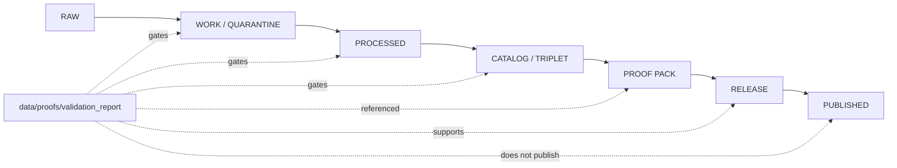

<!-- [KFM_META_BLOCK_V2]
doc_id: kfm://data/proofs/validation-report/readme
title: data/proofs/validation_report README
type: directory-readme
version: v0.2
status: draft
owners:
  - TODO(owner): data steward
  - TODO(owner): validation steward
  - TODO(owner): proof steward
  - TODO(owner): release steward
created: 2026-06-25
updated: 2026-06-25
policy_label: public-review
path: data/proofs/validation_report/README.md
related:
  - ../README.md
  - ../proof_pack/README.md
  - ../evidence_bundle/README.md
  - ../citation_validation/README.md
  - ../review/README.md
  - ../integrity/README.md
  - ./atmosphere/README.md
  - ./flora/README.md
  - ../../receipts/README.md
  - ../../catalog/README.md
  - ../../published/README.md
  - ../../../release/README.md
  - ../../../docs/adr/ADR-0011-receipts-vs-proofs-vs-manifests-vs-catalog-separation.md
  - ../../../docs/doctrine/directory-rules.md
  - ../../../contracts/README.md
  - ../../../schemas/README.md
  - ../../../policy/README.md
tags:
  - kfm
  - data
  - proofs
  - validation-report
  - validation
  - finite-outcomes
  - evidence-bundle
  - proof-pack
  - review
  - release-gate
  - rollback
notes:
  - "v0.2 expands the compact parent stub into a README-like directory contract using the pasted Markdown authoring rules."
  - "This README describes placement and governance boundaries. It does not prove schemas, validators, fixtures, CI workflows, or emitted ValidationReport instances exist."
[/KFM_META_BLOCK_V2] -->

<a id="top"></a>

# `data/proofs/validation_report/`

> Parent directory for KFM **ValidationReport** proof support: finite validator outcomes that help reviewers inspect whether a candidate is structurally valid, evidence-linked, policy-aware, release-reviewable, and rollback-aware.


> [!IMPORTANT]
> **Status:** `draft`  
> **Owners:** `TODO(owner): data steward` · `TODO(owner): validation steward` · `TODO(owner): proof steward` · `TODO(owner): release steward`  
> **Path:** `data/proofs/validation_report/README.md`  
> **Truth posture:** CONFIRMED directory placement from current repo evidence / PROPOSED ValidationReport object shape / NEEDS VERIFICATION for schemas, validators, fixtures, CI, and emitted report instances.

---

## Quick jumps

| Section | Use it for |
|---|---|
| [1. Scope](#1-scope) | What this directory is for. |
| [2. Repo fit](#2-repo-fit) | How this lane relates to neighboring proof, receipt, catalog, release, and published roots. |
| [3. Accepted inputs](#3-accepted-inputs) | What belongs here. |
| [4. Exclusions](#4-exclusions) | What belongs somewhere else. |
| [5. Directory pattern](#5-directory-pattern) | Suggested child layout. |
| [6. Minimum report shape](#6-minimum-report-shape) | Proposed fields for future machine-readable reports. |
| [7. Result families](#7-result-families) | Suggested validator outcome groups. |
| [8. Lifecycle diagram](#8-lifecycle-diagram) | Where ValidationReports sit in the KFM lifecycle. |
| [9. Maintenance checklist](#9-maintenance-checklist) | Review and upkeep gates. |
| [10. Definition of done](#10-definition-of-done) | What remains before this lane is operational. |

---

## 1. Scope

`data/proofs/validation_report/` is the parent lane for ValidationReport proof-support files and domain-specific validation-report sublanes.

A ValidationReport should record:

- what candidate was checked;
- which validator ran;
- which validator version, schema version, fixture set, and runtime mode were used;
- what input and output digests bound the run;
- which evidence, receipt, policy, review, ProofPack, release, correction, and rollback references are relevant;
- which finite outcome was produced; and
- why that outcome was assigned.

ValidationReports are support artifacts. They do not publish anything by being placed here.

[Back to top](#top)

---

## 2. Repo fit

KFM keeps object families separate so process memory, validation output, evidence support, catalog metadata, release decisions, and public artifacts do not silently replace one another.

| Neighbor | Role | Boundary |
|---|---|---|
| [`../README.md`](../README.md) | Parent `data/proofs/` orientation. | Defines proof-root context. |
| [`../evidence_bundle/`](../evidence_bundle/) | Claim evidence support. | ValidationReports may reference EvidenceBundles, but do not replace them. |
| [`../proof_pack/`](../proof_pack/) | Release-support bundle. | ProofPacks may collect ValidationReport references. |
| [`../citation_validation/`](../citation_validation/) | Citation-specific checks. | Citation validation may feed or complement ValidationReports. |
| [`../review/`](../review/) | Review proof support. | Review proof may reference ValidationReports. |
| [`../../receipts/`](../../receipts/) | Process memory. | Receipts say what ran; ValidationReports state validator outcomes. |
| [`../../catalog/`](../../catalog/) | Discovery and lineage carriers. | Catalog records are not validation outcomes. |
| [`../../published/`](../../published/) | Released public-safe artifacts. | Published carriers are downstream of release gates. |
| [`../../../release/`](../../../release/) | Release decisions, manifests, rollback, correction, withdrawal, signatures. | Release authority stays in `release/`. |
| [`../../../contracts/`](../../../contracts/) | Semantic meaning. | ValidationReport contract meaning belongs there once accepted. |
| [`../../../schemas/`](../../../schemas/) | Machine shape. | JSON Schema belongs there once accepted. |
| [`../../../policy/`](../../../policy/) | Admissibility rules. | ValidationReports record outcomes; they do not define policy. |

> [!WARNING]
> A ValidationReport is not a receipt, EvidenceBundle, ProofPack, policy decision, ReviewRecord, catalog record, ReleaseManifest, rollback card, correction notice, public layer, or published report.

[Back to top](#top)

---

## 3. Accepted inputs

Use this directory for validation-report support files that are safe to store under repo policy and useful for review, release, correction, rollback, or audit.

| Accepted item | Suggested placement | Status |
|---|---|---|
| Domain lane README | `data/proofs/validation_report/<domain>/README.md` | CONFIRMED pattern for authored sublanes. |
| Candidate report | `data/proofs/validation_report/<domain>/candidates/<run_id>.validation-report.json` | PROPOSED until schema exists. |
| Failure report | `data/proofs/validation_report/<domain>/failures/<run_id>.validation-report.json` | PROPOSED. |
| Release-review report | `data/proofs/validation_report/<domain>/release/<release_id>.validation-report.json` | PROPOSED. |
| Retired report | `data/proofs/validation_report/<domain>/retired/<run_id>.superseded-validation-report.json` | PROPOSED. |
| Index | `data/proofs/validation_report/<domain>/indexes/validation-report-index.json` | Optional lookup aid, not authority. |
| Cross-domain report lane | `data/proofs/validation_report/cross_domain/<scope>/` | PROPOSED; use only when one domain cannot own the validation scope. |

### Authored sublanes

| Lane | Purpose |
|---|---|
| [`atmosphere/`](./atmosphere/) | Atmosphere / Air validation-report support. |
| [`flora/`](./flora/) | Flora validation-report support. |

[Back to top](#top)

---

## 4. Exclusions

| Excluded material | Correct home |
|---|---|
| Source payloads or working data | `data/raw/`, `data/work/`, or `data/quarantine/` |
| Process receipts | `data/receipts/` |
| EvidenceBundle instances | `data/proofs/evidence_bundle/` |
| ProofPack instances | `data/proofs/proof_pack/` |
| Review proof objects | `data/proofs/review/` |
| Catalog records | `data/catalog/` |
| Release manifests, promotion decisions, rollback cards, correction notices | `release/` |
| Published layers, reports, or API payloads | `data/published/` after release gates |
| Policy logic | `policy/` |
| Machine schemas | `schemas/` |
| Semantic contracts | `contracts/` |

[Back to top](#top)

---

## 5. Directory pattern

```text
data/proofs/validation_report/
├── README.md
├── <domain>/
│   ├── README.md
│   ├── candidates/
│   ├── failures/
│   ├── indexes/
│   ├── release/
│   └── retired/
└── cross_domain/
    └── <scope>/
```

> [!NOTE]
> This tree is a proposed pattern for future instances. The currently verified authored sublanes are `atmosphere/` and `flora/`.

[Back to top](#top)

---

## 6. Minimum report shape

A future machine-readable ValidationReport should include at least the following fields. This list is **PROPOSED** until backed by a semantic contract, JSON Schema, fixtures, and validator tooling.

| Field | Purpose |
|---|---|
| `validation_report_id` | Stable report identity. |
| `domain` | Domain or `cross_domain` scope. |
| `validator_family` | Result family such as schema, evidence, release readiness, or dry-run check. |
| `validator_name` | Specific validator ID. |
| `validator_version` | Tool, ruleset, or commit version. |
| `schema_version` | Schema or contract shape used. |
| `fixture_set_ref` | Fixture pack or no-network test set. |
| `run_id` | Execution identity. |
| `candidate_ref` | Object, file, layer, release candidate, or proof candidate checked. |
| `input_digest` | Hash or digest of validator input. |
| `output_digest` | Hash or digest of validated output where applicable. |
| `evidence_bundle_refs` | Evidence support used or required. |
| `receipt_refs` | Process-memory references. |
| `review_record_refs` | Human/steward review references where required. |
| `proof_pack_refs` | ProofPack refs that consume or reference the report. |
| `release_refs` | Release candidate, correction, withdrawal, or rollback refs. |
| `finite_outcome` | `PASS`, `WARN`, `HOLD`, `ABSTAIN`, `DENY`, `RESTRICT`, `ERROR`, or `READY_FOR_REVIEW`. |
| `reasons` | Machine-readable reason list. |
| `created_at` / `created_by` | Creation metadata. |

[Back to top](#top)

---

## 7. Result families

| Family | Use |
|---|---|
| `schema_shape` | Contract and JSON shape checks. |
| `source_role` | Source-use discipline. |
| `rights_policy` | Rights and policy-gate checks. |
| `evidence_resolution` | EvidenceRef and EvidenceBundle closure. |
| `time_semantics` | Source, observed, valid, retrieval, release, and correction time checks. |
| `identity_integrity` | Stable identity and digest checks. |
| `public_surface_readiness` | Public carrier readiness. |
| `catalog_closure` | Catalog and graph/triplet closure. |
| `release_readiness` | Release, correction, and rollback support. |
| `dry_run_ci` | Deterministic fixture-based validation. |

[Back to top](#top)

---

## 8. Lifecycle diagram



Promotion remains a governed release action. A ValidationReport can support that action, but does not perform it.

[Back to top](#top)

---

## 9. Maintenance checklist

Before using or accepting a ValidationReport file, verify:

- [ ] The report identifies validator, version, schema, fixture set, run ID, candidate, and digest refs.
- [ ] The report uses finite outcomes.
- [ ] Evidence, receipt, review, ProofPack, release, correction, and rollback references are present where required.
- [ ] The report does not duplicate source payloads.
- [ ] The report does not act as release authority.
- [ ] Public clients do not read this path directly.
- [ ] Domain-specific rules are handled in the relevant sublane README.

[Back to top](#top)

---

## 10. Definition of done

This lane is operationally useful when:

- [ ] A semantic ValidationReport contract exists.
- [ ] A machine-checkable ValidationReport schema exists.
- [ ] Validator tooling emits this report shape.
- [ ] Valid and invalid fixtures exist.
- [ ] CI checks finite outcomes, evidence closure, family separation, and rollback support.
- [ ] Active domain sublanes have README files before live report instances land there.
- [ ] A synthetic no-network release candidate demonstrates receipt → validation report → proof pack → release → rollback traceability.

---

## Maintainer note

ValidationReports should make gates inspectable without making governance invisible. Keep them compact, deterministic, reference-rich, finite, and reversible. When evidence, policy, validator identity, schema identity, release state, or rollback support is incomplete, hold the candidate instead of treating validation text as publication authority.
