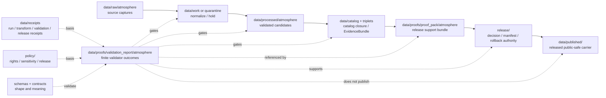

<!-- [KFM_META_BLOCK_V2]
doc_id: kfm://data/proofs/validation-report/atmosphere/readme
title: data/proofs/validation_report/atmosphere README
type: directory-readme
version: v0.1
status: draft
owners:
  - <data steward — TODO>
  - <validation steward — TODO>
  - <proof steward — TODO>
  - <atmosphere-domain steward — TODO>
  - <release steward — TODO>
created: 2026-06-25
updated: 2026-06-25
policy_label: public-review
path: data/proofs/validation_report/atmosphere/README.md
related:
  - ../../README.md
  - ../README.md
  - ../../proof_pack/atmosphere/README.md
  - ../../atmosphere/README.md
  - ../../evidence_bundle/README.md
  - ../../citation_validation/README.md
  - ../../review/README.md
  - ../../integrity/README.md
  - ../../../receipts/README.md
  - ../../../catalog/README.md
  - ../../../published/README.md
  - ../../../../release/README.md
  - ../../../../docs/domains/atmosphere/ARCHITECTURE.md
  - ../../../../docs/domains/atmosphere/DATA_LIFECYCLE.md
  - ../../../../docs/doctrine/directory-rules.md
  - ../../../../docs/doctrine/lifecycle-law.md
  - ../../../../docs/doctrine/trust-membrane.md
  - ../../../../contracts/README.md
  - ../../../../schemas/README.md
  - ../../../../policy/README.md
tags:
  - kfm
  - data
  - proofs
  - validation-report
  - atmosphere
  - air-quality
  - climate
  - smoke
  - weather
  - aqi
  - aod
  - pm25
  - low-cost-sensors
  - model-fields
  - advisory-context
  - dry-run
  - release-gate
  - rollback
  - cite-or-abstain
notes:
  - "Directory README for Atmosphere validation-report support. It is not itself a ValidationReport instance, schema, ProofPack, policy bundle, ReleaseManifest, catalog record, or published atmosphere layer."
  - "Atmosphere validation reports must fail closed on AQI-as-concentration, AOD-as-PM2.5, model-as-observation, uncorrected low-cost-sensor release, stale-source misuse, missing official advisory redirect, and live-fetch-in-CI behavior."
  - "Validation reports support proof and release review; they do not publish, approve, or replace EvidenceBundles, policy decisions, ReviewRecords, or release authority."
[/KFM_META_BLOCK_V2] -->

<a id="top"></a>

# `data/proofs/validation_report/atmosphere/`

> Domain lane for **Atmosphere ValidationReport support**. Files under this directory should make atmosphere validator outcomes inspectable, finite, reproducible, evidence-linked, policy-aware, and usable by ProofPacks, review proof, release decisions, correction paths, and rollback targets.


> [!IMPORTANT]
> **Status:** `draft`  
> **Owner:** `<data steward>` · `<validation steward>` · `<proof steward>` · `<atmosphere-domain steward>` · `<release steward>` — TODO  
> **Path:** `data/proofs/validation_report/atmosphere/README.md`  
> **Truth posture:** CONFIRMED doctrine / PROPOSED implementation guidance / NEEDS VERIFICATION for emitted validation reports, schemas, validators, fixtures, CI wiring, and release-gate enforcement.

> [!WARNING]
> A validation report is **not** a release decision. It may support `ProofPack`, `ReviewRecord`, `PolicyDecision`, `ReleaseManifest`, correction, and rollback workflows, but it must not become a parallel approval, catalog, or publication authority.

---

## Quick jumps

| Section | Use it for |
|---|---|
| [1. Purpose](#1-purpose) | What this directory is for. |
| [2. Placement and authority](#2-placement-and-authority) | Why this path belongs under `data/proofs/validation_report/`. |
| [3. What belongs here](#3-what-belongs-here) | Accepted validation-report objects and support files. |
| [4. What must not live here](#4-what-must-not-live-here) | Exclusions and wrong homes. |
| [5. Atmosphere validation responsibilities](#5-atmosphere-validation-responsibilities) | Domain-specific validator obligations. |
| [6. Required validation result families](#6-required-validation-result-families) | Minimum result categories. |
| [7. Validator gates](#7-validator-gates) | Hard denial and hold conditions. |
| [8. Naming and identity](#8-naming-and-identity) | Suggested file naming and metadata. |
| [9. Lifecycle relationship](#9-lifecycle-relationship) | How ValidationReports support RAW → PUBLISHED. |
| [10. Review checklist](#10-review-checklist) | Maintainer checklist. |
| [11. Failure modes](#11-failure-modes) | Drift and overclaim patterns to block. |
| [12. Definition of done](#12-definition-of-done) | What is still needed for operational maturity. |

---

## 1. Purpose

`data/proofs/validation_report/atmosphere/` stores validation-report support for the Atmosphere / Air / Climate lane: air observations, AQI reports, PM2.5/ozone records, regulatory archives, low-cost sensors, model fields, remote-sensing masks, smoke context, weather observations, climate normals/anomalies, fusion products, advisory context, station/network metadata, and public-safe atmosphere products.

A validation report here should answer:

- What candidate, source run, transform, layer, API payload, Evidence Drawer payload, or release candidate was validated?
- Which validator version, schema version, fixture set, policy basis, input digest, output digest, and runtime mode produced the result?
- Which knowledge-character labels were checked and preserved?
- Did hard validators block AQI-as-concentration, AOD-as-PM2.5, model-as-observation, uncorrected low-cost-sensor release, stale-source misuse, unit/time errors, missing official advisory redirect, and live fetches during dry-run/CI?
- Which outcomes are `PASS`, `WARN`, `HOLD`, `ABSTAIN`, `DENY`, or `ERROR`, and why?
- Which EvidenceBundles, policy decisions, review records, proof packs, release candidates, correction paths, and rollback targets should consume the report?

This directory is for **validation-report support**, not source data, policy code, schemas, ProofPacks, release manifests, public map layers, or emergency/life-safety instructions.

[Back to top](#top)

---

## 2. Placement and authority

KFM places files by responsibility root. `data/proofs/validation_report/` holds validation-report proof artifacts and domain validation-report lanes. The `atmosphere/` segment narrows that responsibility to the Atmosphere domain.

| Surface | Role | Boundary |
|---|---|---|
| [`../../README.md`](../../README.md) | Parent proof root. | Defines proof-lane expectations; this README narrows them to Atmosphere validation reports. |
| [`../README.md`](../README.md) | ValidationReport family root. | Greenfield/stub at time of authoring; this file documents the atmosphere domain sublane. |
| [`../../proof_pack/atmosphere/README.md`](../../proof_pack/atmosphere/README.md) | Atmosphere ProofPack lane. | ProofPacks should reference validation reports; validation reports do not become ProofPacks. |
| [`../../atmosphere/README.md`](../../atmosphere/README.md) | Broader Atmosphere proof lane. | Domain proof may cite validation reports; this lane is specifically validation-report support. |
| [`../../../receipts/`](../../../receipts/) | Operation memory. | Validation receipts or run receipts may be basis refs; reports here summarize finite validator outcomes. |
| [`../../../catalog/`](../../../catalog/) | Catalog closure and EvidenceBundle discovery. | Validation reports may gate catalog closure but are not catalog records. |
| [`../../../../release/`](../../../../release/) | Release decisions, manifests, corrections, rollback cards. | Validation reports support release decisions; they do not make them. |
| [`../../../published/`](../../../published/) | Released public-safe artifacts. | Published artifacts are downstream and require release gates. |
| [`../../../../policy/`](../../../../policy/) | Rights, sensitivity, release, and runtime policy. | Validation reports record policy-relevant outcomes; policy logic lives in policy roots. |
| [`../../../../schemas/`](../../../../schemas/) | Machine shape. | ValidationReport schemas belong under the approved schema home. |
| [`../../../../contracts/`](../../../../contracts/) | Object meaning. | ValidationReport semantics belong in contracts. |

> [!NOTE]
> This README documents a subdirectory that already exists in the repository. It does not create a new lifecycle phase or parallel validation authority.

[Back to top](#top)

---

## 3. What belongs here

Use this folder for validation-report files that are safe to store under repository policy and useful for review, release, correction, rollback, or audit.

| Accepted item | Suggested placement | Notes |
|---|---|---|
| Candidate validation report | `data/proofs/validation_report/atmosphere/candidates/<run_id>.validation-report.json` | PROPOSED until schema and validator are confirmed. |
| Release validation report | `data/proofs/validation_report/atmosphere/release/<release_id>.validation-report.json` | Should reference the release candidate and ProofPack. |
| Failed validation report | `data/proofs/validation_report/atmosphere/failures/<run_id>.validation-report.json` | Useful for audit, correction, quarantine, and negative fixtures. |
| Validator index | `data/proofs/validation_report/atmosphere/indexes/validation-report-index.json` | Optional lookup aid; not canonical truth by itself. |
| Valid/invalid fixtures | Prefer approved fixture homes unless this directory is explicitly scoped for local examples | Fixture home remains NEEDS VERIFICATION. |
| Superseded report | `data/proofs/validation_report/atmosphere/retired/<run_id>.superseded-validation-report.json` | Keep for audit; do not silently delete prior validator meaning. |

Validation reports should use stable references and digests rather than duplicating raw payloads.

[Back to top](#top)

---

## 4. What must not live here

| Excluded material | Correct home or action | Why |
|---|---|---|
| Raw API responses, sensor exports, rasters, model files, advisory text dumps, or source captures | `data/raw/atmosphere/`, `data/work/atmosphere/`, or `data/quarantine/atmosphere/` | Validation reports reference source material; they do not store it. |
| Working normalized records or candidate layers | `data/work/` or `data/processed/` after validation | Validation reports are proof artifacts, not canonical data. |
| Policy logic or release rules | `policy/domains/atmosphere/` or other approved policy roots | Reports record outcomes, not policy definitions. |
| JSON Schemas | `schemas/contracts/v1/...` | Machine shape belongs in schemas. |
| Semantic contracts | `contracts/...` | Meaning belongs in contracts. |
| ProofPack instances | `data/proofs/proof_pack/atmosphere/` | ProofPacks assemble multiple support refs; validation reports are one input family. |
| ReleaseManifest, PromotionDecision, CorrectionNotice, WithdrawalNotice, or RollbackCard as authority | `release/` | Validation reports may reference these but must not become release authority. |
| Published PMTiles, GeoParquet, API payloads, reports, stories, or map layers | `data/published/...` after release gates | Published artifacts are downstream carriers. |
| Emergency instructions, evacuation/routing advice, health directives, or life-safety guidance | Do not publish through KFM; redirect to official authority | Atmosphere is context/evidence, not emergency alerting. |

[Back to top](#top)

---

## 5. Atmosphere validation responsibilities

A validation report in this lane should support one or more of these responsibilities:

1. **Knowledge-character validation** — every observation, report, model field, mask, advisory context, normal/anomaly, and fusion product carries the correct knowledge-character label.
2. **Conflation denial** — AQI is not concentration; AOD is not PM2.5; model fields are not observations; low-cost sensors require correction, caveats, confidence, and limitations.
3. **Unit/time validation** — units, issue time, expiry time, observed time, valid time, model run time, retrieval time, release time, and correction time remain distinct where material.
4. **Freshness and stale-state validation** — realtime/current-context products show cadence, freshness threshold, stale-state result, and visible stale posture where needed.
5. **Low-cost sensor validation** — calibration/correction, trust state, confidence, limitations, station/network context, and source role are checked before public use.
6. **Advisory-context validation** — official-source reference, issue/expiry time, and redirect posture are present; KFM does not reproduce life-safety instructions as advice.
7. **Dry-run validation** — CI/validation must not perform live upstream fetches, sensor traffic, or nondeterministic external calls.
8. **Rights and sensitivity validation** — unresolved source rights, private station/network metadata, sensitive joins, or unsafe aggregation block promotion.
9. **Release-support validation** — reports provide finite outcomes for ProofPack, ReviewRecord, catalog closure, release, correction, and rollback workflows.

[Back to top](#top)

---

## 6. Required validation result families

| Result family | Required checks | Finite outcomes |
|---|---|---|
| `schema_shape` | Required fields, enum values, version pins, JSON structure. | `PASS`, `WARN`, `ERROR` |
| `knowledge_character` | Correct label for observed sensor, public AQI report, regulatory archive, low-cost sensor, model field, remote-sensing mask, climate anomaly, derived fusion, advisory context. | `PASS`, `DENY`, `ERROR` |
| `source_role` | Source role for this use; no role inferred from brand or convenience. | `PASS`, `WARN`, `DENY`, `ABSTAIN` |
| `unit_semantics` | µg/m³, ppb, AQI bucket, index category, model unit, raster scale, station channel. | `PASS`, `DENY`, `ERROR` |
| `time_semantics` | Observed/valid/issue/expiry/model-run/retrieval/release/correction time separation. | `PASS`, `WARN`, `HOLD`, `ERROR` |
| `freshness_stale_state` | Cadence, freshness threshold, stale flag, expiry behavior. | `PASS`, `WARN`, `HOLD`, `DENY` |
| `low_cost_sensor` | Correction, calibration, caveats, confidence, limitations, network metadata. | `PASS`, `HOLD`, `DENY` |
| `model_remote_sensing` | Model-as-model, AOD-as-AOD, mask-as-mask, no observation collapse. | `PASS`, `DENY` |
| `advisory_context` | Official source, issue/expiry, redirect, no life-safety advice. | `PASS`, `DENY`, `ERROR` |
| `rights_sensitivity` | Source rights, private metadata, sensitive joins, access tier, redaction/generalization. | `PASS`, `RESTRICT`, `DENY`, `ABSTAIN` |
| `catalog_release_readiness` | EvidenceRef, EvidenceBundle, catalog closure, policy, review, rollback refs. | `READY_FOR_REVIEW`, `HOLD`, `DENY`, `ERROR` |

[Back to top](#top)

---

## 7. Validator gates

| Gate | Required proof | Failure outcome |
|---|---|---|
| AQI as concentration | Validator proves AQI values are not treated as µg/m³, ppb, or measured concentration. | `DENY` release or require correction. |
| AOD as PM2.5 | Validator proves AOD is not treated as surface PM2.5 concentration. | `DENY` or require relabeling/model explanation. |
| Model as observation | Validator proves HRRR-Smoke, CAMS, forecasts, and fusion/model fields are not labeled as observed truth. | `DENY` or require model-context labeling. |
| Low-cost sensor public release | Validator checks correction, caveats, confidence, trust state, limitations, and public label. | `HOLD`, `RESTRICT`, or `DENY`. |
| Advisory context | Validator checks official-source reference, issue/expiry, redirect language, and no KFM life-safety advice. | `DENY` unsafe wording. |
| Freshness/staleness | Validator checks cadence, retrieval time, expiry, stale threshold, and stale badge. | `HOLD`, `ABSTAIN`, or stale-state output. |
| Unit conversion | Validator checks recorded conversion, method/version, original unit, target unit, and receipt reference. | `ERROR` or `HOLD`. |
| Dry-run / CI | Validator proves no live fetches during dry-run validation. | `ERROR` or workflow failure. |
| Sensitive joins | Validator checks facility, residence, school, hospital, small-population, private-network, or other sensitive joins. | `DENY`, aggregate, generalize, or restrict. |
| Release readiness | Validator checks EvidenceBundle, PolicyDecision, ReviewRecord where required, release candidate, correction path, and rollback target. | `HOLD` or `DENY`. |

[Back to top](#top)

---

## 8. Naming and identity

Suggested directory pattern:

```text
data/proofs/validation_report/atmosphere/<family>/<run_or_release_id>.validation-report.json
```

Suggested deterministic file name:

```text
atmosphere.validation_report.<validator_family>.<scope>.<run_or_release_id>.<short_hash>.json
```

Examples:

```text
atmosphere.validation_report.knowledge_character.pm25-hourly-demo.run-20260625.0123abcd.json
atmosphere.validation_report.low_cost_sensor.public-summary-demo.run-20260625.89ab4567.json
atmosphere.validation_report.model_remote_sensing.hrrr-smoke-context-demo.run-20260625.4567cdef.json
atmosphere.validation_report.advisory_context.official-redirect-demo.run-20260625.cdef0123.json
```

Minimum validation-report metadata should include:

- `validation_report_id`
- `domain: atmosphere`
- `validator_family`
- `validator_name`
- `validator_version`
- `schema_version`
- `fixture_set_ref`
- `run_id`
- `candidate_ref`
- `release_candidate_ref` where applicable
- `input_digest`
- `output_digest`
- `source_descriptor_refs`
- `evidence_bundle_refs`
- `receipt_refs`
- `policy_decision_refs`
- `review_record_refs`
- `proof_pack_refs`
- `release_refs`
- `rollback_refs`
- `knowledge_character_results`
- `time_semantics_results`
- `unit_semantics_results`
- `rights_sensitivity_results`
- `finite_outcome`
- `reasons`
- `created_at`
- `created_by`

[Back to top](#top)

---

## 9. Lifecycle relationship



Validation reports make gate results inspectable. They do not publish, approve, or replace release authority by placement.

[Back to top](#top)

---

## 10. Review checklist

Before an Atmosphere validation report is used in ProofPack, review, release, correction, or rollback work, verify:

- [ ] The report identifies candidate scope, run ID, validator family, validator version, schema version, fixture set, input digest, and output digest.
- [ ] Results are finite and use expected outcomes, not free-text-only status.
- [ ] Knowledge-character labels are checked and preserved.
- [ ] AQI-as-concentration, AOD-as-PM2.5, model-as-observation, and uncorrected-low-cost-sensor cases are exercised.
- [ ] Unit, issue time, expiry time, observed time, valid time, model run time, retrieval time, release time, and correction time checks are present where material.
- [ ] Low-cost sensor reports include correction, caveats, confidence, trust state, limitations, and station/network context checks.
- [ ] Advisory context checks require official source, issue/expiry time, redirect language, and no KFM life-safety advice.
- [ ] Dry-run/CI validation proves no live upstream fetches.
- [ ] Source rights, source role, sensitivity, freshness, stale state, and private/sensitive joins are checked.
- [ ] EvidenceBundle, PolicyDecision, ReviewRecord, ProofPack, release candidate, correction path, and rollback refs are present where required.
- [ ] The validation report does not include raw restricted payloads or become a release manifest.

[Back to top](#top)

---

## 11. Failure modes

| Failure mode | Why it matters | Required response |
|---|---|---|
| Validation report stores raw source payloads | Collapses validation support into source storage. | Move payload to lifecycle homes; keep refs/digests here. |
| AQI bucket passes as concentration | Publishes misleading air-quality meaning. | Deny release and correct labels/units. |
| AOD passes as surface PM2.5 | Remote-sensing context becomes false concentration claim. | Deny or relabel as AOD/model/context. |
| Model field passes as observation | Forecast/model output becomes observed truth. | Deny and require model-field label. |
| Low-cost sensor passes without caveats/correction | Public users may overtrust non-reference-grade data. | Hold, restrict, or deny until support exists. |
| Advisory text becomes KFM instruction | KFM is not the issuing emergency/life-safety authority. | Deny and replace with official-source redirect. |
| Live fetch occurs during dry-run validation | CI becomes nondeterministic and may violate source boundaries. | Fail workflow and require fixtures. |
| Validation report acts as ReleaseManifest | Collapses validation with release authority. | Move authority to `release/`; keep a reference here. |
| Report has no rollback/correction refs for release-significant candidate | Release review is not reversible. | Hold release review. |

[Back to top](#top)

---

## 12. Definition of done

This sublane is operationally useful when:

- [ ] `data/proofs/validation_report/README.md` defines or links the parent ValidationReport family contract.
- [ ] Atmosphere ValidationReport schema and semantic contract exist under approved homes.
- [ ] Valid and invalid fixtures exist for AQI/concentration, AOD/PM2.5, model/observation, low-cost sensor, advisory context, stale source, sensitive join, unresolved rights, missing EvidenceBundle, missing rollback, and live-fetch-in-CI failures.
- [ ] CI runs the atmosphere validation suite and blocks release-significant failures.
- [ ] Atmosphere ProofPacks reference validation reports by stable ID and digest.
- [ ] Release docs require validation-report closure for public atmosphere layers, Evidence Drawer payloads, Focus Mode surfaces, and correction/rollback candidates.
- [ ] CODEOWNERS or equivalent review ownership covers validation steward, atmosphere steward, proof steward, policy/sensitivity reviewer where required, and release steward.
- [ ] At least one synthetic no-network Atmosphere candidate demonstrates: fixture/source refs → validation report → EvidenceBundle / catalog closure → ProofPack → ReleaseManifest → public-safe artifact → rollback.

---

## Maintainer note

Atmosphere validation reports are where misleading map certainty should be stopped early. Keep validator outputs finite, citeable, deterministic, and strict about knowledge character, source role, units, time, stale state, low-cost sensor caveats, advisory boundaries, and rollback. If a candidate is unclear, the correct outcome is `HOLD`, `ABSTAIN`, `DENY`, or `ERROR`, not a polished public layer.
