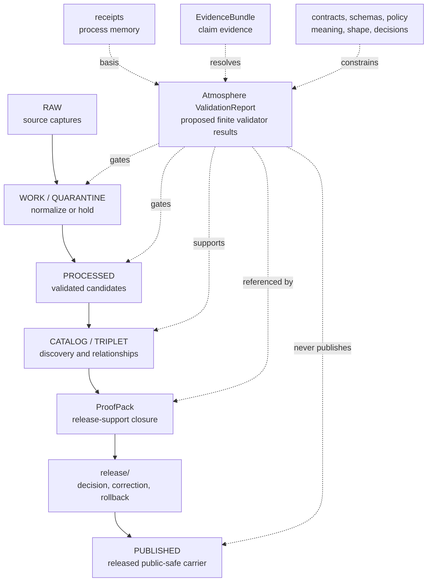

<!-- [KFM_META_BLOCK_V2]
doc_id: kfm://data/proofs/validation-report/atmosphere/readme
title: data/proofs/validation_report/atmosphere/ — Atmosphere ValidationReport Support
type: directory-readme; proof-support-child-lane; atmosphere-validation-boundary
version: v0.2.0
status: repository-grounded draft; accepted ValidationReport contract, schema, producer, validator, instances, and CI graduation not established
owners:
  - "@bartytime4life — verified CODEOWNERS routing for /data/proofs/; routing is not stewardship, approval, or proof of review"
  - "NEEDS VERIFICATION — Atmosphere, validation, proof, evidence, policy, sensitivity, release, correction, and rollback stewardship assignments"
created: 2026-06-25
updated: 2026-07-26
prepared_under_prompt: KFM Markdown Modernization & GitHub Documentation Implementation Agent v4.0.0
policy_label: public-review; proof-support; atmosphere; no-direct-public-path; release-gated; cite-or-abstain; not-emergency-authority
path: data/proofs/validation_report/atmosphere/README.md
owning_root: data/
artifact_family: proofs/validation_report
domain: atmosphere
truth_posture: >
  CONFIRMED exact target path and prior blob, canonical proofs-root boundary, substantive
  ValidationReport parent README, Atmosphere proof and ProofPack support documents,
  Atmosphere semantic-contract index, proposed schema inventory, fixture and test
  documentation, validator index, policy README, release-candidate guide, explicit
  domain-workflow holds, and CODEOWNERS routing / PROPOSED accepted Atmosphere
  ValidationReport profile, stable identity, report shape, result-family vocabularies,
  deterministic producer and validator, proof handoff, correction propagation, and
  rollback behavior / UNKNOWN recursive report payload inventory, active writers and
  consumers, external stores, access controls, resolver behavior, public routes, caches,
  hosting, and runtime effects / NEEDS VERIFICATION accountable owners, accepted semantic
  contract and schema, fixtures, executable validators and tests, policy enforcement,
  emitted reports, CI graduation, review and release linkage, retention, correction,
  withdrawal, and rollback drills
evidence_snapshot:
  repository: bartytime4life/Kansas-Frontier-Matrix
  base_ref: main
  base_commit: b4102655f0f3e5665941150c93822a25375b547c
  prior_blob: 3b67083fa791b33d379b2b6fc6810c8c2f046d87
  directory_rules_proposed_blob: fd49a0b83e55cef52c1124281f093e263526898d
  directory_rules_adoption_adr_blob: d34e24ff322bf2a8077379eb2803811dcf8924e5
  proofs_root_blob: 0d8b6e92d3b4b9ff3961d29c53ead497922a31cf
  validation_report_parent_blob: 30cf9cdeebef4d1d4228d180d5f9345e78bad60a
  atmosphere_proof_blob: c85bea4e5524b934eef66fa7d8bc65f7036d0726
  atmosphere_proof_pack_blob: d7c1e849316d6ee67993c44b5e1154e5241acd86
  atmosphere_contract_index_blob: 2626d011b5d80e6d58870be3eff817d95116ffc7
  atmosphere_schema_index_blob: 1165bd4719fff2c17ce4e7f5253fa8af8315f333
  atmosphere_fixture_index_blob: 3046c1246e4f6999a1c1eae0040a47b49012d52f
  atmosphere_test_index_blob: 6474cc33c3bdd668fd8713e06e94f7dacda97b6b
  atmosphere_validator_index_blob: 0bdf0d021a093b61cdeca0686a936cd91c1af318
  atmosphere_policy_blob: d897f4f67458f9d12e0ef2b2e7146eeba935df4b
  atmosphere_release_candidate_blob: 2cff863a65c035cc167583ecae481c03580fc24a
  atmosphere_workflow_blob: 3bd0183481a73c1aaad011e4ef1e361a3ee6b5f2
  codeowners_blob: dd2a84aa514d8ecd9208bc347f90f9a2ed37dd61
documentation_rollback_target: 3b67083fa791b33d379b2b6fc6810c8c2f046d87
related:
  - ../../README.md
  - ../README.md
  - ../../atmosphere/README.md
  - ../../proof_pack/atmosphere/README.md
  - ../../evidence_bundle/atmosphere/README.md
  - ../../citation_validation/atmosphere/README.md
  - ../../review/README.md
  - ../../../receipts/README.md
  - ../../../catalog/README.md
  - ../../../published/README.md
  - ../../../../contracts/domains/atmosphere/README.md
  - ../../../../schemas/contracts/v1/domains/atmosphere/README.md
  - ../../../../fixtures/domains/atmosphere/README.md
  - ../../../../tests/domains/atmosphere/README.md
  - ../../../../tools/validators/domains/atmosphere/README.md
  - ../../../../policy/domains/atmosphere/README.md
  - ../../../../release/candidates/atmosphere/README.md
  - ../../../../release/README.md
  - ../../../../docs/domains/atmosphere/ARCHITECTURE.md
  - ../../../../docs/domains/atmosphere/DATA_LIFECYCLE.md
  - ../../../../docs/doctrine/directory-rules.md
  - ../../../../docs/doctrine/lifecycle-law.md
  - ../../../../docs/doctrine/trust-membrane.md
  - ../../../../docs/adr/ADR-0011-receipts-vs-proofs-vs-manifests-vs-catalog-separation.md
  - ../../../../docs/adr/ADR-0029-adopt-directory-governance-standard-v2.md
  - ../../../../.github/workflows/domain-atmosphere.yml
  - ../../../../.github/CODEOWNERS
notes:
  - "Same-path Markdown modernization only; no ValidationReport payload, contract, schema, fixture, validator, test, policy, workflow, candidate, release object, route, access control, or publication state changed."
  - "The current domain-atmosphere workflow is an explicit readiness hold. A green held run is not executable Atmosphere validation, a ValidationReport, proof closure, release readiness, or publication."
  - "The bounded inspection did not establish a dedicated accepted ValidationReport semantic contract, machine schema, deterministic producer or validator, emitted report inventory, or graduated CI gate."
  - "All prior Atmosphere anti-collapse, units, time, freshness, advisory, rights, sensitivity, no-network, evidence, release, correction, and rollback requirements are retained as a proposed validation profile."
  - "The documentation rollback target for v0.2.0 is prior blob 3b67083fa791b33d379b2b6fc6810c8c2f046d87."
[/KFM_META_BLOCK_V2] -->

<a id="top"></a>

# `data/proofs/validation_report/atmosphere/`

> **One-line purpose.** Define the bounded Atmosphere ValidationReport support lane and the fail-closed profile that future deterministic reports must satisfy without becoming source truth, policy, review, release, publication, regulatory, medical, or emergency authority.

[](#13-current-repository-status)
[](#2-placement-and-authority)
[](#current-enforcement-posture)
[](#10-review-checklist)

> [!IMPORTANT]
> **Validation support is not validation authority.** This README defines a repository-grounded, proposed Atmosphere report profile. It does not prove that a report contract, schema, producer, validator, instance, policy evaluator, CI gate, release decision, or public artifact exists or passed.

> [!WARNING]
> Keep raw source material, credentials, private station or network details, harmful-precision joins, restricted terms, and life-safety instructions out of this ordinary repository lane. Reference governed evidence and restricted stores through approved identifiers, and fail closed when safe resolution is unavailable.

- **Path:** `data/proofs/validation_report/atmosphere/README.md`
- **Owning responsibility:** [`data/proofs/`](../../README.md)
- **Current document state:** repository-grounded draft
- **Current executable posture:** explicit workflow hold
- **Direct public access:** denied
- **Documentation rollback target:** prior blob `3b67083fa791b33d379b2b6fc6810c8c2f046d87`

**Quick navigation:** [Purpose](#1-purpose) · [Authority](#2-placement-and-authority) · [Belongs](#3-what-belongs-here) · [Exclusions](#4-what-must-not-live-here) · [Responsibilities](#5-atmosphere-validation-responsibilities) · [Results](#6-required-validation-result-families) · [Gates](#7-validator-gates) · [Identity](#8-naming-and-identity) · [Lifecycle](#9-lifecycle-relationship) · [Review](#10-review-checklist) · [Failures](#11-failure-modes) · [Done](#12-definition-of-done) · [Repository status](#13-current-repository-status) · [Evidence](#14-repository-evidence-ledger) · [Verification](#15-open-verification-register) · [No-loss](#16-no-loss-ledger) · [Rollback](#17-rollback)

---

## 1. Purpose

`data/proofs/validation_report/atmosphere/` is the Atmosphere / Air specialization of the parent [ValidationReport proof-support lane](../README.md).

Its durable job is to make future validator outcomes inspectable for Atmosphere candidates involving:

- air observations, AQI reports, PM2.5 and ozone records;
- regulatory archives and low-cost sensor products;
- model fields, forecasts, AOD, remote-sensing masks, and smoke context;
- weather observations, stations, climate normals, and anomalies;
- derived or fusion products and advisory context; and
- downstream proof, catalog, review, release, correction, withdrawal, and rollback dependencies.

A future accepted report should make it possible to determine:

1. which candidate and immutable input digest were evaluated;
2. which accepted contract, schema, validator, ruleset, fixture set, policy basis, and runtime mode applied;
3. which source roles and knowledge characters were preserved;
4. which units, time facets, freshness state, rights, sensitivity, evidence, and release-support gates ran;
5. which finite result vocabulary applied to each result family; and
6. which receipts, EvidenceBundles, ProofPacks, review records, release candidates, correction records, and rollback targets consume or constrain the result.

The report profile remains **PROPOSED** until accepted semantic and machine contracts, deterministic tooling, representative fixtures, executable tests, and review evidence establish it.

[Back to top](#top)

---

## 2. Placement and authority

The supplied Directory Rules baseline places validation-report proof support under `data/proofs/validation_report/`; the `atmosphere/` segment narrows the responsibility to the Atmosphere domain. The repository's Directory Rules v2 successor repeats the proof-lane boundary but remains `proposed` under ADR-0029. This same-path documentation edit creates no new root, lifecycle phase, proof family, schema home, policy home, fixture home, release lane, or public route.

| Surface | Verified role | Boundary for this README |
|---|---|---|
| [`data/proofs/README.md`](../../README.md) | Proof-support responsibility root. | Proofs support evidence, validation, citation, review, integrity, and proof packs; they do not decide release. |
| [`data/proofs/validation_report/README.md`](../README.md) | Substantive draft parent for the proposed ValidationReport family. | Defines parent guidance and an open definition of done; it is not an accepted object contract or schema. |
| [`data/proofs/atmosphere/README.md`](../../atmosphere/README.md) | Atmosphere domain proof support. | May consume validation support; it does not turn reports into Atmosphere truth. |
| [`data/proofs/proof_pack/atmosphere/README.md`](../../proof_pack/atmosphere/README.md) | Atmosphere ProofPack support. | A ProofPack may reference report IDs and digests; a report does not become a ProofPack. |
| [`data/proofs/evidence_bundle/atmosphere/README.md`](../../evidence_bundle/atmosphere/README.md) | Atmosphere EvidenceBundle support. | EvidenceBundle resolution outranks report prose when a claim depends on evidence. |
| [`data/proofs/citation_validation/atmosphere/README.md`](../../citation_validation/atmosphere/README.md) | Atmosphere citation-validation support. | Citation checks may feed a report; neither family replaces the other. |
| [`data/receipts/README.md`](../../../receipts/README.md) | Process memory. | Receipts record what ran; ValidationReports record bounded validator results. |
| [`data/catalog/README.md`](../../../catalog/README.md) | Catalog-stage discovery and lineage support. | A report may support catalog closure; it is not a catalog record. |
| [`release/README.md`](../../../../release/README.md) | Release, correction, withdrawal, and rollback governance. | Release authority stays under `release/`. |
| [`data/published/README.md`](../../../published/README.md) | Released public-safe carriers. | Public clients do not read this proof lane directly. |
| [`contracts/domains/atmosphere/README.md`](../../../../contracts/domains/atmosphere/README.md) | Atmosphere object meaning. | The bounded inventory does not establish a dedicated ValidationReport contract. |
| [`schemas/contracts/v1/domains/atmosphere/README.md`](../../../../schemas/contracts/v1/domains/atmosphere/README.md) | Atmosphere machine-shape index. | The bounded inventory does not establish a dedicated ValidationReport schema. |
| [`policy/domains/atmosphere/README.md`](../../../../policy/domains/atmosphere/README.md) | Atmosphere policy home. | A README does not prove an executable policy decision path. |

### Authority boundary

This lane may support proof and release review. It does **not** own:

- source, observation, model, remote-sensing, advisory, regulatory, or health truth;
- semantic object meaning or machine field shape;
- source admission, source role, rights, sensitivity, or freshness policy;
- human review, separation of duties, promotion, release, correction, withdrawal, or rollback decisions;
- public APIs, maps, tiles, alerts, Evidence Drawer content, Focus Mode content, or governed-AI answers; or
- regulatory, medical, emergency, evacuation, or life-safety guidance.

[Back to top](#top)

---

## 3. What belongs here

An accepted implementation may place compact, immutable, policy-permitted Atmosphere ValidationReport instances or indexes here when contracts, schemas, producers, validators, fixtures, tests, owners, review, retention, and rollback are established.

| Candidate item | Proposed pattern | Admission boundary |
|---|---|---|
| Candidate validation report | `candidates/<run_id>.validation-report.json` | **PROPOSED**; do not materialize a placeholder instance in a canonical proof lane. |
| Release-review validation report | `release/<release_id>.validation-report.json` | **PROPOSED**; supports review but cannot approve release. |
| Failed validation report | `failures/<run_id>.validation-report.json` | **PROPOSED**; must remain public-safe and preserve failure evidence without raw payload duplication. |
| Validation-report index | `indexes/validation-report-index.json` | **PROPOSED** lookup aid; never sovereign truth. |
| Superseded report | `retired/<run_id>.superseded-validation-report.json` | **PROPOSED**; retain identity, reason, successor, and correction lineage. |
| Directory README or bounded migration note | This file or a reviewed local note | May explain boundaries without becoming a report instance. |

Every instance should reference stable IDs and digests instead of copying source payloads, restricted evidence, policy internals, or release records.

Reusable valid and invalid examples belong in the accepted [Atmosphere fixture lane](../../../../fixtures/domains/atmosphere/README.md), not in a competing local fixture home.

[Back to top](#top)

---

## 4. What must not live here

| Excluded material | Governed home or action | Why |
|---|---|---|
| Raw API responses, sensor exports, rasters, model files, advisory dumps, or source captures | `data/raw/atmosphere/`, `data/work/atmosphere/`, or `data/quarantine/atmosphere/` as governed | Reports reference source material; they do not store it. |
| Working normalized records or candidate layers | `data/work/` or `data/processed/` after applicable gates | Validation support is not canonical domain data. |
| Semantic ValidationReport or Atmosphere contracts | `contracts/` after reviewed placement | Meaning does not live in a proof instance lane. |
| JSON Schemas | `schemas/` after reviewed placement | Machine shape does not live here. |
| Policy logic, rights rules, sensitivity rules, or release criteria | `policy/` | Reports record results; they do not define policy. |
| Reusable valid or invalid fixtures | `fixtures/` | Avoid a second fixture authority. |
| Validator or producer code | `tools/`, `packages/`, or another accepted executable root | Proof output is distinct from implementation. |
| EvidenceBundle or ProofPack instances | Their accepted `data/proofs/` family lanes | Object families remain distinct. |
| ReviewRecord, PolicyDecision, PromotionDecision, ReleaseManifest, CorrectionNotice, WithdrawalNotice, or RollbackCard authority | Their accepted contract and instance roots, including `release/` where applicable | A ValidationReport cannot silently become a decision record. |
| Published PMTiles, GeoParquet, API payloads, reports, stories, or map layers | `data/published/` only after governed release | Published carriers are downstream. |
| Emergency instructions, evacuation or exposure advice, health directives, or life-safety guidance | Do not issue through this lane; redirect to the official authority | KFM Atmosphere context is not emergency authority. |
| Placeholder, scaffold, template, or merely proposed report instance | Fixture, template, quarantine, or candidate location selected by accepted rules | Trust-shaped filenames must not simulate proof maturity. |

[Back to top](#top)

---

## 5. Atmosphere validation responsibilities

The following responsibilities are retained as the **proposed acceptance profile** for future Atmosphere ValidationReport tooling. They are requirements to prove, not claims of current executable enforcement.

1. **Knowledge-character validation** — preserve distinctions among observed sensors, public AQI reports, regulatory archives, low-cost sensors, model fields, remote-sensing masks, climate normals or anomalies, derived fusion, and advisory context.
2. **Conflation denial** — AQI is not concentration; AOD is not PM2.5; model fields are not observations; low-cost sensors require correction, caveats, confidence, and limitations before consequential public use.
3. **Unit and time validation** — keep units, averaging periods, issue time, expiry time, observed time, valid time, model-run time, retrieval time, release time, and correction time explicit where material.
4. **Freshness and stale-state validation** — bind cadence, freshness threshold, evaluation time, stale result, expiry behavior, and visible stale posture.
5. **Low-cost sensor validation** — check calibration or correction, trust state, confidence, limitations, station or network context, and source role.
6. **Advisory-context validation** — require official-source reference, issue and expiry times, referral posture, and denial of KFM-authored life-safety instructions.
7. **Deterministic no-network validation** — default CI and dry-run paths use reviewed local fixtures and perform no live upstream fetch, sensor traffic, or nondeterministic external call.
8. **Rights and sensitivity validation** — unresolved rights, private station or network metadata, unsafe joins, harmful precision, or access-tier ambiguity block promotion.
9. **Evidence closure** — evidence-dependent claims resolve through EvidenceRef to EvidenceBundle or return a finite non-answer or failure outcome.
10. **Release-support validation** — report results bind the applicable ProofPack, review, release, correction, withdrawal, and rollback dependencies without making those decisions.

[Back to top](#top)

---

## 6. Required validation result families

The matrix below preserves the v0.1 report families and outcomes as a **PROPOSED documentation profile**. It is not an implemented universal enum. An accepted contract must define each family's vocabulary and cross-family aggregation rules without collapsing governed-AI, policy, test, workflow, and release states.

| Result family | Required checks | Proposed finite outcomes |
|---|---|---|
| `schema_shape` | Required fields, enums, versions, JSON shape, contract pairing. | `PASS`, `WARN`, `ERROR` |
| `knowledge_character` | Correct role for sensor, AQI report, archive, low-cost sensor, model, mask, anomaly, fusion, and advisory context. | `PASS`, `DENY`, `ERROR` |
| `source_role` | Source role for this use; no role inferred from brand or convenience. | `PASS`, `WARN`, `DENY`, `ABSTAIN` |
| `unit_semantics` | µg/m³, ppb, AQI bucket, index category, model unit, raster scale, station channel, and averaging period. | `PASS`, `DENY`, `ERROR` |
| `time_semantics` | Observed, valid, issue, expiry, model-run, retrieval, release, and correction time separation. | `PASS`, `WARN`, `HOLD`, `ERROR` |
| `freshness_stale_state` | Cadence, evaluation time, freshness threshold, stale flag, and expiry behavior. | `PASS`, `WARN`, `HOLD`, `DENY` |
| `low_cost_sensor` | Correction, calibration, caveats, confidence, limitations, and network metadata. | `PASS`, `HOLD`, `DENY` |
| `model_remote_sensing` | Model-as-model, AOD-as-AOD, mask-as-mask, and no observation collapse. | `PASS`, `DENY` |
| `advisory_context` | Official source, issue and expiry, referral, and no KFM life-safety advice. | `PASS`, `DENY`, `ERROR` |
| `rights_sensitivity` | Rights, private metadata, sensitive joins, access tier, redaction, and generalization. | `PASS`, `RESTRICT`, `DENY`, `ABSTAIN` |
| `evidence_resolution` | EvidenceRef resolution, EvidenceBundle scope, citation, digest, and limitations. | `PASS`, `HOLD`, `ABSTAIN`, `DENY`, `ERROR` |
| `catalog_release_readiness` | Evidence, catalog closure, policy, review, ProofPack, candidate, correction, and rollback references. | `READY_FOR_REVIEW`, `HOLD`, `DENY`, `ERROR` |

> [!NOTE]
> `READY_FOR_REVIEW` is not `ALLOW`, release approval, publication, or a public-safety determination. A future aggregator must preserve each underlying result rather than flatten mixed vocabularies into a misleading single pass.

[Back to top](#top)

---

## 7. Validator gates

| Gate | Proof a future validator must emit | Fail-closed result |
|---|---|---|
| AQI as concentration | AQI values are not represented as µg/m³, ppb, or measured concentration. | Deny release use or require correction. |
| AOD as PM2.5 | AOD remains a remote-sensing quantity or proxy, not surface PM2.5 concentration. | Deny or require role correction and model explanation. |
| Model as observation | Forecasts, HRRR-Smoke, CAMS, fusion, and other model fields remain labeled as modeled. | Deny or require model-context labeling. |
| Low-cost sensor public use | Correction, caveats, confidence, trust state, limitations, and applicable network context are present. | Hold, restrict, or deny. |
| Advisory context | Official-source reference, issue and expiry, referral language, and no KFM life-safety instruction are present. | Deny unsafe wording or use. |
| Freshness and staleness | Cadence, retrieval time, evaluation time, expiry, threshold, and stale posture are explicit. | Hold, abstain, deny, or emit a visible stale state. |
| Unit conversion | Original and target units, averaging period, method and version, and receipt reference are bound. | Error or hold. |
| Dry-run and CI | The default validation path is deterministic and performs no live fetch. | Error or workflow failure. |
| Rights and sensitive joins | Rights, private metadata, facilities, residences, schools, hospitals, small populations, infrastructure, or other sensitive joins are policy-cleared. | Deny, aggregate, generalize, restrict, or abstain. |
| Evidence closure | Required EvidenceRefs resolve to scope-appropriate EvidenceBundles with digests and limitations. | Hold, abstain, deny, or error. |
| Release support | Required policy, review, ProofPack, candidate, correction, withdrawal, and rollback references resolve. | Hold or deny. |

<a id="current-enforcement-posture"></a>

### Current enforcement posture

At the pinned evidence snapshot, the repository's [`domain-atmosphere` workflow](../../../../.github/workflows/domain-atmosphere.yml) declares an explicit readiness hold:

- it scans `tests/domains/atmosphere/` and fails if executable test functions or classes surface before deliberate graduation;
- it scans the documented Atmosphere validator roots and fails if executable validator files surface before ownership and command wiring are resolved;
- it fails if a `validate-atmosphere` or `atmosphere-validate` Make target appears without deliberate graduation; and
- otherwise it emits `WORKFLOW_SKIPPED_EXPLICIT` and `WORKFLOW_HOLD: executable Atmosphere validation is not established`.

The proof and release-dry-run jobs are also explicit holds. Their green execution would mean the hold checks ran, not that a ValidationReport was produced or that any candidate passed.

[Back to top](#top)

---

## 8. Naming and identity

The following pattern is illustrative and **PROPOSED**:

```text
data/proofs/validation_report/atmosphere/<family>/<run_or_release_id>.validation-report.json
```

Proposed deterministic filename:

```text
atmosphere.validation_report.<validator_family>.<scope>.<run_or_release_id>.<short_hash>.json
```

Illustrative, non-instance examples:

```text
atmosphere.validation_report.knowledge_character.pm25-hourly-demo.run-20260625.0123abcd.json
atmosphere.validation_report.low_cost_sensor.public-summary-demo.run-20260625.89ab4567.json
atmosphere.validation_report.model_remote_sensing.hrrr-smoke-context-demo.run-20260625.4567cdef.json
atmosphere.validation_report.advisory_context.official-redirect-demo.run-20260625.cdef0123.json
```

An accepted semantic contract and schema should decide the final field set. The v0.1 candidate metadata is preserved below as a no-loss input to that decision:

| Field group | Candidate fields |
|---|---|
| Identity | `validation_report_id`, `domain`, `validator_family`, `validator_name`, `validator_version`, `schema_version`, `fixture_set_ref`, `run_id` |
| Evaluated scope | `candidate_ref`, `release_candidate_ref`, `input_digest`, `output_digest` |
| Source and evidence | `source_descriptor_refs`, `evidence_bundle_refs`, `receipt_refs`, `policy_decision_refs`, `review_record_refs` |
| Proof and release | `proof_pack_refs`, `release_refs`, `rollback_refs` |
| Results | `knowledge_character_results`, `time_semantics_results`, `unit_semantics_results`, `rights_sensitivity_results`, `finite_outcome`, `reasons` |
| Creation | `created_at`, `created_by` |

Additional requirements before acceptance:

- define a stable document or object ID namespace;
- bind every report to immutable input and ruleset digests;
- define rerun, supersession, correction, withdrawal, and invalidation semantics;
- distinguish event time, validation time, and report creation time;
- prohibit mutable “current” aliases from replacing immutable report identity; and
- define retention and safe-disclosure profiles.

[Back to top](#top)

---

## 9. Lifecycle relationship


```mermaid
flowchart TD
  RAW["RAW<br/>source captures"] --> WQ["WORK / QUARANTINE<br/>normalize or hold"]
  WQ --> PROC["PROCESSED<br/>validated candidates"]
  PROC --> CAT["CATALOG / TRIPLET<br/>discovery and relationships"]
  CAT --> PACK["ProofPack<br/>release-support closure"]
  PACK --> REL["release/<br/>decision, correction, rollback"]
  REL --> PUB["PUBLISHED<br/>released public-safe carrier"]

  REC["receipts<br/>process memory"] -. basis .-> VR["Atmosphere ValidationReport<br/>proposed finite validator results"]
  EVD["EvidenceBundle<br/>claim evidence"] -. resolves .-> VR
  CSP["contracts, schemas, policy<br/>meaning, shape, decisions"] -. constrains .-> VR
  VR -. gates .-> WQ
  VR -. gates .-> PROC
  VR -. supports .-> CAT
  VR -. referenced by .-> PACK
  VR -. "never publishes" .-> PUB
```

ValidationReports may support several lifecycle gates, but they are accountability objects alongside the lifecycle—not a lifecycle shortcut. Promotion remains a governed state transition, and public clients use released carriers or governed interfaces rather than this internal proof path.

[Back to top](#top)

---

## 10. Review checklist

Before a future Atmosphere ValidationReport is used in proof, catalog, review, release, correction, withdrawal, or rollback work, verify:

- [ ] An accepted semantic contract and machine schema identify the report family and allowed result vocabularies.
- [ ] The report binds candidate scope, run ID, validator and ruleset versions, schema version, fixture set, input digest, and output digest.
- [ ] Results are finite, family-specific, reason-coded, and not free-text-only.
- [ ] Source role and knowledge-character distinctions are checked and preserved.
- [ ] AQI/concentration, AOD/PM2.5, model/observation, and low-cost-sensor cases are exercised with public-safe positive and negative fixtures.
- [ ] Units, averaging periods, observed time, valid time, model-run time, issue and expiry times, retrieval time, release time, and correction time are checked where material.
- [ ] Freshness evaluation time, threshold, stale outcome, and visible downstream stale posture are recorded.
- [ ] Advisory checks require an official source and deny KFM-authored life-safety instructions.
- [ ] Default validation is deterministic and no-network.
- [ ] Rights, source use, sensitivity, harmful precision, private metadata, and re-identifying joins are checked.
- [ ] EvidenceRef-to-EvidenceBundle resolution is scope-appropriate and fail-closed.
- [ ] Review, ProofPack, candidate, release, correction, withdrawal, and rollback references are present where required.
- [ ] The report contains no raw restricted payload, secret, private endpoint, or control-defeating transform detail.
- [ ] A green workflow hold is not represented as a passing domain validation.
- [ ] The report does not act as a policy decision, review record, release manifest, public artifact, regulatory determination, medical advice, or emergency alert.

For this README, reviewers should also verify that repository evidence, proposed requirements, unknowns, and open verification work remain visibly separate.

[Back to top](#top)

---

## 11. Failure modes

| Failure mode | Why it matters | Required response |
|---|---|---|
| Report stores raw source or restricted payloads | Collapses proof support into source storage and may expose protected material. | Move payload to its governed lifecycle or restricted store; retain only safe refs and digests. |
| AQI bucket passes as concentration | Publishes misleading air-quality meaning. | Deny use and correct role, label, and units. |
| AOD passes as surface PM2.5 | Remote-sensing context becomes a false concentration claim. | Deny or relabel as AOD, model, proxy, or context. |
| Model field passes as observation | Forecast or modeled output becomes observed truth. | Deny and require model-field labeling and uncertainty. |
| Low-cost sensor passes without correction or caveats | Users may overtrust non-reference-grade data. | Hold, restrict, or deny until support exists. |
| Stale context passes as current | Time-sensitive Atmosphere claims become misleading. | Emit stale posture, hold, abstain, deny, or require refresh according to policy. |
| Advisory text becomes KFM instruction | KFM is not the issuing emergency or life-safety authority. | Deny and replace with an official-source referral. |
| Live fetch occurs during default validation | CI becomes nondeterministic and may cross source or credential boundaries. | Fail the workflow and require reviewed fixtures. |
| EvidenceRef does not resolve | A fluent report can hide missing evidence. | Hold, abstain, deny, or error; never infer closure. |
| ValidationReport acts as ReviewRecord or ReleaseManifest | Collapses technical validation with human and release authority. | Keep authority in the owning object family and reference it. |
| Green explicit-hold workflow is called a pass | Readiness scaffolding is mistaken for enforcement. | Correct the claim and keep the lane held. |
| Placeholder report lands in the proof lane | Trust-shaped placement implies maturity that does not exist. | Remove through reviewed correction and use approved fixtures, templates, quarantine, or candidates. |
| Report lacks correction, withdrawal, or rollback linkage | Consequential use cannot be reversed or audited. | Hold downstream review until lineage closes. |
| Mixed result vocabularies flatten to one `PASS` | Policy, review, workflow, and release states lose meaning. | Preserve family results and use an accepted aggregation contract. |

[Back to top](#top)

---

## 12. Definition of done

This sublane is operationally graduated only when:

- [ ] The parent [`data/proofs/validation_report/README.md`](../README.md) links an accepted ValidationReport semantic contract and schema.
- [ ] The Atmosphere specialization has an accepted profile for source roles, knowledge characters, units, time, freshness, rights, sensitivity, evidence, and release support.
- [ ] Valid, invalid, stale, held, denied, abstained, restricted, and error fixtures cover AQI/concentration, AOD/PM2.5, model/observation, low-cost sensor, advisory context, unresolved rights, sensitive joins, missing evidence, missing rollback, and live-fetch failures.
- [ ] A deterministic producer emits stable IDs, immutable digests, reason-coded results, and correction lineage.
- [ ] A dedicated validator checks report shape, references, result vocabularies, and public-safe disclosure.
- [ ] Executable no-network tests prove positive and negative behavior.
- [ ] CI deliberately graduates from `WORKFLOW_HOLD` to the accepted command without weakening source, policy, review, or release boundaries.
- [ ] ProofPacks consume ValidationReports through stable IDs and digests.
- [ ] Release review requires the applicable report closure without treating the report as approval.
- [ ] CODEOWNERS routing and accountable stewardship, independent review, retention, correction, withdrawal, and rollback duties are verified.
- [ ] One synthetic public-safe no-network candidate demonstrates source and fixture refs → report → EvidenceBundle or catalog closure → ProofPack → release decision → public-safe carrier → correction and rollback.

A README, branch, commit, pull request, merge, badge, or green held workflow does not satisfy these criteria by itself.

[Back to top](#top)

---

## 13. Current repository status

| Surface | Pinned evidence | Bounded result |
|---|---|---|
| Target README | Prior blob `3b67083f…` | Existing v0.1 document with substantive Atmosphere gates but no pinned implementation ledger. |
| Proof root | Blob `0d8b6e92…` | Repository-grounded proof-support boundary; no release authority or direct public path. |
| ValidationReport parent | Blob `30cf9cde…` | Substantive draft with a proposed report shape and open operational definition of done. |
| Atmosphere proof and ProofPack docs | Blobs `c85bea4e…`, `d7c1e849…` | Repository-grounded support boundaries; runtime ProofPack production remains bounded. |
| Atmosphere contracts | Blob `2626d011…` | Atmosphere object roster and anti-collapse semantics documented; dedicated ValidationReport contract not established by the bounded inventory. |
| Atmosphere schemas | Blob `1165bd47…` | Index records one proposed, permissive decision-envelope scaffold; dedicated ValidationReport schema not established by the bounded inventory. |
| Atmosphere fixtures | Blob `3046c124…` | Fixture-lane documentation exists; ValidationReport fixture coverage not established. |
| Atmosphere tests | Blob `6474cc33…` | Parent test lane is documented as scaffold; executable coverage remains held by the domain workflow. |
| Atmosphere validators | Blob `0bdf0d02…` | README-backed index and proposed outcomes; executable validator files remain held by the domain workflow. |
| Atmosphere policy | Blob `d897f4f6…` | Boundary README exists; executable policy behavior is not proved by that document. |
| Atmosphere candidates | Blob `2cff863a…` | Candidate review guide exists; candidate status cannot be inferred as release. |
| Domain workflow | Blob `3bd01834…` | Read-only, no-network readiness inspection with explicit validation, proof, and release-dry-run holds. |
| Review routing | Blob `dd2a84aa…` | `/data/proofs/` routes to `@bartytime4life`; routing is not stewardship, required independent review, or approval evidence. |
| Report payloads, writers, consumers, access controls, and external stores | Bounded connector inspection | `UNKNOWN`; no completeness claim is made. |

### Current maturity statement

The current safe statement is:

> **CONFIRMED documentation and explicit readiness holds; PROPOSED report profile; UNKNOWN payload and runtime use; NEEDS VERIFICATION for accepted contracts, executable enforcement, ownership, emitted reports, release linkage, correction, withdrawal, and rollback.**

[Back to top](#top)

---

## 14. Repository evidence ledger

Evidence was pinned at `bartytime4life/Kansas-Frontier-Matrix` `main@b4102655f0f3e5665941150c93822a25375b547c`.

| Evidence | Blob | What it supports | What it does not prove |
|---|---|---|---|
| This target baseline | `3b67083fa791b33d379b2b6fc6810c8c2f046d87` | Same-path identity, legacy sections, gates, examples, and rollback target. | Executable validation or report instances. |
| Supplied Directory Rules baseline and proposed repository successor | successor `fd49a0b83e55cef52c1124281f093e263526898d` | `data/proofs/validation_report/` placement and proof/release separation; successor content is reviewable. | Acceptance of Directory Rules v2; ADR-0029 remains proposed. |
| [`data/proofs/README.md`](../../README.md) | `0d8b6e92d3b4b9ff3961d29c53ead497922a31cf` | Proof-support authority boundary. | Proof completeness or release closure. |
| [`data/proofs/validation_report/README.md`](../README.md) | `30cf9cdeebef4d1d4228d180d5f9345e78bad60a` | Parent draft shape, family separation, and graduation criteria. | Accepted report contract or schema. |
| [`contracts/domains/atmosphere/README.md`](../../../../contracts/domains/atmosphere/README.md) | `2626d011b5d80e6d58870be3eff817d95116ffc7` | Atmosphere object roles and anti-collapse requirements. | ValidationReport semantics or validator execution. |
| [`schemas/contracts/v1/domains/atmosphere/README.md`](../../../../schemas/contracts/v1/domains/atmosphere/README.md) | `1165bd4719fff2c17ce4e7f5253fa8af8315f333` | Bounded schema inventory and proposed schema maturity. | Dedicated ValidationReport schema. |
| [`tests/domains/atmosphere/README.md`](../../../../tests/domains/atmosphere/README.md) | `6474cc33c3bdd668fd8713e06e94f7dacda97b6b` | Intended deterministic no-network and anti-collapse coverage. | Executable tests. |
| [`tools/validators/domains/atmosphere/README.md`](../../../../tools/validators/domains/atmosphere/README.md) | `0bdf0d021a093b61cdeca0686a936cd91c1af318` | Validator responsibility boundary and proposed outcomes. | Executable validators. |
| [`domain-atmosphere.yml`](../../../../.github/workflows/domain-atmosphere.yml) | `3bd0183481a73c1aaad011e4ef1e361a3ee6b5f2` | Exact readiness-hold source and read-only no-network posture. | A ValidationReport, proof, candidate approval, release, or publication. |
| [`.github/CODEOWNERS`](../../../../.github/CODEOWNERS) | `dd2a84aa514d8ecd9208bc347f90f9a2ed37dd61` | GitHub review routing for `/data/proofs/`. | Accountable stewardship or independent approval. |
| [`ADR-0011`](../../../../docs/adr/ADR-0011-receipts-vs-proofs-vs-manifests-vs-catalog-separation.md) | `40b0f47b87d584040803ed76aa6b31f5204b7fca` | Proposed separation rationale and current repository evidence. | Accepted decision or enforcement graduation. |
| [`ADR-0029`](../../../../docs/adr/ADR-0029-adopt-directory-governance-standard-v2.md) | `d34e24ff322bf2a8077379eb2803811dcf8924e5` | Directory Rules v2 adoption remains proposed. | Adoption or migration authority. |

[Back to top](#top)

---

## 15. Open verification register

| ID | Verification need | Current state | Closure evidence required |
|---|---|---|---|
| `ATMO-VR-001` | Accountable owners and required reviewers | `NEEDS VERIFICATION` | Stewardship assignments and independent-review rules. |
| `ATMO-VR-002` | Canonical ValidationReport semantic contract | `NEEDS VERIFICATION` | Reviewed contract identity, lifecycle, fields, result vocabularies, and compatibility rules. |
| `ATMO-VR-003` | Machine schema and registry identity | `NEEDS VERIFICATION` | Strict schema, stable `$id`, valid and invalid fixtures, registry entry, and version policy. |
| `ATMO-VR-004` | Atmosphere specialization profile | `PROPOSED` | Accepted source-role, knowledge-character, units, time, freshness, rights, sensitivity, evidence, and advisory rules. |
| `ATMO-VR-005` | Deterministic producer and validator | `NEEDS VERIFICATION` | Executable code, immutable inputs, stable outputs, exit semantics, and representative runs. |
| `ATMO-VR-006` | Fixture and test coverage | `NEEDS VERIFICATION` | Public-safe positive and negative fixtures plus default no-network tests. |
| `ATMO-VR-007` | CI graduation | `WORKFLOW_HOLD` | Deliberate workflow change wiring the accepted suite without weakening the hold boundary. |
| `ATMO-VR-008` | Report inventory, writers, and consumers | `UNKNOWN` | Complete tree or external-store inventory with producer and consumer mapping. |
| `ATMO-VR-009` | Access, retention, and safe disclosure | `NEEDS VERIFICATION` | Policy profile, access controls, retention schedule, and redaction/generalization tests. |
| `ATMO-VR-010` | Proof, catalog, review, and release linkage | `NEEDS VERIFICATION` | End-to-end no-network trace with stable refs and finite failures. |
| `ATMO-VR-011` | Correction, supersession, withdrawal, and invalidation | `NEEDS VERIFICATION` | Accepted event semantics and propagation test. |
| `ATMO-VR-012` | Rollback | `NEEDS VERIFICATION` | Reviewed rollback card and successful dry-run drill. |
| `ATMO-VR-013` | Public/API/UI/AI non-consumption | `UNKNOWN` | Consumer inventory proving ordinary public surfaces do not read the proof lane directly. |

[Back to top](#top)

---

## 16. No-loss ledger

| v0.1 material | Disposition | v0.2 result |
|---|---|---|
| Stable document ID, path, created date, and `top` anchor | **KEEP** | Preserved. |
| Purpose and Atmosphere/Air scope | **CLARIFY** | Preserved and bounded as a proposed report profile. |
| Proof, receipt, catalog, release, and published-family separation | **ENRICH** | Preserved with verified parent and neighboring links. |
| Candidate, release, failure, index, fixture, and retired placement guidance | **REPAIR** | Preserved as proposed patterns; competing local fixture authority and placeholder-instance implications removed. |
| AQI/concentration, AOD/PM2.5, model/observation, low-cost-sensor, advisory, freshness, unit, no-network, sensitivity, and release gates | **KEEP + ENRICH** | All retained; evidence, harmful precision, mixed enums, and explicit workflow-hold handling added. |
| Result families and finite outcomes | **SURFACE CONFLICT** | Preserved as proposed family vocabularies; no universal implemented enum claimed. |
| Naming examples and candidate fields | **CLARIFY** | Preserved and labeled illustrative, non-instance, and contract-dependent. |
| Lifecycle diagram | **REPAIR** | Family and authority boundaries expanded; no publication shortcut. |
| Review checklist, failure modes, and definition of done | **ENRICH** | Preserved with executable-enforcement, evidence-resolution, correction, withdrawal, and rollback checks. |
| Six unlinked static badges | **CONSOLIDATE + REPAIR** | Four source-backed, internally linked badges with textual equivalents. |
| Broken `data/proofs/integrity/README.md` relationship | **REMOVE WITH EVIDENCE** | Removed after the repository contents read returned `404`; no replacement authority was invented. |
| Numbered legacy section fragments `#1-purpose` through `#12-definition-of-done` | **KEEP** | Exact headings preserved for link compatibility. |
| Missing pinned implementation evidence, open-verification register, no-loss record, and rollback section | **ENRICH** | Added as sections 13–17. |

### Change history

#### v0.2.0 — 2026-07-26

- Grounded the complete v0.1 README against the current proof, Atmosphere, contract, schema, fixture, test, validator, policy, candidate, workflow, and ownership documentation.
- Reclassified report shape, locations, outcomes, producer, validator, and instances as proposed or unverified where executable proof is absent.
- Recorded the `domain-atmosphere` explicit validation, proof, and release-dry-run holds.
- Preserved all prior Atmosphere validation gates and legacy numbered section anchors.
- Added repository status, evidence, open verification, no-loss, and rollback sections.
- Removed one verified-broken relationship link and reduced the badge strip to four evidence-backed posture badges.

[Back to top](#top)

---

## 17. Rollback

### Documentation rollback

Before merge, close the draft PR and abandon the scoped branch. After merge, restore prior blob `3b67083fa791b33d379b2b6fc6810c8c2f046d87` through a transparent revert commit or revert PR. Do not rewrite shared history.

No runtime, data, candidate, release, route, cache, deployment, or publication rollback is required for this README-only change because none of those states changes.

### Future operational rollback

An operational Atmosphere ValidationReport system must separately:

1. stop new producer and validator runs without deleting prior reports;
2. preserve affected report IDs, input digests, ruleset versions, and run receipts;
3. hold dependent ProofPacks, catalog closure, candidates, and releases;
4. identify every downstream consumer, cache, index, public carrier, and generated summary;
5. issue correction, withdrawal, supersession, or rollback records where governed use occurred;
6. invalidate unsafe or stale downstream projections; and
7. verify that restored behavior still fails closed on source role, evidence, rights, sensitivity, freshness, advisory, correction, and rollback gaps.

The exact operational mechanism remains `NEEDS VERIFICATION` until accepted contracts and executable tooling exist.

---

## Maintainer note

Atmosphere validation is where misleading map certainty should stop. Keep reports compact, deterministic, evidence-linked, role-aware, time-aware, public-safe, finite, correctable, and reversible. When the accepted contract, evidence, policy, validator identity, report identity, review, release state, correction path, or rollback target is unresolved, keep the candidate held or return the applicable finite non-answer or failure outcome.

[Back to top](#top)
