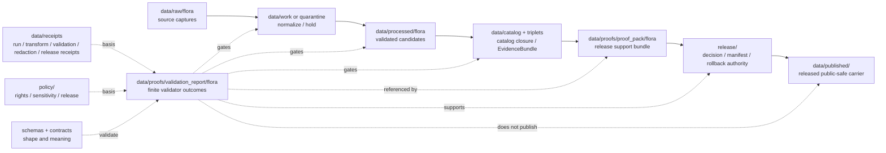

<!-- [KFM_META_BLOCK_V2]
doc_id: kfm://data/proofs/validation-report/flora/readme
title: data/proofs/validation_report/flora README
type: directory-readme
version: v0.1
status: draft
owners:
  - <data steward — TODO>
  - <validation steward — TODO>
  - <proof steward — TODO>
  - <flora-domain steward — TODO>
  - <sensitivity reviewer — TODO>
  - <release steward — TODO>
created: 2026-06-25
updated: 2026-06-25
policy_label: restricted-review
path: data/proofs/validation_report/flora/README.md
related:
  - ../../README.md
  - ../README.md
  - ../../proof_pack/flora/README.md
  - ../../flora/README.md
  - ../../evidence_bundle/README.md
  - ../../citation_validation/README.md
  - ../../review/README.md
  - ../../integrity/README.md
  - ../../../receipts/README.md
  - ../../../catalog/README.md
  - ../../../published/README.md
  - ../../../../release/README.md
  - ../../../../docs/domains/flora/ARCHITECTURE.md
  - ../../../../docs/domains/flora/DATA_LIFECYCLE.md
  - ../../../../docs/doctrine/directory-rules.md
  - ../../../../docs/doctrine/lifecycle-law.md
  - ../../../../docs/doctrine/trust-membrane.md
  - ../../../../contracts/README.md
  - ../../../../schemas/README.md
  - ../../../../policy/README.md
tags:
  - kfm
  - data
  - proofs
  - validation-report
  - flora
  - biodiversity
  - taxonomy
  - occurrence
  - specimen-record
  - sensitivity-review
  - redaction-receipt
  - steward-review
  - release-gate
  - rollback
  - cite-or-abstain
notes:
  - "Directory README for Flora validation-report support. It is not itself a ValidationReport instance, schema, ProofPack, policy bundle, ReleaseManifest, catalog record, RedactionReceipt, or published flora layer."
  - "Flora validation reports must fail closed when rights, evidence, source role, taxonomy, sensitivity review, redaction proof, catalog closure, release state, or rollback support is missing."
  - "Validation reports support proof and release review; they do not publish, approve, redact, or replace EvidenceBundles, policy decisions, ReviewRecords, RedactionReceipts, or release authority."
[/KFM_META_BLOCK_V2] -->

<a id="top"></a>

# `data/proofs/validation_report/flora/`

> Domain lane for **Flora ValidationReport support**. Files under this directory should make flora validator outcomes inspectable, finite, reproducible, evidence-linked, sensitivity-aware, and usable by ProofPacks, review proof, release decisions, correction paths, and rollback targets.


> [!IMPORTANT]
> **Status:** `draft`  
> **Owner:** `<data steward>` · `<validation steward>` · `<proof steward>` · `<flora-domain steward>` · `<sensitivity reviewer>` · `<release steward>` — TODO  
> **Path:** `data/proofs/validation_report/flora/README.md`  
> **Truth posture:** CONFIRMED doctrine / PROPOSED implementation guidance / NEEDS VERIFICATION for emitted validation reports, schemas, validators, fixtures, CI wiring, sensitivity enforcement, and release-gate enforcement.

> [!CAUTION]
> A validation report is **not** a release decision and not a redaction transform. It may support `ProofPack`, `ReviewRecord`, `PolicyDecision`, `RedactionReceipt`, `ReleaseManifest`, correction, and rollback workflows, but it must not become a parallel approval, catalog, redaction, or publication authority.

---

## Quick jumps

| Section | Use it for |
|---|---|
| [1. Purpose](#1-purpose) | What this directory is for. |
| [2. Placement and authority](#2-placement-and-authority) | Why this path belongs under `data/proofs/validation_report/`. |
| [3. What belongs here](#3-what-belongs-here) | Accepted validation-report objects and support files. |
| [4. What must not live here](#4-what-must-not-live-here) | Exclusions and wrong homes. |
| [5. Flora validation responsibilities](#5-flora-validation-responsibilities) | Domain-specific validator obligations. |
| [6. Required validation result families](#6-required-validation-result-families) | Minimum result categories. |
| [7. Validator gates](#7-validator-gates) | Hard denial and hold conditions. |
| [8. Naming and identity](#8-naming-and-identity) | Suggested file naming and metadata. |
| [9. Lifecycle relationship](#9-lifecycle-relationship) | How ValidationReports support RAW → PUBLISHED. |
| [10. Review checklist](#10-review-checklist) | Maintainer checklist. |
| [11. Failure modes](#11-failure-modes) | Drift and overclaim patterns to block. |
| [12. Definition of done](#12-definition-of-done) | What is still needed for operational maturity. |

---

## 1. Purpose

`data/proofs/validation_report/flora/` stores validation-report support for the Flora lane: plant taxonomic identity, taxon crosswalks, specimens, occurrences, vegetation communities, invasive plant records, phenology observations, range or distribution surfaces, habitat associations, botanical surveys, restoration planting records, sensitivity review, redaction checks, and public-safe botanical products.

A validation report here should answer:

- What candidate, source run, transform, layer, API payload, Evidence Drawer payload, or release candidate was validated?
- Which validator version, schema version, fixture set, policy basis, input digest, output digest, and runtime mode produced the result?
- Did validators preserve object family, source role, temporal scope, taxonomy version, uncertainty, public-safe posture, and release state?
- Did validators block unresolved sensitivity, missing RedactionReceipt, unresolved rights, taxonomy drift, source-role collapse, unsafe joins, missing EvidenceBundle, and direct RAW/WORK/QUARANTINE access?
- Which outcomes are `PASS`, `WARN`, `HOLD`, `ABSTAIN`, `DENY`, `RESTRICT`, or `ERROR`, and why?
- Which EvidenceBundles, policy decisions, redaction receipts, review records, proof packs, release candidates, correction paths, and rollback targets should consume the report?

This directory is for **validation-report support**, not source data, policy code, schemas, ProofPacks, RedactionReceipts, release manifests, public map layers, or unreviewed sensitive biodiversity data.

[Back to top](#top)

---

## 2. Placement and authority

KFM places files by responsibility root. `data/proofs/validation_report/` holds validation-report proof artifacts and domain validation-report lanes. The `flora/` segment narrows that responsibility to the Flora domain.

| Surface | Role | Boundary |
|---|---|---|
| [`../../README.md`](../../README.md) | Parent proof root. | Defines proof-lane expectations; this README narrows them to Flora validation reports. |
| [`../README.md`](../README.md) | ValidationReport family root. | Greenfield/stub at time of authoring; this file documents the flora domain sublane. |
| [`../../proof_pack/flora/README.md`](../../proof_pack/flora/README.md) | Flora ProofPack lane. | ProofPacks should reference validation reports; validation reports do not become ProofPacks. |
| [`../../flora/README.md`](../../flora/README.md) | Broader Flora proof lane. | Domain proof may cite validation reports; this lane is specifically validation-report support. |
| [`../../../receipts/`](../../../receipts/) | Operation memory. | Validation receipts or run receipts may be basis refs; reports here summarize finite validator outcomes. |
| [`../../../catalog/`](../../../catalog/) | Catalog closure and EvidenceBundle discovery. | Validation reports may gate catalog closure but are not catalog records. |
| [`../../../../release/`](../../../../release/) | Release decisions, manifests, corrections, rollback cards. | Validation reports support release decisions; they do not make them. |
| [`../../../published/`](../../../published/) | Released public-safe artifacts. | Published artifacts are downstream and require release gates. |
| [`../../../../policy/`](../../../../policy/) | Rights, sensitivity, release, and runtime policy. | Validation reports record policy-relevant outcomes; policy logic lives in policy roots. |
| [`../../../../schemas/`](../../../../schemas/) | Machine shape. | ValidationReport schemas belong under the approved schema home. |
| [`../../../../contracts/`](../../../../contracts/) | Object meaning. | ValidationReport semantics belong in contracts. |

> [!NOTE]
> This README documents a subdirectory that already exists in the repository. It does not create a new lifecycle phase, redaction authority, or parallel validation authority.

[Back to top](#top)

---

## 3. What belongs here

Use this folder for validation-report files that are safe to store under repository policy and useful for review, release, correction, rollback, or audit.

| Accepted item | Suggested placement | Notes |
|---|---|---|
| Candidate validation report | `data/proofs/validation_report/flora/candidates/<run_id>.validation-report.json` | PROPOSED until schema and validator are confirmed. |
| Release validation report | `data/proofs/validation_report/flora/release/<release_id>.validation-report.json` | Should reference the release candidate and ProofPack. |
| Failed validation report | `data/proofs/validation_report/flora/failures/<run_id>.validation-report.json` | Useful for audit, correction, quarantine, and negative fixtures. |
| Sensitivity validation report | `data/proofs/validation_report/flora/sensitivity/<run_id>.validation-report.json` | Checks that public-safe posture matches policy and redaction support. |
| Taxonomy validation report | `data/proofs/validation_report/flora/taxonomy/<run_id>.validation-report.json` | Checks crosswalk version, accepted-name logic, and unresolved conflicts. |
| Validator index | `data/proofs/validation_report/flora/indexes/validation-report-index.json` | Optional lookup aid; not canonical truth by itself. |
| Superseded report | `data/proofs/validation_report/flora/retired/<run_id>.superseded-validation-report.json` | Keep for audit; do not silently delete prior validator meaning. |

Validation reports should use stable references and digests rather than duplicating raw payloads or restricted details.

[Back to top](#top)

---

## 4. What must not live here

| Excluded material | Correct home or action | Why |
|---|---|---|
| Raw GBIF, iNaturalist, USDA PLANTS, iDigBio, herbarium, NatureServe, KDWP, KBS, vegetation-index, restoration, or stewarded source payloads | `data/raw/flora/`, `data/work/flora/`, or `data/quarantine/flora/` | Validation reports reference source material; they do not store it. |
| Restricted sensitive-flora details or steward-only fields | Restricted lifecycle stores only; public-review validation reports should use redacted or summarized refs | Validation report files may be reviewed more broadly than RAW stores. |
| Working normalized records or candidate layers | `data/work/` or `data/processed/` after validation | Validation reports are proof artifacts, not canonical data. |
| Policy logic or release rules | `policy/domains/flora/`, `policy/sensitivity/flora/`, or approved policy roots | Reports record outcomes, not policy definitions. |
| JSON Schemas | `schemas/contracts/v1/...` | Machine shape belongs in schemas. |
| Semantic contracts | `contracts/...` | Meaning belongs in contracts. |
| ProofPack instances | `data/proofs/proof_pack/flora/` | ProofPacks assemble multiple support refs; validation reports are one input family. |
| RedactionReceipt authority | Approved redaction/proof/receipt home — NEEDS VERIFICATION | Validation reports may check or cite RedactionReceipts but do not perform the transform. |
| ReleaseManifest, PromotionDecision, CorrectionNotice, WithdrawalNotice, or RollbackCard as authority | `release/` | Validation reports may reference these but must not become release authority. |
| Published PMTiles, GeoParquet, API payloads, reports, stories, or map layers | `data/published/...` after release gates | Published artifacts are downstream carriers. |

[Back to top](#top)

---

## 5. Flora validation responsibilities

A validation report in this lane should support one or more of these responsibilities:

1. **Object-family validation** — every PlantTaxon, occurrence, specimen, sensitive flora record, vegetation community, range surface, invasive record, phenology observation, habitat association, botanical survey, restoration planting, and redaction reference is properly typed.
2. **Taxonomy validation** — accepted name, synonym, authority snapshot, crosswalk version, and unresolved conflicts are explicit.
3. **Occurrence and specimen validation** — uncertainty, basis of record, observation/specimen method, date/time, rights, and source role are preserved.
4. **Sensitivity validation** — public-safe posture is supported by policy, review, and redaction references where required.
5. **Product-sensitivity validation** — joins between taxon lists, occurrence/specimen records, habitat, land, roads, agriculture, or restoration data are treated as review-required until cleared.
6. **Source-role validation** — authority, observation, context, model, aggregate, candidate, and synthetic roles are not inferred from convenience or upgraded by promotion.
7. **Lifecycle validation** — reports prove that validators, policy gates, EvidenceRefs, catalog closure, review state, release candidates, correction paths, and rollback targets are present where required.
8. **No-live-fetch validation** — CI/dry-run validation must use fixtures and must not fetch live source systems.

[Back to top](#top)

---

## 6. Required validation result families

| Result family | Required checks | Finite outcomes |
|---|---|---|
| `schema_shape` | Required fields, enum values, version pins, JSON structure. | `PASS`, `WARN`, `ERROR` |
| `object_family` | PlantTaxon, FloraOccurrence, SpecimenRecord, sensitive flora record, VegetationCommunity, InvasivePlantRecord, PhenologyObservation, RangePolygon/DistributionSurface, HabitatAssociation, BotanicalSurvey, RestorationPlanting. | `PASS`, `DENY`, `ERROR` |
| `taxonomy_crosswalk` | Accepted name, synonym handling, authority snapshot, crosswalk version, conflict notes. | `PASS`, `HOLD`, `DENY`, `ERROR` |
| `source_role` | Source role for this use; no role inferred from source brand or convenience. | `PASS`, `WARN`, `DENY`, `ABSTAIN` |
| `occurrence_uncertainty` | Uncertainty, basis of record, observation/specimen method, date/time, public/restricted split. | `PASS`, `WARN`, `HOLD`, `DENY` |
| `sensitivity_redaction` | Public-safe posture, transform reason, reviewer, residual risk, RedactionReceipt refs. | `PASS`, `RESTRICT`, `DENY`, `ERROR` |
| `sensitive_flora_policy` | Protected/cultural/steward-sensitive status, policy decision, review state, public posture. | `PASS`, `RESTRICT`, `DENY`, `ABSTAIN` |
| `join_sensitivity` | Product-level sensitivity after joins with occurrence, habitat, land, roads, agriculture, restoration, or public/citizen-observation sources. | `PASS`, `HOLD`, `DENY` |
| `lifecycle_gate` | EvidenceRef, EvidenceBundle, ValidationReport, CatalogMatrix, PolicyDecision, ReviewRecord, ReleaseManifest, rollback refs. | `READY_FOR_REVIEW`, `HOLD`, `DENY`, `ERROR` |
| `dry_run_ci` | Fixture-only validation; no live fetches or nondeterministic upstream calls. | `PASS`, `ERROR` |

[Back to top](#top)

---

## 7. Validator gates

| Gate | Required proof | Failure outcome |
|---|---|---|
| Sensitive-data exposure | Validator proves restricted details are absent from public-review/public candidate outputs unless explicitly cleared for the target audience. | `DENY`, quarantine, or restrict. |
| Missing RedactionReceipt | Validator checks RedactionReceipt / public-safe transform refs where required. | `HOLD` or `DENY`. |
| Public/restricted occurrence split | Validator proves public occurrence outputs cannot reveal restricted or steward-only fields. | `DENY` public release. |
| Taxonomy drift | Validator checks taxonomic crosswalk version and unresolved name/hierarchy conflicts. | `HOLD` or `DENY`. |
| Source-role collapse | Validator blocks observation-as-authority, model-as-observation, or context-as-verified-occurrence. | `DENY` or quarantine. |
| Join-induced sensitivity | Validator checks product-level sensitivity after joins, not just input-level sensitivity. | `HOLD`, `DENY`, or require review. |
| Rights ambiguity | Validator checks source descriptor, license/terms posture, redistribution decision, and citation. | `DENY` public promotion if unresolved. |
| Temporal defect | Validator checks observed, valid, retrieval, source, release, and correction times where material. | `ERROR`, `HOLD`, or quarantine. |
| Dry-run / CI | Validator proves no live fetches during dry-run validation. | `ERROR` or workflow failure. |
| Release readiness | Validator checks EvidenceBundle, PolicyDecision, ReviewRecord where required, release candidate, correction path, and rollback target. | `HOLD` or `DENY`. |

[Back to top](#top)

---

## 8. Naming and identity

Suggested directory pattern:

```text
data/proofs/validation_report/flora/<family>/<run_or_release_id>.validation-report.json
```

Suggested deterministic file name:

```text
flora.validation_report.<validator_family>.<scope>.<run_or_release_id>.<short_hash>.json
```

Examples:

```text
flora.validation_report.sensitivity.public-safe-occurrence.run-20260625.0123abcd.json
flora.validation_report.taxonomy.plant-taxon-crosswalk.run-20260625.89ab4567.json
flora.validation_report.occurrence_uncertainty.public-occurrence-layer.run-20260625.4567cdef.json
flora.validation_report.join_sensitivity.habitat-restoration-adjacency.run-20260625.cdef0123.json
```

Minimum validation-report metadata should include:

- `validation_report_id`
- `domain: flora`
- `validator_family`
- `validator_name`
- `validator_version`
- `schema_version`
- `fixture_set_ref`
- `run_id`
- `candidate_ref`
- `release_candidate_ref` where applicable
- `input_digest`
- `output_digest`
- `source_descriptor_refs`
- `evidence_bundle_refs`
- `redaction_receipt_refs`
- `receipt_refs`
- `policy_decision_refs`
- `review_record_refs`
- `proof_pack_refs`
- `release_refs`
- `rollback_refs`
- `taxonomy_results`
- `sensitivity_results`
- `occurrence_uncertainty_results`
- `rights_sensitivity_results`
- `finite_outcome`
- `reasons`
- `created_at`
- `created_by`

[Back to top](#top)

---

## 9. Lifecycle relationship



Validation reports make gate results inspectable. They do not publish, redact, approve, or replace release authority by placement.

[Back to top](#top)

---

## 10. Review checklist

Before a Flora validation report is used in ProofPack, review, release, correction, or rollback work, verify:

- [ ] The report identifies candidate scope, run ID, validator family, validator version, schema version, fixture set, input digest, and output digest.
- [ ] Results are finite and use expected outcomes, not free-text-only status.
- [ ] Object family, source role, temporal scope, taxonomy version, uncertainty, and public-safe posture are checked.
- [ ] Sensitive exposure, missing RedactionReceipt, public/restricted occurrence split, taxonomy drift, source-role collapse, unsafe joins, unresolved rights, and missing EvidenceBundle cases are exercised.
- [ ] Sensitivity checks include transform reason, reviewer, residual risk, and target artifact where applicable.
- [ ] Product-level sensitivity is checked after joins.
- [ ] Dry-run/CI validation proves no live upstream fetches.
- [ ] EvidenceBundle, PolicyDecision, ReviewRecord, ProofPack, release candidate, correction path, and rollback refs are present where required.
- [ ] The validation report does not include raw restricted payloads, restricted details, or release-manifest authority.

[Back to top](#top)

---

## 11. Failure modes

| Failure mode | Why it matters | Required response |
|---|---|---|
| Validation report stores raw source payloads | Collapses validation support into source storage. | Move payload to lifecycle homes; keep refs/digests here. |
| Restricted sensitive-flora detail appears in report | Validation artifact becomes an exposure channel. | Quarantine, redact, and require steward review. |
| Missing RedactionReceipt still passes public release | Public-safe output cannot be audited. | Hold or deny release until transform proof exists. |
| Taxonomy conflict hidden | Public claim may attach to the wrong plant concept. | Hold for review and record crosswalk conflict. |
| Observation treated as authority | Source-role collapse misleads users. | Deny and restore permitted source role. |
| Join product treated as safe because inputs were public | Sensitivity is product-level and can arise from the join. | Hold, review, generalize, restrict, or deny. |
| Live fetch occurs during dry-run validation | CI becomes nondeterministic and may violate source boundaries. | Fail workflow and require fixtures. |
| Validation report acts as ReleaseManifest | Collapses validation with release authority. | Move authority to `release/`; keep a reference here. |
| Report has no rollback/correction refs for release-significant candidate | Release review is not reversible. | Hold release review. |

[Back to top](#top)

---

## 12. Definition of done

This sublane is operationally useful when:

- [ ] `data/proofs/validation_report/README.md` defines or links the parent ValidationReport family contract.
- [ ] Flora ValidationReport schema and semantic contract exist under approved homes.
- [ ] Valid and invalid fixtures exist for sensitive exposure, missing RedactionReceipt, public/restricted occurrence split, taxonomy drift, source-role collapse, unsafe join, unresolved rights, missing EvidenceBundle, missing rollback, and live-fetch-in-CI failures.
- [ ] CI runs the Flora validation suite and blocks release-significant failures.
- [ ] Flora ProofPacks reference validation reports by stable ID and digest.
- [ ] Release docs require validation-report closure for public flora layers, Evidence Drawer payloads, Focus Mode surfaces, public-safe transforms, and correction/rollback candidates.
- [ ] CODEOWNERS or equivalent review ownership covers validation steward, flora steward, sensitivity reviewer, proof steward, policy reviewer where required, and release steward.
- [ ] At least one synthetic no-network Flora candidate demonstrates: fixture/source refs → validation report → EvidenceBundle / catalog closure → ProofPack → ReleaseManifest → public-safe artifact → rollback.

---

## Maintainer note

Flora validation reports are where sensitive biodiversity exposure, taxonomy mistakes, and unsafe joins should be stopped before they become public maps. Keep validator outputs finite, citeable, deterministic, and strict about source role, taxonomy, redaction support, product-level sensitivity, public/restricted splits, and rollback. If a candidate is unclear, the correct outcome is `HOLD`, `ABSTAIN`, `DENY`, `RESTRICT`, or `ERROR`, not a polished public layer.
