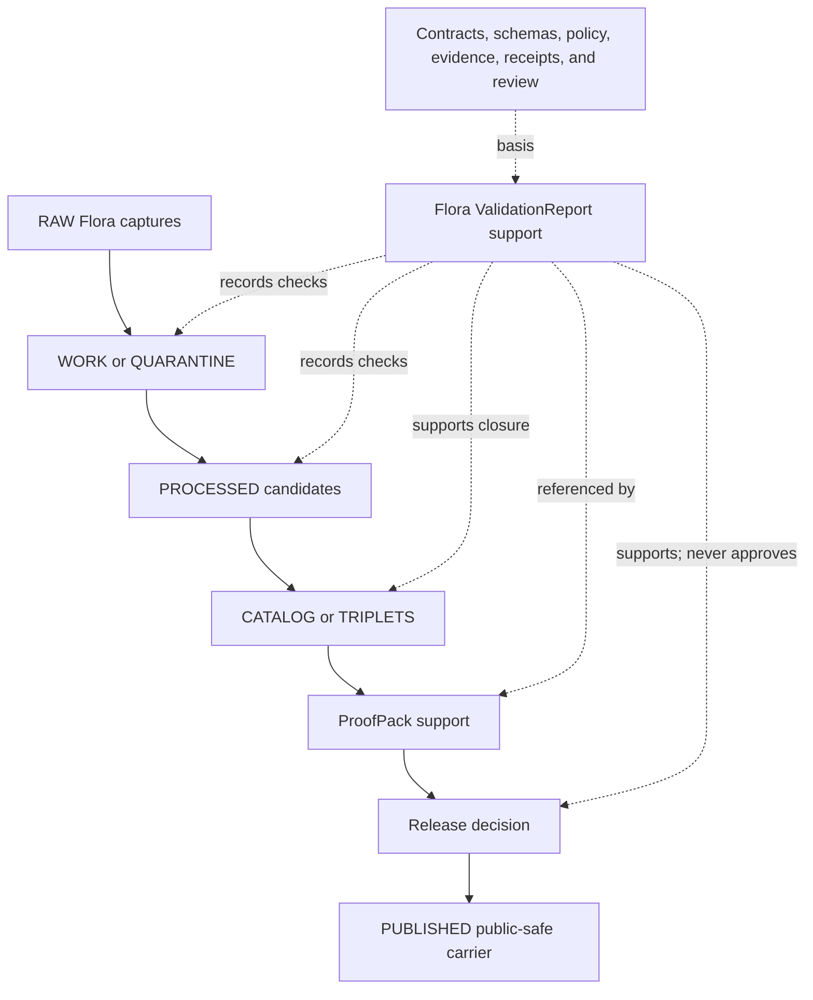

<!-- [KFM_META_BLOCK_V2]
doc_id: kfm://data/proofs/validation-report/flora/readme
title: data/proofs/validation_report/flora README
type: README; proof-family-child; flora-domain-validation-report-support; sensitive-location-boundary
version: v0.2.0
status: repository-grounded draft; ValidationReport schema, producer, payload inventory, and runtime enforcement unverified
owners:
  - "NEEDS VERIFICATION — data and validation stewardship"
  - "NEEDS VERIFICATION — proof and Flora-domain stewardship"
  - "NEEDS VERIFICATION — sensitivity, rights, release, correction, and rollback review"
created: 2026-06-25
updated: 2026-07-26
policy_label: restricted-review; deny-by-default-location; no-direct-public-path; release-gated; cite-or-abstain
path: data/proofs/validation_report/flora/README.md
truth_posture: >
  CONFIRMED exact path, prior bytes, parent proof and ValidationReport-family boundaries,
  Flora proof companions, read-only domain workflow holds, placeholder Flora smoke test,
  validator-index posture, and CODEOWNERS routing / PROPOSED local boundary contract,
  report families, gates, naming pattern, and future instance profile / UNKNOWN recursive
  payload inventory, active writers and consumers, accepted ValidationReport contract and
  schema, emitted reports, retention, physical storage, release state, and public effects /
  NEEDS VERIFICATION accountable owners, Flora-specific fixtures, executable validator,
  CI graduation, policy and geoprivacy enforcement, review separation, correction
  propagation, and rollback drills
evidence_snapshot:
  repository: bartytime4life/Kansas-Frontier-Matrix
  base_ref: main
  base_commit: ba138f4de38fbaae6529d218d083e5a7e90723b3
  prior_blob: 004d29ac8eb73276babfc2ba596eb782c635db9b
  proofs_root_blob: 0d8b6e92d3b4b9ff3961d29c53ead497922a31cf
  validation_report_parent_blob: 30cf9cdeebef4d1d4228d180d5f9345e78bad60a
  flora_proof_lane_blob: 130effccfd6e14f2660de04c3cc30d839503ef8a
  flora_workflow_blob: c792d126e5726d8895f56fd97800bee7fcba4a15
  flora_placeholder_test_blob: 855bceb0cba590c64272e62489a8f9c4348cc9b7
  flora_validator_index_blob: 80820ed0263641f7b70225b8db202ca35a0feace
  codeowners_blob: dd2a84aa514d8ecd9208bc347f90f9a2ed37dd61
  directory_rules_v2_blob: fd49a0b83e55cef52c1124281f093e263526898d
  directory_rules_v2_status: PROPOSED_FOR_ADOPTION
  adr_0029_blob: d34e24ff322bf2a8077379eb2803811dcf8924e5
related:
  - ../../README.md
  - ../README.md
  - ../../flora/README.md
  - ../../proof_pack/flora/README.md
  - ../../evidence_bundle/flora/README.md
  - ../../citation_validation/flora/README.md
  - ../../review/README.md
  - ../../../receipts/README.md
  - ../../../catalog/README.md
  - ../../../published/README.md
  - ../../../../release/README.md
  - ../../../../release/candidates/flora/README.md
  - ../../../../docs/domains/flora/ARCHITECTURE.md
  - ../../../../docs/domains/flora/DATA_LIFECYCLE.md
  - ../../../../docs/doctrine/directory-rules.md
  - ../../../../docs/doctrine/lifecycle-law.md
  - ../../../../docs/doctrine/trust-membrane.md
  - ../../../../contracts/domains/flora/README.md
  - ../../../../schemas/contracts/v1/domains/flora/README.md
  - ../../../../policy/domains/flora/README.md
  - ../../../../policy/sensitivity/flora/README.md
  - ../../../../fixtures/domains/flora/README.md
  - ../../../../tests/domains/flora/README.md
  - ../../../../tools/validators/domains/flora/README.md
  - ../../../../.github/workflows/domain-flora.yml
tags:
  - kfm
  - data
  - proofs
  - validation-report
  - flora
  - biodiversity
  - taxonomy
  - occurrence
  - specimen-record
  - sensitivity-review
  - geoprivacy
  - redaction-receipt
  - steward-review
  - release-gate
  - rollback
  - cite-or-abstain
notes:
  - "This README governs Flora ValidationReport support. It is not a ValidationReport instance, semantic contract, schema, validator, ProofPack, PolicyDecision, ReviewRecord, RedactionReceipt, ReleaseManifest, catalog record, or published Flora layer."
  - "The current Flora domain workflow records explicit validation, proof, and release-dry-run holds; those held checks do not establish botanical truth, geoprivacy, evidence closure, policy approval, release readiness, or publication."
  - "Exact or reverse-engineerable rare, protected, culturally sensitive, steward-controlled, or private-land Flora locations and control-defeating transform details do not belong in this ordinary repository lane."
[/KFM_META_BLOCK_V2] -->

<a id="top"></a>

# `data/proofs/validation_report/flora/`

> **One-line purpose.** Govern Flora-specific ValidationReport proof support so validator outcomes can be inspected without turning validation text into botanical truth, sensitivity clearance, policy, release authority, or a public data service.

[](#status)
[](../../../../.github/workflows/domain-flora.yml)
[](#sensitivity-and-safe-representation)
[](#validation)

> [!IMPORTANT]
> Validation support is necessary but not sufficient for publication. A structurally valid report can support proof, policy, review, release, correction, and rollback evaluation; it cannot make a botanical claim true, taxonomically current, rights-cleared, sensitivity-safe, steward-approved, released, public, or suitable for collection or access use.

> [!CAUTION]
> Do not place exact or reverse-engineerable rare, protected, culturally sensitive, steward-controlled, or private-land Flora locations here. Collection clues, access directions, withheld precision, redaction offsets, generalization thresholds, transform parameters, and other control-defeating details require approved restricted handling.

**Quick navigation:** [Purpose](#purpose) · [Authority](#authority-level) · [Status](#status) · [Belongs](#what-belongs-here) · [Exclusions](#what-does-not-belong-here) · [Inputs](#inputs) · [Outputs](#outputs) · [Exposure](#exposure-mutation-and-retention) · [Validation](#validation) · [Review](#review-burden) · [Related](#related-folders) · [ADRs](#adrs) · [Last reviewed](#last-reviewed)

**Operating detail:** [Report profile](#proposed-flora-validationreport-profile) · [Responsibilities](#flora-validation-responsibilities) · [Gates](#validator-gates) · [Sensitivity](#sensitivity-and-safe-representation) · [Identity](#naming-and-identity) · [Lifecycle](#lifecycle-relationship) · [Checklist](#review-checklist) · [Failures](#failure-modes) · [Verification](#open-verification-register) · [Readiness](#definition-of-readiness) · [Rollback](#rollback)

## Purpose

`data/proofs/validation_report/flora/` is the Flora-specialized child of the ValidationReport proof family. It defines a bounded home for support relating to plant taxonomic identity, taxon crosswalks, specimens, occurrences, vegetation communities, invasive plant records, phenology observations, range or distribution surfaces, habitat associations, botanical surveys, restoration planting records, sensitivity review, redaction checks, and public-safe botanical products.

For an accepted future report profile, a report should make these questions inspectable:

- What candidate, source run, transform, layer, API payload, Evidence Drawer payload, or release candidate was checked?
- Which validator, validator version, schema or contract version, fixture set, policy basis, input digest, output digest, and runtime mode bound the check?
- Were object family, source role, space and time scope, taxonomy version, uncertainty, rights, sensitivity, safe-representation posture, and release state preserved?
- Were unresolved sensitivity, missing redaction support, rights ambiguity, taxonomy drift, source-role collapse, unsafe joins, missing evidence, and direct public access to internal lifecycle stores blocked?
- Which finite outcome and machine-readable reasons were produced under the applicable accepted contract?
- Which EvidenceBundles, receipts, policy decisions, review records, ProofPacks, release candidates, correction records, and rollback targets consume or constrain the result?

This README documents the boundary. It does not establish an accepted report schema, an executable validator, emitted reports, a release gate, or public readiness.

## Authority level

**Inherited proof-family boundary; Flora ValidationReport support only.**

| Concern | Authority owner | This lane's relationship |
|---|---|---|
| ValidationReport-family proof support | [`data/proofs/validation_report/`](../README.md) | Parent family; this child narrows the context to Flora. |
| Flora domain proof support | [`data/proofs/flora/`](../../flora/README.md) | Domain proof context; not a duplicate ValidationReport-family home. |
| EvidenceBundle and ProofPack families | [`evidence_bundle/flora/`](../../evidence_bundle/flora/README.md) and [`proof_pack/flora/`](../../proof_pack/flora/README.md) | May be referenced; remain separate object families. |
| Semantic meaning | [`contracts/domains/flora/`](../../../../contracts/domains/flora/README.md) and an accepted ValidationReport contract | Defines meaning; no dedicated accepted ValidationReport contract was verified. |
| Machine shape | [`schemas/contracts/v1/domains/flora/`](../../../../schemas/contracts/v1/domains/flora/README.md) and an accepted ValidationReport schema | Defines shape; no dedicated ValidationReport schema was verified in the bounded inspection. |
| Admissibility and sensitivity | [`policy/domains/flora/`](../../../../policy/domains/flora/README.md) and [`policy/sensitivity/flora/`](../../../../policy/sensitivity/flora/README.md) | Policy decides; a report records or references outcomes without defining them. |
| Release, correction, and rollback | [`release/`](../../../../release/README.md) | Owns decisions and rollback authority; this lane only supplies bounded support. |

A report may reference many authorities without owning them. If two lanes would independently edit the same report identity or policy-significant meaning, stop and resolve one authoritative home before adding payloads.

## Status

| Surface | Bounded result at the evidence snapshot |
|---|---|
| README path | **CONFIRMED** at `data/proofs/validation_report/flora/README.md`; prior blob `004d29ac8eb73276babfc2ba596eb782c635db9b`. |
| Parent proof and ValidationReport-family READMEs | **CONFIRMED repository-grounded drafts**; payload and enforcement maturity remain unverified. |
| Flora smoke test | **CONFIRMED placeholder** at [`tests/domains/flora/test_flora_smoke.py`](../../../../tests/domains/flora/test_flora_smoke.py); its unconditional pass is not validation evidence. |
| Flora validator surface | **CONFIRMED index-only draft** at [`tools/validators/domains/flora/`](../../../../tools/validators/domains/flora/README.md); accepted executables remain unverified. |
| Domain workflow | **CONFIRMED read-only readiness workflow** with explicit `validate-flora`, `build-proof-flora`, and `publish-dry-run-flora` holds. |
| Dedicated ValidationReport contract and schema | **NEEDS VERIFICATION**; none was verified at the checked conventional evidence-family locations. |
| Flora-specific report fixtures and validator | **NEEDS VERIFICATION**; documentation exists, but executable coverage was not established. |
| Recursive report or payload inventory | **UNKNOWN**; no complete pinned recursive tree or external-storage inventory was available in this task. |
| Active writers, consumers, retention, and physical storage | **UNKNOWN**. |
| Accountable stewardship and independent review | **NEEDS VERIFICATION**; CODEOWNERS routing is not a stewardship assignment or approval record. |
| Release or publication state | **DENIED as an inference** from this README, any badge, workflow, commit, pull request, or directory placement. |

The repository is documentation-heavy in this lane. Treat it as a governed boundary and readiness backlog, not an operational ValidationReport store.

## What belongs here

Current admissible content is narrow:

- this boundary README and other approved local documentation that does not create parallel authority;
- future Flora ValidationReport instances only after an accepted semantic profile, machine schema, producer, fixture set, validator, policy posture, review route, retention rule, and correction/rollback behavior identify this as their authoritative logical home;
- immutable indexes or references to reports owned here, when they do not duplicate source payloads, evidence objects, policy decisions, review records, or release records;
- safe summaries and digests that remain useful for proof, review, correction, rollback, and audit without exposing restricted Flora information.

The following future layout remains **PROPOSED**, not a claim that these children or payloads exist:

| Candidate purpose | Illustrative path | Admission condition |
|---|---|---|
| Candidate validation result | `candidates/<run_id>.validation-report.json` | Accepted report profile and non-release candidate semantics. |
| Release-review validation result | `release/<release_id>.validation-report.json` | Stable release-candidate and ProofPack references; no release authority. |
| Failed validation result | `failures/<run_id>.validation-report.json` | Safe diagnostic content, correction linkage, and no restricted payload duplication. |
| Sensitivity result | `sensitivity/<run_id>.validation-report.json` | Public-safe findings only; restricted details remain in approved systems. |
| Taxonomy result | `taxonomy/<run_id>.validation-report.json` | Versioned taxonomy basis and explicit unresolved conflicts. |
| Lookup index | `indexes/validation-report-index.json` | Rebuildable discovery aid; not canonical truth or approval. |
| Superseded result | `retired/<run_id>.superseded-validation-report.json` | Preserved identity, forward link, reason, and correction lineage. |

## What does NOT belong here

| Excluded material | Correct home or action | Why |
|---|---|---|
| Raw GBIF, iNaturalist, USDA PLANTS, iDigBio, herbarium, NatureServe, KDWP, KBS, vegetation-index, restoration, or stewarded source payloads | `data/raw/flora/`, `data/work/flora/`, or `data/quarantine/flora/` according to lifecycle state | Validation support references source material; it does not store source payloads. |
| Exact or reverse-engineerable sensitive Flora locations, collection or access clues, private-land details, or geoprivacy secrets | Approved restricted store; otherwise quarantine, generalize, redact, abstain, or deny | An ordinary repository proof lane must not become an exposure channel. |
| Working normalized records or candidate layers | `data/work/` or `data/processed/` after the applicable transition | Reports are support artifacts, not canonical domain data. |
| Receipts saying what process ran | [`data/receipts/`](../../../receipts/README.md) | A receipt and a ValidationReport are distinct families. |
| EvidenceBundle or ProofPack instances | Their accepted proof-family homes | Reports may reference these objects; they do not replace them. |
| Policy logic, PolicyDecision authority, or release rules | [`policy/`](../../../../policy/README.md) and accepted policy-decision homes | Reports record or cite outcomes, not policy definitions. |
| Semantic contracts or JSON Schemas | [`contracts/`](../../../../contracts/README.md) and [`schemas/`](../../../../schemas/README.md) | Meaning and machine shape remain separate responsibilities. |
| ReviewRecord, stewardship, sovereignty, rights-holder, or sensitivity-review authority | Accepted review and policy homes | A validator cannot self-approve its result. |
| Redaction transform implementation or RedactionReceipt authority | Approved implementation and receipt/proof homes | A report can check or cite the transform without performing it. |
| ReleaseManifest, PromotionDecision, CorrectionNotice, WithdrawalNotice, or RollbackCard authority | [`release/`](../../../../release/README.md) | Validation cannot silently become release authority. |
| Published PMTiles, GeoParquet, API payloads, reports, stories, maps, or layers | [`data/published/`](../../../published/README.md) after governed release | Published carriers are downstream and release-approved. |

## Inputs

An accepted Flora report profile should bind only the inputs required for its declared scope:

- stable candidate, run, transform, artifact, and release-candidate references;
- validator identity and version, declared profile, schema and contract references, fixture-set reference, and deterministic runtime mode;
- input and output digests;
- source descriptors, source roles, taxonomy snapshot or crosswalk, methods, uncertainty, and spatial/temporal scope;
- EvidenceRefs and expected EvidenceBundle identities;
- rights, sensitivity, stewardship, sovereignty, geoprivacy, safe-representation, and access posture;
- applicable receipts, PolicyDecisions, ReviewRecords, RedactionReceipts, ProofPacks, release records, correction lineage, and rollback targets.

Missing, stale, conflicting, role-collapsed, rights-unclear, sensitivity-unsafe, unreviewed, unreleased, withdrawn, invalidated, or unresolvable support must remain visible and produce the applicable finite negative result rather than plausible completion.

## Outputs

The intended output is a compact, immutable, digest-bound ValidationReport under an accepted profile. It may supply:

- finite validator findings and machine-readable reasons;
- scope, version, fixture, digest, source-role, taxonomy, uncertainty, rights, and sensitivity summaries;
- stable references to evidence, receipts, policy, review, redaction, proof, release, correction, withdrawal, and rollback objects;
- a safe reviewer aid for ProofPack assembly, catalog closure, release evaluation, correction, or rollback.

It must not emit botanical truth, policy permission, stewardship approval, a ReleaseManifest, a published alias, a public map, or an AI answer. Public clients and ordinary UI surfaces use governed interfaces and release-approved carriers, not this internal proof-support path.

## Exposure, mutation, and retention

| Concern | Current boundary |
|---|---|
| Exposure | Repository-facing documentation; payload exposure remains **UNKNOWN**. Restricted or harmful-precision content is denied in this ordinary lane. |
| Writers | No accepted Flora ValidationReport producer was verified. Until one exists, treat the lane as documentation-only. |
| Mutation | Future report instances should be immutable and versioned; corrections should supersede or invalidate with forward lineage rather than silently rewrite prior meaning. |
| Retention | **NEEDS VERIFICATION** for report instances. Preserve audit-significant identity and correction lineage; do not invent a deletion schedule in this README. |
| Physical storage | **UNKNOWN**. Logical authority does not authorize committing restricted bytes; external storage still requires governed identity, digest, access, retention, and rollback metadata. |
| Public serving | Denied directly. Public exposure requires an independently governed release-approved carrier and interface. |

## Validation

### Current executable evidence

The checked revision does **not** establish an accepted Flora ValidationReport validation command:

- [`test_flora_smoke.py`](../../../../tests/domains/flora/test_flora_smoke.py) contains only a placeholder test;
- [`tools/validators/domains/flora/README.md`](../../../../tools/validators/domains/flora/README.md) is an index and explicitly does not confirm executables;
- [`domain-flora.yml`](../../../../.github/workflows/domain-flora.yml) performs read-only readiness checks and records explicit holds when substantive validation, proof production, or release dry-run support is absent;
- the root `make validate` aggregate must not be treated as Flora ValidationReport coverage without an accepted profile and observed test mapping.

A green readiness hold proves only that the checked hold conditions behaved as written. It does not prove botanical identity, occurrence validity, rights, sensitivity safety, geoprivacy, evidence closure, policy approval, release readiness, or public suitability.

### Required validation layers

Before admitting report instances, verify:

1. semantic contract and schema identity;
2. deterministic producer and no-network fixture profile;
3. positive and stable negative cases;
4. taxonomy, source-role, method, uncertainty, space, time, rights, and sensitivity checks;
5. EvidenceRef resolution and expected EvidenceBundle identity;
6. RedactionReceipt and safe-representation support where applicable;
7. product-level sensitivity after joins;
8. policy and human/steward review separation;
9. ProofPack, release, correction, withdrawal, invalidation, and rollback linkage;
10. no restricted-content leakage in reports, logs, summaries, artifacts, or badges.

A `PASS` proves only the accepted profile and checks that actually ran.

## Review burden

[`CODEOWNERS`](../../../../.github/CODEOWNERS) routes `/data/proofs/` changes to `@bartytime4life`. That routing is **CONFIRMED**; it is not a StewardshipAssignment, independent review, ReviewRecord, PolicyDecision, sensitivity clearance, release approval, or proof that review occurred.

Review should include the following responsibilities as applicable:

- proof and validation-report family;
- Flora domain and taxonomy;
- source role, evidence, and citation closure;
- rights, rare/protected/culturally sensitive Flora, geoprivacy, stewardship, and sovereignty;
- policy and public-surface safety;
- release, correction, withdrawal, invalidation, and rollback;
- contracts, schemas, fixtures, validators, workflows, API/UI, or storage owners when those surfaces change.

This README-only change needs documentation and proof-boundary review. Payload, contract, schema, policy, source activation, validator, fixture, workflow, access, public-serving, or release changes require separately scoped ownership and review.

## Related folders

### Proof and accountability

- Parent boundaries: [`data/proofs/`](../../README.md) · [`validation_report/`](../README.md) · [`flora/`](../../flora/README.md)
- Companion proof families: [`proof_pack/flora/`](../../proof_pack/flora/README.md) · [`evidence_bundle/flora/`](../../evidence_bundle/flora/README.md) · [`citation_validation/flora/`](../../citation_validation/flora/README.md) · [`review/`](../../review/README.md)
- Adjacent state: [`receipts/`](../../../receipts/README.md) · [`catalog/`](../../../catalog/README.md) · [`published/`](../../../published/README.md) · [`release/`](../../../../release/README.md)

### Meaning, shape, policy, and executable proof

- Flora architecture: [`ARCHITECTURE.md`](../../../../docs/domains/flora/ARCHITECTURE.md) · [`DATA_LIFECYCLE.md`](../../../../docs/domains/flora/DATA_LIFECYCLE.md)
- Meaning and shape: [`contracts/domains/flora/`](../../../../contracts/domains/flora/README.md) · [`schemas/contracts/v1/domains/flora/`](../../../../schemas/contracts/v1/domains/flora/README.md)
- Policy: [`policy/domains/flora/`](../../../../policy/domains/flora/README.md) · [`policy/sensitivity/flora/`](../../../../policy/sensitivity/flora/README.md)
- Proof of behavior: [`fixtures/domains/flora/`](../../../../fixtures/domains/flora/README.md) · [`tests/domains/flora/`](../../../../tests/domains/flora/README.md) · [`tools/validators/domains/flora/`](../../../../tools/validators/domains/flora/README.md) · [`domain-flora.yml`](../../../../.github/workflows/domain-flora.yml)

## ADRs

The following records are relevant but do not become accepted through this README:

- [`ADR-0010`](../../../../docs/adr/ADR-0010-deny-by-default-for-dna-rare-species-archaeology-infrastructure.md) is a draft sensitive-domain decision surface.
- [`ADR-0011`](../../../../docs/adr/ADR-0011-receipts-vs-proofs-vs-manifests-vs-catalog-separation.md) is proposed and documents the intended object-family separation.
- [`ADR-0029`](../../../../docs/adr/ADR-0029-adopt-directory-governance-standard-v2.md) remains proposed; it does not adopt Directory Rules v2 or authorize structural migration.

The supplied Directory Rules lineage places validation-report support under `data/proofs/` and separates proofs from receipts, catalogs, published carriers, and release decisions. The current [`docs/doctrine/directory-rules.md`](../../../../docs/doctrine/directory-rules.md) is the v2 proposed successor, not an accepted status transition. This same-path README update creates no new root, lane, object family, or authority decision.

## Last reviewed

| Field | Value |
|---|---|
| Review date | `2026-07-26` |
| Repository snapshot | `main@ba138f4de38fbaae6529d218d083e5a7e90723b3` |
| Prior target blob | `004d29ac8eb73276babfc2ba596eb782c635db9b` |
| Review type | Complete target read plus bounded parent, companion proof, doctrine, ADR, contract, schema-index, policy, fixture, test, validator, workflow, CODEOWNERS, branch, and pull-request inspection |
| Recursive payload or external-storage inventory | Not performed; remains `UNKNOWN` |
| Validator, fixture, or workflow execution | Not performed before this documentation change |
| Owners, retention, consumers, enforcement, release, and rollback drills | `NEEDS VERIFICATION` or `UNKNOWN` as listed above |

Re-review when authority, writers, consumers, report profile, contract/schema, validator, fixture, workflow, exposure, sensitivity, storage, retention, release, correction, withdrawal, invalidation, or rollback behavior changes.

## Proposed Flora ValidationReport profile

Everything in this section is **PROPOSED** until an accepted semantic contract, machine schema, fixtures, validator, policy integration, producer, and consumer profile establish it. The outcome words below are candidate report findings, not a universal KFM runtime enum.

### Candidate result families

| Result family | Candidate checks | Candidate finite outcomes |
|---|---|---|
| `schema_shape` | Required fields, enum values, version pins, and JSON structure. | `PASS`, `WARN`, `ERROR` |
| `object_family` | PlantTaxon, FloraOccurrence, SpecimenRecord, sensitive Flora record, VegetationCommunity, InvasivePlantRecord, PhenologyObservation, RangePolygon or DistributionSurface, HabitatAssociation, BotanicalSurvey, RestorationPlanting. | `PASS`, `DENY`, `ERROR` |
| `taxonomy_crosswalk` | Accepted name, synonym handling, authority snapshot, crosswalk version, and unresolved conflicts. | `PASS`, `HOLD`, `DENY`, `ERROR` |
| `source_role` | Source role for the declared use; no role inferred from source brand or convenience. | `PASS`, `WARN`, `DENY`, `ABSTAIN` |
| `occurrence_uncertainty` | Uncertainty, basis of record, observation or specimen method, date/time, and public/restricted split. | `PASS`, `WARN`, `HOLD`, `DENY` |
| `sensitivity_redaction` | Public-safe posture, transform reason, reviewer, residual risk, and RedactionReceipt references. | `PASS`, `RESTRICT`, `DENY`, `ERROR` |
| `sensitive_flora_policy` | Protected, cultural, or steward-sensitive status, policy decision, review state, and public posture. | `PASS`, `RESTRICT`, `DENY`, `ABSTAIN` |
| `join_sensitivity` | Product-level sensitivity after joins with occurrence, habitat, land, roads, agriculture, restoration, or public observation sources. | `PASS`, `HOLD`, `DENY` |
| `lifecycle_gate` | EvidenceRef, EvidenceBundle, ValidationReport, catalog closure, PolicyDecision, ReviewRecord, ProofPack, release, correction, and rollback references. | `READY_FOR_REVIEW`, `HOLD`, `DENY`, `ERROR` |
| `dry_run_ci` | Fixture-only execution with no live upstream fetch or nondeterministic external call. | `PASS`, `ERROR` |

### Candidate field inventory

An accepted profile should decide which fields are required by report family rather than copying this list blindly:

- identity and execution: `validation_report_id`, `domain: flora`, `validator_family`, `validator_name`, `validator_version`, `schema_version`, `fixture_set_ref`, `run_id`;
- scope and integrity: `candidate_ref`, `release_candidate_ref` where applicable, `input_digest`, `output_digest`;
- governed references: `source_descriptor_refs`, `evidence_bundle_refs`, `redaction_receipt_refs`, `receipt_refs`, `policy_decision_refs`, `review_record_refs`, `proof_pack_refs`, `release_refs`, `rollback_refs`;
- domain findings: `taxonomy_results`, `sensitivity_results`, `occurrence_uncertainty_results`, `rights_sensitivity_results`;
- result and lineage: `finite_outcome`, `reasons`, `created_at`, `created_by`, correction or supersession references.

## Flora validation responsibilities

A Flora ValidationReport profile should cover one or more declared responsibilities without claiming unexecuted coverage:

1. **Object-family validation** — plant taxa, occurrences, specimens, sensitive records, vegetation communities, range or distribution surfaces, invasive records, phenology observations, habitat associations, botanical surveys, restoration plantings, and redaction references remain correctly typed.
2. **Taxonomy validation** — accepted name, synonym, authority snapshot, crosswalk version, and unresolved conflicts remain explicit.
3. **Occurrence and specimen validation** — uncertainty, basis of record, method, space, time, rights, and source role remain visible.
4. **Sensitivity validation** — public-safe posture is supported by policy, review, and redaction references where required.
5. **Product-sensitivity validation** — joins between taxa, occurrences, specimens, habitat, land, roads, agriculture, restoration, or public observation sources are re-evaluated as products.
6. **Source-role validation** — authority, observation, context, model, aggregate, candidate, and synthetic roles are not upgraded by convenience or promotion.
7. **Lifecycle validation** — evidence, catalog, policy, review, proof, release, correction, withdrawal, and rollback dependencies are present for the declared transition.
8. **No-live-fetch validation** — default CI and dry-run checks use deterministic fixtures rather than live source systems.

## Validator gates

| Gate | Required support | Fail-closed response |
|---|---|---|
| Sensitive-data exposure | Public-review and candidate outputs exclude restricted or reverse-engineerable detail unless explicitly cleared for that audience. | Restrict, deny, quarantine, or require review under the accepted profile. |
| Missing redaction support | Required public-safe transform and RedactionReceipt references resolve. | Hold or deny; never infer clearance. |
| Public/restricted occurrence split | Public outputs cannot expose restricted or steward-only fields or reconstruct withheld precision. | Deny public release. |
| Taxonomy drift | Crosswalk version and unresolved name or hierarchy conflicts are explicit. | Hold, deny, or require correction. |
| Source-role collapse | Observation is not authority; model is not observation; context is not a verified occurrence. | Deny or quarantine the affected result. |
| Join-induced sensitivity | Product-level exposure is reviewed after every sensitivity-significant join. | Hold, restrict, generalize, deny, or require review. |
| Rights ambiguity | Source descriptor, terms, redistribution posture, attribution, and citation resolve for the declared use. | Deny public promotion while unresolved. |
| Temporal defect | Observed, valid, retrieval, source, release, correction, and withdrawal times remain distinct where material. | Error, hold, quarantine, or correct. |
| Dry-run or CI network access | The accepted default suite is deterministic and fixture-backed. | Error or workflow failure. |
| Release readiness | Required evidence, policy, review, proof, candidate, correction, withdrawal, and rollback references resolve. | Hold or deny; never self-approve. |

## Sensitivity and safe representation

Flora sensitivity is claim-, product-, audience-, time-, and representation-dependent. Public inputs do not guarantee a public-safe joined product.

Validation must preserve these boundaries:

- rare, protected, culturally sensitive, steward-controlled, or private-land locations default to restricted handling until the applicable authority clears a specific representation and audience;
- public-safe transforms preserve a reference to the internal source, transform identity and version, reason, review state, residual risk, target artifact, and RedactionReceipt without exposing the transform secret;
- report text, reasons, logs, fixtures, badges, diagrams, examples, and indexes must not leak withheld coordinates, precision, collection clues, access directions, or control-defeating parameters;
- joins with Habitat, Fauna, Soil, Hydrology, Agriculture, Hazards, Archaeology, Settlements, Roads/Rail, or People/Land evidence trigger a new product-level sensitivity review;
- AI and UI consumers remain subordinate to governed evidence, policy, review, release, and safe-representation state.

When required support is missing, narrow, hold, restrict, deny, abstain, quarantine, or report an error according to the accepted surface contract.

## Naming and identity

The following patterns are **illustrative**, not an accepted schema or claim that report files exist:

```text
data/proofs/validation_report/flora/<family>/<run_or_release_id>.validation-report.json
```

```text
flora.validation_report.<validator_family>.<scope>.<run_or_release_id>.<short_hash>.json
```

Synthetic filename examples:

```text
flora.validation_report.sensitivity.public-safe-occurrence.run-20260625.0123abcd.json
flora.validation_report.taxonomy.plant-taxon-crosswalk.run-20260625.89ab4567.json
flora.validation_report.occurrence_uncertainty.public-occurrence-layer.run-20260625.4567cdef.json
flora.validation_report.join_sensitivity.habitat-restoration-adjacency.run-20260625.cdef0123.json
```

An accepted profile must define stable identity, versioning, digest algorithm, filename grammar, supersession, correction, and collision behavior before any example becomes normative.

## Lifecycle relationship


```mermaid
flowchart TD
    RAW["RAW Flora captures"] --> WORK["WORK or QUARANTINE"]
    WORK --> PROC["PROCESSED candidates"]
    PROC --> CAT["CATALOG or TRIPLETS"]
    CAT --> PACK["ProofPack support"]
    PACK --> REL["Release decision"]
    REL --> PUB["PUBLISHED public-safe carrier"]

    BASIS["Contracts, schemas, policy, evidence, receipts, and review"] -. "basis" .-> VR["Flora ValidationReport support"]
    VR -. "records checks" .-> WORK
    VR -. "records checks" .-> PROC
    VR -. "supports closure" .-> CAT
    VR -. "referenced by" .-> PACK
    VR -. "supports; never approves" .-> REL
```

ValidationReports make bounded gate results inspectable. They do not promote, redact, approve, release, deploy, publish, or replace the owning evidence, policy, review, release, correction, or rollback object.

## Review checklist

Before a Flora ValidationReport is admitted or used in proof, review, release, correction, withdrawal, or rollback work, verify:

- [ ] An accepted report contract, schema, profile, producer, fixture set, and validator identify the report family.
- [ ] Candidate scope, run ID, validator family and version, schema or contract version, fixture set, input digest, and output digest resolve.
- [ ] Results are finite and machine-readable rather than free-text-only status.
- [ ] Object family, source role, taxonomy version, method, uncertainty, space, time, rights, sensitivity, and public-safe representation are checked.
- [ ] Sensitive exposure, missing redaction support, public/restricted split, taxonomy drift, source-role collapse, unsafe joins, unresolved rights, missing evidence, and missing rollback cases are exercised.
- [ ] Product-level sensitivity is re-evaluated after joins.
- [ ] Default CI and dry-run validation are deterministic and no-network.
- [ ] EvidenceBundle, PolicyDecision, ReviewRecord, RedactionReceipt, ProofPack, release, correction, withdrawal, invalidation, and rollback references are present where required.
- [ ] The report contains no restricted payload, harmful precision, collection clue, access direction, transform secret, or release authority.
- [ ] Passing checks are described only at their observed scope.

## Failure modes

| Failure mode | Why it matters | Required response |
|---|---|---|
| Report stores a source payload | Collapses validation support into source storage. | Move or quarantine the payload; retain only governed references and digests. |
| Restricted Flora detail appears in a report, log, fixture, or index | The validation surface becomes an exposure channel. | Contain, remove public reachability, correct, and require sensitivity review. |
| Missing RedactionReceipt still yields public readiness | Safe representation cannot be audited. | Hold or deny until the required transform proof resolves. |
| Taxonomy conflict is hidden | A claim may attach to the wrong plant concept. | Hold, record the conflict, and require reviewed resolution. |
| Observation is treated as authority | Source-role collapse misleads consumers. | Deny the result and restore the declared source role. |
| A joined product inherits "safe" from its inputs | Sensitivity can arise from combination. | Re-evaluate, generalize, restrict, deny, or require review. |
| Live fetch occurs in the default dry-run suite | CI becomes nondeterministic and may cross source or rights boundaries. | Fail the suite and replace the dependency with reviewed fixtures. |
| ValidationReport acts as a ReleaseManifest or PolicyDecision | Object-family authority collapses. | Keep the report as support and restore authority to the owning root. |
| Release-significant result lacks correction or rollback linkage | Review is not reversible. | Hold release evaluation. |
| Placeholder test or green readiness hold is called enforcement | Documentation maturity is overstated. | Correct the claim and keep the lane held until substantive proof exists. |

## Open verification register

| Item | Status | Required evidence |
|---|---:|---|
| Recursive Flora ValidationReport inventory | `UNKNOWN` | Pinned recursive tree, LFS or external-storage inventory, report families, digests, rights, sensitivity, and owners |
| Accepted report contract and schema | `NEEDS VERIFICATION` | Semantic contract, JSON Schema, identity/version rules, compatibility, and supersession |
| Producer and permitted writers | `UNKNOWN` | Repository implementation, write policy, receipts, deterministic identity, and observed output |
| Flora-specific fixtures and validator | `NEEDS VERIFICATION` | Public-safe positive and stable negative cases plus accepted executable entry point |
| Outcome vocabulary | `UNKNOWN` | Surface-specific contract that separates report findings from policy, runtime, review, and release enums |
| Policy and geoprivacy enforcement | `NEEDS VERIFICATION` | Executable policy path, RedactionReceipt checks, steward review, and denied-location cases |
| Evidence, proof, and release consumers | `UNKNOWN` | Consumer inventory, stable references, release dependency, and no direct public reads |
| Retention, correction, withdrawal, invalidation, and rollback | `NEEDS VERIFICATION` | Retention rule, supersession behavior, propagation tests, dry-run rollback, and audit evidence |
| CI graduation | `UNKNOWN` | Accepted deterministic no-network command, observed run, stable findings, and accurate workflow naming |
| Accountable owners and independent review | `NEEDS VERIFICATION` | Stewardship assignments, review requirements, and recorded approval separation |

## Definition of readiness

This sublane is ready for report instances only when:

- [ ] The parent ValidationReport family points to an accepted semantic contract and machine schema.
- [ ] Flora-specific profile fields and outcome vocabularies are accepted without collapsing policy, runtime, review, or release states.
- [ ] Deterministic public-safe valid, invalid, stale, conflicting, role-collapse, rights, sensitivity, geoprivacy, correction, and rollback fixtures exist.
- [ ] An executable Flora validator replaces the placeholder smoke test and is wired to a bounded no-network suite.
- [ ] The domain workflow graduates from explicit readiness holds without overstating what the suite proves.
- [ ] Flora ProofPacks reference ValidationReports by stable identity and digest.
- [ ] Release review requires report closure for applicable Flora layers, Evidence Drawer payloads, Focus Mode surfaces, public-safe transforms, and correction or rollback candidates.
- [ ] Accountable stewardship, sensitivity review, policy review, proof review, and release separation are recorded.
- [ ] At least one synthetic no-network candidate demonstrates source and fixture references → ValidationReport → evidence and catalog closure → ProofPack → release decision → public-safe carrier → correction and rollback.

No checklist item authorizes use of real sensitive Flora locations in public fixtures or ordinary repository reports.

## Rollback

This revision changes documentation only.

- Before merge, rollback is to close or replace the draft change without modifying payload, policy, workflow, release, or publication state.
- After merge, use a transparent revert or focused follow-up commit at this same path.
- Reverting this README does not retract a report, PolicyDecision, ReviewRecord, release, public artifact, cache, or sensitive-data exposure; those require correction and rollback in their owning systems.
- If this document ever overstates implementation, weakens sensitivity controls, creates parallel authority, or exposes harmful precision, correct the claim immediately and record any required containment, invalidation, withdrawal, or downstream correction separately.

## Maintainer note

Flora ValidationReports are a place to stop sensitive biodiversity exposure, taxonomy error, source-role collapse, and unsafe joins before they reach a public surface. Keep future reports finite, citeable, deterministic, digest-bound, correction-aware, and strict about taxonomy, rights, sensitivity, geoprivacy, public/restricted separation, evidence, review, release, and rollback. When support is unclear, the honest result is a bounded negative state—not a polished public layer.

[Back to top](#top)
