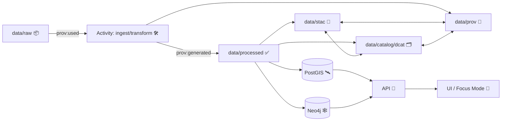

# 🧾 `data/prov/` — Provenance Bundles (W3C PROV‑O) ⛓️


> 🧠 **KFM rule of thumb:** if it ships to the **Graph / API / UI**, it ships with **provenance**.  
> No mystery layers. No unsourced outputs. No black boxes. ✅

This folder contains **W3C PROV‑O lineage records** (typically **JSON‑LD**) that capture **how** datasets, map layers, simulations, and evidence artifacts were produced: **inputs → processing activities → outputs**, plus **who/what ran the process** (agents), **when**, and **with what parameters**.

---

## 🧭 Quick navigation

- [What lives here](#-what-lives-here)
- [The “Evidence Triplet”](#-the-evidence-triplet)
- [Recommended folder layout](#-recommended-folder-layout)
- [Minimum requirements](#-minimum-requirements)
- [KFM‑PROV profile](#-kfm-prov-profile)
- [Patterns & recipes](#-patterns--recipes)
- [Governance, privacy, and cultural protocols](#-governance-privacy-and-cultural-protocols)
- [Validation & policy gates](#-validation--policy-gates)
- [FAQ](#-faq)

---

## 📦 What lives here

You’ll typically find PROV bundles for:

- **🗺️ Dataset publications**  
  Ingest/ETL activities that turn `data/raw/` evidence into `data/processed/` products.
- **🤖 AI / analysis “evidence artifacts”**  
  OCR corpora, AI‑predicted layers, derived analytics, generated summaries—**treated like first‑class datasets**.
- **🎮 Simulations & scenarios**  
  Sandbox runs and **promoted** simulation outputs (when they become official data products).
- **⏱️ Streaming / real‑time snapshots**  
  The provenance backbone for “live” readings: what was used, when it was read, and by which workflow.
- **🧪 CI / DevOps lineage (optional but encouraged)**  
  Capturing PR/merge/build events as provenance when you want end‑to‑end auditability.

---

## 🧩 The “Evidence Triplet”

KFM uses a **three‑part publication boundary** for anything that becomes “real” in the platform:

1. **📍 STAC** — spatial/temporal footprint + assets (`data/stac/…`)
2. **🗂️ DCAT** — dataset catalog record + license/publisher (`data/catalog/dcat/…`)
3. **🧾 PROV** — lineage + who/what/how (`data/prov/…`)

> ✅ These boundary artifacts are required before data is considered **fully published** and allowed into downstream stages (graph/API/UI).

### 🔁 Mental model (end‑to‑end)



---

## 🗂️ Recommended folder layout

This repo may evolve, but the canonical publishing locations follow the KFM v13 structure:

```text
data/
  raw/                 # immutable evidence inputs 📦
  work/                # intermediate / sandbox outputs 🧪
  processed/           # vetted data products ✅
  stac/                # STAC collections & items 📍
    collections/
    items/
  catalog/
    dcat/              # DCAT dataset records 🗂️
  prov/                # ✅ YOU ARE HERE: PROV lineage bundles 🧾
    README.md
```

### Suggested internal organization (recommended, not required)

If `data/prov/` becomes large, use subfolders to keep it clean:

```text
data/prov/
  datasets/            # dataset-level lineage bundles
  runs/                # pipeline run provenance (batch/streaming)
  ai/                  # AI/analysis “evidence artifact” provenance
  sims/                # simulation run provenance + promotions
  devops/              # PR/build provenance (optional)
  _schemas/            # optional: local copies of profile/schema references
  README.md
```

---

## ✅ Minimum requirements

A PROV bundle must be **useful for audits** and **reproducibility**, not just “technically valid”.

### Must capture (minimum)

- **Entities (📦 things):**
  - at least **one input entity** (raw or upstream dataset)
  - at least **one output entity** (processed asset, derived artifact, published product)
- **Activities (🛠️ transformations):**
  - the pipeline run / transform / simulation / inference step that produced the output
- **Agents (👤🤖 actors):**
  - who/what executed the activity (person, org, bot, service)
- **Core relations (🔗 lineage edges):**
  - input(s) **used by** activity
  - output **generated by** activity
  - activity **associated with** agent(s)

### Strongly recommended (KFM-style “no black boxes”)

- **⏱️ timestamps** (start/end, or at least end)
- **🔒 checksums/hashes** for major inputs/outputs (especially promoted artifacts)
- **🧬 pipeline identity** (name + version + config reference)
- **🧾 code provenance** (commit hash / tag, container digest, lockfile version, etc.)
- **🧭 spatial & temporal context** (link out to STAC for footprint; keep minimal duplication)
- **⚖️ governance metadata** (license, sensitivity/classification, access rules)
- **📊 uncertainty / confidence** for ML/sim outputs (even a basic metric is better than none)

---

## 🧬 KFM‑PROV profile

KFM version-controls its metadata profiles (example: **KFM‑PROV v11.0.0**).  
Treat the profile like a **contract**: prefer extending profiles over inventing ad‑hoc fields.

**Rule:** If you need new provenance fields for a domain, coordinate a profile update rather than “one‑off” keys.

---

## 🧱 Patterns & recipes

### 1) 🗺️ Standard dataset ingest (raw → processed → published)

**When you add/change anything in `data/processed/…`, you must also update:**
- ✅ STAC (item/collection)
- ✅ DCAT dataset record
- ✅ PROV lineage bundle

**Golden rule:** raw inputs remain immutable; transformations happen downstream.

<details>
<summary><strong>📄 PROV JSON‑LD starter template (illustrative)</strong> 🔽</summary>

```json
{
  "@context": "https://www.w3.org/ns/prov.jsonld",
  "@id": "urn:kfm:prov:bundle:dataset:<dataset_id>:<dataset_version>",
  "entity": {
    "urn:kfm:entity:raw:<source_id>": {
      "prov:label": "Raw source (as received)",
      "prov:type": "kfm:RawEvidence",
      "kfm:checksum": "sha256:<...>"
    },
    "urn:kfm:entity:processed:<asset_id>": {
      "prov:label": "Processed data product",
      "prov:type": "kfm:ProcessedProduct",
      "kfm:checksum": "sha256:<...>",
      "kfm:stac_ref": "data/stac/items/<...>.json",
      "kfm:dcat_ref": "data/catalog/dcat/<...>.json"
    }
  },
  "activity": {
    "urn:kfm:activity:ingest:<run_id>": {
      "prov:label": "ETL / ingest pipeline run",
      "prov:type": "kfm:PipelineRun",
      "prov:startedAtTime": "2026-01-19T00:00:00Z",
      "prov:endedAtTime": "2026-01-19T00:10:00Z",
      "kfm:pipeline": "pipelines/<domain>/<name>",
      "kfm:code_commit": "git:<commit_sha>",
      "kfm:parameters": { "example_param": "value" }
    }
  },
  "agent": {
    "urn:kfm:agent:person:<handle>": {
      "prov:type": "prov:Person",
      "prov:label": "<Name or handle>"
    },
    "urn:kfm:agent:bot:ci": {
      "prov:type": "prov:SoftwareAgent",
      "prov:label": "CI / Validation Bot"
    }
  },

  "used": {
    "urn:kfm:activity:ingest:<run_id>": ["urn:kfm:entity:raw:<source_id>"]
  },
  "wasGeneratedBy": {
    "urn:kfm:entity:processed:<asset_id>": "urn:kfm:activity:ingest:<run_id>"
  },
  "wasAssociatedWith": {
    "urn:kfm:activity:ingest:<run_id>": [
      "urn:kfm:agent:person:<handle>",
      "urn:kfm:agent:bot:ci"
    ]
  }
}
```

> ℹ️ Exact shape depends on the active KFM‑PROV profile. Use this as a **starting point**, not a rigid schema.

</details>

---

### 2) 🤖 AI / analysis “evidence artifacts”

KFM treats analysis outputs (including AI-generated outputs) as **first‑class datasets**:

- ✅ stored under `data/processed/…`
- ✅ cataloged in STAC/DCAT (clearly marked as derived/AI-generated)
- ✅ traced in PROV (inputs, model/method, parameters, confidence)
- ✅ loaded into graph cautiously (explicit provenance links)
- ✅ exposed only via governed APIs (no hard-coding artifacts directly in UI)

**Minimum extras to record for AI artifacts:**
- model name/version (or service identity)
- prompt/config (or a hashed reference)
- confidence/uncertainty measures
- human review status (if applicable)

---

### 3) ⏱️ Real‑time / streaming provenance

Treat streaming as **many small datasets over time**:

- keep a provenance “trail” that can answer:  
  **“Which reading (timestamped) was used for this view / answer?”**

If Focus Mode answers using a dynamic query, the system should still log PROV indicating the specific reading (with timestamp) used as an input entity.

---

### 4) 🎮 Simulations (`data/work/sims/` → promote to official)

Simulation outputs are **sandbox-first**:

- Run in: `data/work/sims/` ✅ (experimental)
- **Never** point Graph/API/UI directly at sandbox outputs ❌
- If the result becomes “official”, **promote** it to `data/processed/` and publish the triplet:
  - STAC
  - DCAT
  - PROV

**Reproducibility checklist (minimum):**
- pin input dataset hashes
- capture all parameters/configs
- pin environment (container digest / lockfiles)
- record random seeds (if applicable)
- basic verification tests / regression checks
- validation (compare to real data when possible)
- uncertainty quantification (at least a minimal sensitivity/ensemble summary)

---

### 5) 🧪 DevOps → PROV (optional, but powerful)

For full auditability, you can model development events as provenance:

- PR / merge = **prov:Activity**
- commits = **prov:Entity**
- authors/reviewers/CI bot = **prov:Agent**
- linkages via `prov:used`, `prov:wasAssociatedWith`, `prov:wasGeneratedBy`

This enables queries like:
- “Which code version produced this dataset?”
- “Who reviewed the change that modified this pipeline?”

---

## 🛡️ Governance, privacy, and cultural protocols

KFM provenance isn’t only “how it was built”—it’s also **how it is allowed to be used**.

Include (and enforce) governance metadata such as:

- **📜 license presence** (no license → no publish)
- **🔐 sensitivity/classification** (output cannot be less restricted than inputs)
- **🧑‍🤝‍🧑 cultural protocols / community constraints** when applicable  
  (e.g., restricted access, location obfuscation, context labels)
- **🏷️ contributor credit** (people/communities who contributed data or knowledge)

> ⚠️ If a dataset is sensitive, build your PROV + catalog metadata so downstream layers (Graph/API/UI) can enforce redaction, filtering, masking, or tiered access.

---

## 🧰 Validation & policy gates

KFM enforces automated gates at ingestion, inference, and publication:

- schema validation ✅
- STAC/DCAT/PROV completeness ✅
- license presence ✅
- sensitivity labeling + handling ✅
- provenance completeness ✅
- “fail closed” behavior ✅

**Expectation:** CI/policy checks should block merges when provenance is missing or inconsistent (example class of error: processed data changed but PROV didn’t).

---

## ❓ FAQ

### “Do I need PROV for *every* dataset?”
If it becomes available through Graph/API/UI: **yes** ✅. Provenance-first is a platform invariant.

### “Can I manually edit processed data to fix something?”
Prefer updating the pipeline/config and regenerating. Manual tweaks are strongly discouraged because they break reproducibility unless captured as a formal, documented activity.

### “Where should I store PROV for AI outputs?”
Treat them like datasets:
- put artifacts in `data/processed/…`
- publish STAC/DCAT
- store PROV here (`data/prov/…`) with model/method + confidence

### “How does UI benefit from PROV?”
UI components (Layer Info, exports, Focus Mode citations, provenance panels) can pull structured lineage to show users “the map behind the map” and automatically generate proper credits.

---

## 🧷 Contributor checklist (copy/paste)

- [ ] raw inputs are **immutable** (`data/raw/` unchanged)
- [ ] processed outputs written to `data/processed/…`
- [ ] STAC record created/updated (`data/stac/…`)
- [ ] DCAT record created/updated (`data/catalog/dcat/…`)
- [ ] PROV bundle created/updated (`data/prov/…`)
- [ ] license + sensitivity fields present
- [ ] hashes recorded for key inputs/outputs
- [ ] CI/policy gates pass ✅

---