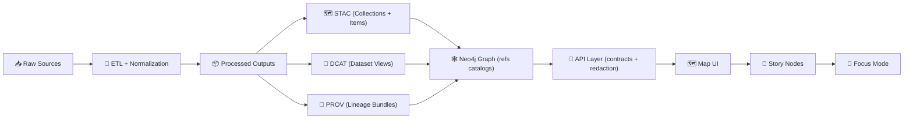

# 🧾 `data/prov/` — Provenance Bundles (PROV)


**This folder holds machine-readable PROV lineage bundles** for datasets and evidence artifacts (per run / per dataset). [oai_citation:0‡MARKDOWN_GUIDE_v13.md.gdoc](file-service://file-UYVruFXfueR8veHMUKeugU)

> [!IMPORTANT]
> ✅ **Boundary artifact required:** A PROV lineage file is written to `data/prov/` and captures **inputs → processing activities → agents**.  
> ✅ These boundary artifacts are **required before data is considered fully published** (and before downstream stages like graph/API/UI). [oai_citation:1‡MARKDOWN_GUIDE_v13.md.gdoc](file-service://file-UYVruFXfueR8veHMUKeugU)

---

## 🧭 Quick Navigation

- 🔥 [What belongs in `data/prov/`?](#-what-belongs-in-dataprov)
- 🗂️ [Folder layout](#️-folder-layout)
- 🔗 [How PROV connects to STAC + DCAT](#-how-prov-connects-to-stac--dcat)
- 🧱 [Bundle contract (minimum expectations)](#-bundle-contract-minimum-expectations)
- 🏷️ [Naming & versioning](#️-naming--versioning)
- 🧪 [Validation & CI gates](#-validation--ci-gates)
- 🛡️ [Governance & redaction](#️-governance--redaction)
- 🧠 [AI/analysis “evidence artifacts”](#-aianalysis-evidence-artifacts)
- 📚 [Sources](#-sources)

---

## 🔥 What belongs in `data/prov/`?

A **PROV activity bundle** is the canonical “paper trail” for how a dataset (or evidence artifact) was produced. At minimum, it should capture:

- 📥 **Raw inputs** (source entities)
- 🧪 **Processing steps** (activities)
- 👤🤖 **Agents** (people + software)
- 🧾 **Outputs** (processed entities)
- 🧷 **Run identity** (run id / config identity / commit hash)

KFM explicitly requires that **PROV lineage records link the full chain**:  
`raw inputs → intermediate work → processed outputs`, and they should identify the specific pipeline run/config via **run ID or commit hash** [oai_citation:2‡MARKDOWN_GUIDE_v13.md.gdoc](file-service://file-UYVruFXfueR8veHMUKeugU).

> [!NOTE]
> 🌐 PROV is one of KFM’s “catalog boundary outputs” alongside STAC and DCAT (see the alignment policy). [oai_citation:3‡MARKDOWN_GUIDE_v13.md.gdoc](file-service://file-UYVruFXfueR8veHMUKeugU)

---

## 🗂️ Folder layout

### ✅ Canonical placement (repo-level)

KFM’s draft v13 structure places PROV bundles at `data/prov/` [oai_citation:4‡MARKDOWN_GUIDE_v13.md.gdoc](file-service://file-UYVruFXfueR8veHMUKeugU) alongside other catalogs:

```text
📁 data/
├── 🗺️ stac/
│   ├── 📁 collections/
│   └── 📁 items/
├── 📇 catalog/
│   └── 📁 dcat/
├── 🧾 prov/        # ← you are here (PROV bundles per run / per dataset)
└── 🧠 graph/       # (imports/exports for Neo4j, etc.)
```

### 🧩 Recommended internal convention (within `data/prov/`)

> [!TIP]
> This is a **repo convention** to keep things discoverable. If a stricter schema is introduced, align it with `docs/standards/KFM_PROV_PROFILE.md` and `schemas/` (contract-first). [oai_citation:5‡MARKDOWN_GUIDE_v13.md.gdoc](file-service://file-UYVruFXfueR8veHMUKeugU)

```text
📁 data/prov/
├── 📁 <domain>/                         # e.g. historical/, air-quality/, hydrology/
│   ├── 📁 <dataset_id>/                 # stable slug (kebab-case)
│   │   ├── 🧾 <run_id>.prov.json        # one run = one bundle
│   │   └── 🧾 <run_id>.prov.json.sig    # optional: signature/attestation
│   └── 📄 README.md                     # optional: domain-specific PROV notes
└── 📄 README.md                         # this file
```

---

## 🔗 How PROV connects to STAC + DCAT

KFM’s policy requires **STAC + DCAT + PROV** for *every* new dataset/evidence artifact:

- 🗺️ **STAC Collection + Item(s)** (assets + spatiotemporal metadata)
- 📇 **DCAT Dataset entry** (discoverability + distribution links)
- 🧾 **PROV activity bundle** (how it was produced: sources, steps, agents, timestamps, params/config) [oai_citation:6‡MARKDOWN_GUIDE_v13.md.gdoc](file-service://file-UYVruFXfueR8veHMUKeugU)

And KFM enforces cross-layer linkage expectations, including that PROV captures end-to-end lineage and run identity. [oai_citation:7‡MARKDOWN_GUIDE_v13.md.gdoc](file-service://file-UYVruFXfueR8veHMUKeugU)

### 🗺️ System flow (at a glance)



> [!IMPORTANT]
> 🧬 **Provenance-first means no leapfrogging:** Published data must be registered with provenance *before* graph/UI use; in practice, every dataset/model result produces STAC/DCAT and a PROV record as a prerequisite to ingestion or story reference. [oai_citation:8‡MARKDOWN_GUIDE_v13.md.gdoc](file-service://file-UYVruFXfueR8veHMUKeugU)

---

## 🧱 Bundle contract (minimum expectations)

> [!NOTE]
> Think of a PROV bundle as the “checksum + recipe + accountability” layer for any dataset.

### ✅ Minimum objects (conceptual)

| 🧩 Concept | PROV type | What it should capture | Why it matters |
|---|---|---|---|
| 📥 Inputs | `prov:Entity` | raw sources (URI/path), hashes, license/source attribution | reproducibility + traceability |
| 🧪 Steps | `prov:Activity` | pipeline step name, start/end time, parameters/config | auditability + reruns |
| 👤🤖 Agents | `prov:Agent` | person/team + software + version | accountability |
| 📦 Outputs | `prov:Entity` | processed artifact identifiers + hashes + location | stable referencing |
| 🧷 Links | `prov:used`, `prov:wasGeneratedBy`, `prov:wasDerivedFrom` | relationships tying everything together | end-to-end lineage |

### 📎 “Do not break” invariant (KFM)

KFM defines a **deterministic pipeline** expectation: transformations should be **idempotent, config-driven, fully logged**, producing stable outputs for stable inputs — enabling verifiable lineage. [oai_citation:9‡MARKDOWN_GUIDE_v13.md.gdoc](file-service://file-UYVruFXfueR8veHMUKeugU)

---

## 🏷️ Naming & versioning

### 🧷 Run identity (required)

Your PROV bundle should identify the specific pipeline run or config that produced outputs (e.g., run ID, commit hash). [oai_citation:10‡MARKDOWN_GUIDE_v13.md.gdoc](file-service://file-UYVruFXfueR8veHMUKeugU)

**Suggested run ID format** (human + machine friendly):

- `YYYYMMDDThhmmssZ_<dataset>_<shortGitSha>`
  - example: `20260102T031455Z_airq_pm25_daily_1a2b3c4.prov.json`

### ♻️ Dataset versioning

When data is updated/reprocessed, **new versions should link to predecessors** in DCAT and PROV (e.g., `prov:wasRevisionOf`). [oai_citation:11‡MARKDOWN_GUIDE_v13.md.gdoc](file-service://file-UYVruFXfueR8veHMUKeugU)

> [!TIP]
> If you change data, change lineage. A rerun without a new PROV bundle is basically “ghost processing.”

---

## 🧪 Validation & CI gates

KFM’s standards and profiles (including PROV) are intended to be validated by CI, and missing/invalid provenance is a build breaker. [oai_citation:12‡MARKDOWN_GUIDE_v13.md.gdoc](file-service://file-UYVruFXfueR8veHMUKeugU) [oai_citation:13‡MARKDOWN_GUIDE_v13.md.gdoc](file-service://file-UYVruFXfueR8veHMUKeugU)

> [!WARNING]
> CI is expected to fail on violations like **missing PROV**, broken links, or leaking secrets/sensitive info. [oai_citation:14‡MARKDOWN_GUIDE_v13.md.gdoc](file-service://file-UYVruFXfueR8veHMUKeugU)

### ✅ Practical checklist (before opening a PR)

- [ ] PROV bundle exists in `data/prov/...`
- [ ] Bundle links raw → work → processed lineage [oai_citation:15‡MARKDOWN_GUIDE_v13.md.gdoc](file-service://file-UYVruFXfueR8veHMUKeugU)
- [ ] Bundle includes run id / commit hash [oai_citation:16‡MARKDOWN_GUIDE_v13.md.gdoc](file-service://file-UYVruFXfueR8veHMUKeugU)
- [ ] STAC/DCAT entries exist and point to outputs [oai_citation:17‡MARKDOWN_GUIDE_v13.md.gdoc](file-service://file-UYVruFXfueR8veHMUKeugU)
- [ ] Provenance is present before graph/UI/story usage [oai_citation:18‡MARKDOWN_GUIDE_v13.md.gdoc](file-service://file-UYVruFXfueR8veHMUKeugU)

---

## 🛡️ Governance & redaction

Even “just metadata” can be sensitive (paths, coordinates, identities, model parameters, etc.).

KFM requires that artifacts exposed in the UI flow through the governed API layer so redaction/classification can be enforced — **no direct access/hard-coding** in UI. [oai_citation:19‡MARKDOWN_GUIDE_v13.md.gdoc](file-service://file-UYVruFXfueR8veHMUKeugU)

> [!IMPORTANT]
> 🔐 If your PROV includes sensitive references (locations, identities, internal filenames), assume it may require redaction and governance review before being surfaced.

---

## 🧠 AI/analysis “evidence artifacts”

KFM treats analysis outputs and AI-generated datasets as **first-class datasets with full provenance** (they must be stored, cataloged, and traced like anything else). [oai_citation:20‡MARKDOWN_GUIDE_v13.md.gdoc](file-service://file-UYVruFXfueR8veHMUKeugU)

Specifically for PROV:

- The model run / transformation should be captured as a PROV activity
- Include references to inputs, the method (algorithm/model), and parameters + confidence metrics [oai_citation:21‡MARKDOWN_GUIDE_v13.md.gdoc](file-service://file-UYVruFXfueR8veHMUKeugU)

> [!NOTE]
> 🧾 The goal is that evidence artifacts are “virtually indistinguishable” from regular datasets in the pipeline — **just with additional provenance about computational origin**. [oai_citation:22‡MARKDOWN_GUIDE_v13.md.gdoc](file-service://file-UYVruFXfueR8veHMUKeugU)

---

## 🧰 Example PROV bundle (illustrative)

> [!CAUTION]
> This is a **shape example** for contributors. The authoritative constraints should live in `docs/standards/KFM_PROV_PROFILE.md` and `schemas/` once fully implemented (contract-first). [oai_citation:23‡MARKDOWN_GUIDE_v13.md.gdoc](file-service://file-UYVruFXfueR8veHMUKeugU)

```json
{
  "@context": {
    "prov": "http://www.w3.org/ns/prov#",
    "kfm": "https://kansasfrontiermatrix.example/ns#"
  },
  "@graph": [
    {
      "@id": "kfm:activity:run/20260102T031455Z_airq_pm25_daily_1a2b3c4",
      "@type": "prov:Activity",
      "prov:startedAtTime": "2026-01-02T03:14:55Z",
      "prov:endedAtTime": "2026-01-02T03:16:12Z",
      "kfm:runId": "20260102T031455Z_airq_pm25_daily_1a2b3c4",
      "kfm:gitCommit": "1a2b3c4",
      "kfm:pipeline": "src/pipelines/air_quality/pm25_daily",
      "kfm:paramsRef": "data/work/air-quality/pm25_daily/config.yaml"
    },
    {
      "@id": "kfm:entity:raw/us_epa_source_file",
      "@type": "prov:Entity",
      "prov:location": "data/raw/air-quality/epa/pm25.csv",
      "kfm:sha256": "…"
    },
    {
      "@id": "kfm:entity:processed/pm25_daily_raster",
      "@type": "prov:Entity",
      "prov:location": "data/processed/air-quality/pm25_daily/pm25_2026-01-01.tif",
      "kfm:sha256": "…"
    },
    {
      "@id": "kfm:agent:software/kfm_pipeline",
      "@type": "prov:Agent",
      "kfm:name": "KFM Pipeline Runner",
      "kfm:version": "v13"
    },

    { "@id": "kfm:activity:run/20260102T031455Z_airq_pm25_daily_1a2b3c4", "prov:used": { "@id": "kfm:entity:raw/us_epa_source_file" } },
    { "@id": "kfm:entity:processed/pm25_daily_raster", "prov:wasGeneratedBy": { "@id": "kfm:activity:run/20260102T031455Z_airq_pm25_daily_1a2b3c4" } },
    { "@id": "kfm:activity:run/20260102T031455Z_airq_pm25_daily_1a2b3c4", "prov:wasAssociatedWith": { "@id": "kfm:agent:software/kfm_pipeline" } }
  ]
}
```

---

## 📚 Sources

- **KFM Master Guide v13 (Draft) — directory layout, catalogs policy, provenance-first rules**  
   [oai_citation:24‡MARKDOWN_GUIDE_v13.md.gdoc](file-service://file-UYVruFXfueR8veHMUKeugU)  
  Key excerpts used here: PROV placement + “boundary artifact” requirement [oai_citation:25‡MARKDOWN_GUIDE_v13.md.gdoc](file-service://file-UYVruFXfueR8veHMUKeugU), directory layout showing `data/prov/` [oai_citation:26‡MARKDOWN_GUIDE_v13.md.gdoc](file-service://file-UYVruFXfueR8veHMUKeugU), alignment expectations [oai_citation:27‡MARKDOWN_GUIDE_v13.md.gdoc](file-service://file-UYVruFXfueR8veHMUKeugU), end-to-end lineage and run identity [oai_citation:28‡MARKDOWN_GUIDE_v13.md.gdoc](file-service://file-UYVruFXfueR8veHMUKeugU), and provenance-first gating before graph/UI/story [oai_citation:29‡MARKDOWN_GUIDE_v13.md.gdoc](file-service://file-UYVruFXfueR8veHMUKeugU).