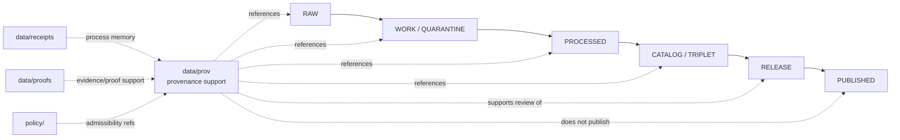

<!-- [KFM_META_BLOCK_V2]
doc_id: kfm://data/prov/readme
title: data/prov README
type: directory-readme
version: v0.1
status: draft
owners:
  - TODO(owner): data steward
  - TODO(owner): provenance steward
  - TODO(owner): catalog steward
  - TODO(owner): proof steward
  - TODO(owner): release steward
created: 2026-06-25
updated: 2026-06-25
policy_label: public-review
path: data/prov/README.md
related:
  - ../README.md
  - ../catalog/README.md
  - ../catalog/prov/README.md
  - ../proofs/README.md
  - ../receipts/README.md
  - ../processed/README.md
  - ../published/README.md
  - ../../release/README.md
  - ../../docs/adr/ADR-0011-receipts-vs-proofs-vs-manifests-vs-catalog-separation.md
  - ../../docs/doctrine/directory-rules.md
  - ../../contracts/README.md
  - ../../schemas/README.md
  - ../../policy/README.md
notes:
  - "Root README for data/prov provenance support. It replaces a greenfield stub."
  - "The current repo also documents PROV catalog records under data/catalog/. Treat this lane as provenance support/compatibility until an ADR or migration note resolves the boundary with data/catalog/prov/."
  - "This README describes directory responsibility and guardrails. It does not prove emitted PROV records, schemas, validators, fixtures, CI workflows, or release-gate enforcement exist."
[/KFM_META_BLOCK_V2] -->

<a id="top"></a>

# `data/prov/`

> Provenance-support lane for KFM data lineage records, provenance indexes, and PROV-style references that help maintainers inspect how a candidate, catalog record, proof, release, correction, or rollback artifact was derived.


> [!IMPORTANT]
> **Status:** `draft`  
> **Owners:** `TODO(owner): data steward` · `TODO(owner): provenance steward` · `TODO(owner): catalog steward` · `TODO(owner): proof steward` · `TODO(owner): release steward`  
> **Path:** `data/prov/README.md`  
> **Truth posture:** CONFIRMED path exists as a current repo stub / CONFIRMED `data/README.md` lists `prov` under `data/` / CONFLICTED with `data/catalog/README.md` recommending PROV catalog projections under `data/catalog/prov/` / NEEDS VERIFICATION for accepted instance shape, schemas, validators, CI, and migration posture.

> [!WARNING]
> Provenance support is not proof, not a catalog approval, not a release decision, and not publication. Use this lane to preserve derivation context and references; keep catalog records, proof objects, receipts, release decisions, and published carriers in their owning roots.

---

## Quick jumps

| Section | Use it for |
|---|---|
| [1. Scope](#1-scope) | What this lane is for. |
| [2. Boundary note](#2-boundary-note) | How `data/prov/` relates to `data/catalog/prov/`. |
| [3. Repo fit](#3-repo-fit) | Neighboring roots and authority boundaries. |
| [4. Accepted inputs](#4-accepted-inputs) | What belongs here. |
| [5. Exclusions](#5-exclusions) | What belongs somewhere else. |
| [6. Directory pattern](#6-directory-pattern) | Proposed child layout. |
| [7. Minimum provenance support shape](#7-minimum-provenance-support-shape) | Proposed fields for future instances. |
| [8. Lifecycle relationship](#8-lifecycle-relationship) | Where provenance support fits RAW → PUBLISHED. |
| [9. Maintenance checklist](#9-maintenance-checklist) | Review gates before adding files. |
| [10. Definition of done](#10-definition-of-done) | What remains before maturity. |

---

## 1. Scope

`data/prov/` is a provenance-support lane under the `data/` lifecycle root. It should help answer:

- what source, process, candidate, proof, catalog record, release candidate, published artifact, correction, or rollback item a record is about;
- which upstream and downstream references are connected;
- which process receipts, validation reports, evidence bundles, catalog records, review records, and release records are relevant;
- which time fields and digests bind the lineage; and
- whether the provenance support is complete enough to assist review, catalog closure, release review, correction, or rollback.

This lane should make lineage easier to inspect without turning lineage metadata into proof, catalog approval, or release authority.

[Back to top](#top)

---

## 2. Boundary note

There is a current placement tension to preserve rather than hide:

- `data/README.md` lists `prov` as a data-root lane.
- `data/catalog/README.md` lists PROV catalog records as accepted catalog-stage contents and recommends `data/catalog/prov/` in its catalog layout.

Until an ADR, migration note, or accepted directory rule resolves that boundary, use this safe interpretation:

| Lane | Use | Status |
|---|---|---|
| `data/prov/` | Provenance-support indexes, lineage bundles, and cross-family provenance references that are not themselves catalog records. | CONFIRMED path exists; instance rules NEEDS VERIFICATION. |
| `data/catalog/prov/` | PROV catalog projections that are part of the CATALOG stage. | PROPOSED by `data/catalog/README.md`; path presence NEEDS VERIFICATION. |

> [!CAUTION]
> Do not use `data/prov/` to create a parallel catalog authority. If a file is a catalog-stage PROV projection, prefer `data/catalog/prov/` unless a later ADR says otherwise.

[Back to top](#top)

---

## 3. Repo fit

| Neighbor | Role | Boundary |
|---|---|---|
| [`../raw/`](../raw/) | Source captures. | Provenance records may reference RAW captures; they do not store them. |
| [`../work/`](../work/) / [`../quarantine/`](../quarantine/) | Working candidates and held material. | Provenance may record lineage state; it does not normalize or quarantine. |
| [`../processed/`](../processed/) | Validated normalized candidates. | Provenance may describe derivation; processed data remains upstream. |
| [`../catalog/`](../catalog/) | Catalog-stage records, including PROV catalog projections. | Catalog records belong there, not here, unless boundary is resolved differently. |
| [`../triplets/`](../triplets/) | Graph/triplet projection. | Provenance can reference graph artifacts; it is not the graph store. |
| [`../proofs/`](../proofs/) | Evidence, validation, proof pack, review, and proof support. | Provenance can reference proof artifacts; it does not replace proof. |
| [`../receipts/`](../receipts/) | Process memory. | Receipts record operations; provenance connects lineage. |
| [`../published/`](../published/) | Released public-safe carriers. | Provenance support is not public publication by placement. |
| [`../../release/`](../../release/) | Release decisions, rollback cards, correction notices, signatures. | Release authority stays in `release/`. |
| [`../../contracts/`](../../contracts/) | Semantic meaning. | Provenance contract meaning belongs there once accepted. |
| [`../../schemas/`](../../schemas/) | Machine shape. | Machine-readable shape belongs there once accepted. |
| [`../../policy/`](../../policy/) | Admissibility. | Provenance records may reference policy outcomes; they do not define policy. |

[Back to top](#top)

---

## 4. Accepted inputs

Use this lane for provenance support that is safe to store under repository policy and useful for inspection, review, correction, rollback, or migration.

| Accepted item | Suggested placement | Status |
|---|---|---|
| Provenance support README | `data/prov/README.md` | CONFIRMED. |
| Cross-family lineage bundle | `data/prov/bundles/<bundle_id>.prov.json` | PROPOSED. |
| Provenance index | `data/prov/indexes/<scope>.prov-index.json` | PROPOSED. |
| Release-linked provenance support | `data/prov/release_refs/<release_id>.prov-ref.json` | PROPOSED; release authority remains in `release/`. |
| Correction / rollback lineage support | `data/prov/corrections/<correction_id>.prov.json` | PROPOSED; correction authority remains in `release/`. |
| Migration or supersession lineage support | `data/prov/retired/<id>.superseded-prov.json` | PROPOSED. |

[Back to top](#top)

---

## 5. Exclusions

| Excluded material | Correct home |
|---|---|
| RAW source captures or downloads | `data/raw/` |
| WORK or QUARANTINE candidates | `data/work/` or `data/quarantine/` |
| Processed normalized data | `data/processed/` |
| PROV catalog records | `data/catalog/prov/` once verified; otherwise `data/catalog/` boundary review required |
| EvidenceBundle, ValidationReport, ProofPack, citation validation, or review proof objects | `data/proofs/` child lanes |
| Process receipts | `data/receipts/` |
| Triplets or graph edges | `data/triplets/` |
| ReleaseManifest, PromotionDecision, RollbackCard, CorrectionNotice, WithdrawalNotice, signatures | `release/` |
| Published layers, reports, API payloads, or story carriers | `data/published/` after release gates |
| Policy rules | `policy/` |
| Machine schemas | `schemas/` |
| Semantic contracts | `contracts/` |

[Back to top](#top)

---

## 6. Directory pattern

```text
data/prov/
├── README.md
├── bundles/
│   └── <bundle_id>.prov.json
├── indexes/
│   └── <scope>.prov-index.json
├── release_refs/
│   └── <release_id>.prov-ref.json
├── corrections/
│   └── <correction_id>.prov.json
└── retired/
    └── <id>.superseded-prov.json
```

> [!NOTE]
> This child layout is PROPOSED until contracts, schemas, validators, fixtures, and a placement decision clarify how `data/prov/` should coexist with `data/catalog/prov/`.

[Back to top](#top)

---

## 7. Minimum provenance support shape

A future machine-readable provenance support object should include at least these fields. This shape is PROPOSED until backed by contracts and schemas.

| Field | Purpose |
|---|---|
| `prov_id` | Stable provenance-support identifier. |
| `scope` | Source, run, candidate, catalog, proof, release, correction, rollback, or cross-family scope. |
| `subject_ref` | The object this provenance support describes. |
| `upstream_refs` | Sources, receipts, processed candidates, EvidenceBundles, or catalog records used. |
| `downstream_refs` | Catalog, proof, release, published, correction, or rollback objects that consume it. |
| `activity_refs` | Transform, validation, review, catalog, release, correction, or rollback activities. |
| `agent_refs` | Tool, pipeline, steward, reviewer, or service identity references. |
| `time_refs` | Source, observed, run, retrieval, validation, release, correction, and supersession times where material. |
| `digest_refs` | Input, output, canonical, or bundle digests. |
| `policy_refs` | Policy decisions or access posture references where material. |
| `review_refs` | ReviewRecord or review proof references where material. |
| `release_refs` | Release candidate, manifest, correction, withdrawal, or rollback refs. |
| `status` | `draft`, `candidate`, `accepted`, `superseded`, `retired`, or `needs_verification`. |
| `reasons` | Machine-readable reason list. |

[Back to top](#top)

---

## 8. Lifecycle relationship


```mermaid
flowchart LR
  RAW["RAW"] --> WORK["WORK / QUARANTINE"]
  WORK --> PROC["PROCESSED"]
  PROC --> CAT["CATALOG / TRIPLET"]
  CAT --> REL["RELEASE"]
  REL --> PUB["PUBLISHED"]

  PROV["data/prov<br/>provenance support"] -. references .-> RAW
  PROV -. references .-> WORK
  PROV -. references .-> PROC
  PROV -. references .-> CAT
  PROV -. supports review of .-> REL
  PROV -. "does not publish" .-> PUB

  REC["data/receipts"] -. process memory .-> PROV
  PROOF["data/proofs"] -. evidence/proof support .-> PROV
  POLICY["policy/"] -. admissibility refs .-> PROV
```

Provenance support can connect lifecycle stages. It does not replace the lifecycle, and it does not make publication true.

[Back to top](#top)

---

## 9. Maintenance checklist

Before adding provenance support under this root, verify:

- [ ] The file is provenance support, not source data, proof, receipt, catalog record, release decision, schema, contract, or policy.
- [ ] If the file is a PROV catalog projection, route it to `data/catalog/prov/` or open a placement review.
- [ ] The subject, upstream references, downstream references, activities, agents, times, and digests are explicit.
- [ ] Evidence, receipt, proof, catalog, review, release, correction, and rollback references remain in their owning roots.
- [ ] The file does not duplicate raw source payloads.
- [ ] The file does not claim publication, policy approval, release authority, or proof closure by placement.
- [ ] Public clients do not read this path directly as a normal runtime path.

[Back to top](#top)

---

## 10. Definition of done

This lane is operationally mature when:

- [ ] The placement boundary between `data/prov/` and `data/catalog/prov/` is resolved by ADR, migration note, or accepted Directory Rules update.
- [ ] A semantic provenance-support contract exists under `contracts/`.
- [ ] A machine-checkable schema exists under `schemas/`.
- [ ] Validators and fixtures exist for valid, invalid, superseded, and release-linked provenance support.
- [ ] CI or equivalent checks prevent family collapse across receipts, proofs, catalog, release, and published artifacts.
- [ ] Release docs describe when provenance support is required before publication, correction, or rollback.
- [ ] A synthetic no-network release candidate demonstrates source → receipt → validation → evidence/proof → catalog → provenance support → release → published artifact → rollback traceability.

---

## Maintainer note

Provenance is connective tissue, not authority transfer. Keep lineage records compact, reference-rich, reversible, and honest about what they prove. When placement, rights, evidence, policy, release state, or rollback support is unclear, mark the file `NEEDS VERIFICATION` and keep the claim out of public authority paths.
