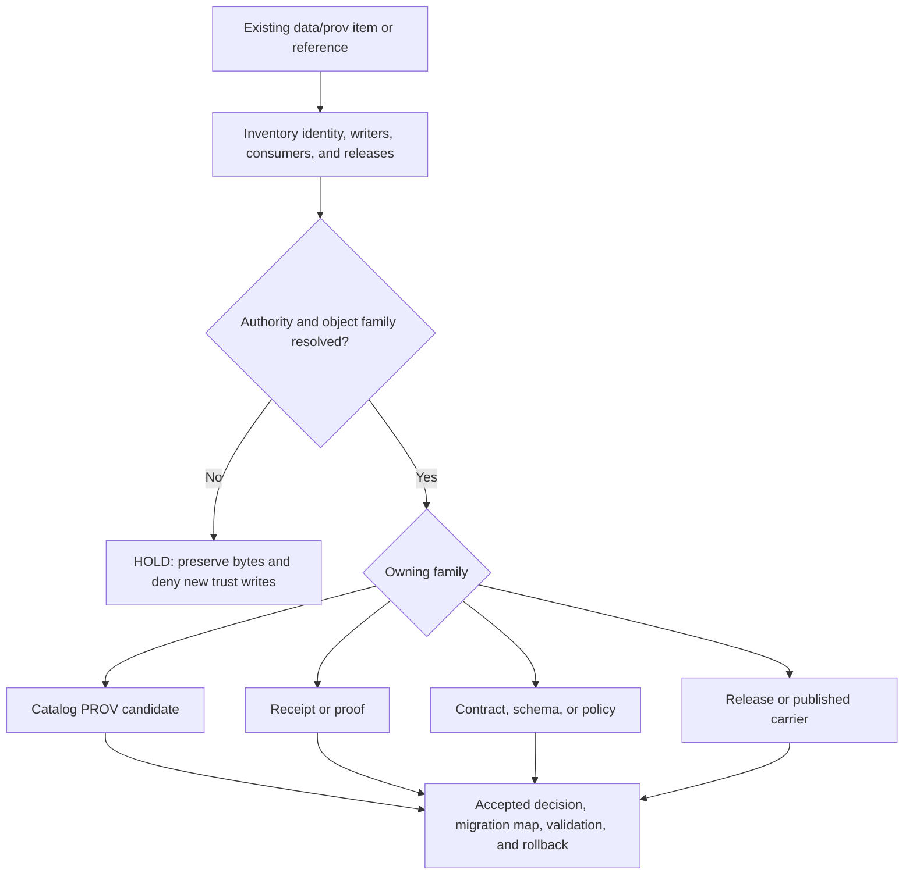

<!-- [KFM_META_BLOCK_V2]
doc_id: kfm://data/prov/readme
title: data/prov/ — Provenance Compatibility and Routing
type: README; data-parent-contract; compatibility-lane; authority-boundary
version: v0.3.0
status: repository-grounded draft; compatibility-routing; placement-conflicted; payload/runtime enforcement unverified
owners: NEEDS VERIFICATION — data, catalog, provenance, migration, release, correction, and rollback stewards
updated: 2026-07-26
supersedes: v0.2.0 README at the same path; no payload, lifecycle, release, runtime, or publication state
prepared_under_prompt: KFM Markdown Modernization & GitHub Documentation Implementation Agent v4.0.0
policy_label: "restricted-review; no-new-trust-writes; no-direct-public-path; release-gated"
current_path: data/prov/README.md
review_packet_id: kfm-data-prov-readme-20260726
truth_posture: >
  CONFIRMED exact path, current target blob, current parent and catalog-PROV
  README blobs, prior Directory Rules v1.4 blob and ordered README contract,
  proposed Directory Rules v2 blob, proposed ADR-0029 and ADR index state,
  current CODEOWNERS fallback route, current documentation-link workflow hold,
  and zero open pull requests at preflight / CONFLICTED Directory Rules adoption
  and data/prov versus data/catalog/prov placement / UNKNOWN recursive payloads,
  active writers/consumers, external stores, runtime, release, hosting, and
  public effects / NEEDS VERIFICATION accountable owners, accepted placement
  authority, enforcement, retention, correction propagation, cache invalidation,
  consumer cutover, and rollback drills
evidence_snapshot:
  repository: bartytime4life/Kansas-Frontier-Matrix
  repository_id: "1059091169"
  visibility: public
  base_ref: main
  base_commit: ba138f4de38fbaae6529d218d083e5a7e90723b3
  prior_blob: 589358cf60c20b3536c9fbc429e3a92a30e3595f
  parent_data_readme_blob: 22d13b833369c290fe99e4a3d3c083835e5f2a37
  catalog_prov_readme_blob: 8fc8fb37f4d89fcb545112f9e90400bd408541b1
  prior_directory_rules_v1_4_blob: 2affb080e6f0043867c64c7f06c1ca52030fbd55
  proposed_directory_rules_v2_blob: fd49a0b83e55cef52c1124281f093e263526898d
  adr_0029_blob: d34e24ff322bf2a8077379eb2803811dcf8924e5
  codeowners_blob: dd2a84aa514d8ecd9208bc347f90f9a2ed37dd61
  link_check_workflow_blob: c91477f6a6da84203e61b3151076eb46b3a65941
  open_overlapping_pull_requests_found: "0"
  inventory_method: exact GitHub file reads, bounded indexed search, open-PR search, and workflow-trigger review; no recursive tree, Git history walk, LFS inventory, runtime, external store, deployment, or production inspection
notes:
  - "The first twelve H2 sections preserve the prior Directory Rules v1.4 section 15 folder-README order; this does not adopt Directory Rules v2."
  - "This README applies only the fail-closed boundary shared by the inspected repository contracts while placement authority remains conflicted."
  - "Markdown-only upgrade; no payload, redirect, migration, deletion, source activation, release, correction, rollback, or publication state changed."
[/KFM_META_BLOCK_V2] -->

# `data/prov/` — Provenance Compatibility and Routing

> **One-line purpose.** Keep the existing provenance-support path fail-closed and reviewable while preventing it from becoming a second PROV catalog, receipt, proof, policy, release, or publication authority.

> [!IMPORTANT]
> Directory placement, a provenance edge, a generated derivative, a successful check, a pull request, or a merge does not create truth, evidence closure, rights clearance, policy permission, release approval, or KFM publication.

> [!WARNING]
> Do not place secrets, restricted source material, living-person or genomic data,
> culturally sensitive records, exact rare-species or archaeology locations,
> harmful infrastructure detail, private endpoints, or signed URLs in this
> public-repository path.

**Quick navigation**

- Folder contract: [Purpose](#purpose) · [Authority](#authority-level) · [Status](#status) · [Belongs](#what-belongs-here) · [Exclusions](#what-does-not-belong-here) · [Inputs](#inputs) · [Outputs](#outputs)
- Governance: [Validation](#validation) · [Review](#review-burden) · [Related folders](#related-folders) · [ADRs](#adrs) · [Last reviewed](#last-reviewed)
- Operations: [Operating contract](#operating-contract) · [Routing](#object-family-routing) · [Migration](#migration-decision-aid) · [Inventory](#current-bounded-child-lane-index) · [Evidence](#evidence-ledger) · [Verification](#open-verification-register) · [Rollback](#correction-and-rollback) · [No-loss](#no-loss-ledger)

## Purpose

Keep the existing provenance-support path fail-closed and reviewable while preventing it from becoming a second PROV catalog, receipt, proof, policy, release, or publication authority.

Artifacts or references here may help explain lineage, but path placement cannot make a claim authoritative, rights-cleared, policy-admitted, reviewed, released, public-safe, or public.

## Authority level

**Compatibility — transitional by the prior folder contract; placement authority remains conflicted.**

The checked repository now stores Directory Rules `2.0.0-draft.1` at [`docs/doctrine/directory-rules.md`](../../docs/doctrine/directory-rules.md), while [`ADR-0029`](../../docs/adr/ADR-0029-adopt-directory-governance-standard-v2.md) and the [ADR index](../../docs/adr/INDEX.md) remain `proposed`. The proposed rules therefore have no adoption or supersession effect.

The prior v1.4 rules and the proposed v2 text both identify direct `data/prov/` placement as a migration or conflict candidate and point PROV catalog projections toward [`data/catalog/prov/`](../catalog/prov/README.md). That agreement supports containment and routing; it does **not** accept v2, authorize a move, prove consumer closure, or retire this path.

This lane owns no object meaning, machine shape, policy decision, release decision, public serving, or factual truth. Those responsibilities remain separated across `contracts/`, `schemas/`, `policy/`, `release/`, governed data lanes, and approved delivery interfaces.

## Status

| Field | Bounded result |
|---|---|
| Path | `data/prov/README.md` |
| Document version | `v0.3.0` |
| Evidence base | `main@ba138f4de38fbaae6529d218d083e5a7e90723b3` |
| Prior target blob | `589358cf60c20b3536c9fbc429e3a92a30e3595f` |
| Directory Rules state | v1.4 retained in Git history; v2 present as `PROPOSED_FOR_ADOPTION`; ADR-0029 remains `proposed` |
| PROV lane relationship | `data/prov/` versus `data/catalog/prov/` is placement-conflicted |
| Recursive payload inventory | `UNKNOWN` |
| Active writers and consumers | `UNKNOWN` |
| Open overlapping pull requests at preflight | `0` |
| Public readiness | **DENY BY DEFAULT** |

The status above describes the checked documentation and repository snapshot. It does not establish runtime enforcement, payload absence, operational maturity, or public release.

## What belongs here

Only bounded compatibility and migration-support material belongs here:

- this README and non-authoritative navigation;
- pinned inventories that distinguish files, object families, identities, writers, consumers, releases, and external stores;
- old-to-new path and identity mappings backed by an accepted decision and migration record;
- deprecation, redirect, tombstone, and consumer-cutover notes;
- non-payload references that route readers to the owning contract, schema, policy, catalog, receipt, proof, release, correction, or rollback family.

No new trust-bearing write is admitted merely because it is described as “provenance.”

## What does NOT belong here

| Do not place here | Owning family or required action |
|---|---|
| New semantic PROV catalog records | Use the repository-documented [`data/catalog/prov/`](../catalog/prov/README.md) lane only after applicable profile, contract, schema, validation, policy, and promotion gates are satisfied |
| RAW source captures or unresolved source payloads | Route through `data/raw/` or fail closed to `data/quarantine/` under source-admission controls |
| Process, build, ingest, validation, or rollback receipts | [`data/receipts/`](../receipts/README.md) |
| Evidence or proof objects | [`data/proofs/`](../proofs/README.md) |
| Source, dataset, layer, rights, sensitivity, or crosswalk registry records | [`data/registry/`](../registry/README.md) |
| Semantic contracts, machine schemas, or policy decisions | [`contracts/`](../../contracts/README.md), [`schemas/`](../../schemas/README.md), and [`policy/`](../../policy/README.md) |
| Release manifests, promotion decisions, corrections, withdrawals, or rollback decisions | [`release/`](../../release/README.md) |
| Released public-safe carriers | [`data/published/`](../published/README.md), after governed release binding |
| Connector, pipeline, validator, API, UI, or runtime implementation | The owning implementation root; this compatibility lane is not executable authority |
| Credentials, private endpoints, unsafe logs, or harmful-precision material | Approved secret or restricted operational systems outside ordinary public-repository paths |
| Maps, graphs, indexes, reports, AI output, or badges presented as sovereign truth | Resolve governed evidence and release state or abstain |

## Inputs

Compatibility work may consume:

- a pinned recursive inventory of tracked, generated, LFS-managed, ignored, and externally stored material;
- producer, consumer, import, link, API/UI, workflow, release, cache, and index searches;
- object-family classification with stable identity and digest evidence;
- source role, spatial and temporal scope, rights, sensitivity, retention, and legal-hold posture;
- applicable contracts, schemas, policy decisions, fixtures, tests, validators, receipts, proofs, release records, corrections, and rollback targets;
- an accepted placement decision plus a bounded migration plan when structural change is proposed.

Missing identity, authority, rights, sensitivity, consumer, correction, or rollback evidence produces a hold. It does not invite a plausible default.

## Outputs

This lane may emit only a bounded compatibility status, routing map, inventory, or migration-support record. It emits no source truth, EvidenceBundle, proof result, catalog closure, policy decision, release decision, published carrier, or publication authority.

Normal public clients, ordinary UI surfaces, search, and governed AI must not read this internal compatibility lane directly. Public-safe records require separate release evidence and approved delivery through governed interfaces.

## Validation

Validation is layered and scope-bounded:

| Check | Required evidence | What a pass does not prove |
|---|---|---|
| Placement and authority | Current Directory Rules state, ADR status, parent contract, and duplicate-authority search | Adoption, canonical migration, or retirement |
| Identity and lineage | Stable IDs, path mappings, digests, versions, and supersession links | Claim truth or source authority |
| Rights and sensitivity | Source terms, access class, redaction/generalization decisions, and join-risk review | Permission to publish |
| Contract and shape | Applicable semantic contract, schema, fixtures, and deterministic validator result | Policy approval or release |
| Cross-record closure | Exact STAC/DCAT/PROV, evidence, receipt, proof, and release references where applicable | That a shared CatalogMatrix profile or resolver is implemented |
| Correction and rollback | Dependency inventory, correction/withdrawal records, invalidation plan, rollback target, and drill evidence | Successful production recovery |
| Documentation | One H1, ordered headings, anchors, tables, fences, relative links, metadata, sensitive-content scan, and final newline | Runtime, payload, or publication state |

The repository’s [`link-check` workflow](../../.github/workflows/link-check.yml) currently records an explicit implementation hold and checks readiness only; it does not resolve local paths, anchors, images, redirects, or external URLs. Documentation validation must therefore report the actual bounded method used.

## Review burden

The current [CODEOWNERS](../../.github/CODEOWNERS) fallback routes this path to `@bartytime4life`. That is GitHub review routing only; it is not a StewardshipAssignment, independent approval, policy decision, release approval, or proof that review occurred.

Accountable data, catalog, provenance, migration, rights/sensitivity, release, correction, and rollback ownership remains **NEEDS VERIFICATION**. A payload, writer, consumer, profile, namespace, public-serving, correction, migration, or rollback change requires the corresponding specialist review and separation of duties appropriate to its risk.

## Related folders

- Parent boundary: [`data/`](../README.md)
- Documented PROV catalog lane: [`data/catalog/prov/`](../catalog/prov/README.md)
- Lifecycle: [`raw/`](../raw/README.md) · [`work/`](../work/README.md) · [`quarantine/`](../quarantine/README.md) · [`processed/`](../processed/README.md) · [`catalog/`](../catalog/README.md) · [`triplets/`](../triplets/README.md) · [`published/`](../published/README.md)
- Trust support: [`receipts/`](../receipts/README.md) · [`proofs/`](../proofs/README.md) · [`registry/`](../registry/README.md) · [`rollback/`](../rollback/README.md)
- Authority: [`contracts/`](../../contracts/README.md) · [`schemas/`](../../schemas/README.md) · [`policy/`](../../policy/README.md) · [`release/`](../../release/README.md)
- Doctrine: [Directory Rules](../../docs/doctrine/directory-rules.md) · [Lifecycle Law](../../docs/doctrine/lifecycle-law.md) · [Trust Membrane](../../docs/doctrine/trust-membrane.md) · [AI Build Operating Contract](../../docs/doctrine/ai-build-operating-contract.md)
- Standards-facing guidance: [`docs/standards/PROV.md`](../../docs/standards/PROV.md) · [`docs/standards/PROV-O.md`](../../docs/standards/PROV-O.md) · [`docs/standards/PROVENANCE.md`](../../docs/standards/PROVENANCE.md)

## ADRs

The [numbered ADR index](../../docs/adr/INDEX.md) states that the corpus through ADR-0029 remains effectively `proposed`. These records provide decision context only:

| ADR | Proposed concern | Effect here |
|---|---|---|
| [ADR-0001](../../docs/adr/ADR-0001-schema-home--schemas-contracts-v1-is-canonical.md) | Canonical machine-schema home | Does not authorize a schema in this lane |
| [ADR-0011](../../docs/adr/ADR-0011-receipts-vs-proofs-vs-manifests-vs-catalog-separation.md) | Receipt, proof, manifest, and catalog separation | Supports anti-collapse direction; remains proposed |
| [ADR-0012](../../docs/adr/ADR-0012-connector-outputs-to-data-raw-or-data-quarantine-only.md) | Connector output boundary | Does not authorize connector output here |
| [ADR-0015](../../docs/adr/ADR-0015-data-published-_domain_-current-alias-is-governed-by-rollback_card.md) | Published aliases and RollbackCard binding | Does not create release or rollback authority here |
| [ADR-0022](../../docs/adr/ADR-0022-catalog-matrix--stac-+-dcat-+-prov-must-agree.md) | STAC/DCAT/PROV agreement | Proposed closure direction; no shared working closure is established |
| [ADR-0025](../../docs/adr/ADR-0025-public-client-never-reads-canonical-internal-stores.md) | Public-client trust boundary | Reinforces no-direct-public-path direction; remains proposed |
| [ADR-0029](../../docs/adr/ADR-0029-adopt-directory-governance-standard-v2.md) | Directory Rules v2 adoption | Explicitly proposed; no adoption, supersession, migration, or deletion authority |

This README accepts none of these decisions. Structural migration requires effective authority, an inventory, consumer closure, validation, correction support, and rollback.

## Last reviewed

- **Date:** 2026-07-26
- **Evidence boundary:** `main@ba138f4de38fbaae6529d218d083e5a7e90723b3`
- **Review type:** exact target, parent, catalog-PROV lane, Directory Rules editions, ADR/index, CODEOWNERS, workflow, drift/backlog, and overlap preflight
- **Recursive payload/runtime inspection:** not performed
- **Owners, independent review, retention, consumer cutover, and operational rollback:** needs verification

Re-review when authority, path topology, writer, consumer, object family, profile, namespace, policy, release, public-serving, correction, withdrawal, or rollback state changes.

## Operating contract

The current safe contract is containment, classification, and abstention:

1. **Freeze new trust-bearing writes.** Do not add PROV records, receipts, proofs, release objects, or published carriers here.
2. **Preserve existing identity.** Do not rename, delete, rewrite, or silently redirect unknown material.
3. **Inventory before interpreting.** Distinguish documentation, payloads, generated copies, external stores, producers, consumers, and release references.
4. **Classify by authority owner.** “Provenance” is a concern spanning several object families, not a filesystem authority.
5. **Require an effective decision for migration.** Proposed ADRs and draft Directory Rules do not authorize structural change.
6. **Single-write during any approved transition.** Temporary dual-read must never become dual authority.
7. **Validate correction and rollback.** Migration is incomplete until stale references, indexes, caches, public effects, and reversal are covered.

## Object-family routing

| Existing or proposed object | Owning responsibility | This lane’s role |
|---|---|---|
| Semantic PROV catalog projection | `data/catalog/prov/`, subject to accepted profile and admission controls | Route and preserve compatibility facts only |
| Run, ingest, validation, build, or rollback receipt | `data/receipts/` | Never store as a parallel receipt |
| Evidence or proof result | `data/proofs/` | Never reinterpret process lineage as proof |
| Contract, schema, or policy decision | `contracts/`, `schemas/`, or `policy/` | Link to the authority; do not copy it |
| Release, correction, withdrawal, or rollback decision | `release/` | Reference governed identity only |
| Released public-safe carrier | `data/published/` plus governed delivery | No direct public path |
| Unclassified existing material | `HOLD` pending inventory and authority resolution | Preserve; do not guess or bulk-move |

The table routes by object family. It does not prove that any named implementation, validator, emitted record, release, or public route exists.

## Migration decision aid

The following is a fail-closed review aid, not migration authorization:

```mermaid
flowchart TD
    A["Existing data/prov item or reference"] --> B["Inventory identity, writers, consumers, and releases"]
    B --> C{"Authority and object family resolved?"}
    C -- "No" --> D["HOLD: preserve bytes and deny new trust writes"]
    C -- "Yes" --> E{"Owning family"}
    E --> F["Catalog PROV candidate"]
    E --> G["Receipt or proof"]
    E --> H["Contract, schema, or policy"]
    E --> I["Release or published carrier"]
    F --> J["Accepted decision, migration map, validation, and rollback"]
    G --> J
    H --> J
    I --> J
```

An approved transition must preserve IDs and digests, cut producers to one canonical writer, support only bounded dual-read where verified consumers require it, test stale-reference detection, and retain an auditable rollback or forward-fix path.

## Current bounded child-lane index

The README at this exact path is **CONFIRMED**. A complete recursive directory, payload, history, LFS, generated-output, ignored-file, or external-store inventory was not available through the bounded connector inspection.

No child path is declared absent, retired, canonical, migrated, or public by omission.

## Evidence ledger

| Evidence | Observation used | Limit |
|---|---|---|
| Current target blob `589358c…` | Stable `doc_id`, path, v0.2 content, ordered contract, compatibility posture, unknowns, and rollback lineage | Documentation only |
| Parent [`data/README.md`](../README.md) blob `22d13b8…` | Records `data/prov/` versus `data/catalog/prov/` as placement-conflicted | Parent contract does not resolve the conflict |
| [`data/catalog/prov/README.md`](../catalog/prov/README.md) blob `8fc8fb3…` | Documents the governed PROV catalog lane, maturity holds, and anti-collapse rules | Does not prove accepted profile, records, validators, closure, or release |
| Prior Directory Rules v1.4 blob `2affb08…` | Ordered folder-README contract and `data/prov/` migration-candidate direction | Draft historical edition; not current working-tree bytes |
| Current Directory Rules v2 blob `fd49a0b…` | Proposed successor, risk-based README profiles, compatibility discipline, and `data/prov/` migration-candidate direction | `PROPOSED_FOR_ADOPTION`; no effect until accepted |
| [ADR-0029](../../docs/adr/ADR-0029-adopt-directory-governance-standard-v2.md) blob `d34e24f…` and [ADR index](../../docs/adr/INDEX.md) | Both retain `proposed` status and deny implicit adoption | Does not resolve current authority |
| [CODEOWNERS](../../.github/CODEOWNERS) blob `dd2a84a…` | Fallback GitHub review route | Not stewardship or approval evidence |
| [`link-check` workflow](../../.github/workflows/link-check.yml) blob `c91477f…` | Pull-request check is read-only and records an explicit link-validation hold | No repository links or anchors are checked by that workflow |
| Open-PR search | No open pull request was found at preflight | Bounded coordination check, not a lock |

## Open verification register

| Item | Status | Required evidence |
|---|---|---|
| Directory Rules adoption and supersession | `CONFLICTED / NEEDS VERIFICATION` | Accepted ADR/index transition, reverified bytes, recorded approvers, and compatibility decision |
| Recursive subtree and payload inventory | `NEEDS VERIFICATION` | Pinned tree, history, LFS/ignored/generated/external stores, identities, rights, sensitivity, retention |
| Writers and consumers | `UNKNOWN` | Connector, pipeline, package, tool, runtime, API/UI, workflow, graph/index, cache, and deployment inventory |
| Object-family classification | `NEEDS VERIFICATION` | Per-item owner, lifecycle stage, identity, digest, contract/schema, and canonical target |
| PROV profile and namespace | `PROPOSED / NEEDS ADR` | Accepted application profile, JSON-LD context, namespace IRI/version, migration and compatibility rules |
| Contract, schema, and validator enforcement | `UNKNOWN` | Accepted versions, deterministic fixtures, finite outcomes, no-network tests, and observed results |
| STAC/DCAT/PROV closure | `HELD` | Exact records, restrictive matrix contract/schema, resolver, separate validation result, negative fixtures, CI adoption |
| Rights, sensitivity, and public-safe projection | `UNKNOWN` | Source terms, policy decisions, leakage/join tests, redaction/generalization receipts, review |
| Release and public delivery | `UNKNOWN` | Release manifest, promotion decision, governed route, access policy, hosting, cache, observability |
| Correction and withdrawal propagation | `UNKNOWN` | Dependency resolver, notices, index/graph/cache invalidation, public update evidence |
| Operational rollback | `UNKNOWN` | Tested rollback card, producer cutoff, alias/index/cache restoration, recovery evidence |

Unknowns narrow claims and block higher-risk transitions; they do not invite plausible defaults.

## Correction and rollback

Documentation rollback, data correction, and operational rollback are separate:

- **Documentation rollback:** revert only this README to the prior target blob or revert the unmerged review commit. This changes no payload or release state.
- **Record correction or withdrawal:** preserve affected identity, prior and replacement digests, reason code, review authority, dependent STAC/DCAT/PROV/triplet/evidence/receipt/release references, and invalidation obligations. Governing notices remain under release authority.
- **Operational rollback:** stop or redirect producers, restore approved aliases and indexes, invalidate caches, recompile affected derivatives, propagate public corrections, and verify recovery. This capability is **UNKNOWN / NEEDS VERIFICATION**.

Never delete or bulk-move unknown material as a substitute for correction, migration, or rollback.

## No-loss ledger

| Prior element | Disposition |
|---|---|
| Stable `doc_id`, title, and canonical path | Preserved |
| First twelve H2 folder-contract sections | Preserved in the same order |
| Compatibility and no-parallel-authority purpose | Preserved and clarified |
| Status, badges, alerts, and navigation | Preserved and updated to current evidence |
| What-belongs and exclusion boundaries | Preserved and expanded by object family |
| Inputs, outputs, validation, review, related folders, and ADR context | Preserved and grounded with current links and status |
| `data/prov/` versus `data/catalog/prov/` conflict | Preserved and surfaced without accepting a migration |
| Recursive inventory and runtime uncertainty | Preserved; no absence claim introduced |
| Rights, sensitivity, public-boundary, evidence, policy, release, correction, and rollback controls | Preserved and strengthened |
| Prior blob and documentation rollback target | Preserved |
| Payload, move, deletion, redirect, migration, source activation, release, or public-state change | None |

### Change history

#### v0.3.0 — 2026-07-26

- refreshed the evidence snapshot at `main@ba138f4de38fbaae6529d218d083e5a7e90723b3`;
- surfaced the proposed Directory Rules v2 and ADR-0029 non-adoption state without accepting either;
- preserved the prior ordered folder contract and compatibility boundary;
- added explicit object-family routing, a fail-closed migration decision aid, evidence limits, correction/rollback separation, and current workflow/review constraints;
- repaired ADR and authority links and expanded the no-loss ledger; and
- changed Markdown only.

#### v0.2.0 — 2026-07-24

- normalized the parent README to the prior Directory Rules section 15 order;
- preserved substantive boundaries and explicit uncertainty;
- added validation, review, verification, and no-loss controls; and
- changed Markdown only.

[Back to top](#top)
