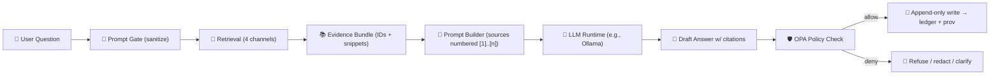

# 🤖🔎 AI Provenance Ledger — `data/prov/ai/`


-informational)


> ✅ **Core rule:** **No Source, No Answer**.  
> If an answer can’t be backed by approved evidence, it **must refuse** (or ask for clarification) instead of guessing.

---

## 🎯 Purpose

This folder stores **machine-auditable provenance records for AI outputs** (e.g., “Focus Mode” answers).  
Each AI answer is preserved with:

- 🧾 the **question** (sanitized)
- 📚 the **evidence bundle** used (with stable source IDs)
- 🧠 the **model identity/version**
- 🛡️ the **policy decision** (OPA + internal gates)
- 🔗 a **PROV-O / JSON-LD** record linking *answer ⇄ model ⇄ sources ⇄ pipeline steps*

The result: **every AI sentence is traceable to “the map behind the map.”** 🗺️✨

---

## 🧠 Principles (Non-Negotiable)

### 1) Evidence-first 🧾
- AI is treated as an **untrusted text engine**.
- It only receives an **approved, compact context** (snippets + IDs), not full corpora dumps.

### 2) Least privilege 🔒
- The model has **no direct DB access**, **no internet**, and **no tool execution**.
- It produces text; the system enforces rules at the boundaries.

### 3) Immutable ledger 🧱
- This is an **append-only** record stream.
- Never “edit history” — create a new entry that supersedes prior output.

### 4) Trust-by-construction 🤝
Provenance records support auditability across trust dimensions:
- scientific/technical 🔬
- institutional 🏛️
- beneficiary/community 👥
- delivery/operator 🧑‍⚕️
- regulatory ⚖️
- ethical 🧭

---

## 🧩 What Belongs Here (and What Doesn’t)

✅ **Belongs here**
- AI answer records + citations map
- retrieval/evidence bundles (snippets, IDs, channels, checksums)
- prompt templates + versions (not secrets)
- policy decisions (OPA outputs)
- provenance graphs (PROV-O JSON-LD)

🚫 **Does NOT belong here**
- raw datasets (that’s `data/raw/…`)
- processed datasets (that’s `data/processed/…`)
- secrets/keys/tokens (ever)
- sensitive user identifiers (redact or hash)

---

## 📁 Suggested Layout

> If your repo already has a structure, keep it — but aim for **predictable paths** like below.

```text
data/prov/ai/
├─ README.md
├─ schema/                       # 📐 contracts for validation (jsonschema / context)
│  ├─ evidence_bundle.schema.json
│  ├─ focus_answer.schema.json
│  ├─ policy_decision.schema.json
│  └─ prov_answer.context.jsonld
├─ ledger/                       # 🧾 append-only “answer events”
│  └─ 2026/
│     └─ 02/
│        └─ 03/
│           ├─ ans_01J..._answer.json
│           ├─ ans_01J..._evidence.json
│           ├─ ans_01J..._policy.json
│           └─ ans_01J..._prov.jsonld
└─ manifest/                     # 🧱 integrity helpers
   ├─ ledger_index_2026-02-03.json
   └─ checksums_2026-02-03.txt
```

---

## 🧾 Record Types

| Record | File suffix | Why it exists | Must include |
|---|---|---|---|
| 🧠 AI Answer | `_answer.json` | human-readable output + metadata | citations, model ID, timestamps |
| 📚 Evidence Bundle | `_evidence.json` | the “source pack” given to the model | stable source IDs, channels, snippets |
| 🛡️ Policy Decision | `_policy.json` | what gates allowed/blocked | decision, rule set version, redactions |
| 🔗 PROV Graph | `_prov.jsonld` | formal lineage | activity, entities, agent, usage links |

---

## 🧷 Identifier Conventions

Use **stable, collision-resistant IDs**:

- `answer_id`: `ans_<ULID|UUID>`
- `run_id`: `run_<YYYYMMDDTHHMMSSZ>_<short>`
- `source_id`: stable **catalog ID** or **node ID** (dataset/document/graph node)
- `policy_id`: `pol_<answer_id>`
- `bundle_id`: `evb_<answer_id>`

> 🔥 Tip: prefer **ULIDs** for file ordering by time.

---

## 🔄 AI “Truth Path” (How an Answer Gets Born)



### Retrieval channels (expected)
- 🕸️ Graph context (e.g., knowledge graph relationships)
- 🗺️ Spatial/statistical context (GIS / PostGIS queries)
- 🔍 Full-text search context (documents/stories)
- 🧲 Vector similarity (embeddings over approved chunks)

---

## ✅ Required Gates (Fail-Safe Defaults)

### Citation gate 🧷
- The answer must contain **at least one** citation marker.
- **Every factual claim** should be attributable to a source ID.

### Safety gate 🧯
- Content must comply with sensitivity labels.
- Redact or refuse if evidence is restricted for the user’s role.

### Authorization gate 🔑
- Even if evidence exists, it must be **permitted** for the request context.

### Provenance gate 🔗
- If provenance metadata can’t be written, treat the answer as **not publishable**.

---

## 📦 Minimal Data Contracts (Examples)

<details>
<summary><strong>📚 evidence bundle</strong> — <code>ans_…_evidence.json</code></summary>

```json
{
  "bundle_id": "evb_ans_01JABC...",
  "created_at": "2026-02-03T21:15:09Z",
  "query_sanitized": "What happened here in the mid-1930s?",
  "retrieval_channels": ["graph", "postgis", "fulltext", "vector"],
  "sources": [
    {
      "citation_index": 1,
      "source_id": "dataset:ks_drought_1935",
      "source_kind": "dataset",
      "title": "Kansas Drought Impacts (1935)",
      "snippet": "…severe drought conditions recorded across…",
      "license": "public",
      "checksum": "sha256:..."
    },
    {
      "citation_index": 2,
      "source_id": "doc:chronicling_america:12345",
      "source_kind": "document",
      "title": "Local newspaper excerpt (1936)",
      "snippet": "…dust storms were frequent…",
      "license": "public",
      "checksum": "sha256:..."
    }
  ]
}
```
</details>

<details>
<summary><strong>🧠 answer record</strong> — <code>ans_…_answer.json</code></summary>

```json
{
  "answer_id": "ans_01JABC...",
  "created_at": "2026-02-03T21:15:12Z",
  "model": {
    "provider": "ollama",
    "name": "kfm-llama2",
    "version": "latest"
  },
  "question_sanitized": "What happened here in the mid-1930s?",
  "map_context": {
    "area_id": "county:finney_ks",
    "year": 1935,
    "active_layers": ["drought_index", "population"]
  },
  "answer_markdown": "In the mid-1930s, this area experienced severe drought impacts as part of the Dust Bowl [1]. Contemporary reports describe frequent dust storms and crop failures peaking around 1935–1936 [2].",
  "citations": {
    "1": "dataset:ks_drought_1935",
    "2": "doc:chronicling_america:12345"
  }
}
```
</details>

<details>
<summary><strong>🛡️ policy decision</strong> — <code>ans_…_policy.json</code></summary>

```json
{
  "policy_id": "pol_ans_01JABC...",
  "evaluated_at": "2026-02-03T21:15:13Z",
  "engine": "opa",
  "policy_bundle_version": "2026.02.01",
  "decision": "allow",
  "checks": {
    "citations_present": true,
    "role_authorized": true,
    "safety_passed": true
  },
  "redactions": []
}
```
</details>

<details>
<summary><strong>🔗 PROV-O (JSON-LD)</strong> — <code>ans_…_prov.jsonld</code></summary>

```json
{
  "@context": {
    "prov": "http://www.w3.org/ns/prov#",
    "dcterms": "http://purl.org/dc/terms/",
    "xsd": "http://www.w3.org/2001/XMLSchema#"
  },
  "@id": "prov:bundle:ans_01JABC...",
  "@type": "prov:Bundle",
  "prov:entity": [
    {
      "@id": "entity:answer:ans_01JABC...",
      "@type": "prov:Entity",
      "dcterms:created": { "@value": "2026-02-03T21:15:12Z", "@type": "xsd:dateTime" }
    },
    { "@id": "entity:source:dataset:ks_drought_1935", "@type": "prov:Entity" },
    { "@id": "entity:source:doc:chronicling_america:12345", "@type": "prov:Entity" }
  ],
  "prov:activity": [
    {
      "@id": "activity:generate:ans_01JABC...",
      "@type": "prov:Activity",
      "prov:used": [
        "entity:source:dataset:ks_drought_1935",
        "entity:source:doc:chronicling_america:12345"
      ],
      "prov:generated": "entity:answer:ans_01JABC...",
      "prov:wasAssociatedWith": "agent:model:ollama:kfm-llama2:latest"
    }
  ],
  "prov:agent": [
    {
      "@id": "agent:model:ollama:kfm-llama2:latest",
      "@type": "prov:SoftwareAgent",
      "dcterms:title": "kfm-llama2 (Ollama)"
    }
  ]
}
```
</details>

---

## 🧪 Validation Checklist (Quick)

Before writing to `ledger/`, ensure:

- [ ] Answer has **citations** and **citation map resolves** to real records  
- [ ] Evidence bundle has **stable source IDs**, snippets, and checksums  
- [ ] Policy decision is recorded (allow/deny + rule versions)  
- [ ] PROV graph links: **sources → generation activity → answer entity → model agent**  
- [ ] No secrets / no PII / no restricted snippets leaking beyond role  

---

## 🧰 Operational Notes

### 🧯 When the AI is wrong
This folder is your debugger:
1. Open `_answer.json` (what user saw)
2. Inspect `_evidence.json` (what model was allowed to see)
3. Confirm `_policy.json` (why it was allowed)
4. Use `_prov.jsonld` to trace upstream datasets and pipeline steps

### 🧱 Integrity & signing (optional but recommended)
- Store daily checksum manifests (`sha256sum`) in `manifest/`
- Future-friendly: sign ledger batches and/or anchor timestamps (e.g., Sigstore)

---

## 🔗 Related Project Docs (Recommended Links)

- `docs/architecture/system_overview.md` 🏗️
- `docs/architecture/AI_SYSTEM_OVERVIEW.md` 🧠
- `docs/architecture/ai/OLLAMA_INTEGRATION.md` 🤖
- `src/server/api/README.md` 🌐

---

## 🧭 Glossary (Tiny but Useful)

- **PROV-O**: W3C provenance ontology for describing lineage (entities, activities, agents)  
- **Evidence Bundle**: the *only* knowledge the model receives for an answer  
- **OPA**: policy engine used to enforce “block if ungoverned” rules  
- **RAG**: retrieval-augmented generation (LLM + governed retrieval context)

---

## ✅ Bottom Line

If we can’t prove it, we don’t say it.  
If we can’t trace it, we don’t ship it. 🧱🗺️🤖