# 🧬 PROV Templates (KFM)


> ✅ **Purpose:** This folder contains **reusable templates** for authoring **PROV lineage records** (W3C PROV) in Kansas Frontier Matrix (KFM).  
> 🧾 These templates are used to generate the real provenance bundles stored in `data/prov/`.

---

## 📍 What belongs in `data/prov/templates/`

### ✅ Yes — keep here
- **Template PROV bundles** for common scenarios:
  - 🧪 ETL runs (raw ➜ processed)
  - 🧠 AI/analysis artifacts (model run ➜ derived dataset)
  - 🧹 Manual curation steps (human edits ➜ revised dataset)
- **Reusable PROV patterns** that match KFM profiles and schema expectations

### ❌ No — don’t keep here
- 🚫 Actual lineage outputs for a specific run (those go in `data/prov/`)
- 🚫 Secrets / tokens / private keys (PROV is metadata, not a vault)
- 🚫 Ad-hoc one-off formats that bypass KFM profiles

---

## 🗂️ Directory map

```text
📦 repo-root/
└─ 🗃️ data/
   └─ 🧬 prov/
      ├─ 📄 README.md                 ← PROV overview (parent folder)
      ├─ 🧾 <generated lineage>.json   ← real outputs (per dataset/run)
      └─ 🧩 templates/
         └─ 📄 README.md              ← you are here ✨
```

> 🕰️ **Note on naming:** Some older docs refer to `data/provenance/`.  
> In v13+ structure, provenance outputs live under `data/prov/`.

---

## 🧭 The KFM “truth path” (non‑negotiable)

KFM treats provenance as a **boundary artifact**: data is not considered “publishable” until metadata and lineage are in place.

```mermaid
flowchart LR
  Raw["🧊 Raw data"] --> Processed["🧪 Processed data"]
  Processed --> Catalog["🗂️ Catalogs (STAC / DCAT / PROV)"]
  Catalog --> DB["🧠 Graph/DB"]
  DB --> API["🧰 Governed API"]
  API --> UI["🗺️ UI / Story Nodes / AI"]
```



---

## 🧱 Minimum PROV model used in KFM

Every PROV record should answer:

> **“How was this data produced?”** 🔎

### Core PROV objects
- **Entities** 🧩  
  Inputs (raw files / source URLs / upstream datasets) and outputs (processed artifacts)
- **Activities** ⚙️  
  The transformation step(s): pipeline run, model execution, manual edit session
- **Agents** 🧑‍💻🤖  
  Who/what performed the activity: person + software (script/tool), optionally organization

### Core relations (typical)
- `used` → activity used input entity  
- `wasGeneratedBy` → output entity created by activity  
- `wasAssociatedWith` → activity associated with agent  
- `wasDerivedFrom` → output entity derived from input entity (optional but useful)  

---

## 🔗 Cross‑layer linkage (STAC + DCAT + PROV)

KFM policy expects **STAC/DCAT/PROV alignment** for each dataset/evidence artifact:

- 🛰️ **STAC**: spatial/temporal asset metadata (`data/stac/…`)
- 🧾 **DCAT**: dataset-level catalog entry (`data/catalog/dcat/…`)
- 🧬 **PROV**: lineage bundle (`data/prov/…`)

✅ **Template rule:** every PROV template should include placeholders for:
- **Dataset stable ID** (the canonical dataset identifier)
- **Run ID / commit hash** (reproducibility anchor)
- **Pointers to STAC/DCAT identifiers** (do not duplicate everything, link it)

---

## 🏷️ ID & naming conventions (recommended)

> These are **recommendations** to keep provenance consistent and grep-able across domains.

### File naming (generated outputs)
- `data/prov/<dataset_id>__<run_id>.prov.json`
- `data/prov/<domain>/<dataset_id>/<run_id>.prov.json` (if the repo uses domain subfolders)

### PROV identifiers (inside the file)
Use stable, explicit IDs that won’t collide:

- **Entities**
  - `kfm:entity:raw:<sha256>`  
  - `kfm:entity:processed:<dataset_id>@<version>`
- **Activities**
  - `kfm:activity:etl:<pipeline_name>:<run_id>`
  - `kfm:activity:analysis:<notebook_or_model>:<run_id>`
- **Agents**
  - `kfm:agent:software:<tool>@<version>`
  - `kfm:agent:person:<github_handle_or_orcid>`

✅ Prefer **hashes** (sha256) or **content-addressed IDs** for file entities.

---

## ✅ Definition of Done (DoD) for a template

A PROV template is “ready” when it:

- [ ] Encodes **Entities / Activities / Agents** clearly
- [ ] Has obvious placeholders for:
  - [ ] dataset_id
  - [ ] run_id
  - [ ] git commit hash
  - [ ] timestamps (start/end)
  - [ ] input/output checksums
  - [ ] parameters / notes (optional but encouraged)
- [ ] Includes a section/placeholders to link **STAC + DCAT** IDs
- [ ] Matches the **KFM PROV profile** direction (even if the profile is still evolving)
- [ ] Does **not** include secrets, PII, or restricted content
- [ ] Is formatted so it can be validated by CI/schema tooling (where present)

---

## 🧩 Example: PROV bundle skeleton (PROV‑JSON style)

> 📌 This is a **template skeleton**, not a final run output. Replace placeholders like `__DATASET_ID__`.

```json
{
  "prefix": {
    "kfm": "https://kansasfrontiermatrix.org/id/",
    "prov": "http://www.w3.org/ns/prov#"
  },

  "entity": {
    "kfm:entity:raw:__INPUT_SHA256__": {
      "prov:label": "data/raw/__DOMAIN__/__SOURCE_FILE__",
      "prov:type": "kfm:RawFile",
      "kfm:sha256": "__INPUT_SHA256__",
      "kfm:source_url": "__OPTIONAL_SOURCE_URL__",
      "kfm:retrieved_at": "__OPTIONAL_ISO8601__"
    },

    "kfm:entity:processed:__DATASET_ID__@__VERSION__": {
      "prov:label": "data/processed/__DOMAIN__/__OUTPUT_FILE__",
      "prov:type": "kfm:ProcessedDataset",
      "kfm:dataset_id": "__DATASET_ID__",
      "kfm:version": "__VERSION__",
      "kfm:sha256": "__OUTPUT_SHA256__",
      "kfm:stac_item_id": "__STAC_ITEM_ID__",
      "kfm:dcat_dataset_id": "__DCAT_DATASET_ID__"
    }
  },

  "activity": {
    "kfm:activity:etl:__PIPELINE_NAME__:__RUN_ID__": {
      "prov:label": "__PIPELINE_NAME__",
      "prov:startTime": "__START_ISO8601__",
      "prov:endTime": "__END_ISO8601__",

      "kfm:run_id": "__RUN_ID__",
      "kfm:git_commit": "__GIT_SHA__",
      "kfm:runtime": {
        "os": "__OS__",
        "python": "__PYTHON_VERSION__",
        "container": "__CONTAINER_TAG_OR_DIGEST__"
      },
      "kfm:parameters": {
        "__PARAM_1__": "__VALUE__"
      },
      "kfm:notes": "__OPTIONAL_FREE_TEXT__"
    }
  },

  "agent": {
    "kfm:agent:software:__PIPELINE_NAME__@__TOOL_VERSION__": {
      "prov:type": "prov:SoftwareAgent",
      "prov:label": "__PIPELINE_NAME__",
      "kfm:version": "__TOOL_VERSION__"
    },

    "kfm:agent:person:__OPERATOR__": {
      "prov:type": "prov:Person",
      "prov:label": "__HUMAN_NAME__",
      "kfm:handle": "__OPERATOR__"
    }
  },

  "used": {
    "_:u1": {
      "prov:activity": "kfm:activity:etl:__PIPELINE_NAME__:__RUN_ID__",
      "prov:entity": "kfm:entity:raw:__INPUT_SHA256__"
    }
  },

  "wasGeneratedBy": {
    "_:g1": {
      "prov:entity": "kfm:entity:processed:__DATASET_ID__@__VERSION__",
      "prov:activity": "kfm:activity:etl:__PIPELINE_NAME__:__RUN_ID__"
    }
  },

  "wasAssociatedWith": {
    "_:a1": {
      "prov:activity": "kfm:activity:etl:__PIPELINE_NAME__:__RUN_ID__",
      "prov:agent": "kfm:agent:software:__PIPELINE_NAME__@__TOOL_VERSION__"
    },
    "_:a2": {
      "prov:activity": "kfm:activity:etl:__PIPELINE_NAME__:__RUN_ID__",
      "prov:agent": "kfm:agent:person:__OPERATOR__"
    }
  }
}
```

---

## 🧠 AI / analysis artifacts (special notes)

KFM treats AI/model outputs as **first-class datasets** with full provenance.

When creating templates for AI-derived artifacts, include placeholders for:
- 🤖 model/tool identifier + version
- 🎛️ hyperparameters / prompts (sanitized if needed)
- 📎 input dataset IDs (entities)
- 📊 confidence metrics (where applicable)
- 🧾 citations / references to method (if required)

---

## 🧪 Validation & CI expectations (what templates enable)

Even if templates aren’t executed directly, they must be structured so that **generated PROV outputs** can pass CI checks, including:
- ✅ presence of provenance for processed data
- ✅ linkage consistency with STAC/DCAT
- ✅ deterministic/reproducible anchors (run_id, hashes, commit)

> 🧯 If provenance is missing, KFM treats it as a red flag — “not publishable” until corrected.

---

## 🤝 Contributing a new template

1. 🧩 Add a new template file under this folder (use `TEMPLATE__...` naming).
2. 📝 Document its use case in this README (add it to “Template catalog” below).
3. 🔁 Keep it generic: no dataset-specific IDs, no real secrets, no real file paths unless examples.
4. 🧷 Prefer placeholders: `__LIKE_THIS__` (consistent + searchable).

### 📚 Template catalog (add entries here)
- `TEMPLATE__PROV_ETL_BUNDLE.prov.json` *(recommended)*
- `TEMPLATE__PROV_AI_ACTIVITY.prov.json` *(recommended)*
- `TEMPLATE__PROV_MANUAL_CURATION.prov.json` *(recommended)*

---

## 🔎 Quick checklist (copy/paste)

- [ ] Inputs listed as **Entities** (with hashes + optional source URLs)
- [ ] Output listed as an **Entity** (with hash)
- [ ] Processing step is an **Activity** (with timestamps)
- [ ] Pipeline tool is a **SoftwareAgent**
- [ ] Human operator (if any) is a **Person** Agent
- [ ] Relations: `used`, `wasGeneratedBy`, `wasAssociatedWith`
- [ ] Links to **STAC + DCAT** identifiers included
- [ ] Run anchored to **run_id + git commit**
- [ ] No secrets / sensitive data embedded

---

### 🧭 Related docs (in-repo)
- `../../../docs/MASTER_GUIDE_v13.md` 📘
- `../../../docs/standards/KFM_PROV_PROFILE.md` 🧬
- `../../../docs/standards/KFM_DCAT_PROFILE.md` 🧾
- `../../../docs/standards/KFM_STAC_PROFILE.md` 🛰️