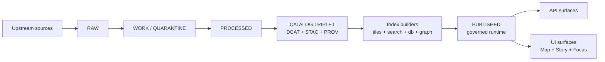

<!-- [KFM_META_BLOCK_V2]
doc_id: kfm://doc/57293332-eaf3-4fbd-a356-3298e47f3c36
title: data/published — Governed runtime artifacts
type: standard
version: v1
status: draft
owners: kfm-maintainers
created: 2026-02-22
updated: 2026-02-22
policy_label: public
related:
  - data/published/
  - data/published/README.md
tags:
  - kfm
  - data
  - published
notes:
  - This README documents the Published zone directory contract (what may live here, how it is produced, and how it is validated).
[/KFM_META_BLOCK_V2] -->

<a id="top"></a>

# `data/published/`
Governed runtime artifacts **only** (promoted dataset versions + their resolvable evidence surfaces).  
**Status:** draft • **Owners:** `kfm-maintainers` (update if different)


---

## Quick navigation
- [What this directory is](#what-this-directory-is)
- [What MUST be true to publish](#what-must-be-true-to-publish)
- [Identifiers and naming](#identifiers-and-naming)
- [What belongs here](#what-belongs-here)
- [Proposed directory layout](#proposed-directory-layout)
- [Promotion workflow](#promotion-workflow)
- [Validation checklist](#validation-checklist)
- [Sensitivity and licensing rules](#sensitivity-and-licensing-rules)
- [Troubleshooting](#troubleshooting)

---

## What this directory is

### Confirmed contract
This folder represents KFM’s **Published** zone: the *governed runtime surface*.

It exists to make one thing unambiguous:

> **Runtime surfaces (API + UI) may only serve what has been promoted.**

“Promoted” means the dataset version has (at minimum):
- **processed artifacts**
- **validated catalogs**
- **run receipts**
- a **policy label assignment**

### Not a canonical source of truth
Treat `data/published/` as a **deployment assembly** (or local-dev mirror) of what the runtime is allowed to serve.

Canonical truth lives upstream in:

- immutable acquisition artifacts (RAW),
- deterministic transforms + QA (WORK/QUARANTINE),
- publishable artifacts (PROCESSED),
- catalogs + lineage (DCAT + STAC + PROV + run receipts).

### Trust membrane reminder
Even “published” artifacts are not meant for direct client access.

- Frontend and external clients should **never** access databases or object storage directly.
- Core backend logic should not bypass repository interfaces to talk directly to storage.
- All access should flow through governed APIs that apply policy decisions, redactions, and logging consistently.

If you change something in `data/published/` by hand, you are probably breaking provenance and policy guarantees.

> **Rule of thumb:** if it didn’t come from a pipeline run + promotion manifest, it doesn’t belong here.

### How it fits in the Truth Path


[⬆️ Back to top](#top)

---

## What MUST be true to publish

Publishing is controlled by the **Promotion Contract**: promotion is blocked unless required artifacts exist and validate.

### Minimum gates (Promotion Contract v1)
| Gate | What must be true (fail-closed) | Where the evidence lives |
|---|---|---|
| A. Identity & versioning | Dataset ID is stable; DatasetVersion ID is immutable and derived from a stable `spec_hash` | Dataset spec + promotion manifest |
| B. Licensing & rights | License is explicit; rights holder + attribution are captured; unclear license ⇒ QUARANTINE | DCAT + rights metadata |
| C. Sensitivity & redaction | `policy_label` assigned; any redaction/generalization plan exists and is recorded in PROV | Policy decision + PROV |
| D. Catalog triplet validates | DCAT, STAC (if applicable), and PROV validate; cross-links resolve | `dcat/`, `stac/`, `prov/` |
| E. Run receipt + checksums | Each producing run has a `run_receipt`; inputs/outputs enumerated with checksums; environment recorded | `run_receipts/` + PROV |
| F. Policy + contract tests | Policy tests pass; evidence resolver can resolve at least one EvidenceRef; API schemas validate | CI logs + fixtures |
| G. Recommended extras | SBOM/build provenance, perf smoke checks, a11y smoke checks | CI artifacts |

> **Fail-closed means**: missing or invalid evidence blocks promotion; do not “just ship it”.

[⬆️ Back to top](#top)

---

## Identifiers and naming

Stable identity is a prerequisite for caching, citation, and reproducibility.

### Confirmed principles
- Dataset and version identifiers must be **stable and deterministic** (dataset versions derived from a stable `spec_hash` computed from canonicalized inputs/specs).
- Canonical IDs should **not embed environment-specific hostnames** (hostnames belong in distribution URLs).

### Recommended identifier families
Use URI-like identifiers with stable prefixes (examples):
- `kfm://dataset/<dataset_slug>`
- `kfm://dataset/@<dataset_version_id>`
- `kfm://artifact/sha256:<digest>`
- `kfm://run/<run_id>`
- `kfm://evidence/<bundle_id>`
- `kfm://story/@<story_version_id>`

### Recommended dataset slug conventions
- lowercase
- words separated by underscore
- include upstream authority when helpful
- do not include dates in the slug (dates belong to versions)

[⬆️ Back to top](#top)

## What belongs here

### Confirmed (must-have for anything served)
For each **published dataset version**, the runtime must be able to resolve an evidence view that includes:
- dataset version identifier
- license + rights holder + attribution requirements
- policy label + any applied redactions/generalizations
- provenance chain (run receipts / activities)
- artifact links + checksums

### Typical contents (recommended)
This directory *may* contain:
- **promotion manifests** (per published dataset version)
- **published indexes** (a machine-readable list of what the runtime is allowed to serve)
- **runtime-ready projections** built from promoted artifacts:
  - tile bundles (e.g., PMTiles)
  - search index snapshots
  - graph edge bundles
  - database seed snapshots for local dev (if used)

### What does NOT belong here
- anything with **unclear license/rights**
- anything still in **QUARANTINE**
- raw source dumps, ad hoc CSV edits, or “temporary” files
- secrets, tokens, private keys, or credential material
- exact coordinates or identifying attributes for restricted/sensitive datasets unless policy explicitly allows

[⬆️ Back to top](#top)

---

## Proposed directory layout

> This is a **PROPOSED** on-disk layout for `data/published/`. Adjust to match your runtime deployment, but keep the *contract* intact.

```text
data/published/
├─ README.md
├─ index/
│  ├─ published_index.json           # allow-list of dataset_version_ids served by runtime (PROPOSED)
│  └─ published_index.sha256         # checksum of the index (PROPOSED)
├─ datasets/
│  └─ <dataset_slug>/
│     └─ <dataset_version_id>/
│        ├─ promotion_manifest.json  # required to mark “published” (recommended)
│        ├─ evidence/                # optional prebuilt evidence bundles (cache)
│        ├─ tiles/                   # optional runtime tiles (PMTiles, etc.)
│        ├─ search/                  # optional search index snapshot
│        ├─ graph/                   # optional derived graph artifacts
│        └─ links/                   # symlinks or pointers to canonical artifacts (if not copied here)
└─ releases/
   └─ <release_tag>/
      ├─ release_manifest.json
      └─ release_manifest.sha256
```

### Minimal JSON shapes (examples)

<details>
<summary><strong>Promotion manifest</strong> (per dataset version)</summary>

```json
{
  "kfm_promotion_manifest_version": "v1",
  "dataset_slug": "example_dataset",
  "dataset_version_id": "2026-02.abcd1234",
  "spec_hash": "sha256:abcd1234",
  "released_at": "2026-02-22T00:00:00Z",
  "artifacts": [
    {"path": "events.parquet", "digest": "sha256:...", "media_type": "application/x-parquet"}
  ],
  "catalogs": [
    {"path": "dcat.jsonld", "digest": "sha256:..."},
    {"path": "stac/collection.json", "digest": "sha256:..."},
    {"path": "prov/bundle.jsonld", "digest": "sha256:..."}
  ],
  "qa": {"status": "pass", "report_digest": "sha256:..."},
  "policy": {"policy_label": "public", "decision_id": "kfm://policy_decision/..."},
  "approvals": [
    {"role": "steward", "principal": "kfm://agent/...", "approved_at": "2026-02-22T00:00:00Z"}
  ]
}
```
</details>

<details>
<summary><strong>Run receipt</strong> (per producing run)</summary>

```json
{
  "run_id": "kfm://run/2026-02-22T00:00:00Z.abcd",
  "actor": {"principal": "svc:pipeline", "role": "pipeline"},
  "operation": "ingest+publish",
  "dataset_version_id": "2026-02.abcd1234",
  "inputs": [{"uri": "raw/source.csv", "digest": "sha256:..."}],
  "outputs": [{"uri": "processed/events.parquet", "digest": "sha256:..."}],
  "environment": {
    "container_digest": "sha256:...",
    "git_commit": "deadbeef",
    "params_digest": "sha256:..."
  },
  "validation": {"status": "pass", "report_digest": "sha256:..."},
  "policy": {"decision_id": "kfm://policy_decision/..."},
  "created_at": "2026-02-22T00:05:00Z"
}
```
</details>

<details>
<summary><strong>Evidence bundle</strong> (what the UI “evidence drawer” needs)</summary>

```json
{
  "bundle_id": "sha256:...",
  "dataset_version_id": "2026-02.abcd1234",
  "title": "Example evidence card",
  "policy": {
    "decision": "allow",
    "policy_label": "public",
    "obligations_applied": []
  },
  "license": {"spdx": "CC-BY-4.0", "attribution": "Source organization"},
  "provenance": {"run_id": "kfm://run/2026-02-22T00:00:00Z.abcd"},
  "artifacts": [
    {"href": "processed/events.parquet", "digest": "sha256:...", "media_type": "application/x-parquet"}
  ],
  "checks": {"catalog_valid": true, "links_ok": true},
  "audit_ref": "kfm://audit/entry/..."
}
```
</details>

[⬆️ Back to top](#top)

---

## Promotion workflow

### Confirmed workflow pattern (PR-based)
A practical promotion workflow is PR-driven so promotion is both **social** (reviewed) and **technical** (validated):

1. Contributor opens a PR adding:
   - source registry entry
   - pipeline spec
   - small fixture sample + expected outputs
2. CI runs:
   - schema validation
   - policy tests
   - `spec_hash` stability checks
   - catalog link checks
3. Steward reviews:
   - licensing and sensitivity
   - approves policy label
4. Operator merges and triggers the pipeline run in a controlled environment.
5. Outputs are written to **processed + catalogs**.
6. A **release/promotion manifest** is created and tagged.

> If your process bypasses any of those steps, you need an explicit governance exception.

[⬆️ Back to top](#top)

---

## Validation checklist

### Dataset integration “Definition of Done”
A dataset integration is **DONE** only when:
- [ ] RAW acquisition is reproducible and documented
- [ ] WORK transforms are deterministic (same inputs → same outputs; same spec → same hash)
- [ ] PROCESSED artifacts exist in approved formats and are digest-addressed
- [ ] Catalog triplet validates and is cross-linked
- [ ] EvidenceRefs resolve and render in the UI evidence drawer
- [ ] Policy label is assigned, with documented review
- [ ] Changelog explains what changed and why

### CI checks (recommended minimum)
- JSON schema validation for KFM DCAT/STAC/PROV profiles
- Link check: cross-links resolve in repo/runtime context
- Evidence resolver contract tests:
  - public evidence resolves to a bundle with allowed artifacts
  - restricted evidence returns `403` without leaking sensitive metadata
- `spec_hash` stability tests and golden deterministic-output tests

[⬆️ Back to top](#top)

---

## Sensitivity and licensing rules

### Sensitivity defaults (policy-driven)
- Default-deny for sensitive-location and restricted datasets.
- If any public representation is allowed, publish a separate **generalized public** dataset version.
- Never leak restricted metadata in `403/404` responses.
- Do not embed precise coordinates in Story Nodes or Focus Mode outputs unless policy explicitly allows.
- Record redaction/generalization as a first-class transform in PROV.

### Licensing and rights enforcement
- “Online availability” is **not** permission to reuse.
- Promotion requires **license + rights holder** for every distribution.
- “Metadata-only reference” is allowed (catalog without mirroring) if rights do not allow copying.
- Exports must automatically include attribution and license text.
- Story publishing is blocked if rights are unclear for included media.

[⬆️ Back to top](#top)

---

## Troubleshooting

### “Why isn’t my dataset showing up in the UI?”
Most common causes:
- Catalog triplet invalid or cross-links broken (DCAT ↔ STAC ↔ PROV).
- EvidenceRefs can’t resolve (missing run receipts, missing digests, wrong IDs).
- Policy label defaults to deny and no generalized public version exists.
- Promotion manifest missing or doesn’t match artifact checksums.

### “Can I hotfix something in `data/published/`?”
Not directly. Hotfixes should be done by:
1) fixing the pipeline/spec,  
2) re-running deterministically,  
3) generating new artifacts + catalogs + receipts,  
4) promoting a new dataset version.

If you must do an emergency patch, record it as an explicit governance exception with a follow-up task to reestablish determinism.

[⬆️ Back to top](#top)
