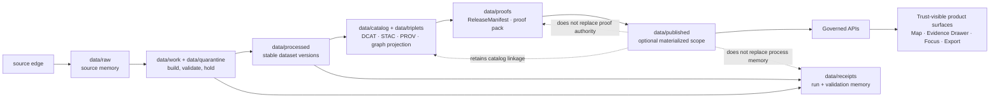

<!-- [KFM_META_BLOCK_V2]
doc_id: kfm://doc/NEEDS_VERIFICATION__data_published_readme
title: data/published/
type: standard
version: v1
status: draft
owners: @bartytime4life
created: NEEDS_VERIFICATION__YYYY-MM-DD
updated: 2026-04-22
policy_label: NEEDS_VERIFICATION__public-safe-or-restricted
related: [
  ../README.md,
  ../processed/README.md,
  ../catalog/README.md,
  ../catalog/stac/README.md,
  ../catalog/dcat/README.md,
  ../catalog/prov/README.md,
  ../receipts/README.md,
  ../proofs/README.md,
  ../registry/README.md,
  ../triplets/README.md,
  ../../contracts/README.md,
  ../../schemas/README.md,
  ../../policy/README.md,
  ../../tests/README.md,
  ../../tools/validators/README.md,
  ../../tools/validators/promotion_gate/README.md,
  ../../.github/CODEOWNERS,
  ../../.github/workflows/README.md
]
tags: [kfm, data, published, publication, release, evidence, governance, catalog, proofs, governed-api]
notes: [
  Revision target is data/published/README.md.
  Public tree inspection before this revision showed data/published/ present with .gitkeep and an empty README.md; this file restores a boundary README rather than proving any published bundle inventory.
  Owner is grounded in current broad CODEOWNERS coverage for /data/ and should be rechecked for finer-grained publication review rules.
  doc_id, created date, policy_label, active-branch inventory, release-bundle convention, and any deeper published child layout remain NEEDS VERIFICATION.
]
[/KFM_META_BLOCK_V2] -->

<a id="top"></a>

# `data/published/`

Release-backed, governed materialization surface for KFM public-safe or steward-facing outward scope.

> [!IMPORTANT]
> **Status:** active  
> **Document status:** draft  
> **Owners:** `@bartytime4life`  
> **Path:** `data/published/README.md`  
> **Repo fit:** child of [`../README.md`](../README.md); downstream of [`../processed/README.md`](../processed/README.md), [`../catalog/README.md`](../catalog/README.md), [`../receipts/README.md`](../receipts/README.md), and [`../proofs/README.md`](../proofs/README.md); adjacent to [`../../contracts/README.md`](../../contracts/README.md), [`../../schemas/README.md`](../../schemas/README.md), [`../../policy/README.md`](../../policy/README.md), [`../../tests/README.md`](../../tests/README.md), and [`../../tools/validators/promotion_gate/README.md`](../../tools/validators/promotion_gate/README.md).  
> **Quick jumps:** [Scope](#scope) · [Repo fit](#repo-fit) · [Accepted inputs](#accepted-inputs) · [Exclusions](#exclusions) · [Current public-tree snapshot](#current-public-tree-snapshot) · [Directory tree](#directory-tree) · [Quickstart](#quickstart) · [Usage](#usage) · [Diagram](#diagram) · [Reference tables](#reference-tables) · [Task list](#task-list) · [FAQ](#faq) · [Appendix](#appendix)  
>
> 
> 
> 
> 
> 
> 
> 

> [!CAUTION]
> `data/published/` is **not** where KFM truth first becomes admissible.  
> Publication is a governed trust state first. This directory is only the repo-visible materialized edge for scope that is already release-backed, catalog-linked, policy-shaped, correction-aware, and fit to reference from governed APIs.

> [!TIP]
> Keep the trust split visible:
>
> `receipt ≠ proof ≠ catalog ≠ publication`
>
> A file here should point back to process memory, release evidence, catalog closure, and correction lineage. It must not replace any of those surfaces.

---

## Scope

`data/published/` is the repo-facing place for **already governed outward scope**. It is narrower than `data/` as a whole and downstream of the canonical KFM truth path:

```text
SOURCE EDGE → RAW → WORK / QUARANTINE → PROCESSED → CATALOG / TRIPLET → PUBLISHED
```

This README exists to make one boundary easy to review in GitHub:

- what may be materialized here;
- what must remain upstream;
- what stays adjacent instead of collapsing into this directory;
- what the current public tree proves before any new bundle lands here;
- what still needs explicit verification before it becomes branch fact.

### Evidence posture used here

| Label | Meaning in this README |
|---|---|
| **CONFIRMED** | Directly supported by current public repo evidence, current-session workspace inspection, or stable KFM doctrine. |
| **INFERRED** | Strongly follows from adjacent README surfaces and KFM doctrine, but still needs active-branch confirmation. |
| **PROPOSED** | Recommended starter structure or future convention that fits KFM but is not proven as current implementation. |
| **UNKNOWN** | Not verifiable from the available checkout, public tree, or attached corpus. |
| **NEEDS VERIFICATION** | A specific check required before stronger repo, workflow, validator, schema, or release claims are made. |

[Back to top](#top)

---

## Repo fit

`data/published/` should stay close to release truth, but it should not replace release truth. In practice, it sits beside processed authority, catalog closure, process memory, release-proof surfaces, triplet projections, and governance controls while remaining downstream of promotion and upstream of governed delivery.

### Path and adjacent surfaces

| Relation | Surface | Posture | Why it matters |
|---|---|---:|---|
| Parent | [`../README.md`](../README.md) | **CONFIRMED** | Parent lifecycle README establishes the surrounding data-zone contract and the “publication is state first” rule. |
| Upstream | [`../processed/README.md`](../processed/README.md) | **CONFIRMED** | `PROCESSED` is where stable dataset versions harden before outward materialization. |
| Upstream | [`../catalog/README.md`](../catalog/README.md) | **CONFIRMED** | Catalog closure stays adjacent rather than collapsing into outward copies. |
| Upstream | [`../catalog/stac/README.md`](../catalog/stac/README.md) | **CONFIRMED** | STAC remains one outward metadata surface for discoverability and lineage. |
| Upstream | [`../catalog/dcat/README.md`](../catalog/dcat/README.md) | **CONFIRMED** | DCAT keeps dataset and distribution discovery explicit. |
| Upstream | [`../catalog/prov/README.md`](../catalog/prov/README.md) | **CONFIRMED** | PROV keeps activity, agent, and derivation trace visible. |
| Upstream | [`../receipts/README.md`](../receipts/README.md) | **CONFIRMED** | Run receipts and validation memory belong adjacent, not hidden inside outward scope. |
| Upstream | [`../proofs/README.md`](../proofs/README.md) | **CONFIRMED** | Release manifests, proof packs, attestations, and correction trace should remain explicit. |
| Adjacent | [`../triplets/README.md`](../triplets/README.md) | **CONFIRMED path / NEEDS VERIFICATION depth** | Triplet projections may support discovery or reasoning, but do not replace release truth. |
| Shared control | [`../../contracts/README.md`](../../contracts/README.md) | **CONFIRMED path / NEEDS VERIFICATION depth** | Publication-facing trust objects and machine-readable shapes should stay explicit and reviewable. |
| Shared control | [`../../schemas/README.md`](../../schemas/README.md) | **CONFIRMED path / NEEDS VERIFICATION depth** | Schema authority should remain singular and reviewable, not inferred from published storage. |
| Shared control | [`../../policy/README.md`](../../policy/README.md) | **CONFIRMED path / NEEDS VERIFICATION depth** | Publishability, rights, sensitivity, and deny-by-default decisions should remain executable. |
| Shared control | [`../../.github/CODEOWNERS`](../../.github/CODEOWNERS) | **CONFIRMED** | Current broad ownership for `/data/` resolves to `@bartytime4life`; finer-grained publication review still needs verification. |
| Shared control | [`../../.github/workflows/README.md`](../../.github/workflows/README.md) | **CONFIRMED path / UNKNOWN workflow depth** | Workflow documentation exists, but executable CI wiring for this surface must be verified from branch files. |
| Shared control | [`../../tests/README.md`](../../tests/README.md) | **CONFIRMED path / NEEDS VERIFICATION depth** | Verification is a governed surface in this repo, not a generic QA bucket. |
| Adjacent validator | [`../../tools/validators/README.md`](../../tools/validators/README.md) | **CONFIRMED path / NEEDS VERIFICATION depth** | Validators may check linkage and release-facing conditions without becoming publication owners. |
| Adjacent validator | [`../../tools/validators/promotion_gate/README.md`](../../tools/validators/promotion_gate/README.md) | **INFERRED / NEEDS VERIFICATION** | Promotion is the clearest release-facing membrane immediately upstream of this lane. |
| Downstream | `../../apps/` | **CONFIRMED path / UNKNOWN depth** | Governed APIs and trust-visible product surfaces may reference published scope, but storage is not the public contract. |

### Repo-fit summary

| Question | Working answer |
|---|---|
| What is `data/published/` for? | Materializing outward scope that is already release-backed and policy-permitted. |
| What is it not for? | Source intake, validation staging, catalog closure authority, proof authority, or direct client shortcuts. |
| Where do proof and catalog truth stay? | In sibling release-bearing surfaces such as `../catalog/`, `../receipts/`, and `../proofs/`. |
| What should consume this scope? | Governed APIs, export assembly, and trust-visible surfaces that preserve release linkage. |
| Who owns the broader `/data/` lane? | `@bartytime4life` under broad current CODEOWNERS coverage; subpath rules remain **NEEDS VERIFICATION**. |

[Back to top](#top)

---

## Accepted inputs

Only material that is already admissible for outward use should land here.

| Accepted input | Status | Why it belongs here | What should already exist upstream |
|---|---:|---|---|
| `.gitkeep` or placeholder files preserving an intentionally empty lane | **CONFIRMED** | Keeps the lane visible without pretending release artifacts exist. | Parent data README and lane boundary documentation. |
| Release-backed public-safe materialized scope | **INFERRED** | This is the natural role of the directory once a release exists. | `DatasetVersion`, catalog closure, release evidence, policy-safe scope. |
| Role-limited steward-facing outward scope where policy allows | **PROPOSED** | KFM distinguishes public-safe, generalized, withheld, review-bearing, and steward-facing states. | Policy decision, review decision, release evidence, access scope. |
| Lightweight access copies or outward bundles that retain release linkage | **PROPOSED** | Outward consumption may benefit from stable materialization when lineage stays intact. | Stable identifiers, catalog refs, evidence linkage, proof refs. |
| Human-readable landing docs for a published bundle or lane | **PROPOSED** | GitHub review improves when bundle intent, caveats, and scope are visible beside the materialized surface. | Release context, caveats, sensitivity posture, correction route. |
| Public-safe exemplars tied to a release-backed proof drill | **INFERRED** | Examples are useful only when they remain reviewable and do not masquerade as live canonical truth. | Proof or receipt linkage, public-safe review, bounded test purpose. |
| Manifest or pointer sidecars colocated with a materialized artifact | **NEEDS VERIFICATION** | Some release flows may benefit from local discoverability. | The repo must define whether sidecars here are convenience pointers or release authority. |

> [!IMPORTANT]
> A simple gate helps here: **if an artifact cannot clearly answer which release backs it, which catalog closure describes it, and what correction path applies, it is probably too early for `data/published/`.**

[Back to top](#top)

---

## Exclusions

The following do **not** belong here as normal practice.

| Exclusion | Put it under / behind | Why |
|---|---|---|
| Raw captures, fetch context, or source-native bytes | [`../raw/`](../raw/) | RAW preserves source memory and integrity, not outward publication scope. |
| QA intermediates, transforms, or redaction work still under construction | [`../work/`](../work/) | WORK is for reproducible transformation, not release-facing materialization. |
| Rights-unclear, sensitivity-unclear, or failed-validation material | [`../quarantine/`](../quarantine/) | KFM fails closed on uncertainty. |
| Canonical candidate truth before release | [`../processed/`](../processed/) | Processed authority stabilizes before outward materialization. |
| Catalog closure as the primary authority surface | [`../catalog/`](../catalog/) | `DCAT + STAC + PROV` closure remains distinct and should not be silently collapsed into this directory. |
| Receipts, validation reports, and replay memory as the primary record | [`../receipts/`](../receipts/) | Operational memory should remain durable and inspectable on its own. |
| Release manifests, proof packs, and attestations as the primary release record | [`../proofs/`](../proofs/) | Proof surfaces should stay explicit and diffable. |
| Secrets, credentials, tokens, or environment-bound material | secret manager / deployment layer | `data/published/` is evidence-bearing, not secret-bearing. |
| Direct frontend contracts to storage layout | governed APIs | KFM’s trust membrane lives in governed routes and evidence resolution, not in client file browsing. |
| Derived tiles, indexes, summaries, scenes, or caches that have lost release linkage | downstream rebuildable lanes | Derived convenience does not become authority through convenience. |
| Silent overwrite of already published meaning | correction / supersession / withdrawal flow | KFM requires visible correction lineage. |
| Generated AI prose as standalone truth | governed runtime envelope + EvidenceBundle path | AI may interpret release-backed evidence; it must not become root evidence. |

> [!WARNING]
> A “helpful” copy placed in `data/published/` without release linkage is worse than a missing copy. It looks trustworthy while weakening inspectability.

[Back to top](#top)

---

## Current public-tree snapshot

This table is intentionally modest. It records the checked public tree posture before this README revision and avoids inventing release-bundle inventory.

| Verified signal on public `main` | Current meaning |
|---|---|
| `data/` exists with lifecycle and governance-adjacent children including `catalog/`, `fixtures/`, `processed/`, `proofs/`, `published/`, `quarantine/`, `raw/`, `receipts/`, `registry/`, `triplets/`, and `work/` | Release truth, process memory, catalog/triplet projection, and intake surfaces are already distinct siblings. |
| `data/published/` exists with `.gitkeep` and `README.md` | This is a live public-tree surface, but it does not prove a published artifact inventory. |
| The inspected `data/published/README.md` was effectively empty before this revision | This file is a boundary reconstruction and expansion, not a claim that prior prose already governed the branch. |
| `data/catalog/` contains `dcat/`, `prov/`, `stac/`, and `README.md` | Catalog closure is materially separate from published storage. |
| `.github/workflows/` contains `.gitkeep` and `README.md` in the public tree | Workflow documentation exists, but checked-in workflow automation for this surface is not evidenced by that directory listing alone. |
| Public `CODEOWNERS` maps `/data/` to `@bartytime4life` | An owner signal exists for this lane; finer-grained publication review remains unverified. |

[Back to top](#top)

---

## Directory tree

### Current confirmed data-surface context

```text
data/
├── catalog/
│   ├── dcat/
│   ├── prov/
│   └── stac/
├── fixtures/
├── processed/
├── proofs/
├── published/
│   ├── .gitkeep
│   └── README.md
├── quarantine/
├── raw/
├── receipts/
├── registry/
├── triplets/
└── work/
```

### Confirmed minimum shape for this directory

```text
data/published/
├── .gitkeep
└── README.md
```

### Doctrine-aligned starter shape (`PROPOSED`)

```text
data/published/
├── README.md
├── public/                 # public-safe materialized scope
├── steward/                # steward-facing materialized scope where policy allows
└── <domain-lane>/          # optional lane grouping only after a convention is accepted
    └── <asset-or-release>/
        ├── README.md
        ├── <artifact>      # e.g., PMTiles, COG, GeoParquet, JSON package, or export
        └── <pointer>       # optional; must not replace proofs/catalog records
```

### Path posture

| Path claim | Status | Reading rule |
|---|---:|---|
| `data/published/` exists on current public `main` | **CONFIRMED** | Safe to treat as a current path. |
| `.gitkeep` and `README.md` exist under `data/published/` | **CONFIRMED** | Current lane is present but not artifact-bearing by itself. |
| `data/published/` contains additional live release assets | **UNKNOWN / NEEDS VERIFICATION** | Inspect before documenting as real. |
| `public/` below `data/published/` is the current live pattern | **PROPOSED** | Useful starter split, not current public-tree fact. |
| `steward/` below `data/published/` is the current live pattern | **PROPOSED** | Doctrine-consistent, not current public-tree fact. |
| Bundle-specific manifests or pointer files already exist here | **UNKNOWN / NEEDS VERIFICATION** | Do not imply filenames or contents that were not directly seen. |

[Back to top](#top)

---

## Quickstart

Use a verification-first loop before treating any deeper `published/` claim as settled.

```bash
# inspect the target surface
pwd
find data/published -maxdepth 4 -print 2>/dev/null | sort
test -f data/published/README.md && sed -n '1,260p' data/published/README.md

# inspect the sibling release-truth surfaces this directory depends on
for p in data/processed data/catalog data/receipts data/proofs data/triplets; do
  echo "== $p =="
  find "$p" -maxdepth 2 -print 2>/dev/null | sort | sed -n '1,160p'
done

# inspect owner mapping and workflow/test pressure around release-bearing scope
sed -n '1,160p' .github/CODEOWNERS 2>/dev/null || true
sed -n '1,220p' .github/workflows/README.md 2>/dev/null || true
sed -n '1,220p' tests/README.md 2>/dev/null || true
sed -n '1,220p' tools/validators/README.md 2>/dev/null || true
sed -n '1,220p' tools/validators/promotion_gate/README.md 2>/dev/null || true

# look for release linkage and correction vocabulary inside published scope
grep -RIn "release_id\|dataset_version_id\|catalog\|evidence\|proof\|correction\|supersed" \
  data/published 2>/dev/null || true
```

> [!TIP]
> If inspection still shows only placeholder files, keep this README strong on boundaries and weak on invented layout. A bounded README is more trustworthy than a detailed fiction.

[Back to top](#top)

---

## Usage

### 1. Materialize only after promotion

`data/published/` is for scope that is already on the outward side of promotion.

That means the publishability burden has already been carried upstream: catalog closure exists, release evidence exists, and policy or review outcomes are stable enough that a governed API may safely reference the resulting scope.

### 2. Preserve the release-link card

Every non-placeholder artifact here should be able to answer this release-link card. The exact machine schema is **NEEDS VERIFICATION**; this block is illustrative only.

```yaml
# ILLUSTRATIVE ONLY — adapt to the repo's accepted release/published schema.
published_link:
  artifact_uri: data/published/<domain>/<asset>/<artifact>
  release_id: NEEDS_VERIFICATION
  dataset_version_id: NEEDS_VERIFICATION
  catalog_refs:
    stac: data/catalog/stac/...
    dcat: data/catalog/dcat/...
    prov: data/catalog/prov/...
  proof_ref: data/proofs/...
  receipt_refs:
    - data/receipts/...
  evidence_bundle_ref: NEEDS_VERIFICATION
  policy_decision_ref: NEEDS_VERIFICATION
  correction_ref: null
  public_scope: public-safe | steward-facing | restricted
  notes:
    - "Do not treat this illustrative block as a committed contract."
```

### 3. Serve through governed APIs

Materialized scope here may support export assembly, packaged outward views, or other repo-visible publication surfaces.

It should not become a rationale for bypassing governed APIs, evidence resolution, policy checks, or trust-visible runtime behavior.

### 4. Correct by visible lineage

If published meaning narrows, is withdrawn, is replaced, or is superseded, this directory should reflect that through visible lineage and bounded scope changes.

Do not silently rewrite previously outward-facing meaning and pretend nothing changed.

### Common operating pattern

| Workflow | What `data/published/` may do | What must stay elsewhere |
|---|---|---|
| Publish | Materialize already approved outward scope. | Source admission, QA, policy decision, release proof creation, and promotion gating. |
| Serve | Hold stable release-linked copies or views referenced by governed APIs. | Trust-boundary enforcement and runtime decision logic. |
| Review | Help reviewers inspect what outward scope looks like. | Primary proof, catalog, policy, and receipt authority. |
| Correct | Narrow, supersede, withdraw, or replace materialized scope in line with correction artifacts. | Silent overwrite, hidden rollback, or policy bypass. |

[Back to top](#top)

---

## Diagram


```mermaid
flowchart LR
    SE[source edge]
    RAW[data/raw<br/>source memory]
    WQ[data/work + data/quarantine<br/>build, validate, hold]
    P[data/processed<br/>stable dataset versions]
    C[data/catalog + data/triplets<br/>DCAT · STAC · PROV · graph projection]
    M[data/receipts<br/>run + validation memory]
    R[data/proofs<br/>ReleaseManifest · proof pack]
    U[data/published<br/>optional materialized scope]
    A[Governed APIs]
    S[Trust-visible product surfaces<br/>Map · Evidence Drawer · Focus · Export]

    SE --> RAW
    RAW --> WQ
    WQ --> P
    WQ --> M
    P --> C
    P --> M
    C --> R
    R --> U
    U --> A
    A --> S

    U -. retains catalog linkage .-> C
    U -. does not replace proof authority .-> R
    U -. does not replace process memory .-> M
```

[Back to top](#top)

---

## Reference tables

### Authority and responsibility matrix

| Surface | Authority status | What it is for | What it must not become |
|---|---:|---|---|
| `data/raw/` | Source memory | Immutable source captures and intake context. | Public edge by convenience. |
| `data/work/` | Working transformation state | Reproducible transformation, staging, redaction, QA. | Release scope. |
| `data/quarantine/` | Hold / deny / review state | Rights, sensitivity, validation, or ambiguity holds. | A hidden publication queue. |
| `data/processed/` | Strong candidate authority | Stable publishable derivatives and dataset versions. | Public edge by convenience. |
| `data/catalog/` | Outward metadata authority | Discoverability, lineage, and outward closure. | A silent substitute for correction or proof. |
| `data/triplets/` | Derived knowledge projection | Graph/triplet projection where governed by evidence refs. | Canonical source truth. |
| `data/proofs/` | Release-proof authority | Manifests, attestations, proof packs, correction trace. | Hidden or optional when scope is outward-facing. |
| `data/receipts/` | Operational memory | Run receipts, validation reports, and replay/audit memory. | The only release-facing surface. |
| `data/published/` | Materialized outward scope | Public-safe or steward-facing scope already backed by release truth. | The place where truth first becomes admissible. |
| Governed APIs / product surfaces | Downstream delivery | Controlled access, evidence resolution, and trust-visible interaction. | Direct storage bypass. |

### Publication gate questions

| Question | If the answer is “yes” | If the answer is “no” |
|---|---|---|
| Is the artifact backed by a release or equivalent proof object? | It may be eligible for materialization. | Stop; it is too early for `data/published/`. |
| Is the relevant catalog closure already in place? | Outward discoverability and lineage can stay legible. | Stop; closure belongs upstream first. |
| Is the scope public-safe or role-safe at the intended precision? | Materialize into the matching outward lane. | Generalize, narrow, quarantine, or hold. |
| Does the artifact retain release and evidence linkage? | It remains inspectable enough to serve. | Do not publish convenience copies. |
| Is the correction path clear? | Visible supersession, withdrawal, or replacement remains possible. | Do not make outward meaning harder to reverse. |
| Is there a governed API or review surface that consumes it? | Storage can support delivery without becoming the public contract. | Keep it as internal release evidence until consumption is defined. |

### Current evidence vs deeper branch unknowns

| Topic | Current public tree says | What still needs direct branch verification |
|---|---|---|
| Directory presence | `data/published/` exists. | None for path presence itself. |
| Visible child inventory | `.gitkeep` and `README.md`. | Any deeper branch-only subtree, ignored/generated artifacts, or pending release-bundle work. |
| Sibling release-truth lanes | `processed/`, `catalog/`, `receipts/`, `proofs/`, and `triplets/` are present. | Actual emitted artifact inventories, validators, and proofs. |
| Workflow pressure | `.github/workflows/` exists with placeholder/docs surface. | Merge-blocking YAMLs, required checks, environment approvals, and promotion automation. |
| Verification pressure | Repo-level test family exists. | Published-surface-specific tests, fixtures, and proof drills. |
| Ownership signal | `/data/` is owned by `@bartytime4life` in public `CODEOWNERS`. | Finer-grained subpath owners, steward reviewers, or separation-of-duty requirements. |

[Back to top](#top)

---

## Task list

- [ ] Replace placeholder metadata values in the KFM meta block before merge: `doc_id`, `created`, and `policy_label`.
- [ ] Verify whether any active branch or non-public working tree adds real child content below `data/published/`.
- [ ] Verify whether published scope should be separated by audience (`public/` vs `steward/`) or by a different release convention.
- [ ] Verify whether `.gitkeep` should remain once the first release-backed artifact lands.
- [ ] Verify that any artifact materialized here retains release, catalog, proof, receipt, evidence, and correction linkage.
- [ ] Verify that no RAW, WORK, QUARANTINE, or unreleased PROCESSED candidates are parked here.
- [ ] Verify that outward consumption still routes through governed APIs rather than direct client-to-storage reads.
- [ ] Verify whether any release-proof or correction-path tests already exercise this surface.
- [ ] Add or wire tests if this surface becomes release-bearing in practice.
- [ ] Add a small published-link fixture only after a real release artifact or accepted illustrative fixture exists.

### Definition of done

A strong revision of this README is done when:

1. the file clearly distinguishes current public-tree fact from doctrine and starter-pattern proposal;
2. the “publication is a state first” rule is unmistakable;
3. sibling release-truth surfaces are linked explicitly;
4. exclusions prevent the most common trust-boundary mistakes;
5. placeholders are either resolved or explicitly carried as review blockers;
6. the doc remains honest about unknown live layout below `data/published/`.

[Back to top](#top)

---

## FAQ

### Is `data/published/` the same thing as the `PUBLISHED` lifecycle state?

No.

`PUBLISHED` is the governed trust state. `data/published/` is the optional materialized surface for outward scope that has already crossed into that state.

### Can this directory stay sparse or even empty?

Yes.

If outward publication is represented through release-backed APIs, catalog closure, and proof surfaces, KFM can preserve publication truth without copying every outward artifact into this directory.

### Does a file become authoritative just because it sits here?

No.

Folder placement does not create authority. Authority comes from the upstream release chain and the evidence or correction lineage that stays attached to it.

### Where should STAC, DCAT, and PROV live?

Under [`../catalog/`](../catalog/).

`data/published/` may point at or materialize release-backed outward scope, but the catalog triplet stays a distinct surface.

### Where should release manifests and attestations live?

Under [`../proofs/`](../proofs/) unless the checked-out branch proves a narrower documented convention.

This README intentionally keeps proof authority adjacent instead of collapsing it into outward storage.

### Why keep `data/published/` at all if publication is already a state?

Some outward-facing flows benefit from stable, repo-visible materialization. The rule is not “never materialize”; the rule is “never let materialization pretend to be the act that created trust.”

### Can a MapLibre layer point here?

Only through governed release and delivery logic. A rendered layer may consume release-backed assets derived from this surface, but the browser should not treat this directory as a policy, proof, or evidence resolver.

[Back to top](#top)

---

## Appendix

<details>
<summary><strong>Review prompts before the first non-placeholder publish artifact lands here</strong></summary>

Before the first real bundle or asset is committed under `data/published/`, verify these questions:

- Can each outward artifact point back to a stable `dataset_version_id`, `release_id`, or equivalent release identity?
- Is its catalog closure easy to resolve from the same review context?
- Is the public vs steward scope explicit?
- Is the correction path visible without opening unrelated tooling?
- Are proof and receipt surfaces linked rather than quietly duplicated?
- Would a reviewer be able to tell whether the artifact is a materialized view, a packaged export, or a stronger release object?
- Does the artifact carry enough rights, sensitivity, CRS, time, source-role, and lineage context to avoid false confidence?
- Is there a negative-path test proving that unlinked or stale published artifacts are rejected or hidden?

</details>

<details>
<summary><strong>Directory vocabulary for this surface</strong></summary>

| Term | Working meaning here |
|---|---|
| Materialized scope | A repo-visible outward copy, package, pointer, or view derived from already promoted scope. |
| Public-safe | Safe for public-facing routes at the published precision and attribution level. |
| Steward-facing | Policy-permitted outward scope for narrower operational or stewardship audiences. |
| Release linkage | Stable connection back to version, proof, receipt, catalog, and correction surfaces. |
| Visible correction | Supersession, withdrawal, replacement, or narrowing that stays legible instead of being silently overwritten. |
| Published storage | Convenience surface for released scope; never the root of authority by itself. |
| Governed API | Controlled delivery membrane that resolves evidence, policy, release, and trust state for clients. |

</details>

<details>
<summary><strong>Pre-publish checklist for this README</strong></summary>

| Check | Status |
|---|---:|
| KFM Meta Block V2 present | **DONE** |
| One H1 only | **DONE** |
| One-line purpose directly below H1 | **DONE** |
| Status, owners, badges, and quick jumps present | **DONE** |
| Repo fit, accepted inputs, and exclusions present | **DONE** |
| Directory tree included | **DONE** |
| Quickstart snippets language-tagged | **DONE** |
| Mermaid diagram included | **DONE** |
| Tables used for boundaries and gates | **DONE** |
| Task list and definition of done included | **DONE** |
| Long appendix wrapped in `<details>` | **DONE** |
| Remaining unknowns visibly labeled | **DONE** |
| Active-branch inventory verified after edit | **NEEDS VERIFICATION** |

</details>

[Back to top](#top)
