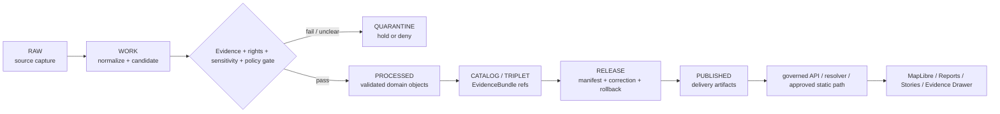

<!-- [KFM_META_BLOCK_V2]
doc_id: kfm://data/published/readme
name: Published Data README
path: data/published/README.md
type: data-lifecycle-index-readme
version: v0.1.0
status: draft
owners:
  - <data-publication-steward>
  - <release-steward>
  - <policy-steward>
  - <docs-steward>
created: 2026-06-27
updated: 2026-06-27
policy_label: public-with-review
truth_posture: cite-or-abstain
lifecycle_phase: published
responsibility_root: data/
artifact_family: released-public-safe-delivery-artifacts
sensitivity_posture: public-safe-derivatives-only; release-required; downstream-carrier-only; cite-or-abstain
related:
  - ../README.md
  - layers/README.md
  - pmtiles/README.md
  - reports/README.md
  - stories/README.md
  - atmosphere/README.md
  - people-dna-land/README.md
  - roads-rail-trade/README.md
  - settlements-infrastructure/README.md
  - soil/README.md
  - ../proofs/README.md
  - ../receipts/README.md
  - ../../release/manifests/README.md
  - ../../docs/doctrine/derived-stays-derived.md
  - ../../docs/doctrine/map-first.md
  - ../../docs/doctrine/directory-rules.md
tags:
  - kfm
  - data
  - published
  - lifecycle
  - release
  - public-safe
  - downstream-carrier
  - governed-api
  - evidence-first
  - cite-or-abstain
notes:
  - "This README replaces the greenfield stub and documents the parent data/published lifecycle lane."
  - "Published artifacts are downstream delivery carriers; they do not replace source records, processed data, catalog records, EvidenceBundles, proofs, receipts, policy decisions, release manifests, review records, correction records, rollback records, registries, or AI receipts."
  - "Child lane README presence does not prove payload presence, release-manifest approval, validator wiring, CI enforcement, or hosting readiness."
  - "Public clients consume published artifacts through governed APIs, release-resolved artifact URLs, approved static hosting paths, and policy-safe runtime envelopes."
[/KFM_META_BLOCK_V2] -->

<a id="top"></a>

# Published Data

Released public-safe KFM delivery artifacts.

<p>
  
  
  
  
  
  
</p>

**Quick links:** [Scope](#scope) · [Repo fit](#repo-fit) · [Confirmed child lanes](#confirmed-child-lanes) · [Inputs](#inputs) · [Exclusions](#exclusions) · [Directory map](#directory-map) · [Publication boundary](#publication-boundary) · [Required checks](#required-checks-before-use) · [Status notes](#status-notes)

> [!IMPORTANT]
> `data/published/` is a **published lifecycle lane**, not a truth root. It may contain release-approved public-safe delivery artifacts, indexes, manifests, sidecars, digests, and pointers. It is not source authority, proof authority, receipt authority, release authority, catalog authority, registry authority, policy authority, domain truth, legal/title/regulatory authority, story truth, map truth, or AI truth.

---

## Scope

This directory indexes release-approved, public-safe KFM delivery artifacts. Published artifacts may include map layers, PMTiles, domain artifact bundles, report payloads, story payloads, API payload snapshots, release-local indexes, public manifests, allowlists, caveat summaries, digests, and release-resolved pointers after evidence, source role, rights, policy, sensitivity, review, release, correction, and rollback requirements are met.

The value of `data/published/` is delivery and inspection. It helps public clients, governed APIs, MapLibre surfaces, story playback, reports, and download resolvers locate released artifacts. It does not create claims or replace the underlying source records, processed domain objects, catalog/EvidenceBundle state, proofs, receipts, policy decisions, review records, registries, correction records, rollback records, or release manifests.

---

## Repo fit

| Field | Value |
|---|---|
| Path | `data/published/` |
| Responsibility root | `data/` |
| Lifecycle phase | `published/` |
| Artifact role | Released public-safe delivery artifacts, sidecars, indexes, and child-lane READMEs |
| Upstream lifecycle | `RAW -> WORK / QUARANTINE -> PROCESSED -> CATALOG / TRIPLET -> RELEASE -> PUBLISHED` |
| Public access posture | Governed APIs, release-resolved artifact URLs, approved static hosting paths, and policy-safe runtime envelopes only |
| Release authority | `release/`, not this directory |
| Proof authority | `data/proofs/` and `data/receipts/`, not this directory |
| Catalog authority | `data/catalog/`, not this directory |
| Registry authority | `data/registry/`, not this directory |
| Policy authority | `policy/`, not this directory |
| Default failure posture | `DENY`, `HOLD`, `RESTRICT`, or `ABSTAIN` when evidence, rights, sensitivity, source role, policy, review, release, correction, digest, or rollback support is insufficient |

---

## Confirmed child lanes

The child lanes below are README paths confirmed by current-session GitHub fetches or edits. This table does **not** prove artifact payload bytes exist under those lanes.

| Child lane | Role | Boundary |
|---|---|---|
| [`layers/`](layers/README.md) | Parent map/API layer lane | Released derivative delivery only; not canonical truth. |
| [`pmtiles/`](pmtiles/README.md) | PMTiles format lane | Delivery format only; format is not authority. |
| [`reports/`](reports/README.md) | Published report payload lane | Reports are downstream carriers, not root truth. |
| [`stories/`](stories/README.md) | Published story payload lane | Story claims resolve to evidence or abstain. |
| [`atmosphere/`](atmosphere/README.md) | Atmosphere published artifacts | Preserve knowledge-character caveats and release state. |
| [`people-dna-land/`](people-dna-land/README.md) | People/DNA/Land published artifacts | High-sensitivity lane; release, privacy, title, consent, and redaction boundaries apply. |
| [`roads-rail-trade/`](roads-rail-trade/README.md) | Roads/Rail/Trade non-layer artifacts | Not graph, route, facility, or corridor truth. |
| [`settlements-infrastructure/`](settlements-infrastructure/README.md) | Settlements/Infrastructure non-layer artifacts | Working canonical slug; compatibility variants remain noted. |
| [`soil/`](soil/README.md) | Soil non-layer artifacts | Support-type separation remains mandatory. |

> [!NOTE]
> Add additional child lanes only after confirming the owning domain lane, responsibility-root fit, release path, artifact contract, sidecar requirements, sensitivity posture, correction path, rollback target, and Directory Rules placement basis.

---

## Inputs

Accepted content is limited to release-approved, public-safe delivery artifacts and immediate sidecars such as:

- child-lane README files and release-local notes;
- released public-safe map/API layer artifacts and sidecars;
- released PMTiles or other format-specific delivery artifacts;
- released report, story, domain-export, and API payload artifacts;
- `layer.manifest.json`, `report.manifest.json`, `story.manifest.json`, `public_index.json`, `fields.allowlist.json`, `citation_index.json`, `evidence_refs.json`, and caveat/review summaries;
- digest files such as `.sha256` that bind released bytes to release state;
- `latest.json` pointers only when generated from release state.

---

## Exclusions

| Do not place here | Correct authority home |
|---|---|
| RAW source captures, uploaded source material, or source mirrors | `data/raw/<domain>/` or source-specific intake |
| WORK files, generated candidates, authoring scratch, unresolved joins, or validation drafts | `data/work/<domain>/` or the appropriate work lane |
| Quarantined, rights-unclear, sensitivity-unclear, policy-held, or review-held material | `data/quarantine/<domain>/` |
| Canonical processed domain objects | `data/processed/<domain>/` |
| Catalog records, triplets, graph truth, or EvidenceBundle state | `data/catalog/`, triplet lanes, or proof lanes |
| EvidenceBundle / ProofPack | `data/proofs/` |
| Validation, transform, build, representation, story-build, AI, or release receipts | `data/receipts/` |
| Release manifests, promotion decisions, correction records, rollback records, or signatures | `release/` |
| Source descriptors, source activation records, or registry truth | `data/registry/` |
| Semantic contracts, schemas, or policy rules | `contracts/`, `schemas/`, `policy/` |
| Runtime source code, UI components, model adapters, plugins, or validators | `apps/`, `packages/`, `tools/`, or verified implementation roots |
| Restricted detail hidden only by style, zoom threshold, client filtering, camera position, or report formatting | Restricted governed lanes only; not public published artifacts |
| Direct model-generated claims or uncited summaries | Governed answer/provenance paths only |

---

## Directory map

```text
data/published/
├── README.md
├── layers/
│   └── README.md
├── pmtiles/
│   └── README.md
├── reports/
│   └── README.md
├── stories/
│   └── README.md
├── atmosphere/
│   └── README.md
├── people-dna-land/
│   └── README.md
├── roads-rail-trade/
│   └── README.md
├── settlements-infrastructure/
│   └── README.md
└── soil/
    └── README.md
```

> [!NOTE]
> This map lists README lanes confirmed in this conversation. It does not assert that release folders, artifact payloads, static hosting objects, registries, manifests, validators, or CI wiring currently exist.

---

## Publication boundary


```mermaid
flowchart LR
    RAW["RAW<br/>source capture"] --> WORK["WORK<br/>normalize + candidate"]
    WORK --> GATE{Evidence + rights + sensitivity + policy gate}
    GATE -->|fail / unclear| QUAR["QUARANTINE<br/>hold or deny"]
    GATE -->|pass| PROC["PROCESSED<br/>validated domain objects"]
    PROC --> CAT["CATALOG / TRIPLET<br/>EvidenceBundle refs"]
    CAT --> REL["RELEASE<br/>manifest + correction + rollback"]
    REL --> PUB["PUBLISHED<br/>delivery artifacts"]
    PUB --> API["governed API / resolver / approved static path"]
    API --> UI["MapLibre / Reports / Stories / Evidence Drawer"]
```

The forbidden shortcut is:

```text
RAW / WORK / QUARANTINE / processed candidate / direct source record / direct model output / uncited claim / unreleased artifact
→ direct public published artifact
```

---

## Required checks before use

- [ ] Confirm the artifact belongs under `data/published/` and in the correct child lane.
- [ ] Confirm the release manifest and promotion decision.
- [ ] Confirm proof, receipt, and catalog/EvidenceBundle closure.
- [ ] Confirm source descriptors, source roles, rights posture, and current terms.
- [ ] Confirm domain-specific sensitivity, privacy, geoprivacy, support-type, lineage, time, caveat, and policy requirements.
- [ ] Confirm field allowlist, artifact manifest, citation/evidence refs where applicable, and released-byte digest.
- [ ] Confirm correction path, rollback target, and withdrawal behavior.
- [ ] Confirm `latest.json`, if present, is generated from release state.
- [ ] Confirm public clients consume artifacts through governed APIs, release-resolved URLs, approved static hosting paths, or policy-safe runtime envelopes.
- [ ] Confirm no published artifact is treated as source, proof, receipt, release, catalog, registry, policy, legal/title/regulatory, domain-truth, story-truth, map-truth, or AI authority.

---

## Status notes

| Claim | Status |
|---|---|
| This README replaces the greenfield stub at `data/published/README.md`. | **CONFIRMED authored** |
| The target path existed in the live repository as a greenfield stub before this edit. | **CONFIRMED by GitHub contents API during this edit** |
| `layers/README.md`, `pmtiles/README.md`, `reports/README.md`, and `stories/README.md` exist as published child-lane READMEs. | **CONFIRMED by GitHub contents API during this edit** |
| Several domain child README lanes exist and were recently edited or verified in this session. | **CONFIRMED for listed README paths; payload maturity remains separate** |
| Actual released payloads exist under every listed child lane. | **UNKNOWN** |
| Release manifests approve every listed child lane. | **UNKNOWN** |
| Validators and CI checks enforce every listed published lane. | **NEEDS VERIFICATION** |
| This README is release, proof, catalog, registry, policy, domain-truth, story-truth, map-truth, or AI authority. | **DENY** |

---

## Related files

- [`../README.md`](../README.md)
- [`layers/README.md`](layers/README.md)
- [`pmtiles/README.md`](pmtiles/README.md)
- [`reports/README.md`](reports/README.md)
- [`stories/README.md`](stories/README.md)
- [`atmosphere/README.md`](atmosphere/README.md)
- [`people-dna-land/README.md`](people-dna-land/README.md)
- [`roads-rail-trade/README.md`](roads-rail-trade/README.md)
- [`settlements-infrastructure/README.md`](settlements-infrastructure/README.md)
- [`soil/README.md`](soil/README.md)
- [`../proofs/README.md`](../proofs/README.md)
- [`../receipts/README.md`](../receipts/README.md)
- [`../../release/manifests/README.md`](../../release/manifests/README.md)
- [`../../docs/doctrine/derived-stays-derived.md`](../../docs/doctrine/derived-stays-derived.md)
- [`../../docs/doctrine/map-first.md`](../../docs/doctrine/map-first.md)
- [`../../docs/doctrine/directory-rules.md`](../../docs/doctrine/directory-rules.md)

---

KFM rule: this directory is a released public-safe delivery lane only. It is not source authority, proof authority, receipt authority, release authority, catalog authority, registry authority, policy authority, legal/title/regulatory authority, domain truth, story truth, map truth, or AI truth.

[Back to top](#top)
