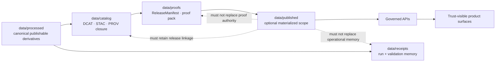

<!-- [KFM_META_BLOCK_V2]
doc_id: kfm://doc/<NEEDS_VERIFICATION_UUID>
title: Published Release Scope (`data/published/`)
type: standard
version: v1
status: draft
owners: @bartytime4life
created: YYYY-MM-DD
updated: YYYY-MM-DD
policy_label: NEEDS_VERIFICATION
related: [README.md, data/README.md, data/processed/README.md, data/catalog/README.md, data/receipts/README.md, data/proofs/README.md]
tags: [kfm, data, published]
notes: [doc_id, created, updated, and policy_label need repo-side verification before merge]
[/KFM_META_BLOCK_V2] -->

# Published Release Scope (`data/published/`)

Release-backed, governed materialization surface for KFM public-safe or steward-facing scope.

> **Status:** experimental  
> **Doc state:** draft  
> **Owners:** `@bartytime4life`  
> **Path target:** `data/published/README.md`  
>         
> **Quick jump:** [Scope](#scope) · [Repo fit](#repo-fit) · [Accepted inputs](#accepted-inputs) · [Exclusions](#exclusions) · [Directory tree](#directory-tree) · [Quickstart](#quickstart) · [Usage](#usage) · [Diagram](#diagram) · [Tables](#tables) · [Task list](#task-list) · [FAQ](#faq) · [Appendix](#appendix)

> [!IMPORTANT]
> `data/published/` is **not** where KFM truth becomes admissible.
>
> In KFM, publication is a **governed trust state first**. This directory is the optional materialized surface for scope that is **already** release-backed, catalog-closed, policy-shaped, and fit to reference from governed APIs.

> [!NOTE]
> This README keeps live repo evidence and doctrine separate on purpose.
>
> The current branch confirms that `data/published/` exists and that its README was scaffolded. The richer operational role below is grounded in neighboring repo docs plus March 2026 KFM doctrine, while exact child layout under this directory remains intentionally bounded where it has not been directly re-inspected.

| At a glance | Working rule |
|---|---|
| Directory role | Optional materialized publication surface |
| Trust rule | Publication remains a **state first**, not a folder trick |
| Upstream prerequisites | `PROCESSED` + `CATALOG` + release evidence |
| Downstream rule | Governed APIs may reference this scope; normal clients should not treat storage as the public contract |
| Authority rule | Authority comes from release-backed lineage, not from placement in `data/published/` |
| Correction rule | Supersede, narrow, or withdraw visibly; never silently overwrite |

## Scope

`data/published/` is the repo-facing place for **already governed** outward scope.

That makes it narrower than `data/` as a whole and downstream of the main KFM truth path:

`Source edge -> RAW -> WORK / QUARANTINE -> PROCESSED -> CATALOG -> PUBLISHED`

This README exists to make one boundary easy to read in GitHub review:

- what may be materialized here,
- what must stay upstream,
- what must stay adjacent,
- and what should remain explicitly **UNKNOWN**, **INFERRED**, or **PROPOSED** until the live tree is rechecked.

### Evidence posture used in this README

| Topic | Status | How to read it |
|---|---|---|
| `data/published/` exists on the current branch | **CONFIRMED** | Safe to treat as a live repo path. |
| `data/published/README.md` currently exists as a scaffold | **CONFIRMED** | This file is replacing a placeholder, not inventing a new surface. |
| `PUBLISHED` is the governed public- or steward-facing release scope | **CONFIRMED doctrine** | Safe to treat as KFM design law. |
| `data/published/` is an optional **materialized** scope and publication remains a **state first** | **INFERRED** | Strong local reading from `data/README.md`; keep exact file conventions bounded until rechecked. |
| Exact children below `data/published/` beyond this README | **UNKNOWN / NEEDS VERIFICATION** | Do not imply a live bundle layout that has not been inspected. |
| A `public/` and `steward/` split below this path | **PROPOSED** | Useful starter pattern, not established mounted fact. |

[Back to top](#published-release-scope-datapublished)

## Repo fit

**Path:** `data/published/README.md`

**Role:** directory README for the materialized publication edge inside `data/`.

`data/published/` should stay close to release truth, but not replace it. In practice that means it sits between upstream release-bearing surfaces and downstream governed API usage.

### Path and adjacent surfaces

| Relation | Surface | Posture | Why it matters |
|---|---|---|---|
| Upstream | [`../README.md`](../README.md) | **CONFIRMED** | Parent lifecycle README establishes the local data-zone pattern and the “publication remains a state first” rule. |
| Upstream | [`../processed/README.md`](../processed/README.md) | **CONFIRMED** | `PROCESSED` is where canonical publishable derivatives stabilize before outward closure and promotion. |
| Upstream | [`../catalog/README.md`](../catalog/README.md) | **CONFIRMED** | Catalog closure belongs beside publication, but is a distinct surface. |
| Upstream | [`../catalog/stac/README.md`](../catalog/stac/README.md) | **CONFIRMED** | STAC remains one of the outward metadata surfaces for discoverability and lineage. |
| Upstream | [`../receipts/README.md`](../receipts/README.md) | **CONFIRMED** | Run receipts and validation memory belong adjacent, not hidden inside outward scope. |
| Upstream | [`../proofs/README.md`](../proofs/README.md) | **CONFIRMED** | Release manifests, proof packs, attestations, and correction trace should remain explicit. |
| Upstream | [`../../contracts/README.md`](../../contracts/README.md) | **CONFIRMED** | Shared object shapes and publication-facing trust objects should remain machine-readable and reviewable. |
| Upstream | [`../../policy/README.md`](../../policy/README.md) | **CONFIRMED** | Rights, sensitivity, deny-by-default rules, and publishability logic should remain executable. |
| Downstream | [`../../apps/`](../../apps/) | **CONFIRMED path / UNKNOWN depth** | Governed APIs and app surfaces may reference published scope, but storage is not the public contract by itself. |
| Downstream | [`../../tests/`](../../tests/) | **CONFIRMED path / UNKNOWN depth** | Publication checks, policy tests, and correction-path tests should prove this surface. |
| Downstream | [`../../docs/`](../../docs/) | **CONFIRMED path / UNKNOWN depth** | Runbooks, ADRs, and release notes should explain behavior-significant changes here. |
| Upstream root | [`../../README.md`](../../README.md) | **CONFIRMED** | Root repo posture keeps the trust membrane and verification-first reading rule visible. |

### Repo-fit summary

| Question | Answer |
|---|---|
| What is `data/published/` for? | Materializing outward scope that is already release-backed and policy-permitted. |
| What is it not for? | Not source intake, not validation staging, not catalog closure authority, and not a direct client shortcut. |
| Where do proof and catalog truth stay? | In sibling release-bearing surfaces such as `../catalog/`, `../receipts/`, and `../proofs/`. |
| What should consume this scope? | Governed APIs, export assembly, and other trust-visible surfaces that preserve release linkage. |

[Back to top](#published-release-scope-datapublished)

## Accepted inputs

Only material that is already admissible for outward use should land here.

| Accepted input | Status | Why it belongs here | What should already exist upstream |
|---|---|---|---|
| Release-backed public-safe materialized scope | **INFERRED** | This is the most natural use of the directory. | `DatasetVersion`, catalog closure, release evidence, policy-safe scope |
| Steward-facing published scope where policy allows | **CONFIRMED doctrine / PROPOSED foldering** | KFM doctrine explicitly allows published scope to be public or steward-facing. | Review / policy decisions, release evidence, scope restrictions |
| Lightweight access copies or outward bundles that retain release linkage | **PROPOSED** | Useful when outward consumption benefits from materialization. | Stable identifiers, catalog refs, evidence linkage |
| Human-readable landing docs for a published bundle or lane | **PROPOSED** | GitHub review becomes clearer when bundle intent and caveats stay near the materialized scope. | Release context, caveats, sensitivity posture |
| Public-safe exemplars tied to a published release | **INFERRED** | Parent `data/` README already allows public-safe exemplars as repo-facing data material. | Release or proof linkage, public-safe review |

> [!TIP]
> A simple test helps here:
>
> if an artifact cannot clearly answer **which release backs it**, **which catalog closure describes it**, and **what correction path applies**, it is probably too early for `data/published/`.

[Back to top](#published-release-scope-datapublished)

## Exclusions

The following do **not** belong here as normal practice.

| Exclusion | Put it under / behind | Why |
|---|---|---|
| Raw captures, fetch context, or source-native bytes | `../raw/` | RAW preserves source memory and integrity, not outward publication scope. |
| QA intermediates, transforms, or redaction work products still under construction | `../work/` | WORK is for reproducible transformation, not release-facing materialization. |
| Rights-unclear, sensitivity-unclear, or failed-validation material | `../quarantine/` | KFM fails closed on uncertainty. |
| Canonical candidate truth before release | `../processed/` | Processed authority stabilizes before outward materialization. |
| Catalog closure as the primary authority surface | `../catalog/` | `DCAT + STAC + PROV` closure remains distinct and should not be silently collapsed into this directory. |
| Receipts, validation reports, and replay memory as the primary record | `../receipts/` | Operational memory should remain durable and inspectable on its own. |
| Release manifests, proof packs, and attestations as the primary release record | `../proofs/` | Proof surfaces should stay explicit and diffable. |
| Secrets, credentials, or environment-bound material | secret manager / deployment layer | `data/published/` is evidence-bearing, not secret-bearing. |
| Direct frontend contracts to storage layout | governed APIs | KFM’s trust membrane lives in governed routes and evidence resolution, not in client file browsing. |
| Derived tiles, indexes, summaries, scenes, or caches that have lost release linkage | downstream rebuildable lanes | Derived convenience does not become authority through convenience. |
| Silent overwrite of already published meaning | correction / supersession / withdrawal flow | KFM requires visible correction lineage. |

> [!WARNING]
> A “helpful” copy placed in `data/published/` without release linkage is worse than a missing copy.
>
> It looks trustworthy while weakening inspectability.

[Back to top](#published-release-scope-datapublished)

## Directory tree

### Confirmed minimum shape

```text
data/published/
└── README.md
```

That is the minimum live shape this revision is willing to treat as settled from direct repo inspection.

### Doctrine-aligned starter shape *(PROPOSED)*

```text
data/published/
├── README.md
├── public/    # public-safe materialized scope
└── steward/   # steward-facing materialized scope where policy allows
```

This is intentionally conservative. It preserves the strongest doctrinal split without inventing a deeper release-bundle convention that has not been rechecked on the branch.

### Path posture

| Path claim | Status | Reading rule |
|---|---|---|
| `data/published/README.md` exists and was scaffolded | **CONFIRMED** | Safe to treat as current branch fact. |
| `data/published/` contains additional live assets beyond this README | **UNKNOWN** | Inspect before documenting as real. |
| `public/` below `data/published/` is the current live pattern | **PROPOSED** | Useful starter split, not current fact. |
| `steward/` below `data/published/` is the current live pattern | **PROPOSED** | Doctrine-consistent, not current fact. |
| Bundle-specific manifests or pointer files already exist here | **UNKNOWN** | Do not imply filenames or conventions that have not been reverified. |

[Back to top](#published-release-scope-datapublished)

## Quickstart

Use a verification-first loop before treating any deeper `published/` claim as settled.

```bash
# inspect the target surface
pwd
find data/published -maxdepth 4 -print 2>/dev/null | sort
test -f data/published/README.md && sed -n '1,220p' data/published/README.md

# inspect the sibling release-truth surfaces this directory depends on
for p in data/processed data/catalog data/receipts data/proofs; do
  echo "== $p =="
  find "$p" -maxdepth 2 -print 2>/dev/null | sort | sed -n '1,120p'
done

# look for release linkage and correction vocabulary inside published scope
grep -RIn "release_id\|dataset_version_id\|catalog\|evidence\|proof\|correction\|supersed" \
  data/published 2>/dev/null || true
```

> [!TIP]
> If this inspection shows only scaffold files, keep this README strong on boundaries and weak on invented layout.
>
> A bounded README is more trustworthy than a detailed fiction.

[Back to top](#published-release-scope-datapublished)

## Usage

### 1. Materialize only after promotion

`data/published/` is for scope that is **already** on the outward side of promotion.

That means the publishability burden has already been carried upstream:
catalog closure exists, release evidence exists, and policy/review outcomes are stable enough that a governed API may safely reference the resulting scope.

### 2. Serve through governed APIs

Materialized scope here may support export assembly, packaged outward views, or other repo-visible publication surfaces.

It should **not** become a rationale for bypassing governed APIs, evidence resolution, or trust-visible runtime behavior.

### 3. Correct by visible lineage

If published meaning narrows, is withdrawn, or is superseded, this directory should reflect that through visible lineage and bounded scope changes.

Do **not** silently rewrite previously outward-facing meaning and pretend nothing changed.

### Common operating pattern

| Workflow | What `data/published/` may do | What must stay elsewhere |
|---|---|---|
| Publish | Materialize already approved outward scope | Source admission, QA, policy decision, and release proof creation |
| Serve | Hold stable release-linked copies or views referenced by governed APIs | Trust boundary enforcement and runtime decision logic |
| Correct | Narrow, supersede, or retire materialized scope in line with correction artifacts | Silent overwrite, hidden rollback, or policy bypass |

[Back to top](#published-release-scope-datapublished)

## Diagram


```mermaid
flowchart LR
    P[data/processed<br/>canonical publishable derivatives]
    C[data/catalog<br/>DCAT · STAC · PROV closure]
    R[data/proofs<br/>ReleaseManifest · proof pack]
    M[data/receipts<br/>run + validation memory]
    U[data/published<br/>optional materialized scope]
    A[Governed APIs]
    S[Trust-visible product surfaces]

    P --> C
    P --> M
    C --> R
    R --> U
    U --> A
    A --> S

    U -. must retain release linkage .-> C
    U -. must not replace proof authority .-> R
    U -. must not replace operational memory .-> M
```

[Back to top](#published-release-scope-datapublished)

## Tables

### Authority and responsibility matrix

| Surface | Authority status | What it is for | What it must not become |
|---|---|---|---|
| `data/processed/` | Strong candidate authority | Stable publishable derivatives and dataset versions | Public edge by convenience |
| `data/catalog/` | Authoritative outward metadata | Discoverability, lineage, and outward closure | A silent substitute for correction or proof |
| `data/proofs/` | Release-proof authority | Manifests, attestations, proof packs, correction trace | Hidden or optional when scope is outward-facing |
| `data/receipts/` | Operational memory | Run receipts, validation reports, and replay/audit memory | The only release-facing surface |
| `data/published/` | Materialized outward scope | Public-safe or steward-facing scope already backed by release truth | The place where truth first becomes admissible |
| Governed APIs / product surfaces | Downstream delivery | Controlled access, evidence resolution, and trust-visible interaction | Direct storage bypass |

### Publication gate questions

| Question | If the answer is “yes” | If the answer is “no” |
|---|---|---|
| Is the artifact backed by a release or equivalent proof object? | It may be eligible for materialization. | Stop; it is too early for `data/published/`. |
| Is the relevant catalog closure already in place? | Outward discovery and lineage can stay legible. | Stop; closure belongs upstream first. |
| Is the scope public-safe or steward-safe at the intended precision? | Materialize into the matching outward lane. | Generalize, narrow, quarantine, or hold. |
| Does the artifact retain release and evidence linkage? | It remains inspectable enough to serve. | Do not publish convenience copies. |
| Is the correction path clear? | Visible supersession / withdrawal remains possible. | Do not make outward meaning harder to reverse. |

[Back to top](#published-release-scope-datapublished)

## Task list

- [ ] Replace placeholder metadata values in the KFM meta block before merge (`doc_id`, `created`, `updated`, `policy_label`).
- [ ] Verify whether the live branch already uses a deeper layout below `data/published/`.
- [ ] Verify whether published scope is currently separated by audience (`public/` vs `steward/`) or by another release convention.
- [ ] Verify that any artifact materialized here retains release, catalog, and evidence linkage.
- [ ] Verify that no RAW, WORK, QUARANTINE, or unreleased PROCESSED candidates are parked here.
- [ ] Verify that outward consumption still routes through governed APIs rather than direct client-to-storage reads.
- [ ] Add or wire tests if this surface becomes release-bearing in practice.

### Definition of done

A strong first revision of this README is done when:

1. the file no longer behaves like a scaffold,
2. the doc makes the “publication is a state first” rule unmistakable,
3. sibling release-truth surfaces are linked explicitly,
4. exclusions prevent the most common trust-boundary mistakes,
5. the doc remains honest about unknown live layout below `data/published/`.

[Back to top](#published-release-scope-datapublished)

## FAQ

### Is `data/published/` the same thing as the `PUBLISHED` lifecycle state?

No.

`PUBLISHED` is the governed trust state. `data/published/` is the optional materialized surface for outward scope that has **already** crossed into that state.

### Can this directory stay sparse or even empty?

Yes.

If outward publication is represented through release-backed APIs, catalog closure, and proof surfaces, KFM can still preserve publication truth without copying every outward artifact into this directory.

### Does a file become authoritative just because it sits here?

No.

Folder placement does not create authority. Authority comes from the upstream release chain and the evidence / correction lineage that stays attached to it.

### Where should STAC, DCAT, and PROV live?

Under [`../catalog/`](../catalog/).

`data/published/` may point at or materialize release-backed outward scope, but the catalog triplet stays a distinct surface.

### Where should release manifests and attestations live?

Under [`../proofs/`](../proofs/) unless the live repo proves a narrower documented convention.

This README intentionally keeps proof authority adjacent instead of collapsing it into outward storage.

[Back to top](#published-release-scope-datapublished)

## Appendix

<details>
<summary><strong>Review prompts before the first non-placeholder publish artifact lands here</strong></summary>

Before the first real bundle or asset is committed under `data/published/`, verify these questions:

- Can each outward artifact point back to a stable `dataset_version_id` or equivalent release identity?
- Is its catalog closure easy to resolve from the same review context?
- Is the public vs steward scope explicit?
- Is the correction path visible without opening unrelated tooling?
- Are proof and receipt surfaces linked rather than quietly duplicated?
- Would a reviewer be able to tell whether the artifact is a materialized view, a packaged export, or a stronger release object?

</details>

<details>
<summary><strong>Directory vocabulary for this surface</strong></summary>

| Term | Working meaning here |
|---|---|
| Materialized scope | A repo-visible outward copy or package derived from already promoted scope |
| Public-safe | Safe for public-facing routes at the published precision and attribution level |
| Steward-facing | Policy-permitted outward scope for narrower operational or stewardship audiences |
| Release linkage | Stable connection back to version, proof, and catalog surfaces |
| Visible correction | Supersession, withdrawal, or narrowing that stays legible instead of being silently overwritten |

</details>

[Back to top](#published-release-scope-datapublished)
