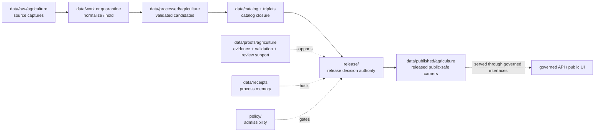

<!-- [KFM_META_BLOCK_V2]
doc_id: kfm://data/published/agriculture/readme
title: data/published/agriculture README
type: directory-readme
version: v0.1
status: draft
owners:
  - TODO(owner): data steward
  - TODO(owner): agriculture domain steward
  - TODO(owner): publication steward
  - TODO(owner): policy steward
  - TODO(owner): release steward
created: 2026-06-25
updated: 2026-06-25
policy_label: public-review
path: data/published/agriculture/README.md
related:
  - ../README.md
  - ../../README.md
  - ../../raw/agriculture/README.md
  - ../../work/agriculture/README.md
  - ../../quarantine/agriculture/README.md
  - ../../processed/agriculture/README.md
  - ../../catalog/domain/agriculture/README.md
  - ../../triplets/agriculture/README.md
  - ../../proofs/agriculture/README.md
  - ../../proofs/README.md
  - ../../receipts/README.md
  - ../../../release/README.md
  - ../../../docs/domains/agriculture/ARCHITECTURE.md
  - ../../../docs/domains/agriculture/LIFECYCLE.md
  - ../../../docs/domains/agriculture/SENSITIVITY.md
  - ../../../docs/domains/agriculture/RELEASE_INDEX.md
  - ../../../docs/doctrine/directory-rules.md
  - ../../../docs/doctrine/lifecycle-law.md
  - ../../../docs/doctrine/trust-membrane.md
  - ../../../contracts/README.md
  - ../../../schemas/README.md
  - ../../../policy/README.md
notes:
  - "Directory README for released, public-safe Agriculture carriers. It replaces a greenfield stub."
  - "This path is downstream of release decisions. It does not itself approve release, define policy, prove claims, or replace ReleaseManifest, EvidenceBundle, ProofPack, receipts, catalog records, schemas, or contracts."
  - "Field/operator/private joins, unresolved source rights, missing EvidenceBundle support, missing aggregation/redaction proof, and missing rollback support fail closed before any public artifact lands here."
[/KFM_META_BLOCK_V2] -->

<a id="top"></a>

# `data/published/agriculture/`

> Published Agriculture lane for **released, public-safe carriers**: aggregate crop, suitability, stress, irrigation-context, conservation-context, and agriculture-economy artifacts that have passed KFM release gates and are safe for governed API or public UI consumption.


> [!IMPORTANT]
> **Status:** `draft`  
> **Owners:** `TODO(owner): data steward` · `TODO(owner): agriculture domain steward` · `TODO(owner): publication steward` · `TODO(owner): policy steward` · `TODO(owner): release steward`  
> **Path:** `data/published/agriculture/README.md`  
> **Truth posture:** CONFIRMED target path and Agriculture domain docs from current repo evidence / PROPOSED child layout and instance naming / NEEDS VERIFICATION for emitted published artifacts, release manifests, schemas, validators, CI checks, and governed API routes.

> [!WARNING]
> Nothing is public just because it is in this folder. Published Agriculture artifacts require release authority, evidence closure, policy clearance, review state where required, correction path, and rollback target. Keep release decisions in `release/`, proof support in `data/proofs/`, catalog records in `data/catalog/`, and process memory in `data/receipts/`.

---

## Quick jumps

| Section | Use it for |
|---|---|
| [1. Scope](#1-scope) | What this published lane is for. |
| [2. Repo fit](#2-repo-fit) | How this path relates to lifecycle and release authority. |
| [3. Accepted artifacts](#3-accepted-artifacts) | What may live here after release. |
| [4. Exclusions](#4-exclusions) | What must stay out. |
| [5. Publication gates](#5-publication-gates) | Minimum support before an artifact is published. |
| [6. Suggested layout](#6-suggested-layout) | Proposed child structure and naming. |
| [7. Agriculture public-surface rules](#7-agriculture-public-surface-rules) | Domain-specific safe-publication rules. |
| [8. Lifecycle relationship](#8-lifecycle-relationship) | RAW → PUBLISHED placement. |
| [9. Maintenance checklist](#9-maintenance-checklist) | Checks before adding or changing artifacts. |
| [10. Definition of done](#10-definition-of-done) | What remains before maturity. |

---

## 1. Scope

`data/published/agriculture/` is the Agriculture domain's public-safe materialization lane. It should contain only artifacts that have already passed KFM promotion gates and are tied to release authority.

This lane may hold released carriers such as:

- county, HUC, or grid-level agricultural summary layers;
- public-safe crop progress and crop observation summaries;
- public-safe crop suitability or stress-context layers;
- public-safe irrigation-context or conservation-context summaries;
- public-safe agricultural economy summaries;
- released map-layer files, API payload snapshots, report carriers, tile/package carriers, or index manifests; and
- public release notes that point back to release, catalog, proof, and rollback records.

This lane is downstream. It should not admit raw source captures, work candidates, quarantine holds, processed candidates, catalog drafts, proof objects, receipts, policy logic, release decisions, or unreleased model/AI outputs.

[Back to top](#top)

---

## 2. Repo fit

| Neighbor | Role | Boundary |
|---|---|---|
| [`../../raw/agriculture/`](../../raw/agriculture/) | Source captures. | Never public-readable. |
| [`../../work/agriculture/`](../../work/agriculture/) | Normalization workspace. | Never public-readable. |
| [`../../quarantine/agriculture/`](../../quarantine/agriculture/) | Held or unsafe material. | Never public-readable. |
| [`../../processed/agriculture/`](../../processed/agriculture/) | Validated normalized candidates. | Upstream of catalog and release, not public by itself. |
| [`../../catalog/domain/agriculture/`](../../catalog/domain/agriculture/) | Agriculture catalog records. | Discovery/lineage carrier; not release authority. |
| [`../../triplets/agriculture/`](../../triplets/agriculture/) | Agriculture graph/triplet projection. | Upstream or sibling projection, not public by itself. |
| [`../../proofs/agriculture/`](../../proofs/agriculture/) | Agriculture proof support. | Evidence and proof support; not published carrier. |
| [`../../receipts/`](../../receipts/) | Process memory. | Receipts say what ran; they do not publish. |
| [`../../../release/`](../../../release/) | Release decisions, manifests, rollback, correction, withdrawal, signatures. | Publication authority lives here. |
| [`../../../contracts/`](../../../contracts/) | Semantic meaning. | Published artifacts conform to contracts; they do not define them. |
| [`../../../schemas/`](../../../schemas/) | Machine shape. | Published artifacts validate against schemas; schemas live elsewhere. |
| [`../../../policy/`](../../../policy/) | Admissibility. | Published artifacts carry policy outcome refs; policy rules live elsewhere. |

> [!NOTE]
> The Agriculture Architecture names `data/published/agriculture/` as a proposed domain placement under the data lifecycle root. This README documents the existing path; it does not independently prove the release pipeline is wired.

[Back to top](#top)

---

## 3. Accepted artifacts

Use this directory only for release-linked, public-safe artifacts.

| Artifact type | Suggested placement | Required support |
|---|---|---|
| Released layer carrier | `layers/<release_id>/<layer_slug>.*` | ReleaseManifest, EvidenceBundle refs, policy decision, validation report, rollback target. |
| Released API snapshot | `api/<release_id>/<payload_slug>.json` | Schema validation, release refs, proof refs, correction path. |
| Released report carrier | `reports/<release_id>/<report_slug>.md` or `.json` | Citations, EvidenceBundle refs, release refs, review refs where required. |
| Released tile/package carrier | `tiles/<release_id>/<package_slug>.*` | Digest, layer manifest, release refs, rollback target. |
| Public index | `indexes/published-agriculture-index.json` | Points to release-approved artifacts only. |
| Superseded public artifact | `retired/<release_id>/<artifact_slug>.*` | Supersession, correction, withdrawal, or rollback reference. |

[Back to top](#top)

---

## 4. Exclusions

| Excluded material | Correct home |
|---|---|
| RAW source payloads, downloads, exports, scans, rasters, logs, or source-system dumps | `data/raw/agriculture/` |
| Working candidates or failed validation material | `data/work/agriculture/` or `data/quarantine/agriculture/` |
| Processed normalized candidates | `data/processed/agriculture/` |
| Catalog records or release-candidate catalog entries | `data/catalog/` |
| Triplets or graph edges | `data/triplets/agriculture/` |
| EvidenceBundle, ValidationReport, ProofPack, citation validation, or review proof | `data/proofs/` child lanes |
| Process receipts, aggregation receipts, redaction receipts, model-run receipts | `data/receipts/` or approved receipt/proof homes |
| ReleaseManifest, PromotionDecision, RollbackCard, CorrectionNotice, WithdrawalNotice, signatures | `release/` |
| Policy logic | `policy/` |
| Machine schemas | `schemas/` |
| Semantic contracts | `contracts/` |
| Unreviewed AI summaries or model outputs | governed AI/review paths; publish only through release gates |

[Back to top](#top)

---

## 5. Publication gates

Before an Agriculture artifact is placed here as current public output, verify:

- a `ReleaseManifest` or equivalent release authority exists under `release/`;
- EvidenceBundle refs resolve for every consequential claim;
- validation reports passed or recorded finite non-pass outcomes with reasons;
- catalog closure exists for the released artifact;
- policy decisions allow the public audience class;
- aggregation or redaction support exists where the artifact derives from finer-grained or restricted inputs;
- source rights are known and compatible with the public surface;
- review records exist where required by sensitivity, rights, or materiality;
- correction and rollback paths are recorded; and
- digests or integrity refs bind the released artifact to the release record.

If any gate is unresolved, the artifact should remain upstream or be held; it should not be copied here as a workaround.

[Back to top](#top)

---

## 6. Suggested layout

```text
data/published/agriculture/
├── README.md
├── layers/
│   └── <release_id>/
├── api/
│   └── <release_id>/
├── reports/
│   └── <release_id>/
├── tiles/
│   └── <release_id>/
├── indexes/
│   └── published-agriculture-index.json
└── retired/
    └── <release_id>/
```

Suggested deterministic file names:

```text
agriculture.published.<artifact_family>.<scope>.<release_id>.<short_hash>.<ext>
```

Examples:

```text
agriculture.published.layer.crop-progress-county.release-20260625.0123abcd.geojson
agriculture.published.api.crop-summary-county.release-20260625.89ab4567.json
agriculture.published.report.suitability-summary.release-20260625.4567cdef.md
```

This layout is PROPOSED until validated by contracts, schemas, fixtures, and release tooling.

[Back to top](#top)

---

## 7. Agriculture public-surface rules

Agriculture public surfaces must preserve the domain's fail-closed posture.

| Rule | Public posture |
|---|---|
| Aggregate products | County, HUC, grid, or other approved aggregate level is the normal public surface. |
| Field-level products | Denied by default unless explicit rights, policy, review, transform proof, and release authority exist. |
| Operator or private joins | Denied by default; do not publish private farm/operator-parcel joins. |
| Source role | Aggregate, modeled, observed, administrative, and context roles must remain visible and must not be upgraded by release. |
| Cross-lane dependencies | Soil, hydrology, atmosphere, hazards, people/land, and infrastructure claims retain their owning-lane authority. |
| AI summaries | AI can summarize released evidence but cannot become root truth or publication authority. |
| Corrections | Public artifacts must support correction, supersession, withdrawal, or rollback. |

[Back to top](#top)

---

## 8. Lifecycle relationship



Published files are downstream carriers. Release state is governed by release records, not by path alone.

[Back to top](#top)

---

## 9. Maintenance checklist

Before adding or changing a file under this lane, verify:

- [ ] The artifact is release-approved and public-safe for the intended audience.
- [ ] The release record exists under `release/` and points to this artifact.
- [ ] The artifact has EvidenceBundle, catalog, validation, policy, review, receipt, correction, and rollback refs where required.
- [ ] Source roles and time scopes are preserved.
- [ ] Field/operator/private joins are absent or explicitly cleared through recorded policy and release authority.
- [ ] The artifact does not duplicate RAW, WORK, QUARANTINE, PROCESSED, proof, receipt, catalog, schema, contract, or policy authority.
- [ ] The artifact has a digest or integrity reference.
- [ ] Public clients consume it through governed interfaces or approved released artifact paths.

[Back to top](#top)

---

## 10. Definition of done

This lane is operationally mature when:

- [ ] `data/published/README.md` defines the parent published-data contract.
- [ ] Agriculture published artifact contracts and schemas exist under approved homes.
- [ ] Release tooling writes or verifies published Agriculture artifacts only after release authority is present.
- [ ] Validators block unreleased candidates, missing EvidenceBundles, missing release refs, missing rollback, unresolved rights, unsafe private joins, and source-role collapse.
- [ ] Valid and invalid fixtures cover public aggregate layer, restricted field candidate, corrected release, superseded release, and rollback target.
- [ ] Governed API or released-artifact routes are documented and tested.
- [ ] A synthetic no-network agriculture release demonstrates raw source → processed candidate → catalog/proof closure → release manifest → published artifact → governed API/public UI → correction/rollback traceability.

---

## Maintainer note

Published Agriculture artifacts are the visible end of a long trust chain. Keep them boring, citable, aggregate-first, rights-aware, and reversible. If evidence, rights, sensitivity, validation, release, correction, or rollback support is incomplete, keep the artifact upstream instead of placing it here.
