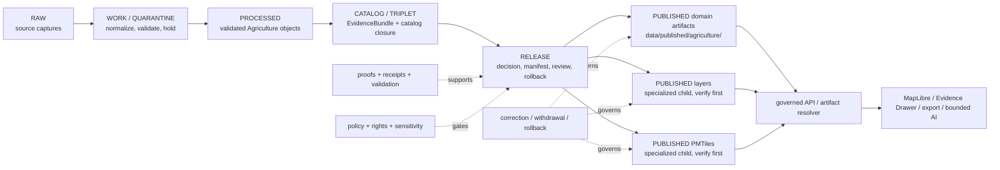

<!-- [KFM_META_BLOCK_V2]
doc_id: kfm://data/published/agriculture/readme
title: data/published/agriculture/ — Released Public-Safe Agriculture Artifacts
type: directory-readme
subtype: nested-published-domain-lane
version: v0.2.0
status: repository-grounded draft; payload, release, validator, and runtime enforcement unverified
owners:
  - "NEEDS VERIFICATION — data publication steward"
  - "NEEDS VERIFICATION — Agriculture domain steward"
  - "NEEDS VERIFICATION — release and rollback steward"
  - "NEEDS VERIFICATION — policy, rights, and sensitivity steward"
  - "NEEDS VERIFICATION — evidence and validation steward"
created: 2026-06-25
updated: 2026-07-25
policy_label: restricted-review; aggregate-first; no-direct-public-path; release-gated
path: data/published/agriculture/README.md
truth_posture: >
  CONFIRMED exact target path, prior blob, current parent published-data contracts,
  Directory Rules, and Agriculture doctrine paths / PROPOSED artifact-family routing
  and release-local profile / UNKNOWN recursive payloads, release instances, validators,
  CI enforcement, hosted delivery, and public runtime effects / NEEDS VERIFICATION
  accepted topology, accountable owners, specialized Agriculture layer or PMTiles child
  lanes, alias policy, correction propagation, cache invalidation, and rollback drills
evidence_snapshot:
  repository: bartytime4life/Kansas-Frontier-Matrix
  base_ref: main
  base_commit: 8b54b70781b160f04787ec714739710440c5f447
  prior_blob: 0b6a63aad4721fd72e190003cf468d7afbecc21e
  directory_rules_blob: 2affb080e6f0043867c64c7f06c1ca52030fbd55
  published_parent_blob: 8ecb5d2f9737349fb6569efbde36659f398de151
  published_layers_parent_blob: dec9fe683d49be194c46a46cd50bee9a2675cb28
  published_pmtiles_parent_blob: 1b40b18badf10d57ec2cce363770784bae21649e
  agriculture_architecture_blob: 3e2416796e036ac2d75002d10d5907d1735dce95
  agriculture_data_lifecycle_blob: d90fb138141c4b6b56ac5940f15a7219d5637797
  agriculture_canonical_paths_blob: 94e9fb5d76ff4aa032a8c499d86fc90ed25da86f
  agriculture_promotion_runbook_blob: aa2f3e8edc2928b261dfb57782e167eef94fc98a
  published_alias_adr_blob: fe7c2cb9456db03d93b36bb31cbf6be5acd33036
related:
  - ../README.md
  - ../layers/README.md
  - ../pmtiles/README.md
  - ../../README.md
  - ../../raw/agriculture/README.md
  - ../../work/agriculture/README.md
  - ../../quarantine/agriculture/README.md
  - ../../processed/agriculture/README.md
  - ../../catalog/domain/agriculture/README.md
  - ../../triplets/README.md
  - ../../proofs/agriculture/README.md
  - ../../receipts/README.md
  - ../../../release/README.md
  - ../../../docs/domains/agriculture/ARCHITECTURE.md
  - ../../../docs/domains/agriculture/DATA_LIFECYCLE.md
  - ../../../docs/domains/agriculture/CANONICAL_PATHS.md
  - ../../../docs/runbooks/agriculture/PROMOTION_RUNBOOK.md
  - ../../../docs/doctrine/directory-rules.md
  - ../../../docs/adr/INDEX.md
  - ../../../docs/adr/ADR-0015-data-published-_domain_-current-alias-is-governed-by-rollback_card.md
notes:
  - "Same-path Markdown modernization only; no artifact bytes, release state, policy, workflow, route, alias, or publication state changed."
  - "The direct Agriculture lane is documented as a domain-scoped published artifact lane. Specialized map-layer and PMTiles child lanes remain separate artifact-family decisions and were not created by this change."
  - "A path, badge, successful check, commit, pull request, or merge does not create KFM publication."
[/KFM_META_BLOCK_V2] -->

<a id="top"></a>

# `data/published/agriculture/` — Released public-safe Agriculture artifacts

> **One-line purpose.** Own release-approved, public-safe, domain-scoped Agriculture artifacts and immediate delivery sidecars that are not assigned to a more specific published artifact-family lane.

[](#status)
[](#authority-level)
[](#outputs)
[](#agriculture-public-surface-rules)
[](#inputs)
[](#validation)

> [!IMPORTANT]
> Directory placement does **not** create publication. Every artifact represented here must remain bound to accountable release authority, evidence and catalog closure, policy and review state, a correction path, and a rollback target. Release decisions belong under [`release/`](../../../release/README.md); proofs and receipts remain in their own authority families.

> [!CAUTION]
> Field-level, operator-linked, owner-linked, private-join, proprietary, low-count, or reconstructively precise Agriculture material fails closed for ordinary public use unless explicit rights, policy, review, transformation proof, release authority, and audience controls permit it.

**Quick navigation:** [Purpose](#purpose) · [Authority](#authority-level) · [Status](#status) · [Belongs](#what-belongs-here) · [Exclusions](#what-does-not-belong-here) · [Inputs](#inputs) · [Outputs](#outputs) · [Validation](#validation) · [Review](#review-burden) · [Related](#related-folders) · [ADRs](#adrs) · [Last reviewed](#last-reviewed) · [Artifact routing](#artifact-family-routing) · [Agriculture rules](#agriculture-public-surface-rules) · [Lifecycle](#lifecycle-relationship) · [Definition of done](#definition-of-done) · [No-loss](#no-loss-ledger)

---

<a id="1-scope"></a>

## Purpose

`data/published/agriculture/` is the Agriculture domain's **published artifact lane** inside the `data/` responsibility root. Its bounded role is to hold release-approved, public-safe Agriculture artifacts and immediate sidecars that are not more specifically owned by a published layer, PMTiles, report, story, or API-payload family.

This lane is downstream of the complete KFM trust path:

```text
RAW -> WORK / QUARANTINE -> PROCESSED -> CATALOG / TRIPLET -> RELEASE -> PUBLISHED
```

Published bytes are carriers. They may help users inspect released Agriculture claims, but they do not replace source records, normalized domain objects, `EvidenceBundle` support, policy decisions, review records, proof objects, receipts, catalog records, release manifests, corrections, withdrawals, or rollback authority.

[Back to top](#top)

---

<a id="2-repo-fit"></a>

## Authority level

**PUBLISHED responsibility; carrier-only authority.**

| Question | Bounded answer |
|---|---|
| Who owns the directory responsibility? | `data/`, lifecycle phase `published/`, domain segment `agriculture`. |
| What does this README authorize? | Documentation of the lane boundary and admission expectations only. |
| What does it not authorize? | Source activation, truth, policy, review, release, publication, hosting, route exposure, alias mutation, correction, withdrawal, or rollback execution. |
| Is this exact topology settled? | **NEEDS VERIFICATION.** Agriculture documentation proposes both a direct domain lane and specialized artifact-family lanes; current parent indexes do not yet confirm Agriculture children under every specialized lane. |
| What is the normal public path? | Governed interfaces or approved release-resolved static delivery—not direct reads from internal lifecycle stores. |
| What happens when support is incomplete? | `DENY`, `HOLD`, `RESTRICT`, `ABSTAIN`, or `ERROR`, according to the governing contract or policy surface. |

The path exists in the current repository. Its existence does not by itself prove payload inventory, release approval, validator enforcement, runtime consumption, or public readiness.

[Back to top](#top)

---

## Status

| Item | Current bounded result |
|---|---|
| Target | `data/published/agriculture/README.md` |
| Document version | `v0.2.0` |
| Base evidence | `main@8b54b70781b160f04787ec714739710440c5f447` |
| Prior blob | `0b6a63aad4721fd72e190003cf468d7afbecc21e` |
| Parent published-data contract | **CONFIRMED** at [`../README.md`](../README.md) |
| Published layer parent | **CONFIRMED** at [`../layers/README.md`](../layers/README.md) |
| Published PMTiles parent | **CONFIRMED** at [`../pmtiles/README.md`](../pmtiles/README.md) |
| Agriculture layer child | **NEEDS VERIFICATION**; not created or claimed by this README |
| Agriculture PMTiles child | **NEEDS VERIFICATION**; not created or claimed by this README |
| Recursive payload inventory | **UNKNOWN** |
| Emitted release, proof, receipt, and catalog closure | **UNKNOWN** |
| Validator, CI, hosting, and governed-runtime enforcement | **UNKNOWN** |
| Public readiness | **DENY BY DEFAULT** until release-specific evidence closes |
| Effect of this revision | Markdown only; no payload, lifecycle, release, route, alias, or publication state changed |

[Back to top](#top)

---

<a id="3-accepted-artifacts"></a>

## What belongs here

Only release-approved and public-safe artifacts that fit this lane's domain-scoped, non-specialized role belong here.

| Artifact family | Examples | Required boundary |
|---|---|---|
| Aggregate public exports | County, HUC, grid, regional, or other approved Agriculture summaries | Preserve source role, spatial and temporal scope, suppression rules, and release identity. |
| Release-local indexes | Artifact inventories, release README files, immutable lookup indexes | Navigation only; must be derived from release state and must not become release authority. |
| Companion metadata | Caveats, field allowlists, source-role summaries, temporal summaries, method summaries | Explain a released artifact; do not replace proof, receipts, policy, or catalog state. |
| Report companions | Public-safe data packages supporting a released Agriculture report | Cite the released report, `EvidenceBundle` support, and release record. |
| Integrity sidecars | Digests, checksums, immutable artifact manifests | Bind released bytes to the release packet; do not substitute for signatures or release decisions. |
| Correction and supersession cues | Release-resolved notices or pointers to correction, withdrawal, supersession, or rollback records | Derived from governing release records; never edited as an untracked shortcut. |

Artifact-family routing is defined later in [Artifact-family routing](#artifact-family-routing). A file that belongs to a specialized lane should not be duplicated here for convenience.

[Back to top](#top)

---

<a id="4-exclusions"></a>

## What does NOT belong here

| Do not place here | Correct home or action |
|---|---|
| RAW source payloads, mirrors, downloads, scans, logs, or source-system exports | [`data/raw/agriculture/`](../../raw/agriculture/README.md) or source-specific intake |
| Working candidates, unresolved joins, transformation scratch, or review drafts | [`data/work/agriculture/`](../../work/agriculture/README.md) |
| Rights-unclear, sensitivity-unclear, malformed, conflicted, or policy-held material | [`data/quarantine/agriculture/`](../../quarantine/agriculture/README.md) |
| Canonical normalized Agriculture objects that are not released | [`data/processed/agriculture/`](../../processed/agriculture/README.md) |
| Catalog records, triplets, graph projections, or `EvidenceBundle` authority | [`data/catalog/domain/agriculture/`](../../catalog/domain/agriculture/README.md), [`data/triplets/`](../../triplets/README.md) (Agriculture child lane not verified), or proof lanes |
| `EvidenceBundle`, `ProofPack`, validation proof, or review proof | [`data/proofs/agriculture/`](../../proofs/agriculture/README.md) |
| Transform, aggregation, redaction, model, validation, AI, release, or publication receipts | [`data/receipts/`](../../receipts/README.md) |
| Release manifests, promotion decisions, signatures, corrections, withdrawals, or rollback cards | [`release/`](../../../release/README.md) |
| Semantic contracts, machine schemas, policy rules, or source registry authority | `contracts/`, `schemas/`, `policy/`, or `data/registry/` |
| Map-layer bytes or layer-local sidecars assigned to the published layer family | The verified Agriculture child under [`data/published/layers/`](../layers/README.md), once admitted |
| PMTiles bytes or PMTiles-specific sidecars | The verified Agriculture child under [`data/published/pmtiles/`](../pmtiles/README.md), once admitted |
| Direct model-generated claims, uncited summaries, or AI-only interpretations | Governed evidence and AI-envelope paths; publish only after normal release gates |
| Field-, operator-, owner-, or parcel-linked public detail without explicit clearance | Quarantine, generalize, aggregate, redact, stage access, or deny |
| A mutable `current` or `latest` pointer created by hand | Use only an accepted release/alias profile with accountable decision, atomic update, invalidation, receipt, correction, and rollback controls |

[Back to top](#top)

---

<a id="5-publication-gates"></a>

## Inputs

Every admitted artifact needs a release-specific support packet appropriate to its significance.

| Support dimension | Minimum expectation |
|---|---|
| Identity and integrity | Immutable artifact identity, release identity, content digest, and reproducible locator. |
| Source and scope | Resolved source descriptors, source roles, spatial scope, temporal scope, and limitations. |
| Evidence | Consequential claims resolve through `EvidenceRef` to admissible `EvidenceBundle` support. |
| Contracts and schemas | Applicable semantic contract and machine-shape checks pass at accepted versions. |
| Rights and sensitivity | Rights, permitted use, audience, sensitivity, disclosure risk, and public-safe transforms are resolved. |
| Agriculture transformation | `AggregationReceipt`, `RedactionReceipt`, model/method receipt, suppression record, or equivalent support exists when applicable. |
| Validation and proof | Validation reports, proof objects, catalog closure, and required receipts agree on identity and digest. |
| Policy and review | Policy decision and accountable review state permit the intended public audience. |
| Release | `ReleaseManifest`, promotion decision, and any required signature or attestation bind the artifact. |
| Correction and rollback | Correction, withdrawal, supersession, cache invalidation, and rollback targets are defined. |

> [!WARNING]
> A missing gate is not an implicit pass. When required support is absent, malformed, stale, conflicted, inaccessible, or unverifiable, keep the artifact upstream or hold it for review.

[Back to top](#top)

---

## Outputs

This lane may emit or retain **released public-safe carrier bytes and immediate sidecars** for use through:

- governed APIs and artifact resolvers;
- approved release-resolved static delivery;
- public-safe downloads and exports;
- Evidence Drawer or report companion surfaces; and
- bounded AI experiences that resolve released evidence before answering.

An output from this directory remains downstream. It is not canonical source truth, processed-domain truth, catalog truth, proof authority, policy authority, review authority, release authority, legal/title authority, regulatory authority, emergency guidance, or AI truth.

[Back to top](#top)

---

<a id="9-maintenance-checklist"></a>

## Validation

### Artifact admission checks

- [ ] Confirm the artifact belongs in this domain-scoped lane rather than a specialized layer, PMTiles, report, story, or API-payload lane.
- [ ] Confirm immutable artifact identity, release identity, digest, and locator.
- [ ] Confirm source descriptors, source roles, spatial scope, temporal scope, and limitations.
- [ ] Confirm rights, audience, sensitivity, disclosure risk, and public-safe transformation.
- [ ] Confirm `EvidenceRef` and `EvidenceBundle` closure for every consequential claim.
- [ ] Confirm contract, schema, validation, proof, receipt, and catalog identities agree.
- [ ] Confirm `AggregationReceipt`, suppression, redaction, and model/method support where applicable.
- [ ] Confirm policy decision, accountable review, release manifest, promotion decision, and signatures where required.
- [ ] Confirm correction, withdrawal, supersession, invalidation, and rollback paths.
- [ ] Confirm public consumers use governed interfaces or approved release-resolved delivery.
- [ ] Confirm no map style, client-side filter, zoom threshold, or hidden field is being used as a substitute for server-side public-safety transformation.

### README checks

- [ ] Keep one H1 and a logical heading hierarchy.
- [ ] Preserve the legacy anchors retained by this revision.
- [ ] Validate every relative link and heading fragment at the resulting commit.
- [ ] Validate badge labels against the text source of truth.
- [ ] Validate Mermaid syntax and keep a textual explanation.
- [ ] Keep examples schematic; do not invent release IDs, routes, owners, validators, or passing checks.
- [ ] Re-run sensitive-content review before committing.

A passing documentation check proves only the README's declared scope. It does not prove payload safety, release approval, runtime enforcement, hosted delivery, or KFM publication.

[Back to top](#top)

---

## Review burden

Accountable ownership remains **NEEDS VERIFICATION**.

| Change class | Minimum review concern |
|---|---|
| README-only boundary clarification | Docs, data publication, and Agriculture domain review. |
| Artifact or directory topology | Directory Rules, data publication, artifact-family, migration, and rollback review. |
| Source, rights, sensitivity, or public grain | Source, rights, policy, privacy/sensitivity, Agriculture, and independent review as applicable. |
| Release, alias, correction, withdrawal, or rollback | Release, correction, rollback, governed-runtime, cache/invalidation, and separation-of-duties review. |
| Public API, map, export, or AI consumption | Governed API, public-surface, evidence/citation, security, accessibility, and domain review. |

CODEOWNERS routing, a commit, a pull request, a green check, or a maintainer comment is not by itself evidence of policy permission, release approval, or publication.

[Back to top](#top)

---

## Related folders

### Lifecycle and trust support

- Parent published contract: [`data/published/README.md`](../README.md)
- Parent data contract: [`data/README.md`](../../README.md)
- RAW: [`data/raw/agriculture/`](../../raw/agriculture/README.md)
- WORK: [`data/work/agriculture/`](../../work/agriculture/README.md)
- QUARANTINE: [`data/quarantine/agriculture/`](../../quarantine/agriculture/README.md)
- PROCESSED: [`data/processed/agriculture/`](../../processed/agriculture/README.md)
- CATALOG: [`data/catalog/domain/agriculture/`](../../catalog/domain/agriculture/README.md)
- TRIPLETS: [`data/triplets/`](../../triplets/README.md) (Agriculture child lane not verified)
- PROOFS: [`data/proofs/agriculture/`](../../proofs/agriculture/README.md)
- RECEIPTS: [`data/receipts/`](../../receipts/README.md)
- RELEASE: [`release/`](../../../release/README.md)

### Artifact-family and Agriculture guidance

- Published layer family: [`data/published/layers/`](../layers/README.md)
- Published PMTiles family: [`data/published/pmtiles/`](../pmtiles/README.md)
- Agriculture architecture: [`docs/domains/agriculture/ARCHITECTURE.md`](../../../docs/domains/agriculture/ARCHITECTURE.md)
- Agriculture lifecycle: [`docs/domains/agriculture/DATA_LIFECYCLE.md`](../../../docs/domains/agriculture/DATA_LIFECYCLE.md)
- Agriculture path crosswalk: [`docs/domains/agriculture/CANONICAL_PATHS.md`](../../../docs/domains/agriculture/CANONICAL_PATHS.md)
- Agriculture promotion runbook: [`docs/runbooks/agriculture/PROMOTION_RUNBOOK.md`](../../../docs/runbooks/agriculture/PROMOTION_RUNBOOK.md)
- Directory Rules: [`docs/doctrine/directory-rules.md`](../../../docs/doctrine/directory-rules.md)

[Back to top](#top)

---

## ADRs

- [`docs/adr/INDEX.md`](../../../docs/adr/INDEX.md) is the decision inventory.
- [`ADR-0015`](../../../docs/adr/ADR-0015-data-published-_domain_-current-alias-is-governed-by-rollback_card.md) governs the **proposed** logical published-alias and rollback-control model. This README does not accept the ADR, create an alias, or prove alias enforcement.
- Related decision families named by current parent documentation include receipt/proof/manifest/catalog separation, the promotion-gate sequence, steward separation of duties, and the rule that public clients do not read canonical internal stores.

An accepted ADR plus migration, validation, and rollback evidence is required before this README is used to settle a conflicting topology or create a mutable published pointer.

[Back to top](#top)

---

## Last reviewed

- **Date:** 2026-07-25
- **Evidence boundary:** `main@8b54b70781b160f04787ec714739710440c5f447`
- **Method:** complete target read; current Directory Rules; parent published-data, published-layer, and PMTiles contracts; Agriculture architecture, lifecycle, path crosswalk, and promotion runbook; proposed alias ADR
- **Recursive payload inventory:** not performed
- **Runtime, hosting, release-instance, validator, and CI inspection:** not performed
- **Owners, accepted topology, independent review, alias enforcement, invalidation, and rollback drills:** need verification

Re-review after any topology, artifact-family, writer, consumer, policy, release, alias, correction, withdrawal, hosting, cache, or rollback change—or within six months.

[Back to top](#top)

---

<a id="6-suggested-layout"></a>

## Artifact-family routing

The current repository contains parent lanes for published domain artifacts, published layers, and PMTiles. The exact Agriculture child topology must be verified before payloads are placed.

| Artifact | Preferred family | Current status |
|---|---|---|
| Domain-scoped, non-layer public export or companion package | `data/published/agriculture/<release_id>/...` | **PROPOSED release-local profile**; payload inventory unknown. |
| Map-layer bytes and layer-local sidecars | `data/published/layers/agriculture/...` | **NEEDS VERIFICATION**; the specialized parent exists, but this README does not claim or create the Agriculture child. |
| PMTiles bytes and PMTiles-specific sidecars | `data/published/pmtiles/agriculture/...` | **NEEDS VERIFICATION**; the specialized parent exists, but this README does not claim or create the Agriculture child. |
| API payload snapshot | Accepted shared API-payload family or release profile | **NEEDS VERIFICATION**; do not invent a route or duplicate a specialized lane. |
| Report or story carrier | Accepted report/story family when present, otherwise a release-approved domain companion profile | **NEEDS VERIFICATION**; preserve one authority and one release identity. |
| Mutable `current` / `latest` alias | Release-resolved alias profile only | **PROPOSED / HOLD** until accepted ADR, validator, accountable decision, atomic mutation, invalidation, receipt, and rollback controls exist. |

A release-local profile, if accepted, should remain immutable and minimal. The following is schematic—not a current tree assertion:

```text
data/published/agriculture/
├── README.md
└── <release_id>/
    ├── public-index.json
    ├── artifact-manifest.json
    ├── caveats.md
    ├── fields.allowlist.json
    └── SHA256SUMS
```

Do not create empty directory scaffolds, placeholder release IDs, or duplicate layer/PMTiles bytes merely to match this illustration.

[Back to top](#top)

---

<a id="7-agriculture-public-surface-rules"></a>

## Agriculture public-surface rules

| Rule | Required public posture |
|---|---|
| Aggregate first | County, HUC, grid, regional, or another explicitly approved aggregation is the normal public grain. |
| Field, operator, owner, and private joins | `DENY` by default. Publication requires explicit rights, policy, disclosure review, public-safe transformation, evidence, release authority, and audience controls. |
| Source-role anti-collapse | `observed`, `modeled`, `aggregate`, `administrative`, `context`, and other source roles remain visible and are never upgraded by promotion. |
| Temporal support | Observation, source, retrieval, model, release, correction, and supersession times remain distinguishable where material. |
| Suppression and disclosure risk | Low-count, small-area, proprietary, or reconstructively precise outputs require suppression, aggregation, generalization, staged access, or denial. |
| Cross-lane authority | Soil, Hydrology, Atmosphere, Hazards, People/Land, Habitat, Infrastructure, and other lanes retain ownership of their source claims. Agriculture may relate to them; it does not absorb their authority. |
| Derived indicators | Suitability, stress, economy, and model outputs remain interpretive derivatives with method, uncertainty, source role, and evidence visible. |
| AI summaries | AI may summarize released evidence through a governed envelope; it is not source, policy, review, or release authority. |
| Corrections and rollback | Every public carrier must preserve correction, withdrawal, supersession, and rollback lineage appropriate to its release. |

[Back to top](#top)

---

<a id="8-lifecycle-relationship"></a>

## Lifecycle relationship


```mermaid
flowchart LR
    RAW["RAW<br/>source captures"] --> WQ["WORK / QUARANTINE<br/>normalize, validate, hold"]
    WQ --> PROC["PROCESSED<br/>validated Agriculture objects"]
    PROC --> CAT["CATALOG / TRIPLET<br/>EvidenceBundle + catalog closure"]
    CAT --> REL["RELEASE<br/>decision, manifest, review, rollback"]
    REL --> DOMAIN["PUBLISHED domain artifacts<br/>data/published/agriculture/"]
    REL --> LAYERS["PUBLISHED layers<br/>specialized child, verify first"]
    REL --> PMTILES["PUBLISHED PMTiles<br/>specialized child, verify first"]
    DOMAIN --> API["governed API / artifact resolver"]
    LAYERS --> API
    PMTILES --> API
    API --> UI["MapLibre / Evidence Drawer / export / bounded AI"]

    PROOF["proofs + receipts + validation"] -. supports .-> REL
    POLICY["policy + rights + sensitivity"] -. gates .-> REL
    CORR["correction / withdrawal / rollback"] -. governs .-> DOMAIN
    CORR -. governs .-> LAYERS
    CORR -. governs .-> PMTILES
```

The diagram shows responsibility boundaries, not current implementation maturity. The prohibited shortcut is any direct path from RAW, WORK, QUARANTINE, a processed candidate, a direct source record, or a model output to a public carrier.

[Back to top](#top)

---

<a id="10-definition-of-done"></a>

## Definition of done

This lane is operationally mature only when release-specific evidence establishes all applicable items below.

| Capability | Current state | Graduation evidence |
|---|---:|---|
| Parent and domain boundary documentation | **CONFIRMED / improved** | Current parent contracts and this README agree on role and exclusions. |
| Accepted artifact-family topology | **NEEDS VERIFICATION** | Accepted ADR/profile, parent indexes, migration note, and rollback plan. |
| Recursive artifact inventory | **UNKNOWN** | Pinned tree or external-store inventory with identities, digests, rights, sensitivity, and owners. |
| Contracts, schemas, and policy | **UNKNOWN** | Accepted versions plus positive and negative fixtures. |
| Validator and CI enforcement | **UNKNOWN** | Deterministic no-network tests and observed trusted checks for this lane. |
| Evidence, proof, receipt, and catalog closure | **UNKNOWN** | Emitted instances agreeing on artifact and release identity. |
| Release, correction, withdrawal, and rollback | **UNKNOWN** | Accountable decisions, immutable manifests, correction propagation, invalidation, and completed drills. |
| Governed delivery | **UNKNOWN** | Tested API/resolver/static-delivery behavior with finite negative states. |
| Agriculture sensitive/public profile | **NEEDS VERIFICATION** | Aggregation, suppression, field allowlist, redaction/generalization, source-role, and review evidence. |

Unknowns narrow claims and block higher-risk transitions. They do not invite plausible defaults.

[Back to top](#top)

---

## No-loss ledger

| Prior element | Disposition |
|---|---|
| Stable path, `doc_id`, created date, and published-lane identity | **KEEP** |
| Lifecycle, cite-or-abstain, trust-membrane, and carrier-not-authority rules | **KEEP / CLARIFY** |
| Aggregate-first and field/operator/private-join restrictions | **KEEP / STRENGTHEN** |
| Accepted-artifact and exclusion coverage | **CONSOLIDATE / ENRICH** |
| Publication-gate checklist | **KEEP / ENRICH** with release-packet dimensions and finite failure posture |
| Suggested layout and deterministic naming | **REPAIR** by removing fabricated concrete release examples and making the remaining profile explicitly schematic |
| Layer and tile placement | **REPAIR** by routing to specialized parent families without claiming unverified Agriculture children |
| Existing numbered section anchors | **KEEP** through explicit compatibility anchors |
| Current implementation, release, route, validator, and payload claims | **NARROW** to `UNKNOWN` or `NEEDS VERIFICATION` |
| Path move, payload change, alias creation, release, publication, workflow, or policy mutation | **NONE** |

### Change history

#### v0.2.0 — 2026-07-25

- grounded the complete README against current repository bytes and parent published-data contracts;
- aligned the first twelve sections with the Directory Rules README contract while preserving legacy anchors;
- clarified the direct domain lane versus specialized layer and PMTiles artifact families;
- replaced fabricated release-ID examples with an explicitly schematic, immutable release-local profile;
- added release-packet, review, validation, topology, negative-state, and open-verification controls;
- preserved same-path identity and changed Markdown only.

[Back to top](#top)
