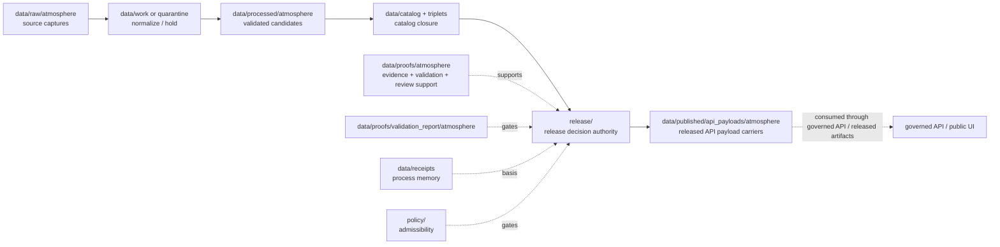

<!-- [KFM_META_BLOCK_V2]
doc_id: kfm://data/published/api-payloads/atmosphere/readme
title: data/published/api_payloads/atmosphere README
type: directory-readme
version: v0.1
status: draft
owners:
  - TODO(owner): data steward
  - TODO(owner): atmosphere domain steward
  - TODO(owner): API steward
  - TODO(owner): publication steward
  - TODO(owner): release steward
created: 2026-06-25
updated: 2026-06-25
policy_label: public-review
path: data/published/api_payloads/atmosphere/README.md
related:
  - ../README.md
  - ../../README.md
  - ../../layers/atmosphere/README.md
  - ../../../raw/atmosphere/README.md
  - ../../../work/atmosphere/README.md
  - ../../../quarantine/atmosphere/README.md
  - ../../../processed/atmosphere/README.md
  - ../../../catalog/domain/atmosphere/README.md
  - ../../../triplets/atmosphere/README.md
  - ../../../proofs/atmosphere/README.md
  - ../../../proofs/proof_pack/atmosphere/README.md
  - ../../../proofs/validation_report/atmosphere/README.md
  - ../../../receipts/README.md
  - ../../../../release/README.md
  - ../../../../docs/domains/atmosphere/ARCHITECTURE.md
  - ../../../../docs/domains/atmosphere/DATA_LIFECYCLE.md
  - ../../../../docs/doctrine/directory-rules.md
  - ../../../../docs/doctrine/lifecycle-law.md
  - ../../../../docs/doctrine/trust-membrane.md
  - ../../../../contracts/README.md
  - ../../../../schemas/README.md
  - ../../../../policy/README.md
notes:
  - "Directory README for released Atmosphere API payload carriers under data/published/api_payloads/. It replaces an empty file."
  - "This lane stores release-linked API payload snapshots or payload packages only after release gates pass. It is not itself the governed API, release authority, proof authority, catalog authority, schema authority, or policy authority."
  - "Atmosphere payloads must preserve knowledge-character labels and fail closed on AQI/concentration, AOD/PM2.5, model/observation, stale-state, advisory, and low-cost-sensor caveat failures."
[/KFM_META_BLOCK_V2] -->

<a id="top"></a>

# `data/published/api_payloads/atmosphere/`

> Published API-payload lane for **released, public-safe Atmosphere / Air payload carriers**. Files here should be immutable, release-linked API payload snapshots or payload packages that public clients may consume only through governed release/API rules.


> [!IMPORTANT]
> **Status:** `draft`  
> **Owners:** `TODO(owner): data steward` · `TODO(owner): atmosphere domain steward` · `TODO(owner): API steward` · `TODO(owner): publication steward` · `TODO(owner): release steward`  
> **Path:** `data/published/api_payloads/atmosphere/README.md`  
> **Truth posture:** CONFIRMED target path and Atmosphere lifecycle/docs from current repo evidence / PROPOSED child layout and instance naming / NEEDS VERIFICATION for emitted payloads, schemas, validators, release manifests, CI checks, and governed API routes.

> [!WARNING]
> This directory does **not** approve publication. API payload files belong here only after release authority exists under `release/`, evidence and catalog closure are complete, validation gates pass, policy state is recorded, and rollback/correction paths are available.

---

## Quick jumps

| Section | Use it for |
|---|---|
| [1. Scope](#1-scope) | What this lane is for. |
| [2. Repo fit](#2-repo-fit) | How this path relates to lifecycle and release authority. |
| [3. Accepted payloads](#3-accepted-payloads) | What may live here after release. |
| [4. Exclusions](#4-exclusions) | What must stay out. |
| [5. Publication gates](#5-publication-gates) | Minimum support before a payload lands here. |
| [6. Atmosphere payload rules](#6-atmosphere-payload-rules) | Domain-specific API payload guardrails. |
| [7. Suggested layout](#7-suggested-layout) | Proposed child structure and naming. |
| [8. Lifecycle relationship](#8-lifecycle-relationship) | RAW → PUBLISHED placement. |
| [9. Maintenance checklist](#9-maintenance-checklist) | Checks before adding or changing payloads. |
| [10. Definition of done](#10-definition-of-done) | What remains before maturity. |

---

## 1. Scope

`data/published/api_payloads/atmosphere/` is the published carrier lane for release-approved Atmosphere API payload snapshots and payload packages.

Use this lane for payloads that are:

- already tied to a `ReleaseManifest` or equivalent release authority;
- public-safe for the declared audience;
- traceable to EvidenceBundles, catalog records, validation reports, policy decisions, and rollback targets;
- shaped for governed API or public UI consumption; and
- explicit about knowledge character, time scope, freshness, stale state, source role, caveats, and correction status.

This lane is downstream of release. It should not contain source captures, working candidates, quarantine material, processed candidates, catalog drafts, proof objects, receipts, schema files, policy rules, release decisions, or direct model output.

[Back to top](#top)

---

## 2. Repo fit

| Neighbor | Role | Boundary |
|---|---|---|
| [`../../../raw/atmosphere/`](../../../raw/atmosphere/) | Source captures. | Never public-readable. |
| [`../../../work/atmosphere/`](../../../work/atmosphere/) | Normalization workspace. | Never public-readable. |
| [`../../../quarantine/atmosphere/`](../../../quarantine/atmosphere/) | Held or unsafe material. | Never public-readable. |
| [`../../../processed/atmosphere/`](../../../processed/atmosphere/) | Validated normalized candidates. | Upstream of catalog and release, not public by itself. |
| [`../../../catalog/domain/atmosphere/`](../../../catalog/domain/atmosphere/) | Atmosphere catalog records. | Discovery/lineage carrier, not release authority. |
| [`../../../triplets/atmosphere/`](../../../triplets/atmosphere/) | Atmosphere graph/triplet projection. | Projection support, not direct public payload authority. |
| [`../../../proofs/atmosphere/`](../../../proofs/atmosphere/) | Atmosphere proof support. | Evidence and proof support, not a published payload. |
| [`../../../proofs/validation_report/atmosphere/`](../../../proofs/validation_report/atmosphere/) | Atmosphere validation outcomes. | May gate release, but not itself a payload. |
| [`../../../receipts/`](../../../receipts/) | Process memory. | Receipts say what ran; they do not publish. |
| [`../../../../release/`](../../../../release/) | Release decisions, manifests, correction, withdrawal, rollback, signatures. | Publication authority lives here. |
| [`../../../../contracts/`](../../../../contracts/) | Semantic meaning. | Payloads conform to contracts; they do not define them. |
| [`../../../../schemas/`](../../../../schemas/) | Machine shape. | Payloads validate against schemas; schemas live elsewhere. |
| [`../../../../policy/`](../../../../policy/) | Admissibility. | Payloads carry policy outcome refs; policy logic lives elsewhere. |

> [!NOTE]
> `data/published/api_payloads/README.md` is still a greenfield parent stub at time of authoring. This README documents the atmosphere sublane without claiming the parent published API-payload contract is complete.

[Back to top](#top)

---

## 3. Accepted payloads

Use this directory only for release-linked, public-safe API payload carriers.

| Payload type | Suggested placement | Required support |
|---|---|---|
| Released endpoint snapshot | `endpoints/<release_id>/<endpoint_slug>.json` | ReleaseManifest, schema validation, EvidenceBundle refs, policy state, rollback target. |
| Released Evidence Drawer payload | `evidence_drawer/<release_id>/<payload_slug>.json` | EvidenceBundle refs, citation validation, validation report, release refs. |
| Released Focus Mode payload | `focus_mode/<release_id>/<payload_slug>.json` | Release refs, AIReceipt where applicable, EvidenceBundle refs, finite outcome posture. |
| Released map-popup payload | `map_popups/<release_id>/<payload_slug>.json` | Source-role labels, freshness/stale state, release refs, correction path. |
| Released advisory-context payload | `advisory_context/<release_id>/<payload_slug>.json` | Official-source redirect, issue/expiry time, no life-safety instruction replacement. |
| Released payload index | `indexes/atmosphere-api-payload-index.json` | Points to release-approved payloads only. |
| Superseded payload | `retired/<release_id>/<payload_slug>.json` | Supersession, correction, withdrawal, or rollback reference. |

[Back to top](#top)

---

## 4. Exclusions

| Excluded material | Correct home |
|---|---|
| RAW source payloads, sensor exports, model files, rasters, advisory text dumps, logs, or source-system dumps | `data/raw/atmosphere/` |
| Working candidates or failed validation material | `data/work/atmosphere/` or `data/quarantine/atmosphere/` |
| Processed normalized data | `data/processed/atmosphere/` |
| Catalog records or candidate catalog entries | `data/catalog/` |
| Triplets or graph projection data | `data/triplets/` |
| EvidenceBundle, ValidationReport, ProofPack, citation validation, or review proof | `data/proofs/` child lanes |
| Receipts | `data/receipts/` |
| ReleaseManifest, PromotionDecision, RollbackCard, CorrectionNotice, WithdrawalNotice, signatures | `release/` |
| Policy logic | `policy/` |
| Machine schemas | `schemas/` |
| Semantic contracts | `contracts/` |
| Emergency instructions, evacuation advice, routing advice, or life-safety directives | Official authorities outside this published payload lane |

[Back to top](#top)

---

## 5. Publication gates

Before an Atmosphere API payload is placed here, verify:

- release authority exists under `release/`;
- every consequential claim resolves to EvidenceBundle support;
- schema validation and Atmosphere validation reports pass or hold/deny with finite reasons;
- catalog closure exists for the payload or its source artifact;
- policy decisions allow the target audience class;
- source role and knowledge-character labels are preserved;
- freshness, stale-state, issue/expiry, observed/valid/model-run/retrieval/release times are recorded where material;
- low-cost sensor caveats, advisory redirects, model-field labels, and remote-sensing labels are present where required;
- correction and rollback targets are traceable; and
- payload digests or integrity refs bind the file to the release record.

If any gate is unresolved, hold the payload upstream. Do not place it here as a shortcut.

[Back to top](#top)

---

## 6. Atmosphere payload rules

| Rule | Public payload posture |
|---|---|
| AQI is not concentration | Payloads must not represent AQI buckets as measured concentration values. |
| AOD is not PM2.5 | Payloads must label AOD and satellite-derived products as their actual knowledge character. |
| Model fields are not observations | Forecast/model payloads must remain model/context payloads. |
| Low-cost sensors require caveats | Public payloads need correction, caveats, confidence, and limitations before release. |
| Advisory context redirects | Payloads may carry official-source context and links/refs, not replacement life-safety instructions. |
| Stale state must be visible | Current-context payloads must show freshness or stale-state posture. |
| Cross-lane handoffs preserve source role | Downstream Hazards, Agriculture, Hydrology, Roads, Flora/Fauna/Habitat, and Focus Mode uses must preserve Atmosphere release state and evidence support. |
| AI is not root truth | AI summaries can consume released payloads but cannot replace EvidenceBundles, validation, release, or citations. |

[Back to top](#top)

---

## 7. Suggested layout

```text
data/published/api_payloads/atmosphere/
├── README.md
├── endpoints/
│   └── <release_id>/
├── evidence_drawer/
│   └── <release_id>/
├── focus_mode/
│   └── <release_id>/
├── map_popups/
│   └── <release_id>/
├── advisory_context/
│   └── <release_id>/
├── indexes/
│   └── atmosphere-api-payload-index.json
└── retired/
    └── <release_id>/
```

Suggested deterministic file name:

```text
atmosphere.published.api_payload.<payload_family>.<scope>.<release_id>.<short_hash>.json
```

Examples:

```text
atmosphere.published.api_payload.endpoint.pm25-hourly.release-20260625.0123abcd.json
atmosphere.published.api_payload.evidence_drawer.smoke-context.release-20260625.89ab4567.json
atmosphere.published.api_payload.map_popup.aqi-summary.release-20260625.4567cdef.json
```

This layout is PROPOSED until validated by contracts, schemas, fixtures, and release tooling.

[Back to top](#top)

---

## 8. Lifecycle relationship



Published API payloads are downstream carriers. Release state is governed by release records, not by path alone.

[Back to top](#top)

---

## 9. Maintenance checklist

Before adding or changing a payload under this lane, verify:

- [ ] The payload is release-approved and public-safe for the intended audience.
- [ ] The release record exists under `release/` and points to this payload.
- [ ] The payload has EvidenceBundle, catalog, validation, policy, review, receipt, correction, and rollback refs where required.
- [ ] Source role, knowledge character, time scope, freshness, and stale state are preserved.
- [ ] Advisory payloads do not replace official life-safety instructions.
- [ ] Low-cost sensor, model, AOD, AQI, and derived-fusion payloads carry correct caveats and labels.
- [ ] The payload does not duplicate RAW, WORK, QUARANTINE, PROCESSED, proof, receipt, catalog, schema, contract, policy, or release authority.
- [ ] The payload has a digest or integrity reference.
- [ ] Public clients consume it through governed interfaces or approved released artifact paths.

[Back to top](#top)

---

## 10. Definition of done

This lane is operationally mature when:

- [ ] `data/published/api_payloads/README.md` defines the parent API-payload published-data contract.
- [ ] Atmosphere API payload contracts and schemas exist under approved homes.
- [ ] Release tooling writes or verifies payloads only after release authority is present.
- [ ] Validators block missing EvidenceBundles, missing release refs, missing rollback, source-role collapse, AQI/concentration confusion, AOD/PM2.5 confusion, model/observation confusion, missing low-cost-sensor caveats, missing advisory redirect, and stale-state ambiguity.
- [ ] Valid and invalid fixtures cover endpoint, Evidence Drawer, Focus Mode, map popup, advisory context, correction, supersession, and rollback payloads.
- [ ] Governed API or released-artifact routes are documented and tested.
- [ ] A synthetic no-network Atmosphere release demonstrates raw source → processed candidate → catalog/proof closure → release manifest → published API payload → governed API/public UI → correction/rollback traceability.

---

## Maintainer note

Published Atmosphere API payloads can look authoritative because users consume them directly through interfaces. Keep them boring, citable, label-rich, caveat-rich, freshness-aware, and reversible. If evidence, source role, validation, policy, release, correction, or rollback support is incomplete, keep the payload upstream instead of placing it here.
