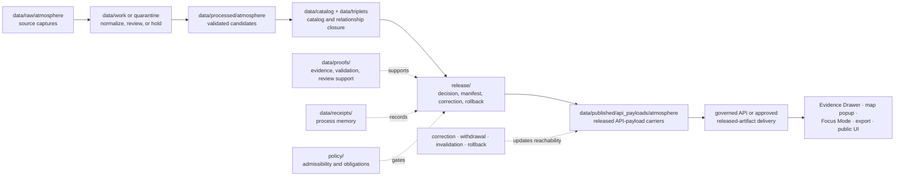

<!-- [KFM_META_BLOCK_V2]
doc_id: kfm://data/published/api-payloads/atmosphere/readme
title: data/published/api_payloads/atmosphere/ — Released Atmosphere API-Payload Carriers
type: directory-readme
subtype: nested-published-api-payload-domain-lane
version: v0.2.0
status: repository-grounded draft; payload, schema, validator, release, and runtime enforcement unverified
owners:
  - "NEEDS VERIFICATION — data publication steward"
  - "NEEDS VERIFICATION — Atmosphere / Air domain steward"
  - "NEEDS VERIFICATION — governed API steward"
  - "NEEDS VERIFICATION — policy, evidence, and validation steward"
  - "NEEDS VERIFICATION — release, correction, and rollback steward"
created: 2026-06-25
updated: 2026-07-25
policy_label: public-review; no-direct-public-path; release-gated; advisory-referral-only
path: data/published/api_payloads/atmosphere/README.md
truth_posture: >
  CONFIRMED exact target path, prior blob, current published-data and API-payload
  parent contracts, Directory Rules, linked Atmosphere doctrine, and the existing
  Atmosphere decision-envelope schema scaffold / PROPOSED release-local payload
  profile and support dimensions / UNKNOWN recursive payload inventory, active
  writers and consumers, governed routes, release instances, validators, CI,
  hosting, and public runtime effects / NEEDS VERIFICATION accountable owners,
  accepted payload shape, schema completion, policy enforcement, correction
  propagation, cache invalidation, and rollback drills
evidence_snapshot:
  repository: bartytime4life/Kansas-Frontier-Matrix
  base_ref: main
  base_commit: f1a0cc842f611dfeccc23b79013f23069d230f0b
  prior_blob: c855b9475738df4b1b88acd9d444db37712aa03b
  directory_rules_blob: 2affb080e6f0043867c64c7f06c1ca52030fbd55
  published_parent_blob: 8ecb5d2f9737349fb6569efbde36659f398de151
  api_payload_parent_blob: 757be8caaf087781898a7ef0c4399ae276299d4c
  atmosphere_layers_blob: d0d85689ef581961734fc50b375f6b5d95e83188
  atmosphere_api_contracts_blob: d8429021508b54904d9e4c7b88438ac2c21794ee
  atmosphere_publication_posture_blob: c06e77d9e046e4da71147b119d05cf45dd0f8b4d
  atmosphere_schema_index_blob: 1165bd4719fff2c17ce4e7f5253fa8af8315f333
  decision_envelope_schema_blob: 28b217bb32b4a7d8935dc76715ad2f3a7eee2c47
related:
  - ../README.md
  - ../../README.md
  - ../../atmosphere/README.md
  - ../../layers/atmosphere/README.md
  - ../../../raw/atmosphere/README.md
  - ../../../work/atmosphere/README.md
  - ../../../quarantine/atmosphere/README.md
  - ../../../processed/atmosphere/README.md
  - ../../../catalog/domain/atmosphere/README.md
  - ../../../triplets/README.md
  - ../../../proofs/atmosphere/README.md
  - ../../../proofs/proof_pack/atmosphere/README.md
  - ../../../proofs/validation_report/atmosphere/README.md
  - ../../../receipts/README.md
  - ../../../../release/README.md
  - ../../../../docs/domains/atmosphere/API_CONTRACTS.md
  - ../../../../docs/domains/atmosphere/PUBLICATION_POSTURE.md
  - ../../../../docs/domains/atmosphere/ARCHITECTURE.md
  - ../../../../docs/domains/atmosphere/DATA_LIFECYCLE.md
  - ../../../../docs/runbooks/atmosphere/PROMOTION_RUNBOOK.md
  - ../../../../docs/runbooks/atmosphere/ROLLBACK_RUNBOOK.md
  - ../../../../docs/doctrine/directory-rules.md
  - ../../../../docs/adr/INDEX.md
  - ../../../../contracts/domains/atmosphere/README.md
  - ../../../../schemas/contracts/v1/domains/atmosphere/README.md
  - ../../../../schemas/contracts/v1/domains/air/README.md
  - ../../../../policy/README.md
notes:
  - "Same-path Markdown modernization only; no payload bytes, source state, release state, route, workflow, hosting, or KFM publication state changed."
  - "The parent API-payload contract now exists and is linked; the prior statement that it remained a greenfield stub was removed."
  - "The unresolved data/triplets/atmosphere child link was replaced with the verified data/triplets parent and an explicit verification boundary."
  - "The verified Atmosphere decision-envelope schema remains a permissive PROPOSED scaffold; this README does not present it as a field-complete payload contract."
[/KFM_META_BLOCK_V2] -->

<a id="top"></a>

# `data/published/api_payloads/atmosphere/` — Released Atmosphere API-payload carriers

> **One-line purpose.** Own release-approved, public-safe Atmosphere / Air API-payload snapshots and packages that are consumed through governed interfaces or approved released-artifact paths.

[](#status)
[](#authority-level)
[](#outputs)
[](#atmosphere-payload-guardrails)
[](#inputs)
[](#validation)

> [!IMPORTANT]
> Directory placement, a payload file, a successful check, a commit, a pull request, or a merge does **not** create KFM publication. Release decisions, correction, withdrawal, signatures, and rollback authority remain under [`release/`](../../../../release/README.md).

> [!CAUTION]
> KFM Atmosphere / Air is **not an emergency-alert or life-safety authority**. Advisory-context payloads are referral-only: they may preserve official-source context and a governed redirect, but they must not replace, paraphrase as commands, or compete with official life-safety instructions.

**Quick navigation:** [Purpose](#purpose) · [Authority](#authority-level) · [Status](#status) · [Belongs](#what-belongs-here) · [Exclusions](#what-does-not-belong-here) · [Inputs](#inputs) · [Outputs](#outputs) · [Validation](#validation) · [Review](#review-burden) · [Related](#related-folders) · [ADRs](#adrs) · [Last reviewed](#last-reviewed) · [Routing](#payload-family-routing) · [Outcomes](#finite-outcomes-and-public-behavior) · [Guardrails](#atmosphere-payload-guardrails) · [Profile](#proposed-release-local-profile) · [Lifecycle](#lifecycle-relationship) · [Definition of done](#definition-of-done) · [Verification](#open-verification-register) · [No-loss](#no-loss-ledger)

---

<a id="1-scope"></a>

## Purpose

`data/published/api_payloads/atmosphere/` is the Atmosphere domain lane inside the parent [`data/published/api_payloads/`](../README.md) artifact family. Its bounded role is to hold immutable, release-linked, public-safe API-shaped carriers after the applicable evidence, catalog, validation, policy, review, correction, and rollback gates close.

The complete trust path remains:

```text
RAW -> WORK / QUARANTINE -> PROCESSED -> CATALOG / TRIPLET
    -> RELEASE DECISION -> PUBLISHED API-PAYLOAD CARRIER
    -> GOVERNED API / APPROVED RELEASED-ARTIFACT DELIVERY
```

This directory is **not** the live governed API. It stores released snapshots or packages that a governed API, Evidence Drawer, map popup, Focus Mode surface, export process, report, or public UI may consume. The payload bytes remain downstream carriers; they do not replace source records, domain objects, `EvidenceBundle` support, policy decisions, review records, proofs, receipts, catalog records, release manifests, corrections, withdrawals, or rollback authority.

[Back to top](#top)

---

<a id="2-repo-fit"></a>

## Authority level

**PUBLISHED responsibility; API-payload carrier-only authority.**

| Question | Bounded answer |
|---|---|
| Owning responsibility | `data/`, lifecycle phase `published/`, artifact family `api_payloads/`, domain segment `atmosphere`. |
| What this README may define | The lane's documentation boundary, expected support, public-safety posture, and proposed release-local organization. |
| What it must not define | Source authority, object meaning, machine shape, policy, review approval, release approval, route behavior, hosting, correction authority, or rollback execution. |
| Normal public path | Governed API or an approved, release-resolved static delivery path. |
| Current parent contract | **CONFIRMED** at [`../README.md`](../README.md). |
| Atmosphere child-triplet path | **NEEDS VERIFICATION.** This README links the verified [`data/triplets/`](../../../triplets/README.md) parent and does not invent a child lane. |
| Failure posture | Keep material upstream or return the finite outcome required by the governing surface: `ABSTAIN`, `DENY`, `ERROR`, `HOLD`, or `RESTRICT`. |

The path exists in the pinned repository. Its existence does not prove payload instances, field-complete schemas, release approval, validator enforcement, governed routes, hosting, or public readiness.

[Back to top](#top)

---

## Status

| Item | Current bounded result |
|---|---|
| Target | `data/published/api_payloads/atmosphere/README.md` |
| Document version | `v0.2.0` |
| Base evidence | `main@f1a0cc842f611dfeccc23b79013f23069d230f0b` |
| Prior blob | `c855b9475738df4b1b88acd9d444db37712aa03b` |
| Published-data parent | **CONFIRMED** at [`../../README.md`](../../README.md) |
| API-payload parent | **CONFIRMED** at [`../README.md`](../README.md) |
| Atmosphere layer sibling | **CONFIRMED** at [`../../layers/atmosphere/README.md`](../../layers/atmosphere/README.md) |
| Atmosphere API contract map | **CONFIRMED document; implementation claims remain bounded** at [`API_CONTRACTS.md`](../../../../docs/domains/atmosphere/API_CONTRACTS.md) |
| Atmosphere schema lane | **PROPOSED / scaffold maturity** at [`schemas/contracts/v1/domains/atmosphere/`](../../../../schemas/contracts/v1/domains/atmosphere/README.md) |
| Air schema lane | **Compatibility/index only; canonical status NEEDS VERIFICATION** at [`schemas/contracts/v1/domains/air/`](../../../../schemas/contracts/v1/domains/air/README.md) |
| Verified decision-envelope schema | Exists, but remains a permissive `PROPOSED` scaffold with no field-complete payload contract proven |
| Recursive payload inventory | **UNKNOWN** |
| Active writers and consumers | **UNKNOWN** |
| Release, validator, CI, hosting, and governed-runtime enforcement | **UNKNOWN** |
| Public readiness | **DENY BY DEFAULT** until release-specific support closes |
| Effect of this revision | Markdown only; no payload, source, lifecycle, route, release, hosting, or publication state changed |

[Back to top](#top)

---

<a id="3-accepted-payloads"></a>

## What belongs here

Only release-approved, public-safe Atmosphere API-payload carriers belong here.

| Payload family | Proposed release-local placement | Minimum boundary |
|---|---|---|
| Endpoint snapshot | `endpoints/<release_id>/<endpoint_slug>.json` | Release identity, schema result, evidence refs, policy state, integrity, correction, rollback. |
| Evidence Drawer payload | `evidence_drawer/<release_id>/<payload_slug>.json` | `EvidenceBundle` resolution, citations, source roles, validation, policy, release state. |
| Focus Mode payload | `focus_mode/<release_id>/<payload_slug>.json` | Finite outcome, released evidence scope, citations, policy result, `AIReceipt` where applicable. |
| Map-popup payload | `map_popups/<release_id>/<payload_slug>.json` | Source role, knowledge character, method, time scope, freshness, caveats, release ref. |
| Advisory-context payload | `advisory_context/<release_id>/<payload_slug>.json` | Official-authority identity, issue/expiry time, referral-only language, governed redirect, stale state. |
| Export payload | `exports/<release_id>/<payload_slug>.json` | Audience class, evidence, policy, review, release, attribution, integrity, correction. |
| Public summary payload | `public_summaries/<release_id>/<payload_slug>.json` | Public-safe fields, bounded claims, evidence refs, caveats, release and correction state. |
| Payload index | `indexes/atmosphere-api-payload-index.json` | Derived from release-approved payloads; navigation only, never release authority. |
| Retired or superseded payload | `retired/<release_id>/<payload_slug>.json` | Correction, withdrawal, supersession, stale, or rollback reference. |

Release-local README, inventory, digest, and disposition sidecars may explain the package when they remain derived from the governing release record and do not create parallel authority.

[Back to top](#top)

---

<a id="4-exclusions"></a>

## What does NOT belong here

| Do not place here | Correct home or action |
|---|---|
| RAW sensor responses, source exports, model files, rasters, advisory dumps, logs, or source-system mirrors | [`data/raw/atmosphere/`](../../../raw/atmosphere/README.md) |
| Working candidates, transformations, joins, or review drafts | [`data/work/atmosphere/`](../../../work/atmosphere/README.md) |
| Rights-unclear, role-unclear, malformed, sensitive, stale-without-policy, or otherwise held material | [`data/quarantine/atmosphere/`](../../../quarantine/atmosphere/README.md) |
| Validated but unreleased normalized domain objects | [`data/processed/atmosphere/`](../../../processed/atmosphere/README.md) |
| Catalog records | [`data/catalog/domain/atmosphere/`](../../../catalog/domain/atmosphere/README.md) |
| Triplets or graph projections | [`data/triplets/`](../../../triplets/README.md); Atmosphere child lane remains unverified |
| `EvidenceBundle`, `ProofPack`, validation proof, citation proof, or review proof | [`data/proofs/atmosphere/`](../../../proofs/atmosphere/README.md) and scoped proof lanes |
| Transform, validation, model, representation, AI, release, or publication receipts | [`data/receipts/`](../../../receipts/README.md) |
| Release manifests, promotion decisions, signatures, corrections, withdrawals, or rollback cards | [`release/`](../../../../release/README.md) |
| Semantic contracts | [`contracts/domains/atmosphere/`](../../../../contracts/domains/atmosphere/README.md) |
| Machine schemas | [`schemas/contracts/v1/domains/atmosphere/`](../../../../schemas/contracts/v1/domains/atmosphere/README.md) |
| Policy logic | [`policy/`](../../../../policy/README.md) |
| Unreviewed model output, uncited AI prose, or direct provider responses | Governed evidence and AI-envelope paths before release |
| Emergency instructions, evacuation guidance, routing advice, or life-safety directives | Official authorities outside this KFM carrier lane |
| A hand-edited mutable `current` or `latest` alias | Use only an accepted alias/release profile with atomic update, invalidation, receipt, correction, and rollback controls |

[Back to top](#top)

---

<a id="5-publication-gates"></a>

## Inputs

Every admitted payload needs a release-specific support packet appropriate to its significance.

| Support dimension | Minimum expectation |
|---|---|
| Identity and integrity | Stable payload identity, release identity, deterministic or governed locator, content digest, and integrity binding. |
| Source and evidence | Resolved source descriptors, source roles, `EvidenceRef` / `EvidenceBundle` support, citations, and limitations. |
| Space and time | Spatial scope, observation or valid time, model-run time where applicable, retrieval time, release time, issue/expiry time, freshness, and stale-state rule. |
| Meaning and shape | Accepted semantic contract and field-complete schema appropriate to the payload family, or a finite hold/deny when unavailable. |
| Policy and review | Audience class, rights, sensitivity, source terms, policy decision, obligations, and independent review where required. |
| Catalog, proof, and receipts | Catalog closure, validation/proof support, and process receipts without collapsing those object families into the payload. |
| Correction and rollback | Correction, withdrawal, supersession, invalidation, and rollback targets traceable to the governing release. |
| Atmosphere disclosure | Knowledge character, method, units, averaging or accumulation window, uncertainty/confidence, caveats, official-authority boundary, and cross-lane ownership where material. |

If any required dimension is unresolved, keep the candidate upstream. A copied file, a valid JSON parse, or a passing Markdown check is not an admission decision.

[Back to top](#top)

---

## Outputs

This lane emits or supports **released API-payload carriers**, not release decisions or runtime truth.

Accepted downstream uses include:

- governed API responses backed by a release-resolved payload;
- Evidence Drawer projections;
- map-popup and layer-context projections;
- bounded Focus Mode responses;
- reviewed exports and public summaries;
- reports, stories, and UI components that preserve evidence, policy, release, stale, correction, and rollback cues.

Public clients must not read RAW, WORK, QUARANTINE, unreleased PROCESSED, proof, receipt, or canonical/internal stores as a substitute for the governed interface. A payload may carry references to those authority objects; it must not embed restricted authority content merely for convenience.

[Back to top](#top)

---

<a id="9-maintenance-checklist"></a>

## Validation

### Current verified boundary

- The parent published-data and API-payload README contracts exist.
- Atmosphere semantic-contract and schema index lanes exist.
- The verified `atmosphere_air_decision_envelope.schema.json` is a permissive `PROPOSED` scaffold with empty field definitions; it does **not** prove a production payload shape.
- No complete Atmosphere API-payload validator, fixture suite, release instance, governed route, CI enforcement, or runtime consumer was verified in this task.

### Required checks before payload admission

- [ ] JSON or other serialization parses and validates against the accepted, field-complete schema.
- [ ] Payload family and finite outcome conform to the governing semantic contract.
- [ ] Every consequential claim resolves to admissible evidence and citations.
- [ ] Source role and knowledge character remain explicit and do not collapse.
- [ ] Spatial, temporal, freshness, issue/expiry, and stale-state semantics are complete.
- [ ] Rights, terms, audience, sensitivity, and policy obligations are satisfied.
- [ ] AQI/concentration, AOD/PM2.5, model/observation, and low-cost-sensor distinctions hold.
- [ ] Advisory context remains referral-only and cannot be interpreted as KFM life-safety guidance.
- [ ] Catalog, proof, receipt, review, release, correction, withdrawal, invalidation, and rollback references close.
- [ ] Digest or integrity evidence binds the payload bytes to the release record.
- [ ] Restricted fields, credentials, private endpoints, unsafe logs, and harmful precision are absent.
- [ ] Relative links, fragments, tables, alerts, code fences, HTML anchors, Mermaid source, and final newline validate for this README.

A validator pass proves only the validator's declared scope. It does not prove rights clearance, evidence sufficiency, public safety, release approval, or KFM publication.

[Back to top](#top)

---

## Review burden

Accountable ownership remains **NEEDS VERIFICATION**. Changes should route to the following roles as applicable:

- data publication steward;
- Atmosphere / Air domain steward;
- governed API steward;
- evidence and validation steward;
- policy, rights, and sensitivity steward;
- security or privacy reviewer when exposure risk changes;
- release, correction, withdrawal, invalidation, and rollback steward.

A Markdown-only boundary clarification does not approve payload bytes. Payload, schema, contract, policy, source activation, route, public-serving, correction, or rollback changes require their own accountable review and governing evidence. CODEOWNERS routing is not approval evidence.

[Back to top](#top)

---

## Related folders

| Surface | Relationship |
|---|---|
| [`data/published/api_payloads/`](../README.md) | Parent API-payload carrier contract. |
| [`data/published/`](../../README.md) | Parent PUBLISHED artifact contract. |
| [`data/published/atmosphere/`](../../atmosphere/README.md) | Broader direct Atmosphere published-artifact lane. |
| [`data/published/layers/atmosphere/`](../../layers/atmosphere/README.md) | Released Atmosphere map-layer carriers. |
| [`data/raw/atmosphere/`](../../../raw/atmosphere/README.md) · [`work/`](../../../work/atmosphere/README.md) · [`quarantine/`](../../../quarantine/atmosphere/README.md) · [`processed/`](../../../processed/atmosphere/README.md) | Upstream lifecycle lanes. |
| [`data/catalog/domain/atmosphere/`](../../../catalog/domain/atmosphere/README.md) · [`data/triplets/`](../../../triplets/README.md) | Catalog and relationship projections; neither is release authority. |
| [`data/proofs/atmosphere/`](../../../proofs/atmosphere/README.md) · [`proof_pack/`](../../../proofs/proof_pack/atmosphere/README.md) · [`validation_report/`](../../../proofs/validation_report/atmosphere/README.md) | Evidence, proof-pack, and validation support. |
| [`data/receipts/`](../../../receipts/README.md) | Process memory; receipts do not publish. |
| [`release/`](../../../../release/README.md) | Release, correction, withdrawal, signature, and rollback authority. |
| [Atmosphere API contracts](../../../../docs/domains/atmosphere/API_CONTRACTS.md) · [publication posture](../../../../docs/domains/atmosphere/PUBLICATION_POSTURE.md) · [architecture](../../../../docs/domains/atmosphere/ARCHITECTURE.md) · [lifecycle](../../../../docs/domains/atmosphere/DATA_LIFECYCLE.md) | Domain documentation and bounded interface guidance. |
| [Promotion runbook](../../../../docs/runbooks/atmosphere/PROMOTION_RUNBOOK.md) · [rollback runbook](../../../../docs/runbooks/atmosphere/ROLLBACK_RUNBOOK.md) | Draft operational guidance; not proof that a release or rollback occurred. |
| [`contracts/domains/atmosphere/`](../../../../contracts/domains/atmosphere/README.md) | Semantic meaning. |
| [`schemas/contracts/v1/domains/atmosphere/`](../../../../schemas/contracts/v1/domains/atmosphere/README.md) | Proposed Atmosphere machine-shape lane. |
| [`schemas/contracts/v1/domains/air/`](../../../../schemas/contracts/v1/domains/air/README.md) | Compatibility/index lane; must not evolve into a second schema authority without a decision. |
| [`policy/`](../../../../policy/README.md) | Admissibility and obligations. |
| [Directory Rules](../../../../docs/doctrine/directory-rules.md) · [ADR index](../../../../docs/adr/INDEX.md) | Placement doctrine and decision inventory. |

[Back to top](#top)

---

## ADRs

Relevant recorded or proposed decisions include:

- ADR-0001 — schema home;
- ADR-0011 — receipt, proof, manifest, and catalog separation;
- ADR-0015 — governed published aliases and rollback split;
- ADR-0025 — public clients do not read internal stores.

See the current [ADR index](../../../../docs/adr/INDEX.md) for status and exact titles. This README accepts none, changes none, and does not use a proposed ADR as current authority. A topology, alias, release-state, or parallel-authority change requires the applicable accepted decision, migration plan, and rollback path.

[Back to top](#top)

---

## Last reviewed

- **Date:** 2026-07-25
- **Evidence boundary:** `main@f1a0cc842f611dfeccc23b79013f23069d230f0b`
- **Review method:** complete target read; current Directory Rules; parent published-data/API-payload contracts; adjacent Atmosphere layer, API-contract, publication-posture, contract, schema, proof, receipt, promotion, and rollback documentation
- **Not performed:** recursive payload inventory, local checkout, test execution, workflow-log review, route/runtime inspection, hosting inspection, release-instance verification, or rollback drill
- **Owners and independent review:** NEEDS VERIFICATION

Re-review on payload-family, schema, contract, policy, route, writer, consumer, release, hosting, correction, invalidation, or rollback changes—or within six months.

[Back to top](#top)

---

## Payload-family routing

| Question | Route |
|---|---|
| Is the object an API-shaped, release-linked snapshot or package? | This lane, after all gates close. |
| Is it a map-layer byte package or layer-local sidecar? | [`data/published/layers/atmosphere/`](../../layers/atmosphere/README.md). |
| Is it a broader Atmosphere artifact not assigned to a specialized family? | [`data/published/atmosphere/`](../../atmosphere/README.md), subject to that lane's contract. |
| Is it a proof, receipt, catalog record, policy decision, schema, contract, or release decision? | Its owning authority root, never this lane. |
| Is support incomplete or the material rights/sensitivity/role unclear? | WORK or QUARANTINE; do not copy here. |
| Is it corrected, withdrawn, superseded, or rolled back? | Preserve governing release history and use the release-resolved `retired/` profile or remove public reachability according to the correction/rollback decision. |

[Back to top](#top)

---

## Finite outcomes and public behavior

Atmosphere governed surfaces use the finite outcome vocabulary defined by their applicable contracts. The common API/AI-facing surface is:

| Outcome | Payload behavior |
|---|---|
| `ANSWER` | Carry a bounded result supported by released evidence, citations, policy, review, and release state. |
| `ABSTAIN` | Explain that evidence, time/space support, citation closure, or scope is insufficient; do not substitute generated prose. |
| `DENY` | Withhold restricted, rights-blocked, sensitivity-blocked, harmful-precision, or life-safety-inappropriate content and preserve reason codes or obligations appropriate to the audience. |
| `ERROR` | Report an operational failure without falling back to unsafe or uncited content. |

Validator or release surfaces may additionally use their own defined values such as `PASS`, `FAIL`, `HOLD`, `ALLOW`, or `RESTRICT`. Do not silently standardize those vocabularies in a payload README.

[Back to top](#top)

---

<a id="6-atmosphere-payload-rules"></a>

## Atmosphere payload guardrails

| Guardrail | Public API-payload posture |
|---|---|
| AQI is not concentration | Never encode an AQI category or index value as a measured pollutant concentration. Preserve pollutant basis and averaging period. |
| AOD is not PM2.5 | Keep aerosol optical depth and satellite-derived products labeled as remote-sensing or modeled context, not ground-level particulate observations. |
| Model fields are not observations | Preserve model identity, cycle/run, valid time, uncertainty, and model role. Do not relabel forecasts or modeled fields as observed truth. |
| Low-cost sensors require caveats | Public payloads require the applicable correction method, caveats, confidence/limitations, calibration context, and review state. |
| Advisory context is referral-only | Preserve official issuer, issue/expiry time, authoritative reference, governed redirect, and a clear non-life-safety boundary. |
| Freshness and stale state are visible | Current-context payloads carry cadence-aware freshness or stale-state posture; silence is not freshness. |
| Knowledge character travels | Observation, regulatory archive, low-cost sensor, model field, remote-sensing mask, derived fusion, climate context, and advisory context remain distinguishable. |
| Cross-lane handoffs preserve ownership | Hazards, Agriculture, Hydrology, Roads, Flora, Fauna, Habitat, reports, exports, and Focus Mode retain Atmosphere source role, evidence, release, and caveat state. |
| AI remains evidence-subordinate | AI may interpret released payloads through governed envelopes; it cannot replace `EvidenceBundle`, policy, validation, citations, review, release, correction, or rollback. |

[Back to top](#top)

---

<a id="7-suggested-layout"></a>

## Proposed release-local profile

```text
data/published/api_payloads/atmosphere/
├── README.md
├── endpoints/
│   └── <release_id>/
├── evidence_drawer/
│   └── <release_id>/
├── focus_mode/
│   └── <release_id>/
├── map_popups/
│   └── <release_id>/
├── advisory_context/
│   └── <release_id>/
├── exports/
│   └── <release_id>/
├── public_summaries/
│   └── <release_id>/
├── indexes/
│   └── atmosphere-api-payload-index.json
└── retired/
    └── <release_id>/
```

Schematic deterministic filename:

```text
atmosphere.published.api_payload.<payload_family>.<scope>.<release_id>.<short_hash>.json
```

The profile and filename are **PROPOSED**. Angle-bracket tokens are placeholders, not concrete releases. Contracts, field-complete schemas, fixtures, validators, release tooling, and steward review must admit the profile before payload instances rely on it.

[Back to top](#top)

---

<a id="8-lifecycle-relationship"></a>

## Lifecycle relationship


```mermaid
flowchart LR
    RAW["data/raw/atmosphere<br/>source captures"] --> WQ["data/work or quarantine<br/>normalize, review, or hold"]
    WQ --> PROC["data/processed/atmosphere<br/>validated candidates"]
    PROC --> CAT["data/catalog + data/triplets<br/>catalog and relationship closure"]
    CAT --> REL["release/<br/>decision, manifest, correction, rollback"]
    REL --> PUB["data/published/api_payloads/atmosphere<br/>released API-payload carriers"]
    PUB --> API["governed API or approved<br/>released-artifact delivery"]
    API --> UI["Evidence Drawer · map popup ·<br/>Focus Mode · export · public UI"]

    PROOF["data/proofs/<br/>evidence, validation, review support"] -. supports .-> REL
    RECEIPT["data/receipts/<br/>process memory"] -. records .-> REL
    POLICY["policy/<br/>admissibility and obligations"] -. gates .-> REL
    CORR["correction · withdrawal · invalidation · rollback"] -. updates reachability .-> PUB
```

Text equivalent: source material moves through RAW, WORK or QUARANTINE, PROCESSED, catalog/triplet closure, and an accountable release decision before API-shaped carrier bytes reach this PUBLISHED lane. Proofs, receipts, and policy support the decision but remain separate object families. Public use proceeds through governed interfaces, while correction, withdrawal, invalidation, and rollback preserve visible lineage.

[Back to top](#top)

---

<a id="10-definition-of-done"></a>

## Definition of done

This lane is operationally mature only when all applicable items are supported by current evidence:

- [x] The published-data and API-payload parent README contracts exist.
- [ ] An accepted semantic contract defines each admitted Atmosphere payload family and finite outcome.
- [ ] Field-complete schemas replace or supersede permissive scaffolds through the accepted schema home.
- [ ] Valid, invalid, denied, abstained, stale, corrected, withdrawn, superseded, and rollback fixtures exist.
- [ ] Deterministic, no-network validators reject source-role collapse, missing evidence, missing release refs, unsafe fields, stale ambiguity, missing caveats, advisory-authority misuse, and broken correction/rollback linkage.
- [ ] Release tooling writes or verifies payloads only after accountable release authority exists.
- [ ] Governed API or approved released-artifact routes are documented, tested, and proven not to read internal lifecycle stores directly.
- [ ] Payload indexes derive from release state and cannot become a mutable publication shortcut.
- [ ] Correction, withdrawal, cache invalidation, supersession, and rollback behavior are tested.
- [ ] A synthetic no-network Atmosphere slice demonstrates source capture -> processed candidate -> catalog/proof closure -> release decision -> published payload -> governed consumer -> correction/rollback traceability.
- [ ] Accountable owners, independent reviewers, retention, hosting, and incident-response duties are assigned.

[Back to top](#top)

---

## Open verification register

| Item | Status | Required evidence |
|---|---:|---|
| Recursive payload and sidecar inventory | `UNKNOWN` | Pinned tree/listing, file types, LFS or external-store references, digests, rights/sensitivity review |
| Active writers and consumers | `UNKNOWN` | Connector, pipeline, release tool, governed API, UI, workflow, and deployment inventory |
| Accepted payload contracts and schemas | `NEEDS VERIFICATION` | Accepted semantic contracts, field-complete schemas, registry records, migration/compatibility decisions |
| Air vs. Atmosphere schema ownership | `NEEDS VERIFICATION` | ADR, steward decision, schema registry, and migration note preventing parallel authority |
| Fixtures, validators, and CI | `UNKNOWN` | Positive/negative fixture matrix, validator source, test names, workflow/job evidence, observed results |
| Release and evidence closure | `UNKNOWN` | ReleaseManifest, PromotionDecision/receipt, `EvidenceBundle`, proof, receipt, catalog, review, correction, rollback instances |
| Governed routes and runtime behavior | `UNKNOWN` | Route implementation, DTO binding, policy middleware, tests, runtime logs or emitted artifacts |
| Hosting, cache, and invalidation | `UNKNOWN` | Access controls, object-store/CDN configuration, cache headers, stale/correction propagation, withdrawal and rollback drills |
| Accountable ownership | `NEEDS VERIFICATION` | CODEOWNERS plus role assignment and independent review evidence |

Unknowns narrow claims and block higher-risk transitions; they do not invite plausible defaults.

[Back to top](#top)

---

## No-loss ledger

| Baseline element | Disposition in v0.2.0 |
|---|---|
| Stable path, `doc_id`, created date, and PUBLISHED API-payload identity | **KEEP** — preserved at the same path. |
| Carrier-only and release-gated boundary | **CLARIFY / ENRICH** — preserved and aligned with current parent contracts. |
| Scope, repo fit, accepted payloads, exclusions, gates, domain rules, layout, lifecycle, checklist, definition of done, maintainer guidance | **KEEP / REORGANIZE** — retained under the Directory Rules README contract and expanded where current evidence supports it. |
| Legacy numbered anchors `1-scope` through `10-definition-of-done` | **KEEP** — explicit compatibility anchors retained. |
| Six-badge orientation strip | **REPAIR** — converted to evidence destinations and bounded current claims. |
| Parent `data/published/api_payloads/README.md` described as a greenfield stub | **REPAIR** — current parent contract is now linked and treated as CONFIRMED. |
| Broken `data/triplets/atmosphere/README.md` reference | **REPAIR** — replaced by the verified parent `data/triplets/README.md`; child status remains NEEDS VERIFICATION. |
| Atmosphere-specialized `advisory_context/` family | **KEEP** — preserved with a stronger referral-only boundary. |
| Parent-standard `exports/` and `public_summaries/` families | **ENRICH** — added to align with the verified parent contract. |
| Concrete-looking example release IDs | **REPAIR** — replaced with explicitly schematic placeholders to avoid implying emitted releases. |
| Payload, route, schema, workflow, release, hosting, or public-state mutation | **NONE** — outside scope and not performed. |

### Change history

#### v0.2.0 — 2026-07-25

- normalized the README to the current Directory Rules folder contract while preserving legacy anchors;
- reconciled the lane with current published-data and API-payload parent contracts;
- repaired the stale parent-stub statement and unresolved Atmosphere triplet child link;
- bounded the existing decision-envelope schema as a permissive scaffold rather than a production contract;
- added evidence-backed payload routing, finite outcomes, review, verification, correction, invalidation, rollback, and no-loss controls;
- removed concrete-looking release examples and kept the release-local layout explicitly PROPOSED;
- changed Markdown only.

---

## Maintainer note

Published Atmosphere API payloads can look authoritative because users consume them directly through interfaces. Keep them compact, citable, source-role-aware, knowledge-character-aware, time-aware, stale-state-visible, caveat-rich, referral-safe, release-linked, integrity-bound, correction-ready, and reversible. When evidence, policy, validation, review, release, correction, or rollback support is incomplete, keep the candidate upstream instead of using this path to make it look published.

[Back to top](#top)
