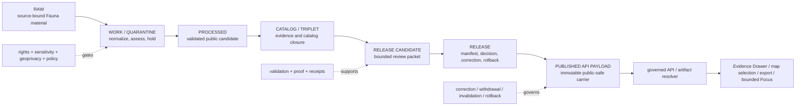

<!-- [KFM_META_BLOCK_V2]
doc_id: kfm://data/published/api-payloads/fauna/readme
title: data/published/api_payloads/fauna/ — Released Public-Safe Fauna API Payload Carriers
type: directory-readme
subtype: nested-published-api-payload-domain-lane
version: v0.2.0
status: repository-grounded draft; readiness hold; no verified payload instance, candidate, manifest, or route
owners:
  - "NEEDS VERIFICATION — data publication steward"
  - "NEEDS VERIFICATION — Fauna domain steward"
  - "NEEDS VERIFICATION — governed API steward"
  - "NEEDS VERIFICATION — sensitivity and geoprivacy reviewer"
  - "NEEDS VERIFICATION — release, correction, and rollback steward"
created: 2026-06-25
updated: 2026-07-25
policy_label: restricted-review; public-safe-only; no-direct-public-path; release-gated
path: data/published/api_payloads/fauna/README.md
truth_posture: >
  CONFIRMED exact target path, prior blob, parent API-payload lane, Fauna semantic
  contract and sensitivity/UI doctrine, permissive OccurrencePublic schema scaffold,
  bounded synthetic fixture validator and test slice, release-candidate readiness hold,
  and Fauna workflow boundaries / PROPOSED payload-family routing, envelope projection,
  release-local layout, and production validation profile / UNKNOWN payload instances,
  accepted DTO schemas, governed routes, runtime serving, emitted proofs, manifests,
  corrections, withdrawals, aliases, and public effects / NEEDS VERIFICATION accountable
  owners, accepted ADRs, source activation, production geoprivacy transforms, independent
  review, cache invalidation, and rollback drills
evidence_snapshot:
  repository: bartytime4life/Kansas-Frontier-Matrix
  base_ref: main
  base_commit: f1a0cc842f611dfeccc23b79013f23069d230f0b
  prior_blob: c5927bad28352d52278d15a2e54508fd5e997fb5
  parent_api_payloads_blob: 757be8caaf087781898a7ef0c4399ae276299d4c
  occurrence_public_contract_blob: d0c1481160b4979445a916915ff96d04d48f7033
  occurrence_public_schema_blob: 4d7d0f1b642b46c5a567561372b2443bb93b8ce8
  fauna_api_contracts_blob: b028842507676b4ce0fbb3a8b7aaddf1552e6ea6
  fauna_map_ui_contracts_blob: 821a5363f70f89ebf31530d8762fabb9c3ff6b04
  fauna_sensitivity_blob: 58c557cda55362345ac3869502910bc301ef5b8c
  fauna_validator_readme_blob: e80813e27a63109d2142481e3e0c5eef25eb6607
  fauna_tests_readme_blob: 72e93e4abcf48567942fb1a3a588944df1c83e3c
  fauna_release_candidate_readme_blob: 653277efe3a44a96c29af481a73d7d90c41443ce
  fauna_workflow_blob: 85b0a8b42f9af40366de2b0c7d733892d4220ee0
  directory_rules_blob: 2affb080e6f0043867c64c7f06c1ca52030fbd55
related:
  - ../README.md
  - ../../README.md
  - ../../fauna/README.md
  - ../../../raw/fauna/README.md
  - ../../../work/fauna/README.md
  - ../../../quarantine/fauna/README.md
  - ../../../processed/fauna/README.md
  - ../../../catalog/domain/fauna/README.md
  - ../../../triplets/README.md
  - ../../../proofs/fauna/README.md
  - ../../../receipts/README.md
  - ../../../../release/candidates/fauna/README.md
  - ../../../../release/README.md
  - ../../../../contracts/domains/fauna/occurrence_public.md
  - ../../../../schemas/contracts/v1/domains/fauna/occurrence_public.schema.json
  - ../../../../docs/domains/fauna/API_CONTRACTS.md
  - ../../../../docs/domains/fauna/MAP_UI_CONTRACTS.md
  - ../../../../docs/domains/fauna/SENSITIVITY.md
  - ../../../../tools/validators/domains/fauna/README.md
  - ../../../../tests/domains/fauna/README.md
  - ../../../../fixtures/domains/fauna/README.md
  - ../../../../.github/workflows/domain-fauna.yml
  - ../../../../docs/doctrine/directory-rules.md
  - ../../../../docs/adr/INDEX.md
notes:
  - "Same-path Markdown modernization only; no Fauna payload, source, contract, schema, policy, validator, fixture, workflow, route, release, alias, deployment, or publication state changed."
  - "The current accepted validator is limited to synthetic fixture safety and must not be represented as production OccurrencePublic or API-payload validation."
  - "The current OccurrencePublic schema is a permissive PROPOSED scaffold; this README does not promote it or define a replacement schema."
  - "No real taxon, occurrence, place, coordinate, URL destination, private-land detail, source payload, or sensitive transform parameter is introduced."
[/KFM_META_BLOCK_V2] -->

<a id="top"></a>

# `data/published/api_payloads/fauna/` — Released public-safe Fauna API payload carriers

> **One-line purpose.** Hold immutable, release-linked, public-safe Fauna API payload snapshots and packages after evidence, rights, sensitivity, policy, review, validation, release, correction, and rollback gates close.

[](#status)
[](#authority-level)
[](#what-belongs-here)
[](#fauna-public-payload-contract)
[](#outputs)
[](#validation)

> [!IMPORTANT]
> **Current repository evidence supports a readiness hold, not a published API surface.** This subtree has no verified payload instance beyond this README; the Fauna candidate lane establishes no child candidate, approved manifest, or published release; exact routes and DTOs remain proposed; and the paired `OccurrencePublic` schema is an empty, permissive scaffold.

> [!CAUTION]
> The accepted Fauna executable validates a closed **synthetic fixture-only** profile. It does **not** validate production `OccurrencePublic` objects, public API payloads, source admission, evidence closure, policy execution, geoprivacy transforms, review, release, correction, rollback, or publication.

> [!WARNING]
> Public payloads must never expose exact, aliased, or reconstructively precise sensitive locations; restricted identifiers or pointers; private-land or steward-controlled detail; suppressed original values; or transformation parameters that could enable reversal. Protection must occur before delivery—not through style, client filtering, omission by convention, or undocumented UI behavior.

**Quick navigation:** [Purpose](#purpose) · [Authority](#authority-level) · [Status](#status) · [Belongs](#what-belongs-here) · [Exclusions](#what-does-not-belong-here) · [Inputs](#inputs) · [Outputs](#outputs) · [Validation](#validation) · [Review](#review-burden) · [Related](#related-folders) · [ADRs](#adrs) · [Last reviewed](#last-reviewed) · [Routing](#payload-family-routing) · [Public contract](#fauna-public-payload-contract) · [Lifecycle](#lifecycle-relationship) · [Definition of done](#definition-of-done) · [No-loss](#no-loss-ledger)

---

<a id="1-scope"></a>

## Purpose

`data/published/api_payloads/fauna/` is the Fauna domain lane within the published API-payload artifact family.

Its responsibility is narrow:

- retain immutable, release-linked **public-safe payload carriers**;
- make released Fauna projections available to governed API, Evidence Drawer, map-selection, export, and bounded AI consumers;
- preserve the payload's evidence, source-role, temporal, sensitivity, policy, review, release, caveat, correction, and rollback references; and
- keep public delivery artifacts separate from canonical evidence, processed records, proofs, receipts, policy, release decisions, and runtime code.

This lane is downstream of the complete trust path:

```text
RAW -> WORK / QUARANTINE -> PROCESSED -> CATALOG / TRIPLET -> RELEASE -> PUBLISHED
```

A file path, payload-shaped JSON document, passing fixture check, commit, pull request, merge, deployment, or reachable endpoint does not create KFM publication.

[Back to top](#top)

---

<a id="2-repo-fit"></a>

## Authority level

**PUBLISHED artifact-family responsibility; carrier-only authority.**

| Question | Bounded answer |
|---|---|
| Owning responsibility root | `data/` |
| Lifecycle phase | `published/` |
| Artifact family | `api_payloads/` |
| Domain segment | `fauna/` |
| What this lane may carry | Release-approved public-safe API payload bytes and immediate delivery sidecars. |
| What this lane does not own | Fauna truth, taxonomic authority, source admission, contract meaning, schema shape, policy, sensitivity decisions, geoprivacy transforms, review, proof, receipt, release, correction, rollback, API routing, or publication authority. |
| Normal consumer path | Governed API or an approved release-resolved artifact service. |
| Direct public read from internal stores | Denied. |
| Current operational authority | None established beyond documentation of the lane boundary. |
| Default when support is incomplete | `ABSTAIN`, `DENY`, `ERROR`, `HOLD`, or non-delivery according to the governing contract or policy surface. |

The exact physical payload topology remains **PROPOSED**. Do not create child folders or live payloads solely to match this README.

[Back to top](#top)

---

## Status

| Item | Current bounded result |
|---|---|
| Target | `data/published/api_payloads/fauna/README.md` |
| Document version | `v0.2.0` |
| Evidence base | `main@f1a0cc842f611dfeccc23b79013f23069d230f0b` |
| Prior blob | `c5927bad28352d52278d15a2e54508fd5e997fb5` |
| Parent API-payload lane | **CONFIRMED** at [`../README.md`](../README.md); still a draft placement contract. |
| Bounded subtree inventory | **CONFIRMED:** only this README was found by the bounded repository search. |
| `OccurrencePublic` semantic contract | **CONFIRMED draft** at [`contracts/domains/fauna/occurrence_public.md`](../../../../contracts/domains/fauna/occurrence_public.md). |
| `OccurrencePublic` machine schema | **CONFIRMED permissive scaffold:** no declared properties, no required fields, `additionalProperties: true`. |
| Fauna API and UI contract docs | **CONFIRMED authored / PROPOSED implementation:** exact routes, DTOs, and runtime behavior remain unknown. |
| Accepted executable validator | **CONFIRMED bounded slice:** synthetic fixture safety only. |
| Accepted tests | **CONFIRMED bounded slice:** seven deterministic standard-library tests over one positive and five fail-closed fixtures. |
| Production payload validation | **NOT ESTABLISHED.** |
| Release candidate | **NOT ESTABLISHED** by the bounded Fauna candidate inventory. |
| Approved manifest or published Fauna release | **NOT ESTABLISHED.** |
| Fauna proof producer and release dry-run | **HELD** by the current workflow. |
| Governed route, serving layer, cache behavior, and public effect | **UNKNOWN.** |
| Effect of this revision | Markdown only; no payload or operational state changes. |

[Back to top](#top)

---

<a id="3-accepted-payloads"></a>

## What belongs here

Only immutable, release-approved, public-safe payload carriers that fit an accepted payload contract belong here. The families below are **eligibility categories, not a current inventory**.

| Eligible family | Bounded role | Required support |
|---|---|---|
| Feature or detail decision-envelope snapshot | Released public projection for a bounded Fauna feature or claim. | Accepted envelope and domain schema; resolved evidence; policy; review; release; correction; rollback. |
| Evidence Drawer payload | Public-safe claim summary, citations, time/scope context, withheld/generalized explanation, and correction state. | `EvidenceBundle` projection; citation validation; policy and release references. |
| Map selection or popup projection | Minimal public-safe selection context that directs the client to governed resolution. | Public-safe identity; source-role and caveat posture; no restricted detail. |
| Focus Mode response package | Released evidence context and a finite response projection for bounded interpretation. | Released evidence; finite outcome; citation validation; policy; AI receipt reference where applicable. |
| Public summary or export payload | Audience-bounded aggregate, range-context, monitoring-context, taxonomy-context, or other approved summary. | Accepted public grain; source-role preservation; uncertainty; caveats; release packet. |
| Correction, stale, withdrawal, or supersession projection | Public-visible state explaining why an earlier payload is no longer current or available. | Governing correction, withdrawal, supersession, or rollback record. |
| Immutable payload index or integrity sidecar | Release-resolved navigation and digest information. | Derived from release state; stable identities and content hashes; no independent authority. |

A payload may contain references to proofs, receipts, policy decisions, reviews, and release records. Trust-bearing originals remain in their owning authority families.

[Back to top](#top)

---

<a id="4-exclusions"></a>

## What does NOT belong here

| Do not place here | Correct home or action |
|---|---|
| RAW source responses, exports, media, telemetry, logs, or source payloads | [`data/raw/fauna/`](../../../raw/fauna/README.md) or source-specific intake |
| Working candidates, unresolved joins, transformations, or generated drafts | [`data/work/fauna/`](../../../work/fauna/README.md) |
| Rights-, sensitivity-, identity-, evidence-, or policy-held material | [`data/quarantine/fauna/`](../../../quarantine/fauna/README.md) |
| Canonical normalized Fauna objects that are not released | [`data/processed/fauna/`](../../../processed/fauna/README.md) |
| Catalog records, graph projections, or canonical evidence state | [`data/catalog/domain/fauna/`](../../../catalog/domain/fauna/README.md), triplet lanes, or proof lanes |
| `EvidenceBundle`, `ProofPack`, validation proof, or review proof | [`data/proofs/fauna/`](../../../proofs/fauna/README.md) |
| Run, transform, redaction, validation, AI, release, or publication receipts | [`data/receipts/`](../../../receipts/README.md) |
| Release manifests, promotion decisions, corrections, withdrawals, signatures, or rollback decisions | [`release/`](../../../../release/README.md) |
| Contracts, schemas, source descriptors, policy rules, or review authority | Their owning roots under `contracts/`, `schemas/`, `data/registry/`, `policy/`, and release/governance lanes |
| Exact, aliased, encoded, or reconstructively precise sensitive locations | Restricted governed storage; generalize, aggregate, suppress, stage access, or deny before public projection |
| Restricted identifiers, source pointers, private-land detail, steward-only attributes, or join keys that re-identify protected records | Restricted governed storage; exclude from public payload shape |
| Geoprivacy radii, offsets, fuzzing seeds, suppressed originals, or other reversible transform parameters | Protected transform/receipt systems; never public payloads |
| Unreviewed model output or fluent AI text | Governed AI/review path; release only as evidence-bounded finite output |
| API route implementation, authentication logic, client code, or runtime configuration | `apps/`, `packages/`, `runtime/`, `configs/`, or `infra/` according to responsibility |
| Mutable `current` or `latest` alias authored by hand | Hold until an accepted alias profile, atomic update, invalidation, receipt, correction, and rollback path exists |
| Placeholder release IDs, fabricated hashes, sample coordinates, live destinations, or realistic sensitive records | Do not create them; use explicitly synthetic, non-locating fixtures in fixture/test lanes |

[Back to top](#top)

---

<a id="5-publication-gates"></a>

## Inputs

Every payload admitted here needs a release-specific support packet appropriate to its significance.

| Support dimension | Minimum expectation |
|---|---|
| Identity and integrity | Immutable payload ID, version, release ID, content digest, schema/contract version, and reproducible locator. |
| Semantic contract | An accepted contract defines the payload's meaning and finite outcomes. |
| Machine schema | A reviewed, non-permissive schema defines required fields, enums, bounds, and forbidden extras. The current `OccurrencePublic` scaffold does not satisfy this gate. |
| Source and evidence | Source descriptors, source roles, `EvidenceRef` values, and resolvable `EvidenceBundle` support for consequential claims. |
| Rights and sensitivity | Rights, terms, audience, sensitivity, geoprivacy posture, disclosure risk, and permitted use are resolved. |
| Public-safe transformation | Required generalization, aggregation, suppression, redaction, or withholding is completed upstream and bound to a protected receipt/review record. |
| Taxonomy and identity | Public taxon/feature identity and unresolved-conflict posture are explicit without leaking protected joins. |
| Temporal support | Observation, source, retrieval, model, release, correction, stale, and supersession times remain distinguishable where material. |
| Policy and review | Policy decision and accountable domain/sensitivity/release review permit the intended audience. |
| Validation and proof | Schema, domain, sensitive-field, evidence, citation, catalog, integrity, correction, and rollback checks close. |
| Release | `ReleaseManifest`, promotion decision, public scope, and any required signature or attestation bind the exact payload bytes. |
| Reversal | Correction, withdrawal, supersession, cache invalidation, and rollback targets are defined and testable. |

> [!NOTE]
> The synthetic fixture validator's caveat-count, string-length, URL-like-content, control-character, coordinate-pattern, size, depth, node, and integer limits are evidence for one bounded fixture profile only. They are not silently promoted into a production payload contract.

[Back to top](#top)

---

## Outputs

This lane may retain immutable public-safe carrier bytes and immediate sidecars for:

- governed feature/detail resolution;
- Evidence Drawer rendering;
- map-selection and popup context;
- bounded Focus Mode interpretation;
- audience-approved exports and summaries;
- correction, stale, withdrawal, and supersession messaging; and
- release-resolved artifact discovery.

A valid outward interaction should use the finite outcome vocabulary defined by the governing runtime contract:

| Outcome | Delivery meaning |
|---|---|
| `ANSWER` | Evidence resolves, policy permits, release state is valid, and citations/support close. |
| `ABSTAIN` | Evidence, scope, freshness, citation, or release support is insufficient or conflicted. |
| `DENY` | Rights, sensitivity, geoprivacy, audience, review, or release policy blocks exposure. |
| `ERROR` | Request, schema, validator, resolver, or system processing failed safely. |

The exact envelope and route realization remains **PROPOSED / NEEDS VERIFICATION**. Payload files here do not create a runtime API, and a runtime response does not become release authority.

[Back to top](#top)

---

<a id="7-maintenance-checklist"></a>

## Validation

### Current accepted scope

The current accepted executable and tests establish only that a closed synthetic fixture profile:

- is fixture-only, source-role `synthetic`, location-withheld, no-network, unreleased, and promotion-ineligible;
- rejects undeclared location-like or governance fields and bounded classes of encoded/free-form leakage;
- returns stable non-sensitive finding codes and paths; and
- does not perform proof construction, policy execution, release, deployment, or publication.

They do **not** establish production payload safety.

### Required production payload checks

- [ ] Validate against an accepted semantic contract and non-permissive machine schema.
- [ ] Reject undeclared or restricted fields and aliases.
- [ ] Prove exact or reconstructively precise sensitive information cannot appear directly or through joins.
- [ ] Prove transform parameters and suppressed originals cannot appear.
- [ ] Resolve source identity, source role, rights, sensitivity, evidence, taxonomy, and temporal support.
- [ ] Verify finite outcome semantics and required reason/citation fields.
- [ ] Verify `EvidenceRef` to `EvidenceBundle` closure and citation validity.
- [ ] Verify policy decision, review record, release manifest, public scope, and content digest.
- [ ] Verify correction, withdrawal, supersession, invalidation, and rollback behavior.
- [ ] Verify public clients use governed resolution rather than direct lifecycle-store reads.
- [ ] Verify malformed, oversized, cyclic, deeply nested, or otherwise abusive payloads fail safely under an accepted production profile.
- [ ] Verify public caveats are bounded and useful without embedding protected detail; production bounds require an accepted contract.
- [ ] Verify no direct model output, secret, credential, private endpoint, tracking token, or unsafe external reference is introduced.

### README checks

- [ ] Keep one H1 and a logical heading hierarchy.
- [ ] Preserve the explicit legacy anchors retained by this revision.
- [ ] Validate every relative link and heading fragment at the resulting commit.
- [ ] Validate badges against their text source of truth.
- [ ] Validate Mermaid syntax and preserve the accompanying textual explanation.
- [ ] Re-run secret and sensitive-content review before commit.

A passing documentation, fixture, schema, or CI check proves only its declared scope. It does not establish Fauna truth, stewardship permission, rights clearance, safe production geoprivacy, release approval, hosted delivery, or KFM publication.

[Back to top](#top)

---

## Review burden

Accountable ownership and final release authority remain **NEEDS VERIFICATION**.

| Change class | Minimum review concern |
|---|---|
| README-only boundary clarification | Docs, data publication, Fauna domain, governed API, and sensitivity review. |
| Payload shape or field allowlist | Contract, schema, Fauna, API, evidence, sensitivity/geoprivacy, validation, and compatibility review. |
| Source, taxonomy, rights, public grain, or transform rule | Source, taxonomic, rights-holder/stewardship, policy, sensitivity, domain, and independent review as applicable. |
| Route, authentication, resolver, caching, or client behavior | Governed API, security/privacy, runtime, accessibility, observability, and domain review. |
| Release, correction, withdrawal, alias, or rollback | Release, correction, rollback, invalidation/cache, evidence, policy, and separation-of-duties review. |
| Public AI or Focus Mode projection | Governed AI, evidence/citation, policy, privacy, domain, and release review. |

CODEOWNERS routing, a pull request, a green fixture suite, or a successful workflow does not by itself establish stewardship approval, rights-holder permission, independent review, release approval, or publication.

[Back to top](#top)

---

## Related folders

### Lifecycle and publication

- Parent API-payload family: [`data/published/api_payloads/`](../README.md)
- Parent published-data lane: [`data/published/`](../../README.md)
- Fauna published carrier lane: [`data/published/fauna/`](../../fauna/README.md)
- RAW: [`data/raw/fauna/`](../../../raw/fauna/README.md)
- WORK: [`data/work/fauna/`](../../../work/fauna/README.md)
- QUARANTINE: [`data/quarantine/fauna/`](../../../quarantine/fauna/README.md)
- PROCESSED: [`data/processed/fauna/`](../../../processed/fauna/README.md)
- CATALOG: [`data/catalog/domain/fauna/`](../../../catalog/domain/fauna/README.md)
- TRIPLETS parent: [`data/triplets/`](../../../triplets/README.md)
- PROOFS: [`data/proofs/fauna/`](../../../proofs/fauna/README.md)
- RECEIPTS: [`data/receipts/`](../../../receipts/README.md)
- Fauna release candidates: [`release/candidates/fauna/`](../../../../release/candidates/fauna/README.md)
- Release authority root: [`release/`](../../../../release/README.md)

### Fauna contracts, safety, API, and validation

- `OccurrencePublic` semantic contract: [`contracts/domains/fauna/occurrence_public.md`](../../../../contracts/domains/fauna/occurrence_public.md)
- `OccurrencePublic` schema scaffold: [`schemas/contracts/v1/domains/fauna/occurrence_public.schema.json`](../../../../schemas/contracts/v1/domains/fauna/occurrence_public.schema.json)
- Fauna API contracts: [`docs/domains/fauna/API_CONTRACTS.md`](../../../../docs/domains/fauna/API_CONTRACTS.md)
- Fauna Map UI contracts: [`docs/domains/fauna/MAP_UI_CONTRACTS.md`](../../../../docs/domains/fauna/MAP_UI_CONTRACTS.md)
- Fauna sensitivity and geoprivacy: [`docs/domains/fauna/SENSITIVITY.md`](../../../../docs/domains/fauna/SENSITIVITY.md)
- Bounded Fauna validator: [`tools/validators/domains/fauna/`](../../../../tools/validators/domains/fauna/README.md)
- Fauna tests: [`tests/domains/fauna/`](../../../../tests/domains/fauna/README.md)
- Fauna fixtures: [`fixtures/domains/fauna/`](../../../../fixtures/domains/fauna/README.md)
- Fauna workflow: [`.github/workflows/domain-fauna.yml`](../../../../.github/workflows/domain-fauna.yml)
- Directory Rules: [`docs/doctrine/directory-rules.md`](../../../../docs/doctrine/directory-rules.md)

[Back to top](#top)

---

## ADRs

[`docs/adr/INDEX.md`](../../../../docs/adr/INDEX.md) currently classifies every numbered ADR as effectively **proposed**; this README does not accept or implement any decision.

Relevant proposed decision records include:

- [`ADR-0010`](../../../../docs/adr/ADR-0010-deny-by-default-for-dna-rare-species-archaeology-infrastructure.md) — sensitive-domain deny-by-default posture;
- [`ADR-0011`](../../../../docs/adr/ADR-0011-receipts-vs-proofs-vs-manifests-vs-catalog-separation.md) — trust-object family separation;
- [`ADR-0015`](../../../../docs/adr/ADR-0015-data-published-_domain_-current-alias-is-governed-by-rollback_card.md) — governed published alias and rollback model;
- [`ADR-0018`](../../../../docs/adr/ADR-0018-promotion-gate-sequence.md) — promotion-gate sequence;
- [`ADR-0019`](../../../../docs/adr/ADR-0019-ai-adapter-contract-and-finite-envelopes.md) — finite AI/runtime envelopes;
- [`ADR-0020`](../../../../docs/adr/ADR-0020-abstain-is-a-first-class-decision.md) — abstention as a first-class outcome;
- [`ADR-0024`](../../../../docs/adr/ADR-0024-steward-separation-of-duties-for-release.md) — release separation of duties; and
- [`ADR-0025`](../../../../docs/adr/ADR-0025-public-client-never-reads-canonical-internal-stores.md) — governed public-client boundary.

An accepted ADR plus implementation, validation, migration, and rollback evidence is required before this README is used to settle a conflict, create a mutable alias, or claim production route behavior.

[Back to top](#top)

---

## Last reviewed

- **Date:** 2026-07-25
- **Evidence boundary:** `main@f1a0cc842f611dfeccc23b79013f23069d230f0b`
- **Method:** complete target read; current Directory Rules; parent API-payload lane; `OccurrencePublic` contract and schema; Fauna API, Map UI, and sensitivity docs; bounded validator/test slice; candidate lane; and Fauna workflow
- **Bounded subtree search:** only the README was found under the exact target path
- **Payload bytes, external stores, LFS objects, deployed routes, runtime logs, release instances, and cache state:** not inspected
- **Owners, accepted ADRs, production schemas/validators, source activation, independent review, public serving, invalidation, and rollback drills:** need verification

Re-review after any payload, schema, contract, source, policy, sensitivity, validator, route, release, alias, correction, withdrawal, serving, cache, or rollback change—or within six months.

[Back to top](#top)

---

<a id="6-suggested-layout"></a>

## Payload-family routing

The direct Fauna API-payload lane must not become a second home for layers, PMTiles, canonical domain objects, proofs, receipts, or release records.

| Carrier or concern | Owning family | Current posture |
|---|---|---|
| Release-approved API payload snapshot or package | `data/published/api_payloads/fauna/` | This lane; no verified payload instance. |
| General non-API Fauna release carrier | `data/published/fauna/` | Separate domain carrier lane. |
| Map-layer bytes and layer-local sidecars | `data/published/layers/fauna/` when verified | Separate artifact family; do not duplicate here. |
| PMTiles bytes and PMTiles-specific sidecars | `data/published/pmtiles/fauna/` when verified | Separate format family; do not duplicate here. |
| Evidence, proofs, receipts, policy, schemas, contracts, release decisions | Their owning authority roots | References only; never copied here as convenience. |
| Mutable alias | Release-resolved alias profile only | **HOLD** pending accepted decision and enforcement. |

An immutable release-local layout may be considered after the payload contract, schema, release profile, and artifact-family routing are accepted. The following is schematic—not a current tree assertion:

```text
data/published/api_payloads/fauna/
├── README.md
└── <release_id>/
    ├── payload-index.json
    ├── payload-manifest.json
    ├── fields.allowlist.json
    ├── caveats.md
    └── SHA256SUMS
```

Payload-family subdirectories such as `feature_detail/`, `evidence_drawer/`, `map_selection/`, `focus_mode/`, `exports/`, or `state_notices/` may be admitted by an accepted profile. Do not create them, duplicate payloads, or fabricate identifiers merely to match this illustration.

[Back to top](#top)

---

## Fauna public payload contract

The rules below consolidate current Fauna doctrine and verified repository boundaries. They do not replace contracts, schemas, policy, or release decisions.

| Rule | Required public payload posture |
|---|---|
| Public/restricted split | A public payload carries only an approved public-safe projection; restricted source detail stays outside the public path. |
| Location safety | Exact, aliased, encoded, reconstructively precise, or join-recoverable sensitive locations are denied. |
| Transform secrecy | Generalization/redaction parameters and suppressed originals are not public payload fields. |
| Taxonomic integrity | Public identity, concept/version, uncertainty, and unresolved conflict remain visible where material. |
| Source-role anti-collapse | Observed, administrative, aggregate, regulatory, candidate, modeled, and synthetic support retain their actual roles. |
| Evidence closure | Consequential claims resolve to released evidence support or the interaction abstains/denies. |
| Temporal clarity | Observed, source, retrieval, model, release, stale, correction, and supersession times remain distinct where material. |
| Caveat visibility | Public grain, withheld detail, uncertainty, source limitations, and correction state are visible without leaking protected information. |
| Finite outcomes | `ABSTAIN`, `DENY`, and `ERROR` are explicit trust states—not empty payloads, generic missing-data states, or silent omissions. |
| Governed client boundary | Public clients use governed resolution and released artifacts, never RAW, WORK, QUARANTINE, unreleased PROCESSED, direct sources, vector indexes, graph stores, or model runtimes. |
| AI boundary | Model language is interpretive and evidence-subordinate; direct model output is not a released Fauna payload. |
| Correction and reversal | Misidentification, source withdrawal, sensitivity change, taxonomy change, geometry error, stale state, or release withdrawal can trigger correction, supersession, invalidation, withdrawal, and rollback. |
| No operational wildlife authority | Payloads do not become legal, hunting, fishing, emergency, veterinary, disease-control, or stewardship instructions unless an accepted authority surface explicitly governs that use. |

[Back to top](#top)

---

## Lifecycle relationship



The diagram is a responsibility flow, not proof of current implementation. The forbidden shortcut is any path from source, RAW, WORK, QUARANTINE, unreleased processed data, restricted support, direct model output, or an unreviewed payload candidate to public delivery.

[Back to top](#top)

---

<a id="8-definition-of-done"></a>

## Definition of done

This lane is operationally mature only when release-specific evidence establishes all applicable items below.

| Capability | Current state | Graduation evidence |
|---|---:|---|
| Lane boundary documentation | **CONFIRMED / improved** | Parent and child README contracts agree on role, exclusions, and artifact-family separation. |
| Bounded payload inventory | **NONE ESTABLISHED** | Pinned tree/external-store inventory with immutable identities, digests, owners, rights, sensitivity, and release refs. |
| Accepted semantic payload contract | **PROPOSED** | Reviewed meaning, finite outcomes, field responsibilities, compatibility, correction, and deprecation rules. |
| Non-permissive machine schema | **NOT ESTABLISHED** | Required fields, enums, bounds, forbidden extras, valid/invalid fixtures, and compatibility tests. |
| Production public-safety validator | **NOT ESTABLISHED** | Deterministic, no-network production-profile tests including alias/join leakage, malformed input, evidence, policy, release, correction, and rollback gates. |
| Source and evidence closure | **NOT ESTABLISHED** | Activated source descriptors plus emitted `EvidenceBundle`, citation, catalog, and proof instances agreeing on identity. |
| Sensitivity and geoprivacy enforcement | **NOT ESTABLISHED** | Reviewed policy, public-safe transform, protected receipt, negative fixtures, and independent sensitivity review. |
| Candidate and release packet | **NONE ESTABLISHED** | Candidate dossier, validation reports, review records, promotion decision, immutable manifest, public scope, signatures where required. |
| Governed API/runtime delivery | **UNKNOWN** | Tested resolver behavior, authentication/authorization where applicable, finite negative states, observability, and no direct-store path. |
| Correction, withdrawal, invalidation, rollback | **UNKNOWN / HELD** | Executed synthetic drills proving public state changes are visible, bounded, auditable, and reversible. |
| Accessibility and trust-visible UI | **NEEDS VERIFICATION** | Text-labelled negative states, keyboard-accessible evidence/correction surfaces, and non-color-only trust cues. |
| Hosted publication | **NOT ESTABLISHED** | Release-specific deployment evidence; a repository merge alone is insufficient. |

Unknowns and holds narrow claims and block higher-risk transitions. They do not invite plausible defaults.

[Back to top](#top)

---

## No-loss ledger

| Prior element | Disposition |
|---|---|
| Stable path, `doc_id`, type, created date, and published API-payload lane identity | **KEEP** |
| Release-gated, carrier-only, cite-or-abstain posture | **KEEP / CLARIFY** |
| Public-safe audience, evidence, source-role, time, caveat, correction, and rollback requirements | **KEEP / STRENGTHEN** |
| Accepted payload families | **CONSOLIDATE / NARROW** into eligibility categories rather than asserted current directories |
| Exclusions and authority-root separation | **KEEP / ENRICH** with Fauna-specific restricted-detail and transform-parameter controls |
| Publication gate checklist | **KEEP / ENRICH** with current schema/validator/release evidence boundary |
| Suggested child tree and deterministic filename | **REPAIR** by removing the implied current child topology and replacing it with an explicitly schematic release-local profile |
| Existing numbered anchors | **KEEP** through explicit compatibility anchors |
| Current payload, route, schema-enforcement, validator, manifest, release, and publication claims | **NARROW** to `NOT ESTABLISHED`, `UNKNOWN`, `PROPOSED`, or `NEEDS VERIFICATION` |
| File move, payload creation, source access, schema/policy/workflow change, release, deployment, or publication | **NONE** |

### Change history

#### v0.2.0 — 2026-07-25

- grounded the complete README against current repository bytes and the current Fauna readiness boundary;
- aligned the first twelve H2 sections with the Directory Rules README contract while preserving legacy anchors;
- made the empty permissive `OccurrencePublic` schema and fixture-only validator limits explicit;
- recorded that no Fauna candidate, approved manifest, published release, payload instance, or production route is established;
- strengthened public/restricted separation, location-safety, transform-secrecy, source-role, finite-outcome, correction, and rollback rules;
- replaced implied child topology with a schematic, release-local profile;
- changed Markdown only.

[Back to top](#top)
