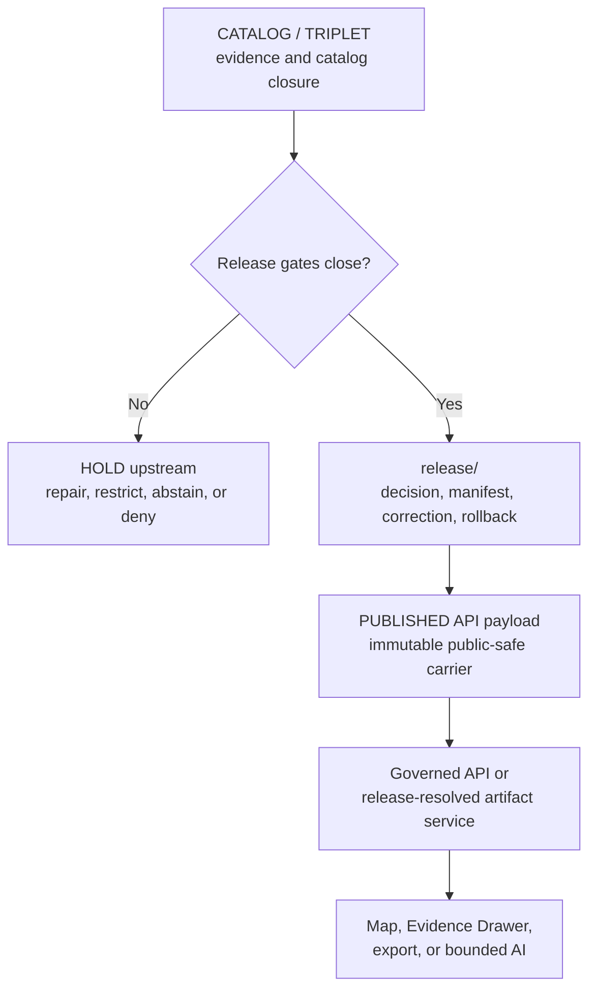

<!-- [KFM_META_BLOCK_V2]
doc_id: kfm://data/published/api-payloads/flora/readme
title: Flora Published API Payload Boundary
type: directory-readme
version: v0.2.0
status: repository-grounded draft; release-gated; payload and runtime implementation not established by bounded evidence
owners:
  - "NEEDS VERIFICATION — data and publication steward"
  - "NEEDS VERIFICATION — Flora domain, taxonomy, evidence, API, and validation stewards"
  - "NEEDS VERIFICATION — rights, sensitivity, geoprivacy, stewardship, and policy reviewers"
  - "NEEDS VERIFICATION — release, correction, withdrawal, rollback, security, accessibility, and docs stewards"
created: 2026-06-25
updated: 2026-07-26
policy_label: restricted-review; public-carrier; flora; deny-by-default-location; cite-or-abstain; release-gated
path: data/published/api_payloads/flora/README.md
truth_posture: >
  CONFIRMED exact target path and prior bytes, parent published and API-payload
  boundaries, draft OccurrencePublic semantic contract, permissive OccurrencePublic
  schema scaffold, Flora proof-support documentation, scaffold sensitivity policy,
  empty bounded release-candidate inventory, and explicit validation/proof/release
  workflow holds / PROPOSED payload-family routing, production payload profile,
  validator requirements, and governed delivery realization / UNKNOWN payload
  instances outside bounded indexed repository evidence, external or LFS storage,
  accepted owners, runtime routes, active writers and consumers, hosting, caches,
  public effects, correction propagation, and rollback execution / NEEDS VERIFICATION
  accepted contracts and schemas, Flora-specific evidence closure, rights and
  sensitivity enforcement, production validation, review authority, release
  manifests, deployment, and publication
evidence_snapshot:
  repository: bartytime4life/Kansas-Frontier-Matrix
  base_ref: main
  base_commit: 67f1d7eac9baabd69da997ba569de54c6b7c1d11
  prior_blob: 0b6e055055cac3c1d5ccd7412f693261053b26c6
  method: complete target read plus bounded parent, doctrine, ADR, contract, schema, policy, proof, candidate, workflow, API-doc, branch, pull-request, and repository-search inspection
related:
  - ../README.md
  - ../../README.md
  - ../../flora/README.md
  - ../../../raw/flora/README.md
  - ../../../work/flora/README.md
  - ../../../quarantine/flora/README.md
  - ../../../processed/flora/README.md
  - ../../../catalog/domain/flora/README.md
  - ../../../proofs/flora/README.md
  - ../../../proofs/evidence_bundle/flora/README.md
  - ../../../proofs/validation_report/flora/README.md
  - ../../../registry/sources/flora/README.md
  - ../../../receipts/README.md
  - ../../../../release/candidates/flora/README.md
  - ../../../../release/README.md
  - ../../../../contracts/domains/flora/occurrence_public.md
  - ../../../../schemas/contracts/v1/domains/flora/occurrence_public.schema.json
  - ../../../../policy/sensitivity/flora/README.md
  - ../../../../docs/domains/flora/API_CONTRACTS.md
  - ../../../../docs/domains/flora/DATA_LIFECYCLE.md
  - ../../../../docs/domains/flora/PUBLICATION_AND_ROLLBACK.md
  - ../../../../docs/doctrine/directory-rules.md
  - ../../../../docs/adr/ADR-0029-adopt-directory-governance-standard-v2.md
  - ../../../../.github/workflows/domain-flora.yml
notes:
  - "Same-path Markdown modernization only; no payload, source, contract, schema, policy, validator, fixture, workflow, candidate, release, route, deployment, cache, or publication state changed."
  - "Directory Rules v2 and ADR-0029 remain proposed at the evidence snapshot; this README does not adopt either or use proposed text as migration authority."
  - "Static badges project the documented boundary and current evidence state only; no CI or release badge is used."
  - "Legacy numbered heading fragments remain available through explicit anchors."
[/KFM_META_BLOCK_V2] -->

<a id="top"></a>

# `data/published/api_payloads/flora/` — Release-gated Flora API payload carriers

> **One-line purpose.** Define the Flora lane for immutable, release-linked, public-safe API payload carriers while keeping botanical truth, exact sensitive locations, evidence, policy, review, release, correction, and rollback in their owning authority surfaces.

[](#status)
[](#authority-level)
[](#purpose)
[](#flora-public-payload-contract)
[](#status)
[](#validation)

> [!IMPORTANT]
> This directory is a **carrier boundary, not release authority**. A payload-shaped file, path placement, schema check, workflow result, commit, pull request, merge, deployment, or reachable URL does not make Flora content evidence-supported, public-safe, released, or KFM-published.

> [!CAUTION]
> Exact or reconstructively precise rare, protected, culturally sensitive, steward-controlled, or private-land plant locations fail closed. Do not place restricted coordinates, locality clues, join keys, suppressed originals, or geoprivacy transform parameters in this public-carrier lane.

**Quick navigation:** [Purpose](#purpose) · [Authority](#authority-level) · [Status](#status) · [Belongs](#what-belongs-here) · [Exclusions](#what-does-not-belong-here) · [Inputs](#inputs) · [Outputs](#outputs) · [Validation](#validation) · [Review](#review-burden) · [Related](#related-folders) · [ADRs](#adrs) · [Last reviewed](#last-reviewed) · [Routing](#payload-family-routing) · [Payload contract](#flora-public-payload-contract) · [Lifecycle](#lifecycle-relationship) · [Done](#definition-of-done) · [No-loss](#no-loss-ledger)

---

<a id="1-scope"></a>

## Purpose

`data/published/api_payloads/flora/` is the Flora domain lane within the published API-payload carrier family.

Its bounded responsibility is to:

- retain immutable, release-linked **public-safe payload bytes** and immediate integrity or discovery sidecars;
- support governed API, Evidence Drawer, map-selection, export, and bounded AI consumers without exposing internal stores;
- preserve payload references to evidence, source role, taxonomic identity, time, uncertainty, sensitivity, policy, review, release, correction, and rollback state; and
- keep delivery carriers separate from contracts, schemas, canonical records, source registries, proofs, receipts, policy rules, release decisions, runtime code, and restricted material.

This lane is downstream of the complete trust path:

```text
RAW -> WORK / QUARANTINE -> PROCESSED -> CATALOG / TRIPLET -> RELEASE -> PUBLISHED
```

Promotion is a governed state transition. Moving or copying bytes into this directory cannot perform it.

[Back to top](#top)

---

<a id="2-repo-fit"></a>

## Authority level

**PUBLISHED artifact-family responsibility; carrier-only authority.**

| Question | Bounded answer |
|---|---|
| Owning responsibility root | `data/` |
| Lifecycle plane | `published/` |
| Artifact family | `api_payloads/` |
| Domain segment | `flora/` |
| What this lane may carry | Immutable, release-approved, public-safe Flora API payload bytes and immediate delivery sidecars. |
| What this lane does not own | Botanical truth, taxonomy authority, source admission, semantic meaning, machine shape, evidence, policy, sensitivity decisions, geoprivacy transforms, review, release, correction, rollback, API routing, or publication authority. |
| Normal consumer path | Governed API or an approved release-resolved artifact service. |
| Direct client access to RAW, WORK, QUARANTINE, unreleased PROCESSED, proof, catalog, vector-index, graph, or model stores | Denied. |
| Current operational authority | None established beyond documentation of the lane boundary. |
| Default when support is incomplete | Hold upstream, abstain, deny, error safely, or do not deliver according to the governing surface. |

The existing path is retained unchanged. The parent [`data/published/`](../../README.md) and [`api_payloads/`](../README.md) documents identify the responsibility relationship. The proposed Directory Rules v2 also describes `data/published/` as the released-carrier plane, but [ADR-0029](../../../../docs/adr/ADR-0029-adopt-directory-governance-standard-v2.md) is still proposed and creates no adoption or migration authority.

[Back to top](#top)

---

## Status

| Item | Current bounded result |
|---|---|
| Target | `data/published/api_payloads/flora/README.md` |
| Document version | `v0.2.0` |
| Evidence base | `main@67f1d7eac9baabd69da997ba569de54c6b7c1d11` |
| Prior blob | `0b6e055055cac3c1d5ccd7412f693261053b26c6` |
| Parent API-payload lane | **CONFIRMED** at [`../README.md`](../README.md); still a draft placement contract. |
| Bounded target-path search | Only this README was verified at the exact target path; external, LFS, unindexed, differently named, or runtime-only payloads remain **UNKNOWN**. |
| `OccurrencePublic` semantic contract | **CONFIRMED draft / PROPOSED** at [`contracts/domains/flora/occurrence_public.md`](../../../../contracts/domains/flora/occurrence_public.md). |
| `OccurrencePublic` machine schema | **CONFIRMED permissive scaffold:** no declared properties, no required fields, and `additionalProperties: true`. |
| Flora sensitivity policy | **CONFIRMED scaffold** at [`policy/sensitivity/flora/`](../../../../policy/sensitivity/flora/README.md); executable runtime enforcement is not established. |
| Flora proof support | **CONFIRMED documentation and shared EvidenceBundle support; Flora-specific proof production remains held.** |
| Release candidate | **NOT ESTABLISHED** by the bounded candidate inventory. |
| Approved manifest or published Flora release | **NOT ESTABLISHED.** |
| Production payload validator | **NOT ESTABLISHED.** |
| Flora validation, proof, and release dry-run automation | **EXPLICIT HOLD** in [`.github/workflows/domain-flora.yml`](../../../../.github/workflows/domain-flora.yml). |
| Governed Flora route, serving layer, cache behavior, and public effect | **UNKNOWN**; current Flora API documentation labels concrete routes and runtime behavior `PROPOSED`. |
| Directory Rules v2 adoption | **PROPOSED / no supersession effect**; this revision does not accept ADR-0029. |
| Effect of this revision | Markdown only; no payload or operational state changes. |

> [!NOTE]
> A bounded code search is not a permanent recursive inventory. Before any payload is admitted, verify the resulting branch tree, external storage, LFS objects, release manifests, active writers, and runtime consumers directly.

[Back to top](#top)

---

<a id="3-accepted-payloads"></a>

## What belongs here

Only immutable, release-approved, public-safe Flora payload carriers that conform to an accepted payload profile belong here. The families below are **eligibility categories, not a current inventory**.

| Eligible family | Bounded role | Required support |
|---|---|---|
| Public occurrence or feature-detail projection | Released derivative for a bounded Flora occurrence, specimen-supported claim, taxon, vegetation community, range, phenology, invasive-plant, restoration, or survey context. | Accepted contract and schema; resolved evidence; public-safe identity and geometry; policy; review; release; correction; rollback. |
| Evidence Drawer payload | Public-safe claim summary, citations, time/scope context, withheld/generalized explanation, uncertainty, and correction state. | Governed `EvidenceBundle` projection; citation validation; policy and release references. |
| Map-selection or popup projection | Minimal public-safe selection context that directs a client to governed resolution. | Public-safe identity, source-role and caveat posture, released artifact reference, and no restricted detail. |
| Focus Mode response package | Released evidence context and finite response projection for bounded interpretation. | Released evidence; finite outcome; citation validation; policy; review; release; `AIReceipt` reference where applicable. |
| Audience-approved summary or export | Generalized botanical, vegetation, distribution, monitoring, phenology, taxonomy, or restoration context. | Declared audience and public grain; source-role preservation; evidence; uncertainty; caveats; release packet. |
| Correction, stale, withdrawal, or supersession projection | Public-visible state explaining why an earlier payload is no longer current or available. | Governing correction, withdrawal, supersession, invalidation, or rollback record. |
| Immutable payload index or integrity sidecar | Release-resolved discovery, media type, byte size, digest, and version information. | Derived from release state; stable identifiers and content hashes; no independent authority. |

Payloads may reference proofs, receipts, policy decisions, reviews, and release records. The trust-bearing originals stay in their owning families.

[Back to top](#top)

---

<a id="4-exclusions"></a>

## What does NOT belong here

| Do not place here | Correct home or action |
|---|---|
| Source responses, Darwin Core archives, specimen exports, observations, imagery, telemetry, or provider payloads | [`data/raw/flora/`](../../../raw/flora/README.md) or source-specific intake |
| Working normalization, taxonomy reconciliation, generated drafts, unresolved joins, or transform candidates | [`data/work/flora/`](../../../work/flora/README.md) |
| Rights-, sensitivity-, identity-, evidence-, taxonomy-, or policy-held material | [`data/quarantine/flora/`](../../../quarantine/flora/README.md) |
| Canonical normalized Flora objects that are not released | [`data/processed/flora/`](../../../processed/flora/README.md) |
| Catalog records or canonical evidence state | [`data/catalog/domain/flora/`](../../../catalog/domain/flora/README.md) and Flora proof lanes |
| `EvidenceBundle`, `ProofPack`, validation proof, or review proof | [`data/proofs/flora/`](../../../proofs/flora/README.md) |
| Run, transform, redaction, validation, AI, release, or publication receipts | [`data/receipts/`](../../../receipts/README.md) |
| Release manifests, promotion decisions, corrections, withdrawals, signatures, or rollback decisions | [`release/`](../../../../release/README.md) |
| Contracts, schemas, source descriptors, policy rules, validators, tests, fixtures, or runtime code | Their owning roots under `contracts/`, `schemas/`, `data/registry/`, `policy/`, `tools/`, `tests/`, `fixtures/`, `apps/`, `packages/`, and `runtime/` |
| Exact, aliased, encoded, obscured, or reconstructively precise sensitive plant locations | Restricted governed storage; generalize, aggregate, suppress, stage access, or deny upstream |
| Private-land detail, access routes, collection clues, culturally restricted knowledge, steward-only attributes, or re-identifying join keys | Restricted governed storage; exclude from public payload shape |
| Geoprivacy radii, offsets, seeds, masks, thresholds, suppressed originals, or reversible transform parameters | Protected transform and receipt systems; never public payloads |
| Unreviewed model output or fluent AI text | Governed AI/review path; release only as evidence-bounded finite output |
| Mutable `current` or `latest` alias authored by hand | Hold until an accepted alias profile, atomic update, invalidation, receipt, correction, and rollback path exists |
| Placeholder release IDs, fabricated digests, sample coordinates, live destinations, or realistic sensitive records | Do not create them; use explicitly synthetic, non-locating fixtures in fixture/test lanes |
| Botanical collection, access, harvest, propagation, land-entry, pesticide, emergency, or legal instructions | A separately governed authority surface, if one exists; otherwise abstain or deny |

[Back to top](#top)

---

<a id="5-publication-gates"></a>

## Inputs

Every payload admitted here needs a release-specific support packet appropriate to its significance.

| Support dimension | Minimum expectation |
|---|---|
| Identity and integrity | Immutable payload ID, version, release ID, content digest, media type, byte size, schema/contract version, and reproducible locator. |
| Semantic contract | An accepted contract defines payload meaning, field responsibilities, public derivative status, and finite outcomes. |
| Machine schema | A reviewed, non-permissive schema defines required fields, enums, bounds, and forbidden extras. The current `OccurrencePublic` scaffold does not satisfy this gate. |
| Source and evidence | Source descriptors, source roles, `EvidenceRef` values, and resolvable `EvidenceBundle` support for consequential claims. |
| Botanical identity | Taxon concept, authority/version, synonyms or crosswalks, identification uncertainty, object family, and unresolved conflicts remain explicit. |
| Rights and sensitivity | Rights, terms, audience, cultural/stewardship obligations, sensitivity, geoprivacy posture, disclosure risk, and permitted use resolve. |
| Public-safe transformation | Required generalization, aggregation, suppression, redaction, delay, or withholding completes upstream and binds to a protected receipt and review record. |
| Spatial and temporal support | Public grain, coordinate uncertainty, observation/collection/source/retrieval/model/release/correction/stale times, and supersession state remain distinguishable where material. |
| Policy and review | Policy decision and accountable Flora, rights, sensitivity, stewardship, and release review permit the intended audience. |
| Validation and proof | Schema, domain, sensitive-field, evidence, citation, catalog, integrity, correction, and rollback checks close with finite results. |
| Release | `ReleaseManifest`, promotion decision, public scope, and required signatures or attestations bind the exact payload bytes. |
| Reversal | Correction, withdrawal, supersession, cache invalidation, downstream derivative handling, and rollback targets are defined and testable. |

If any required dimension is missing, conflicted, stale, or inaccessible, keep the payload upstream.

[Back to top](#top)

---

## Outputs

This lane may retain immutable public-safe carrier bytes and immediate sidecars for:

- governed Flora feature or detail resolution;
- Evidence Drawer rendering;
- map-selection and popup context;
- bounded Focus Mode interpretation;
- audience-approved exports and summaries;
- correction, stale, withdrawal, and supersession messaging; and
- release-resolved artifact discovery.

Public delivery should use the finite outcome vocabulary defined by the applicable runtime contract:

| Outcome | Delivery meaning |
|---|---|
| `ANSWER` | Evidence resolves, policy permits, release state is valid, and citations or support close. |
| `ABSTAIN` | Evidence, scope, freshness, taxonomy, citation, or release support is insufficient or conflicted. |
| `DENY` | Rights, sensitivity, geoprivacy, stewardship, audience, review, or release policy blocks exposure. |
| `ERROR` | Request, schema, validator, resolver, or system processing failed safely without leaking restricted state. |

The exact envelope and route realization remains **PROPOSED / NEEDS VERIFICATION**. Payload files here do not create a runtime API, and runtime output does not create release authority.

[Back to top](#top)

---

<a id="7-maintenance-checklist"></a>

## Validation

### Current accepted scope

Current repository evidence establishes documentation and readiness boundaries, not production payload validation:

- the Flora `OccurrencePublic` contract is draft and proposed;
- the paired schema declares no fields, requires nothing, and permits additional properties;
- the Flora validator lane documents responsibilities but confirms no accepted executable;
- the Flora sensitivity policy is a scaffold;
- the Flora candidate inventory establishes no child candidate;
- the Flora workflow deliberately records holds for validation, proof production, and release dry-run; and
- no governed Flora route implementation was located by the bounded search.

Therefore, **no payload is eligible for this lane solely on the strength of the currently inspected Flora schema, validator, policy, workflow, or documentation**.

### Required production payload checks

- [ ] Validate against an accepted semantic contract and non-permissive machine schema.
- [ ] Reject undeclared, restricted, aliased, encoded, or reconstructively identifying fields.
- [ ] Prove exact or harmful-precision plant information cannot appear directly or through joins.
- [ ] Prove transform parameters, suppressed originals, and restricted source locators cannot appear.
- [ ] Resolve source identity, source role, rights, sensitivity, taxonomy, evidence, spatial grain, uncertainty, and temporal support.
- [ ] Verify finite outcome semantics and required reason, caveat, and citation fields.
- [ ] Verify `EvidenceRef` to `EvidenceBundle` closure and citation validity.
- [ ] Verify policy decision, review record, release manifest, public scope, payload digest, and immutable identity.
- [ ] Verify correction, withdrawal, supersession, invalidation, cache behavior, and rollback.
- [ ] Verify public clients use governed resolution rather than direct internal-store reads.
- [ ] Verify malformed, oversized, cyclic, deeply nested, or otherwise abusive payloads fail safely under an accepted production profile.
- [ ] Verify public caveats are useful and bounded without embedding protected detail.
- [ ] Verify no direct model output, secret, credential, private endpoint, tracking token, or unsafe external reference is introduced.
- [ ] Run deterministic no-network valid, invalid, denied, abstained, stale, correction, supersession, and rollback fixtures before any live-source or public-serving test.

### README checks

- [ ] Keep one H1 and a logical heading hierarchy.
- [ ] Preserve the explicit legacy anchors retained by this revision.
- [ ] Validate every relative link and heading fragment at the resulting commit.
- [ ] Validate each badge against its textual source of truth.
- [ ] Validate Mermaid syntax and preserve the accompanying textual explanation.
- [ ] Re-run secret, private-data, rights, and sensitive-location review before commit.

A passing Markdown, schema, fixture, workflow, or CI check proves only its declared scope. It does not establish botanical truth, taxonomic currency, rights clearance, safe production geoprivacy, stewardship permission, release approval, hosted delivery, or KFM publication.

[Back to top](#top)

---

## Review burden

Accountable ownership and final release authority remain **NEEDS VERIFICATION**.

| Change class | Minimum review concern |
|---|---|
| README-only boundary clarification | Docs, data publication, Flora domain, governed API, and sensitivity review. |
| Payload shape or field allowlist | Contract, schema, Flora, API, evidence, taxonomy, sensitivity/geoprivacy, validation, and compatibility review. |
| Source, taxon authority, rights, public grain, or transform rule | Source, botanical/taxonomic, rights-holder or stewardship, cultural/sensitivity, policy, domain, and independent review as applicable. |
| Route, authentication, resolver, caching, or client behavior | Governed API, security/privacy, runtime, accessibility, observability, and domain review. |
| Release, correction, withdrawal, alias, or rollback | Release, correction, rollback, invalidation/cache, evidence, policy, and separation-of-duties review. |
| Public AI or Focus Mode projection | Governed AI, evidence/citation, policy, privacy, Flora, accessibility, and release review. |

CODEOWNERS routing, a pull request, a green readiness workflow, or a successful schema check does not by itself establish stewardship approval, rights-holder permission, independent review, release approval, or publication.

[Back to top](#top)

---

## Related folders

### Lifecycle and publication

- Parent API-payload family: [`data/published/api_payloads/`](../README.md)
- Parent published-data lane: [`data/published/`](../../README.md)
- Broader Flora published-carrier lane: [`data/published/flora/`](../../flora/README.md)
- RAW: [`data/raw/flora/`](../../../raw/flora/README.md)
- WORK: [`data/work/flora/`](../../../work/flora/README.md)
- QUARANTINE: [`data/quarantine/flora/`](../../../quarantine/flora/README.md)
- PROCESSED: [`data/processed/flora/`](../../../processed/flora/README.md)
- CATALOG: [`data/catalog/domain/flora/`](../../../catalog/domain/flora/README.md)
- PROOFS: [`data/proofs/flora/`](../../../proofs/flora/README.md)
- EvidenceBundle support: [`data/proofs/evidence_bundle/flora/`](../../../proofs/evidence_bundle/flora/README.md)
- ValidationReport support: [`data/proofs/validation_report/flora/`](../../../proofs/validation_report/flora/README.md)
- RECEIPTS: [`data/receipts/`](../../../receipts/README.md)
- Source registry: [`data/registry/sources/flora/`](../../../registry/sources/flora/README.md)
- Flora release candidates: [`release/candidates/flora/`](../../../../release/candidates/flora/README.md)
- Release authority root: [`release/`](../../../../release/README.md)

### Flora contracts, safety, API, and validation

- `OccurrencePublic` semantic contract: [`contracts/domains/flora/occurrence_public.md`](../../../../contracts/domains/flora/occurrence_public.md)
- `OccurrencePublic` schema scaffold: [`schemas/contracts/v1/domains/flora/occurrence_public.schema.json`](../../../../schemas/contracts/v1/domains/flora/occurrence_public.schema.json)
- Flora API contracts: [`docs/domains/flora/API_CONTRACTS.md`](../../../../docs/domains/flora/API_CONTRACTS.md)
- Flora lifecycle: [`docs/domains/flora/DATA_LIFECYCLE.md`](../../../../docs/domains/flora/DATA_LIFECYCLE.md)
- Flora publication and rollback: [`docs/domains/flora/PUBLICATION_AND_ROLLBACK.md`](../../../../docs/domains/flora/PUBLICATION_AND_ROLLBACK.md)
- Flora sensitivity policy scaffold: [`policy/sensitivity/flora/`](../../../../policy/sensitivity/flora/README.md)
- Flora validator index: [`tools/validators/domains/flora/`](../../../../tools/validators/domains/flora/README.md)
- Flora tests: [`tests/domains/flora/`](../../../../tests/domains/flora/README.md)
- Flora fixtures: [`fixtures/domains/flora/`](../../../../fixtures/domains/flora/README.md)
- Flora readiness workflow: [`.github/workflows/domain-flora.yml`](../../../../.github/workflows/domain-flora.yml)
- Proposed Directory Rules v2: [`docs/doctrine/directory-rules.md`](../../../../docs/doctrine/directory-rules.md)

[Back to top](#top)

---

## ADRs

[`docs/adr/INDEX.md`](../../../../docs/adr/INDEX.md) is the status index. This README does not accept or implement an ADR.

Relevant proposed records include:

- [`ADR-0010`](../../../../docs/adr/ADR-0010-deny-by-default-for-dna-rare-species-archaeology-infrastructure.md) — deny-by-default posture for sensitive domains;
- [`ADR-0011`](../../../../docs/adr/ADR-0011-receipts-vs-proofs-vs-manifests-vs-catalog-separation.md) — trust-object family separation;
- [`ADR-0015`](../../../../docs/adr/ADR-0015-data-published-_domain_-current-alias-is-governed-by-rollback_card.md) — governed published aliases and rollback;
- [`ADR-0018`](../../../../docs/adr/ADR-0018-promotion-gate-sequence.md) — promotion-gate sequence;
- [`ADR-0024`](../../../../docs/adr/ADR-0024-steward-separation-of-duties-for-release.md) — release separation of duties;
- [`ADR-0025`](../../../../docs/adr/ADR-0025-public-client-never-reads-canonical-internal-stores.md) — governed public-client boundary; and
- [`ADR-0029`](../../../../docs/adr/ADR-0029-adopt-directory-governance-standard-v2.md) — proposed Directory Rules v2 adoption.

An accepted decision plus implementation, validation, migration, and rollback evidence is required before this README is used to settle a conflict, create a mutable alias, claim production route behavior, or change authority placement.

[Back to top](#top)

---

## Last reviewed

- **Date:** 2026-07-26
- **Evidence boundary:** `main@67f1d7eac9baabd69da997ba569de54c6b7c1d11`
- **Method:** complete target read; parent published/API-payload boundaries; Directory Rules v2 and ADR-0029 status; Flora `OccurrencePublic` contract and schema; policy, proof, candidate, API/lifecycle, and workflow evidence; bounded branch, PR, and repository-path search
- **Bounded target-path result:** only the README was verified at the exact target path
- **Payload bytes, external stores, LFS objects, deployed routes, runtime logs, release instances, hosts, and cache state:** not inspected
- **Owners, accepted contracts/ADRs, production schemas/validators, source activation, policy enforcement, independent review, public serving, invalidation, and rollback drills:** need verification

Re-review after any payload, schema, contract, source, policy, sensitivity, validator, route, release, alias, correction, withdrawal, serving, cache, or rollback change.

[Back to top](#top)

---

<a id="6-suggested-layout"></a>

## Payload-family routing

Use object meaning and an accepted release profile to select a payload family. Do not create directories merely to match this table.

| Payload family | Intended use | Current posture |
|---|---|---|
| `occurrence_public` | Generalized, aggregated, withheld-detail, or otherwise public-safe occurrence derivative. | Semantic contract is draft; schema is permissive; payload instances not established. |
| `feature_detail` | Evidence-bounded taxon, specimen-supported, vegetation, phenology, range, invasive-plant, restoration, or survey context. | PROPOSED; accepted envelope and route not established. |
| `evidence_drawer` | Public-safe evidence, citation, uncertainty, source-role, policy, and correction projection. | PROPOSED; must remain a projection, not a second evidence store. |
| `map_selection` | Minimal map/popup context that resolves through the governed API. | PROPOSED; no exact or sensitive location detail. |
| `focus_mode` | Released evidence context and finite AI response projection. | PROPOSED; requires citation validation, policy, release state, and AI receipt where applicable. |
| `exports` or `public_summaries` | Audience-bounded public-safe aggregates and summaries. | PROPOSED; audience and public grain must be release-bound. |
| `state_updates` | Correction, stale, withdrawal, supersession, or rollback-visible status. | PROPOSED; derived from release-governance records. |
| `indexes` or `integrity` | Immutable discovery and digest sidecars. | PROPOSED; derived only, never release authority. |

### Schematic release-local profile

```text
data/published/api_payloads/flora/
├── README.md
└── <payload_family>/                 # PROPOSED; add only through an accepted profile
    └── <release_id>/                 # immutable release identity
        ├── <payload_id>.<digest>.json
        └── <payload_id>.<digest>.integrity.json
```

Suggested filename grammar retained from the prior README:

```text
flora.published.api_payload.<payload_family>.<scope>.<release_id>.<short_hash>.json
```

Both the child topology and filename grammar remain **PROPOSED** until contracts, schemas, release tooling, validators, fixtures, and consumers agree. A current directory map must be regenerated from the resulting tree rather than copied from this schematic.

[Back to top](#top)

---

## Flora public payload contract

Every released Flora payload should preserve these boundaries.

| Invariant | Required public behavior |
|---|---|
| Derivative, not exact truth | Public payload identity remains distinct from internal exact or canonical identity. |
| Taxonomic clarity | Taxon concept, authority/version, synonym or crosswalk posture, and unresolved identification conflict remain visible where material. |
| Evidence closure | Consequential claims carry resolvable evidence support or the interaction abstains or denies. |
| Source-role anti-collapse | Observed, regulatory, modeled, aggregate, administrative, candidate, and synthetic roles are not silently promoted into one another. |
| Public-safe location | Exact and reconstructively precise protected location detail is withheld, generalized, aggregated, delayed, staged, or denied. |
| Transform secrecy | Suppressed originals, offsets, seeds, masks, thresholds, and reversible geoprivacy parameters never enter the public payload. |
| Spatial and temporal clarity | Public grain, coordinate uncertainty, observation/collection/source/retrieval/model/release/stale/correction times remain distinguishable where material. |
| Caveat visibility | Uncertainty, coverage, withheld detail, source limits, taxonomy conflicts, and correction state remain visible without leaking protected information. |
| Finite outcomes | `ABSTAIN`, `DENY`, and `ERROR` are explicit trust states, not empty payloads or silent omissions. |
| Governed client boundary | Public clients use governed resolution and released artifacts, never internal lifecycle, proof, graph, vector-index, or model stores. |
| AI boundary | Generated language is interpretive and evidence-subordinate; direct model output is not a released Flora payload. |
| Correction and reversal | Misidentification, taxonomy change, source withdrawal, rights or sensitivity change, stale evidence, geometry error, or release withdrawal can trigger correction, invalidation, supersession, withdrawal, and rollback. |
| No operational authority | Payloads do not become collection, access, harvest, propagation, pesticide, medical, emergency, legal, or stewardship instructions without a separately accepted authority surface. |

> [!WARNING]
> A generalized label alone does not prove geoprivacy. Public safety must be established across the complete payload, linked sidecars, indexes, joins, URLs, identifiers, timing detail, caveats, and downstream resolvers.

[Back to top](#top)

---

## Lifecycle relationship



The diagram shows responsibility order, not current implementation. No inspected evidence establishes a live Flora payload, approved release manifest, governed Flora route, deployment, or hosted public effect.

[Back to top](#top)

---

<a id="8-definition-of-done"></a>

## Definition of done

This lane is operationally mature only when release-specific evidence establishes every applicable item below.

| Capability | Current state | Graduation evidence |
|---|---|---|
| Lane boundary documentation | **CONFIRMED / improved by this revision** | Parent and child README contracts agree on role, exclusions, and authority-family separation. |
| Bounded payload inventory | **NONE ESTABLISHED** | Pinned tree/external-store inventory with immutable identities, digests, media types, owners, rights, sensitivity, and release references. |
| Accepted semantic payload contract | **PROPOSED** | Reviewed meaning, finite outcomes, public-derivative responsibilities, compatibility, correction, and deprecation rules. |
| Non-permissive machine schema | **NOT ESTABLISHED** | Required fields, enums, bounds, forbidden extras, valid/invalid fixtures, and compatibility tests. |
| Production payload validator | **NOT ESTABLISHED** | Deterministic no-network tests for aliases, joins, harmful precision, evidence, policy, release, correction, and rollback gates. |
| Flora-specific evidence closure | **NOT ESTABLISHED** | Emitted and resolvable `EvidenceBundle`, citation, proof, catalog, and source instances agreeing on identity and release scope. |
| Rights, sensitivity, and geoprivacy enforcement | **NOT ESTABLISHED** | Accepted policy, public-safe transform, protected receipt, negative fixtures, runtime enforcement, and accountable review. |
| Candidate and release packet | **NONE ESTABLISHED** | Candidate dossier, validation reports, review records, promotion decision, immutable manifest, public scope, and rollback target. |
| Governed API/runtime delivery | **UNKNOWN** | Tested resolver behavior, finite outcomes, authorization where applicable, observability, and proof of no direct internal-store path. |
| Correction, withdrawal, invalidation, and rollback | **UNKNOWN / HELD** | Executed synthetic drills proving public state changes are bounded, visible, auditable, and reversible. |
| Accessibility and trust-visible UI | **NEEDS VERIFICATION** | Text-labelled finite outcomes, keyboard-accessible evidence/correction surfaces, and non-color-only trust cues. |
| Hosted publication | **NOT ESTABLISHED** | Release-specific deployment and serving evidence; repository state alone is insufficient. |

Unknowns and holds narrow claims and block higher-risk transitions. They do not invite plausible defaults.

[Back to top](#top)

---

## No-loss ledger

| Prior element | Disposition |
|---|---|
| Stable path, `doc_id`, type, created date, and Flora API-payload lane identity | **KEEP** |
| Release-gated, carrier-only, cite-or-abstain posture | **KEEP / CLARIFY** |
| Public-safe audience, evidence, source-role, taxonomic, temporal, caveat, correction, and rollback requirements | **KEEP / STRENGTHEN** |
| Accepted payload-family examples | **CONSOLIDATE / NARROW** into eligibility categories rather than asserted current directories |
| Exclusions and authority-root separation | **KEEP / ENRICH** with Flora-specific exact-location, cultural/stewardship, join, and transform-parameter controls |
| Publication-gate checklist | **KEEP / ENRICH** with the current permissive schema, validator hold, sensitivity scaffold, and release evidence boundary |
| Suggested child tree and deterministic filename | **REPAIR** by retaining a clearly schematic release-local profile without implying current child directories |
| Existing numbered heading fragments | **KEEP** through explicit compatibility anchors |
| Unverified owners | **PRESERVE UNCERTAINTY** as `NEEDS VERIFICATION`; no owner or reviewer invented |
| Payload, route, schema enforcement, validator, manifest, release, deployment, and publication claims | **NARROW** to `NOT ESTABLISHED`, `UNKNOWN`, `PROPOSED`, or `NEEDS VERIFICATION` |
| File move, payload creation, source access, contract/schema/policy/workflow change, release, deployment, or publication | **NONE** |

### Change history

#### v0.2.0 — 2026-07-26

- grounded the complete README against current repository bytes and the current Flora readiness boundary;
- preserved the stable path, document identity, created date, substantive controls, and legacy heading fragments;
- made the draft semantic contract, permissive schema, sensitivity scaffold, explicit workflow holds, empty bounded candidate inventory, and unknown runtime route visible;
- strengthened Flora-specific taxonomy, exact-location, culturally sensitive knowledge, join, transform-secrecy, finite-outcome, correction, and rollback controls;
- replaced implied current child topology with an explicitly schematic release-local profile;
- added evidence-backed navigation, badges, tables, alerts, and a lifecycle diagram; and
- changed Markdown only.

[Back to top](#top)
