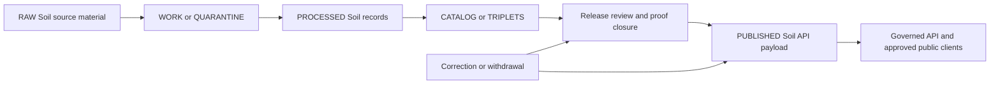

<!-- [KFM_META_BLOCK_V2]
doc_id: kfm://data/published/api-payloads/soil/readme
title: data/published/api_payloads/soil README
type: directory-readme
version: v0.2
status: draft
owners:
  - TODO(owner): data steward
  - TODO(owner): soil domain steward
  - TODO(owner): API steward
  - TODO(owner): publication steward
  - TODO(owner): release steward
created: 2026-06-25
updated: 2026-07-26
policy_label: public-review
path: data/published/api_payloads/soil/README.md
related:
  - ../README.md
  - ../../README.md
  - ../../../proofs/README.md
  - ../../../proofs/soil/README.md
  - ../../../proofs/proof_pack/soil/README.md
  - ../../../proofs/validation_report/soil/README.md
  - ../../../receipts/README.md
  - ../../../../release/README.md
  - ../../../../docs/domains/soil/ARCHITECTURE.md
  - ../../../../contracts/README.md
  - ../../../../schemas/README.md
  - ../../../../policy/README.md
notes:
  - "Directory README for released Soil API payload carriers under data/published/api_payloads/."
  - "This lane stores release-linked API payload snapshots or packages only after release gates pass."
  - "This README describes placement and boundaries; it does not prove emitted payloads, schemas, validators, CI, or API routes exist."
[/KFM_META_BLOCK_V2] -->

<a id="top"></a>

# `data/published/api_payloads/soil/`

[](#status-and-authority)
[](#lifecycle-and-repository-fit)
[](#soil-payload-contract)
[](#accepted-payload-families)
[](#publication-admission-gates)

Released, public-safe Soil API payload carriers for governed APIs, Evidence Drawer views, map popups, Focus Mode, exports, and other approved public delivery surfaces.

> [!IMPORTANT]
> This directory is a **published carrier lane**, not a release authority, evidence authority, schema authority, policy authority, or canonical Soil store. A file belongs here only after governed release closure exists and the payload remains traceable to evidence, validation, policy, review, correction, and rollback support.

> [!WARNING]
> Placement under `data/published/` does not make a payload KFM-published. If release authority, evidence closure, policy state, integrity, correction, or rollback is incomplete, keep the payload upstream.

## Navigation

- [Purpose](#purpose)
- [Status and authority](#status-and-authority)
- [Lifecycle and repository fit](#lifecycle-and-repository-fit)
- [Accepted payload families](#accepted-payload-families)
- [Soil payload contract](#soil-payload-contract)
- [Publication admission gates](#publication-admission-gates)
- [Directory map](#directory-map)
- [Validation and maintenance](#validation-and-maintenance)
- [Maturity and open verification](#maturity-and-open-verification)

## Purpose

`data/published/api_payloads/soil/` stores immutable or release-versioned Soil payload snapshots and packages that have already passed the applicable publication gates.

Payloads in this lane should be:

- release-linked and integrity-bound;
- public-safe for a declared audience and access class;
- traceable to source, evidence, catalog, validation, policy, review, correction, and rollback records;
- explicit about support type, source role, units, depth context, temporal scope, quality context, caveats, and correction state; and
- consumed through governed API or approved released-artifact paths rather than direct access to canonical or internal stores.

This README governs the directory boundary. It does **not** prove that any payload family, API route, schema, validator, workflow, release manifest, or runtime behavior exists.

[Back to top](#top)

## Status and authority

| Field | Current posture |
|---|---|
| Document status | `draft` |
| Directory lifecycle | `PUBLISHED` carrier lane |
| Authority owner | Published Soil API payload instances |
| Does not own | Soil truth, source admission, semantic contracts, schemas, policy, proof, receipts, release decisions, or runtime interpretation |
| Truth posture | Cite or abstain |
| Owners | `TODO(owner)` entries remain unresolved and must not be inferred |
| Public client rule | Governed APIs and approved released artifacts only |

A payload may reference `EvidenceBundle`, catalog, proof, policy, release, correction, and rollback objects without owning those object families.

[Back to top](#top)

## Lifecycle and repository fit



The diagram shows the governing direction only. It does not assert that every displayed stage has implemented Soil tooling.

| Neighbor | Responsibility | Boundary |
|---|---|---|
| `data/raw/soil/` | Immutable source captures or source references | Never a normal public path |
| `data/work/soil/` | Working normalization and candidate payload material | Not release-approved |
| `data/quarantine/soil/` | Held material with unresolved validation, rights, sensitivity, identity, or support | Fail closed |
| `data/processed/soil/` | Validated Soil records and derived candidates | Upstream of release |
| `data/catalog/domain/soil/` | Discovery, lineage, and catalog closure | Catalog metadata is not release authority |
| `data/proofs/soil/` | Soil proof-support objects | Proof support is not a published payload |
| `data/proofs/validation_report/soil/` | Validation reports | Gate evidence, not publication authority |
| `data/receipts/` | Process memory and transform history | Receipts do not prove truth or release alone |
| `release/` | Release manifests, promotion decisions, correction, withdrawal, rollback, and signatures | Governs release state |
| `contracts/` | Semantic meaning | Payloads conform; they do not define meaning |
| `schemas/` | Machine shape | Payloads validate; they do not define schemas |
| `policy/` | Admissibility and exposure decisions | Payloads carry outcomes; policy remains external |

[Back to top](#top)

## Accepted payload families

The following placements are **PROPOSED conventions** until validated by current contracts, schemas, validators, fixtures, release tooling, and governed API implementation.

| Payload family | Proposed placement | Minimum support |
|---|---|---|
| Endpoint snapshot | `endpoints/<release_id>/<endpoint_slug>.json` | Release, schema, evidence, policy, integrity, correction, and rollback references |
| Evidence Drawer payload | `evidence_drawer/<release_id>/<payload_slug>.json` | Evidence bundle, citations, policy state, validation, and release references |
| Focus Mode payload | `focus_mode/<release_id>/<payload_slug>.json` | Released evidence scope, finite outcome, citations, and AI receipt when AI contributed |
| Map-popup payload | `map_popups/<release_id>/<payload_slug>.json` | Public-safe feature context, support type, caveats, and release references |
| Export payload | `exports/<release_id>/<payload_slug>.json` | Audience, policy, proof, integrity, and release references |
| Public summary | `public_summaries/<release_id>/<payload_slug>.json` | Bounded claim scope, citations, caveats, and public-safe posture |
| Payload index | `indexes/soil-api-payload-index.json` | Release-approved entries only; no draft or held payloads |
| Retired or superseded payload | `retired/<release_id>/<payload_slug>.json` | Correction, withdrawal, supersession, or rollback lineage |

### Material that does not belong here

| Excluded material | Owning home |
|---|---|
| Source-system exports, survey extracts, rasters, station dumps, satellite products, or model files | `data/raw/soil/` |
| Working or held candidates | `data/work/soil/` or `data/quarantine/soil/` |
| Normalized processed data | `data/processed/soil/` |
| Catalog records | `data/catalog/` |
| Proof objects | `data/proofs/` |
| Receipts | `data/receipts/` |
| Release manifests, promotion decisions, or rollback cards | `release/` |
| Policy logic | `policy/` |
| Machine schemas | `schemas/` |
| Semantic contracts | `contracts/` |
| Unreviewed model or AI output | Governed review and AI-runtime paths upstream of release |

[Back to top](#top)

## Soil payload contract

Soil payloads must preserve distinctions that materially affect meaning and fitness for use.

| Required distinction | Public payload rule |
|---|---|
| Support type | Distinguish static survey, gridded derivative, station observation, satellite-derived observation, pedon or profile evidence, laboratory result, and interpretation |
| Source role | Identify whether a source is authoritative, observational, derivative, modeled, contextual, or corroborative within the claim scope |
| Evidence support | Consequential claims resolve to evidence support or return a finite abstention or denial outcome |
| Spatial context | Preserve map-unit, station, profile, raster-cell, generalized area, or other applicable support geometry without implying unsupported precision |
| Temporal context | Preserve observation, valid, source, retrieval, release, correction, and stale-state times where material |
| Units and depth | Include units, depth interval or horizon context, method, and quality flags for soil properties and moisture |
| Interpretation limits | Suitability, erosion, drainage, hydrologic-group, productivity, and other interpretations retain method and caveats; they do not become crop, flood, legal, construction, or engineering truth |
| Cross-domain ownership | Agriculture, hydrology, hazards, geology, habitat, flora, fauna, people/land, and settlements remain owned by their respective lanes |
| AI boundary | AI may summarize released payloads but cannot replace evidence, policy, validation, citations, review, release, correction, or rollback |

### Illustrative public-safe envelope

The example below is illustrative and does not claim an adopted schema or current route.

```json
{
  "payload_id": "soil-api-payload-example",
  "release_id": "release-example",
  "outcome": "ANSWER",
  "support_type": "static_soil_survey",
  "source_role": "authoritative_interpretation",
  "spatial_scope": {
    "kind": "map_unit",
    "identifier": "public-safe-example"
  },
  "temporal_scope": {
    "source_time": "YYYY-MM-DD",
    "release_time": "YYYY-MM-DD"
  },
  "evidence_bundle_ids": ["evidence-bundle-example"],
  "policy_decision_id": "policy-decision-example",
  "correction_state": "current",
  "caveats": [
    "Illustrative structure only; verify against adopted contracts and schemas."
  ]
}
```

[Back to top](#top)

## Publication admission gates

Before adding or replacing a Soil payload in this lane, verify each applicable gate.

| Gate | Required result |
|---|---|
| Identity and release binding | Stable payload identity, release identifier, content digest, and release-manifest linkage exist |
| Source and evidence | Consequential claims resolve to admissible evidence with source role and support type preserved |
| Schema and contract | Payload validates against the approved machine shape and semantic contract |
| Policy and sensitivity | Audience, rights, sensitivity, precision, and public-safe transforms are allowed and recorded |
| Catalog and provenance | Catalog and provenance closure exists where required |
| Review | Required domain, publication, policy, or release review is recorded |
| Correction and rollback | Correction state, supersession behavior, and rollback target are traceable |
| Runtime boundary | Public clients consume the payload through governed interfaces or approved released-artifact paths |

If a gate did not run, failed, or remains unknown, the payload stays upstream. A badge, filename, commit, pull request, merge, or directory placement does not satisfy these gates.

[Back to top](#top)

## Directory map

```text
data/published/api_payloads/soil/
├── README.md
├── endpoints/
│   └── <release_id>/
├── evidence_drawer/
│   └── <release_id>/
├── focus_mode/
│   └── <release_id>/
├── map_popups/
│   └── <release_id>/
├── exports/
│   └── <release_id>/
├── public_summaries/
│   └── <release_id>/
├── indexes/
│   └── soil-api-payload-index.json
└── retired/
    └── <release_id>/
```

Proposed deterministic file-name pattern:

```text
soil.published.api_payload.<payload_family>.<scope>.<release_id>.<short_hash>.json
```

The map describes this directory and its direct proposed children only. It does not authorize child creation or prove that these families currently exist.

[Back to top](#top)

## Validation and maintenance

### Pre-change checklist

- [ ] Confirm the payload is release-approved for the intended audience.
- [ ] Confirm the release record points to the exact payload digest.
- [ ] Confirm evidence, catalog, validation, policy, review, correction, and rollback references are present where required.
- [ ] Confirm support type, source role, spatial and temporal scope, units, depth, method, caveats, and quality context are preserved.
- [ ] Confirm public-safe transforms occurred upstream and are receipt-backed.
- [ ] Confirm the payload does not duplicate source, processed, catalog, proof, receipt, contract, schema, policy, or release authority.
- [ ] Confirm links and identifiers resolve at the resulting revision where checkable.
- [ ] Confirm public clients consume the payload only through governed interfaces or approved released-artifact paths.

### Failure interpretation

| Failure | Required response |
|---|---|
| Missing evidence or citation support | `ABSTAIN` or hold upstream |
| Unknown rights, sensitivity, audience, or precision posture | `DENY` or quarantine |
| Schema, contract, or integrity failure | `ERROR` and block release |
| Missing release, correction, or rollback linkage | Hold upstream |
| Source-role or support-type collapse | Reject payload and repair upstream transform |
| Stale or superseded support | Mark stale, correct, supersede, withdraw, or rebuild according to release policy |

Passing validation proves only the checks that ran. It does not independently prove source truth, policy approval, review completion, release, deployment, or public fitness beyond the tested scope.

[Back to top](#top)

## Maturity and open verification

This lane reaches operational maturity only when current repository evidence confirms all applicable items below:

- [ ] The parent `data/published/api_payloads/README.md` defines the shared API-payload carrier contract.
- [ ] Soil payload semantic contracts and machine schemas exist in approved authority homes.
- [ ] Release tooling writes or verifies payloads only after release authority and integrity binding exist.
- [ ] Validators reject missing evidence, release references, rollback targets, review state, unsafe fields, support-type collapse, and source-role collapse.
- [ ] Valid and invalid no-network fixtures cover endpoint, Evidence Drawer, Focus Mode, map-popup, export, public-summary, correction, supersession, withdrawal, and rollback cases.
- [ ] Governed API or released-artifact routes are documented and tested.
- [ ] Correction and rollback drills demonstrate that public consumers can move safely to a prior or corrected release.

## Related authority surfaces

- [`../README.md`](../README.md) — parent Soil API-payload lane contract.
- [`../../README.md`](../../README.md) — published API-payload responsibility boundary.
- [`../../../proofs/soil/README.md`](../../../proofs/soil/README.md) — Soil proof-support boundary.
- [`../../../proofs/validation_report/soil/README.md`](../../../proofs/validation_report/soil/README.md) — Soil validation-report boundary.
- [`../../../receipts/README.md`](../../../receipts/README.md) — receipt-family boundary.
- [`../../../../release/README.md`](../../../../release/README.md) — release authority.
- [`../../../../docs/domains/soil/ARCHITECTURE.md`](../../../../docs/domains/soil/ARCHITECTURE.md) — Soil architecture doctrine and lane boundaries.
- [`../../../../contracts/README.md`](../../../../contracts/README.md) — semantic contract authority.
- [`../../../../schemas/README.md`](../../../../schemas/README.md) — machine-shape authority.
- [`../../../../policy/README.md`](../../../../policy/README.md) — policy authority.

---

## Maintainer note

Published Soil API payloads should be compact, citable, public-safe, support-type-aware, caveat-rich, integrity-bound, and reversible. When evidence, validation, policy, review, release, correction, or rollback support is incomplete, preserve the payload upstream rather than weakening the trust membrane.

[Back to top](#top)
